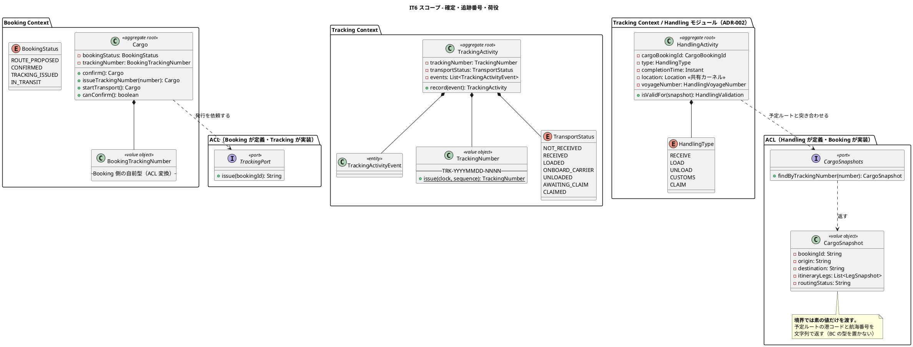
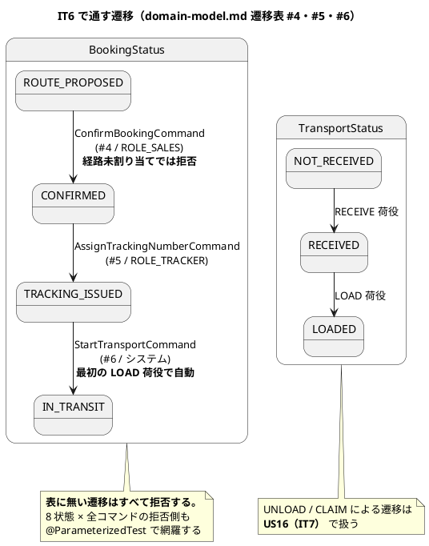
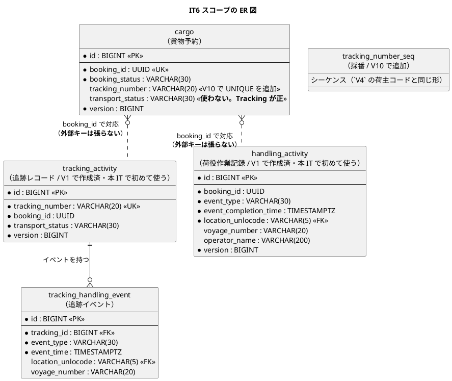
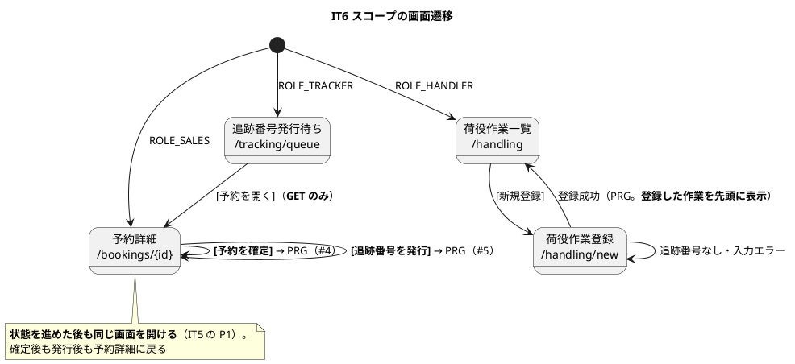

# イテレーション 6 計画

## ゴール

**予約を確定し、追跡番号を発行し、荷役作業を記録できるようにする。**
これにより「予約 → 経路 → 確定 → 追跡番号 → 荷役 → 輸送中」が一本つながる。

| 項目 | 内容 |
| :--- | :--- |
| リリース | Release 1.0（追跡） |
| 局面 | **中盤（インサイドアウト）** — `development_strategy.md` |
| 計画 SP | 8 |
| 完了 SP | **8**（実装完了。クローズは `closing-iteration` で行う） |
| 前提 | IT5 完了（経路の確定と紐付け。確定の入力が揃っている） |

**本 IT で Release 1.0 が完成する。** ウォーキングスケルトンが端から端まで通り、
以降のイテレーション（IT7 以降）は既存の骨格に肉付けする局面に移る。

**本 IT は Tracking Context の初出である。** `tracking` パッケージには現在
`package-info.java` しか無く、集約・リポジトリ・画面のすべてを新設する。
Handling は独立した BC ではなく **Tracking Context 内のモジュール**である（ADR-002）。

---

## 前イテレーションからの引き継ぎ

IT5 のふりかえり（[retrospective-5.md](retrospective-5.md)）の Try と持ち越しを、本計画の
タスク・成功基準・DoD に落とし込む。

### Try の反映

| Try | 本計画での扱い |
| :--- | :--- |
| T1 **状態を進める操作を作ったら、進めた後にもう一度同じ画面を開く** | **DoD の到達性に追加。** 本 IT は状態を 3 回進める（確定・追跡番号発行・積込）。**それぞれの直後に同じ画面を開く**ことを確認項目にする。P1（到達性の抜け 4 回連続）への直接の対策 |
| T2 **例外処理を足したら、同じ例外を投げる経路を `grep` で数える** | **DoD に追加。** 本 IT は `InvalidBookingStatusTransitionException` を投げる入口を 3 つ増やす（確定・発行・荷役による自動遷移）。**同じ層の別の入口も数える** |
| T3 **「1 ファイルだけを読む検査」を作らない** | **タスク 0-4。** IT5 の P3（`V800` だけを読んでいた検査）を、`db/seed` 配下すべてを読む形に直す。**本 IT で seed を増やさなくても直す**（増えた瞬間に効かなくなるため） |
| T4 **クローズ前のデプロイ確認で、権限の無い操作を 1 つ必ず送る** | **DoD に追加。** 本 IT は `POST` を 3 つ増やす。**ROLE_HANDLER で `POST /bookings/{id}/confirm` を送る**（403 の画面が返ることを実環境で確認） |
| T5 **新しいマッパー・設定は既存の同種と書き方を突き合わせる** | **タスク 3-5。** 本 IT は新規マッパーを 2 つ作る（`TrackingActivityMapper`・`HandlingActivityMapper`）。**UUID の型ハンドラを明示する**（IT5 の P5） |
| T6 **パッケージを新設したら `package-info` を同じコミットで書く** | **DoD に追加。** 本 IT は Tracking Context の初出であり、**新設パッケージが最も多いイテレーション**である |
| T7 依存の更新をイテレーション開始時に置く | **タスク 0-0**（先頭） |
| T8 返済枠を最初から時間で確保する | **タスク 0 として 8 時間確保** |

### 持ち越しの返済枠

| # | 内容 | 本計画での扱い |
| :--- | :--- | :--- |
| C1 | **確定時の空き容量の再判定**（レビュー M3） | **US13 のタスクに含める**（返済枠ではない）。確定を実装する本 IT が、再判定を置く唯一の適切な場所である |
| C2 | 確定した経路の取り消し | 本 IT では対応しない。**IT8（US10）で判断**（IT5 の結論を維持） |
| C3 | 同じ航海の区間を添字で絞る（レビュー L1） | **タスク 0-1**（返済枠） |
| C4 | US34（荷主セルフサービス） | 本 IT では対応しない。IT9 |
| C5 | **並行操作の画面レベル検証**（方法は IT5 で決定済み・実装は未） | **タスク 0-2**（返済枠）。決めた方法（衝突するリポジトリに差し替えてフラッシュメッセージを検証）で実装する。**決めたまま実装しないと、決めたこと自体が忘れられる** |

### IT5 レビュー指摘の扱い

[IT5 実装レビュー](../review/IT5実装_review_20260807.md)に**高（H）優先度の未対応は無い**（H は本 IT 内で修正済み）。中・低の扱いは次のとおり。

| # | 指摘 | 本計画での扱い |
| :--- | :--- | :--- |
| M1 | Jig が `RouteProposalMapper` を読み飛ばしていた | IT5 内で修正済み。**再発防止をタスク 2-5 に置く**（新規マッパー 2 件の書き方を既存と突き合わせる） |
| M2 | 確定した経路を取り消せない | **IT8（US10）で判断**（据え置き） |
| M3 | 空き容量が確定の瞬間に再判定されない | **タスク 1-1 で対応**（C1） |
| M4 | 管理画面にロック以外のアカウント操作が無い | **US 化されていない。** 本 IT でも起票しない（US33 の範囲は解除のみ） |
| L1 | 区間を時刻で絞っている | **タスク 0-1 で対応**（C3） |
| L2 | 管理画面の解除履歴が画面から読めない | 監査ログには残る。**据え置き**（必要になった時点で起票） |
| L3 | マニュアルのキャプチャに丸数字の書き込みが無い | 既存章と同じ扱い。**据え置き** |

---

## ユーザーストーリー

### 対象ストーリー

| ID | ユーザーストーリー | SP | 優先度 | Issue |
| :--- | :--- | :--- | :--- | :--- |
| US13 | 予約を確定する | 3 | 必須 | [#491](https://github.com/k2works/case-study-cargo-tracker/issues/491) |
| US14 | 追跡番号を発行する | 2 | 必須 | [#492](https://github.com/k2works/case-study-cargo-tracker/issues/492) |
| US15 | 荷役作業を記録する | 3 | 必須 | [#493](https://github.com/k2works/case-study-cargo-tracker/issues/493) |
| | **合計** | **8** | | |

> Issue 番号はステップ 5（GitHub 同期）で確定する。

### 受入基準

受入基準の正典は [ユーザーストーリー](../requirements/user_story.md) である。**本計画に書き写さず引用する。**

- US13: [US13 の受入基準](../requirements/user_story.md#us13-予約を確定する)
- US14: [US14 の受入基準](../requirements/user_story.md#us14-追跡番号を発行する)
- US15: [US15 の受入基準](../requirements/user_story.md#us15-荷役作業を記録する)

### 受入基準のうち本 IT で満たさないもの

| 内容 | 扱い | 理由 |
| :--- | :--- | :--- |
| US13「経路設計者に追跡番号発行依頼の**通知**が送信される」／「キャンセル時、荷主に**確認通知**が送信される」 | **実装しない。** 画面上の「追跡番号発行待ち」一覧（タスク 4-2）で代替する | **ADR-006**（外部システム連携は実装せず内部シミュレーションで代替する）。メール送信は実装対象外である。**通知の代わりに「待ち行列が見える」ことで業務は回る**（IT3 の経路割り当て待ちと同じ形） |
| US14「荷主に追跡番号と追跡方法を**メール通知**する」 | **実装しない。** 予約詳細に追跡番号を表示する | 同上（ADR-006） |
| US15「記録後、荷主に**状態変更通知**が送信される」 | **実装しない。** 追跡番号の照会（US18 / IT7）で参照する | 同上（ADR-006） |
| US15「追跡番号の**スキャン**で貨物を特定できる」 | **手入力のみ実装する。** カメラスキャンの UI は作らない | カメラ入力は端末依存であり、本ケーススタディの検証対象外。**押しても何も起きないボタンを置かない**（IT4・IT5 と同じ扱い） |
| US13「荷主がルート変更を希望する場合、予約を『経路設計中』に戻せる」 | **本 IT では実装しない。** 設計への反映 #6 として `domain-model.md` に注記し、**US10（IT8）で扱う** | **`CONFIRMED → ROUTE_PROPOSED` は状態遷移表（正典）に無い。** 表に無い遷移は拒否するのが不変条件であり、**受入基準を優先して実装すると正典が壊れる。** 確定前の予約は `ROUTE_PROPOSED` のままであり、経路の選び直しは現状でもできる |
| US13「荷主がキャンセルを希望する場合、キャンセル状態に変更できる」 | **本 IT では実装しない。** 遷移 #9 は複数状態から到達し、US30（輸送中キャンセル）と地続きである | キャンセルは 4 状態から実行でき、**確定のストーリーに混ぜると確定の検証が薄まる**。Release 1.1 以降で独立して扱う |

---

## 設計への反映が必要（当該 IT で対応）

計画作成時の突合で見つかった、**設計ドキュメント・スキーマ側の欠落**である。

| # | 内容 | 対応 |
| :--- | :--- | :--- |
| 1 | **追跡管理者が予約詳細を開けない。** `ui_design.md` の画面一覧は予約詳細を `ROLE_SHIPPER, ROLE_SALES` としているのに、同じ文書の「アクションボタンの出し分け」は `[追跡番号を発行]` を **ROLE_TRACKER** に表示すると定めている。**押す人が画面を開けない** | **タスク 4-1・5-1。** 画面一覧に `ROLE_TRACKER` を追加する。**IT3 で経路設計者に予約詳細を開いたときと同型**（GET のみ許可） |
| 2 | **追跡管理者の作業入口が無い。** 「確定済みで追跡番号が未発行の予約」を探す一覧が定義されていない。navbar にも ROLE_TRACKER の項目は例外管理（IT10）しか無い | **タスク 4-2・5-1。** `/tracking/queue`（追跡番号発行待ち）を新設し、画面一覧・navbar・ダッシュボード・遷移図に追加する。**IT3 の `/routing/queue` の先例に揃える** |
| 3 | **`cargo.tracking_number` に UNIQUE が無い。** 受入基準は「追跡番号は一意に採番される」と定めるが、DB は重複を受け付ける（`tracking_activity.tracking_number` にのみ UK がある） | **タスク 3-1。** `V10` で `cargo.tracking_number` に UNIQUE を追加する。**採番はシーケンスで行う**（`V4` の荷主コードの先例。MAX+1 は同時採番で衝突する） |
| 4 | **`TransportStatus` の所有が矛盾している。** `domain-model.md`・ADR-005 は「Tracking Context が所有・他 BC は ACL 経由」と定めるのに、`cargo.transport_status` の列があり、Booking の値オブジェクト `Delivery` も `transportStatus` を持つ | **タスク 1-2・5-1。** **Booking は `transport_status` を書かず、`Delivery` を本 IT では導入しない。** 正は `tracking_activity.transport_status` である。`data-model.md` に「未使用・Tracking が正」と明記し、`domain-model.md` の `Delivery` に「導入時も `TransportStatus` は持たない」と注記する。**IT5 の `CargoRoutingStatus` と同じ整理**（値の重複ではなく所有の明確化） |
| 5 | **誤配の警告には Booking の予定ルートが要る。** US15 の「作業場所が予定ルートと異なる場合、警告が表示される」は、Handling が `Cargo` の旅程を読む必要がある | **タスク 2-4。** ACL ポート（Handling → Booking）を定義する。**境界では素の値だけを渡す**（IT4 で ArchUnit に捕まった形を繰り返さない） |
| 5-1 | **ACL ポート名と値オブジェクト名が衝突している。** `domain-model.md` は ACL ポート一覧（正典）でポート名を `CargoSnapshot` としながら、同じ文書の Handling モジュールで `CargoSnapshot` を**値オブジェクト**として定義している。同名の 2 つは実装できない | **タスク 2-4・5-1。** ポートを `CargoSnapshots`（複数形）に改め、返す値を値オブジェクト `CargoSnapshot` とする。**IT5 の `CargoRouteAssignments` と同じ形**（ポートは複数形・運ぶ値は単数形）。ACL ポート一覧を修正する |
| 5-2 | **Handling の航海番号の型名が文書内で割れている。** Handling モジュールの図は `VoyageNumber`、「VoyageNumber のコンテキスト分離設計」の表は `HandlingVoyageNumber` と書いている | **タスク 5-1。** **`HandlingVoyageNumber` を採る**（分離設計の表が具体的であり、Routing の `VoyageNumber` と同名では分離の意味が消える）。図を修正する |
| 5-3 | **Handling の作業場所は共有カーネルの `Location` である**（`domain-model.md`）。コンテキスト固有型を作らない | 実装で `Location` を使う。**共有カーネルは `Location` と `ShipperId` の 2 つのみ**（ADR-005）であり、ArchUnit が検査する |
| 5-5 | **ACL ポート一覧（正典）に、実装済みのポートが載っていない。** IT5 で実装した `CargoRouteAssignments`（Routing → Booking。確定した経路を貨物に割り当てる）が一覧に無く、代わりに `RoutingStatusPort`（Booking → Routing）という**呼び出し方向が逆のポート**が載っている | **タスク 5-1。** 実装が正であり、一覧を修正する。**契約の正典に実装と違う契約が載っていると、次に読む人はそちらを信じる**（本 IT で新設する 2 ポートの置き場を決めるとき、実際に読み違えかけた） |
| 5-4 | **Booking 側に追跡番号の型が無い。** `cargo.tracking_number` の列はあるが、`domain-model.md` の Booking の値オブジェクト一覧に追跡番号が無い | **タスク 1-2・5-1。** Booking 側の値オブジェクト `BookingTrackingNumber` を新設し、一覧に追加する。**Tracking の `TrackingNumber` を参照しない**（`Leg` が航海番号を文字列で持つのと同じ理由） |
| 6 | **US13 の受入基準と状態遷移表（正典）が矛盾している**（「経路設計中に戻せる」） | **タスク 5-1 で `domain-model.md` に注記する。** 判断は US10（IT8）。**矛盾を見つけたまま黙って実装しない** |
| 7 | **開発戦略の局面表が IT7〜IT8 のままである。** `release_plan.md` は IT4 の開始準備で IT11 まで拡張したのに、`development_strategy.md` の終盤は IT7〜IT8 と書かれている | **タスク 5-2。** 終盤を IT7〜IT11 に修正する。IT6 が中盤である点は両文書で一致しており本 IT の進め方には影響しないが、**次の IT の開始準備で読む文書がずれている** |
| 8 | **E2E（Playwright）の有効化イテレーションが IT6 である**（`development_strategy.md` の品質ゲート表）。現在 `playwright.manual.config.js`（マニュアルのキャプチャ用）しか無く、アプリの E2E 基盤は無い | **タスク 6-1・6-2。** 本 IT で基盤を用意し、**クリティカルパス 1 本（予約 → 確定 → 追跡番号 → 荷役）を緑にする。** 終盤の 3 本（US13 / US15 / US18）は IT7 以降に足す |

> **IT2 はカラム、IT3 はマスタデータ、IT4 は値の出どころ、IT5 は「実行できる人」、IT6 は
> 「実行する人の入口」の欠落**である。5 回とも「作ったが使えない」型であり、**着手前の突合でしか見つからない。**

---

## 設計（IT6 スコープ）

### ドメインモデル図

> **`TransportStatus` を Booking に持ち込まない。** ADR-005 のとおり所有は Tracking Context であり、
> Booking が必要とするのは「輸送が始まったか」だけである。**9 値を写すのではなく、
> 必要な粒度に変換する**（`BookingTrackingNumber` は追跡番号の文字列だけを持つ）。

### 状態遷移図（IT6 スコープ）

### ER 図（IT6 スコープ）

> **BC をまたぐ参照に外部キーは張らない**（`data-model.md`）。`cargo` と `tracking_activity`・
> `handling_activity` の間がこれにあたる。`tracking_handling_event.tracking_id` は BC 内の参照であり
> 外部キーを張る（V1 の DDL どおり）。

### 画面遷移図（IT6 スコープ）

### インタラクション（IT6 スコープ）

| 対象 | 方式 | 内容 |
| :--- | :--- | :--- |
| `[予約を確定]` / `[追跡番号を発行]` | **PRG** | `POST` → リダイレクトで予約詳細へ。**成功は `alert-success` のフラッシュメッセージ**（既存の予約操作と同じ） |
| 荷役作業登録 | **PRG**（htmx は使わない） | 成功時は `/handling` へリダイレクトし、**登録した作業を先頭に表示する**（`ui_design.md` の仕様）。入力エラーはフォームを再表示する（自己ループ） |
| 追跡番号が存在しない | フォーム再表示 | `alert-danger`。**どの追跡番号が見つからなかったかを本文に含める** |
| 予定ルートと異なる場所 | 登録は成功・警告を表示 | `alert-warning`。**`LOAD` / `UNLOAD` は経路状態が `MISROUTED` になったことを明示する** |
| 楽観的ロックの衝突 | フォーム再表示 | `alert-warning`（IT5 のタスク 0-2 で実装する形と揃える） |

> **本 IT で htmx を使う画面は無い。** 部分更新が要るのは経路割り当て（IT4・IT5）のような
> 「選びながら比べる」画面であり、本 IT の 3 画面はいずれも 1 回の送信で完結する。

> **新設する画面は `/tracking/queue`・`/handling`・`/handling/new` の 3 つ。** 予約詳細には
> ボタンを 2 つ足し、**ROLE_TRACKER に GET を開く。** navbar に「貨物追跡」「荷役管理」を追加する。

---

## タスク分解

### 0. 先に片付ける（上限 8 時間。IT5 ふりかえり T7・T8）

| # | タスク | 見積 |
| :--- | :--- | :--- |
| 0-0 | **依存の更新を先に行う**（`gradlew dependencies --write-locks` → Trivy 0 件を確認） | 1h |
| 0-1 | 同じ航海の区間を添字で絞る（C3。現状は時刻の範囲） | 3h |
| 0-2 | 並行操作の画面レベル検証を実装する（C5。IT5 で決めた方法で） | 2h |
| 0-3 | 「1 ファイルだけを読む検査」を直す（T3。`db/seed` 配下すべてを読む） | 2h |

### 1. ドメイン（インサイドから固める）

**画面はまだ触らない。**

| # | タスク | 見積 |
| :--- | :--- | :--- |
| 1-0 | **既存集約の状態遷移を先に読む**（T1 / IT5 T1 の継続）。`Cargo.assignItinerary` と遷移の拒否の書き方を確認する | 1h |
| 1-1 | Booking: `Cargo.confirm`。**経路未割り当てでは拒否**（遷移 #4 の事前条件）。**確定の瞬間に空き容量を再判定する**（C1 / レビュー M3） | 4h |
| 1-2 | Booking: `BookingTrackingNumber`（設計反映 #5-4）と `Cargo.issueTrackingNumber` / `startTransport`（遷移 #5・#6）。**`transport_status` は書かず `Delivery` も導入しない**（設計反映 #4） | 3h |
| 1-3 | Booking: **8 状態 × 全コマンドの拒否側を `@ParameterizedTest` で網羅する**（不変条件） | 3h |
| 1-4 | Tracking: `TrackingActivity` / `TrackingNumber`（`TRK-YYYYMMDD-NNNN`）/ `TransportStatus`。**日付は業務タイムゾーンの `Clock` で決める** | 4h |
| 1-5 | Handling: `HandlingActivity` / `HandlingType` / `HandlingVoyageNumber`。**`LOAD` / `UNLOAD` は航海番号必須**（デシジョンテーブル） | 4h |
| 1-6 | Handling: 妥当性検証（デシジョンテーブルどおり）。**`RECEIVE` は出発港と不一致で警告、`LOAD` / `UNLOAD` は積込港・荷降港と不一致で `MISROUTED` 確定。** 確定時は Booking の経路状態を `MISROUTED` に更新する（ビジネスルール 1）。**どちらも登録は拒否しない**（起きた事実は記録する） | 4h |

### 2. 永続化

| # | タスク | 見積 |
| :--- | :--- | :--- |
| 2-1 | `V10__tracking_number.sql`（`cargo.tracking_number` の UNIQUE ＋ 採番シーケンス）。**`setval` は `postgresql/` に隔離する**（V4 の先例） | 2h |
| 2-2 | `TrackingActivityRepository`（`tracking_activity` ＋ `tracking_handling_event` の往復）。**イベントは時系列順に読み戻す** | 3h |
| 2-3 | `HandlingActivityRepository` | 2h |
| 2-4 | ACL ポート `CargoSnapshots`（Handling 側に定義・Booking 側にアダプタ。設計反映 #5-1）／ `TrackingPort`（Booking 側に定義・Tracking 側にアダプタ）／ 経路状態を `MISROUTED` にする経路（Handling → Booking）。**境界は素の値** | 5h |
| 2-5 | **新規マッパー 2 件の書き方を既存と突き合わせる**（T5。UUID の型ハンドラを明示する） | 1h |
| 2-6 | Testcontainers で往復を固定。**H2 方言スモークに新クエリを追加** | 2h |

### 3. アプリケーションと画面

| # | タスク | 見積 |
| :--- | :--- | :--- |
| 3-1 | 予約詳細に `[予約を確定]`（ROLE_SALES）・`[追跡番号を発行]`（ROLE_TRACKER）を追加。**ボタンの出し分けは集約の述語をそのまま呼ぶ** | 4h |
| 3-2 | `/tracking/queue`（追跡番号発行待ち一覧・ROLE_TRACKER）。**予約詳細を ROLE_TRACKER に GET のみ開く** | 3h |
| 3-3 | `/handling`（一覧）・`/handling/new`（登録フォーム・ROLE_HANDLER）。**追跡番号が存在しない場合のエラー**・**誤配の警告** | 5h |
| 3-4 | navbar・ダッシュボードに「貨物追跡（発行待ち）」「荷役管理」を追加。**認可**（URL 直打ちでも開けない） | 2h |

### 4. E2E（品質ゲートの有効化。開発戦略の設計反映 #8）

| # | タスク | 見積 |
| :--- | :--- | :--- |
| 4-1 | Playwright の E2E 基盤（アプリ用の設定・起動・シード）を用意する | 4h |
| 4-2 | **クリティカルパス 1 本を緑にする**（予約 → 引き渡し → 経路確定 → 予約確定 → 追跡番号 → 積込 → 輸送中）。**壊すと赤になることを確認する** | 4h |

### 5. ドキュメント

| # | タスク | 見積 |
| :--- | :--- | :--- |
| 5-1 | `ui_design.md`（予約詳細のロール・`/tracking/queue`・navbar・遷移図）／`domain-model.md`（ACL ポート一覧を実装に合わせる：`CargoSnapshots` への改名・`CargoRouteAssignments` の追加・`RoutingStatusPort` の削除・Handling の航海番号を `HandlingVoyageNumber` に・`BookingTrackingNumber` の追加・`Delivery` の注記・US13 の受入基準と遷移表の矛盾を注記）／`data-model.md`（`cargo.transport_status` は未使用・`tracking_number` の UNIQUE） | 5h |
| 5-2 | `development_strategy.md` の局面表を IT7〜IT11 に修正する（設計反映 #7） | 1h |
| 5-3 | マニュアル: 予約確定・追跡番号発行を「03. 予約管理」に、**荷役作業の章を新設**。キャプチャを再生成する | 5h |

**合計見積: 79 時間**（先に片付ける 8 時間を含む）

> **本 IT は見積が大きい。** Tracking Context の初出（集約 2・リポジトリ 2・ACL 2・画面 3）に
> E2E 基盤の立ち上げが重なるためである。**8SP を超える計画は立てない**という原則は
> ストーリーの範囲に対するものであり、**基盤の立ち上げは SP に計上しない**（IT1 と同じ扱い）。
> ただし**時間としては過去最大**であり、リスク R6 として扱う。

---

## リスク

| # | リスク | 影響 | 対応 |
| :--- | :--- | :--- | :--- |
| R1 | **追跡番号が重複する。** `MAX + 1` で採番すると同時発行で衝突する | 発行に失敗し、原因が現場に分からない | **シーケンスで採番する**（V4 の荷主コードの先例）。**UNIQUE 制約を先に入れ、重複を試みると落ちることを実測する** |
| R2 | **確定と追跡番号発行が別 BC への書き込みを伴い、片方だけ成功する** | 確定済みなのに追跡できない予約 | 1 つのトランザクションで書く。**失敗したら両方とも書かない**ことをテストで固定する（IT5 の R1 と同型） |
| R3 | **荷役の自動遷移が「最初の LOAD」以外でも走る** | `IN_TRANSIT` に戻る・二重遷移 | 遷移表 #6 は `TRACKING_ISSUED → IN_TRANSIT` のみである。**すでに `IN_TRANSIT` の貨物に LOAD を記録しても状態は動かない**ことをテストで固定する |
| R4 | **誤配の判定が「確かめていない偽」に戻る。** 予定ルートを読まなくても警告は出ないため、緑のまま通る | US15 の受入基準が形骸化する | **予定ルート外の港で登録すると警告（`RECEIVE`）・`MISROUTED`（`LOAD` / `UNLOAD`）になるテストを先に赤にする。** 判定を外すと落ちることを実測する。**予定ルートと一致する便しか使わないテストにしない**（IT5 の「判別しないテスト」の教訓） |
| R5 | **追跡番号の日付が UTC で決まる。** `TRK-YYYYMMDD` が業務日と 1 日ずれる | 現場の日付と一致しない番号 | **業務タイムゾーンの `Clock` を使う**（既存方針）。**`TZ=UTC` でテストを回す** |
| R6 | **見積 79 時間は過去最大である。** Tracking の初出と E2E 基盤が重なる | 未完了 | 先に片付ける枠は 8 時間を上限とし、超えたら C3 を IT7 へ送る。**E2E はクリティカルパス 1 本に絞る**（3 本は終盤）。**US13 / US14 / US15 は削らない** |
| R7 | **ROLE_TRACKER に予約詳細を開くと、書き込みの入口も開く** | 権限の越境 | **GET のみ許可**（IT3 の経路設計者と同型）。**ROLE_TRACKER で `POST /bookings/{id}/confirm` を送ると 403 の画面**になることを、MockMvc と**実環境の両方**で確認する（T4） |

---

## 完了の定義（DoD）

### 機能

- [ ] US13 / US14 / US15 の受入基準を満たす（**書き写さず引用する**）
- [ ] 「満たさないもの」に挙げた項目以外に、未達がない
- [ ] **遷移 #4・#5・#6 が状態遷移表（正典）どおりに動く**
- [ ] **経路未割り当ての予約を確定できない**（遷移 #4 の事前条件）

### ドメイン（中盤の完了条件）

- [ ] **8 状態 × 全コマンドの拒否側を `@ParameterizedTest` で網羅した**
- [ ] **確定の瞬間に空き容量を再判定する**（C1 / レビュー M3）
- [ ] **妥当性検証がデシジョンテーブルどおりに動く**（`RECEIVE` は警告 / `LOAD`・`UNLOAD` は `MISROUTED` 確定）
- [ ] **共有カーネルに `Location` と `ShipperId` 以外を増やしていない**（ArchUnit）
- [ ] **安全装置をすべて壊して赤を確認した**（遷移の拒否・追跡番号の一意性・航海番号必須・誤配判定・自動遷移の条件・認可・楽観的ロック）。壊した装置と落ちた件数をふりかえりに記録する
- [ ] **読み戻しでも装置が働く**ことを確認した（イベントの時系列・追跡番号）

### 品質

- [ ] `./gradlew check` が緑
- [ ] **`TZ=UTC ./gradlew test` が緑**（R5）
- [ ] CI が緑
- [ ] **E2E（Playwright）が緑。クリティカルパス 1 本が通り、壊すと赤になることを確認した**
- [ ] SonarQube Quality Gate が PASS（**解析の完了を待って読む**）
- [ ] Trivy HIGH / CRITICAL が 0 件（**イテレーション開始時にも確認済み**）
- [ ] ArchUnit の全ルールが緑（`test_strategy.md` §3.3 の 6 ルール）。**Handling が Booking を直接参照していない**（`CargoSnapshots` 経由のみ）
- [ ] **新設パッケージすべてに `package-info` を同じコミットで書いた**（T6）

### 到達性（T1・T4）

- [ ] **状態を進めた直後に、同じ画面をもう一度開いた**（確定後・発行後・積込後の 3 回）
- [ ] `/tracking/queue` が ROLE_TRACKER で開け、**他ロールは URL 直打ちでも開けない**
- [ ] `/handling` `/handling/new` が ROLE_HANDLER で開ける
- [ ] navbar・ダッシュボードから**追跡管理者と荷役作業員が到達できる**
- [ ] **変更した画面の `th:href` を数え、行き先ごとにロールを確かめた**（元からあるボタンも含む）
- [ ] **営業担当者・追跡管理者・荷役作業員の 1 日をなぞった**（ログインして、その人が押すボタンを順に押す）
- [ ] **デプロイ後に、権限の無い POST を 1 つ実際に送った**（403 の画面が返る。405 にならない。T4）

### 例外処理（T2）

- [ ] **同じ例外を投げる経路を `grep` で数え、すべてに同じ扱いを入れた**（層をまたぐ鏡像と、同じ層の別の入口の両方）

### ドキュメント

- [ ] `ui_design.md` / `domain-model.md` / `data-model.md` / `development_strategy.md` を**実装と同じイテレーションで**更新した
- [ ] マニュアルを更新し、キャプチャを再生成した（**荷役作業の章を新設**）

---

## 参照

- [リリース計画](release_plan.md)
- [開発戦略](development_strategy.md)
- [IT5 ふりかえり](retrospective-5.md)
- [IT5 実装レビュー](../review/IT5実装_review_20260807.md)
- [ユーザーストーリー](../requirements/user_story.md)
- [ドメインモデル設計](../design/domain-model.md)
- [データモデル設計](../design/data-model.md)
- [UI 設計](../design/ui_design.md)
- [非機能要件](../design/non_functional.md)
- [ADR-002: Handling Context の Tracking 統合](../adr/002-handling-context-tracking-integration.md)
- [ADR-005: 共有カーネルの範囲](../adr/005-shared-kernel-scope.md)
- [ADR-006: 外部システム連携は実装しない](../adr/006-external-integration-internal-simulation.md)

---

## 実績（実装完了時点）

### タスクの状態

| # | タスク | 状態 |
| :--- | :--- | :--- |
| 0-0〜0-3 | 依存の更新・区間の添字・並行操作の検証・シード検査 | 完了 |
| 1-0〜1-6 | ドメイン（確定・追跡番号・輸送開始・追跡レコード・荷役・妥当性検証） | 完了 |
| 2-1〜2-6 | 永続化・ACL 3 ポート・H2 方言スモーク | 完了 |
| 3-1〜3-4 | 予約詳細のボタン・発行待ち一覧・荷役画面・navbar | 完了 |
| 4-1・4-2 | E2E 基盤とクリティカルパス 1 本 | 完了 |
| 5-1〜5-3 | 設計ドキュメント・開発戦略・マニュアル | 完了 |

> **タスク 1-3（8 状態 × 全コマンドの拒否側の網羅）は既に実装済みだった。**
> `BookingStatusTransitionTest` が IT1 の時点で全 10 遷移を許可セルとして列挙し、
> 残りを拒否側として自動生成している。**遷移表の実装をコマンドオブジェクトの
> 実装まで待たなかった**ことが、ここで効いた。

### 壊して赤を確認した安全装置（14 件）

| 装置 | 落ちた件数 |
| :--- | :--- |
| 読み戻しの区間の添字 | 4 |
| 確定時の区間の絞り込み | 1 |
| 確定のトランザクション | 1 |
| 算出側の衝突処理 | 1 |
| シードの検査（利用者一覧・パスワード） | 3 |
| 確定の事前条件（経路の割り当て） | 1 |
| 誤配の判定（便を見ず場所だけで判定する） | 3 |
| E2E（最初の積込による輸送開始） | 1 |

**誤配の判定は、予定ルートに経由港を持たせて初めて判別した。** 端点しか無い旅程だと、
「場所だけを見る実装」「積込港と荷降港を取り違える実装」がどちらも緑のまま通る。

### 計画外に見つけたもの

| 内容 | 対応 |
| :--- | :--- |
| **ACL が運ぶ値を相手の `domain.model` に置くと ArchUnit ルール 4 に落ちる** | ポートのパッケージに nested record として置いた（IT5 の `LegAssignment` と同じ形）。`domain-model.md` に理由つきで明記 |
| **追跡待ち一覧を Tracking に置くと BC 間参照になる** | 扱うのが予約であるため Booking に置いた（`RoutingQueueController` と同じ判断） |
| **荷役一覧がリポジトリを直接参照していた**（ArchUnit ルール 3） | クエリサービスを新設 |
| **Checkstyle のパラメータ数上限に 2 回当たった** | `ProposedRoute.Path` と `CargoProgress` としてまとめた。**どちらも「別々に持つと不正な組み合わせを作れる」値**であり、上限が設計の改善を促した |
| **MockMvc は forward 先の本文を描画しない** | 403 の検証を `forwardedUrl` に変更。`content` で見ると「確かめていない緑」になる |
| **E2E で確認ダイアログを受け入れないとフォームが送信されない** | `page.on('dialog')` を追加。押したつもりで何も起きない状態だった |
| **E2E の状態検証はバッジに限定する必要がある** | 「予約を登録しました（仮予約）」のような操作の説明文にも状態名が含まれる |
| **キャプチャが待ち行列の予約を使い回して落ちた** | 各節が自前で予約を登録する形にした |

### クローズ後の設計変更（2026-08-08）

**レビューを踏まえ、アーキテクチャの判断を 2 つ変更した。** どちらも IT6 のスコープ
（US13 / US14 / US15）を変えるものではないが、**その実装の形を変えている**。

| # | 変更 | 理由 |
| :--- | :--- | :--- |
| 1 | **ADR-010**: Handling を独立した BC へ昇格（ADR-002 を置き換え） | 実装すると言語が分岐していた。対応する型を 3 組も別々に定義しており、**統合されていたのではなく境界が引かれていなかった** |
| 2 | **ADR-009（改訂 1）**: BC 間の状態伝播をドメインイベントによる結果整合へ | 1 操作が 3 集約を 1 トランザクションで更新する形が重すぎた。**最も頻度が高く落としてはならない荷役の記録が、追跡や予約の都合で失敗する構造だった** |

> **SP は変えない。** ストーリーの範囲は変わっておらず、変わったのは実装の構造である。
> 設計の作り直しを SP に計上すると、ベロシティが「作った量」ではなく
> 「やり直した量」を含む数字になる。

### 品質

| 指標 | 値 |
| :--- | :--- |
| ArchUnit | 6 ルールすべて緑 |
| E2E（クリティカルパス） | 緑（壊すと赤になることを実測） |
| Trivy HIGH / CRITICAL | 0 件（**開始時に確認**。T7） |
| コミット数 | 19（クローズ後の設計変更を含む） |
