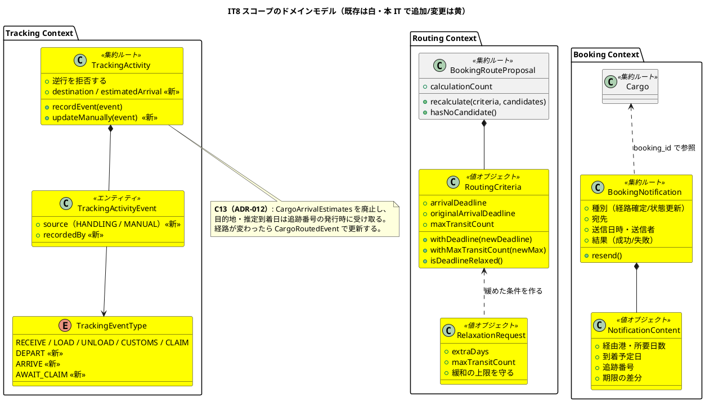
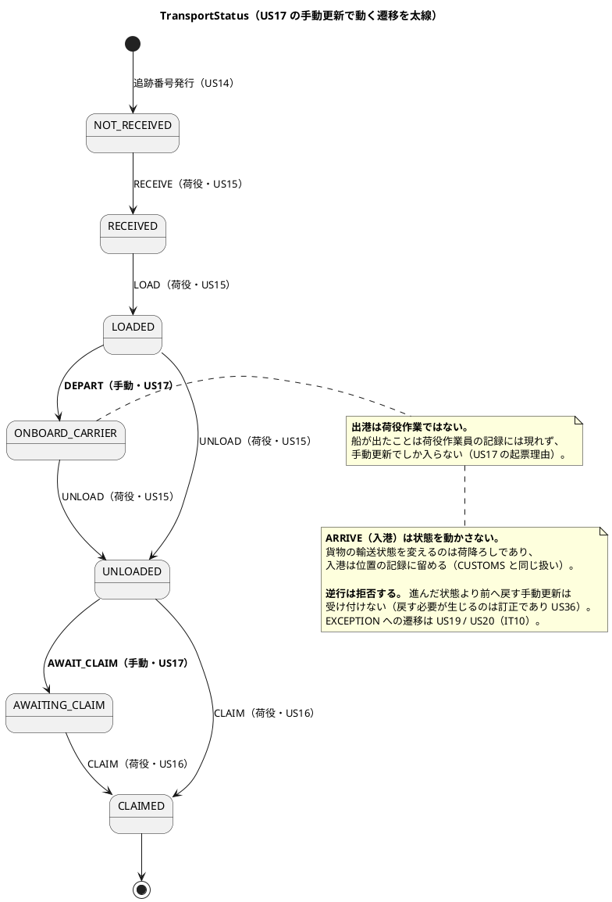
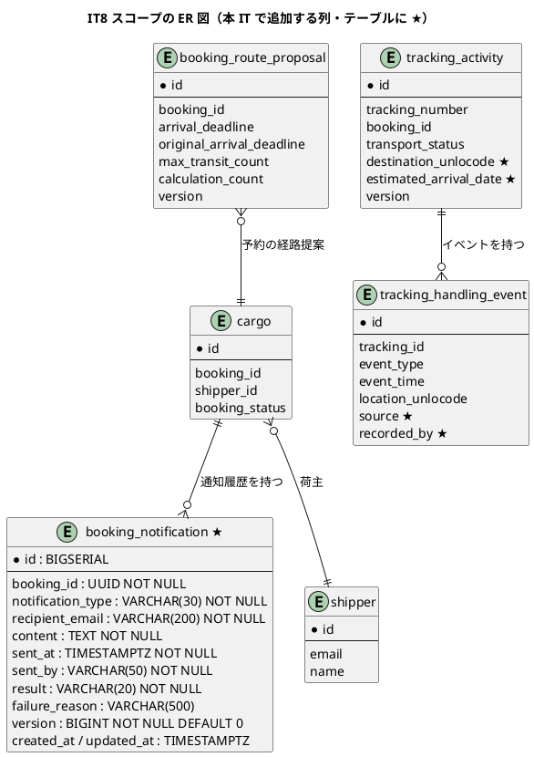
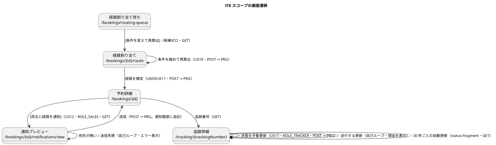

# イテレーション 8 計画

## ゴール

**候補が出なかった経路を条件を変えて出し直し、確定した経路を荷主に通知し、荷役では捕捉できない状態変化を追跡管理者が手で入れられるようにする。**
IT7 までで一本つながった線に、**業務が詰まったときに動かす手段**を付ける。

| 項目 | 内容 |
| :--- | :--- |
| リリース | Release 1.1（実運用に必要な補完） |
| 局面 | **終盤（アウトサイドイン）** — `development_strategy.md` |
| 計画 SP | 8 |
| 完了 SP | **8**（クローズ済み） |
| 前提 | IT7 完了（追跡照会・引取・法人荷主） |

**本 IT は「うまくいかなかったとき」を扱うイテレーションである。** IT1〜IT7 で作ったのは
順調に進む道であり、候補ゼロ・伝え漏れ・荷役では拾えない状態はいずれも
**業務が止まる側の事象**である。止まったときに人が手を入れられる形になっているかが、本 IT の判定基準になる。

**US10 のドメインは IT4 で既に書かれている**（`RoutingCriteria.withDeadline` /
`withMaxTransitCount` / `isDeadlineRelaxed`、`BookingRouteProposal.recalculate`）。
**このうち `withMaxTransitCount` と `isDeadlineRelaxed` は本番からもテストからも呼ばれていない**
（本計画のタスク 0-1 で実測）。IT7 の P1「宣言はしたが実装が無い」がそのままの形で残っている箇所であり、
**本 IT はその配線から始める。**

---

## 前イテレーションからの引き継ぎ

IT7 のふりかえり（[retrospective-7.md](retrospective-7.md)）の Try と持ち越しを、本計画の
タスク・成功基準・DoD に落とし込む。

### Try の反映

| Try | 本計画での扱い |
| :--- | :--- |
| T1 **「どこからも呼ばれないドメインメソッド」を検出する** | **タスク 0-1。** 本番で定義され本番から呼ばれない public メソッドを洗い出し、**表にして計画に残す**。US10 の 2 メソッドは本 IT で配線し、残りは「意図して残す／消す」を明記する |
| T2 **画面の案内文が指す先が画面に存在するかを確かめる** | **DoD の到達性。** 本 IT で増える案内文は「条件を緩めて再算出してください」「荷主に通知しました」「追跡管理者に連絡してください」。**それぞれの指す先をそのロールで開く** |
| T3 **計画のタスクをクローズ前に 1 つずつ実装と突き合わせる** | **タスク 5-0。** 「設計への反映が必要」表と「タスク分解」表を上から読み、対応するコードを指させるか確かめる |
| T4 **画面を後から直したらマニュアル項目表を必ず開く** | **DoD のドキュメント。** レビュー対応で欄を 1 つ足したら、`docs/manual/` の該当項目表を開き直す |
| T5 **付録 B への追記を DoD に入れる** | **DoD のドキュメント。** 本 IT で増えるメッセージ（候補ゼロ・逆行拒否・通知失敗）を付録 B から引けるようにする。**2 IT 連続で落としている** |
| T6 **レビューエージェントから回答が返らなければ自分で実施する** | **クローズ時の運用。** 返らなかった事実をレビューレポートに書く |
| T7 **利用者代表の視点を実装中に 1 回入れる** | **タスク 3-6。** 画面ができた時点で「経路設計者の朝」「営業の朝」「追跡管理者の朝」を通しでたどる。**2 IT 連続で高優先度の過半が利用者代表から出ている** |
| T8 依存の更新をイテレーション開始時に置く | **タスク 0-0**（先頭） |
| T9 返済枠を最初から時間で確保する | **タスク 0 として 8 時間確保** |
| T10 **「壊して赤」は入口と出口の両方で回す** | **DoD の安全装置。** 本 IT の判定は 3 つ（逆行する状態更新・期限の緩和量・通知の宛先）であり、**それぞれの結果が書かれる先**（`tracking_activity.transport_status`・`booking_route_proposal.arrival_deadline`・`booking_notification`）も壊す |

### 持ち越しの返済枠（上限 8 時間。T9）

| # | 内容 | 本計画での扱い |
| :--- | :--- | :--- |
| C12 | `/tracking/{trackingNumber}/status-fragment`（自動更新の取得先を分ける） | **タスク 0-2。** `ui_design.md` 内に**古い規則が 1 か所残っている**（htmx 節が `/status` を返すと書いている）。**US17 を実装する前に直す** |
| C10 | **レートリミットの残課題（ALB の背後で送信元 IP が潰れる）** | **タスク 0-5。** 「本番投入前に必要」であり、**本番が来てから直すものは来ない**。信頼するプロキシ段数を設定で持ち、`X-Forwarded-For` の最右から数えて実クライアントを取る |
| — | **JaCoCo レイヤー別ルールへの分割** | **タスク 0-3。** `development_strategy.md`「品質ゲートの段階的有効化」が **IT8** と定めている。全体ルールだけでは、DTO や Controller の薄いテストでドメイン層の穴を相殺できる |
| C13 | **`CargoArrivalEstimates` の廃止と発行時のデータ受け渡し**（ADR-012） | **タスク 2-3。** 返済枠ではなく **US17 の本体作業に含める**。同じ IT で Tracking の永続化を触るため、分けると 2 度触ることになる。**片方だけ入れると古い値が更新されないまま残る**ため、`CargoRoutedEvent` の購読と同時に入れる |
| C1 | 引取確認コードの採番と照合 | **US35 として起票し IT12 へ**（[US35](../requirements/user_story.md#us35-引取確認コードを採番して照合する)・[#509](https://github.com/k2works/case-study-cargo-tracker/issues/509)）。本 IT では扱わない |
| C2 | 引取の訂正・取消 | **US36 として起票し IT12 へ**（[US36](../requirements/user_story.md#us36-引取記録を訂正取り消しする)・[#510](https://github.com/k2works/case-study-cargo-tracker/issues/510)）。本 IT では扱わない |
| C3 | 荷役作業員が予約上の荷受人を確認できるようにする | 本 IT では対応しない。**US36（IT12）で引取記録の画面を触るときに併せる** |
| C4 | 遅れているかどうかの表示 | 本 IT では対応しない。**US19（IT10）** |
| C5 | 荷主の自社貨物一覧 | 本 IT では対応しない。**US34（IT9）** |
| C6 | 個人選択時に契約情報を捨てたことを伝える | **タスク 0-6**（1 行の警告。低コストで誤登録を防ぐ） |
| C7 | 公開追跡の問い合わせ先に電話番号と受付時間 | 本 IT では対応しない。**実在の連絡先を持っていない**（`operation.md` に窓口の定義が無い）。運用要件が決まるまで置く |
| C8 | 荷役作業一覧の絞り込みとページング | 本 IT では対応しない。**US36（IT12）** |
| C9 | 荷主詳細の登録日時・登録者 | 本 IT では対応しない。IT1 から継続（低） |
| C11 | イベントの取りこぼし（Outbox） | **本 IT では対応しない。** 本 IT で購読が 1 つ増える（`CargoRoutedEvent`）ため、**取りこぼしの観測点は増える**。ADR-009 の改訂は IT9 以降で判断する |

### IT7 レビュー指摘の扱い

[IT7 実装レビュー](../review/IT7実装_review_20260808.md)の高優先度 9 件は**すべて IT7 内で対応済み**である。
中・低 7 件は上表 C3〜C9 に対応しており、**本計画に現れない未対応の指摘は無い。**

---

## ユーザーストーリー

### 対象ストーリー

| ID | ユーザーストーリー | SP | 優先度 | Issue |
| :--- | :--- | :--- | :--- | :--- |
| US17 | 貨物状態を手動更新する | 3 | 中 | [#496](https://github.com/k2works/case-study-cargo-tracker/issues/496) |
| US10 | 経路条件を調整して再算出する | 3 | 中 | [#500](https://github.com/k2works/case-study-cargo-tracker/issues/500) |
| US12 | 確定経路を荷主に通知する | 2 | 中 | [#501](https://github.com/k2works/case-study-cargo-tracker/issues/501) |
| | **合計** | **8** | | |

> マイルストーンは 3 件とも `[java/take-6] Release 1.1 実運用補完`、ラベルは `it8` である。
> **java/take-6 には GitHub Project を作っていない。** イテレーションの割り当ては
> `it8` ラベルとマイルストーンで表す。

### 実装順序

**US10 → US12 → US17** の順に進める。US10 が期限の緩和を記録して初めて、
US12 の通知に「当初の期限から何日延びたか」を載せられる（`ui_design.md` 経路割り当て §候補ゼロ時の再算出）。
**US12 を先に作ると、載せる差分が無いまま「通知した」形だけが残る。**

### 受入基準

受入基準の正典は [ユーザーストーリー](../requirements/user_story.md) である。**本計画に書き写さず引用する。**

- US17: [US17 の受入基準](../requirements/user_story.md#us17-貨物状態を手動更新する)
- US10: [US10 の受入基準](../requirements/user_story.md#us10-経路条件を調整して再算出する)
- US12: [US12 の受入基準](../requirements/user_story.md#us12-確定経路を荷主に通知する)

### 受入基準のうち本 IT で満たさないもの

| 内容 | 扱い | 理由 |
| :--- | :--- | :--- |
| US17「状態変更の種類に応じて荷主への通知が送信される」 | **US12 で作る通知記録の仕組みに載せる。** 自動送信はせず、**手動更新の履歴を予約詳細の通知履歴に出す**ところまで | **ADR-006 により外部への送信は行わない**（内部シミュレーション）。「送った」と表示して実際には何も起きない形を作らない。通知の実体は記録であり、それを US12 で定義する |
| US12「送信できる」の**実際のメール送信** | **記録と結果表示までを実装する。** SMTP 連携はしない | ADR-006。`NotificationPort`（外部システム）は `domain-model.md` に定義があるが、**実装すると外部依存が入る**。本 IT は「送ったつもり」を検知できる状態にすることが目的である（`ui_design.md` の記述と一致） |
| US12「料金概算」 | **通知内容から外す。** 経由港・所要日数・到着予定日・追跡番号・期限の差分を載せる | 料金は **US21（Release 2.0）で算出する**。概算式（ADR-008）は経路候補の並べ替え用であり、**荷主に見せる金額として設計していない**。見せた瞬間に請求額として読まれる |
| US10「営業担当者に荷主との条件協議を依頼できる」 | **依頼の導線は作らない。** 候補ゼロのまま保留した予約が経路割り当て待ち一覧に「候補ゼロ」として残るところまで | **担当営業を予約から引ける手段がまだ無い**（`cargo` に担当者の列が無く、US34 の紐付けもまだ）。宛先の無い依頼ボタンを置かない |
| US17 の **`EXCEPTION` への手動更新** | **実装しない。** 例外は US19 / US20（IT10）で専用の登録経路を作る | 例外は種別・発生前状態・解決を伴い、**手動更新の 1 項目として扱うと `status_before` を書く場所が無い**（`data-model.md` の `tracking_exception_event`） |

---

## 設計への反映が必要（当該 IT で対応）

着手前の突合（`validating-iteration-plan` / `validating-design`）で見つかった差分。**当該 IT で設計ドキュメントに反映する。**

| # | 対象 | 内容 | 反映先 |
| :--- | :--- | :--- | :--- |
| 1 | `ui_design.md` htmx 節 | 「`/tracking/{trackingNumber}/status` は HTML フラグメントを返す」が残っている。**画面一覧では同じパスが US17 の POST**であり、同じ文書の中で矛盾している（C12） | `ui_design.md`（`status-fragment` に統一） |
| 2 | `ui_design.md` 経路割り当て | 再算出の送信先が `hx-post="/api/v1/routing/candidates"` になっている。**本システムに `/api/v1` の規約は無く**、既存の再算出は `POST /bookings/{bookingId}/route/proposals`（PRG）である | `ui_design.md` |
| 3 | `data-model.md` | **通知記録のテーブルが存在しない。** US12 の受入基準「通知送信記録が登録される」を満たす置き場が無い | `data-model.md`（`booking_notification` を追加） |
| 4 | `domain-model.md` | 通知記録の要素定義が無い。`NotificationPort`（外部システム）はあるが、**ADR-006 により実装しない**ため、記録側の定義が要る | `domain-model.md`（`BookingNotification` を要素表に追加） |
| 5 | `domain-model.md` / `TrackingEventType` | **`AWAITING_CLAIM`（引取待ち）へ遷移する手段が無い。** `UNLOAD → UNLOADED`、`CLAIM → CLAIMED` で、引取待ちがどの経路からも設定されない | `domain-model.md`（US17 の手動更新種別を定義） |
| 6 | `data-model.md` | `tracking_handling_event` に**記録の出どころ（荷役由来／手動）と記録者**の列が無い。手動更新を混ぜると「誰がいつ手で入れたか」を追えない | `data-model.md`（`source` / `recorded_by` を追加） |
| 7 | `data-model.md` / ADR-012 | `tracking_activity` に**目的地と推定到着日**の列が無い。C13 で `CargoArrivalEstimates` を廃止すると置き場が要る | `data-model.md`（`destination_unlocode` / `estimated_arrival_date` を追加） |
| 8 | `domain-model.md` | **`CargoRoutedEvent` が定義されていない。** ADR-012 が購読を前提にしている | `domain-model.md`（ドメインイベント表に追加） |
| 9 | `architecture_backend.md` | `CargoArrivalEstimates` を ACL ポート一覧から削除し、Booking → Tracking の一方通行を反映する | `architecture_backend.md` / `domain-model.md` の ACL ポート表 |
| 10 | `ui_design.md` | US17 の画面は**追跡詳細内の ROLE_TRACKER 専用パネル**であり、独立した画面ではない。画面一覧が POST のみを載せているため、入口が読み取れない | `ui_design.md`（画面一覧の備考） |
| 11 | `non_functional.md` | レートリミットの実クライアント判定（`X-Forwarded-For` と信頼するプロキシ段数）が未記載（C10） | `non_functional.md` / ADR-011 の改訂 |
| 12 | `test_strategy.md` §6.3 | レイヤー別ルールへの分割時期を「Release 1 の最終イテレーション」としているが、`development_strategy.md` は **IT8** と定めている。**本 IT で実施するため、実績として時期を確定させる** | `test_strategy.md` |
| 13 | `ui_design.md` 画面一覧 | **通知プレビュー画面（`/bookings/{bookingId}/notifications/new`）が画面一覧に無い。** US12 の記述は予約詳細の節にしかなく、独立した URL を持つことが読み取れない | `ui_design.md`（画面一覧・US と画面のトレーサビリティ） |

---

## 設計（IT8 スコープ）

### ドメインモデル図

**新しい集約は 1 つだけである**（`BookingNotification`）。終盤の手順「新しい集約はできるだけ作らない」に従い、
US10・US17 はいずれも既存集約の拡張で実現する。

### 状態遷移図（IT8 スコープ）

### ER 図（IT8 スコープ）

> **命名と鍵の規約は `data-model.md` に従う。** テーブル名は単数形、PK はサロゲートキー
> （`BIGSERIAL`）、集約ルートには `version`（判断 8）、監査カラム（`created_at` / `updated_at`）を持つ。
>
> `booking_notification` は `cargo` の子テーブルではなく **`booking_id` で参照する**。
> `tracking_activity` と同じ形であり、**参照整合性は書き込み側で保証する**（`data-model.md` の既定）。
>
> `source` の既定値は `HANDLING` とする。**既存行はすべて荷役由来である**ため、
> 後から手動と区別できなくなることはない。

### 画面遷移図（IT8 スコープ）

### インタラクション（IT8 スコープ）

| 画面 | 操作 | 方式 | 備考 |
| :--- | :--- | :--- | :--- |
| 経路割り当て | 条件を緩めて再算出 | `POST /bookings/{bookingId}/route/proposals` → PRG | **`/api/v1` は使わない**（設計反映 #2）。`[+3 日]` `[+7 日]` `[経由 +1]` はワンクリックで送る |
| 経路割り当て | 候補ゼロ | 空状態＋条件パネルを開いた状態 | 「条件に合う航路が見つかりませんでした」 |
| 予約詳細 | 通知プレビュー | `GET /bookings/{bookingId}/notifications/new` | 宛先（荷主のメール）と内容を確認してから送る |
| 予約詳細 | 通知送信 | `POST /bookings/{bookingId}/notifications` → PRG | 成功・失敗のどちらも履歴に残す。失敗時は `[再送]` |
| 予約詳細 | 通知履歴 | 常時表示 | 送信日時 / 送信者 / 送信先 / 種別 / 結果 |
| 追跡詳細 | 状態の手動更新 | `POST /tracking/{trackingNumber}/status` → PRG | ROLE_TRACKER のみ。種別・場所・日時を入力 |
| 追跡詳細 | 自動更新 | `GET /tracking/{trackingNumber}/status-fragment`（`hx-trigger="every 30s"`） | **更新と参照でパスを分ける**（設計反映 #1） |

---

## タスク分解

### 0. 先に片付ける（上限 8 時間。T8・T9）

| # | タスク | 見積 |
| :--- | :--- | :--- |
| 0-0 | 依存の更新（Gradle プラグイン・Spring Boot・ライブラリ）と `check` の緑確認 | 1.0h |
| 0-1 | **T1: 本番から呼ばれない public メソッドの洗い出し。** 本番コードで定義され本番から呼ばれないものを表にし、「本 IT で配線する／意図して残す／消す」を決める | 2.0h |
| 0-2 | **C12: `/status` と `/status-fragment` の規約統一。** `ui_design.md` の htmx 節を直し、実装より先に正典を 1 つにする | 1.0h |
| 0-3 | **JaCoCo をレイヤー別ルールへ分割**（`development_strategy.md` が IT8 と定める）。ドメイン / アプリケーション / インフラで閾値を分け、**違反を作って赤になることを確認する** | 2.0h |
| 0-5 | **C10: レートリミットの実クライアント判定。** 信頼するプロキシ段数を設定で持ち、`X-Forwarded-For` の最右から数える。**段数 0（直結）でヘッダを信用しないことをテストで固定する** | 1.5h |
| 0-6 | C6: 荷主種別を法人から個人へ変えたときに契約情報を捨てる旨の警告 | 0.5h |
| | **小計** | **8.0h** |

### 1. 受け入れテストとドメイン（US10・US17・US12 の不変条件）

**終盤はアウトサイドインである**（`development_strategy.md` 手順 1）。**業務シナリオの受け入れテストを先に書いて赤にしてから**、ドメインへ降りる。

| # | タスク | 見積 |
| :--- | :--- | :--- |
| 1-0 | **業務シナリオの受け入れテストを先に書く（赤）。** 「候補ゼロ → 条件を緩めて再算出 → 確定 → 荷主に通知」「出港を手で入れる」の 2 本を MockMvc の統合テストで書き、**落ちることを確認してから**下のタスクに入る | 3.0h |
| 1-1 | `RelaxationRequest`（緩和の要求）。**緩和量の上限を持つ**（無制限に延ばせると期限が意味を失う） | 3.0h |
| 1-2 | `TrackingEventType` に `DEPART` / `ARRIVE` / `AWAIT_CLAIM` を追加。**どの種別がどの状態に進むかは列挙型が持つ**（既存の規約） | 2.0h |
| 1-3 | `TrackingActivity.updateManually`。**逆行を拒否する**。`TrackingActivityEvent` に出どころ（HANDLING / MANUAL）と記録者を持たせる | 4.0h |
| 1-4 | `BookingNotification` と `NotificationContent`。**送信結果（成功・失敗）を持つ**。宛先が無い予約には作れない | 4.0h |
| 1-5 | `CargoRoutedEvent`（`shared/domain/event`）。ADR-012 の購読対象 | 1.5h |
| | **小計** | **17.5h** |

### 2. 永続化

| # | タスク | 見積 |
| :--- | :--- | :--- |
| 2-1 | `V16__notification_and_manual_tracking.sql`（`booking_notification` 新設、`tracking_handling_event` に `source` / `recorded_by`、`tracking_activity` に `destination_unlocode` / `estimated_arrival_date`） | 3.0h |
| 2-2 | `BookingNotificationRepository`（MyBatis）と Testcontainers のテスト | 3.5h |
| 2-3 | **C13（ADR-012）: `CargoArrivalEstimates` の廃止。** 追跡番号の発行時に目的地・推定到着日を渡し、`CargoRoutedEvent` の購読で更新する。**ArchUnit で Tracking → Booking の参照が 0 になることを確認する** | 6.0h |
| 2-4 | 手動更新イベントの読み書き（`source` を含む）とテスト | 2.0h |
| | **小計** | **14.5h** |

### 3. アプリケーションと画面（アウトサイドインの主戦場）

| # | タスク | 見積 |
| :--- | :--- | :--- |
| 3-1 | `ProposeRoutesCommandService` に緩和条件を受ける経路を追加（US10）。**`withDeadline` / `withMaxTransitCount` をここで配線する** | 3.0h |
| 3-2 | 経路割り当て画面の条件パネル（候補ゼロ時に開いた状態・`[+3 日]` `[+7 日]` `[経由 +1]`） | 4.0h |
| 3-3 | `ShipperContacts` ポート（Booking → Shipper の問い合わせ）と アダプタ。**逆向きのポートは作らない**（ADR-012 の規律） | 2.0h |
| 3-4 | 通知プレビューと送信（US12）。予約詳細に通知履歴を常時表示、失敗時は `[再送]` | 5.0h |
| 3-5 | 追跡詳細の手動更新パネル（US17・ROLE_TRACKER）と `status-fragment` の分離 | 4.5h |
| 3-6 | **T7: 利用者代表の視点を通す。** 「経路設計者の朝」「営業の朝」「追跡管理者の朝」を通しでたどり、到達性と文言を確かめる | 2.0h |
| 3-7 | 認可（`SecurityConfig`）。**`/tracking/{n}/status` は ROLE_TRACKER、`status-fragment` は照会できる全ロール**。宣言順に注意（IT7 の教訓） | 2.0h |
| | **小計** | **22.5h** |

### 4. E2E とテスト

| # | タスク | 見積 |
| :--- | :--- | :--- |
| 4-1 | E2E: 候補ゼロ → 条件を緩めて再算出 → 確定 → 荷主に通知（1 本） | 3.0h |
| 4-2 | E2E: 出港の手動更新が追跡詳細に現れる（既存のクリティカルパスに接続） | 2.0h |
| 4-3 | 安全装置を壊して赤を確認する（入口と出口の両方。DoD の表） | 3.0h |
| | **小計** | **8.0h** |

### 5. ドキュメント

| # | タスク | 見積 |
| :--- | :--- | :--- |
| 5-0 | **T3: 計画のタスクと実装の突き合わせ。** 「設計への反映が必要」13 件を 1 つずつコードで指す | 1.5h |
| 5-1 | 設計ドキュメントの反映（`ui_design.md` / `data-model.md` / `domain-model.md` / `architecture_backend.md` / `non_functional.md` / `test_strategy.md`） | 4.0h |
| 5-2 | マニュアル更新（`05-航路管理` 5.5 に条件変更、`04-貨物予約` に通知履歴、`07-追跡管理` に手動更新）＋**画面キャプチャの再生成** | 4.0h |
| 5-3 | 用語集・**付録 B**（T5）・索引 3 点同期 | 2.0h |
| | **小計** | **11.5h** |

**合計見積: 82.0h**

---

## ADR

| # | 判断 | 起票要否 |
| :--- | :--- | :--- |
| 1 | **通知は外部送信せず記録に留める** | **ADR-006 の適用であり新規起票はしない。** ただし `domain-model.md` の `NotificationPort` に「実装しない」と明記する |
| 2 | レートリミットの実クライアント判定（`X-Forwarded-For` と信頼するプロキシ段数） | **ADR-011 を改訂する**（新規は起票しない。同じ判断の続き） |
| 3 | `CargoArrivalEstimates` の廃止 | **ADR-012 の実施**。新規起票はしない |
| 4 | 手動更新で逆行を許さない | **起票しない。** ドメインの不変条件であり `domain-model.md` のビジネスルールに書く。**訂正の手段は US36 で別に作る** |

---

## スケジュール

| 日 | 内容 |
| :--- | :--- |
| 1 | タスク 0（返済枠 8h） |
| 2-3 | タスク 1（受け入れテストを赤にしてからドメイン） |
| 4-5 | タスク 2（永続化。C13 を含む） |
| 6-8 | タスク 3（アプリケーションと画面） |
| 9 | タスク 4（E2E と安全装置） |
| 10 | タスク 5（ドキュメント）・クローズ準備 |

---

## 完了条件

### デモ項目（`development_strategy.md`「デモ項目を受け入れ基準とする」）

1. 期限の厳しい予約で経路候補が 0 件になり、**空状態と条件パネルが開いた状態**で表示される
2. `[+7 日]` を押すと候補が現れ、**当初の期限から 7 日延びたことが予約詳細に残る**
3. 営業が予約詳細から通知をプレビューし、**宛先（荷主のメール）と期限の差分**を確認して送信できる
4. 送信後、**通知履歴に日時・送信者・宛先・結果**が現れる
5. 追跡管理者が出港を手動更新すると、追跡詳細の状態が「搭載中」になり、**履歴に「手動」と記録者**が出る
6. **戻す方向の手動更新は拒否され、理由が表示される**
7. 荷主・荷受人の追跡照会（公開・認証つきの両方）が IT7 と同じく動く

### 完了の定義（DoD）

#### 機能

- [ ] US17 / US10 / US12 の受入基準（正典を参照）が緑。**本計画「満たさないもの」に挙げた項目を除く**
- [ ] デモ項目 7 件が動作する
- [ ] US10 の実装で `withDeadline` / `withMaxTransitCount` / `isDeadlineRelaxed` が**本番から呼ばれている**（T1）

#### 終盤の完了条件（`development_strategy.md`）

- [ ] 業務シナリオが通しで動作する
- [ ] E2E のクリティカルパス 3 本（US13 / US15 / US18）が緑（既存）＋本 IT の 2 本
- [ ] ArchUnit の 6 ルール＋ADR-012 のルールがすべて有効

#### 品質

- [ ] `./gradlew clean check` が緑（Checkstyle 0 / SpotBugs 0 / ArchUnit / JaCoCo）
- [ ] **JaCoCo がレイヤー別ルールで検証している**（タスク 0-3）
- [ ] CI が緑・SonarQube Quality Gate が PASS（Bug 0 / Vulnerability 0 / 重複 3% 未満）

#### 安全装置（T10: 入口と出口の両方）

| # | 装置 | 入口（壊す） | 出口（壊す） |
| :--- | :--- | :--- | :--- |
| 1 | 逆行する手動更新の拒否 | 画面から前の状態を送る | `transport_status` が書き換わらないこと |
| 2 | 緩和量の上限 | 上限を超える延長を送る | `arrival_deadline` が動かないこと |
| 3 | 当初期限の保持 | 再算出を 2 回行う | `original_arrival_deadline` が変わらないこと |
| 4 | 宛先の無い予約への通知 | 荷主のメールが引けない予約で送信 | `booking_notification` に行が増えないこと |
| 5 | 手動と荷役の区別 | 手動更新を登録 | `source = 'MANUAL'` と `recorded_by` が入ること |
| 6 | `status` と `status-fragment` の認可 | ROLE_TRACKER 以外で POST | 403 になり、`status-fragment` は 200 のままであること |
| 7 | レートリミットの実クライアント判定 | 段数 0 で `X-Forwarded-For` を偽装 | ヘッダを信用せず接続元 IP で数えること |
| 8 | ArchUnit（ADR-012） | Tracking から Booking を import | ルールが赤になること |
| 9 | JaCoCo レイヤー別ルール | ドメインのテストを 1 本外す | ドメインの閾値で落ちること |
| 10 | `CargoRoutedEvent` の購読 | 経路を変更する | `estimated_arrival_date` が追随すること |

#### 到達性（ロール別・状態別。T2）

- [ ] 候補ゼロの予約から、経路設計者が条件パネルへ**一覧から到達できる**
- [ ] 経路確定済みの予約から、営業が通知プレビューへ到達できる
- [ ] 追跡管理者が、手動更新の対象になりうる状態（`LOADED` / `UNLOADED`）の貨物へ**一覧から到達できる**
- [ ] 画面の案内文が指す先を、**その文を読むロールで実際に開ける**

#### ドキュメント

- [ ] 「設計への反映が必要」13 件がすべて反映済み（タスク 5-0 で 1 件ずつ確認）
- [ ] マニュアルの本文・項目表・**画面キャプチャ**が実装と一致（T4）
- [ ] **付録 B に本 IT で増えたメッセージが載っている**（T5）
- [ ] 用語集・索引 3 点（`index.md` / 全体構成表 / `mkdocs.yml`）が同期

---

## リスク

| # | リスク | 影響 | 対策 |
| :--- | :--- | :--- | :--- |
| 1 | **C13（ADR-012）が US17 と同じテーブルを触る** | 競合して手戻り | **先に C13（タスク 2-3）を終えてから手動更新の永続化（2-4）に入る**。順序を計画で固定する |
| 2 | 通知が「送ったことにする」だけの実装になる | 業務価値が出ない | **送信記録の有無で判定する**（デモ項目 4）。ADR-006 の制約下で価値が出るのは記録である |
| 3 | 緩和量に上限が無く期限が形骸化する | 業務ルールの喪失 | タスク 1-1 で上限を持たせ、安全装置 2 で壊して赤にする |
| 4 | JaCoCo のレイヤー別分割で既存が赤になる | 着手が止まる | **タスク 0-3 で先に実測を取り、実測の少し下に閾値を置く**（`test_strategy.md` §6.3 の引き上げ手順） |
| 5 | 見積 82.0h が IT7（74.5h）を上回る | 期間超過 | 返済枠は 8h に固定済み。**超過が見えた時点で C6・4-2 を落とす**（順序を先に決めておく） |

---

## 更新履歴

| 日付 | 内容 |
| :--- | :--- |
| 2026-08-08 | 初版作成（`opening-iteration` ステップ 2）。IT7 のふりかえり T1〜T10・C1〜C13 を反映。C1 / C2 は US35 / US36 として起票し IT12 へ |

---

## 参照

- [リリース計画](release_plan.md)
- [開発戦略](development_strategy.md)
- [IT7 計画](iteration_plan-7.md) / [IT7 ふりかえり](retrospective-7.md) / [IT7 実装レビュー](../review/IT7実装_review_20260808.md)
- [ユーザーストーリー](../requirements/user_story.md)
- [ドメインモデル設計](../design/domain-model.md) / [データモデル設計](../design/data-model.md) / [UI 設計](../design/ui_design.md)
- [ADR-006 外部システム連携](../adr/006-external-integration-internal-simulation.md)
- [ADR-009 BC 間の状態伝播](../adr/009-domain-events-for-cross-context-propagation.md)
- [ADR-011 公開エンドポイントのレートリミット](../adr/011-public-endpoint-rate-limit.md)
- [ADR-012 BC 間の依存の向き](../adr/012-cross-context-dependency-direction.md)

---

## 実績（クローズ時点）

### 対象ストーリー

| ID | ストーリー | SP | 状態 |
| :--- | :--- | :--- | :--- |
| US17 | 貨物状態を手動更新する | 3 | **完了** |
| US10 | 経路条件を調整して再算出する | 3 | **完了** |
| US12 | 確定経路を荷主に通知する | 2 | **完了** |
| | **合計** | **8** | |

### 返済枠（6 件すべて実施）

| # | 内容 | 結果 |
| :--- | :--- | :--- |
| 0-0 | 依存の更新 | **25 件が未更新のまま残っていた。** `ben-manes.versions` を入れて機械で見えるようにした。Spring Boot 4.0.6 → 4.1.0、Gradle 9.2.1 → 9.7.0 ほか |
| 0-1 | 呼ばれないメソッドの洗い出し | 26 件を検出。**うち 1 件は機能の欠落**（法人契約を訂正できなかった） |
| 0-2 | `/status` と `/status-fragment` の規約統一 | `ui_design.md` の矛盾 2 件を是正 |
| 0-3 | JaCoCo のレイヤー別分割 | 4 レイヤーに分割。**壊して赤を確認済み** |
| 0-5 | レートリミットの実クライアント判定 | `trusted-proxy-count` で右から遡る。既定 0（ヘッダを信用しない） |
| 0-6 | 個人選択時の警告 | 登録画面に 1 行追加 |

### 計画外に見つけたもの

| # | 内容 | 扱い |
| :--- | :--- | :--- |
| 1 | **`Shipper.changeContract` がどこからも呼ばれていない。** 法人荷主の割引率を打ち間違えると直す手段が無かった（US32 を完了扱いにしていた） | 本 IT で修正 |
| 2 | **`micrometer-core` の上書きが古い方へ固定していた。** Boot 4.1.0 の管理版 1.17.0 に対し 1.16.6 で固定。`build.gradle` のコメントが警告していたとおりのことが 1 IT 後に起きた | 本 IT で棚卸し |
| 3 | **追跡管理者が手動更新の対象にたどり着けない。** 発行待ち一覧は発行時に予約が消えるため、発行後の貨物へ行く道が無かった | 本 IT で「追跡中の貨物」を追加 |
| 4 | **マニュアルの章内リンクが 1 つも飛んでいなかった。** 日本語の見出しにアンカーが付いていない | 本 IT で mkdocs の slugify を修正 |
| 5 | `HandlingType.misroutesOnLocationMismatch` が switch と二重宣言 | 削除 |
| 6 | `DiscountRate.asPercentage` の「画面で計算しない」が守られていない（変換は SQL 側） | 削除 |
| 7 | 付録 B に中身の無い見出し（「エラーメッセージ早見表」） | 削除 |
| 8 | 経路割り当て画面に「今後の提供です」が 3 か所残っていた（US10 が提供された） | 本 IT で削除 |

### 壊して赤を確認した安全装置（14 件）

| # | 装置 | 結果 |
| :--- | :--- | :--- |
| 1 | 逆行する手動更新の拒否 | 赤 |
| 2 | 緩和量の上限 | 赤 |
| 3 | 当初期限の保持 | 赤 |
| 4 | 宛先なしの通知を作らない | **最初は空振り**（画面経路では DB の NOT NULL に守られ到達しない）。集約を直接壊す単体テストを足して赤 |
| 5 | 経路未確定の通知を拒む（集約） | **最初は空振り**（組み立て側が先に弾く）。分けて確かめて赤 |
| 6 | 経路未確定の通知を拒む（組み立て） | 赤 |
| 7 | 手動と荷役の区別 | 赤 |
| 8 | 手動更新で選べない種別を拒む | **最初は空振り**（細工した POST を送るテストが無かった）。足して赤 |
| 9 | `/status` の認可（POST は ROLE_TRACKER のみ） | 赤 |
| 10 | `CargoRoutedEvent` の購読 | 赤 |
| 11 | 契約訂正の永続化 | 赤 |
| 12 | 個人荷主に契約を付けない | 赤 |
| 13 | マスタに無い港を拒む | 赤 |
| 14 | JaCoCo レイヤー別ルール | 赤（domain の分岐 0.74 / infrastructure の行 0.97 と、レイヤーごとに違う数字で落ちる） |

> **空振りが 3 件出た。** IT7 は「宣言はしたが実装が無い」を 6 件出したが、
> 本 IT で出たのはその隣にある **「実装はあるが確かめていない」** である。
> 受け入れテストが通る経路で先に弾かれる条件は、集約の守りを判別しない。

### 品質

| 指標 | 値 |
| :--- | :--- |
| テスト数 | **870**（IT7: 794） |
| 行カバレッジ | **93.2%** |
| 分岐カバレッジ | **73.2%** |
| 本番コード | 294 ファイル（IT7: 270） |
| テストコード | 73 ファイル（IT7: 67） |
| E2E | **6 件**（US10 の 1 本を追加、クリティカルパスを US12・US17 まで延伸） |
| マニュアルのキャプチャ | 34 件（5 件追加） |
| `./gradlew check` | 緑 |
| CI（Backend CI） | **緑**（一度赤 → ロック再生成で復旧） |
| SonarQube Quality Gate | **PASS**（Bug 0 / Vulnerability 0 / **Code Smell 0** / 重複 0.4%） |
| レビュー | 5 視点すべてが回答。高 11 件は**すべて IT8 内で対応** |

### ADR-012 の実施

`CargoArrivalEstimates` を廃止し、**booking パッケージは tracking を 1 件も参照しなくなった**
（残るのは tracking → booking のポート実装 1 本のみ）。Handling と同じ一方通行であり循環しない。
