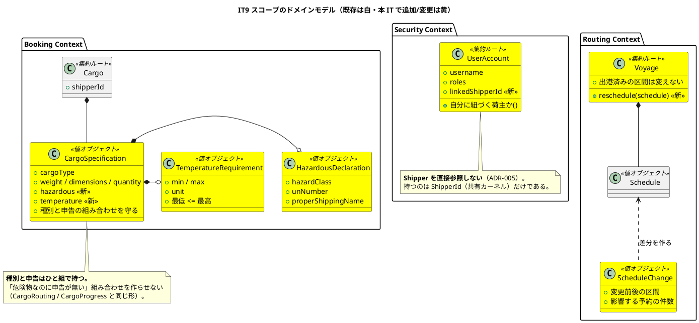
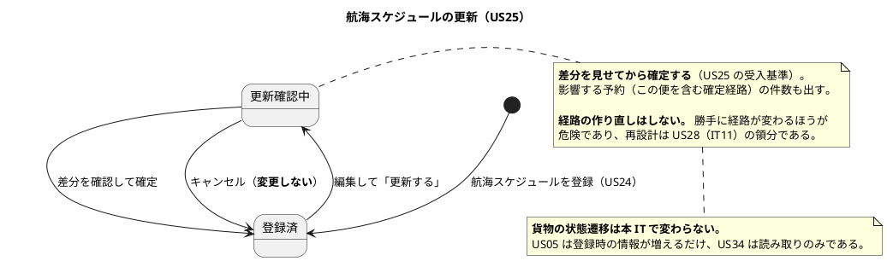
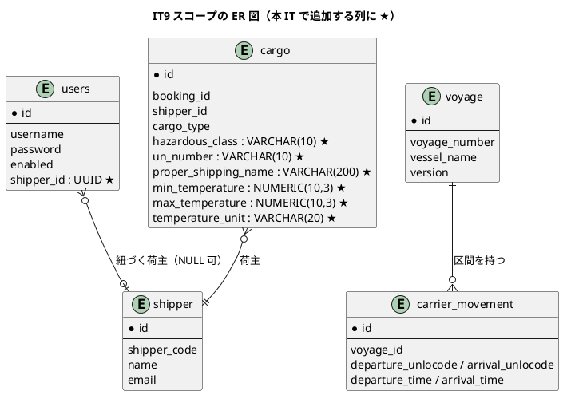
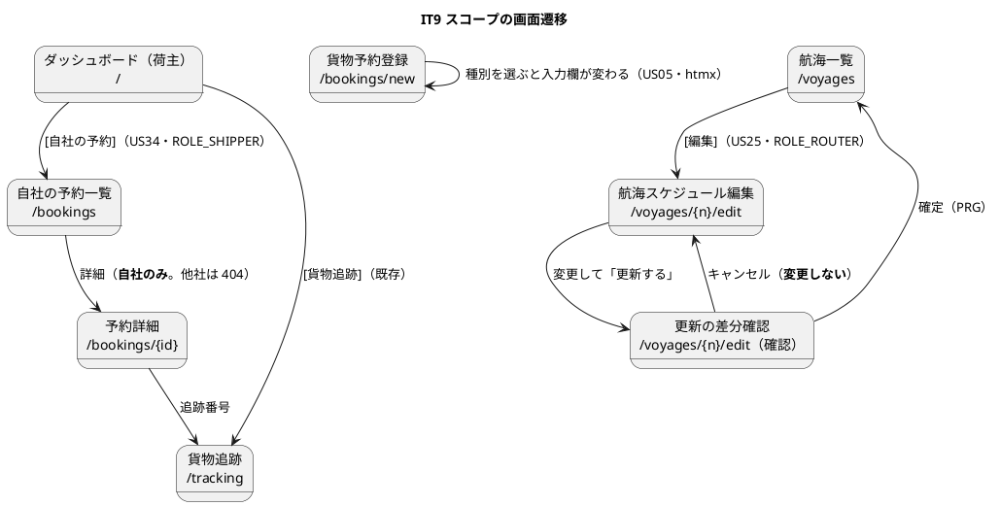

# イテレーション 9 計画

## ゴール

**荷主が自分の貨物を自分で見られるようにし、特殊貨物を正しく預かり、変わったスケジュールを追える状態にする。**
IT8 までで社内の業務は一通り回るようになった。本 IT は**社外の相手（荷主）に自分のデータを開く**ことと、
**外の世界が変わったとき（運航変更・特殊貨物）に追随する手段**を入れる。

| 項目 | 内容 |
| :--- | :--- |
| リリース | Release 1.1（実運用に必要な補完） |
| 局面 | **終盤（アウトサイドイン）** — `development_strategy.md` |
| 計画 SP | 8 |
| 完了 SP | — |
| 前提 | IT8 完了（手動更新・再算出・通知） |

**US34 が本 IT の中心である。** IT2 から IT8 まで、**7 イテレーションにわたって
「US34 で紐付けを作ってから開放する」と書き続けてきた制約**がある。

| 制約 | いつから | 出典 |
| :--- | :--- | :--- |
| 貨物予約一覧を荷主に開放できない（他社の予約が見える） | IT2 | `../review/IT2実装_review_20260806.md` |
| 追跡の認証つき一覧を出せない | IT7 | `iteration_plan-7.md` |
| 追跡番号の末尾 4 桁による部分一致検索を開けない | IT7 | `ui_design.md` 貨物追跡入力 |
| 荷主の自社貨物一覧（レビュー M2） | IT7 | `../review/IT7実装_review_20260808.md` |

**「US34 で解く」と書いた約束を、まとめて果たすイテレーションである。**

---

## 前イテレーションからの引き継ぎ

IT8 のふりかえり（[retrospective-8.md](retrospective-8.md)）の Try と持ち越しを、本計画の
タスク・成功基準・DoD に落とし込む。

### Try の反映

| Try | 本計画での扱い |
| :--- | :--- |
| T1 **コメントの主張を、そのコミットの中でテストにする** | **DoD の最上位。** 「〜しない」「〜に限る」と書いたら破るテストを同じコミットで足す。**書けないなら、その主張は書かない**。IT8 の P1（5 件）はすべてこれで防げた |
| T2 **受入基準を「満たす／満たさない」の両方の表で読み返す** | **タスク 5-0。** クローズ前に**正典の受入基準そのもの**を 1 行ずつ指差す。IT8 は「満たさないもの」の表しか読み返さず、US17 の 1 件を落とした |
| T3 **「この仕事はいつ発生し、誰がどこで気づくか」を書く** | **タスク 3-6 と DoD の到達性。** 本 IT で増える仕事は「荷主が自分で見る」「運航変更を反映する」。**気づく手段が無ければ作業入口を作る** |
| T4 **安全装置の検証は「その装置だけを壊す」形にする** | **タスク 4-3。** 壊したときのエラー文言まで確かめ、別の場所で先に弾かれていないかを見る |
| T5 **E2E は「その操作をしなければ落ちる」ことを確かめる** | **タスク 4-1・4-2。** 操作をコメントアウトして赤になるかを 1 本ずつ見る |
| T6 **ツールを上げたら生成物を作り直してからコミットする** | **タスク 0-0。** 依存を上げたら**その後に**ロックを再生成する。IT8 の CI 赤の直接原因 |
| T7 レビューは 5 視点を並列で起動する | **クローズ時の運用**（IT8 で全視点が返った） |
| T8 返済枠を最初から時間で確保する | **タスク 0 として 8 時間確保** |
| T9 依存の更新を `dependencyUpdates` で確かめる | **タスク 0-0** |
| T10 **「壊して赤」は入口と出口の両方で回す** | **DoD の安全装置** |

### 持ち越しの返済枠（上限 8 時間。T8）

**IT8 のレビューは高 11 件をすべて IT8 内で処理した一方、中 8 件・低 4 件を送っている。**
うち **C1〜C3 は設計の正典と実装のずれ**であり、次に BC 間依存を足す判断そのものを誤らせる。

| # | 内容 | 本計画での扱い |
| :--- | :--- | :--- |
| C1 | **ADR-012 が矢印の向きを 2 つの意味（パッケージ依存 / 呼び出し）で混用している** | **タスク 0-1。** 規律「逆向きのポートを足す前に順方向を疑う」は向きの一意な読みに全面的に依存する。**向きが 2 通りに読めるルールは、次に適用する人が正反対の結論を出せる** |
| C2 | `domain-model.md` の ACL ポート正典と実装が 4 件ずれ（`RoutableBookings` の欠落・未実装ポートに区別が無い・表の分断） | **タスク 0-2** |
| C3 | `PackageStructureTest` の Javadoc が「ルール 5 のみ実装」のまま（実際は 9 ルールが緑） | **タスク 0-3。** **実装はあるが宣言が古い**形であり、T1 の対象そのもの |
| C4 | **入港が引取済みの貨物にも登録できる**（状態を動かさないため順序検査を素通りする） | **タスク 1-4。** 訂正手段が無い今、履歴に消せない矛盾が残る |
| C10 | `occurredAt` の境界値（未来日時・直前イベントより過去）が未検証 | **タスク 1-4**（C4 と同じ根） |
| C7 | US12 の受入基準「料金概算」を実装が意図的に外しているが正典が未更新 | **タスク 0-4。** 正典（`user_story.md`）を直す |
| C15 | 定数・変換の重複（`DEFAULT_MAX_TRANSIT_COUNT` 2 か所・延長日数 2 か所・百分率変換 2 か所） | **タスク 0-5** |
| C5 | 手動更新フォームの発生日時に既定値が無い／場所が自由入力 | 本 IT では対応しない。**US17 の使い勝手であり、C4 を直すときに触る範囲と重なる**ため IT10 で一緒に扱う |
| C6 | 「追跡中の貨物」の状態列が予約ステータス | 本 IT では対応しない。**一覧の持ち主を Tracking へ移す判断**が要る（ADR 相当）。IT10 で判断する |
| C8 | 通知テストが値ではなくラベルの存在しか見ていない／経由港が未検証 | 本 IT では対応しない。IT10 |
| C9 | 「マスタに無い港は拒否される」がどの守りで落ちたか判別しない | **タスク 4-3 に含める**（T4 の対象そのもの） |
| C11 | `ShipperCorrectionAcceptanceTest` にロールの負のテストが無い | **タスク 0-6**（小さい。US34 で荷主ロールを触るついでに入れる） |
| C12 | **Tracking が持つ写しに再同期手段が無い** | 本 IT では対応しない。**C16（Outbox）と同じ判断が要る**ため、IT10 で ADR-009 の改訂として一度に扱う |
| C13 | 通知を独立 BC に切り出す引き金を決める | 本 IT では対応しない。**引き金は「Booking 以外が発生源の通知が要る時点」であり、まだ点いていない** |
| C14 | レートリミットの窓が明けたら数え直すことが未検証 | 本 IT では対応しない。IT10 |
| C16 | イベントの取りこぼし（Outbox） | 本 IT では対応しない。C12 と同時に判断する |

---

## ユーザーストーリー

### 対象ストーリー

| ID | ユーザーストーリー | SP | 優先度 | Issue |
| :--- | :--- | :--- | :--- | :--- |
| US34 | 荷主が自社の予約を照会する | 3 | 必須 | [#508](https://github.com/k2works/case-study-cargo-tracker/issues/508) |
| US05 | 危険物・冷凍貨物の予約を登録する | 3 | 中 | [#499](https://github.com/k2works/case-study-cargo-tracker/issues/499) |
| US25 | 既存航海スケジュールを更新する | 2 | 中 | [#498](https://github.com/k2works/case-study-cargo-tracker/issues/498) |
| | **合計** | **8** | | |

> マイルストーンは 3 件とも `[java/take-6] Release 1.1 実運用補完`、ラベルは `it9` である。
> **java/take-6 には GitHub Project を作っていない。** イテレーションの割り当ては
> `it9` ラベルとマイルストーンで表す。

### 実装順序

**US34 → US05 → US25** の順に進める。US34 は 7 IT にわたって積み上がった制約を解くもので、
**他の 2 つより先に片付けないと、また「次の IT で」と書くことになる**。

### 受入基準

受入基準の正典は [ユーザーストーリー](../requirements/user_story.md) である。**本計画に書き写さず引用する。**

- US34: [US34 の受入基準](../requirements/user_story.md#us34-荷主が自社の予約を照会する)
- US05: [US05 の受入基準](../requirements/user_story.md#us05-危険物冷凍貨物の予約を登録する)
- US25: [US25 の受入基準](../requirements/user_story.md#us25-既存航海スケジュールを更新する)

### 受入基準のうち本 IT で満たさないもの

| 内容 | 扱い | 理由 |
| :--- | :--- | :--- |
| US05「特別情報が登録された予約は、経路設計時に対応可能な航海・ルートのみが候補として表示される」 | **すでに満たしている**（IT4 / US08 で実装済み）。**本 IT では回帰テストで固定する** | `RouteSearchService` が取扱可否を候補の属性として持ち、選べない理由を画面に出している。**満たしているものを「実装する」と書かない** |
| US25「更新後、UC05（航海スケジュール検索）の検索結果に更新内容が反映される」 | **満たす。** ただし**確定済みの経路への影響は警告にとどめる** | 経路を確定した予約のスケジュールが変わった場合、経路の作り直しは US28（IT11）の領分である。**本 IT で自動再割り当てはしない**（勝手に経路が変わるほうが危険） |
| US34「荷主は予約の登録・キャンセルはできない」 | **満たす**（読み取りのみ） | — |

---

## 設計への反映が必要（当該 IT で対応）

着手前の突合で見つかった差分。**当該 IT で設計ドキュメントに反映する。**

| # | 対象 | 内容 | 反映先 |
| :--- | :--- | :--- | :--- |
| 1 | `data-model.md` | **`users` に荷主との紐付けが無い。** US34 の中核であり、正典に置き場が無いままでは実装できない | `data-model.md`（`users.shipper_id`） |
| 2 | `domain-model.md` | 利用者と荷主の紐付けを表す要素が無い。**Security Context が Shipper を直接参照してはならない**（ADR-005） | `domain-model.md`（要素表・ACL ポート） |
| 3 | `data-model.md` / マイグレーション | **危険物・温度管理の列（6 本）が正典にあるのにマイグレーションに無い**（`hazardous_class` / `un_number` / `proper_shipping_name` / `min_temperature` / `max_temperature` / `temperature_unit`）。US05 の受入基準を満たす置き場が無い | マイグレーション（V20） |
| 4 | `domain-model.md` | `HazardousDeclaration` / `TemperatureRequirement` は要素表にあるが**「US05（IT8）」と書かれている**（実際は IT9） | `domain-model.md` |
| 5 | `ui_design.md` | 貨物予約一覧のロールが `ROLE_SALES` のみ。**US34 で荷主に開くため、開放条件（自社のみ）を明記する必要がある** | `ui_design.md` 画面一覧 |
| 6 | `ui_design.md` | 荷主向けダッシュボードの作業カードが定義されていない（現状は「貨物追跡」1 枚） | `ui_design.md` ナビゲーション構成 |
| 7 | `ui_design.md` | 航海スケジュール編集（`/voyages/{voyageNumber}/edit`）は画面一覧にあるが、**差分確認の画面仕様が無い**（US25 の受入基準「差分が確認画面に表示される」） | `ui_design.md` |
| 8 | `non_functional.md` | ROLE_SHIPPER の権限が「自社予約・追跡（Phase 2）」のまま。**本 IT が Phase 2 である** | `non_functional.md` §4.1 |
| 9 | `ui_design.md` | 追跡番号の末尾 4 桁による部分一致検索の前提条件（IT7 で「US34 で紐付けを作ってから開放する」と注記）を、**本 IT で開くのか開かないのかを決める** | `ui_design.md` |
| 10 | ADR | **利用者と荷主の紐付けをどの BC が持つか**は構造の判断であり ADR が要る（Security が Shipper を参照しない形をどう作るか） | ADR-013 |

---

## 設計（IT9 スコープ）

### ドメインモデル図

### 状態遷移図（IT9 スコープ）

### ER 図（IT9 スコープ）

> **`users.shipper_id` は NULL を許す。** 社内ロール（営業・経路設計者・追跡管理者・
> 荷役作業員・管理者）は荷主に紐づかない。**「全員が荷主に紐づく」形にすると、
> 社内利用者を作るたびにダミーの荷主が要る。**
>
> 危険物・温度の列は `data-model.md` に定義済みだが**マイグレーションに無い**（設計反映 #3）。
> 種別との整合（危険物なら申告が必須）は **DB の CHECK ではなくドメインで守る** —
> 種別ごとに必須列が変わる制約は SQL で書くと読めなくなる。

### 画面遷移図（IT9 スコープ）

### インタラクション（IT9 スコープ）

| 画面 | 操作 | 方式 | 備考 |
| :--- | :--- | :--- | :--- |
| 貨物予約登録 | 種別の切り替え | htmx `hx-get="/bookings/new/specification"`（画面 URL の下。`/api/v1` は使わない） | 危険物・冷凍で入力欄が変わる |
| 自社の予約一覧 | 一覧 | `GET /bookings`（**荷主は自分の荷主 ID で自動的に絞られる**） | 検索条件で他社を指定しても増えない |
| 予約詳細 | 他社の予約 | **404**（403 にしない） | 403 は「存在するが見せない」と伝えてしまう |
| 航海スケジュール編集 | 差分確認 | `POST /voyages/{n}/edit` → 確認画面 → `POST /voyages/{n}`（PRG） | **確認を挟む**（US25 の受入基準） |

---

## タスク分解

### 0. 先に片付ける（上限 8 時間。T6・T8・T9）

| # | タスク | 見積 |
| :--- | :--- | :--- |
| 0-0 | **依存の更新。** `dependencyUpdates` で確認し、**上げた後にロックを再生成してからコミットする**（T6。IT8 の CI 赤の直接原因） | 1.5h |
| 0-1 | **C1: ADR-012 の矢印の向きを一意にする。** 正典（`domain-model.md`）の「呼び出し元 / 委譲先」に揃え、パッケージ依存を語る箇所は明示する。`RouteRelaxations` のコメントの根拠も直す | 1.5h |
| 0-2 | **C2: ACL ポート正典と実装の 4 件のずれ**（`RoutableBookings` の追加・実装状況の列・表の分断） | 1.0h |
| 0-3 | **C3: `PackageStructureTest` の Javadoc を実態に合わせる**（9 ルールが緑）。`test_strategy.md` の「6 件」も | 0.5h |
| 0-4 | **C7: US12 の受入基準から料金概算を外す**（US21 へ移す理由を正典に書く） | 0.5h |
| 0-5 | **C15: 定数・変換の重複を 1 か所に寄せる**（既定の経由回数・延長日数・百分率変換） | 1.5h |
| 0-6 | **C11: 荷主訂正のロール負テスト**（US34 で荷主ロールを触るついでに） | 0.5h |
| 0-7 | JIG / jig-erd を生成し、**設計ドキュメントとの差分を目視する**（IT8 で 4 件の正典ずれが出た。生成物で拾えるものは拾う） | 1.0h |
| | **小計** | **8.0h** |

### 1. 受け入れテストとドメイン

**終盤はアウトサイドインである。** 業務シナリオの受け入れテストを先に赤にしてから、ドメインへ降りる。

| # | タスク | 見積 |
| :--- | :--- | :--- |
| 1-0 | **業務シナリオの受け入れテストを先に書く（赤）。** 「荷主が自分の貨物だけを見る」「危険物を申告つきで預ける」「運航変更を反映する」の 3 本 | 3.0h |
| 1-1 | `HazardousDeclaration` / `TemperatureRequirement`。**種別との整合は `CargoSpecification` が守る**（「危険物なのに申告が無い」を作らせない） | 4.0h |
| 1-2 | `Voyage.reschedule` と `ScheduleChange`（差分）。**出港済みの区間は変えない** | 4.0h |
| 1-3 | 利用者と荷主の紐付け（`UserAccount.linkedShipperId`）。**Shipper を直接参照しない**（ADR-005） | 2.0h |
| 1-4 | **C4 / C10: 手動更新の時系列検査。** 引取済みの貨物に入港を入れられない・未来日時を拒む・直前イベントより過去を拒む | 3.0h |
| | **小計** | **16.0h** |

### 2. 永続化

| # | タスク | 見積 |
| :--- | :--- | :--- |
| 2-1 | `V20__cargo_special_handling.sql`（危険物 6 列）と `V21__user_shipper_link.sql` | 2.5h |
| 2-2 | 特殊貨物の読み書きと Testcontainers のテスト | 2.5h |
| 2-3 | 航海スケジュールの更新（楽観的ロック付き）とテスト | 2.5h |
| 2-4 | **自社の予約だけを引くクエリ。** 荷主 ID を SQL の絞り込みに入れる（**画面側で絞らない**） | 2.0h |
| | **小計** | **9.5h** |

### 3. アプリケーションと画面（アウトサイドインの主戦場）

| # | タスク | 見積 |
| :--- | :--- | :--- |
| 3-1 | 予約登録画面の種別切り替え（htmx）と入力欄の出し分け | 4.0h |
| 3-2 | 荷主向けの予約一覧・詳細（**自社のみ**）とダッシュボードの作業カード | 4.0h |
| 3-3 | 認可（`SecurityConfig`）。**他社の予約は 404**。宣言順に注意（IT5・IT7・IT8 で 3 回当たっている） | 2.0h |
| 3-4 | 航海スケジュール編集と差分確認（PRG。キャンセルで変更しない） | 4.5h |
| 3-5 | 追跡番号の部分一致検索を開くかの判断と実装（設計反映 #9） | 2.0h |
| 3-6 | **T3: 「この仕事はいつ発生し、誰がどこで気づくか」を書く。** 運航変更に気づく手段（影響する予約の警告）を確かめる | 2.0h |
| | **小計** | **18.5h** |

### 4. E2E とテスト

| # | タスク | 見積 |
| :--- | :--- | :--- |
| 4-1 | E2E: 荷主が自分の貨物を見る（**他社の予約が現れないことを確かめる**） | 3.0h |
| 4-2 | E2E: 危険物の予約 → 取扱可能な便だけが候補に出る | 2.5h |
| 4-3 | **T4: 安全装置を「その装置だけを壊して」赤にする。** エラー文言まで確かめる（C9 を含む） | 3.0h |
| 4-4 | **T5: E2E の操作をコメントアウトして赤になることを 1 本ずつ確かめる** | 1.5h |
| | **小計** | **10.0h** |

### 5. ドキュメント

| # | タスク | 見積 |
| :--- | :--- | :--- |
| 5-0 | **T2: 正典の受入基準を 1 行ずつ指差す**（「満たさないもの」の表だけを読み返さない） | 1.5h |
| 5-1 | 設計ドキュメントの反映（10 件）と **ADR-013**（利用者と荷主の紐付け） | 4.5h |
| 5-2 | マニュアル更新（`03-荷主管理` に紐付け、`04-貨物予約` に特殊貨物、`05-航路管理` に編集、**荷主向けの章**）＋キャプチャ再生成 | 4.5h |
| 5-3 | 用語集・**付録 B**・索引 3 点同期 | 2.0h |
| | **小計** | **12.5h** |

**合計見積: 74.5h**

---

## ADR

| # | 判断 | 起票要否 |
| :--- | :--- | :--- |
| 1 | **利用者と荷主の紐付けをどの BC が持つか** | **ADR-013 として起票する。** Security が Shipper を直接参照しない形（共有カーネルの `ShipperId` だけを持つ）を選ぶ理由と、代替案（Shipper 側に利用者を持つ / 独立した紐付け BC）を記録する |
| 2 | 他社の予約を 404 で返す | **起票しない。** `ui_design.md` の方針（存在を漏らさない）に沿う。追跡照会と同じ判断である |
| 3 | 航海スケジュールの更新で経路を作り直さない | **起票しない。** US28（IT11）の領分であることを計画とマニュアルに書く |

---

## スケジュール

| 日 | 内容 |
| :--- | :--- |
| 1 | タスク 0（返済枠 8h。**正典のずれを先に潰す**） |
| 2-3 | タスク 1（受け入れテストを赤にしてからドメイン） |
| 4-5 | タスク 2（永続化） |
| 6-8 | タスク 3（アプリケーションと画面） |
| 9 | タスク 4（E2E と安全装置） |
| 10 | タスク 5（ドキュメント）・クローズ準備 |

---

## 完了条件

### デモ項目

1. 荷主でログインすると、ダッシュボードに**自社の予約**の入口がある
2. 一覧には**自社の予約だけ**が並ぶ。検索条件で他社を指定しても増えない
3. **他社の予約 URL を直接開くと 404**（「見せない」ではなく「無い」と答える）
4. 危険物を選ぶと申告欄が現れ、**申告なしでは登録できない**
5. 危険物の予約では、**取扱可能な便だけが選べる**（扱えない便は理由つきで選べない）
6. 航海スケジュールを編集すると**差分と影響する予約の件数**が出る
7. 「キャンセル」を押すと**何も変わらない**
8. 更新後、航海の検索結果に新しい内容が出る

### 完了の定義（DoD）

#### 機能

- [x] US34 / US05 / US25 の受入基準（**正典を 1 行ずつ指差して確認**。T2）が緑
- [x] デモ項目 8 件が動作する
- [x] **IT2 から積み上がった「US34 で開放する」の約束**に決着（予約一覧は開放。追跡の末尾 4 桁検索は**開かないと決めた**）

#### 終盤の完了条件（`development_strategy.md`）

- [x] 業務シナリオが通しで動作する
- [x] E2E のクリティカルパス 3 本（US13 / US15 / US18）が緑（既存）＋本 IT の 2 本（**計 8 本すべて緑**）
- [x] ArchUnit の 9 ルールがすべて有効

#### 品質

- [x] `test` / Checkstyle / SpotBugs が緑（`clean check` はクローズのステップ 2 で実施）
- [ ] CI が緑・SonarQube Quality Gate が PASS（**クローズのステップ 2.5 / 2.6 で確認**）

#### 主張とテスト（T1。**本 IT の最上位**）

- [x] **「〜しない」「〜に限る」と書いたコメントに、それを破るテストが同じコミットにある**
- [x] 書けない主張はコメントから落とした

#### 安全装置（T4・T10: 入口と出口の両方・**その装置だけを壊す**）

| # | 装置 | 入口（壊す） | 出口（壊す） |
| :--- | :--- | :--- | :--- |
| 1 | 自社の予約だけを引く | 検索条件に他社の荷主コード | 一覧の件数が増えないこと |
| 2 | 他社の予約詳細 | URL を直接指定 | 404 であること（403 でない） |
| 3 | 危険物の申告が必須 | 申告なしで POST | `cargo` に行が増えないこと |
| 4 | 温度の下限 ≤ 上限 | 逆にして POST | 同上 |
| 5 | 取扱えない便を選べない | 危険物で非対応便を選択 | 経路が割り当たらないこと |
| 6 | 出港済みの区間は変えない | 過去の区間を編集 | `carrier_movement` が変わらないこと |
| 7 | キャンセルで変更しない | 差分確認でキャンセル | `voyage.version` が上がらないこと |
| 8 | 引取済みに入港を入れない | 引取後に ARRIVE | イベントが増えないこと |
| 9 | 未来日時の手動更新を拒む | 明日の日時で登録 | 同上 |
| 10 | 社内ロールは荷主に紐づかない | 営業でログイン | 一覧が絞られないこと |

#### 到達性（ロール別・状態別・**発生時点**。T3）

- [x] 荷主がダッシュボードから自社の予約へ到達できる（**navbar にも入口を足した**）
- [x] 経路設計者が航海詳細から編集へ到達できる
- [x] **運航変更が起きたことに気づく手段がある**（確認画面に影響する予約の件数）
- [x] 画面の案内文が指す先を、その文を読むロールで実際に開ける

#### ドキュメント

- [ ] 「設計への反映が必要」10 件がすべて反映済み（タスク 5-0 で 1 件ずつ確認）
- [ ] **ADR-013** を起票
- [ ] マニュアルの本文・項目表・**画面キャプチャ**が実装と一致
- [ ] **付録 B に本 IT で増えたメッセージが載っている**
- [ ] 用語集・索引 3 点が同期

---

## リスク

| # | リスク | 影響 | 対策 |
| :--- | :--- | :--- | :--- |
| 1 | **US34 の認可漏れで他社のデータが見える** | 重大（情報漏洩） | **SQL の絞り込みで実装する**（画面側で絞らない）。安全装置 1・2 で壊して赤を確認。E2E でも確かめる |
| 2 | `users.shipper_id` の追加が認証まわりに波及する | 中 | `UserDetailsService` の変更は最小に留め、**紐付けの有無で分岐しない**（NULL は「紐づかない」として扱う） |
| 3 | 航海スケジュールの更新が確定済みの経路を壊す | 中 | **自動再割り当てはしない。** 警告にとどめ、再設計は US28（IT11）とする |
| 4 | 危険物の必須検査を DB の CHECK で書こうとして読めなくなる | 低 | **ドメインで守る**（種別ごとに必須列が変わる制約は SQL に向かない） |
| 5 | 見積 74.5h。返済枠 8h を含む | 中 | 超過が見えた時点で **3-5（部分一致検索）→ 4-2 の順で落とす**（順序を先に決めておく） |

---

## 実績

### 完了したストーリー

| ID | ストーリー | SP | 状態 |
| :--- | :--- | :--- | :--- |
| US34 | 荷主が自社の予約を照会する | 3 | 完了 |
| US05 | 危険物・冷凍貨物の予約を登録する | 3 | 完了 |
| US25 | 既存航海スケジュールを更新する | 2 | 完了 |
| | **合計** | **8** | |

C4 / C10（手動更新の時系列検査）も同 IT で解消した。

### 安全装置（T4。**その装置だけを壊して赤を確認**）

10 件のうち 8 件を検証し、**2 件が「壊しても緑のまま」だった**。

| # | 装置 | 結果 |
| :--- | :--- | :--- |
| 1 | 種別と申告の整合（危険物に申告を要求） | 赤 |
| 2 | 荷主の絞り込み（SQL の shipperId） | 赤 |
| 3 | 他社の予約詳細を 404 にする | 赤 |
| 4 | 航海番号は変更できない（集約） | **空振り → 判別できるテストを足して赤** |
| 5 | 引取済みへの手動更新を拒む | 赤 |
| 6 | 未来の発生日時を拒む | 赤 |
| 7 | 直前より過去の発生日時を拒む | 赤 |
| 8 | 航海更新の楽観的ロック | **空振り → 判別できるテストを足して赤** |
| 9 | 出港済みの区間は変えない | 赤（**実装が漏れていた。同 IT で追加**） |
| 10 | 影響する予約の件数を出す | 赤（**実装が漏れていた。同 IT で追加**） |

**4 と 8 が空振りした理由は同じである。** 画面が先に弾く条件、あるいは画面のテストでは
起こせない状況（先行更新）は、**集約の守りを判別しない**。

### E2E（T5。操作を 1 本ずつ外して赤を確認）

新規 2 本を追加し、計 8 本が緑。外して赤になることを 3 か所で確認した。

**E2E とキャプチャ生成が、単体・統合では全緑だった欠陥を 5 件出した。**

| # | 欠陥 | 気づけなかった理由 |
| :--- | :--- | :--- |
| 1 | 差し戻し時に特別な入力欄が消え、**指摘された利用者が直す場所を失う** | 入力欄を htmx でしか描画していなかった。統合テストは POST の結果だけを見ていた |
| 2 | ダッシュボードにカードが並ぶのに「利用できる機能はありません」と表示 | 画面の**内部の矛盾**は、個別の要素を見るテストでは現れない |
| 3 | **動作確認環境で最初の荷主登録が必ず 500 になる** | デモデータが荷主コードを直接書き、採番を進めていなかった。テストの DB にデモデータが無い |
| 4 | **既存の便を編集で開くと発着日時が消える** | `datetime-local` が秒以下を受け付けない。ブラウザを通さないと分からない |
| 5 | **危険物・冷凍の列が無かったころの予約が読めなくなった** | 復元にも整合を求めた。既存データを持つ環境でしか現れない |

**4 と 5 は「今あるデータ」を壊す種類の欠陥である。** 新しく作るデータだけを扱う
テストでは原理的に見つからない。

### 業務のタイムゾーン（IT8 の教訓の再発）

E2E とキャプチャ生成が日時を UTC で組み立てていたため、**業務時刻が JST の
00:00〜09:00 のあいだだけ落ちる**状態だった。IT8 で本体には入れた規律が、
テスト側に入っていなかった。共有のヘルパ（`e2e/app/support/time.js`）に集約した。

### 設計への反映

10 件すべて反映した。うち 1 件は **ADR-013**（利用者と荷主の紐付け）として起票した。
ACL ポートが 1 本増えた（`AffectedBookings`）ため、`domain-model.md` の
ポート一覧と ADR-012 の表も同じ変更で更新した。

### 積み残しの決着

IT2 から 7 イテレーション積み上がった「US34 で紐付けを作ってから開放する」は、
**予約一覧は開放**・**追跡番号の末尾 4 桁検索は開かない**で決着した。
後者は「紐付けができた」ことと「開放してよい」ことが別だからである
（詳細は `ui_design.md`）。

---

## 更新履歴

| 日付 | 内容 |
| :--- | :--- |
| 2026-08-08 | 初版作成（`opening-iteration` ステップ 2）。IT8 のふりかえり T1〜T10・C1〜C16 を反映 |
| 2026-08-09 | 実績を記録（US34 / US05 / US25 完了、C4 / C10 解消、安全装置 10 件・E2E 8 本、設計 10 件と ADR-013） |

---

## 参照

- [リリース計画](release_plan.md) / [開発戦略](development_strategy.md)
- [IT8 計画](iteration_plan-8.md) / [IT8 ふりかえり](retrospective-8.md) / [IT8 実装レビュー](../review/IT8実装_review_20260808.md)
- [ユーザーストーリー](../requirements/user_story.md)
- [ドメインモデル設計](../design/domain-model.md) / [データモデル設計](../design/data-model.md) / [UI 設計](../design/ui_design.md)
- [ADR-005 共有カーネルの範囲](../adr/005-shared-kernel-scope.md)
- [ADR-012 BC 間の依存の向き](../adr/012-cross-context-dependency-direction.md)
