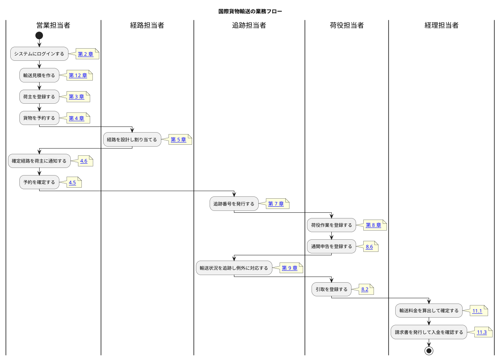

# 01. 業務フロー

国際貨物輸送の業務は、荷主への見積から始まり、荷主の登録・貨物の予約・経路設計・輸送・追跡を経て、精算で終わります。本章は業務の流れと、各工程がどの章に対応するかを示します。

**すべての工程が利用できます。** 見積から精算までが画面だけでつながります。

## 全体像

## 工程と章の対応

| # | 工程 | 担当 | 対応する章 | 状態 |
| :--- | :--- | :--- | :--- | :--- |
| WF-0 | 輸送見積を作る | 営業担当者 | [12. 見積管理](12-見積管理.md) | 利用できます（予約の前の照会。荷主が未登録でも作れます） |
| WF-1 | システムにログインする | 全員 | [02. ログイン](02-ログイン.md) | 利用できます |
| WF-2 | 荷主を登録する | 営業担当者 | [03. 荷主管理](03-荷主管理.md) | 利用できます |
| WF-3 | 貨物を予約する | 営業担当者 | [04. 貨物予約](04-貨物予約.md) | 利用できます |
| WF-4 | 経路を設計し割り当てる | 経路担当者 | [05. 航路管理](05-航路管理.md) | 利用できます |
| WF-4.5 | 確定経路を荷主に通知する | 営業担当者 | [4.6](04-貨物予約.md#46-確定経路を荷主に通知する) | 利用できます |
| WF-4.6 | 予約を確定し追跡番号を発行する | 営業担当者 / 追跡担当者 | [4.5](04-貨物予約.md#45-予約を確定する) / [07. 追跡管理](07-追跡管理.md) | 利用できます |
| WF-5 | 荷役作業を登録する | 荷役担当者 | [08. 荷役管理](08-荷役管理.md) | 利用できます（受領・積込・荷降し・通関・引取） |
| WF-5.5 | 通関申告を登録し通関を通す | 荷役担当者 | [8.6](08-荷役管理.md#86-通関申告を登録する) / [8.7](08-荷役管理.md#87-通関状態を更新する) | 利用できます。**通関が下りるまで引取は登録できません** |
| WF-6 | 輸送状況を追跡する | 追跡担当者 / 荷主・荷受人 | [7.4](07-追跡管理.md#74-貨物の状態を手動で更新する) / [09. 貨物追跡](09-貨物追跡.md) | 利用できます（状態の手動更新・追跡番号での照会） |
| WF-6.5 | 例外に対応する（遅延・破損・紛失・誤配） | 追跡担当者 | [7.5](07-追跡管理.md#75-例外を確認する)〜[7.7](07-追跡管理.md#77-例外に対応する) | 利用できます。紛失は自動でエスカレーションされます |
| WF-7 | 輸送料金を算出して確定する | 経理担当者 | [11.1](11-請求管理.md#111-請求対象を確認する) / [11.3](11-請求管理.md#113-金額を確認して確定する) | 利用できます（引取が済んだ貨物が対象） |
| WF-8 | 請求書を発行して入金を確認する | 経理担当者 | [11. 請求管理](11-請求管理.md) | 利用できます（督促の記録を含む） |
| WF-9 | 輸送中の予約をキャンセルする | 営業担当者 / 追跡担当者 / 荷役担当者 | [4.7](04-貨物予約.md#47-輸送中の予約のキャンセルを申請する) / [7.10](07-追跡管理.md#710-輸送中の予約キャンセルを承認する) / [8.8](08-荷役管理.md#88-荷降し手配を確認する) | 利用できます。**申請 → 承認 → 荷降し手配**の順に進みます |

> **WF-0 と WF-9 は本流から外れた工程です。** 見積は予約に至らないことがあり、
> キャンセルは輸送が始まった後に起きます。**どちらも「起きたときに戻る場所」**として書いています。

## WF-0 と WF-3 のつながり

**見積は予約の前の照会であり、予約そのものではありません。** 荷主が登録されていなくても作れます
（[12.2](12-見積管理.md#122-見積を作成する)）。

見積詳細の `[この見積で予約する]` を使うと、**出発地・目的地・希望期限・貨物種別・重量・危険物の申告が
入力済みの状態**で予約登録が開きます（[12.3](12-見積管理.md#123-見積の内容を確認して予約へ進む)）。**同じ条件を 2 度打ち込む必要は
ありません。** ただし荷主コードは見積が持たないため、予約の画面で入力します。

**希望期限を過ぎた見積からは予約へ進めません。** 過ぎた期限で予約を作ると、作った瞬間に間に合わない
予約になるためです。`[同じ条件で再見積]` で条件を引き継いだまま作り直してください。

## WF-2 と WF-3 のつながり

**貨物を予約するには、その荷主が登録されている必要があります。** 予約では荷主コードで荷主を指定します。荷主詳細の「この荷主で予約する」を使うと、荷主コードが入力された状態で予約の画面が開きます。**荷主コードを書き写して画面を往復する必要はありません。**

新しい取引先から依頼を受けたときは、予約の前に荷主登録を済ませてください。**同じ取引先を二重に登録すると、請求先が分かれてしまい後の工程で混乱します。** 登録の前に一覧で探す習慣をつけてください（システムもメールアドレスの重複を検知して知らせます。[3.2](03-荷主管理.md#32-荷主を登録する)）。

## WF-3 と WF-4 のつながり

**予約は「引き渡し」で経路設計へ移ります**（[4.4](04-貨物予約.md#44-経路設計者に引き渡す)）。
引き渡しの通知メールは送信されません。**引き渡した予約が経路設計者の
「経路設計」画面に現れることが引き渡しです**（[5.1](05-航路管理.md#51-経路割り当て待ちの予約を確認する)）。
経路設計者は通知を待つのではなく、自分の作業画面を見ます。

## WF-4 と WF-4.5 のつながり

**経路が確定したことは営業に自動で伝わりません**（メールは送信していません）。
営業担当者はダッシュボードの「**荷主への通知待ち**」を見ます。経路が確定していて、
まだ通知していない予約が期限の近い順に並びます。

通知した記録は予約詳細の「通知履歴」に残ります。**「聞いていない」と言われたときに
確認できるようにするための記録**です（届いたことを保証するものではありません）。

## WF-5 と WF-7 のつながり

**請求できるのは引取が済んだ貨物だけです**（[11.1](11-請求管理.md#111-請求対象を確認する)）。引取を登録するには
通関が下りている必要があり（WF-5.5）、通関申告には荷役種別「通関」の記録が要ります。
**「請求対象に出てこない」ときは、この順番のどこかで止まっています。**

**訂正の申請が承認待ちの貨物は請求対象に出ません。** 金額の根拠になる記録が動く可能性があるためです。
