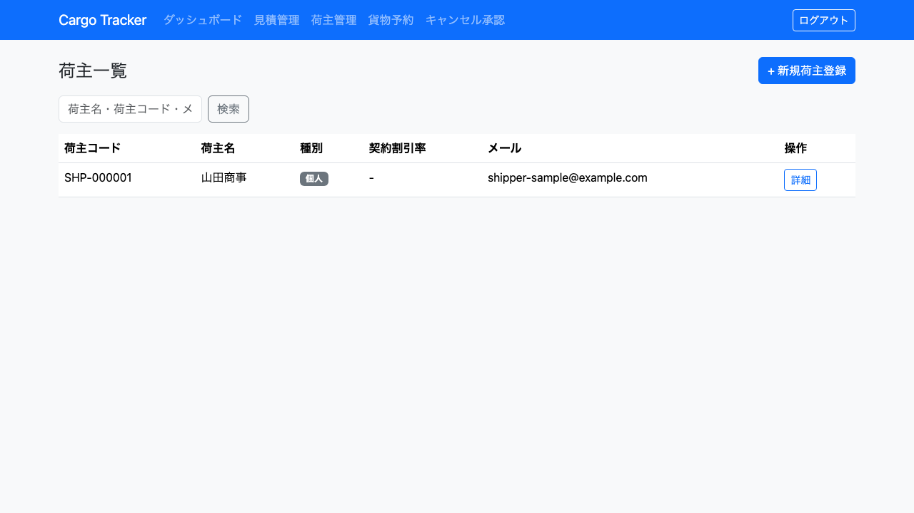
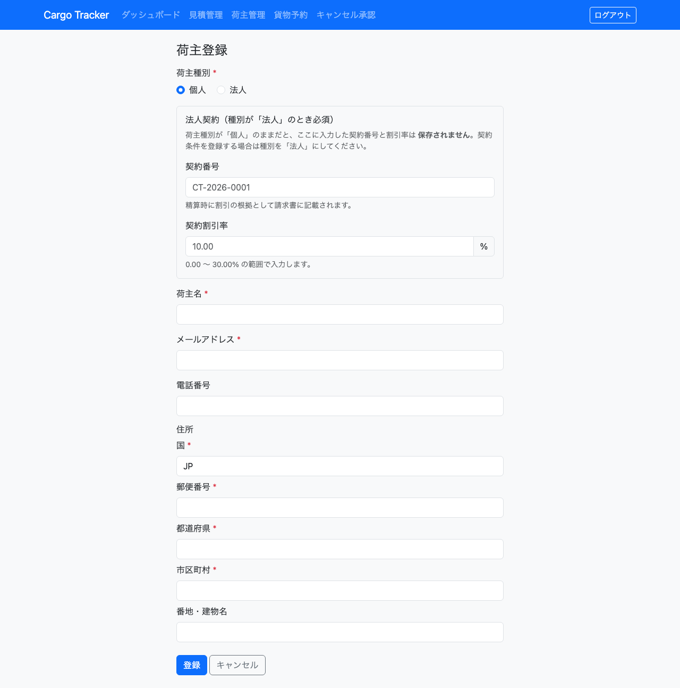
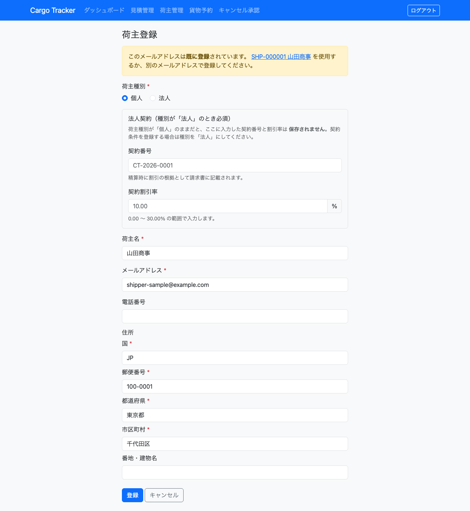
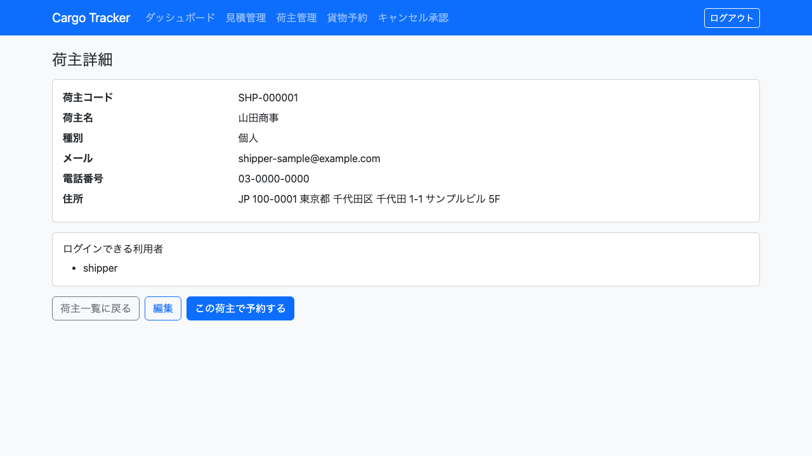
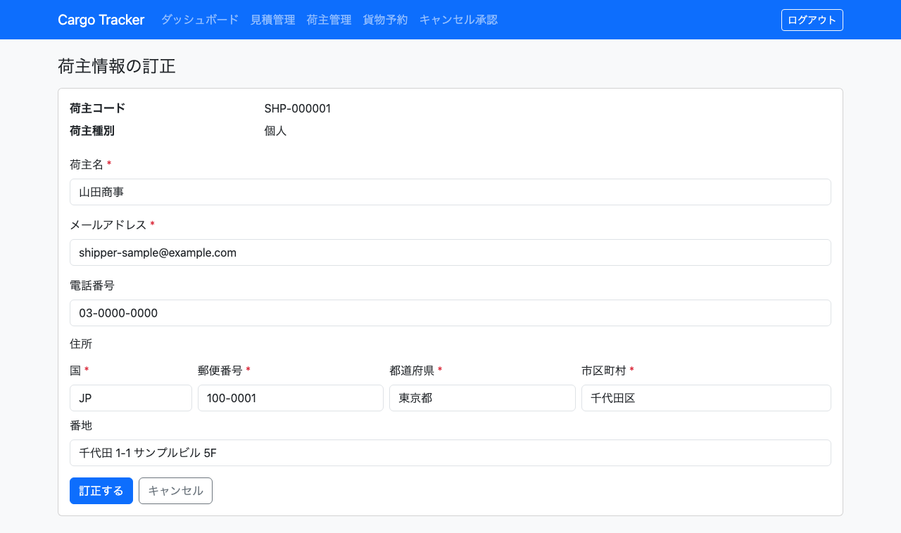

# 03. 荷主管理

貨物の依頼元である**荷主**を登録し、確認する画面です。営業担当者が利用します。

本章は [WF-2（荷主を登録する）](01-業務フロー.md#工程と章の対応) の工程に対応します。**貨物を予約するには、その荷主が登録されている必要があります。**

## 画面の開き方

- メニュー「荷主管理」（URL: `/shippers`）
- ダッシュボードの「荷主管理」カードの「開く」

| 画面 | 役割 | 節 |
| :--- | :--- | :--- |
| 荷主一覧 | 登録済みの荷主を確認する | [3.1](#31-荷主を探す) |
| 荷主登録 | 新しい荷主を登録する | [3.2](#32-荷主を登録する) |
| 荷主詳細 | 1 件の荷主の内容を確認する | [3.3](#33-荷主の内容を確認する) |
| 荷主編集 | 登録済みの荷主情報を訂正する | [3.4](#34-荷主情報を訂正する) |

荷主の**種別**（個人・法人）は登録時に選びます。法人を選ぶと**契約番号と契約割引率**を入力します（[3.2](#32-荷主を登録する)）。

## 3.1 荷主を探す

### この画面でできること

- 登録済みの荷主を一覧で確認します。新しい依頼を受けたときに、**すでに登録されている取引先かどうかをここで確かめます**。

### 画面の開き方

- メニュー「荷主管理」（URL: `/shippers`）

### 画面の説明

| # | 項目 | 説明 |
| :--- | :--- | :--- |
| ① | 「+ 新規荷主登録」 | 新しい荷主を登録する画面へ移動します |
| ② | 荷主コード | システムが発行する荷主の番号です（例: SHP-000001） |
| ③ | 荷主名 | 登録した荷主の名称です |
| ④ | 種別 | 「個人」または「法人」です |
| ⑤ | メール | 連絡先のメールアドレスです |
| ⑥ | 「詳細」 | その荷主の詳細画面へ移動します |
| ⑦ | 検索欄 | 荷主名・荷主コード・メールアドレスの一部で絞り込みます |

### 操作手順

1. メニュー「荷主管理」をクリックします。
2. 一覧から目的の荷主を探します。
3. 内容を確認するときは、その行の「詳細」をクリックします。

### 注意・補足

- 荷主が 1 件も登録されていないときは「荷主が登録されていません。まず荷主を登録してください。」と表示されます。エラーではありません。
- **一覧は新しく登録した荷主が先頭に並びます。** 直前に登録した荷主コードを確認するときは、一覧の一番上を見てください。
- **荷主名・荷主コード・メールアドレスで絞り込めます。** 検索欄にキーワードを入れて「検索」をクリックしてください。条件に一致する荷主が無いときは「条件に一致する荷主がありません。」と表示されます。「条件をクリア」で全件表示に戻ります。
- **荷主コードは登録時にシステムが発行します。** 利用者が指定することはできません。

## 3.2 荷主を登録する

### この画面でできること

- 新しい荷主を登録します。登録すると荷主コードが発行され、貨物の予約で指定できるようになります。

### 画面の開き方

- 荷主一覧の「+ 新規荷主登録」（URL: `/shippers/new`）

### 画面の説明

| # | 項目 | 必須 | 説明 |
| :--- | :--- | :--- | :--- |
| ① | 荷主種別 | 必須 | 「個人」または「法人」を選びます |
| ② | 荷主名 | 必須 | 荷主の名称を入力します |
| ③ | メールアドレス | 必須 | 連絡先のメールアドレスです。**すでに登録されているものは使えません** |
| ④ | 電話番号 | 任意 | 連絡先の電話番号です |
| ⑤ | 国 | 必須 | 国コードを 2 文字で入力します（例: JP） |
| ⑥ | 郵便番号 | 必須 | 郵便番号を入力します |
| ⑦ | 都道府県 | 必須 | 都道府県を入力します |
| ⑧ | 市区町村 | 必須 | 市区町村を入力します |
| ⑨ | 番地・建物名 | 任意 | 番地や建物名を入力します |
| ⑩ | 契約番号 | 法人のみ必須 | 法人契約の番号です。精算時に割引の根拠として請求書に記載されます |
| ⑪ | 契約割引率 | 法人のみ | 0.00 〜 30.00% の範囲で入力します。未入力の場合は 0% として扱います |
| ⑫ | 「登録」 | — | 入力した内容で登録します |
| ⑬ | 「キャンセル」 | — | 入力をやめて荷主一覧に戻ります。入力した内容は保存されません |

### 操作手順

1. 荷主一覧で「+ 新規荷主登録」をクリックします。
2. 「荷主種別」で「個人」または「法人」を選びます。
3. 「荷主名」「メールアドレス」を入力します。
4. 住所の「国」「郵便番号」「都道府県」「市区町村」を入力します。
5. **法人を選んだ場合**は「契約番号」と「契約割引率」を入力します。
6. 「登録」をクリックします。
7. 荷主詳細画面に「荷主 SHP-000001 を登録しました」と表示されます。発行された荷主コードはここで確認します。

### 注意・補足

- **必須項目が空のまま「登録」をクリックすると、その項目が赤枠で示されます。** 入力し直して再度「登録」をクリックしてください。入力済みの内容は消えません。
- **すでに同じメールアドレスで登録されている場合、登録は行われず、既存の荷主が画面上部に提示されます。**

  

  リンクをクリックすると既存の荷主の詳細を確認できます。同じ取引先であればその荷主をそのまま使い、別の取引先であれば別のメールアドレスで登録してください。**どちらを使うかは担当者が判断します。** システムが自動でどちらかに寄せることはありません。
- 「国」は 2 文字の国コードです。日本は `JP` です。
- **法人契約について**
  - 「法人」を選んだ場合、**契約番号は必須です**。空のまま登録しようとするとエラーになります。精算時に「どの契約に基づく割引か」を請求書へ記載するためです。
  - **契約割引率の上限は 30.00% です。** これを超える値は登録できません。
  - **「個人」を選んだ場合、契約番号と契約割引率は保存されません。** 種別を切り替える前に入力していた内容があっても、そのまま「個人」で登録すれば破棄されます。
  - 荷主一覧の「契約割引率」欄には、法人のみ割引率が表示されます。**個人は `-` と表示されます。** 個人には契約割引という考え方そのものがないためで、`0 %` とは意味が違います。

## 3.3 荷主の内容を確認する

### この画面でできること

- 1 件の荷主の登録内容を確認します。

### 画面の開き方

- 荷主一覧の「詳細」（URL: `/shippers/<荷主 ID>`）
- 荷主の登録を完了した直後にも表示されます

### 画面の説明

| # | 項目 | 説明 |
| :--- | :--- | :--- |
| ① | 荷主コード | システムが発行した荷主の番号です |
| ② | 荷主名 | 登録した名称です |
| ③ | 種別 | 「個人」または「法人」です |
| ④ | メール | 登録したメールアドレスです |
| ⑤ | 電話番号 | 未登録のときは「-」と表示されます |
| ⑥ | 住所 | 国・郵便番号・都道府県・市区町村・番地の順に表示されます |
| ⑦ | 「荷主一覧に戻る」 | 一覧へ戻ります |
| ⑧ | 「編集」 | 荷主情報を訂正する画面へ移動します |
| ⑨ | 「この荷主で予約する」 | この荷主を指定した状態で貨物予約登録の画面へ移動します |

### 操作手順

1. 荷主一覧で対象の行の「詳細」をクリックします。
2. 内容を確認します。
3. 「荷主一覧に戻る」で一覧へ戻ります。

### 注意・補足

- 登録内容を直したいときは「編集」から訂正できます（[3.4](#34-荷主情報を訂正する)）。
- **そのままこの荷主の予約を作るときは「この荷主で予約する」を使ってください。** 荷主コードが入力された状態で予約の画面が開きます。荷主コードを書き写す必要はありません。
- 貨物の予約では**荷主コード**で荷主を指定します。予約の担当者に伝えるのはこの番号です。

## 3.4 荷主情報を訂正する

### この画面でできること

- 登録済みの荷主の**荷主名・メールアドレス・電話番号・住所**を訂正します。荷主名の誤字や住所の番地違いは月に数件は起きます。**訂正しないまま進むと、誤った情報が請求書と通関書類にそのまま流れます。**

### 画面の開き方

- 荷主詳細の「編集」（URL: `/shippers/<荷主 ID>/edit`）

### 画面の説明

| # | 項目 | 説明 |
| :--- | :--- | :--- |
| ① | 荷主コード | 表示のみです。**訂正できません** |
| ② | 荷主種別 | 表示のみです。**訂正できません** |
| ③ | 荷主名 | 必須です |
| ④ | メールアドレス | 必須です。他の荷主と同じ値には変更できません |
| ⑤ | 電話番号 | 任意です |
| ⑥ | 住所 | 番地以外は必須です |
| ⑦ | 「訂正する」 | 入力内容で登録内容を上書きします |
| ⑧ | 「キャンセル」 | 訂正せずに荷主詳細へ戻ります |

### 操作手順

1. 荷主一覧で対象の行の「詳細」をクリックします。
2. 「編集」をクリックします。
3. 直したい項目を書き換えます。
4. 「訂正する」をクリックします。
5. 荷主詳細に戻り、「荷主情報を訂正しました」と表示されます。

### 注意・補足

- **荷主コードと荷主種別は訂正できません。** これらが違う場合は、同じ取引先ではなく別の荷主です。新しく登録してください。
- メールアドレスを他の荷主と同じ値に変更しようとすると、訂正されずに「このメールアドレスは 〜 に登録済みです。訂正は行っていません。」と表示されます。**入力した内容は保存されていません。** 表示されたリンクから既存の荷主を確認してください。
- **同じ荷主を 2 人が同時に訂正した場合、後から保存した内容は保存されません。** 「他の担当者が先に更新しました。最新の内容を確認してください。」と表示されます。画面を開き直して、相手の訂正を踏まえてから訂正し直してください。これは不具合ではなく、**先に行われた訂正が黙って消えることを防ぐための動作**です。
- 誰がいつ何を訂正したかは記録されます。
