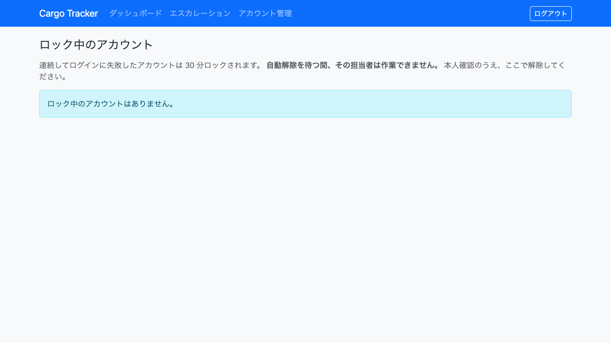

# 06. アカウント管理

ログインできなくなった担当者の**アカウントのロックを解除する**画面です。システム管理者が利用します。

**ロックの自動解除を待つ間、その担当者は作業できません。** 輸送は待ってくれないため、待ち時間がそのまま業務の停止時間になります。本人確認のうえ、この画面で解除してください。

## 画面の開き方

- メニュー「アカウント管理」（URL: `/admin/accounts`）
- ダッシュボードの「アカウント管理」カードの「開く」

| 画面 | 役割 | 節 |
| :--- | :--- | :--- |
| ロック中のアカウント | ロックの確認と解除 | [6.1](#61-ロックを解除する) |

## 6.1 ロックを解除する

### この画面でできること

- ロック中のアカウントを確認し、本人確認のうえロックを解除します。

### 画面の開き方

- メニュー「アカウント管理」（URL: `/admin/accounts`）

### 画面の説明

| # | 項目 | 説明 |
| :--- | :--- | :--- |
| ① | 利用者 | ロックされているログイン ID です |
| ② | 連続失敗回数 | 続けてログインに失敗した回数です |
| ③ | 自動解除の予定 | この時刻を過ぎると自動で解除されます |
| ④ | 解除の理由 | **必須です。** 監査ログに記録されます |
| ⑤ | 「ロックを解除」 | 入力した理由とともに解除します |

### 操作手順

1. メニュー「アカウント管理」をクリックします。
2. 対象の利用者を確認します。
3. **本人であることを確認します**（電話・対面など、システムの外での確認です）。
4. 解除の理由を入力します。
5. 「ロックを解除」をクリックします。

### 注意・補足

- **ログインに 5 回続けて失敗すると 30 分ロックされます。** 総当たり攻撃を防ぐためです。
- **解除には理由の入力が必須です。** 誰がなぜ解除したかを追えないと、監査ログは「解除された」という事実しか残しません。それでは不正な解除と正当な解除を後から区別できません。
- **解除すると失敗回数も 0 に戻ります。** 解除した直後に 1 回打ち間違えただけで再びロックされることはありません。
- **自動解除された利用者は一覧に出ません。** すでに解除されており、操作する必要がないためです。
- **本人確認はシステムの外で行ってください。** この画面は確認の結果を記録する場所であり、確認そのものは行いません。
- ロック中の利用者が 1 人もいないときは「ロック中のアカウントはありません。」と表示されます。正常な状態です。
