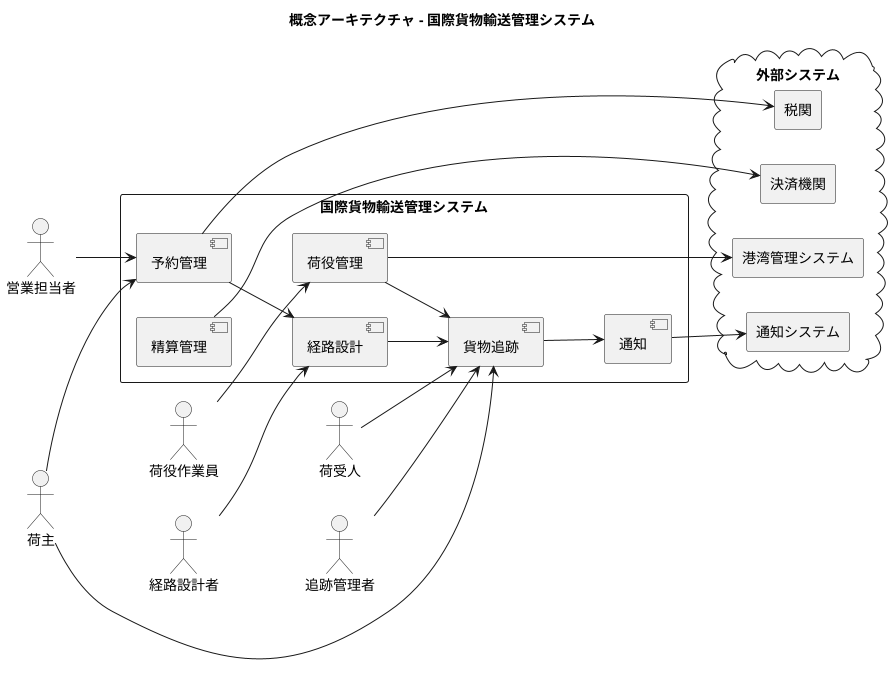
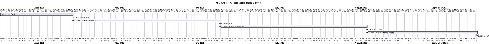

# インセプションデッキ - 国際貨物輸送管理システム

## 1. なぜやるのか？

### 解決すべき問題

国際貨物輸送会社では、**貨物追跡・予約管理・経路設計の情報システムが存在しない**（ケイパビリティ評価：新規）ため、以下の業務課題が発生している。

- **予約・ルート選定の煩雑さ**：荷主が最適なルート選定と予約手続きに多大な手間を要している。複数の航路・港湾・運送会社が存在し、貨物種別（一般・危険物・冷凍）によって取扱いが異なるため、人手による照合・調整が発生している
- **経路設計の複雑さと属人化**：航海スケジュール・寄港地の接続・港湾制約・貨物種別対応など多数の制約条件を考慮した最適経路の設計が複雑であり、経路設計者の経験と勘に依存している。手動での設計に時間がかかり、最適でない経路が選択されるリスクもある
- **荷役作業の手動記録によるタイムラグ**：荷役作業の記録が手動で行われており、貨物状態の更新が遅れる。これにより、荷主は現在位置・状態をリアルタイムで把握できない
- **透明性の欠如による不安と問い合わせ増加**：輸送状況が見えないため、荷主からのカスタマーサポートへの問い合わせが増加し、業務負荷が高まっている

これらの問題を解決しないと、荷主の信頼を失い、競合他社に顧客を奪われるリスクがある。

---

## 2. どんなビジョンなのか？

### プロダクトビジョン

> **「荷主が出発地・目的地・期限を指定するだけで、航海スケジュール・寄港地接続・港湾制約を考慮した最適ルートが自動提案され、いつでもどこでも貨物をリアルタイムで追跡できる、透明性の高い国際貨物輸送サービスを実現する」**

### ガイディングプリンシプル

| カテゴリ | プリンシプル | 意味 |
| :--- | :--- | :--- |
| ビジネス | 顧客中心の価値提供 | すべてのシステム機能は荷主・荷受人への価値提供を起点に設計する |
| アプリケーション | ドメイン駆動設計（DDD） | 境界付けられたコンテキストでシステムを分割し、ビジネス変化に追従できる構造を維持する |
| データ | 一貫性と追跡可能性 | 貨物の状態・位置・履歴を一貫して追跡可能にし、透明性を確保する |
| テクノロジー | 標準準拠と相互運用性 | UN/LOCODE 等の国際標準に準拠し、港湾・税関・運送会社等との連携を容易にする |

---

## 3. どんな価値をもたらすのか？

### ビジネス目標

| # | 目標 | 期待効果 |
| :--- | :--- | :--- |
| 1 | **予約業務の効率化** | 見積〜予約確定をシステム化し、営業担当者の手作業を削減する |
| 2 | **リアルタイム貨物追跡の実現** | 荷主が 24 時間いつでも貨物の現在位置・状態を確認できる |
| 3 | **輸送状況通知の自動化** | 状態変更時に荷主・荷受人へ自動通知し、カスタマーサポートの問い合わせを削減する |
| 4 | **最適ルート自動設計** | 航海スケジュール・寄港地接続・港湾制約・貨物種別対応を考慮し、出発地・目的地・期限から最適経路候補を自動算出する。経路設計者の属人的な作業を削減し、設計品質を均一化する |
| 5 | **例外対応の迅速化** | 遅延・破損・紛失の例外発生時に関係者へ即時共有し、対応時間を短縮する |
| 6 | **精算業務の正確化** | 輸送料金の自動算出・割引適用により精算ミスを防ぎ、経理業務の負担を軽減する |

---

## 4. スコープの範囲はどこか？

### スコープ内（優先順位順）

| 優先度 | 機能領域 | 主要フィーチャ |
| :---: | :--- | :--- |
| 1 | **貨物予約管理** | 荷主登録、貨物仕様登録（一般・危険物・冷凍）、見積作成、予約確定 |
| 2 | **経路設計** | 制約条件（航海スケジュール・寄港地接続・期限・貨物種別・港湾制約）に基づく最適経路候補の自動算出、経路条件の調整・再算出、経路の選択・確定、経路情報の予約紐付け、追跡番号発行 |
| 3 | **貨物追跡** | リアルタイム追跡、状態管理（受領〜引取）、追跡情報照会 |
| 4 | **荷役作業管理** | 荷役作業記録（積込・荷降し・受領・引取）、例外処理 |
| 5 | **通知** | 状態変更通知（メール・SMS）、荷主・荷受人への自動配信 |
| 6 | **精算管理** | 輸送料金算出、法人割引適用、精算処理 |

### スコープ外

- 船舶・航路の運航管理（外部パートナー領域）
- 港湾施設の物理的管理
- 人事管理・給与システム
- 一般経理・財務管理システム
- 税関申告システム（連携は行うが、申告業務自体は対象外）

### 検討中（アーキテクチャ上重要）

- モバイルアプリ（荷役作業員向け記録機能）
- 港湾管理システムとのリアルタイム連携

---

## 5. 主なステークホルダーは？

| ステークホルダー | 関心事 |
| :--- | :--- |
| **荷主**（個人・法人） | 簡単に予約できる、いつでも貨物の状況を確認できる、遅延時に即座に知らされる |
| **荷受人** | 貨物の到着予定が把握できる、配送完了が通知される |
| **営業担当者** | 見積・予約作業の効率化、顧客情報の一元管理 |
| **経路設計者** | 経路設計システムによる制約条件を考慮した経路候補の自動算出、最適ルートの迅速な選択・確定 |
| **追跡管理者** | 貨物状態のリアルタイム更新、例外発生の早期検知 |
| **荷役作業員** | 荷役記録の簡易入力（モバイル対応） |
| **経理担当者** | 輸送料金の正確な算出・精算、割引ルールの自動適用 |
| **IT 部門** | 貨物追跡・予約管理・経路設計システムの安定運用、外部連携の管理 |
| **港湾管理者・税関・運送会社** | 標準フォーマットでの情報連携 |
| **決済機関** | 安全な精算処理 |

---

## 6. 基本的な解決策はどのようなものになるか？

### 概念アーキテクチャ

### 設計方針

- **アーキテクチャ**: ドメイン駆動設計（DDD）に基づく境界付けられたコンテキスト分割
- **フロントエンド**: Web アプリケーション（荷主・社内担当者向け）
- **標準準拠**: UN/LOCODE に基づく港湾・都市コード管理
- **連携方式**: 外部システムとは API / イベント連携

---

## 7. 主なリスクは何か？

| # | リスク | 影響度 | 対応方針 |
| :--- | :--- | :---: | :--- |
| 1 | **外部システム連携の複雑性**：港湾管理・税関・決済機関との API 仕様が不明確 | 高 | 早期に各機関とのインタフェース定義を確認。スタブで先行開発 |
| 2 | **IT システムの新規構築リスク**：貨物追跡・予約管理・経路設計システムがゼロからの構築 | 高 | MVP 優先、段階的リリースで早期フィードバックを得る |
| 3 | **リアルタイム要件の技術的難易度**：荷役作業記録が即座に追跡情報に反映される要件 | 中 | イベント駆動アーキテクチャの採用を検討。PoC で実現可能性を確認 |
| 4 | **国際標準への準拠コスト**：UN/LOCODE 等の標準への適合に想定外の工数が発生する | 中 | 初期段階で標準仕様を調査し、データモデル設計に反映 |
| 5 | **荷役作業員のシステム利用定着**：現場スタッフが新システムに慣れるまでの運用リスク | 中 | モバイル対応 UI の UX を重視。段階的なトレーニング計画を立てる |
| 6 | **経路最適化アルゴリズムの複雑性**：航海スケジュール・寄港地接続・港湾制約・貨物種別対応など多数の制約条件を同時に満たす経路算出ロジックが複雑になる | 中 | 段階的に制約条件を追加する設計とし、初期は基本制約（出発地・目的地・期限）で PoC を実施。経路設計者のフィードバックを反映しながら精度を向上 |
| 7 | **危険物・冷凍貨物の規制対応**：貨物種別ごとの法的要件を見落とす可能性 | 中 | 要件定義段階で規制要件をヒアリング、専門家レビューを実施 |

---

## 8. どのくらい作業があり、費用はいくらか？

### チーム構成（仮定）

| ロール | 人数 | 担当範囲 |
| :--- | :---: | :--- |
| バックエンドエンジニア | 2 | API 開発、ドメインロジック、外部連携 |
| フロントエンドエンジニア | 1 | Web アプリケーション |
| インフラエンジニア | 1 | クラウドインフラ、CI/CD |
| QA エンジニア | 1 | テスト戦略、品質保証 |
| スクラムマスター / PM | 1 | プロジェクト管理、ステークホルダー調整 |

### 概算工数（ストーリーポイント）

| フェーズ | 機能領域 | 規模感 |
| :--- | :--- | :--- |
| フェーズ 1（MVP） | 予約管理、経路設計、基本追跡 | 大 |
| フェーズ 2 | 荷役管理、リアルタイム追跡、通知 | 大 |
| フェーズ 3 | 精算管理、外部連携強化 | 中 |

> 詳細な見積はアーキテクチャ設計・技術スタック選定後に算出する。

---

## 9. トレードオフにどう向き合うか？

### 優先度マトリックス

| 要素 | 優先度 | 理由 |
| :--- | :---: | :--- |
| **品質** | 🥇 最優先 | 貨物の誤追跡・予約ミスは荷主の信頼を直接損なう。正確性と信頼性は譲れない |
| **スコープ** | 🥈 次優先 | コア機能（予約・追跡）は必須。精算・高度な通知は後続フェーズへ移行可能 |
| **時間** | 🥉 3 番目 | 早期リリースは重要だが、品質を犠牲にした早期リリースは許容しない |
| **予算** | 4 番目 | インフラコストは最適化を図るが、品質・スコープのために必要なら増額を検討 |

### 重要な判断基準

- 機能追加 vs. 既存機能の品質向上：**品質向上を優先**
- 全機能同時リリース vs. 段階的リリース：**段階的リリース（MVP ファースト）**
- 独自開発 vs. 外部サービス活用：**標準化領域（通知・決済）は外部活用**

---

## 10. 初回リリースが可能になるのはいつか？

### マイルストーン

### フェーズ別スコープ

| フェーズ | 内容 | マイルストーン |
| :--- | :--- | :--- |
| **分析フェーズ** | 要件定義・アーキテクチャ設計・技術スタック選定 | 分析フェーズ完了 |
| **フェーズ 1（MVP）** | 予約管理、経路設計（制約条件に基づく経路候補自動算出・選択・確定）、基本的な貨物追跡、追跡番号発行 | **MVP リリース** |
| **フェーズ 2** | 荷役作業管理、リアルタイム追跡、通知システム連携 | フェーズ 2 リリース |
| **フェーズ 3** | 精算管理、外部連携強化（税関・港湾・決済機関） | **正式リリース** |

> スケジュールは分析フェーズ完了後、アーキテクチャと技術スタックが確定した段階で詳細化する。

---

## 参照ドキュメント

- [ビジネスアーキテクチャ分析書](../strategy/business_architecture.md)
- [要件定義書](../requirements/requirements_definition.md)
