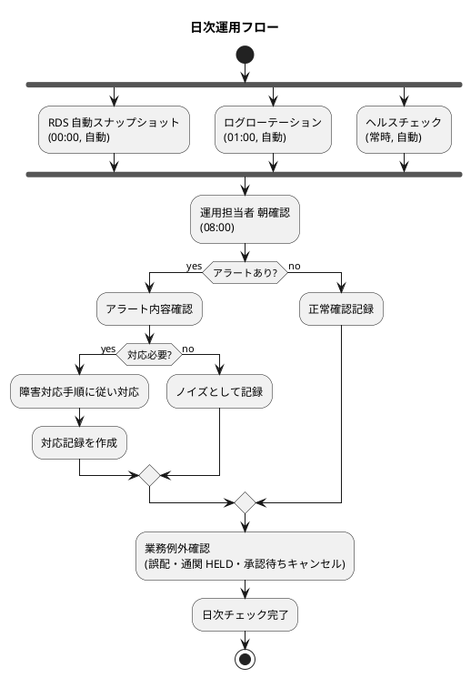
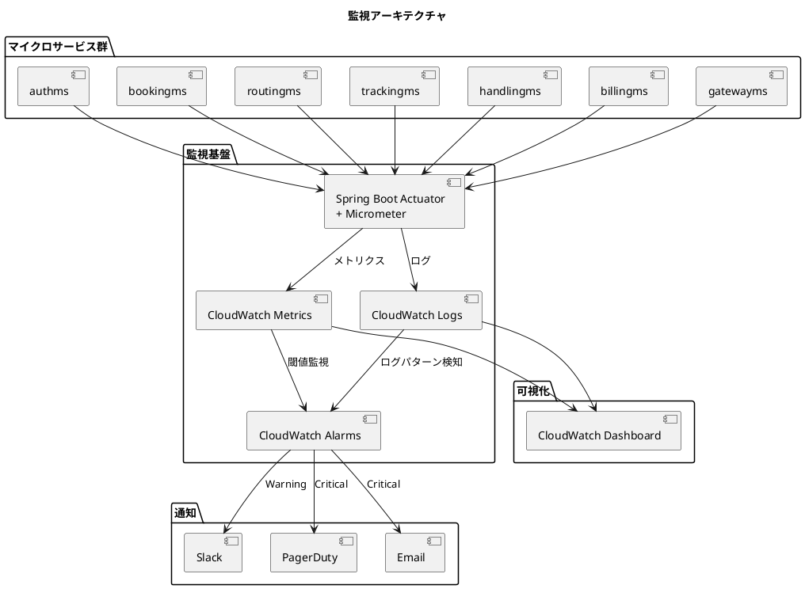
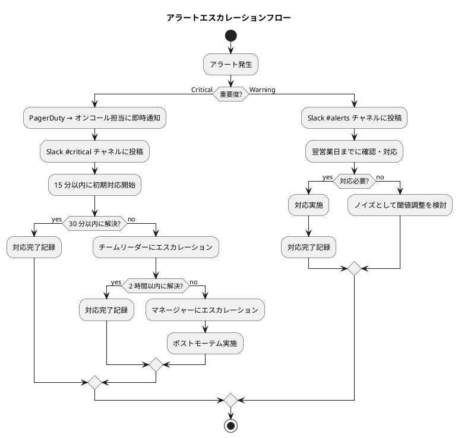
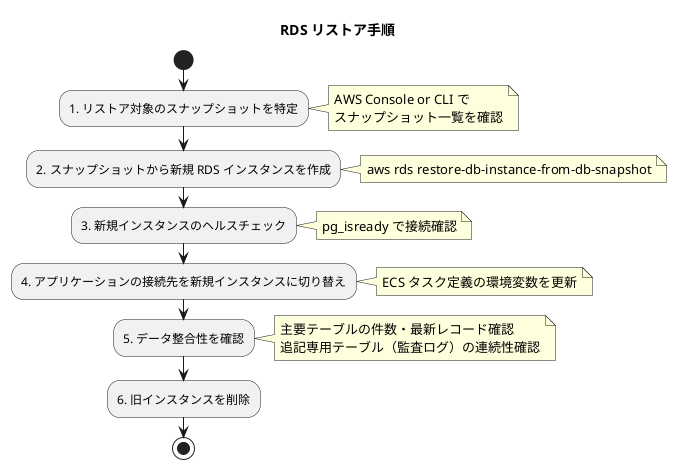
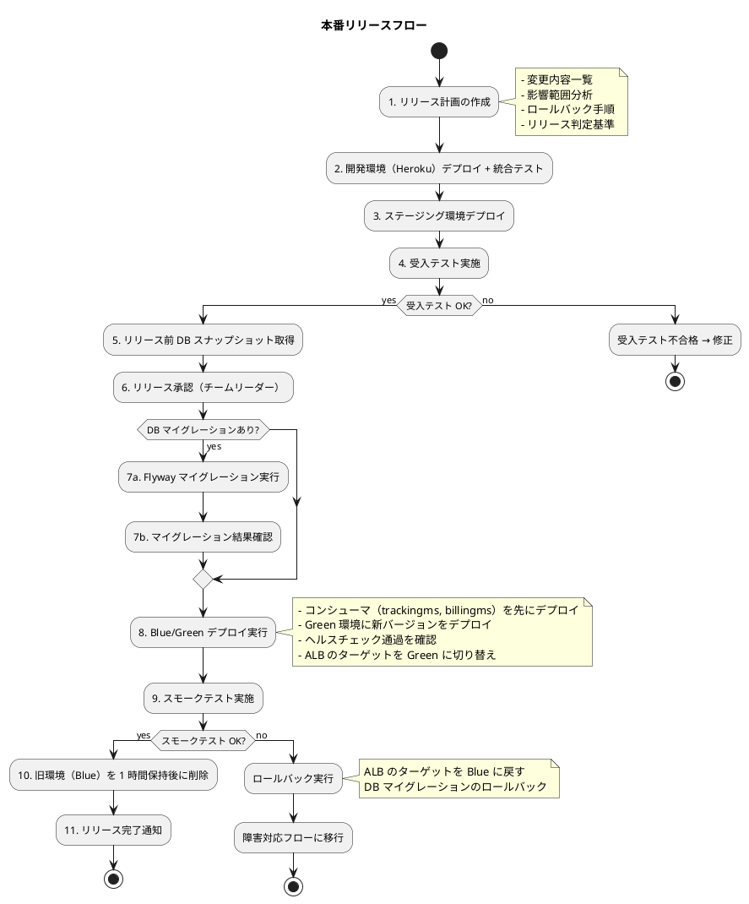
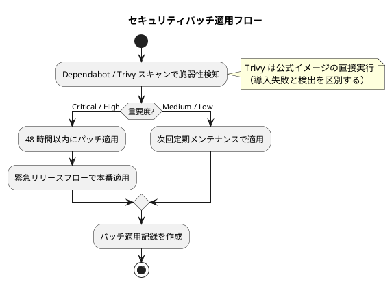

# 運用要件定義 - 国際貨物輸送管理システム

## 概要

本ドキュメントは、7 マイクロサービス + React SPA で構成される国際貨物輸送管理システムの運用要件を定義する。本番・ステージングは AWS ECS (Fargate)、開発は Heroku Container Runtime、ローカルは kind + Kustomize の 3 段構えを前提とし、自動化を基本方針とする。

本定義は take-3 の運用要件を基礎とし、本プロジェクトの要件差分
（通関監査 UC21・キャンセル承認 UC22・誤配検知 US28・アカウント保護 US31・Heroku 開発環境）を反映している。

### 運用方針

- **自動化優先**: 手動運用を最小化し、人的ミスを排除する
- **手順書ファースト**: 環境への操作は `docs/operation/` の手順書に定義されたタスクで行い、独自の一時スクリプトを作らない
- **Observability**: 全サービスの内部状態を外部から観測可能にする
- **障害の局所化**: マイクロサービスの独立性を活かし、障害の影響範囲を限定する
- **ゼロダウンタイムデプロイ**: 本番は Blue/Green デプロイメントでサービス停止なくリリースする

### SLI / SLO / SLA

| 指標 (SLI) | 目標 (SLO) | 合意 (SLA) | 測定方法 |
| :--- | :--- | :--- | :--- |
| 可用性 | 99.95%（月間） | 99.9%（年間） | CloudWatch ヘルスチェック成功率 |
| API レスポンスタイム p95 | 500ms 以内 | 1s 以内 | CloudWatch メトリクス |
| 追跡照会（公開） p95 | 300ms 以内 | 500ms 以内 | CloudWatch メトリクス |
| エラー率（5xx） | 0.1% 以下 | 1% 以下 | ALB アクセスログ |
| イベント処理遅延 | 5s 以内 | 30s 以内 | RabbitMQ キューメトリクス |

**エラーバジェット**: SLO 99.95% = 月間許容ダウンタイム 21.9 分。エラーバジェット残量が 50% を下回った場合、新機能リリースを凍結し安定化に注力する。

---

## 1. 運用フロー設計

### 1.1 日次運用

| 時刻 | 作業 | 実行方式 | 担当 |
| :--- | :--- | :--- | :--- |
| 00:00 | RDS 自動スナップショット | AWS Backup 自動実行 | 自動 |
| 01:00 | ログローテーション | CloudWatch Logs 自動 | 自動 |
| 06:00 | ヘルスチェック確認 | ダッシュボード目視 | 運用担当 |
| 08:00 | 前日のアラート履歴確認 | CloudWatch ダッシュボード | 運用担当 |
| 08:00 | 業務例外の確認（誤配 MISROUTED・通関 HELD 3 日超・承認待ちキャンセル滞留） | 業務ダッシュボードの件数表示から対象レコードへ遷移 | 追跡管理者 |
| 随時 | アラート対応 | PagerDuty → Slack 通知 | オンコール担当 |

> 業務例外の確認は「件数を見る」だけで終わらせない。件数表示から対象レコードへ直接遷移し、次の行動（再設計依頼・督促・承認判断）まで繋げる。

### 1.2 週次運用

| 曜日 | 作業 | 実行方式 |
| :--- | :--- | :--- |
| 月曜 | 週次運用レポート作成 | CloudWatch ダッシュボードからメトリクス確認 |
| 水曜 | セキュリティパッチ確認 | Dependabot アラート + Trivy（公式イメージ直接実行） |
| 金曜 | 容量トレンド確認 | RDS / ECS のリソース使用率推移 |
| 金曜 | アカウントロック発生状況の確認 | auth_audit_log の集計（総当たり攻撃の兆候確認、US31） |

### 1.3 月次運用

| 作業 | 実行方式 | 成果物 |
| :--- | :--- | :--- |
| SLA レポート作成 | CloudWatch メトリクス集計 | 月次 SLA レポート |
| セキュリティパッチ適用 | ECS タスク定義更新 + ローリングデプロイ | パッチ適用記録 |
| 容量計画レビュー | RDS / ECS / MQ のリソース使用率分析 | 容量計画書 |
| バックアップリストアテスト | RDS スナップショットからの復元テスト | テスト結果報告 |
| エラーバジェット残量確認 | SLO 達成率の集計 | エラーバジェットレポート |
| 監査ログの完全性確認 | auth_audit_log / customs_status_history に UPDATE / DELETE が発生していないことの確認 | 監査ログ確認記録 |

### 1.4 年次運用

| 作業 | 時期 | 備考 |
| :--- | :--- | :--- |
| DR テスト | 年 1 回（9 月） | マルチ AZ フェイルオーバーテスト |
| セキュリティ監査 | 年 1 回（3 月） | 脆弱性診断 + アクセス権限棚卸 |
| SSL 証明書更新 | ACM 自動更新 | 手動更新不要（ACM マネージド） |
| Java ランタイム更新 | LTS リリース時 | Docker イメージの JRE 更新 |
| 通関監査対応 | 監査要請時 | customs_status_history（7 年保持）の抽出手順を手順書に整備 |

### 運用フロー図



---

## 2. 監視設計

### 2.1 監視アーキテクチャ



> 開発環境（Heroku）は `heroku logs` / CloudAMQP コンソールでの確認に留め、アラート通知は本番・ステージングのみに設定する。

### 2.2 監視項目一覧

#### インフラ監視

| 監視項目 | メトリクス | Warning | Critical | 確認間隔 |
| :--- | :--- | :--- | :--- | :--- |
| CPU 使用率 | ECS TaskCPUUtilization | > 70% (5 分) | > 90% (3 分) | 1 分 |
| メモリ使用率 | ECS TaskMemoryUtilization | > 75% (5 分) | > 90% (3 分) | 1 分 |
| RDS CPU | RDS CPUUtilization | > 70% (5 分) | > 90% (3 分) | 1 分 |
| RDS 接続数 | RDS DatabaseConnections | > 70% max | > 90% max | 1 分 |
| RDS ストレージ | RDS FreeStorageSpace | < 20% | < 10% | 5 分 |
| RabbitMQ キュー深度 | MQ MessageCount | > 500 | > 1000 | 1 分 |
| RabbitMQ DLQ 滞留 | MQ DLQ MessageCount | - | > 0 | 1 分 |

#### アプリケーション監視

| 監視項目 | メトリクス | Warning | Critical | 確認間隔 |
| :--- | :--- | :--- | :--- | :--- |
| レスポンスタイム p95 | http_server_requests_seconds | > 1s (5 分) | > 3s (3 分) | 1 分 |
| エラー率 (5xx) | http_server_requests_total{status=5xx} | > 1% (5 分) | > 5% (1 分) | 1 分 |
| ヘルスチェック | actuator/health | DOWN 1 回 | DOWN 3 回連続 | 30 秒 |
| JVM ヒープ使用率 | jvm_memory_used_bytes | > 80% | > 95% | 1 分 |
| GC 停止時間 | jvm_gc_pause_seconds | > 500ms | > 2s | 1 分 |

> ヘルスチェック（liveness / readiness）はレートリミット等の横断的防御の対象外とする（過負荷時の再起動ループを防ぐ）。

#### ビジネス監視

| 監視項目 | メトリクス | 閾値 | 確認間隔 |
| :--- | :--- | :--- | :--- |
| 予約登録件数 | cargo_booked_total | 0 件/1 時間で Warning | 5 分 |
| イベント処理遅延 | event_processing_lag_seconds | > 30s で Warning | 1 分 |
| 認証失敗率 | auth_login_failed_total | > 10 件/5 分で Warning（総当たり攻撃の兆候） | 1 分 |
| アカウントロック発生数 | auth_account_locked_total | > 3 件/1 時間で Warning | 5 分 |
| 誤配（MISROUTED）発生 | tracking_misrouted_total | 1 件で Warning（US28） | 1 分 |
| 通関 HELD 3 日超過 | customs_held_over_3days | 1 件で Warning + 督促通知（UC21） | 1 時間 |
| キャンセル承認待ち滞留 | cancellation_pending_over_24h | 1 件で Warning（UC22） | 1 時間 |

### 2.3 エスカレーションフロー



### 2.4 オンコール体制

| 項目 | 内容 |
| :--- | :--- |
| オンコール対応時間 | 24 時間 365 日 |
| ローテーション | 週単位で交代（2 名体制） |
| 応答時間目標 | Critical: 15 分以内、Warning: 翌営業日 |
| ツール | PagerDuty（エスカレーション管理） |

---

## 3. バックアップ設計

### 3.1 バックアップ方式

| 対象 | 方式 | 頻度 | 保持期間 | RPO |
| :--- | :--- | :--- | :--- | :--- |
| RDS（全 DB） | 自動スナップショット | 日次 (00:00) | 7 日 | 24 時間 |
| RDS（全 DB） | PITR（ポイントインタイムリカバリ） | 5 分間隔（自動） | 7 日 | 5 分 |
| RDS（リリース前） | 手動スナップショット | リリース前 | 30 日 | - |
| S3 監査ログ | バージョニング + ライフサイクルポリシー | 即時 | 1 年（通関履歴は DB で 7 年） | 0 |
| Terraform 状態 | S3 + DynamoDB ロック | 変更時 | 無期限 | 0 |
| Docker イメージ | ECR | ビルド時 | 直近 10 世代 | - |

> 開発環境（Heroku）は H2 メモリ DB のためバックアップ対象外。データ消失を許容する。

### 3.2 バックアップ対象の DB 一覧

| DB 名 | サービス | 重要度 | 備考 |
| :--- | :--- | :--- | :--- |
| `auth_db` | authms | 高 | auth_audit_log（追記専用・1 年）を含む |
| `booking_db` | bookingms | 最高 | cancellation_request（承認記録・5 年）を含む |
| `routing_db` | routingms | 中 | - |
| `tracking_db` | trackingms | 高 | - |
| `handling_db` | handlingms | 高 | customs_status_history（追記専用・7 年）を含む。監査要件上、リストア時の欠損は不可 |
| `billing_db` | billingms | 最高 | 請求書は法定保存 7 年 |

### 3.3 リストア手順

#### RDS スナップショットからのリストア



> リストア後の復元データに新しい不変条件を遡及適用しない（「不変条件の追加は既存行を壊す」）。検査は新規受け入れ時のみ行う。

### 3.4 リストアテスト

| テスト項目 | 実施頻度 | 成功基準 |
| :--- | :--- | :--- |
| スナップショットからのフルリストア | 月次 | RTO 4 時間以内でサービス復旧 |
| PITR によるポイントインタイムリカバリ | 四半期 | RPO 5 分以内でデータ復旧 |
| 全サービス一括リストア | 年次（DR テスト） | 全サービス RTO 4 時間以内 |

---

## 4. 障害対応設計

### 4.1 障害分類

| レベル | 定義 | 影響範囲 | 対応時間目標 |
| :--- | :--- | :--- | :--- |
| P1（重大） | 全サービス停止 or データ損失リスク | 全ユーザー | 15 分以内に対応開始、4 時間以内に復旧 |
| P2（高） | 単一サービス停止 or 主要機能障害 | 該当機能の利用者 | 30 分以内に対応開始、2 時間以内に復旧 |
| P3（中） | 性能劣化 or 一部機能の不具合 | 一部ユーザー | 翌営業日までに対応 |
| P4（低） | 表示崩れ・軽微な不具合 | 限定的 | 次回リリースで対応 |

### 4.2 障害パターン別対応手順

#### パターン 1: 単一サービス障害

| 手順 | 対応内容 | 担当 |
| :--- | :--- | :--- |
| 1 | CloudWatch アラートで障害検知 | 自動 |
| 2 | ECS が自動的にタスクを再起動（ヘルスチェック失敗 3 回） | 自動 |
| 3 | 自動復旧しない場合、オンコール担当に通知 | PagerDuty |
| 4 | ECS タスクのログを確認（`aws logs get-log-events`） | オンコール |
| 5 | 必要に応じて前バージョンにロールバック | オンコール |
| 6 | 対応記録を作成、翌日ポストモーテム | オンコール |

#### パターン 2: DB 障害

| 手順 | 対応内容 | 担当 |
| :--- | :--- | :--- |
| 1 | RDS イベント通知で障害検知 | 自動 |
| 2 | Multi-AZ 構成の場合、自動フェイルオーバー（1-3 分） | 自動 |
| 3 | フェイルオーバー後の接続確認 | オンコール |
| 4 | データ整合性確認（主要テーブル件数チェック） | オンコール |
| 5 | 原因調査（RDS イベントログ・Performance Insights） | 運用チーム |

#### パターン 3: RabbitMQ 障害

| 手順 | 対応内容 | 担当 |
| :--- | :--- | :--- |
| 1 | Amazon MQ ヘルスチェックで障害検知 | 自動 |
| 2 | Amazon MQ クラスターの自動復旧を待つ | 自動 |
| 3 | 復旧後、未処理メッセージの状態を確認 | オンコール |
| 4 | Dead Letter Queue のメッセージを確認・再処理 | オンコール |
| 5 | イベント処理の結果整合性を確認（追跡状態・通関状態・請求の同期漏れ） | 運用チーム |

#### パターン 4: API Gateway 障害

| 手順 | 対応内容 | 担当 |
| :--- | :--- | :--- |
| 1 | ALB ヘルスチェックで障害検知 | 自動 |
| 2 | ECS が Gateway タスクを自動再起動 | 自動 |
| 3 | 全 API エンドポイントの疎通確認（公開追跡照会を含む） | オンコール |
| 4 | フロントエンドからの接続確認 | オンコール |

#### パターン 5: 認証異常（総当たり攻撃の兆候）

| 手順 | 対応内容 | 担当 |
| :--- | :--- | :--- |
| 1 | 認証失敗率 / アカウントロック多発アラートで検知 | 自動 |
| 2 | auth_audit_log で発信元 IP・対象アカウントを特定 | オンコール |
| 3 | 攻撃と判断した場合、Gateway のレートリミット強化 / IP 遮断 | オンコール |
| 4 | 影響アカウントのロック状態確認・必要に応じて ADMIN が解除 | 運用チーム |
| 5 | セキュリティインシデントとして記録・ポストモーテム | 運用チーム |

### 4.3 ポストモーテムテンプレート

P1・P2 障害の発生後、48 時間以内にポストモーテムを実施する。

```markdown
## ポストモーテム: [障害タイトル]

### 概要
- 発生日時: YYYY-MM-DD HH:MM - HH:MM
- 影響範囲: [影響を受けたサービス・ユーザー数]
- 障害レベル: P1 / P2
- 対応時間: [検知〜復旧の所要時間]

### タイムライン
| 時刻 | イベント |
|------|---------|
| HH:MM | [イベント内容] |

### 根本原因
[根本原因の分析結果]

### 対応内容
[実施した対応の詳細]

### 再発防止策
| 対策 | 担当 | 期限 |
|------|------|------|
| [対策内容] | [担当者] | [期限] |

### 学び
[今回の障害から得られた知見]
```

---

## 5. 変更管理設計

### 5.1 リリースフロー



### 5.2 ロールバック手順

| ロールバック対象 | 手順 | 所要時間 |
| :--- | :--- | :--- |
| アプリケーション（本番） | ALB ターゲットグループを Blue 環境に切り戻し | 1 分 |
| アプリケーション（開発 Heroku） | `heroku releases:rollback` | 1 分 |
| DB マイグレーション | Flyway Undo マイグレーション実行 | 5-10 分 |
| DB データ | リリース前スナップショットからリストア | 30 分-2 時間 |
| 設定変更 | Terraform で前バージョンの状態に apply | 5 分 |

### 5.3 変更承認フロー

| 変更種別 | 影響範囲 | 承認者 | リードタイム |
| :--- | :--- | :--- | :--- |
| 通常リリース | アプリケーション更新 | チームリーダー | 1 営業日前 |
| DB スキーマ変更 | テーブル構造変更 | チームリーダー + DBA | 3 営業日前 |
| イベントスキーマ変更 | サービス間契約の変更（後方互換必須） | チームリーダー + 契約テスト通過 | 3 営業日前 |
| インフラ変更 | Terraform 変更 | チームリーダー | 2 営業日前 |
| 緊急リリース | セキュリティパッチ・重大バグ修正 | チームリーダー（事後承認可） | 即時 |

### 5.4 メンテナンスウィンドウ

| 項目 | 内容 |
| :--- | :--- |
| 定期メンテナンス | 毎月第 2 日曜 02:00-04:00 JST |
| 事前通知 | 5 営業日前にメール通知 |
| メンテナンス中の表示 | メンテナンスページを表示（CloudFront カスタムエラーページ） |
| 計画外メンテナンス | 緊急時のみ。可能な限り 4 時間前に通知 |

---

## 6. セキュリティ運用

### 6.1 アクセス管理

| 対象 | 方式 | 備考 |
| :--- | :--- | :--- |
| AWS コンソール | IAM + MFA 必須 | 最小権限の原則 |
| 本番 DB 直接アクセス | SSH トンネル経由、DBA のみ | 操作ログ記録必須。手順書のタスクを使う |
| Heroku アプリ | Heroku Team 権限管理 | Config Vars の変更は記録を残す |
| ECS タスクログ | CloudWatch Logs（IAM 権限制御） | 運用チーム全員 |
| Terraform 実行 | CI/CD パイプライン経由のみ | 手動実行禁止 |

### 6.2 セキュリティパッチ管理



### 6.3 アクセス権限棚卸

| 対象 | 頻度 | 確認内容 |
| :--- | :--- | :--- |
| IAM ユーザー・ロール | 四半期 | 不要なユーザー・過剰な権限の削除 |
| アプリケーションロール | 四半期 | 6 ロール（SHIPPER/SALES/HANDLER/TRACKER/ACCOUNTANT/ADMIN）の付与適切性確認 |
| ロック中アカウント | 四半期 | 長期ロック・休眠アカウントの棚卸（US31） |
| DB アクセス権限 | 半期 | 接続元 IP・ユーザーの確認 |

---

## 運用ツール一覧

| カテゴリ | ツール | 用途 |
| :--- | :--- | :--- |
| 監視 | Amazon CloudWatch | メトリクス・ログ・アラーム |
| アラート通知 | PagerDuty | オンコールエスカレーション |
| チャット通知 | Slack | Warning アラート・運用連絡 |
| インシデント管理 | GitHub Issues | 障害チケット・ポストモーテム |
| IaC | Terraform | インフラ変更管理 |
| CI/CD | GitHub Actions | ビルド・テスト・デプロイ |
| 脆弱性スキャン | Trivy（公式イメージ直接実行） | イメージ・依存関係の走査 |
| ログ分析 | CloudWatch Logs Insights | 構造化ログの検索・分析 |
| DB 管理 | pgAdmin / DBeaver | DB 操作（SSH トンネル経由・手順書準拠） |
| コンテナ管理 | AWS ECS Console / CLI | タスク管理・ログ確認 |
| 開発環境管理 | Heroku CLI | 開発環境のデプロイ・ログ・Config Vars |
| ローカル環境 | kind / kubectl / Kustomize | ローカルクラスタ管理 |

## 参照

- [要件定義書](../requirements/requirements_definition.md)
- [インフラストラクチャアーキテクチャ設計](architecture_infrastructure.md)
- [非機能要件定義](non_functional.md)
- [運用要件定義ガイド](../reference/運用要件定義ガイド.md)
