# UI 設計 - 国際貨物輸送管理システム

## 概要

本ドキュメントでは、国際貨物輸送管理システムの UI 設計を定義する。
take-3 の UI 設計を基礎とし、本プロジェクトの要件差分（公開追跡照会 US18・通関管理 US29・キャンセル承認 US30・誤配再設計 US28・アカウント保護 US31・荷主向け自社貨物追跡 US33・無操作タイムアウト TD-01）を反映している。

### 設計方針

**OOUX（オブジェクト指向 UI 設計）** をベースに、ユーザーが操作する「オブジェクト」（貨物予約・追跡・荷役・通関申告・航海・請求書）を中心に画面を構成する。各画面はオブジェクトの状態を可視化し、アクターに応じた操作を提供する。

### 技術スタック

| 技術 | 役割 |
| :--- | :--- |
| React 19.x | SPA フレームワーク |
| React Router 7.x | クライアントサイドルーティング |
| TanStack Query 5.x | サーバー状態管理（API データのキャッシュ・ポーリング） |
| Zustand 5.x | クライアント状態管理（認証・UI 状態） |
| Tailwind CSS 4.x | ユーティリティファーストのスタイリング |
| fetch (built-in) | HTTP クライアント（API Gateway 経由で各マイクロサービスに接続） |

### 基本 UX 原則

- **オブジェクト中心**: 一覧 → 詳細 → アクションの自然な流れ
- **状態の可視化**: BookingStatus・TransportStatus・CustomsStatus をバッジで常時表示
- **フィードバック**: 操作成功・失敗はトースト通知で即時フィードバック
- **アクセシビリティ**: ARIA ラベル・キーボードナビゲーション対応
- **導線設計**: ロール別到達性・状態軸の到達性・認証不要画面の入口・荷主向け自社貨物画面の入口を DoD に含める（フロントエンドアーキテクチャの導線設計の原則に準拠）

### 画面共通の規約（IT4 で新設）

IT2・IT3 のふりかえりが繰り返し「`ui_design.md` の規約」を反映先に指定していたにもかかわらず、
その節が存在しませんでした。**反映先が無い改善は反映されません。**画面ごとの記述に散っていた
決めごとを、ここに集めて全画面に効く規約とします。個別の画面設計はこの規約を前提に、
差分だけを書きます。

#### 一覧規約

- **既定の絞り込みと並び順は「その利用者が毎朝どう使うか」で決める。** 終わったもの（出港済みの
  航海・引き渡し済みの予約・解決済みの例外）が既定で先頭に来ていないか必ず確かめる。朝いちばんに
  開いて最初に目に入るのがそれでは、一覧そのものが信用されない
- **件数の上限で切ったときは、総件数とともにその事実を伝える。** 黙って切ると「条件に合うのは
  これで全部だ」と読まれる
- **0 件のときは、どの条件が強く効いているかを示し、その条件を外す操作を置く。** 「該当なし」だけ
  では次の行動に繋がらない
- **件数や警告を出すときは、そこから対象へ行けるようにする。** 気づく手段は次の行動へ繋ぐ

#### 入力規約

- **編集は「今の内容が入った状態」で開く。** 識別子だけを引き継いで空のフォームを出さない。
  打ち直しの過程で、変えるつもりのなかった項目が変わる
- **コード（UN/LOCODE 等）を直接入力させない。** 一覧から選ばせる
- **決まった値のあるものは選択式にする。** 法定分類のような閉じた集合を自由入力にしない
- **重複や競合は、拒否ではなく利用者への問いかけにする**（荷主のメールアドレス重複・航海番号の
  重複）。現場には正当な理由で重なるケースが実在する

#### 表示規約

- **利用者に判断させる表示は、利用者の言葉と時刻で出す。** 列挙名（`GENERAL`）・UTC・
  UN/LOCODE のまま見せて「これで上書きしますか」と問うのは、判断させているように見えて
  判断できない
- **日時は業務タイムゾーンで表示する。** 入力した時刻と違う時刻を見せない
- **確定していない値は、確定していないと書く。** 概算・暫定値をそのまま金額として見せない
- **状態はバッジで常時表示する**（BookingStatus・TransportStatus・RoutingStatus・CustomsStatus）
- **次のイテレーションで使えるようになる操作は、押せないボタンとして置かない。** いつ使えるように
  なるかを文で書く

### 認証・認可ポリシー（UI）

- 業務画面はログイン必須とする
- **追跡照会（`/tracking/:trackingNumber`）は認証不要の公開画面とする**（US18）。ログイン画面とポータル（トップ）にも入口を置く
- **ただし、ログイン済みで開いたときは共通レイアウト（サイドバー）の中に置く**。認証を求めないのは荷主のためであり、業務利用者の導線を切る理由にはならない。**「認証の外に置く」と「ログイン済みの人にメニューを出さない」は別である**——メニューが消えると戻る手段がブラウザバックしか無くなる。戻り先のリンクも、ログイン済みならダッシュボードへ向ける
- 未ログインで業務画面にアクセスした場合はログイン画面へリダイレクトする
- ログイン済みで権限のない画面にアクセスした場合は 403 画面を表示する
- `ROLE_SHIPPER` は予約管理（`/booking*`）を直接読まない。自社貨物は `/shipper/tracking` と `/shipper/tracking/:trackingNumber` で追跡コンテキストから読む
- 認証済み画面は 15 分無操作で警告を出し、20 分無操作で認証ストアを破棄してログイン画面へ戻す。警告には入力中の内容が保存されないことを明示する
- 画面表示制御と API 実行可否は同一の RBAC マトリクスに従う

---

## UI オブジェクト定義

| オブジェクト | 主な属性 | ユーザーアクション | 関連オブジェクト |
| :--- | :--- | :--- | :--- |
| **貨物予約（Booking）** | bookingId, 出発地, 目的地, 希望期限, 貨物種別, BookingStatus, RoutingStatus | 新規登録・詳細確認・経路割り当て・確定・キャンセル申請 | 追跡情報, 航海, 荷役履歴, キャンセル申請 |
| **キャンセル申請（CancellationRequest）** | 理由, 状態, 申請者/日時, 陸揚げ地, 承認者/日時 | 申請・承認（陸揚げ地指定）・却下（理由必須） | 貨物予約 |
| **荷主（Shipper）** | shipperCode, 荷主名, メール, 種別（個人/法人）, 割引率 | 新規登録・一覧確認・詳細確認 | 貨物予約 |
| **見積（Estimate）** | estimateId, 出発地, 目的地, 期限, 貨物種別, ルート候補 | 新規作成・一覧確認・詳細確認 | 貨物予約 |
| **追跡情報（Tracking）** | trackingNumber, TransportStatus, 現在地, イベント履歴, 例外 | 追跡番号検索・履歴確認・例外解決 | 貨物予約 |
| **自社貨物追跡（ShipperTracking）** | trackingNumber, 状態, 現在地, 到着予定, 例外有無 | 自社貨物一覧確認・詳細確認 | 追跡情報, 利用者と荷主の紐付け |
| **例外イベント（Exception）** | 種別（遅延/破損/紛失/誤配/税関保留）, 発生場所/日時, 解決状況 | 起票・解決記録・一覧確認 | 追跡情報 |
| **荷役作業（HandlingEvent）** | eventId, 貨物 ID, 荷役種別, 場所, 実施日時, 荷受人確認 | 新規登録・一覧確認 | 貨物予約, 通関申告 |
| **通関申告（CustomsDeclaration）** | 申告番号, 追跡番号, CustomsStatus, 申告日時, 状態履歴 | 申告登録・状態更新（理由必須）・履歴確認 | 荷役作業 |
| **航海（Voyage）** | voyageNumber, 出発港, 到着港, 出発予定日, 到着予定日 | 一覧確認・新規登録・更新（差分確認） | 貨物予約 |
| **請求書（Invoice）** | invoiceId, 貨物予約, 金額, 割引, キャンセル料, PaymentStatus | 一覧確認・詳細確認・支払い確認 | 貨物予約 |

---

## 画面一覧

| 画面名 | URL パス | 説明 | 主要アクター | 対応 US |
| :--- | :--- | :--- | :--- | :--- |
| ポータル | `/` | 公開トップ。追跡照会への入口とログイン導線 | 全員（認証不要） | US18 |
| ログイン | `/login` | JWT 認証フォーム。追跡照会への導線あり | 全ロール | US26, US31 |
| ダッシュボード | `/dashboard` | ロール別サマリー・要対応件数 | 全ロール | - |
| 荷主一覧 | `/booking/shippers` | 荷主の一覧・検索 | 営業担当者 | US02, US03 |
| 権限エラー（403） | `/403` | 権限のない画面へのアクセス時に表示。**そのロールのダッシュボードへ戻る導線を置く**（行き止まりにしない） | 全ロール | US26 |
| 荷主登録 | `/booking/shippers/new` | 新規荷主登録フォーム。**同一メールアドレスの荷主が既にある場合は既存荷主を提示し、「既存の荷主を使う」「それでも新規で登録する」の 2 択を出す**（IT1 で確定。詳細は本節末尾） | 営業担当者 | US02, US03 |
| 見積一覧 | `/booking/estimates` | 見積の一覧・検索 | 営業担当者 | US01 |
| 見積作成 | `/booking/estimates/new` | 新規見積フォーム | 営業担当者 | US01 |
| 見積詳細 | `/booking/estimates/:estimateId` | ルート候補一覧 | 営業担当者 | US01 |
| 貨物予約一覧 | `/booking` | 予約済み貨物の一覧・検索 | 営業担当者（[ADR-008](../adr/008-no-user-shipper-link-in-it2.md) により荷主には開かない。**US18 では広げ直さない**——[ADR-024](../adr/024-tracking-manual-update-and-exceptions.md) 決定 10） | US04, US05 |
| 貨物予約登録 | `/booking/new` | 新規予約フォーム | 営業担当者 | US04, US05 |
| 予約詳細 | `/booking/:bookingId` | 予約情報・経路・荷役履歴・キャンセル申請履歴・**誤配バナー**（IT10）。バナーは**いま外れているとき**だけ赤い指示（組み直してください＋[経路を再設計する]）を出し、**組み直したあとは灰色の「誤配の記録」に変わる**（[ADR-026](../adr/026-misroute-detection-and-rerouting.md) 決定 3・4b）——直したのに赤いままだと済んだ仕事をやり直す。期限を超えるなら**何日超えるか**も出す（US28-6。伝えるのは営業） | 営業担当者、経路設計者、**追跡管理者・荷役作業員（読むだけ）** | US06, US13, US28, US30 |
| キャンセル承認 | `/booking/cancellations` | 承認待ちキャンセル申請の一覧・承認/却下 | 追跡管理者 | US30 |
| 経路設計 | `/routing/design/:bookingId` | 経路候補の一覧（**IT4**）→ 選択・割り当て（US09 / IT5）。**誤配のときは現在地が出発地**で、**期限を超える候補も出す**（IT10・[ADR-026](../adr/026-misroute-detection-and-rerouting.md) 決定 4）。確定した予約でも誤配なら組み直せる。期限を超えるときは**何日超えるかを出して遷移を止める**（US28-6） | 経路設計者 | US07-US11, US28 |
| 航海スケジュール管理 | `/routing/voyages` | 航海スケジュール一覧 | 経路設計者 | US24, US25 |
| 航海スケジュール登録 | `/routing/voyages/new` | 新規航海登録フォーム（重複時は差分確認） | 経路設計者 | US24, US25 |
| 航海スケジュール詳細 | `/routing/voyages/:voyageNumber` | 寄港地と区間ごとの時刻の確認 | 経路設計者 | US07, US08 |
| 貨物追跡照会（公開） | `/tracking/:trackingNumber` | 輸送ステータスタイムライン（**認証不要**）。**ログイン済みならサイドバー付きで表示する** | 荷主、荷受人、全ロール（メニュー経由） | US18 |
| 荷主へのお知らせ（ポップアップ） | 画面共通 | 自社貨物への新しい知らせを画面の隅に出す。**押すとその貨物の詳細へ行ける**。ログインした荷主にだけ出る（15 秒間隔で読む・[ADR-032](../adr/032-shipper-notification-delivery.md)） | 荷主 | US39 |
| 自分の貨物 | `/shipper/tracking` | ログインした荷主に紐付く自社貨物だけの一覧。状態・現在地・到着予定・例外有無を表示し、未紐付けなら問い合わせ案内を出す | 荷主 | US33 |
| 自分の貨物詳細 | `/shipper/tracking/:trackingNumber` | 自社貨物の追跡詳細。追跡番号を知っていても他社貨物は 404 として扱う | 荷主 | US33 |
| 貨物状態管理 | `/tracking/manage` | 状態手動更新・例外の起票と解決 | 追跡管理者、荷役作業員（参照・起票） | US17, US19, US20, US28 |
| 未解決の例外一覧 | `/tracking/manage/exceptions` | 未解決の例外がある貨物（緊急を先に、次に発生の古い順）。**誤配の行には予約への導線**を出す（IT10・US28-7）——気づく人（追跡管理者）と直す人（経路設計者）が違う。**予約詳細を開けないロールには出さず**「（経路設計者が組み直します）」と伝える（押した先で 403 にしない） | 追跡管理者、荷役作業員、**営業担当者（読むだけ）** | US19, US20, US28 |
| 荷役作業記録 | `/handling` | 荷役イベント登録フォーム（モバイル対応）・この貨物の作業履歴 | 荷役作業員（記録）・追跡管理者（参照のみ） | US15, US16 |
| 荷役作業一覧 | `/handling/list` | 荷役履歴一覧・検索 | 荷役作業員、追跡管理者 | US15 |（**IT7 では作らない**。履歴は記録画面の中に出す——作業員がいるのはその画面であり、記録するたびに別画面へ移らせると手が止まる。検索を伴う一覧が要るのは、予約詳細から荷役履歴を辿る IT8 である）
| 陸揚げ待ち | `/handling/awaiting-discharge` | 承認済みで陸揚げ地が決まった貨物（IT10）。**作業指示は自動で作られない**ため、荷役側がここで自分の手番に気づく | 荷役作業員、追跡管理者 | US30 |
| 通関管理 | `/customs` | 通関申告一覧・検索（**既定は未決着だけ**・留置 3 日超の警告表示・件数と切り捨ての明示。IT10） | 荷役作業員、追跡管理者 | US29 |
| 通関申告登録 | `/customs/new` | 申告番号・日時の登録 | 荷役作業員 | US29 |
| 通関申告詳細 | `/customs/:declarationId` | 状態更新（理由必須）・状態変更履歴 | 追跡管理者 | US29 |
| 精算管理 | `/billing` | 料金未算出の予約と発行済み精算書の 2 つの待ち行列。`?filter=overdue` で**支払期限を過ぎた請求だけ**に絞る（受入基準 23-5 の代替。ダッシュボードの件数から来る） | 経理担当者 | US21・US22・US23。**請求番号・荷主名・予約番号での検索と発行月の絞り込み、件数と合計（取り消し済みを除く）を出す**（US38） |
| 料金算出 | `/billing/new/:bookingId` | 輸送実績・基本料金の根拠・割引・調整の入力・確定 | 経理担当者 | US21・US22 |
| 請求書詳細 | `/billing/:invoiceId` | 金額内訳（割引率つき・**税区分**）・キャンセル料の根拠・**入金の記録**・**取り消し（赤伝）**・**印刷**。**金額を動かす操作は無い**（[ADR-027](../adr/027-transport-charge-calculation.md) 決定 4） | 経理担当者 | US21・US22・US23 |
| 入金確認 | `/billing/:invoiceId/payment` | 入金日・金額・方法・参照番号の入力（IT12）。**決済機関とは連携していないことを画面が言う**（受入基準 23-3 の代替） | 経理担当者 | US23 |

---

## 共通レイアウト設計

### ナビゲーション構成

全画面共通のサイドバーナビゲーションを左側に配置する。ロールに応じてメニュー項目を表示制御する。

| メニュー項目 | 遷移先 | 表示ロール |
| :--- | :--- | :--- |
| ダッシュボード | `/dashboard` | 全ロール |
| 荷主管理 | `/booking/shippers` | ROLE_SALES |
| 見積管理 | `/booking/estimates` | ROLE_SALES |
| 貨物予約 | `/booking` | ROLE_SALES（`ROLE_SHIPPER` は開かない。自社貨物は `/shipper/tracking` で読む） |
| キャンセル承認 | `/booking/cancellations` | ROLE_TRACKER |
| ~~予約詳細~~ | `/booking/:bookingId` | ROLE_SALES, ROLE_ROUTING, **ROLE_TRACKER・ROLE_HANDLER（読むだけ。IT10）**。**サイドバーには置かない**（予約を選ばないと開けない）。追跡管理者・荷役に開いたのは、例外一覧・キャンセル承認・陸揚げ待ちのいずれからもここへ渡す導線があり、**押すと 403 になっていた**ため（IT10 レビュー）。**一覧（`/booking`）は広げない**——例外や承認から辿る 1 件を読むことと、営業の案件を横断して眺めることは別である。操作は集約の述語とロールで出し分ける |
| 航海スケジュール | `/routing/voyages` | ROLE_ROUTING |
| ~~経路設計~~ | `/routing/design/:bookingId` | ROLE_ROUTING。**サイドバーには置かない**。予約を選ばないと開けない画面であり、メニューから踏むと予約番号の無い URL になる。入口は予約詳細の [経路を割り当て] とし、経路設計者は「経路設計待ち」の予約一覧から辿る |
| 貨物追跡 | `/tracking` | 全ロール（公開画面への導線） |
| 自分の貨物 | `/shipper/tracking` | ROLE_SHIPPER |
| 貨物状態管理 | `/tracking/manage` | ROLE_TRACKER, ROLE_HANDLER |
| 未解決の例外 | `/tracking/manage/exceptions` | ROLE_TRACKER, ROLE_HANDLER, ROLE_SALES。**営業は読むだけ**——荷主は公開照会で「ご依頼元の営業担当へ」と案内されるため、営業が何も知らないままでは案内が行き止まりになる（IT9 返済枠 0.9）。起票と解決には開かない |
| 荷役管理 | `/handling` | ROLE_HANDLER, ROLE_TRACKER |
| 陸揚げ待ち | `/handling/awaiting-discharge` | ROLE_HANDLER, ROLE_TRACKER |
| 通関管理 | `/customs` | ROLE_HANDLER, ROLE_TRACKER |
| 精算管理 | `/billing` | ROLE_ACCOUNTANT |
| アカウント管理 | `/admin/accounts` | ROLE_ADMIN。ロックされたアカウントの解除（US32）。**他のロールには出さない**——出すと、押した先で 403 になる画面へ誘導することになる |
| 業務シミュレーション | `/admin/simulations` | ROLE_ADMIN。予約から精算までを自動で 1 本通す（US34・US35）。**例外シナリオも選べる**（US36）。同じ画面で**継続実行**を開始・停止し、統計を見る（US37）。**業務の担当者には出さない**——業務データを作る操作である。詳細は `/admin/simulations/:runId` |
| ログアウト | - | 全ロール |

> **ロール名は IT1 で確定した（2026-08-19）**。経路設計者は独立したロール `ROLE_ROUTING` とする。
> 根拠: 要件定義のアクター一覧で経路設計者は営業担当者と別のアクターであり、`ROLE_SALES` が兼ねると
> 営業が航海スケジュール登録・経路確定まで行えてしまい職掌分離が崩れる。
> 全 7 値: `ROLE_SHIPPER` / `ROLE_SALES` / `ROLE_ROUTING` / `ROLE_HANDLER` / `ROLE_TRACKER` / `ROLE_ACCOUNTANT` / `ROLE_ADMIN`
> （domain-model.md・architecture_backend.md・non_functional.md と同一変更で更新済み）。

> **荷主ロールの予約参照について（[ADR-008](../adr/008-no-user-shipper-link-in-it2.md)・[ADR-029](../adr/029-shipper-tracking-boundary-and-inactivity-timeout.md)）**:
> 当初は予約参照を `ROLE_SALES` と `ROLE_SHIPPER` の両方に開く設計だったが、authms の利用者と bookingms の
> 荷主を結ぶキーが無く、「自分の予約だけ」に絞り込めなかった。IT13 で `user_shipper_link` は追加されたが、
> 予約管理画面そのものは営業の操作画面であり、荷主には開かない。荷主は `/shipper/tracking` で自社貨物だけを
> 追跡し、公開追跡（US18）は追跡番号を知る人向けの別入口として残す。

> **段階実装の注記**: ポータル（`/`）の追跡番号入力欄は、**IT1 では非活性**とする（追跡照会 US18 は Release 1.0）。
> IT1 ではログイン導線と「未認証で 200 を返す入口」としての役割のみを担い、US18 の実装時に活性化する。

### 画面/API 権限マトリクス

| 機能 | 画面パス | API プレフィックス | 実行ロール |
| :--- | :--- | :--- | :--- |
| 荷主・見積管理 | `/booking/shippers*`, `/booking/estimates*` | `/api/v1/shippers`, `/api/v1/estimates` | `ROLE_SALES` |
| 予約管理 | `/booking*` | `/api/v1/bookings` | `ROLE_SALES`（**`ROLE_SHIPPER` は開かない**。荷主向けの自社貨物参照は `/shipper/tracking*`） |
| 予約の参照（引き渡された分） | `/booking`, `/booking/:bookingId` | `GET /api/v1/bookings*` | `ROLE_ROUTING`（**`ROUTING_REQUESTED` と `ROUTED` に限る**。[ADR-015](../adr/015-routing-requested-state.md) 決定 5・[ADR-020](../adr/020-itinerary-assignment-transitions.md) 決定 3。見えない予約は存在しない予約と同じ 404） |
| 経路の割り当て | `/routing/design/:bookingId` | `PUT /api/v1/bookings/{bookingId}/route` | `ROLE_ROUTING`（**営業には開かない**。営業が自分で経路を確定できると職掌分離が崩れる） |
| キャンセル承認 | `/booking/cancellations` | `/api/v1/bookings/*/cancellation/approve|reject` | `ROLE_TRACKER` |
| 航海・経路設計 | `/routing*` | `/api/v1/voyages`, `/api/v1/voyages/{voyageNumber}`, `/api/v1/routes` | `ROLE_ROUTING` |
| 追跡照会（公開） | `/tracking/:trackingNumber` | `GET /api/v1/public/tracking/*` | **認証不要** |
| 自社貨物追跡 | `/shipper/tracking*` | `GET /api/v1/shipper/tracking*` | `ROLE_SHIPPER`。authms の利用者紐付けと bookingms の荷主 Snapshot で自社貨物だけを返す。未紐付けは 200 + 問い合わせ案内、他社貨物詳細は 404 |
| 業務シミュレーション | `/admin/simulations`, `/admin/simulations/:runId` | `/api/v1/simulations*`（継続実行は `/api/v1/simulations/sessions*`） | `ROLE_ADMIN`（**業務の担当者には開かない**。業務データを作る操作である。[ADR-030](../adr/030-business-simulation-execution.md)・[ADR-031](../adr/031-random-continuous-simulation.md)。実行を無効にした環境では `POST` が 503） |
| 貨物状態管理・例外 | `/tracking/manage` | `/api/v1/tracking/manage*` | 更新・起票・解決は `ROLE_TRACKER`、**参照は `ROLE_HANDLER` にも開く**（US20-1。荷役作業員が現場で状態を確かめられないと、記録の前に電話が要る）。**未解決の例外を読むだけは `ROLE_SALES` にも開く**（IT9 返済枠 0.9） |
| 荷役管理 | `/handling*` | `/api/v1/handling` | `ROLE_HANDLER`, `ROLE_TRACKER`（参照のみ） |
| 通関管理 | `/customs*` | `/api/v1/customs` | `ROLE_HANDLER`（申告登録）, `ROLE_TRACKER`（状態更新） |
| 精算管理 | `/billing*` | `/api/v1/billing` | `ROLE_ACCOUNTANT` |
| 料金算出 | `/billing/new/:bookingId` | `/api/v1/billing/calculations` | `ROLE_ACCOUNTANT` |

### 共通レイアウト ワイヤーフレーム

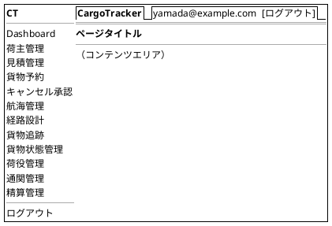

---

## 画面遷移図

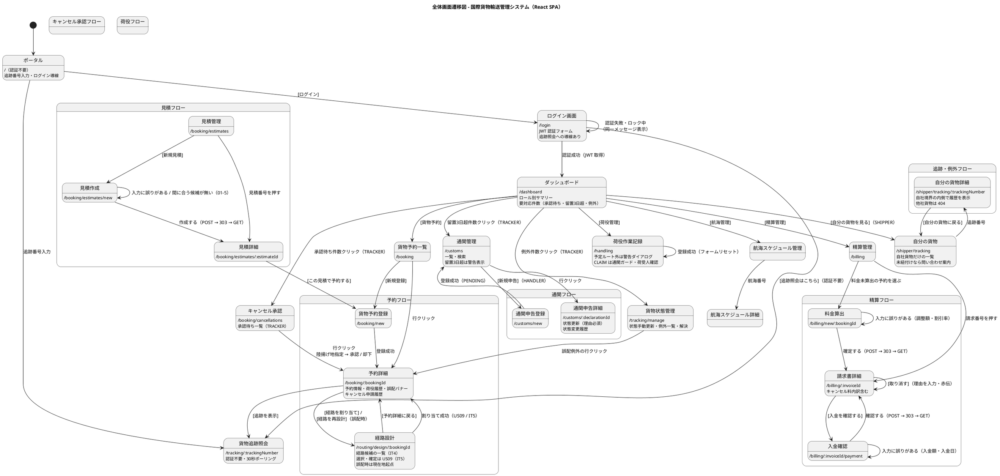

---

## 画面詳細設計

> **take-3 からの引き継ぎ方**: 見積・精算の各画面は take-3 の設計を踏襲する
> （API パスは `/api/v1/` に統一）。以下では take-7 で追加・変更した画面を定義する。
>
> **take-7 で定義済みの画面**（踏襲ではなく、この文書が正）:
>
> | 画面 | 定義した IT |
> | :--- | :--- |
> | ポータル・ログイン・ダッシュボード | IT1 |
> | 荷主一覧・荷主登録（法人契約情報を含む） | IT1・IT2 |
> | 貨物予約一覧・貨物予約登録（危険物・冷凍を含む） | IT2 |
> | 航海スケジュール一覧・航海スケジュール登録（差分確認を含む） | IT3 |
> | 航海スケジュール詳細 | IT4 |
> | 経路設計（経路候補一覧。**選択・確定は US09 / IT5**） | IT4 |
> | 貨物予約詳細（経路設計への引き渡しを含む） | IT3 |
> | 自分の貨物・自分の貨物詳細・無操作タイムアウト警告 | IT13 |
>
> 「踏襲する」と書いたまま実装すると、どちらが正か分からないまま両方が育つ。
> 画面を実装した IT で、この表に足して take-7 側を正にする。

### 自分の貨物一覧 (/shipper/tracking) ― IT13 で定義

荷主がログイン後に自社貨物だけを追跡する画面。予約管理画面は営業担当者の操作画面であり、荷主には開かない。自社境界は画面ではなくサーバ側の `/api/v1/shipper/tracking` が守る。

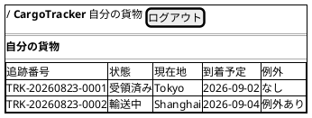

未紐付け利用者には「荷主との紐付けがありません」と問い合わせ先を表示する。これは空一覧ではなく業務上の設定不足であり、荷物が無い状態と区別する。

### 業務シミュレーション (/admin/simulations) ― IT14 で定義・IT15 で拡張

システム管理者が、予約から精算までを自動で 1 本通す画面。**業務の担当者には開かない**——
業務データを作る操作である。生成した荷主は `SIM-` 帯で識別され、営業の荷主一覧と
精算の締め対象からは外れる（[ADR-030](../adr/030-business-simulation-execution.md) 決定 3）。

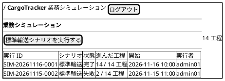

同じシナリオが実行中なら 409 で断り、**実行中の実行への導線**を出す（US34-5）。
断るだけでは、指示した人はいま何が動いているかを確かめられない。

**シナリオは選ぶ**（US36-1・IT15）。標準輸送に加えて遅延・破損・誤配・税関保留・
輸送中キャンセルを選べる。選んだシナリオの工程数を横に出す——シナリオごとに違う。

**継続実行は同じ画面に置く**（US37・IT15）。画面を分けると、管理者は開始した実行の
結果を見るために画面を渡り歩くことになる。

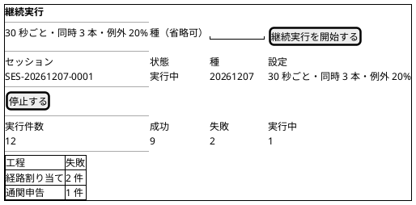

**種をそのまま出す**（US37-3）。記録していても読めなければ、落ちた実行を再現する
手段が画面から消える。種を指定して開始すると、同じ並びが再現される。

**「停止する」を押した直後は「停止処理中」である**（[ADR-031](../adr/031-random-continuous-simulation.md) 決定 4）。
新規の開始だけが止まり、進行中の実行は最後まで走る。分けて表示しないと、統計が
確定していない状態で「停止しました」と読まれる。

**失敗した工程の分布を出す**（US37-8）。件数だけでは「たくさん落ちている」としか
分からず、直す場所が決まらない——気づく手段は次の行動へ繋ぐ。

### 業務シミュレーションの結果 (/admin/simulations/:runId) ― IT14 で定義

工程ごとの成否・所要時間・生成した識別子・失敗理由を並べる。止まった実行では、
表の上に**止まった理由**を出す——「失敗しました」だけでは、経路候補が 0 件なのか
接続先が違うのかを切り分けられない。

**繋ぐのは追跡照会だけ**である。予約詳細は営業・経路設計者、精算書は経理にしか
開かれておらず、システム管理者が押すと 403 になる。押した先が行き止まりになる導線は置かない。

### 自分の貨物詳細 (/shipper/tracking/:trackingNumber) ― IT13 で定義

一覧から選んだ 1 件の追跡状態と時系列の経過を表示する。公開追跡画面とは URL を分け、認証済み荷主の自社境界をサーバ側でも検査する。他社貨物の追跡番号を直接指定した場合は 404 とし、存在有無を画面で示さない。

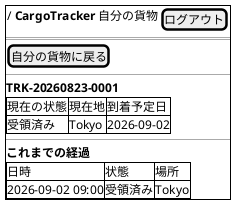

### 無操作タイムアウト警告（TD-01）― IT13 で定義

認証済みレイアウトは pointerdown・keydown・focus を操作として扱う。15 分無操作で画面上部に警告を表示し、20 分無操作で `sessionStorage` の認証状態を破棄して `/login` へ履歴置換で戻す。

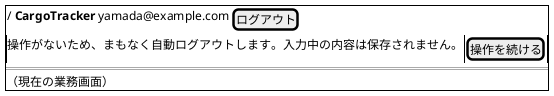

警告は画面全体を覆わず、入力中のフォームを隠さない位置に出す。`操作を続ける` を押すかキーボード操作などがあれば、無操作時間を数え直す。

### 航海スケジュール一覧・検索 (/routing/voyages) ― IT3 で定義

経路設計者が「この予約に合う船はあるか」を探す画面。**条件に合うものが無かったときに、
条件を緩めて探し直せる**ことを設計に含める。0 件で終わると、条件のどれが効きすぎたのかが
分からないまま「該当なし」だけが残る。

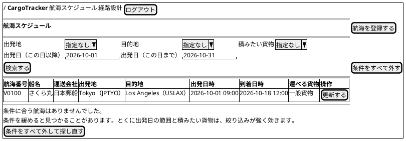

| 項目 | 必須 | 説明 |
| :--- | :--- | :--- |
| 出発地・目的地 | | 一覧から選ぶ（UN/LOCODE を直接入力させない）。**寄港の順序**で絞るため、逆向きの航海は出ない |
| 積みたい貨物 | | 一般貨物 / 危険物 / 冷凍・冷蔵。対応できる航海だけが残る |
| 出発日（この日以降 / この日まで） | | 出発日時で絞る。表示は業務タイムゾーン |

- **上限は 50 件。切ったときは「◯件ありますが、先頭の 50 件だけを表示しています」と伝える。**
  黙って切ると「条件に合う航海はこれで全部だ」と読まれる
- **[更新する] は航海番号を引き継いで登録画面へ遷移する**（`?voyageNumber=...`）。
  番号を打ち直させると、打ち間違いで別の航海ができる
- 港湾制約による絞り込みは行わない（[ADR-018](../adr/018-route-search-rules.md) で「持たない」と決めた。
  対応できる貨物種別は港ではなく**航海**が持つ）

### 航海スケジュール登録・更新 (/routing/voyages/new) ― IT3 で定義

登録と更新を 1 つの画面で扱う。**同じ航海番号での登録を拒否しない**。経路設計者が同じ番号を
入れるのは多くの場合スケジュールの差し替えであり、そこで止めると別の番号を作る（同じ航海が
2 つになる）か、一覧から探し直すことになる。差分を見せて上書きを選ばせる。

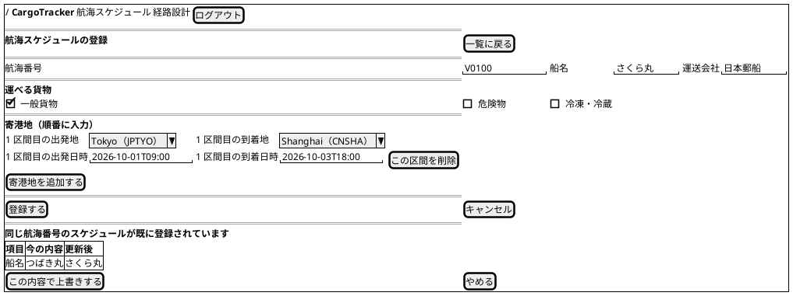

| 項目 | 必須 | 説明 |
| :--- | :--- | :--- |
| 航海番号 | ○ | 一覧の [更新する] から来たときは入った状態で開く |
| 船名 | ○ | どの船かが分からないと、荷役と問い合わせで貨物を追えない |
| 運送会社 | ○ | 同上 |
| 運べる貨物 | ○ | 1 つ以上。すべて外すと「何も運べない航海」になり、検索から静かに消える |
| 寄港地 | ○ | 1 区間以上。**前の区間の到着地から次の区間が出る**。区間を追加すると出発地が自動で入る |
| 出発日時・到着日時 | ○ | 業務タイムゾーンで入力する。到着は出発より後 |

> **未入力・不整合は画面のメッセージで示す。** ブラウザ既定の検証は吹き出しで知らせるだけで
> 画面には何も残らず、「押しても何も起きない」と受け取られる。

#### よくある入力の誤り

| 表示されるメッセージ | 直し方 |
| :--- | :--- |
| 航海番号は必須です | 航海番号の欄が空です |
| 船名は必須です | 船名の欄が空です |
| 運送会社は必須です | 運送会社の欄が空です |
| 対応できる貨物種別を 1 つ以上選んでください | 「運べる貨物」がすべて外れています |
| N 区間目の出発地と到着地は同じにできません | どちらかを別の港に変えます |
| N 区間目の到着日時は出発日時より後にしてください | 到着日時を入れ直します |
| N 区間目は、前の区間の到着地から出発するようにしてください | 前の区間の到着地に合わせます |
| N 区間目が前の区間の到着より前に出発しています | 出発日時を入れ直します |

#### 差分確認（US25）

- 差分がある場合のみ [この内容で上書きする] を出す。**差分が無いときは「変更はありません」と伝え、
  上書きを促さない**（判断できない問いを投げないため）
- [やめる] を選べば既存は変わらない

### 経路設計 (/routing/design/:bookingId) ― IT4 で定義・IT5 で選択と確定を追加

経路設計者が、引き渡された予約に対して**期限内に着く経路の候補を見比べて選ぶ**画面。
IT4 は候補一覧の表示までで、**IT5 で選択・確定まで閉じた**（US09 / US11）。

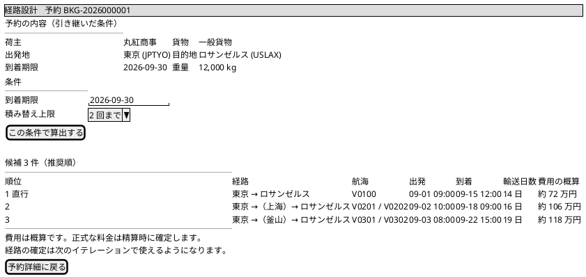

| 項目 | 説明 |
| :--- | :--- |
| 予約の内容 | 予約詳細から引き継ぐ。**空のフォームを出さない**（入力規約） |
| 到着期限 | **日付**で入力する。業務上「9 月 30 日まで」は「30 日中に着けばよい」を意味し、サーバが業務タイムゾーンでのその日の終わりに直す（[ADR-017](../adr/017-route-candidates-api.md)）|
| 積み替え上限 | 既定は 2 回まで。候補が無かったときに緩めるための入口 |
| 順位 | サーバが返した推奨順をそのまま表示する。**画面は並べ替えない**（[ADR-018](../adr/018-route-search-rules.md)）|
| 経路 | 港の**名前**で表す。UN/LOCODE は括弧で併記する（表示規約）|
| 出発・到着 | **業務タイムゾーン**で表示する（表示規約）|
| 費用の概算 | **概算であることを画面に書く**。US21 で実料金に差し替える |

- **直行便は「直行」と分かる形で示す。** 積み替えが無いことは、乗り継ぎ失敗も荷役による損傷も
  起きないという意味であり、経路設計者がまず見るところである
- **航海番号から航海詳細へ行ける。** 候補に出た航海の寄港地と区間ごとの時刻を確認できないと、
  候補の妥当性を判断できない
- **候補の行に [この経路を選ぶ] を置く。** IT4 では確定が作れていなかったため押せないボタンを置かず、文で断っていた。IT5 で使えるようになったので、その文言を消す（**使えない機能の案内を残さない**）
- **船名・運送会社・積み替え港での待ち時間も出す**（IT5）。航海番号と所要日数だけでは、どの船・どの会社が運ぶのか、どこでどれだけ止まるのかが分からない
- **条件は URL に持つ**（IT5）。航海詳細を見て戻ったり再読み込みしたりしても、同じ条件で開き直せる。条件の調整は履歴を積まない（予約詳細へ戻るのに何度も押すことにならないため）

#### 候補を選んだあとの確認（IT5・US09）

**押した瞬間に確定しない。** 経路の確定は予約の状態を動かし、荷主への提示につながる。押し間違いを取り消す手段が無い操作を、一覧の行から直接起こさない。

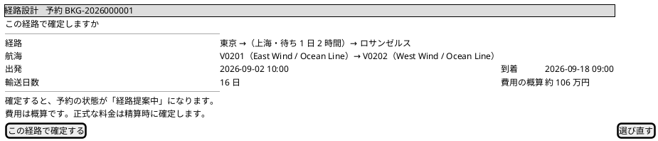

| 項目 | 説明 |
| :--- | :--- |
| 経路・航海 | 選んだ候補の行と**同じ内容**を出す。別の書き方にすると、選んだものと確定するものが同じか確かめられない |
| 確定後に何が起こるか | **状態の変化を先に伝える**（「経路提案中」になる）。押したあとに気づくことにしない |
| [選び直す] | 一覧へ戻る。**条件は保ったまま**（入れ直させない） |

- **確定すると予約詳細へ移る。** そこに旅程が出ていることで、確定できたことが分かる（[ADR-020](../adr/020-itinerary-assignment-transitions.md) 決定 2）
- **選んだ経路がもう成立しなければ、その理由を出して一覧へ戻す。** 候補を出してから確定するまでに航海が変わることがある（[ADR-019](../adr/019-route-assignment-api.md) 決定 2）。「確定できませんでした」だけでは、経路設計者は何を直せばよいか分からない。**次の行動は「もう一度探す」であり、入力の修正ではない**
- **経路が決まったあとも、この画面は開ける**（[ADR-020](../adr/020-itinerary-assignment-transitions.md) 決定 3・4）。航海の遅延・欠航で差し替えることがある。すでに割り当て済みであることを画面に示す

#### 候補が 1 件も無かったとき

「該当なし」で終わらせない。**どの条件が効いているかを示し、そこから条件を緩める操作へ繋ぐ**
（一覧規約）。

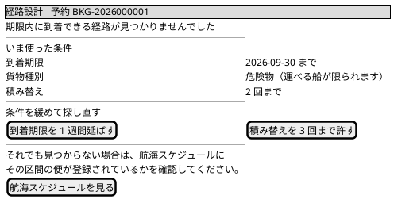

- **危険物・冷凍は「運べる船が限られる」ことを添える。** 貨物種別が効いていることに気づけないと、
  経路設計者は期限だけを緩め続ける
- 最後の逃げ道として、航海スケジュール一覧への導線を置く。登録そのものが無い可能性がある

### 貨物予約登録 (/booking/new) ― IT2 で定義

種別で追加項目が出入りする画面のため、take-3 の踏襲では足りず take-7 の形を定義する。

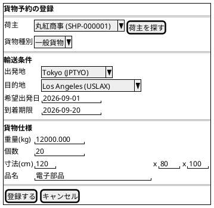

**貨物種別で出し分ける追加項目**（US05）。種別を戻したときに、前に入力した値は捨てる。

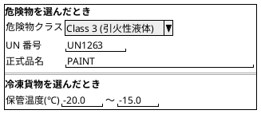

**画面の決めごと**

- 荷主は一覧から選ぶ。ID の直接入力はさせない（存在しない荷主 ID を弾く責務をサーバだけに寄せると、打ち間違いが登録の失敗としてしか返らない）
- 到着期限は**目的地の暦**で判断し、過去日付を拒む（[ADR-010](../adr/010-location-master-shape.md)）
- 登録すると**一覧に戻り、採番された予約番号を表示する**
- 危険物は申告 3 項目すべてが必須、冷凍は下限 ≦ 上限。**一般貨物にそれらを付けることも拒む**
- 予約金額は IT2 では表示しない（US21・US22・IT11 まで算出できない。0 円と表示すると未算出と無料の区別がつかなくなる。[ADR-009](../adr/009-cargo-status-columns-from-the-start.md)）

> **予約詳細画面（`/booking/:bookingId`）は IT2 では作らない。** 経路・配送状況・キャンセルが揃う
> IT3 以降に作る。IT2 の登録完了は一覧に戻し、遷移図の「予約詳細」への線は IT3 の対象とする。

### ポータル (/) ― 追加

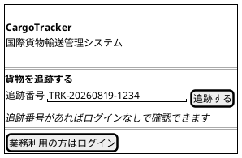

- 認証不要。追跡番号を入力すると `/tracking/:trackingNumber` に遷移する
- 業務利用者は `[ログイン]` から `/login` へ

### ログイン画面 (/login) ― 変更

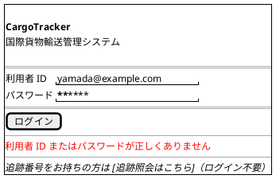

#### 仕様

- `POST /api/v1/auth/login` で JWT トークンを取得し Zustand ストアに保存
- **エラーメッセージは認証情報誤り・アカウントロック中・無効化アカウントのすべてで同一文言**「利用者 ID またはパスワードが正しくありません」を表示する（US31。アカウントの存在有無を攻撃者に教えない）
- ロック発生時の通知はメール等の帯域外で行う。画面には出さない
- ログイン成功後: ロールに応じたダッシュボードへ遷移
- 追跡照会（認証不要）への導線を必ず配置する

### ダッシュボード (/dashboard) ― 変更

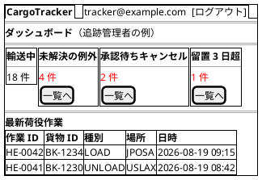

#### 仕様

- **ロール別ウィジェット**: 表示カードはロールで切り替える
  - 営業担当者: 予約件数・未割り当て・キャンセル申請中
  - 追跡管理者: 未解決例外・承認待ちキャンセル・留置 3 日超（**件数クリックで該当一覧へ直接遷移**）
  - 荷役作業員: 本日の荷役件数・通関待ち貨物
  - 経理担当者: 未払い請求・期限超過
- 要対応件数のカードは対応が必要な状態のレコード一覧へ 1 クリックで遷移できる（状態軸の到達性）

### 荷主登録 (/booking/shippers/new) ― 追加（IT1）

同一メールアドレスの荷主が既にある場合の確認。**エラーではなく問いかけ**として扱う。

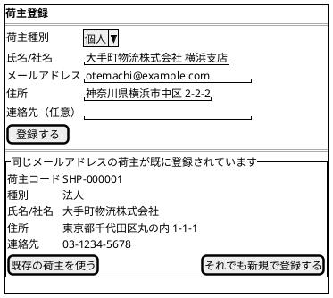

#### 仕様

- `POST /api/v1/shippers` が 409 を返したときに表示する（契約は architecture_backend.md を参照）
- **種別を必ず示す。** 個人か法人かは「同じ相手か別会社か」を判断する一番大きな手がかりである
- 「既存の荷主を使う」→ そのメールアドレスで**絞り込んだ**荷主一覧へ遷移する。絞り込まずに戻すと、営業担当者は用のある荷主を全件から探し直すことになる
- 「それでも新規で登録する」→ `registerAnyway: true` で再送し、別の荷主コードで登録する

### 荷主一覧 (/booking/shippers) ― 追加（IT1）

- **新しく登録した順**に並べる。営業の使い方は「登録した直後に一覧へ戻って入ったか確かめる」であり、登録順だと今入れた 1 件が常に最下部に沈む
- 件数を表示する。絞り込み中は条件も併記する（「絞り込めていないのに 0 件」という読み違いを防ぐ）
- 絞り込み条件は URL のクエリに持つ。重複確認から遷移したときに、その荷主に絞られた状態で開けるようにするため
- **各行に `[編集]` を置く**（IT5・US02）。転居・改称は一覧を見ている最中に気づくため、そこから直せないと営業は同じ荷主をもう 1 件登録することになる

### 荷主編集 (/booking/shippers/:id/edit) ― 追加（IT5）

- 入力項目は荷主登録と同じものを共有する。項目や検証の文言を書き写すと、片方だけ直したときに「登録では入るのに編集では消える」ずれが生まれる
- **荷主種別は変更できない**（表示のみ）。個人と法人ではその後に成り立つ規則（契約情報を持てるか・割引の対象か）が違う。種別を変える必要が出たら、それは別の荷主である
- **荷主コードは変わらない**ことを画面に明示する。コードが変わると、予約から見た荷主が別人になる
- URL で直接開ける（再読み込みに耐える）。一覧の検索結果に頼ると、再読み込みで白紙になる
- メールアドレスの重複は問いかけにしない。登録と違い、編集はすでにどの荷主かが分かっている

### 貨物予約一覧 (/booking) ― 追加（IT5 で明文化）

- 列は **予約番号・荷主・状態・経路・種別・出発地・目的地・到着期限・重量**。経路の状態列は IT5 で追加した（[#553]）
- **経路の状態で絞り込める**。引き渡し忘れは、予約が増えるほど一覧を眺めても気づけなくなる。営業ダッシュボードの「まだ経路設計を依頼していない予約が N 件あります」から、`?routingStatus=NOT_ROUTED` で絞られた状態で開く
- 絞り込み条件（種別・キーワード・経路の状態）は URL のクエリに持つ。経路設計待ちで来た人が種別を変えても、その絞り込みは外れない
- 状態の表示名は一覧と詳細で同じ定義を共有する。別々に持つと、片方だけ言葉を直したときに同じ状態が 2 つの名前で呼ばれる
- 上限で切ったときはその旨を併記する。黙っていると「全件見た」と受け取られる

### 予約詳細 (/booking/:bookingId) ― 変更

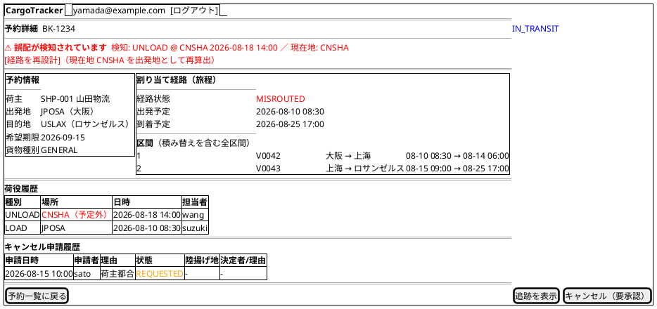

#### 仕様

- **誤配バナー（US28）**: RoutingStatus が `MISROUTED` の場合、検知した荷役イベント（場所・日時）と貨物の現在地を警告バナーで表示する。`[経路を再設計]` は `ROLE_ROUTING` に表示し、**現在地を出発地**・目的地と希望期限は元の予約から引き継いだ経路設計画面へ遷移する
- **キャンセルボタンの出し分け（US30）**: 集約の述語（キャンセル可否）をそのまま使う
  - 輸送開始前（PRELIMINARY〜TRACKING_ISSUED）: `[キャンセル]`（即時確定・理由必須）
  - `IN_TRANSIT`: `[キャンセル（要承認）]`（申請のみ。理由必須）
  - `DELIVERED` 以降: ボタン非表示
- **キャンセル申請履歴**: 申請・承認・却下の履歴（日時・実行者・理由）を表示する
- `[追跡を表示]` は公開追跡画面（認証不要）へ遷移する

#### 割り当て経路（旅程）の表示 ― IT5 で追加

- **区間を 1 本ずつ、運ぶ順に並べる。** 航海番号 1 つだけを出す形では、積み替えのある経路が表せない。荷役の担当者・追跡管理者が見るのは「どの港で積み替えるか」であり、そこが読めないと問い合わせに答えられない
- **港は名前で、日時は業務タイムゾーンで**（表示規約）。UN/LOCODE は併記にとどめる
- **経路が決まっていない予約では、この枠ごと出さない。** 空の表を出すと「区間が 0 件の旅程がある」ように見える
- 経路設計者には、ここから `[経路を見直す]` で経路設計へ戻る導線を置く（[ADR-020](../adr/020-itinerary-assignment-transitions.md) 決定 4 の差し替え）

#### 荷主への通知・確定・発行 ― IT6 で追加

予約詳細に、**いまの状態で誰の手番か**と、その手番の操作だけを出す。すべての操作を常に出して押したときに断ると、利用者は「押せるのにできない」を毎回学び直すことになる。

##### 手番の表示

状態ごとに 1 行で出す（[ADR-021](../adr/021-shipper-notification-and-confirmation-transitions.md) 決定 6）。出さないと、一覧に並んだ予約のどれが自分の仕事か分からず、状態を足した意味が無くなる。

| `BookingStatus` | 表示 | 出す操作 | 出す相手 |
| :--- | :--- | :--- | :--- |
| `PRELIMINARY` | 経路設計を依頼してください | `[経路設計を依頼する]` | 営業 |
| `ROUTE_PROPOSED` | 荷主へ通知してください | `[荷主へ通知する]` | 営業 |
| `ROUTE_NOTIFIED` | 荷主の返事を待っています | `[予約を確定する]` `[経路設計へ戻す]` `[もう一度通知する]` | 営業 |
| `CONFIRMED` | 追跡番号の発行を待っています | `[追跡番号を発行する]` | 経路設計者 |
| `TRACKING_ISSUED` | 貨物の受け取りを待っています | （IT6 では無し） | — |

##### 通知の内容（US12-2）

`[荷主へ通知する]` を押す前に、**何を伝えることになるか**を同じ画面で確認できるようにする。確認せずに送れる形にすると、営業は送ってから旅程を見ることになる。

出す項目は経由港・所要日数・到着予定日・費用の概算である。いずれも**割り当て経路（旅程）の枠から導ける**ので、新しい API は足さない。

> **費用は<strong>概算</strong>である**（[ADR-018](../adr/018-route-search-rules.md)）。請求金額ではないことを画面に明記する。実料金は US21（IT11）で入る。

##### メールを送っていないことの明示（US12-3・US14-4）

**通知の仕組みはまだ無い。** 送ったことにして黙っていると、営業は荷主に届いたと思い込む。

- ボタンの近くに「**この操作ではメールは送られません。荷主へは電話・メールで連絡してください**」と出す
- 通知後は「**いつ・誰が通知したか**」を記録として表示する（US12-4）。これが唯一の証跡である
- 追跡番号も同じ。発行しても荷主には届かない。**営業が予約詳細で番号を確認して伝える**（照会画面は US18・IT8）

##### 経路設計へ戻したことが経路設計者に見える（US13-4）

戻すと `RoutingStatus` が `ROUTING_REQUESTED` に戻り、**経路設計者の「経路設計を待っている予約」に現れる**（[ADR-021](../adr/021-shipper-notification-and-confirmation-transitions.md) 決定 4）。画面の言葉は「**経路設計へ戻す**」で統一する（「経路提案中」＝ `ROUTE_PROPOSED` とは別の言葉である）。

##### 追跡番号の発行待ちに気づく（US13-3）

経路設計者のダッシュボードに「**追跡番号の発行を待っている予約**」の件数を出し、そこから絞り込んだ一覧へ行けるようにする。件数だけ出しても、そこから対象へ行けなければ仕事は進まない（IT5 と同じ形）。

### キャンセル承認 (/booking/cancellations) ― 追加

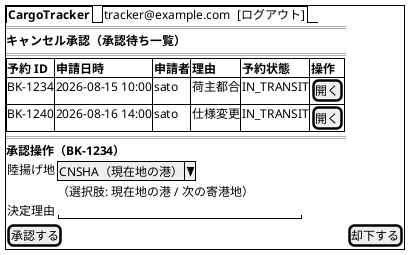

#### 仕様

- `ROLE_TRACKER` のみアクセス可。承認待ち（`status = REQUESTED`）の申請を一覧表示する
- **承認**: 陸揚げ地（現在地の港または次の寄港地）の指定が必須。承認するとキャンセルが確定し、陸揚げ地への荷降しが手配され、荷主に通知される
- **却下**: 決定理由の入力が必須。却下すると予約は輸送中のまま維持され、理由が申請者と荷主に通知される
- ダッシュボードの「承認待ちキャンセル」件数から直接遷移できる

### 貨物追跡照会 (/tracking/:trackingNumber) ― 変更（公開画面）

```plantuml
@startsalt
{+
  {/ <b>CargoTracker</b>  貨物追跡（ログイン不要） | [業務利用はログイン] }
  ==
  追跡番号: | "TRK-20260819-1234          " | [追跡する]
  ==
  現在のステータス: <color:green>IN_TRANSIT</color>　　現在地: 太平洋上
  推定到着日: 2026-09-10 頃
  ==
  <b>輸送ステータスタイムライン</b>
  {
    ● 2026-08-10 18:00 | <b>LOADED</b>       | JPOSA（大阪）
    ● 2026-08-08 10:00 | <b>RECEIVED</b>     | JPOSA（大阪）
  }
  ==
  <color:red>⚠ 例外発生中: 遅延（2026-08-15 台風の影響）新到着予定 2026-09-12</color>
  ==
  <i>30 秒ごとに自動更新中...</i>
}
@endsalt
```

#### 仕様

- **認証不要**。追跡番号のみで照会できる（US18）。担当者名等の内部情報は表示しない
- 未発見時は「追跡番号が見つかりません」と表示する
- 例外発生中は種別と対応状況（新到着予定等）を表示する。通関保留中は「通関手続き中」を表示する
- `refetchInterval: 30000` によるポーリングで自動更新

### 貨物状態管理 (/tracking/manage) ― 追加

```plantuml
@startsalt
{+
  {/ <b>CargoTracker</b>    |    tracker@example.com  [ログアウト] }
  ==
  <b>貨物状態管理</b>
  ==
  {
    追跡番号 | "TRK-20260819-1234  " | [検索]
  }
  {
    新しい状態 | ^IN_TRANSIT^ | 位置 | "太平洋上   " | 日時 | "2026-08-19 12:00" | [状態を更新]
  }
  ==
  <b>未解決の例外一覧</b>
  {#
    **種別** | **追跡番号** | **発生場所/日時** | **状況** | **操作**
    <color:red>誤配</color> | TRK-...1234 | CNSHA 08-18 14:00 | 再設計待ち | [予約を開く]
    <color:red>税関保留</color> | TRK-...1230 | USLAX 08-16 09:00 | 留置 3 日超 | [申告を開く]
    遅延 | TRK-...1228 | - 08-15 | 対応中 | [解決を記録]
  }
  ==
  <b>例外の解決記録</b>
  {
    対応内容 | "代替ルートで再開。新到着予定 9/12  "
  }
  [解決として記録]
}
@endsalt
```

#### 仕様

- 状態手動更新（US17）: 追跡番号を指定して状態・位置・日時を更新する。更新後は追跡イベントが履歴に記録され荷主に通知される
- 例外一覧（US19/20/28）: 未解決の例外を種別バッジ付きで一覧表示。誤配は該当予約詳細へ、税関保留は該当申告詳細へ 1 クリックで遷移する
- 解決記録: 対応内容を入力して解決を記録する。解決後も例外の事実は履歴として残る
- 例外の手動起票（遅延・破損・紛失）もこの画面から行う。紛失は緊急フラグが自動設定される

### 荷役作業記録 (/handling) ― 変更（IT7 で実装）

```plantuml
@startsalt
{+
  {/ <b>CargoTracker</b>    |    鈴木一郎（荷役作業員）  [ログアウト] }
  ==
  <b>荷役作業の記録</b>（モバイル幅で操作できること）
  --
  貨物に貼られた<b>追跡番号</b>から記録します。記録すると貨物の追跡状態が変わります。
  <b>荷主へは自動で通知されません。</b>
  ==
  {
    追跡番号                     | "TRK-20260823-0001 "
    作業の種別                   | ^積込^
    作業場所                     | ^Tokyo（JPTYO）^
    作業日時                     | "2027-09-02 09:00 "
    航海番号（積込・荷降しのみ）  | "V0100             "
    荷受人の確認（引取のみ）      | "                  "
  }
  ==
  [記録する]
  ==
  <b>記録しました。</b>
  <color:#92400e><b>⚠ 予定と違う場所での作業です。</b></color>
  <color:#92400e>記録は残しました。経路の見直しが必要かどうか、担当者に確認してください。</color>
  ==
  <b>この貨物の作業履歴（BKG-2026000004）</b>
  {#
    作業   | 場所            | 日時              | 航海  | 作業者    | 備考
    受領   | Tokyo (JPTYO)   | 2027/09/02 09:00 | —     | handler01 |
    荷降し | Singapore(SGSIN)| 2027/09/08 10:00 | V0100 | handler01 | 予定外
  }
}
@endsalt
```

#### 画面項目

| 項目 | 入力 | 必須 | 説明 |
| :--- | :--- | :--- | :--- |
| 追跡番号 | テキスト | ○ | 貨物に貼られた番号。**予約番号は使わない**（荷役作業員は知らない。US15-1） |
| 作業の種別 | 選択 | ○ | 受領 / 積込 / 荷降し / 引取。**表示名はサーバが返す**（画面に対訳表を置かない） |
| 作業場所 | 選択 | ○ | 地点マスタから選ぶ。**自由入力にしない**（綴りの揺れた港が入ると照合が働かない。US15-3） |
| 作業日時 | 日時 | ○ | 業務タイムゾーンで入力する |
| 航海番号 | テキスト | 種別による | **積込・荷降しのときだけ出す**。どの船に載せたかが分からないと貨物を追えない |
| 荷受人の確認 | テキスト | 種別による | **引取のときだけ出す**。誰から確認を得たか（US16-1） |

> **作業者の入力欄は無い。** ログインした利用者 ID が記録される。本文で受け取ると、
> 他人の名前で記録できてしまう。

> **どの欄が必須かはサーバが答える**（`GET /api/v1/handling/types`）。画面が
> 「積込なら航海番号が要る」と書くと、規則が種別と画面の 2 か所に分かれる。

#### 仕様

- **荷役種別**: `RECEIVE` / `LOAD` / `UNLOAD` / `CLAIM` の 4 種（通関は通関管理画面で扱う）
- **予定ルート外の作業（US15-7・[ADR-023](../adr/023-handling-activity-validation.md) 決定 3）**: **記録を拒まない。記録したうえで警告を出す**。現場ではすでに作業が終わっており、拒むと「実際に何が起きたか」がどこにも残らず、作業員は嘘の場所を入れて通す動機を持つ。履歴には「予定外」と表示する。**`RoutingStatus` を `MISROUTED` へ動かすのは US28（IT10）**であり、IT7 では動かさない
- **CLAIM の通関ガード（US29-3・IT9 で実装）**: 通関状態が `CLEARED` でない貨物の引取は 409 で断り、**現在の通関状態を文言に含める**（「通関が完了していないため引き取りできません（現在: 留置）」）。**通関申告が 1 件も無い貨物も断る**——名簿方式の検査は「載っていないもの」を通すと、載せ忘れたものほど漏れる。**荷受人の確認は残る**（US16 の受入基準そのものであり、ガードの代用ではない。[ADR-025](../adr/025-customs-declaration-and-cancellation-approval.md) 決定 9）。**「通関を仕組みで確かめていない」という但し書きは外した**——ガードが入った以上、その文は誤りである
- **CLAIM の荷受人確認（US16）**: 種別 `CLAIM` 選択時のみ表示し、**空欄では記録できない**
- **記録後もフォームを空にしない**: 追跡番号と作業場所は残す。同じ貨物に続けて記録するのが荷役の実際の使い方であり、全部空にすると追跡番号を毎回打ち直すことになる
- **荷主への通知（US15-5）**: **IT7 では行わない**。通知の仕組みは US17・US19・US20（IT8）で要る。行われないことを画面に書く
- 追跡番号が存在しない場合はエラーを表示する（US15-6）。**「見つかりません」と「確認できませんでした」を分ける**——後者は予約のサービスに繋がらなかったときで、番号を打ち直しても直らない

### 通関管理 (/customs) ― 追加

```plantuml
@startsalt
{+
  {/ <b>CargoTracker</b>    |    tracker@example.com  [ログアウト] }
  ==
  <b>通関申告一覧</b>
  --
  {
    追跡番号 | "          " | 状態 | ^すべて^ | [検索]
  }
  ==
  [+ 新規申告]（荷役作業員）
  {#
    **申告番号** | **貨物 ID** | **追跡番号** | **申告日時** | **状態** | **経過**
    DEC-0012     | BK-1230     | TRK-...1230  | 2026-08-16   | <color:red>HELD</color> | <color:red>⚠ 3 日超</color>
    DEC-0011     | BK-1228     | TRK-...1228  | 2026-08-17   | <color:orange>PENDING</color> | 2 日
    DEC-0010     | BK-1225     | TRK-...1225  | 2026-08-14   | <color:green>CLEARED</color> | -
  }
}
@endsalt
```

### 通関申告詳細 (/customs/:declarationId) ― 追加

```plantuml
@startsalt
{+
  {/ <b>CargoTracker</b>    |    tracker@example.com  [ログアウト] }
  ==
  <b>通関申告詳細</b>  DEC-0012  |  <color:red>HELD（留置）</color>
  ==
  {
    申告番号   | DEC-0012
    貨物 ID    | BK-1230
    追跡番号   | TRK-...1230
    申告日時   | 2026-08-16 09:00
  }
  ==
  <b>状態の更新</b>（追跡管理者）
  {
    新しい状態 | ^CLEARED^ | （CLEARED / HELD / REJECTED）
    理由（必須）| "書類再提出により通関完了              "
  }
  [状態を更新]
  ==
  <b>状態変更履歴</b>
  {#
    **日時** | **変更者** | **変更** | **理由**
    2026-08-16 15:00 | tracker | PENDING → HELD | 書類不備
    2026-08-16 09:00 | handler | （登録） | 申告登録
  }
}
@endsalt
```

#### 仕様（通関管理・詳細共通）

- **申告登録**（`/customs/new`・荷役作業員）: 追跡番号・申告番号・申告日時を入力して登録する。初期状態は `PENDING`
- **状態更新**（追跡管理者）: `CLEARED` / `HELD` / `REJECTED` に更新できる。**理由の入力は必須**で、状態変更履歴（日時・変更者・理由）が申告詳細に表示される
- `HELD` になると税関保留の例外が自動起票される。`HELD` のまま 3 日を超えた申告は一覧で警告表示され、追跡管理者のダッシュボードに件数が現れる
- `CLEARED` になると荷主・荷受人に通関完了が通知され、CLAIM 荷役が可能になる。`REJECTED` は荷主に返送/廃棄の判断を求める通知を送る
- 一覧は貨物 ID・追跡番号・通関状態で検索できる

### 請求書詳細 (/billing/:invoiceId) ― 変更

金額内訳にキャンセル料を追加する。

```plantuml
@startsalt
{+
  {+
    <b>金額内訳</b>
    ----
    基本運賃         | ¥400,000
    法人割引（5%）   | -¥20,000
    キャンセル料（IN_TRANSIT・30%） | ¥120,000
    例外調整（遅延減額）           | -¥10,000
    ----
    消費税（10%）    | ¥49,000
    <b>合計          | ¥539,000</b>
  }
}
@endsalt
```

- キャンセル確定した予約の請求はキャンセル料（キャンセル時の予約状態・料率）を根拠付きで表示する（US30）
- 例外（遅延・破損等）の料金調整は明細行として表示する（US21）

---

## インタラクション設計

### React Query によるデータ取得パターン

take-3 のパターン（ポーリング・URL 同期・Mutation + invalidateQueries）を踏襲する。API パスは `/api/v1/` に統一する。

```tsx
// 公開追跡（認証ヘッダなしで呼べるクライアントを使用）
export function usePublicTracking(trackingNumber: string) {
  return useQuery({
    queryKey: ['tracking', trackingNumber],
    queryFn: () => publicApiClient.get<TrackingInfo>(`/api/v1/public/tracking/${trackingNumber}`),
    refetchInterval: 30000,
    enabled: !!trackingNumber,
  });
}

// 承認待ちキャンセル（ダッシュボード件数と一覧で共有）
export function usePendingCancellations() {
  return useQuery({
    queryKey: ['cancellations', 'pending'],
    queryFn: () => apiClient.get<CancellationRequest[]>('/api/v1/bookings/cancellations?status=REQUESTED'),
  });
}
```

### トースト通知

| 操作 | メッセージ例 | 種別 |
| :--- | :--- | :--- |
| 予約登録成功 | 「貨物予約 BK-1234 を登録しました」 | success |
| キャンセル申請 | 「キャンセルを申請しました（追跡管理者の承認待ち）」 | info |
| キャンセル承認 | 「BK-1234 のキャンセルを承認しました（陸揚げ地: CNSHA）」 | success |
| キャンセル却下 | 「BK-1234 のキャンセル申請を却下しました」 | info |
| 誤配登録 | 「予定外の場所で登録されたため、誤配として起票しました」 | warning |
| 荷主へ通知 | 「荷主へ通知しました（メールは送られていません。電話・メールで連絡してください）」 | info |
| 予約確定 | 「BK-1234 を確定しました。経路設計者が追跡番号を発行します」 | success |
| 経路設計へ戻す | 「経路設計へ戻しました。経路設計者の一覧に表示されます」 | info |
| 追跡番号発行 | 「追跡番号 TRK-20260822-0001 を発行しました（荷主への通知は行いません）」 | success |
| 通関状態更新 | 「DEC-0012 を CLEARED に更新しました」 | success |
| CLAIM 拒否 | 「通関が完了していないため引き取りできません（現在: 留置）」 | error |
| バリデーションエラー | 「入力内容に誤りがあります」 | error |
| 認証エラー | 「セッションが切れました。再ログインしてください」 | error |

### エラーハンドリング

- 401: 認証ストアをクリアしてログイン画面へ（公開追跡画面は対象外）
- 403: 「この操作を行う権限がありません」画面を表示
- 409: 状態競合（例: 既に承認済みのキャンセル申請）はメッセージ表示のうえ最新データを再取得
- 422: フォームフィールドにインラインエラー表示
- ページ単位の Error Boundary で予期しないエラーの復旧 UI を表示

---

## アクセシビリティ

take-3 の方針（キーボードナビゲーション・ARIA・カラーコントラスト WCAG AA）を踏襲する。追加事項：

- 警告ダイアログ（誤配・通関ガード）は `role="alertdialog"` とし、フォーカスをダイアログ内にトラップする
- ステータスバッジ・警告は色のみに依存せずテキストラベルを必ず併記する
- 荷役作業記録はモバイル利用を想定し、タップ領域 44px 以上・数値入力は適切な `inputmode` を指定する

---

## 付録: ステータスバッジ定義

### BookingStatus バッジ定義

| ステータス | 表示ラベル | Tailwind クラス |
| :--- | :--- | :--- |
| `PRELIMINARY` | 仮予約 | `bg-yellow-100 text-yellow-800` |
| `ROUTE_PROPOSED` | 経路提案中 | `bg-blue-100 text-blue-800` |
| `ROUTE_NOTIFIED` | 荷主へ通知済 | `bg-indigo-100 text-indigo-800` |
| `CONFIRMED` | 確定済 | `bg-green-100 text-green-800` |
| `TRACKING_ISSUED` | 追跡番号発行済 | `bg-cyan-100 text-cyan-800` |
| `IN_TRANSIT` | 輸送中 | `bg-blue-100 text-blue-800` |
| `DELIVERED` | 配送完了 | `bg-green-100 text-green-800` |
| `SETTLED` | 精算完了 | `bg-gray-100 text-gray-800` |
| `CANCELLED` | キャンセル | `bg-red-100 text-red-800` |

### TrackingStatus バッジ定義

**表示ラベルは画面が持たない。** サーバが `TrackingStatus#label()` の値を `statusLabel`
として返し、画面はそれを出す（[ADR-023](../adr/023-handling-activity-validation.md) 決定 1 と
同じ形）。画面に対訳表を持たせると、値を足したときに画面が列挙の名前をそのまま出す。
下表はその `label()` を書き写したものであり、**画面の実装ではない**。

| ステータス | 表示ラベル | Tailwind クラス |
| :--- | :--- | :--- |
| `NOT_RECEIVED` | 受領待ち | `bg-gray-100 text-gray-800` |
| `RECEIVED` | 受領済み | `bg-cyan-100 text-cyan-800` |
| `LOADED` | 積込済み | `bg-blue-100 text-blue-800` |
| `ONBOARD_CARRIER` | 輸送中 | `bg-blue-100 text-blue-800` |
| `UNLOADED` | 荷降し済み | `bg-yellow-100 text-yellow-800` |
| `AWAITING_CLAIM` | 引取待ち | `bg-yellow-100 text-yellow-800` |
| `CLAIMED` | 引取済み | `bg-green-100 text-green-800` |
| `EXCEPTION` | 例外発生 | `bg-red-100 text-red-800` |
| `UNKNOWN` | 不明 | `bg-gray-100 text-gray-800` |

> **`TransportStatus` ではない。** IT6 の実装はこの状態を `transport_status` と名付けていたが、
> その名前は設計では **Booking Context の `Delivery` が持つもの**であり、BC をまたいで
> 同じ名前が別物を指していた。IT7 で `TrackingStatus` へ改名している。
> Booking Context 側の `transport_status`（予約一覧に出る輸送状況）は別の列挙であり、
> 値は `NOT_RECEIVED` だけである（US30・IT9 で `IN_TRANSIT` / `DELIVERED` が入る）。
>
> **`MISROUTED` はこの列挙に無い。** 誤配は状態ではなく例外種別（`ExceptionType.MISROUTE`）
> として持つ（[ADR-024](../adr/024-tracking-manual-update-and-exceptions.md)）。状態に持つと、
> 誤配の前にどこまで進んでいたかが失われる。

### CustomsStatus バッジ定義

| ステータス | 表示ラベル | Tailwind クラス |
| :--- | :--- | :--- |
| `PENDING` | 審査中 | `bg-orange-100 text-orange-800` |
| `CLEARED` | 通関済 | `bg-green-100 text-green-800` |
| `HELD` | 留置 | `bg-red-100 text-red-800` |
| `REJECTED` | 不可 | `bg-red-200 text-red-900` |

### CancellationStatus バッジ定義

| ステータス | 表示ラベル | Tailwind クラス |
| :--- | :--- | :--- |
| `REQUESTED` | 承認待ち | `bg-orange-100 text-orange-800` |
| `APPROVED` | 承認済 | `bg-red-100 text-red-800` |
| `REJECTED` | 却下 | `bg-gray-100 text-gray-800` |

### PaymentStatus バッジ定義

| ステータス | 表示ラベル | Tailwind クラス |
| :--- | :--- | :--- |
| `PENDING` | 未払い | `bg-red-100 text-red-800` |
| `CONFIRMED` | 支払済 | `bg-green-100 text-green-800` |
| `OVERDUE` | 期限超過 | `bg-red-200 text-red-900` |
| `REFUNDED` | 返金済 | `bg-gray-100 text-gray-800` |

---

## 参照

- [要件定義書](../requirements/requirements_definition.md)
- [ユーザーストーリー](../requirements/user_story.md)
- [フロントエンドアーキテクチャ設計](architecture_frontend.md)
- [ドメインモデル設計](domain-model.md)
- [UI 設計ガイド](../reference/UI設計ガイド.md)
