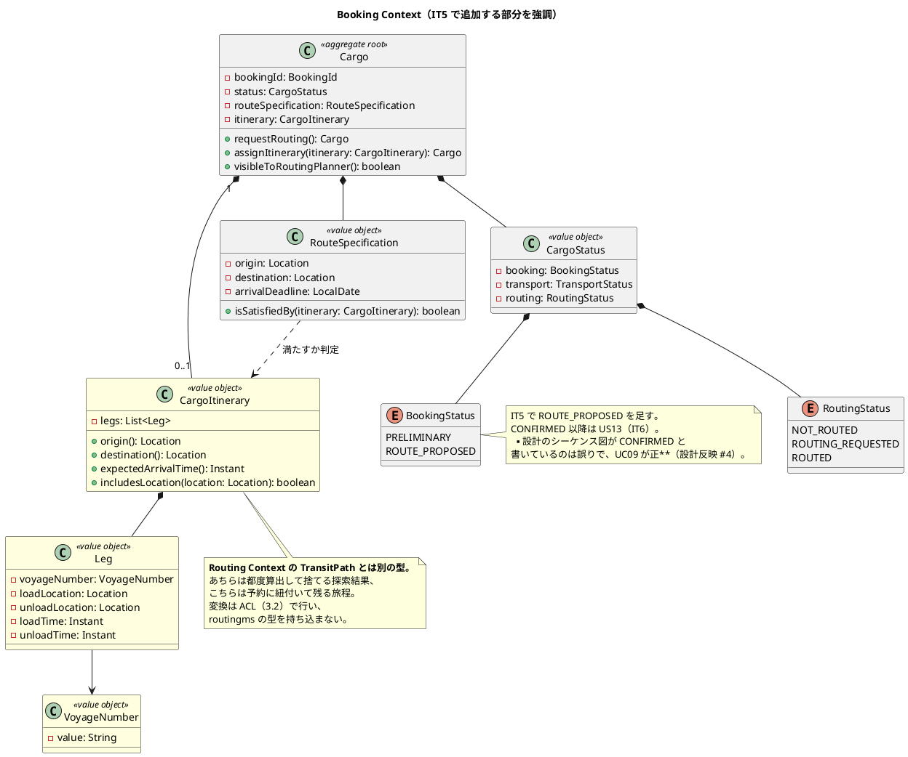
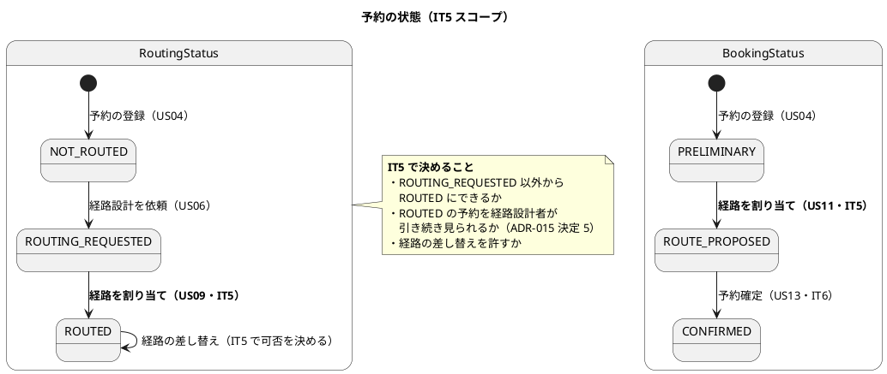
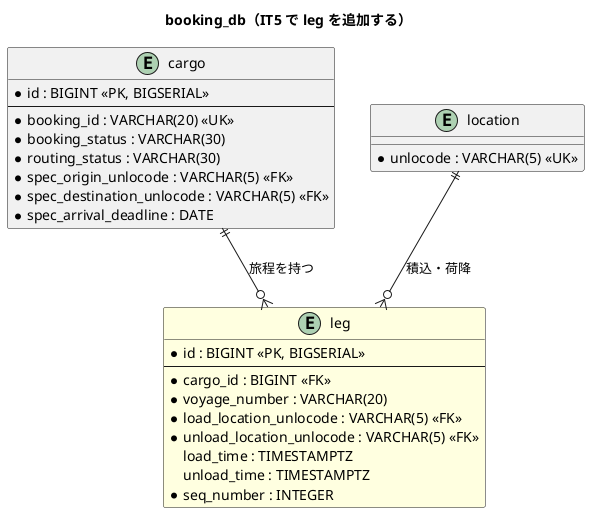
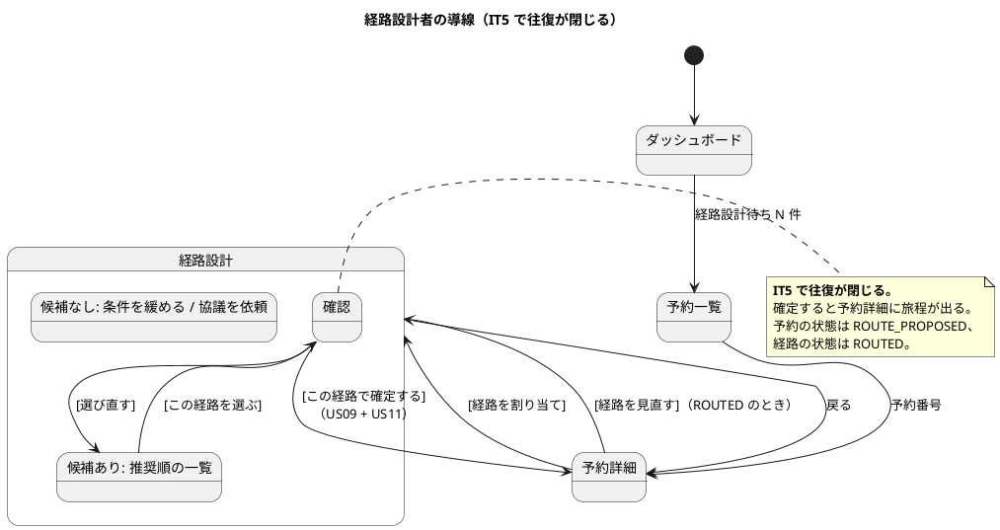

# イテレーション 5 計画

## ゴール

経路設計者が、**算出された候補から 1 件を選び、その経路を予約に紐付けられる**状態にします。
IT4 で開いた片道（予約 → 候補一覧）に対して、**戻り（候補 → 予約）が閉じます**。

条件に合う候補が無ければ、条件を調整して再算出し、それでも見つからなければ営業担当者へ
条件協議を依頼できます。

### 成功基準

| # | 基準 | 測り方 |
| :--- | :--- | :--- |
| 1 | **往復が閉じる** | kind 統合環境で、予約 → 候補 → 選択 → 予約詳細に経路が出るまでを 1 本通す |
| 2 | 紐付いた経路が**予約の正**になる | 予約詳細が旅程（積み替えを含む全区間）を表示し、再読み込みしても消えない |
| 3 | **選んだときに、その経路がまだ成立することを確かめている** | 候補を出したあとに航海を消して選ぶと、確定が断られる（[ADR-017](../adr/017-route-candidates-api.md) が IT5 の宿題としたもの） |
| 4 | 条件を調整した再算出が**残る** | 調整した条件が画面の再読み込みで消えない（IT4 は 1 回かぎりの手動調整だった） |
| 5 | 見つからないときに**営業へ渡せる** | 「条件協議を依頼する」まで到達できる |

### 成功基準の達成状況（クローズ時点）

| # | 状態 | 根拠 |
| :--- | :--- | :--- |
| 1 | 達成（モック E2E）・**kind 統合環境での確認は未実施**（IT6 へ持ち越し） | `e2e/routing.spec.ts` の「候補を選んで確定すると、予約詳細に旅程が出る」で 1 本通した。実バックエンドでは `real-backend.spec.ts` に利用者を切り替えた往復＋確定まで足した。**クローズのレビューで、接続先の既定値が bookingms 自身を指していたことが分かった**（実環境では確定が必ず失敗する状態だった）。直したが、kind 統合環境での実行はできていない |
| 2 | 達成 | `CargoPersistenceIntegrationTest`（実 PostgreSQL）で旅程が読み戻せること・差し替えで行が増えないことを固定。予約詳細に全区間を表示 |
| 3 | 達成 | `AssignRouteUseCase` が確定時に routingms へ問い合わせ、候補に無ければ 409。**再検証を外すと赤になることを確認**。クローズのレビューで「相手が応答しない」を「候補に無い」と誤診していたことが分かり、503 に分けた |
| 4 | 達成（ただし範囲を狭めた） | 条件（期限・積み替え上限・出発希望日）を URL に持たせた。再読み込み・航海詳細からの復帰で消えない。**ただしクローズのレビューで、緩めた期限・出発希望日では確定できない**（サーバは予約の条件で再検証する）ことが分かった。業務上も荷主の合意が要るため、**緩めている間は確定させず理由を示す**形にした |
| 5 | 達成 | 「条件協議を依頼する」で `CONSULTATION_REQUESTED` にし、営業ダッシュボードに件数と入口を出す（ADR-020 決定 7） |

## 局面とアプローチ

**中盤（3 本目）／インサイドアウト**（[開発戦略](development_strategy.md#中盤-インサイドアウトit3it7--release-0210-前半)）。

IT5 は **bookingms に旅程という概念を実装で入れる**イテレーションです。`CargoItinerary`（旅程）と
`Leg`（輸送区間）は**設計には既にあります**が、実装にはありません（`leg` テーブルも同様）。
`Cargo` 集約はいまだ経路を持ちません。画面から書き始めると、
旅程の不変条件（区間の連結・期限内到着）がサービス層に漏れます。**集約と値オブジェクトの
単体テストから始めます。**

> **IT4 との違い**: IT4 は routingms 内で完結しました。IT5 は**サービスをまたぎます**
> （bookingms → routingms の ACL）。開発戦略が「サービス間結合の型は US09 で REST 契約から
> 確立する」と定めている箇所であり、**ここで作る型が IT6 以降のイベント契約の下敷き**になります。

## 対象ユーザーストーリー

| ID | ユーザーストーリー | SP | 優先度 | Issue |
| :--- | :--- | :--- | :--- | :--- |
| US09 | 経路を選択・確定する | 3 | 高 | [#526](https://github.com/k2works/case-study-cargo-tracker/issues/526) |
| US10 | 経路条件を調整して再算出する | 3 | 中 | [#527](https://github.com/k2works/case-study-cargo-tracker/issues/527) |
| US11 | 経路情報を予約に紐付ける | 2 | 中 | [#528](https://github.com/k2works/case-study-cargo-tracker/issues/528) |
| **合計** | | **8** | | |

## 受入条件

`docs/requirements/user_story.md` の該当節を正典とします（書き写さず引用します）。

- [US09 の受け入れ基準](../requirements/user_story.md#us09-経路を選択確定する)
- [US10 の受け入れ基準](../requirements/user_story.md#us10-経路条件を調整して再算出する)
- [US11 の受け入れ基準](../requirements/user_story.md#us11-経路情報を予約に紐付ける)

### 受入基準の割り当て（11 項目）

**1 項目ずつ、スコープ内か外かを決めます。**暗黙に「スコープ内」とすると、満たしていない基準が
クローズまで見つかりません。

| # | 受入基準 | 扱い | 対応 |
| :--- | :--- | :--- | :--- |
| US09-1 | 経路候補一覧（経由港・所要日数・費用・航海番号）を確認できる | **IT4 で達成済み** | 0.3 で船名・運送会社・待ち時間を足す |
| US09-2 | 最適な経路候補を 1 件選択できる | スコープ内 | 4.2 |
| US09-3 | 選択後、経路状態が「確定」になる | スコープ内 | 1.3（`RoutingStatus.ROUTED`） |
| US09-4 | 最適な候補がない場合、経路条件調整（US10）に進める | スコープ内 | 4.3（同じ画面で条件を調整する。IT4 で作った入口を活かす） |
| US10-1 | 現在の制約条件（期限・経由地制限等）を確認できる | スコープ内 | 4.3（`appliedCriteria` を画面に出す。IT4 で API は返している） |
| US10-2a | 条件を調整（**期限延長**）して再算出できる | スコープ内 | 4.3 |
| US10-2b | 条件を調整（**貨物種別変更**）して再算出できる | スコープ内 | 4.3。探索条件は `cargoType` を持つ（[ADR-017](../adr/017-route-candidates-api.md)）。**ただし予約の貨物種別は変えない**。「この種別でも探す」という一時的な条件変更として扱う |
| US10-2c | 条件を調整（**経由地追加**）して再算出できる | **スコープ外**（下表） | — |
| US10-3 | 調整後の条件で新たな経路候補が算出・提示される | スコープ内 | 4.3 |
| US10-4 | 調整後も見つからない場合、営業担当者に条件協議を依頼できる | 部分（下表） | 4.4 |
| US11-1 | 確定経路と予約番号を確認できる | スコープ内 | 4.2・4.5 |
| US11-2 | 経路情報を予約に紐付ける操作を実行できる | スコープ内 | 3.4・4.2 |
| US11-3 | 紐付け後、予約状態が「経路提案中」に更新される | スコープ内 | 1.3（`BookingStatus.ROUTE_PROPOSED`） |

### 受入基準のうち IT5 では満たせないもの

| 受入基準 | 依存先 | 扱い |
| :--- | :--- | :--- |
| US10-2c「**経由地追加**」 | 経路探索の条件（`RouteSearchSpecification`）に経由地のフィールドが無い。**ADR-018 はこれを決めていない**（決定は推奨順・費用・港湾制約・積み替えの上限・積み替えの最低時間の 5 つ） | **積み替えの上限・到着期限・貨物種別の調整で代替する。** 経由地を名指しで足す機能は作らない。**「対応した」と書かない**。**ADR-019 に「経由地の指定は受け取らない」を決定として明記する**（実在しない決定を引用しないため。IT4 Try 4） |
| US10「営業担当者に**条件協議を依頼**できる」 | 通知の仕組みが無い（US06 と同じ） | **画面上の気づく手段で代替する**（US06 で作った形を踏襲）。予約に「条件協議中」を持たせるかは 1.4 で決める |
| US09「経路状態が**確定**になる」の先（予約確定） | US13（IT6） | IT5 は `RoutingStatus.ROUTED` と `BookingStatus.ROUTE_PROPOSED` まで。`CONFIRMED` は IT6 |

## 設計への反映が必要な点（着手前に検出）

US09〜US11 は**上流設計の欠落が 19 件**あります。IT4（16 件）に続いて多く、とくに
`PUT /route` の契約と `RouteCargoCommand` は**名前だけあって中身がありません**。

| # | 内容 | 反映先 | 対応タスク |
| :--- | :--- | :--- | :--- |
| 1 | **`PUT /api/v1/bookings/{bookingId}/route` の契約が 1 行しかない**（リクエスト・レスポンス・エラー・認可ロールのいずれも未定義）。`ui_design.md` の経路 → API 対応表にも載っていない | `architecture_backend.md` の API 一覧、`ui_design.md` の権限マトリクス、ADR-019 | 3.1 |
| 2 | **`RouteCargoCommand` のフィールドが未定義**（コマンド一覧に一行の説明のみ）。`Cargo` 集約に経路を受け取る操作のシグネチャが無い | `domain-model.md` の Cargo クラス図・コマンド一覧 | 1.2 |
| 3 | **`ROUTED` の遷移条件・実行者が未定義**（[ADR-015](../adr/015-routing-requested-state.md) は「US09 で使う」としか書いていない）。**`ROUTED` になった予約を経路設計者が引き続き見られるかも未定義**（決定 5 との関係。割り当てた直後に自分が開けなくなる） | ADR-020 を起こし、**同じ変更で ADR-015 の決定 5 を amend する**（決定 1〜4 は無傷なので supersede しない）。片方だけ書くと ADR-015 の条文が旧のまま残る | 1.3 |
| 4 | **`ROUTE_PROPOSED` への遷移が設計内で矛盾**。`domain-model.md` のシーケンス図は `CONFIRMED` へ遷移すると書いているが、UC09・US11 は「経路提案中」（＝`ROUTE_PROPOSED`） | `domain-model.md` のシーケンス図 | 1.3 |
| 5 | **`leg` テーブルの take-7 版カラム定義と DDL が無い**（「take-3 版を踏襲する」とあるだけ）。`(cargo_id, seq_number)` の一意制約と、**旅程を差し替えるときの削除方針**も未定義 | `data-model.md` のテーブル定義 | 2.1 |
| 6 | `cargo` テーブルに設計上あるカラム（`origin_unlocode` / `current_voyage_number` / `last_known_location_unlocode` / `last_handling_event_*`）が**実装に無い**。IT5 で要るのはどれかを決める | `data-model.md`、マイグレーション | 2.1 |
| 7 | **ACL が完全に未実装**。ポート名も `ExternalRoutingService`（architecture_backend）と `ExternalRoutingServicePort`（domain-model）で**食い違っている** | 両ドキュメントで名前を 1 つに揃える | 3.2 |
| 8 | **ACL の実装例が `maxTransshipments` を渡していない**。US10 で条件を調整するのに、ACL がその条件を運べない | `architecture_backend.md` の ACL 実装例 | 3.2 |
| 9 | **「選んだ経路がまだ成立するか」の確かめ方が未定義**（[ADR-017](../adr/017-route-candidates-api.md) が IT5 の宿題と明記）。再探索するのか、航海と時刻を照合するのか、失敗時に何を返すか | ADR-019 | 3.3 |
| 10 | **予約詳細の「割り当て経路」枠が単一航海前提**で、積み替えのある旅程の表示形が無い。選択・確定の操作の salt 図も無い | `ui_design.md` の画面詳細設計 | 4.1 |
| 11 | 確定時に概算費用を `cargo.booking_amount_*` に書くかが未記述（`data-model.md` は US21 まで NULL 方針） | `data-model.md` の注記 | 1.4 |
| 12 | `CargoRoutedEvent` のペイロードが未定義。**IT5 で発行するかどうかも未決**（イベント基盤は IT6） | ADR-019 に「IT5 では発行しない」と書くか、IT6 へ送る | 3.1 |
| 13 | UC09 の事前条件「貨物予約が**経路設計中**状態にある」が ADR-015 の用語（`RoutingStatus = ROUTING_REQUESTED`）と食い違う | `system_usecase.md` に注記 | 1.3 |
| 14 | ADR-015 のネガティブ影響が「US11（**予約確定**）」と書いているが、US11 は経路の紐付けで、確定は US13 | ADR-015 の該当行 | 1.3 |
| 15 | **図のフィールド名・型が実装と食い違う**。`Cargo` の旅程は `-cargoItinerary`、`Leg` の航海は `-voyage`、`expectedArrivalTime()` の戻りは `Date`（IT4 で問題になった日付・日時の食い違いと同型）。**`Cargo` の状態は設計が `Delivery`、実装は `CargoStatus`** | `domain-model.md` のクラス図 | 1.1・1.3 |
| 16 | **シーケンス図で routingms が `CargoItinerary`（Booking の型）を返している**。ポート表も「最適 `CargoItinerary` を取得」と**単数**で、[ADR-017](../adr/017-route-candidates-api.md)（複数候補・非永続化）と食い違う | `domain-model.md` のシーケンス図・ACL ポート表 | 3.2 |
| 17 | **`ROUTE_PROPOSED` の呼び名が食い違う**。UI 設計のバッジ定義は「経路提案**済**」、UC09・US11 は「経路提案**中**」。**`RoutingStatus` のバッジ定義表そのものが無い**（他の状態にはある） | `ui_design.md` のバッジ定義 | 4.1 |
| 18 | **予約一覧に経路の状態列を足す先が `ui_design.md` に無い**（0.6 の反映先） | `ui_design.md` の画面詳細設計 | 0.6 |
| 19 | `data-model.md` の Flyway 構成が `V1__init_booking.sql # …, leg` と書くが、実体は V1〜V4 で `leg` が無い | `data-model.md` の Flyway 構成 | 2.1 |

## 設計

### ドメインモデル図（IT5 スコープ）

> **`VoyageNumber` は Routing Context にも同名で存在します。** IT4 の `RouteSpecification` と
> 同じ形なので、**着手前に扱いを決めます**（1.2）。共有カーネルへは引き上げません
> （`architecture_backend.md` が「`VoyageNumber` は各コンテキスト固有型として定義し、共有しない」と
> 明記しています）。改名するか、BC 固有型として同名のまま持つかを決め、要素表に対比を書きます。

### 状態遷移図（IT5 スコープ）

### ER 図（IT5 スコープ）

> **旅程の差し替えをどう保存するか**を 2.1 で決めます。IT3 の航海スケジュールでは
> 「区間を消してから入れ直す」形にしました（差分更新は順序の付け替えが要り、途中で失敗すると
> つながっていない航海が残るため）。同じ判断が使えるかを確かめます。
>
> **`(cargo_id, seq_number)` に一意制約を置きます。** 置かないと、消し忘れた行が
> 混ざったときに旅程が二重になり、しかも順序は保たれるため画面上は「区間が増えた」
> ようにしか見えません（IT3 で同型の事故がありました）。

### 画面遷移図（IT5 スコープ）

## タスク

### 0. 返済枠（IT4 からの引き継ぎ・SP 対象外）

[IT4 完了報告書の残作業](iteration_report-4.md#課題と残作業)のうち、**着手条件が IT5 に来ているもの**。
**Day 1-2 に独立して着手**します。

| # | タスク | 見積 | 状態 |
| :--- | :--- | :--- | :--- |
| 0.1 | **荷主の編集**（[#550](https://github.com/k2works/case-study-cargo-tracker/issues/550)）。**`MyBatisShipperRepository.save` が常に INSERT し、しかも荷主コードを再採番する**（残作業 14）。IT3 で `Cargo` を直したのと同じ形。**壊して赤を確認する** | 6h | [x] |
| 0.2 | **`Shipper.email` の値オブジェクト化**（[ADR-012](../adr/012-value-object-granularity.md) が「荷主編集に着手するとき」と決めた）。編集で形式検査が要るようになるため、ここで入れる | 3h | [x] |
| 0.3 | **候補行に船名・運送会社・積み替え港での待ち時間を出す**（残作業 2）。**選ぶための情報**なので、選べるようになる IT5 で足す | 4h | [x] |
| 0.4 | **条件を URL に残す**（残作業 3）。航海詳細から戻ると条件が消え、3 件比べる間に条件を 3 回入れ直すことになる | 3h | [x] |
| 0.5 | **航海詳細から経路設計へ戻れるようにする**（残作業 4）。経路設計から入った人が、どの予約を見ていたか分からない場所に放り出される | 2h | [x] |
| 0.6 | **営業側に「まだ引き渡していない予約」に気づく手段**（[#553](https://github.com/k2works/case-study-cargo-tracker/issues/553)・残作業 15）。US11 で予約の状態が動くため、一覧に経路の状態列を足すのはこの IT が自然 | 4h | [x] |
| 0.7 | **出発希望日を経路探索の条件に入れる**（残作業 5。着手条件「US10 と同時」が成立）。予約は `spec_departure_date` を持つのに探索が使っておらず、**荷主が「9 月 1 日以降でないと倉庫に入らない」と言っているのに 8 月 25 日発の便が候補に出る**。押さえても積むものがない | 4h | [x] |
| 0.8 | **`architecture_backend.md` のパッケージツリーを実体に合わせる**（残作業 10。着手条件「次に同ファイルを触るとき」が成立。3.1・3.2 で同ファイルを書き換える）。とくに出力ポートの置き場所（`application/port`）が図に無い | 2h | [x] |
| 0.9 | **予約詳細の 403 と 404 を揃える**（残作業 11。着手条件「ADR-015 を見直すとき」が成立。1.3 で決定 5 の射程を広げる）。予約番号を順に試すと、内容は隠れても**存在の有無は漏れる** | 2h | [x] |
| **小計** | | **30h** | |

### 1. US09 Phase 1: 旅程のドメイン（3 SP のうち 2 SP）

**画面もサービス層も書きません。**

| # | タスク | 見積 | 状態 |
| :--- | :--- | :--- | :--- |
| 1.1 | `Leg`・`CargoItinerary` を単体テストで構築（設計反映 #2）。**`legs[n].unloadLocation == legs[n+1].loadLocation` の連結制約**、**前の荷降し ≤ 次の積込**、`expectedArrivalTime()`、`includesLocation()`。**IT4 の `TransitPath` と同じ不変条件を、別の型として持つ**（BC 独立性）。`VoyageNumber` の扱い（改名か BC 固有の同名か）と**日本語名**をここで決め、`domain-model.md` の**要素表・`VoyageNumber` のパッケージ図・コンテキスト分離の設計表の 3 点**に Booking 側の行を足す（既存 3 コンテキストは 3 点すべてに載っている） | 8h | [x] |
| 1.2 | `RouteSpecification.isSatisfiedBy(itinerary)` を実装（設計にシグネチャだけある）。**端点の一致と期限内到着**を検査する。**期限は日付なので、到着日時との比較は業務タイムゾーンの当日終わりで行う**（[ADR-017](../adr/017-route-candidates-api.md) 決定 3 と同じ規則。**判定を書き直さない**） | 4h | [x] |
| 1.3 | **`Cargo#assignItinerary` と状態遷移を決めて ADR-020 に落とす**（設計反映 #2・#3・#4・#13・#14）。決定は 4 つ: ①`ROUTING_REQUESTED` からのみ割り当てられる ②割り当てで `RoutingStatus` は `ROUTED`、`BookingStatus` は `ROUTE_PROPOSED` ③**`ROUTED` の予約も経路設計者に開く**（割り当てた直後に自分が開けなくなるのを防ぐ。ADR-015 決定 5 の射程を広げる）④経路の差し替えを許すか ⑤**予約詳細の 403 と 404 を揃える**（[IT4 の残作業 11](iteration_report-4.md#課題と残作業)。番号を順に試すと内容は隠れても存在の有無が漏れる）。**決定の数だけ検査を用意する**。
    **射程を広げると既存の検査が古くなる**ので、`Cargo#visibleToRoutingPlanner` と、それを呼ぶ 2 つの入口（一覧・詳細）、および既存テストを**同じ変更で書き換える**。あわせて設計側の矛盾（シーケンス図の `CONFIRMED`・UC09 の用語・ADR-015 の US11 誤記）を直す | 7h | [x] |
| 1.4 | **旅程が予約の条件を満たさなければ割り当てを断る**ことを、集約の単体テストで固定する。**壊して赤を確認する**。あわせて概算費用を `booking_amount_*` に書かないことを決め、`data-model.md` に注記する（設計反映 #11） | 4h | [x] |
| **小計** | | **23h** | |

### 2. US09 Phase 2: 旅程の永続化（3 SP のうち 1 SP）

| # | タスク | 見積 | 状態 |
| :--- | :--- | :--- | :--- |
| 2.1 | **`leg` テーブルを作る**（設計反映 #5・#6・#19）。**`load_time` / `unload_time` を `TIMESTAMPTZ` にするか**（他テーブルは TIMESTAMPTZ）、**監査カラムを置くか**（全テーブル付与の決定がある）をここで決める。`(cargo_id, seq_number)` の一意制約を置く。**旅程の差し替えは「消してから入れ直す」**（IT3 の航海と同じ判断が使えるかを確かめる）。`data-model.md` にカラム定義表と DDL を書く。`cargo` の未実装カラムのうち IT5 で要るものを決める | 5h | [x] |
| 2.2 | `CargoRepository` の保存・復元を旅程まで拡張し、方言スモークを通す。**`save` が更新で行を増やさないことを確かめる**（IT3 の欠陥と同じ形。**壊して赤を確認する**） | 5h | [x] |
| **小計** | | **10h** | |

### 3. US09/US11 Phase 3-4: ユースケース・接続点（US09 1 SP + US11 2 SP）

> [開発戦略](development_strategy.md)の Phase 3 は「ユースケース（リポジトリはモック）」、Phase 4 は
> 「接続点（REST 契約）」です。本節は 3.4 が Phase 3、3.1〜3.3・3.5・3.6 が Phase 4 にあたります。

| # | タスク | 見積 | 状態 |
| :--- | :--- | :--- | :--- |
| 3.1 | **`PUT /api/v1/bookings/{bookingId}/route` の契約を決めて ADR-019 に落とす**（設計反映 #1・#12）。決定は 3 つ: ①**候補の中身（区間の並び）を丸ごと受け取る**（候補 ID で参照しない。[ADR-017](../adr/017-route-candidates-api.md) が「保存に見合わない」と決めた帰結） ②**確定時に成立を再検証する**（下記 3.3） ③**`CargoRoutedEvent` は IT5 では発行しない**（イベント基盤は IT6。発行しないことを明記する）。`architecture_backend.md` の API 一覧・`ui_design.md` の権限マトリクスに反映する | 5h | [x] |
| 3.2 | **ACL（bookingms → routingms）を作る**（設計反映 #7・#8）。**ポート名を 1 つに揃える**（設計の 2 つの名前のどちらかに決める）。**routingms の型を持ち込まない**（bookingms 側の DTO で受け、`CargoItinerary` へ変換する）。**`maxTransshipments` を渡せるようにする**（US10 が条件を調整するため） | 6h | [x] |
| 3.3 | **選んだ経路がまだ成立することを確かめる**（設計反映 #9・[ADR-017](../adr/017-route-candidates-api.md) が IT5 の宿題としたもの）。**候補を出したあとに航海が更新・削除されていれば、確定を断る**。断り方は 409（入力の誤りではなく、状態がその操作を許さない。ADR-015 の先例に倣う）。**航海を消してから確定を試すテスト**で固定する | 6h | [x] |
| 3.4 | `AssignRouteUseCase` と API を実装。**認可を入力の検査より先に置く**（[ADR-016](../adr/016-authorize-before-validate.md)）。**値の変換もメソッド本体で行う**（IT4 で実バックエンドでのみ再現した欠陥。Try 7）。**ADR-007 の利用者ヘッダを ACL 呼び出しでどう扱うか**（伝播するかしないか）をここで決める。サービス間の呼び出しは IT5 が初めてであり、決めずに書くと「たまたま動く」形が固定される | 6h | [x] |
| 3.5 | **REST 契約テストを導入し、CI に配線する**（[開発戦略の中盤の完了条件](development_strategy.md)が「US09 完了時に REST 契約の型が確立され、**契約テストが CI に配線されている**」と定めている）。bookingms をコンシューマ、routingms をプロバイダとして、`GET /api/v1/routes` の契約を双方で検証する。**接続点は契約テストを先に書く**（コンシューマ駆動）。**ここで作る型が IT6 のイベント契約の下敷きになる** | 8h | [x] |
| 3.6 | **新設するモックを実物と突き合わせる**（IT4 Try 8。DoD に書いただけで工数を取らなかった）。`PUT /route` のモックを足すので、**同じ変更で実バックエンドの検査も足す**。写しを増やすなら、ずれを捕まえる網も増やす | 3h | [x] |
| **小計** | | **33h** | |

### 4. Phase 5: 画面（US10 3 SP を含む）

| # | タスク | 見積 | 状態 |
| :--- | :--- | :--- | :--- |
| 4.1 | **`ui_design.md` に選択・確定の画面詳細設計を書く**（設計反映 #10）。候補を選んだあとの確認、確定後の遷移、**予約詳細の「割り当て経路」枠を複数区間に対応させる**。**書いてから実装する** | 4h | [x] |
| 4.2 | 候補を選んで確定する操作を実装。**押せないボタンを置かない**（IT4 で「次のリリース」と書いた文言を、実際に使えるようになったので消す）。確定後は予約詳細へ戻り、**旅程が出ていることを確かめられる** | 7h | [x] |
| 4.3 | **US10: 調整した条件が残るようにする**（成功基準 4）。IT4 は 1 回かぎりの手動調整だった。**条件を URL に持たせ**（0.4 と同じ変更）、再読み込みしても消えないようにする | 4h | [x] |
| 4.4 | **US10: 見つからないときに営業へ渡せるようにする**（受入基準）。通知が無いので**画面上の気づく手段で代替する**（US06 の形を踏襲）。「条件協議を依頼する」で何が起きるかを 1.4 で決めた形に合わせる | 4h | [x] |
| 4.5 | 予約詳細に旅程（積み替えを含む全区間）を表示する。**日時は業務タイムゾーン、港は名前で**（表示規約） | 4h | [x] |
| 4.6 | E2E：予約 → 候補 → 選択 → 確定 → 予約詳細に旅程が出る、までを 1 本で通す。**利用者を切り替える往復と、実バックエンドでのみ再現する形は実バックエンドの検査へ**（Try 7） | 5h | [x] |
| **小計** | | **28h** | |

### 5. ユーザーマニュアル（SP 対象外）

画面を伴う IT なので、計画段階で枠を取ります。

| # | タスク | 見積 | 状態 |
| :--- | :--- | :--- | :--- |
| 5.1 | `06-経路設計.md` に「経路を選んで確定する」「条件を調整して探し直す」「見つからないときに営業へ相談する」を追加。**IT4 で書いた「次のリリースで使えるようになります」を消す** | 4h | [x] |
| 5.2 | `03-荷主管理.md` に荷主の編集を追加（0.1）。`04-貨物予約.md` に割り当て経路の見かたを追加 | 3h | [x] |
| 5.3 | キャプチャを再生成し `manual:build` で目視。**実装から画面に出るメッセージを機械的に洗い出し、表に無いものを潰す**（IT3 Try 11） | 3h | [x] |
| **小計** | | **10h** | |

### 6. レビュー手直しの枠（SP 対象外・IT4 Try 9）

| # | タスク | 見積 | 状態 |
| :--- | :--- | :--- | :--- |
| 6.1 | **クローズのレビューで出る高優先度の手直し**。IT3 は 11 件、IT4 は 14 件で、いずれも SP 外の工数として毎回発生している。**「出ないかもしれない」ではなく「出る」前提で枠を取る** | 12h | [x] |
| **小計** | | **12h** | |

### 見積もり合計

| 区分 | 見積 |
| :--- | :--- |
| 0. 返済枠 | 30h |
| 1. Phase 1 旅程のドメイン | 23h |
| 2. Phase 2 永続化 | 10h |
| 3. Phase 3-4 ACL・契約テスト・API | 33h |
| 4. Phase 5 画面 | 28h |
| 5. マニュアル | 10h |
| 6. レビュー手直しの枠 | 12h |
| **合計** | **146h** |

> ストーリー分は 8 SP / 94h = **1 SP あたり 11.8h** で、IT4（9.9h）より重く見積もっています。US09 は
> **サービスをまたぐ最初のストーリー**であり、ACL・契約・再検証という新しい型を 3 つ同時に
> 作ります。設計の欠落も 14 件あります。
>
> **レビュー手直しの 12h を初めて明示的に計上しました**（IT4 Try 9）。これまで 2 IT 続けて
> SP 外で発生していた工数です。**この枠を使わずに済んだら、それは実績として記録します。**
>
> 落とし代は 4.4 → 0.6 → 0.3 の順で、**Phase 1 と 3.3（再検証）は削りません**。

## スケジュール

### Week 1（Day 1-5）

| Day | 作業 | 局面 |
| :--- | :--- | :--- |
| Day 1 | **着手前の整合性検証の指摘反映を確認**、0.1 荷主の編集、0.2 `Shipper.email` | 返済枠 |
| Day 2 | 0.3 候補行の判断材料、0.4 条件を URL に、0.5 航海詳細から戻る | 返済枠 |
| Day 3 | 1.1 `Leg` / `CargoItinerary` | Phase 1 |
| Day 4 | 1.2 `isSatisfiedBy`、1.3 ADR-020（状態遷移） | Phase 1 |
| Day 5 | 1.4 割り当ての拒否、2.1 `leg` テーブル | Phase 1-2 |

### Week 2（Day 6-10）

| Day | 作業 | 局面 |
| :--- | :--- | :--- |
| Day 6 | 2.2 永続化と方言スモーク、3.1 ADR-019（API 契約） | Phase 2-3 |
| Day 7 | 3.2 ACL、3.3 成立の再検証 | Phase 3 |
| Day 8 | 3.4 API、4.1 画面詳細設計 | Phase 4-5 |
| Day 9 | 4.2 選択・確定、4.3 条件が残る、4.4 協議の依頼、0.6 営業側の気づき | Phase 5 |
| Day 10 | 4.5 予約詳細の旅程、4.6 E2E、5.1-5.3 マニュアル、クローズ準備 | 仕上げ |

### IT5 で扱わないと決めたこと

| 内容 | 理由 | いつ |
| :--- | :--- | :--- |
| 予約の確定（`CONFIRMED`）・追跡番号の発行 | US13・US14 | IT6 |
| `CargoRoutedEvent` の発行 | イベント基盤の構築は IT6 の独立タスク。**発行しないことを ADR-019 に書く** | IT6 |
| 経由地を名指しで追加する条件調整 | 経路探索が経由地の指定を受け取らない。**積み替えの上限と期限の調整で代替する** | 必要性が出たら ADR |
| 経路探索の 1 + N クエリ | 着手条件は「航海が増えて経路設計だけ遅くなったとき」。閾値を非機能要件に置いてから直す | 条件成立時 |
| `RouteRecommendation` の並び順と料金の分離 | 着手条件は US21（実料金への差し替え） | IT11 |
| `Voyage.connects` / `earliestConnection` の存廃 | [IT4 で決めるべきこととした](retrospective-4.md)。着手条件は US28（誤配の再設計）で使うかどうか | IT10 |
| `transitDays` の丸め | 同上 | IT11 |
| 危険物の積み替え所要時間 | 港ごとの所要時間を持つと決めたとき | 未定 |
| 方言スモークの実体検出化 | IT7（US15 荷役）で確定済み | IT7 |
| `UserFacingMessage` の重複解消 | 3 つ目のサービスが必要になったとき | 条件成立時 |

## リスク

| # | リスク | 影響 | 対策 |
| :--- | :--- | :--- | :--- |
| 1 | **サービスをまたぐ型を 3 つ同時に作る**（ACL・契約・再検証）ため、1 イテレーションに収まらない | 高 | Day 7 終了時に 3.3 が終わっていなければ、**US10 の 4.3・4.4 を落とす**（リリース計画のバッファ戦略どおり）。Phase 1 と 3.3 は削らない |
| 2 | **同名の型（`VoyageNumber`）を BC 間で取り違える** | 高 | 1.1 で扱いを決め、要素表に対比を書く。IT4 の `RouteSpecification` と同じ形。ArchUnit の BC 分離ルールが越境を検出することを確認する |
| 3 | **旅程の差し替えで行が二重になる** | 中 | 2.1 で `(cargo_id, seq_number)` の一意制約を置く。消し忘れは順序が保たれるため画面上「区間が増えた」ようにしか見えない |
| 4 | **再検証が重く、確定に時間がかかる** | 中 | 3.3 で「何を照合すれば足りるか」を決める。全再探索は避ける |
| 5 | 設計の欠落 19 件があり、実装が先行して乖離する | 高 | 各タスクに反映先を紐付けた。**同じ変更で反映する**。DoD で 19 件の消し込みを確認する |
| 6 | **契約テストの導入が初めてで、見積もりを超える** | 中 | 3.5 は `GET /api/v1/routes` の 1 契約に絞る。**イベント契約（IT6）へ広げない**。超過時は US10 の 4.4 を落とす |
| 7 | **`ROUTED` にした直後、経路設計者がその予約を開けなくなる** | 中 | 1.3 の決定 3 で射程を決める。**割り当てた本人が結果を確認できないのは業務として成立しない** |

## Definition of Done

- [ ] US09・US10・US11 の受入基準のうち、**IT5 スコープ内のもの**をすべて満たす（スコープ外は上表のとおり）
- [ ] `./gradlew build` が緑（ユニット・統合・ArchUnit・カバレッジ検証）
- [ ] **ドメイン層カバレッジ 90% 以上**を `jacocoTestCoverageVerification` で機械判定
- [ ] **`./gradlew test`（フル）を実行した**（Port 追加・ADR 起票を伴うため）
- [ ] `TZ=UTC ./gradlew test` が緑
- [ ] フロントエンドの lint・テスト・ビルド・E2E が緑
- [ ] **本番相当ビルドの検査**（`test:e2e:production`）が緑
- [ ] **[開発戦略の中盤の完了条件](development_strategy.md)を満たす** — とくに「US09 完了時に REST 契約の型が確立され、**契約テストが CI に配線されている**」
- [ ] CI が緑（全ジョブ success）
- [ ] SonarQube の新規指摘が 0 件
- [ ] **追加した検査を 1 つずつ壊して赤を確認した**（IT4 Try 2。件数でまとめて確認しない）
- [ ] **同じ規則を守る箇所が 2 つあるときは、片方ずつ壊して確かめた**（IT4 Try 1。二重の守りは互いを隠す）
- [ ] **一覧・候補を出す画面について「終わったものが混ざらないか」を確かめた**（IT4 Try 3。予約一覧の経路状態列・候補一覧）
- [ ] **コードとドキュメントが引用した ADR の決定が実在することを確かめた**（IT4 Try 4）
- [ ] **横断的な規則を ADR にしたら、破られる経路を 2 つ以上挙げてから検査を書いた**（IT4 Try 5）
- [ ] **新しい検査をメタテストの必須一覧に載せた**（IT4 Try 6。載せるまでが「検査を作った」）。**新しい保護エンドポイントが `AuthenticatedUserFilter` の検査対象に入っている**ことも確かめる
- [ ] **実バックエンドでのみ再現する形を着手時にリスト化し、そこに検査を置いた**（IT4 Try 7。型変換・タイムゾーン・DB 方言）
- [ ] **モックがサーバの規則を写した箇所に、実物との突き合わせを同じ変更で用意した**（IT4 Try 8）
- [ ] **判定を本番と検査で共有している**（テスト側に判定を書き直していない）
- [ ] **境界の包含を、境界のデータで検査した**（期限当日の到着・区間の連結）
- [ ] **丸ごと 1 つの表現で比べた**（旅程の比較を区間ごとに積み上げていない）
- [ ] **認可が入力検証より先である**ことを、値の形が壊れている場合も含めて検査した（[ADR-016](../adr/016-authorize-before-validate.md)）
- [ ] **`save` が更新で行を増やさないことを確かめた**（荷主・旅程の両方）
- [ ] **新しい Mapper について方言スモークが通っている**
- [ ] **ADR-019・ADR-020 を起こし、決定の数だけ検査を用意した**。`docs/adr/index.md` にも行を足した
- [ ] **「設計への反映が必要な点」19 件をすべて反映した**（ADR・設計ドキュメント・該当 plan の 3 点）
- [ ] 画面を変えた US について、`ui_design.md` のナビゲーション表・サイドバー実装・ダッシュボード導線・到達性テストの **4 点一致**
- [ ] **状態軸の到達性を確認した**（`ROUTING_REQUESTED` から経路設計へ行ける。`ROUTED` の予約も開ける）
- [ ] **業務フロー章の対応表を更新した**（工程 5 が「使えます」になる）
- [ ] ユーザーマニュアルの該当章を更新し、**キャプチャを再生成し `manual:build` で HTML を作って目視した**
- [ ] **マニュアルの表に無いメッセージを実装から機械的に洗い出して潰した**
- [ ] **IT4 で書いた「次のリリースで使えるようになります」を消した**（使えるようになったため）
- [ ] kind 統合環境で Gateway 経由の動作確認済み（bookingms と routingms を通す）
- [ ] 開発環境（Heroku）へデプロイし、`deploy:dev:health` の全 URL が 200。**加えてその環境で業務を 1 本通した**
- [ ] **レビュー手直しの実績工数を記録した**（枠 12h に対して実際いくらか。IT4 Try 9）
- [ ] ドキュメント更新完了（release_plan の進捗・JIG / jig-erd 再生成）

## デモ項目

[開発戦略](development_strategy.md)の定めにより、デモ項目を E2E の受け入れ基準とします。

1. 経路設計者でログインし、ダッシュボードから経路設計待ちの予約へ行く
2. 予約詳細の [経路を割り当て] で経路設計画面を開く
3. 候補一覧から 1 件を選び、**船名・運送会社・積み替え港での待ち時間**を見て判断する
4. [この経路で確定する] を押す
5. **予約詳細に戻り、旅程（積み替えを含む全区間）が出ている**ことを確認する
6. 予約の状態が「経路提案中」、経路の状態が「経路が決まりました」になっている
7. **条件を調整して再算出し、画面を再読み込みしても条件が残る**ことを確認する
8. 条件を厳しくして候補を 0 件にし、**営業へ条件協議を依頼できる**ことを確認する

## 関連ドキュメント

- [リリース計画](release_plan.md) / [開発戦略](development_strategy.md)
- [IT4 ふりかえり](retrospective-4.md) / [IT4 完了報告書](iteration_report-4.md) / [IT4 レビュー](../review/イテレーション4_review_20260821.md)
- [ユーザーストーリー US09](../requirements/user_story.md#us09-経路を選択確定する) / [US10](../requirements/user_story.md#us10-経路条件を調整して再算出する) / [US11](../requirements/user_story.md#us11-経路情報を予約に紐付ける)
- [ドメインモデル](../design/domain-model.md) / [データモデル](../design/data-model.md) / [UI 設計](../design/ui_design.md) / [バックエンドアーキテクチャ](../design/architecture_backend.md)
- [ADR-015 経路設計依頼の状態](../adr/015-routing-requested-state.md) / [ADR-016 認可を入力検証より先に](../adr/016-authorize-before-validate.md) / [ADR-017 経路候補の API 契約](../adr/017-route-candidates-api.md) / [ADR-018 経路探索の規則](../adr/018-route-search-rules.md)
- IT5 で起こす ADR: **ADR-019（経路割り当ての API 契約と成立の再検証）**・**ADR-020（経路の状態遷移と可視範囲）**

## 更新履歴

| 日付 | 内容 |
| :--- | :--- |
| 2026-08-21 | 初版作成 |
