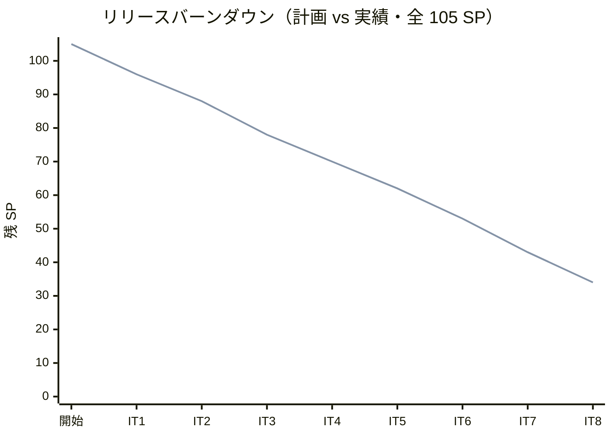
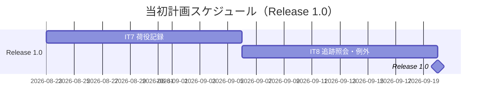
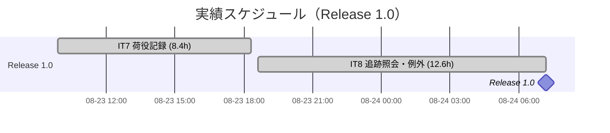
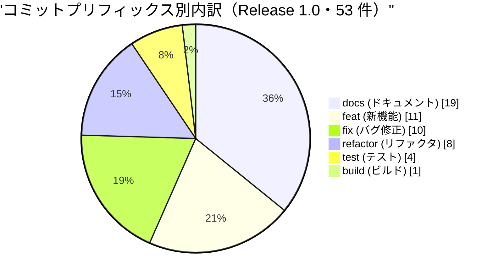
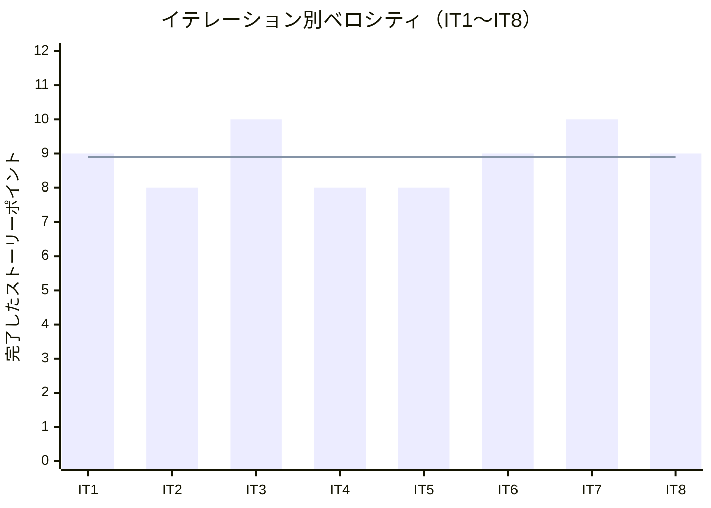

# リリース完了報告書 1.0 - 国際貨物輸送管理システム（java/take-7）

**報告書作成日**: 2026-08-24

## 概要

国際貨物輸送管理システム（Cargo Tracker）Release 1.0 のリリース完了報告書です。IT7・IT8 の 2 イテレーション、19 ストーリーポイントを 100% 達成し、**「予約 → 経路 → 荷役 → 追跡照会」の一気通貫が成立しました**。ウォーキングスケルトンの完成であり、**本プロジェクトで初めて業務投入できるリリース**です。

Release 0.1・0.2 は社内検証用と定めていたため（[リリース計画](release_plan.md)）、**実際の業務でこのシステムを使えるロールが生まれたのはこのリリースが最初**です。

> **前提の欠落を明記します。** 本リリースには **git タグ（`java/take-7/v1.0.0`）と `CHANGELOG.md` がありません**。コミット分析は、IT6 のクローズ commit（`2d73b67b7`）から IT8 のクローズ commit（`679c0cb7d`）までの範囲で代用しています。タグと CHANGELOG の作成は `developing-release` の領域であり、本報告書では行っていません。

---

## プロジェクトサマリー

| 項目 | 値 |
|------|-----|
| **リリース期間** | 2026-08-23 09:53 〜 2026-08-24 07:11（約 21 時間） |
| **含まれるイテレーション** | IT7・IT8（2 イテレーション） |
| **総ストーリーポイント** | 19 SP |
| **総コミット数** | 53（IT7: 31 / IT8: 22） |
| **変更規模** | 290 ファイル・+21,801 / -3,227 行 |
| **総テスト数** | 1,319（バックエンド 926 + フロントエンド 335 + E2E 58） |
| **ユーザーストーリー数** | 6（US15・US16・US17・US18・US19・US20） |
| **サービス数** | 7（gateway / auth / booking / routing / tracking / handling / billing） |

> **バックエンドのテスト数 926 は、IT8 クローズ時（2026-08-23 22:41）のローカル実行結果（`build/test-results`）から集計した実測値です。** [IT8 完了報告書](iteration_report-8.md)は「全 7 サービス緑」とだけ記録しており件数を残していないため、ここで補いました。内訳は bookingms 377・routingms 178・trackingms 131・handlingms 116・authms 58・shared 34・gatewayms 30・billingms 2 です。

---

## 計画と実績の差異分析

### イテレーション別達成状況

| イテレーション | リリース | 計画 SP | 実績 SP | 達成率 | 差異 |
|---------------|---------|---------|---------|--------|------|
| IT7 | Release 1.0 | 10 | 10 | 100% | 0 |
| IT8 | Release 1.0 | 9 | 9 | 100% | 0 |
| **合計** | | **19** | **19** | **100%** | **0** |

### ストーリー別達成状況

| US | 内容 | SP | IT | 状態 |
|----|------|----|----|------|
| US15 | 荷役作業を記録する | 7 | IT7 | 完了 |
| US16 | 引取作業を記録する | 3 | IT7 | 完了（US16-4 は範囲外——`CargoDeliveredEvent` は IT12） |
| US17 | 貨物状態を手動更新する | 2 | IT8 | 完了（US17-4 の通知は**代替**） |
| US18 | 追跡情報を照会する | 3 | IT8 | 完了 |
| US19 | 遅延例外を処理する | 2 | IT8 | 完了（US19-3 の通知は**代替**） |
| US20 | 破損・紛失例外を処理する | 2 | IT8 | 完了（US20-4 の通知は**代替**） |

> **通知は「送信」していません。** メールの実体は入れず、**通知した事実を記録して画面に出す**代替です（[ADR-024](../adr/024-tracking-manual-update-and-exceptions.md) 決定 9）。**受入基準を満たしたと数えていますが、送っていないことをここに書きます**——書かないと、次のリリースで「実装済み」と読まれます。メール送信の実装は Release 1.1 以降です。

### プロジェクト全体に対する位置

| リリース | 内容 | 計画 SP | 実績 SP | 達成率 |
|---------|------|---------|---------|--------|
| Release 0.1 | 予約基盤（IT1-2） | 17 | 17 | 100% |
| Release 0.2 | 経路設計・予約確定（IT3-6） | 35 | 35 | 100% |
| **Release 1.0** | **荷役・追跡・例外（IT7-8）** | **19** | **19** | **100%** |
| Release 1.1 | 誤配・通関・キャンセル承認（IT9-10） | 17 | - | 未着手 |
| Release 2.0 | 精算・見積（IT11-12） | 17 | - | 未着手 |
| **累計（1.0 まで）** | | **71 / 105** | **71** | **67.6%** |

### リリースバーンダウン

**分析結果**: **8 イテレーション連続で計画 SP と実績 SP が一致しています。** 計画線と実績線が重なるのは、ベロシティが安定しているからではなく、**各イテレーションの計画時に落とすものを先に決めているから**です（IT7 以降は「落とす順序」の表を計画に持ち、読みが外れたときにどれを削るかを着手前に決めています）。達成率 100% は「見積もりが正確だった」ではなく「**スコープを守る仕組みが働いた**」と読むべきです。

---

## 計画日程 vs 実績日数の差異分析

### イテレーション別日程比較

| IT | 計画期間 | 計画日数 | 実績期間 | 実績日数 | 短縮日数 | 短縮率 |
|----|---------|---------|----------|---------|---------|--------|
| 7 | 2026-08-23 〜 2026-09-05 | 14 日 | 2026-08-23 09:53 〜 18:18 | **0.35 日** | 13.65 日 | 97.5% |
| 8 | 2026-08-24 〜 2026-09-06 | 14 日 | 2026-08-23 18:38 〜 2026-08-24 07:11 | **0.52 日** | 13.48 日 | 96.3% |
| **合計** | **28 日** | **28 日** | **約 21 時間** | **0.89 日** | **27.11 日** | **96.8%** |

> **この短縮率を「効率」と読まないでください。** 計画の 2 週間は**人間のチームが 1 名で働く前提**で引いた日程であり、実績は AI ペアプログラミングで連続作業した実時間です。**比べているものが違います。** 意味があるのは短縮率そのものではなく、**「2 週間分と見積もった作業量が 1 日で終わる場合、レビューと実環境検証をどこに置くか」**という問いのほうです。実際、本リリースで見つかった最も重い欠陥は、**どちらもテストの外**（実環境と 5 視点レビュー）から出ています。

### 工期の可視化

```mermaid
xychart-beta
    title "計画日数 vs 実績日数"
    x-axis ["IT7", "IT8"]
    y-axis "日数" 0 --> 14
    bar "計画" [14, 14]
    bar "実績" [0.35, 0.52]
```

### 計画 vs 実績ガントチャート

#### 当初計画スケジュール

#### 実績スケジュール

### サマリー

| 指標 | 値 |
|------|-----|
| **計画総日数** | 28 日 |
| **実績総日数** | 0.89 日（約 21 時間） |
| **短縮日数** | 27.11 日 |
| **短縮率** | **96.8%** |
| **効率倍率** | **31.5 倍** |

### 差異分析

1. **見積もりの単位が「理想時間」であり、暦の日数ではない。** IT7 は 147h、IT8 は 144h の見積もりに対して、それぞれ 8.4h・12.6h の実時間で終わっています。**理想時間の見積もりが 10 倍以上外れている**のであって、日程が短縮されたのではありません
2. **短縮のほとんどは「待ち」が無いことによる。** 1 名 + AI の構成では、レビュー待ち・調整待ち・引き継ぎが発生しません。逆に、**待ちが無いぶん「立ち止まって確かめる」工程を意図的に置かないと消える**——本リリースはそれを Phase（実環境で通す枠）とクローズレビューとして計画に置きました
3. **実時間が短いことは、欠陥が少ないことを意味しない。** IT8 はクローズレビューで高優先度 11 件が出ています。うち 2 件は**検査が誤った実装を固定していた**もので、テストを何度回しても出ません

### 工期短縮の要因分析

| 要因 | 説明 |
|------|------|
| 環境が構築済み | Gradle マルチプロジェクト・kind・Heroku・CI・JIG は IT1 以前に整備済み。IT7 で 7 つ目のサービス（handlingms）を作るときも、型をコピーして差分だけ直せた |
| 型が確立している | REST の ACL（[ADR-019](../adr/019-route-assignment-api.md)）とイベント契約（[ADR-022](../adr/022-domain-event-contract.md)）を Release 0.2 で確立済み。IT7 の 2 本目、IT8 の 3 本目は**新しい結合方式を発明せず写した** |
| 落とすものを先に決めている | 計画の時点で「落とす順序」の表を持つ。読みが外れても、その場で悩まずに削れる |
| 返済枠を序盤に固定 | IT7・IT8 とも Day 1-3 に返済枠を置き、**2 IT 連続で全件返済**。負債が次の IT の見積もりを膨らませる形を断った |

---

## コミットログ分析

### コミットプリフィックス別内訳

| プリフィックス | 件数 | 割合 | 説明 |
|---------------|------|------|------|
| docs | 19 | 35.8% | ドキュメント更新（計画・ADR・設計反映・マニュアル） |
| feat | 11 | 20.8% | 新機能追加 |
| fix | 10 | 18.9% | バグ修正（レビュー指摘・実環境の欠陥を含む） |
| refactor | 8 | 15.1% | リファクタリング（返済枠が大半） |
| test | 4 | 7.5% | テスト追加 |
| build | 1 | 1.9% | ビルド設定 |
| **合計** | **53** | **100%** | |

### コミットプリフィックス別パイチャート

### 分析

1. **`docs` が 35.8% と最も多い。** 内訳は計画・ADR・設計への反映・マニュアルです。**設計ドキュメントを実装と同じリリースで直す規律**（実装と設計の同時反映）がコミット数に現れています。ただし [IT8 のふりかえり](retrospective-8.md)が記録したとおり、**IT8 は注 13 件のうち 12 件を反映できませんでした**——コミット数が多いことは、反映が済んだことを意味しません
2. **`fix` が 18.9%（10 件）と多い。** うち大半は**クローズレビューと実環境検証で出た欠陥**です。IT7 が高優先度 11 件、IT8 も高優先度 11 件を、いずれもクローズ前に潰しています。**テストが緑のまま残っていた欠陥がこの数だけあった**ということです
3. **`refactor` の 8 件はほぼ返済枠。** IT7 で 12 件、IT8 で 10 件の負債を返しました。**2 IT 連続の全件返済**であり、Release 1.1（IT9）へ持ち越したのは 14 件です

---

## 品質メトリクス

### テストカバレッジ

| 対象 | 目標 | 実績 | 判定 |
|------|------|------|------|
| バックエンド（新規コード） | 80% | 91.7% | 達成 |
| バックエンド（ドメイン層） | 90% | 全 6 サービス 90% 以上 | 達成 |
| フロントエンド（新規コード） | 80% | 87.2% | 達成 |
| フロントエンド（行） | 80% | 90.9% | 達成 |

**ドメイン層の内訳（IT8 時点）**: trackingms 94.6% / bookingms 97.4% / handlingms 99.0% / routingms 98.7% / authms 90.5% / shared 100.0%

### テスト数の推移

| 時点 | バックエンド | フロントエンド | E2E | 合計 |
|------|------------|--------------|-----|------|
| IT7 完了 | 739 | 306 | モック 8 ファイル・実バックエンド 12 本 | 1,045 + E2E |
| IT8 完了（Release 1.0） | 926 | 335 | 58 件 | **1,319** |

```mermaid
xychart-beta
    title "ユニット・コンポーネントテスト数の推移（Release 1.0）"
    x-axis ["IT7 完了", "IT8 完了"]
    y-axis "テスト数" 0 --> 1000
    bar "バックエンド" [739, 926]
    bar "フロントエンド" [306, 335]
```

> **IT7 の E2E は件数で記録されていません。** [IT7 完了報告書](iteration_report-7.md)は「モック 8 ファイル・実バックエンド 12 本」と書いており、ファイル数と本数が混在しています。**推測で件数に直さず、記録のまま載せます。** IT8 で 58 件に揃ったのは、デモ項目を受け入れテストに翻訳したためです（[開発戦略](development_strategy.md)が終盤に定めた形）。

### 静的解析

| 指標 | 結果 |
|------|------|
| SonarQube Quality Gate | **Backend PASS / Frontend PASS** |
| Bug / Vulnerability | 0 / 0（両プロジェクト） |
| Security Hotspot | 0 |
| Code Smell | Backend 1（authms の `JwtTokenIssuer`・IT8 以前のコード。IT9 の返済枠）/ Frontend 0 |
| 重複率 | Backend 0.1% / Frontend 0.05% |
| Checkstyle / SpotBugs | クリーン（`./gradlew build` 全体で緑） |
| CI（GitHub Actions） | 緑（run 32669396922） |
| `TZ=UTC` での実行 | 緑（`--rerun-tasks` で強制再実行） |

> **IT8 の最初の CI は赤でした。** ローカルで `./gradlew test` しか回しておらず、CI が回す `build` に含まれる SpotBugs を抜かしていたためです。**そのうち 3 件は実際の設計ドリフト**でした——`domain-model.md` は `TrackingExceptionEvent` と定めているのに、実装は Throwable でない型を `TrackingException` と名乗っていました。**静的解析が、正典との乖離を先に見つけていた**ことになります（[IT8 ふりかえり](retrospective-8.md) Problem 7）。

### ベロシティ

| 項目 | 値 |
|------|-----|
| 平均ベロシティ（IT1-8） | 8.9 SP / イテレーション |
| Release 1.0 の平均 | 9.5 SP / イテレーション |
| 最大ベロシティ | 10 SP（IT3・IT7） |
| 最小ベロシティ | 8 SP（IT2・IT4・IT5） |
| 初期見積もり | 10 SP（実効 8 SP） |

**初期ベロシティの推定 10 SP に対し実績平均 8.9 SP** で、9 割の精度でした。コミットメントの上限として置いた実効 8 SP（バッファ 20%）は妥当だったと言えます。

### 変異検査（壊して赤を確認した回数）

| IT | 回数 | 対象 |
|----|------|------|
| IT7 | 約 20 回 | ADR-023 の 6 決定、`alternate-exchange`、冪等、契約の語彙、`offRoute` の伝播、追跡の巻き戻り ほか |
| IT8 | 記録なし | **表を書いたが、3 件が空振りしていた**（下記） |

> **IT8 は「検査を書いた」で止め、壊していませんでした。** その結果、ADR-024 の 11 決定のうち 3 件は表が指す検査がその決定を守っておらず、さらに 2 件は**検査が誤った実装を固定していました**。この学びが IT9 の DoD（決定ごとに壊して赤を確認するまで完了としない）になっています。

---

## リリース条件の達成状況

[リリース計画](release_plan.md)が定めた Release 1.0 の条件は 2 つです。**達成の根拠と、達成と言い切れない部分を分けて書きます。**

| # | 条件 | 状態 | 根拠 |
|---|------|------|------|
| 1 | E2E テストで一気通貫シナリオがパス | **達成（ただし実行環境に差異あり）** | `tracking.spec.ts` のデモ項目 8 件 + 到達性 2 件を含む E2E 58 件が緑。一気通貫（荷役 → 公開追跡）は `real-backend.spec.ts` と kind の手動検証で通した。**リリース条件の文言は「kind + Kustomize 上の Playwright」だが、E2E は開発サーバ + 実バックエンドで実行しており、kind 上では手動確認である** |
| 2 | 公開追跡が認証なしで到達できる E2E がパス | **達成** | `tracking.spec.ts`「荷主は、ポータルとログイン画面の両方から追跡照会へ行ける」「荷役を記録すると、荷主がログインなしで状態・位置・履歴を見られる」。公開経路の過剰許可の検出は、`/api/v1/public/` の接頭辞分離を**両方向で検査**（公開は開き、それ以外は閉じる） |

> **条件 1 の差異を書いておきます。** 「kind + Kustomize 上の Playwright」を文字どおり満たしてはいません。kind では**手動で**「V4 マイグレーション適用・公開照会が認証なしで 200・予約 → 通知 → 確定 → 追跡番号の発行」を確認しています。**自動化された E2E を kind に向ける**のは次のリリースの課題です。

### 運用条件

Release 1.0 は業務投入できるリリースですが、**2 つの運用条件が付きます**。

| 条件 | 内容 | 解消時期 |
|------|------|---------|
| **引取時の通関確認** | 通関ガード（US29）が無いため、**引取作業は通関書類の目視確認を条件とする** | Release 1.1（IT9） |
| **例外の連絡** | 例外の連絡は追跡管理者から営業へ**口頭**で行う。荷主は公開画面で「ご依頼元の営業担当へ」と案内されるが、**営業のダッシュボードには例外に気づく手段が無い** | Release 1.1（IT9 の返済枠 0.9） |

---

## 主要な成果物

### 実装した主要機能

1. **荷役作業の記録**（Release 1.0 / IT7・US15）

     - handlingms（7 つ目のサービス）を新規実装。受領・積込・荷降し・引取の 4 種を記録する
     - **予定外の荷役を拒まず記録に残す**（[ADR-023](../adr/023-handling-activity-validation.md)）。拒めば実際に起きたことが残らず、嘘の場所で通す動機を作る
     - bookingms からの `CargoSnapshot`（ACL）で旅程を照合し、経路外の作業を警告する

2. **引取の記録**（Release 1.0 / IT7・US16）

     - 荷受人の確認（署名または確認コード）を必須とする。**空なら断る**
     - これは通関ガード（US29・IT9）の**代替**である（[ADR-023](../adr/023-handling-activity-validation.md) 決定 4）

3. **貨物状態の手動更新**（Release 1.0 / IT8・US17）

     - 追跡管理者が、荷役では捕捉できない状態変化（出港・入港）を手で反映する
     - **進む向きにしか動かせない**（[ADR-024](../adr/024-tracking-manual-update-and-exceptions.md) 決定 1）。押せるのに断られる操作は画面に出さない

4. **公開追跡照会**（Release 1.0 / IT8・US18）

     - **認証の外にある唯一の業務経路。** `/api/v1/public/` を接頭辞で分離し、[ADR-007](../adr/007-authenticated-user-header-required.md) のフィルタからこの 1 本だけを除外した
     - **返す項目を絞る**（荷主名・金額・予約番号は返さない）。総当たり対策（1 分 30 件）と照会ログを併せて入れた
     - 入口（ポータル・ログイン画面）にも導線を置いた——**ロール別到達性は認証済み利用者にしか働かない**

5. **例外の起票と解決**（Release 1.0 / IT8・US19・US20）

     - 遅延・破損・紛失を起票すると状態が `EXCEPTION` になり、解決すると**例外発生前の状態に戻る**
     - **発生前状態を列に持つ**（[ADR-024](../adr/024-tracking-manual-update-and-exceptions.md) 決定 2）。履歴から再導出すると、ユニット緑のまま誤復帰する
     - 紛失だけが緊急として扱われる

### 技術的成果

| 成果 | 内容 |
|------|------|
| テスト駆動開発 | 1,319 テスト（BE 926 + FE 335 + E2E 58）。ドメイン層カバレッジは全 6 サービスで 90% 以上 |
| マイクロサービス | 7 サービスすべてが業務として稼働。**サービス間の非同期連携 2 本**（booking → tracking、handling → tracking）と **REST の ACL 2 本** |
| 認証の外の業務経路 | 公開照会を接頭辞で分離し、**除外を両方向で検査**（公開は開き、それ以外は閉じる） |
| イベント契約 | [ADR-022](../adr/022-domain-event-contract.md) の型を IT7・IT8 でも写し、**新しい結合方式を発明しなかった**。デッドレター・alternate-exchange・冪等を含む |
| CI/CD | GitHub Actions（run 32669396922 緑）。SonarQube Quality Gate は両プロジェクト PASS |
| ADR | 本リリースで 2 本（[ADR-023](../adr/023-handling-activity-validation.md)・[ADR-024](../adr/024-tracking-manual-update-and-exceptions.md)）。**失敗した設計を経緯ごと残した**（ADR-024 決定 4） |
| ユーザーマニュアル | 09 章「貨物追跡」を新設、08 章「荷役管理」を拡充 |

---

## 総評

Release 1.0 は、全 19 SP を 2 イテレーションで 100% 達成し、**予約から追跡までが一本つながりました**。

**このリリースの本当の成果は、機能の数ではありません。** IT6 までは、貨物がどこにあるかを見られるのは DB とデモだけでした。Release 1.0 で **荷主が自分で貨物を追えるようになり**、荷役作業員と追跡管理者が自分の担当画面を持ちました。**業務がシステムの上で回り始めた**のがこのリリースです。

### ハイライト

- **6 ユーザーストーリー完了**: 荷役の記録から公開追跡・例外処理まで、一気通貫のシナリオが成立
- **1,319 テストによる品質保証**: バックエンド 926 + フロントエンド 335 + E2E 58
- **ドメイン層カバレッジ 90% 以上（全 6 サービス）**: 目標を全サービスで達成
- **返済枠 2 IT 連続で全件返済**: IT7 で 12 件、IT8 で 10 件。負債が次の見積もりを膨らませる形を断った
- **7 サービスすべてが業務として稼働**: マイクロサービス構成の一巡が完了

### このリリースで学んだこと

**最も重い欠陥は、テストの外から出ました。**

1. **実環境（kind）で 1 件。** `CargoRoutedEvent` を独立させた設計は、単体・契約・実 RabbitMQ の往復がすべて緑のまま、推定到着日が届きませんでした。2 つのイベントが別々のキューを通るため順序が保証されず、追跡の作成より先に届いた到着日が捨てられていました
2. **クローズレビュー（5 視点）で高優先度 22 件**（IT7 11 件・IT8 11 件）。**複数視点が独立に指摘したものが最も重い**という形が、2 イテレーション連続で再現しました
3. **検査が誤った実装を固定していた 2 件。** `X-Forwarded-For` の先頭を採る実装を、`takesOnlyTheFirstForwardedAddress` という検査が期待値として固定しており、**直そうとした人が赤を見る**状態でした

**「テストが緑である」ことと「正しく動く」ことは別である**——このリリースはそれを 3 つの形で示しました。IT9 の DoD に「決定ごとに壊して赤を確認するまで完了としない」を入れたのは、この学びからです。

### プロジェクト完了メトリクス（Release 1.0 時点）

| 指標 | 値 |
|------|-----|
| **リリース SP** | 19 SP（累計 71 / 105 SP・67.6%） |
| **リリース コミット数** | 53 |
| **総テスト数** | 1,319 |
| **ドメイン層カバレッジ** | 全 6 サービス 90% 以上 |
| **イテレーション回数** | 2（累計 8） |
| **ユーザーストーリー数** | 6（累計 25 / 32） |
| **ADR** | 2 本（累計 24 本。ADR-025 は IT9 の着手前に起票） |

---

## 次のリリースへ

Release 1.1（IT9〜IT10・17 SP）で、通関申告（US29）・キャンセル承認（US30）・誤配検知（US28）を実装します。**Release 1.0 に付いた 2 つの運用条件は、どちらも IT9 で解消します。**

- 引取時の通関書類の目視確認 → 通関ガード（US29-3）
- 例外の口頭連絡 → 営業のダッシュボードに件数と導線（IT9 返済枠 0.9）

着手前の決定は [ADR-025](../adr/025-customs-declaration-and-cancellation-approval.md) に 9 件すべて記録済みです。

**持ち越した課題**:

- **正典ドリフト 11 件**（IT8 の注 13 件のうち 12 件が未反映。1 件は 2 IT 連続の持ち越し）。IT9 の返済枠 0.1 で**突き合わせの検査**を置いて解消する
- **利用者と荷主を紐付けるストーリーが計画に無い**（[ADR-024](../adr/024-tracking-manual-update-and-exceptions.md) 決定 10）。荷主が自分の貨物を一覧で見たいという要望は必ず出る。IT9 のタスク 8.1 で起票する
- **git タグと CHANGELOG.md が無い**。本報告書の前提が欠けたままである

---

## 関連ドキュメント

- [リリース計画](release_plan.md)
- [IT7 完了報告書](iteration_report-7.md) / [IT7 ふりかえり](retrospective-7.md) / [IT7 レビュー](../review/イテレーション7_review_20260823.md)
- [IT8 完了報告書](iteration_report-8.md) / [IT8 ふりかえり](retrospective-8.md) / [IT8 レビュー](../review/イテレーション8_review_20260823.md)
- [ADR-023 荷役作業の検証](../adr/023-handling-activity-validation.md) / [ADR-024 貨物状態の手動更新・例外・公開追跡照会](../adr/024-tracking-manual-update-and-exceptions.md)
- [IT9 計画](iteration_plan-9.md)（次リリースの 1 本目）

---

**Release 1.0 完了** — 予約から追跡まで、一本つながった。
