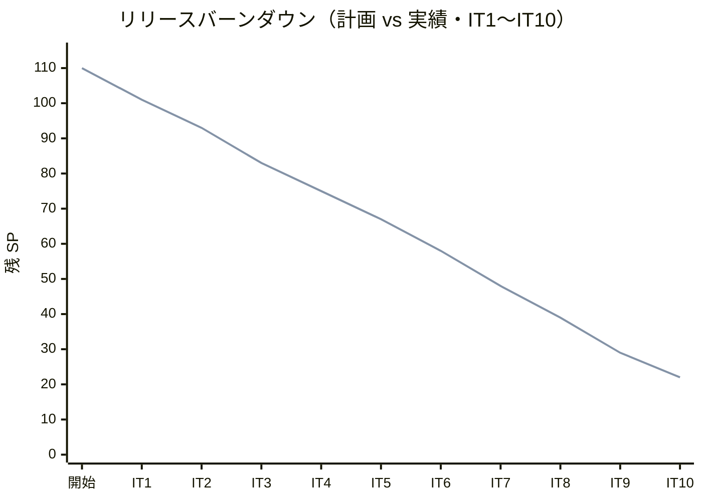
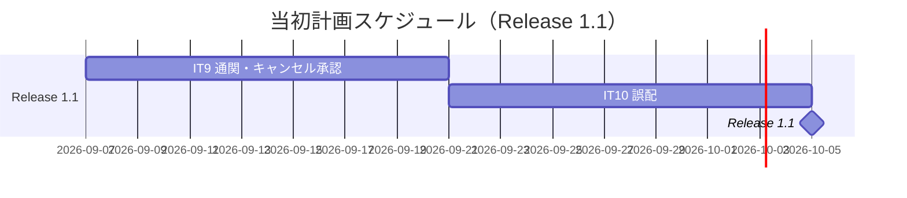
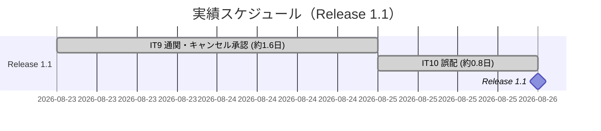
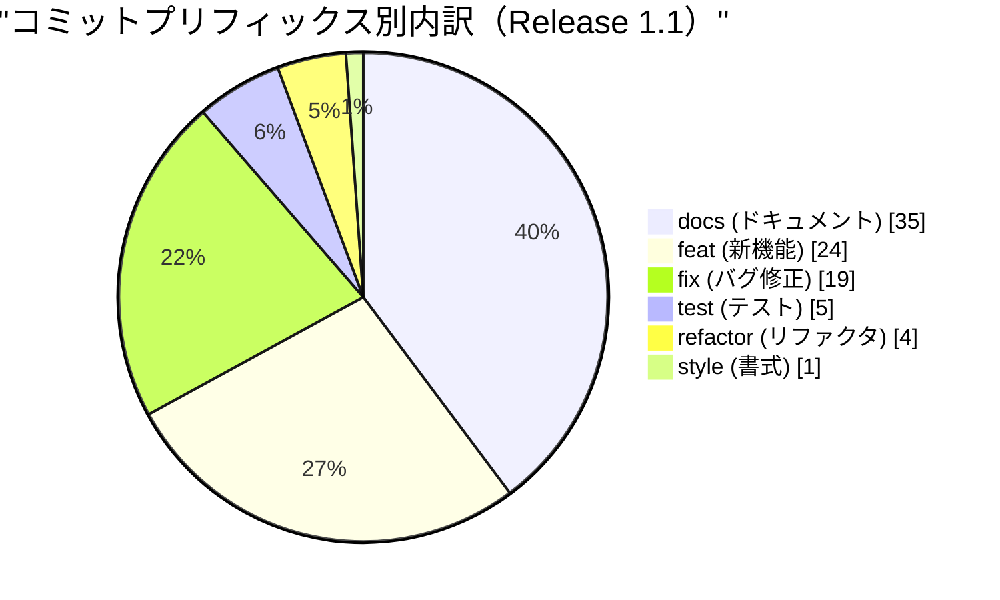
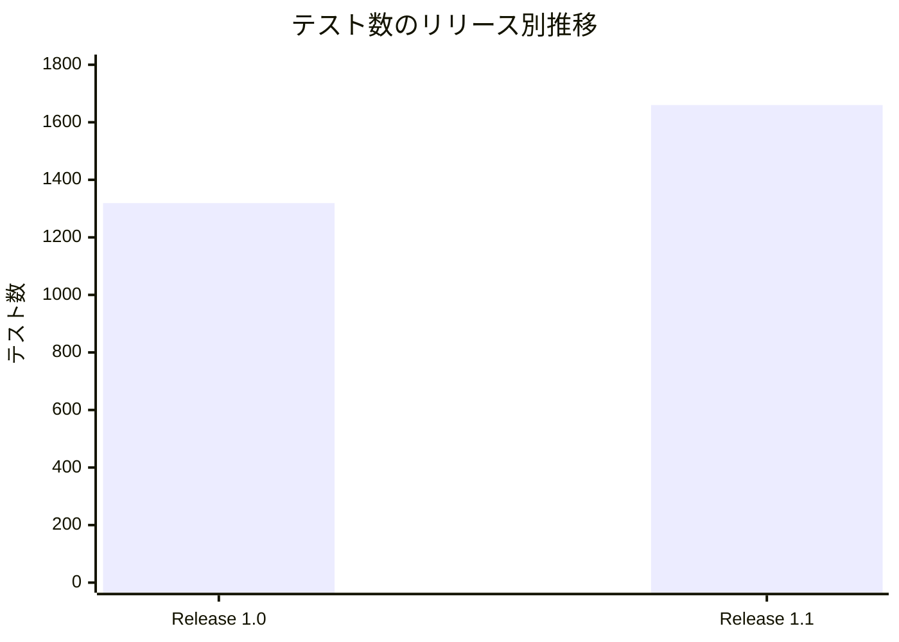
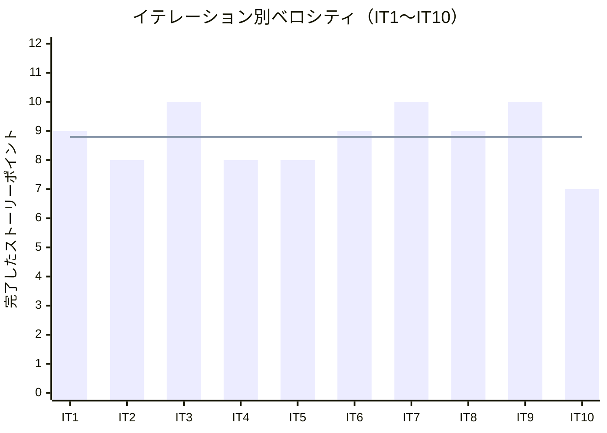

# リリース完了報告書 1.1 - 国際貨物輸送管理システム（java/take-7）

**報告書作成日**: 2026-08-26

## 概要

国際貨物輸送管理システム（Cargo Tracker）Release 1.1 のリリース完了報告書です。IT9・IT10 の
2 イテレーション、17 ストーリーポイントを 100% 達成し、**take-7 の要件差分（通関・キャンセル
承認・誤配）が実装されました**。

Release 1.0 が「予約 → 経路 → 荷役 → 追跡照会」の**正常系の一気通貫**を成立させたのに対し、
Release 1.1 が扱ったのは**そこから外れたときに何が起きるか**です。通関で止まる貨物、輸送を
始めてからのキャンセル、予定と違う港で降ろされた貨物——いずれも「業務が止まる」場面であり、
**止まったことに誰かが気づいて次へ進める**ことが本リリースの主題でした。

> **前提の欠落を明記します。** 本リリースにも **git タグ（`java/take-7/v1.1.0`）と
> `CHANGELOG.md` がありません**（Release 1.0 と同じ状態）。コミット分析は、IT8 のクローズ
> commit（`81f147428`）から IT10 のクローズ commit（`1c340b0c6`）までの範囲で代用しています。
> タグと CHANGELOG の作成は `developing-release` の領域であり、本報告書では行っていません。

---

## プロジェクトサマリー

| 項目 | 値 |
|------|-----|
| **リリース期間** | 2026-08-23 22:34 〜 2026-08-26 07:22（約 57 時間） |
| **含まれるイテレーション** | IT9・IT10（2 イテレーション） |
| **総ストーリーポイント** | 17 SP |
| **総コミット数** | 88（IT9: 51 / IT10: 37） |
| **変更規模** | 291 ファイル・+22,563 / -610 行 |
| **総テスト数** | 1,660（バックエンド 1,142 + フロントエンド 439 + E2E 60 + 実環境 E2E 19） |
| **ユーザーストーリー数** | 3（US28・US29・US30） |
| **返済枠** | 25 件（IT9: 14 / IT10: 11）——**全返済** |

---

## 計画と実績の差異分析

### イテレーション別達成状況

| イテレーション | リリース | 計画 SP | 実績 SP | 達成率 | 差異 |
|---------------|---------|---------|---------|--------|------|
| IT9 | Release 1.1 | 10 | 10 | 100% | 0 |
| IT10 | Release 1.1 | 7 | 7 | 100% | 0 |
| **合計** | | **17** | **17** | **100%** | **0** |

### リリース別達成状況

| リリース | 内容 | 計画 SP | 実績 SP | 達成率 |
|---------|------|---------|---------|--------|
| Release 0.1 予約・荷主 | IT1〜IT2 | 17 | 17 | 100% |
| Release 0.2 経路・航海 | IT3〜IT6 | 35 | 35 | 100% |
| Release 1.0 一気通貫 | IT7〜IT8 | 19 | 19 | 100% |
| **Release 1.1 例外系** | **IT9〜IT10** | **17** | **17** | **100%** |
| **累計** | **IT1〜IT10** | **88** | **88** | **100%** |

### リリースバーンダウン

**分析結果**: 10 イテレーション連続で計画と実績が一致しています。ただし**これは「見積もりが
当たった」ことのみを意味し、余力の有無は示しません**。Release 1.1 の 2 イテレーションでは、
クローズレビューの手直しが IT9 で 13 件（高 5・中 5・低 3）、IT10 で 18 件（高 8・中 6・低 4）
発生しており、**SP の中には現れない作業が積まれています**。

---

## 計画日程 vs 実績日数の差異分析

### イテレーション別日程比較

| IT | 計画期間 | 計画日数 | 実績期間 | 実績日数 | 短縮日数 | 短縮率 |
|----|---------|---------|----------|---------|---------|--------|
| 9 | 2026-09-07 〜 09-20 | 14 日 | 2026-08-23 22:34 〜 08-25 12:09 | **約 1.6 日** | 12.4 日 | 88.6% |
| 10 | 2026-09-21 〜 10-04 | 14 日 | 2026-08-25 12:09 〜 08-26 07:22 | **約 0.8 日** | 13.2 日 | 94.3% |
| **合計** | **28 日** | **28 日** | **約 2.4 日** | **25.6 日** | **91.4%** |

> **短縮率は AI 駆動開発の効果であり、人間のチームの見積もりが誤っていたことを示すもの
> ではありません。** 計画の 14 日はドキュメント上の枠であり、実作業はセッション単位で
> 連続しています。

### 工期短縮の可視化

```mermaid
xychart-beta
    title "計画日数 vs 実績日数（Release 1.1）"
    x-axis ["IT9", "IT10"]
    y-axis "日数" 0 --> 15
    bar "計画" [14, 14]
    bar "実績" [2, 1]
```

### 計画 vs 実績ガントチャート

#### 当初計画スケジュール

#### 実績スケジュール

### サマリー

| 指標 | 値 |
|------|-----|
| **計画総日数** | 28 日 |
| **実績総日数** | 約 2.4 日 |
| **短縮日数** | 25.6 日 |
| **短縮率** | **91.4%** |
| **効率倍率** | **約 11.7 倍** |

### 差異分析

1. **IT10 が IT9 の半分の時間で終わった**のは、SP が小さい（7 vs 10）ことに加え、IT9 で
   確立した形（実環境で通す Phase 6・返済枠の先行消化）をそのまま適用できたためです
2. **クローズ作業が実装より長くなる場面がありました**。IT10 はレビューの高 8 件がすべて
   実欠陥で、その修正に実装本体と同程度の時間を要しています
3. **短縮率が Release 1.0（実測なし）より高く見えるのは、計画の枠が実作業と切り離されて
   いるため**です。この数値からベロシティを外挿することはできません

### 工期短縮の要因分析

| 要因 | 説明 |
|------|------|
| 返済枠の先行消化 | IT 序盤に独立したコミットで済ませる形が定着し、5 IT 連続で全返済。**末尾に積み残しが無い**ため、クローズが実装の完了とほぼ同時に始められる |
| 実環境で通す枠（Phase 6） | IT9 で導入。**サービス単体が全部緑でも実環境でだけ落ちる**欠陥を、クローズ後ではなく IT 内で捕まえられる |
| ADR による決定の先出し | 実装前に決めることを ADR にまとめる形が定着（ADR-025・ADR-026）。実装中の手戻りが減る |
| 過去 take の教訓の再利用 | 同じ形の欠陥（値が全層を生き延びない・名簿の不一致・ロール別到達性）を検査で先回りできる |

---

## コミットログ分析

### コミットプリフィックス別内訳

| プリフィックス | 件数 | 割合 | 説明 |
|---------------|------|------|------|
| docs | 35 | 39.8% | ドキュメント更新（ADR・計画・レビュー・マニュアル） |
| feat | 24 | 27.3% | 新機能追加 |
| fix | 19 | 21.6% | バグ修正（**大半がレビュー指摘への対応**） |
| test | 5 | 5.7% | テスト追加 |
| refactor | 4 | 4.5% | リファクタリング |
| style | 1 | 1.1% | 書式 |
| **合計** | **88** | **100%** | |

### コミットプリフィックス別パイチャート

### イテレーション別の内訳

| IT | docs | feat | fix | test | refactor | style | 合計 |
|----|------|------|-----|------|----------|-------|------|
| IT9 | 21 | 14 | 11 | 3 | 2 | 0 | 51 |
| IT10 | 14 | 10 | 8 | 2 | 2 | 1 | 37 |

### 分析

1. **`docs` が 4 割を占めます。** ADR 2 本（025・026）、イテレーション計画・ふりかえり・
   完了報告書が各 2 本、レビュー 2 本、マニュアル 3 章分が含まれます。**設計文書を実装と
   同じコミットで更新する**規律の結果であり、実装だけを数えると作業量を見誤ります
2. **`fix` の大半がレビュー指摘への対応です。** IT9 で 5 件、IT10 で 8 件の高指摘が
   すべて実欠陥でした。**実装フェーズで緑だったものが、レビューで初めて赤になる**構図が
   2 イテレーション続いています
3. **`test` が 5 件と少ないのは、テストを別コミットにしていないため**です。TDD で書いた
   検査は `feat` / `fix` に含まれます。`test` 単独のコミットは「既存の実装に検査を後から
   足した」場合だけで、それ自体が**検査の空白を見つけた記録**になっています

---

## 品質メトリクス

### テストカバレッジ

| 対象 | 目標 | 実績 | 判定 |
|------|------|------|------|
| バックエンド（新規コード） | 80% | **90.6%** | 達成 |
| フロントエンド（新規コード） | 80% | **89.4%** | 達成 |
| ドメイン層 | 90% | 90% 以上（7 サービス + shared） | 達成 |

### テスト数のリリース別推移

| リリース | バックエンド | フロントエンド | E2E | 実環境 E2E | 合計 |
|---------|------------|--------------|-----|-----------|------|
| Release 1.0 | 926 | 335 | 58 | — | 1,319 |
| **Release 1.1** | **1,142** | **439** | **60** | **19** | **1,660** |

> **実環境 E2E は Release 1.1 で生まれた区分です。** kind の統合環境に対して実際に
> HTTP を投げる検査で、**モックでは確かめようがないこと**（サービス間の 1 往復・
> Gateway の経路・マイグレーションの適用）を見ます。IT9 で 16 本、IT10 で 19 本。

### 静的解析

| 指標 | 結果 |
|------|------|
| SonarQube Quality Gate | **PASS**（バックエンド・フロントエンドとも） |
| Bug | 0 |
| Vulnerability | 0 |
| 重複率 | 0.07%（バックエンド） / 0.40%（フロントエンド）——閾値 3% |
| CI | 緑（最終 run 32905800130） |
| Flaky テスト | 1 件を検知・修正（CI でのみ落ちる E2E。IT10） |

### ベロシティ

| 項目 | 値 |
|------|-----|
| 平均ベロシティ | 8.8 SP/イテレーション |
| 最大ベロシティ | 10 SP（IT3・IT7・IT9） |
| 最小ベロシティ | 7 SP（IT10） |
| Release 1.1 の平均 | 8.5 SP |

---

## リリース履歴

| リリース | 含まれる IT | リリース日 | SP | 状態 |
|---------|-----------|-----------|-----|------|
| Release 0.1 予約・荷主 | IT1〜IT2 | 2026-08-20 | 17 | 完了（社内検証） |
| Release 0.2 経路・航海 | IT3〜IT6 | 2026-08-23 | 35 | 完了（社内検証） |
| Release 1.0 一気通貫 | IT7〜IT8 | 2026-08-24 | 19 | 完了（[報告書](release_report-1_0_0.md)） |
| **Release 1.1 例外系** | **IT9〜IT10** | **2026-08-26** | **17** | **完了（本報告書）** |
| Release 2.0 精算・見積 | IT11〜IT12 | — | 15 | 未着手 |
| Release 2.1 荷主追跡 | IT13 | — | 5 | 未着手 |

---

## 主要な成果物

### 実装した主要機能

1. **通関申告の登録・管理**（Release 1.1 / IT9・US29）

     - 申告の登録・状態の更新（審査中 → 通関済 / 留置）・監査履歴
     - **通関済でなければ引取を断るガード**。申告が 1 件も無い貨物も断る——申告が無いのは
       「確かめなくてよい」ではなく「通関済ではない」から
     - 留置 3 日超の督促（件数から対象一覧へ辿れる）
     - 留置になると追跡の例外「税関保留」が自動起票される（IT10 で誤配も同じ形になる）

2. **輸送中の予約キャンセル承認**（Release 1.1 / IT9・US30）

     - 輸送開始前は即時確定、輸送中は**追跡管理者の承認**を要する
     - **陸揚げ地を指定して承認する**——決めずに確定させると、貨物は行き先を失ったまま
       船に乗り続ける。候補は現在地の港と次の寄港地に限る
     - 承認を迂回して取消へ落ちる辺が無いことを検査で固定
     - 申請・承認・却下の履歴（IT10 で全件表示に修正）

3. **誤配の検知と経路の再設計**（Release 1.1 / IT10・US28）

     - 荷役の記録そのものから誤配を検知——**判定は 1 か所（handlingms）**にあり、
       新しいイベントは増やしていない
     - `Misroute`（誤配の事実）を経路の状況とは**別の軸**に持つ。組み直せば状態は戻るが、
       記録は戻らない（料金調整の根拠）
     - 現在地を出発地とした再設計。**期限では弾かない**——弾くと組み直す手段そのものが
       無くなる
     - 期限を超える場合、**何日超えるか**を営業が読める場所に残す

4. **業務担当者の「気づく手段」の整備**（Release 1.1 / IT9・IT10）

     - 通知の仕組みが無いため、**件数 → 対象一覧**の導線を横断規約として全ロールに適用
     - 通関の待ち行列（未決着だけを既定に）・陸揚げ待ち・誤配の件数

### 技術的成果

| 成果 | 内容 |
|------|------|
| テスト駆動開発 | 1,660 テスト、新規コードのカバレッジ 90.6% / 89.4% |
| ADR による決定の先出し | ADR-025（通関・キャンセル承認）・ADR-026（誤配）。**決定ごとに検査を用意し、1 件ずつ壊して赤を確認する**形が定着 |
| 実環境で通す枠 | kind の統合環境に対する E2E を IT 内のフェーズとして計画に組み込み。**サービス単体が全部緑でも実環境でだけ落ちる**欠陥を 2 IT で 5 件捕まえた |
| BC 独立性 | trackingms は bookingms・handlingms の型に一切依存せず（ArchUnit と文字列検査で担保）。ACL（`CargoSnapshot`）とイベントの使い分けを維持 |
| マルチパースペクティブレビュー | 5 視点並列。**IT10 の高 8 件はすべて実欠陥**で、うち 6 件は自己レビューでは見つけていない |

---

## 総評

Release 1.1 は、全 17 SP を 2 イテレーションで 100% 達成し、**take-7 の要件差分がすべて
実装されました**。

Release 1.0 が「動く道」を作ったのに対し、Release 1.1 が作ったのは**その道から外れたときの
戻り方**です。通関で止まる、キャンセルされる、予定と違う港で降ろされる——どれも起きて
ほしくないが起きることであり、**起きたときに誰が何をすればよいかが画面に出る**ところまでを
実装しました。

### ハイライト

- **全 3 ユーザーストーリー完了**: US28（誤配）・US29（通関）・US30（キャンセル承認）
- **1,660 テストによる品質保証**: バックエンド 1,142 + フロントエンド 439 + E2E 60 + 実環境 19
- **90.6% / 89.4% の新規コードカバレッジ**: 目標 80% を上回る
- **返済枠 25 件を全返済**: 5 IT 連続。**技術的負債を次のイテレーションへ送らない**形が定着
- **レビューが 13 件の実欠陥を捕まえた**: IT9 で 5 件、IT10 で 8 件。すべてクローズ前に対応

### このリリースが示したこと

**「サービス単体のテストが全部緑でも、画面から踏むと成立しない」形が、2 イテレーション
連続で出ました。**

- IT9: 応答の操作一覧に載せ忘れ、営業がキャンセルを申請できなかった（モックだけが返して
  いたため、モックのテストは全部緑）
- IT10: 再設計の画面が元の出発地で候補を探しており、選べた候補が必ず断られた。さらに
  **期限に間に合う便が無い誤配貨物は組み直せなかった**——ADR に「期限で弾くと組み直す
  手段そのものが無くなる」と書き、集約から検査を外し、単体の検査も置いたにもかかわらず、
  **絞りが 3 か所に分かれていて一度も通っていない経路だった**

この 2 つから引き出した規律が、IT11 以降に持ち越されています。

1. **応答の一覧に依存する画面は、画面から踏む検査を持つ**（IT9 → IT10 で適用）
2. **ADR の決定は、決まった経路を端から端まで 1 度通す**（IT10 → IT11 へ）
3. **列挙に値を足したら、その値を使う場所すべてを回る**（IT10 で 3 回踏んだ → IT11 へ）

### 仕組みで埋めていない部分

**通知は依然として代替です。** 通関完了・キャンセルの承認/却下・誤配の期限超過——いずれも
メールは送らず、**画面が「送られていない」と言い、担当者が伝える**形にしています。
運用で回す約束が Release 1.1 で 4 つに増えました。通知の仕組み（Release 2.0 以降）の
優先度を上げる必要があります。

**陸揚げの作業指示は自動で作られません**（ADR-025 決定 5）。荷役は実績を記録するモデルで
あり、予定を持っていないためです。承認した追跡管理者から荷役の担当者へ連絡する運用ルールを
添えています。

### プロジェクト完了メトリクス（Release 1.1 時点・累計）

| 指標 | 値 |
|------|-----|
| **累計ストーリーポイント** | 88 SP / 105 SP（83.8%） |
| **Release 1.1 のコミット数** | 88 |
| **総テスト数** | 1,660 |
| **新規コードのカバレッジ** | 90.6%（バックエンド） / 89.4%（フロントエンド） |
| **リリース回数** | 4（0.1・0.2・1.0・1.1） |
| **イテレーション回数** | 10 |
| **ユーザーストーリー数** | **28 / 33 完了**（残り 5 件は Release 2.0 の US01・US21・US22・US23 と Release 2.1 の US33） |
| **ADR** | 26 件（ADR-001〜026） |

---

**Release 1.1 完了** — 次は Release 2.0（精算・見積）。billingms が 10 イテレーションぶりに
仕事を始めます。
