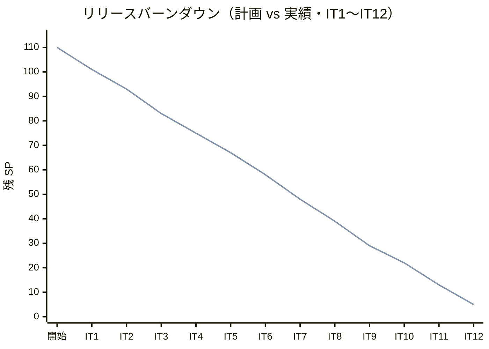
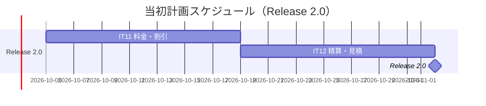
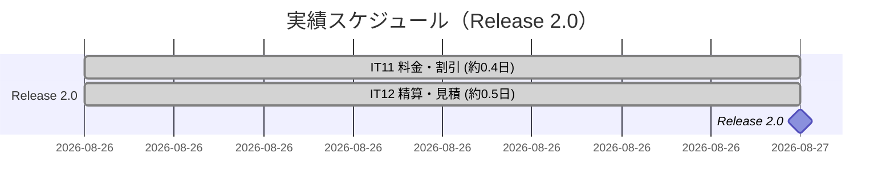
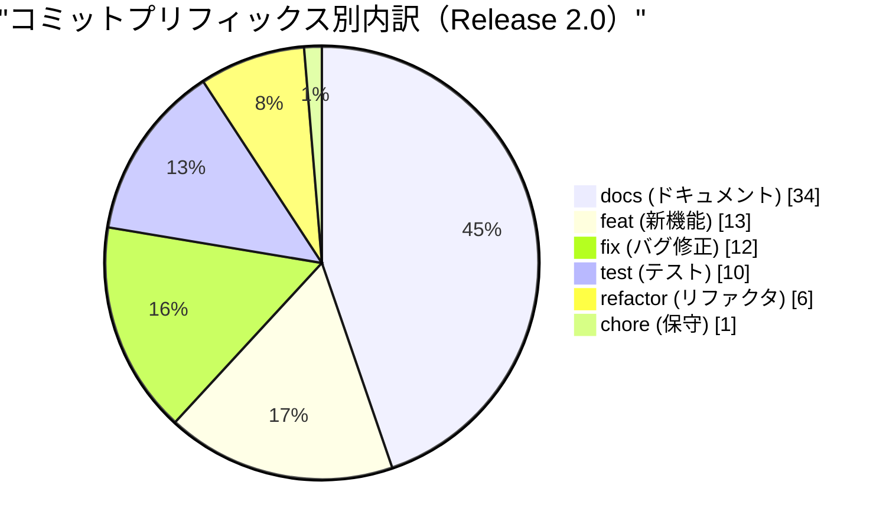
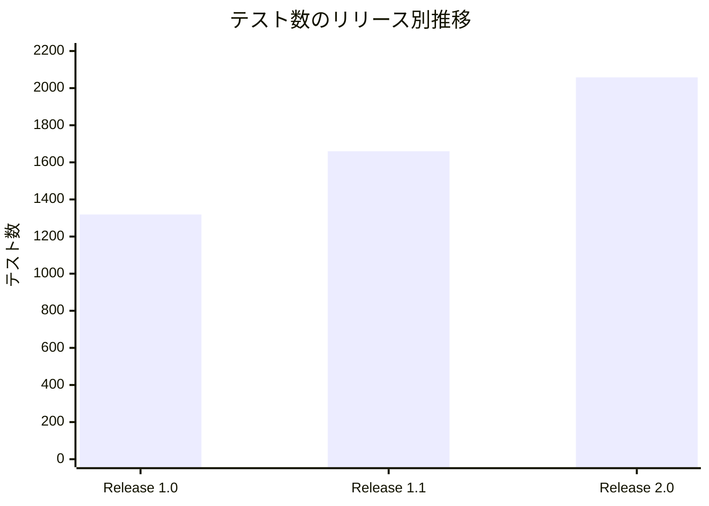
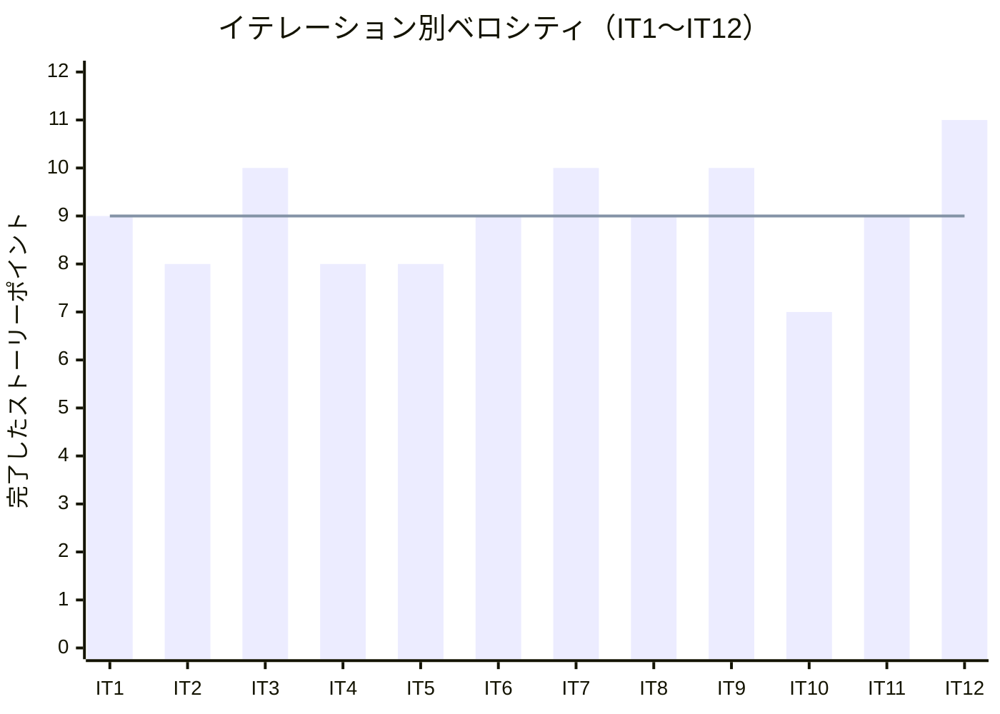

# リリース完了報告書 2.0 - 国際貨物輸送管理システム（java/take-7）

**報告書作成日**: 2026-08-27

## 概要

国際貨物輸送管理システム（Cargo Tracker）Release 2.0 のリリース完了報告書です。IT11・IT12 の
2 イテレーション、17 ストーリーポイントを 100% 達成し、**billingms が 10 イテレーションぶりに
仕事を始め、金額が業務として流れるようになりました**。

Release 1.0 が正常系の一気通貫を、Release 1.1 がそこから外れたときの戻り方を作ったのに対し、
Release 2.0 が扱ったのは**その輸送にいくらかかるか**です。運んだ後の請求（US21）、法人との
取り決め（US22）、入金の確認と精算の確定（US23）、そして運ぶ前の見積（US01）——
**同じ式が「見積」と「請求」の両端で使われる**ことが、本リリースの技術的な主題でした。

> **前提の欠落を明記します。** 本リリースにも **git タグ（`java/take-7/v2.0.0`）と
> `CHANGELOG.md` がありません**（Release 1.0・1.1 と同じ状態）。コミット分析は、IT10 の
> クローズ commit（`1c340b0c6`）から IT12 のクローズ commit（`be1fa57b7`）までの範囲で
> 代用しています。タグと CHANGELOG の作成は `developing-release` の領域であり、本報告書では
> 行っていません。**3 リリース連続で同じ欠落です。**

---

## プロジェクトサマリー

| 項目 | 値 |
|------|-----|
| **リリース期間** | 2026-08-26 07:20 〜 2026-08-27 06:02（約 23 時間） |
| **含まれるイテレーション** | IT11・IT12（2 イテレーション） |
| **総ストーリーポイント** | 17 SP（実作業は 20 SP——うち 3 SP は US21 の再実施） |
| **総コミット数** | 76（IT11: 41 / IT12: 35） |
| **変更規模** | 291 ファイル・+22,596 / -302 行 |
| **総テスト数** | 2,058（バックエンド 1,437 + フロントエンド 506 + E2E 88 + 実環境 E2E 27） |
| **ユーザーストーリー数** | 4（US21・US22・US23・US01） |
| **返済枠** | 17 件（IT11: 9 / IT12: 8）——**全返済** |
| **新規 ADR** | 2 件（[ADR-027](../adr/027-transport-charge-calculation.md)・[ADR-028](../adr/028-settlement-and-quotation.md)） |

---

## 計画と実績の差異分析

### イテレーション別達成状況

| イテレーション | リリース | 計画 SP | 実績 SP | 達成率 | 差異 |
|---------------|---------|---------|---------|--------|------|
| IT11 | Release 2.0 | 9 | 9 | 100% | 0 |
| IT12 | Release 2.0 | 11（うち 3 は US21 の再実施） | 11 | 100% | 0 |
| **合計** | | **20**（リリース算入 **17**） | **20**（同 **17**） | **100%** | **0** |

> **IT12 の 11 SP のうち 3 SP は US21（IT11）の再実施です。** IT11 で距離（受入基準 21-2）と
> 輸出免税を果たせなかったため、IT12 で作り直しました。**リリース全体の SP は増えません**——
> 累計には 17 SP として算入しています。

### リリース別達成状況

| リリース | 内容 | 計画 SP | 実績 SP | 達成率 |
|---------|------|---------|---------|--------|
| Release 0.1 予約・荷主 | IT1〜IT2 | 17 | 17 | 100% |
| Release 0.2 経路・航海 | IT3〜IT6 | 35 | 35 | 100% |
| Release 1.0 一気通貫 | IT7〜IT8 | 19 | 19 | 100% |
| Release 1.1 例外系 | IT9〜IT10 | 17 | 17 | 100% |
| **Release 2.0 精算・見積** | **IT11〜IT12** | **17** | **17** | **100%** |
| **累計** | **IT1〜IT12** | **105** | **105** | **100%** |

### リリースバーンダウン

**分析結果**: 12 イテレーション連続で計画と実績が一致しています。**ただし Release 2.0 は、
線が重なっていることが実態を最もよく隠したリリースでした**——IT11 は 9 SP を「達成」した
一方で受入基準 2 件（距離・輸出免税）を果たしておらず、その返済が IT12 の 11 SP のうち
3 SP を占めています。**バーンダウンは未達を表示しません。**

---

## 計画日程 vs 実績日数の差異分析

### イテレーション別日程比較

| IT | 計画期間 | 計画日数 | 実績期間 | 実績日数 | 短縮日数 | 短縮率 |
|----|---------|---------|----------|---------|---------|--------|
| 11 | 2026-10-05 〜 10-18 | 14 日 | 2026-08-26 07:20 〜 08-26 16:28 | **約 0.4 日**（9.1 時間） | 13.6 日 | 97.1% |
| 12 | 2026-10-19 〜 11-01 | 14 日 | 2026-08-26 17:00 〜 08-27 06:02 | **約 0.5 日**（13.0 時間） | 13.5 日 | 96.4% |
| **合計** | **28 日** | **28 日** | **約 0.9 日**（22.1 時間） | **27.1 日** | **96.8%** |

> **短縮率は AI 駆動開発の効果であり、人間のチームの見積もりが誤っていたことを示すもの
> ではありません。** 計画の 14 日はドキュメント上の枠であり、実作業はセッション単位で
> 連続しています。**この数値からベロシティを外挿することはできません。**

### 工期短縮の可視化

```mermaid
xychart-beta
    title "計画日数 vs 実績日数（Release 2.0）"
    x-axis ["IT11", "IT12"]
    y-axis "日数" 0 --> 15
    bar "計画" [14, 14]
    bar "実績" [1, 1]
```

### 計画 vs 実績ガントチャート

#### 当初計画スケジュール

#### 実績スケジュール

### サマリー

| 指標 | 値 |
|------|-----|
| **計画総日数** | 28 日 |
| **実績総日数** | 約 0.9 日 |
| **短縮日数** | 27.1 日 |
| **短縮率** | **96.8%** |
| **効率倍率** | **約 30 倍** |

### 差異分析

1. **Release 1.1（約 2.4 日）より 2 倍以上速く終わっています。** 新しいサービスの立ち上げ
   （billingms）を含むにもかかわらず速いのは、**IT9 で確立した形をそのまま適用できた**ため
   です——返済枠の先行消化、実環境で通す枠（Phase 6）、ADR による決定の先出し
2. **その速さが IT11 の未達を生みました。** 距離と輸出免税は「受入基準に書いてあるが実装が
   追いつかなかった」ものであり、**速く進むほど、字面を満たしたかどうかの確認が省かれます**。
   IT12 の DoD に「受入基準の項目を 1 つずつ画面と突き合わせる」を入れた直接の理由です
3. **クローズ作業が実装時間の相当部分を占めています。** IT12 のレビュー高 14 件はすべて
   実欠陥で、その修正だけで数時間を要しました。**実装が終わってからが半分**です

### 工期短縮の要因分析

| 要因 | 説明 |
|------|------|
| 式を 1 か所に置く決定 | 見積と請求で同じ式を使うことを ADR-027 決定 D で先に決め、**値の一致で固定した**（`QuoteMatchesInvoiceIntegrationTest`）。2 つ持てば必ずずれ、その調整に時間を取られる |
| 返済枠の先行消化 | IT 序盤に独立したコミットで済ませる形が 7 IT 連続で定着。17 件全返済 |
| 実環境で通す枠（Phase 6） | 実環境でだけ落ちる欠陥を IT 内で捕まえる。IT12 では **bookingms が `localhost:8086` を呼んでいた**（k8s マニフェストの環境変数漏れ）を捕捉 |
| 欠陥の形を検査に落とす | 同じ形の欠陥を繰り返さないための検査を追加（`ServiceEndpointConfigTest`・`AdrComplianceTableTest`・ArchUnit の HTTP クライアント規則） |

---

## コミットログ分析

### コミットプリフィックス別内訳

| プリフィックス | 件数 | 割合 | 説明 |
|---------------|------|------|------|
| docs | 34 | 44.7% | ドキュメント更新（ADR・計画・レビュー・マニュアル・設計） |
| feat | 13 | 17.1% | 新機能追加 |
| fix | 12 | 15.8% | バグ修正（**大半がレビュー指摘への対応**） |
| test | 10 | 13.2% | テスト追加 |
| refactor | 6 | 7.9% | リファクタリング |
| chore | 1 | 1.3% | 保守作業 |
| **合計** | **76** | **100%** | |

### コミットプリフィックス別パイチャート

### イテレーション別の内訳

| IT | docs | feat | fix | test | refactor | chore | 合計 |
|----|------|------|-----|------|----------|-------|------|
| IT11 | 21 | 6 | 7 | 4 | 2 | 1 | 41 |
| IT12 | 13 | 7 | 5 | 6 | 4 | 0 | 35 |

### 分析

1. **`docs` が 45% を占め、Release 1.1（39.8%）からさらに増えています。** ADR 2 本、計画・
   ふりかえり・完了報告書が各 2 本、レビュー 2 本、マニュアル 2 章分に加え、**IT11 の
   「注 1〜16 を設計文書へ反映する」のような、実装で決めたことを正典へ戻すコミット**が
   増えました。金額の扱いは設計文書に書いていないと次のイテレーションで再発明されます
2. **`test` が 10 件と Release 1.1（5 件）の倍になりました。** 内訳は**既存の実装に検査を
   後から足したもの**が中心です（ロール検査をエンドポイントの実体から回す、ADR の
   コンプライアンス表を実在で検査する、サービス間 URL の設定を検査する）。
   **`test` 単独のコミットが増えたのは、検査の空白を見つけた回数が増えたということ**です
3. **`refactor` が IT12 で倍増（2 → 4）しています。** SonarQube の「引数が多すぎる」指摘に
   対して引数オブジェクト（`InvoiceHeader`・`InvoiceLifecycle`）を導入するなど、
   **静的解析の指摘が設計の改善に繋がった**ケースが含まれます

---

## 品質メトリクス

### テストカバレッジ

| 対象 | 目標 | 実績 | 判定 |
|------|------|------|------|
| バックエンド（新規コード） | 80% | **89.7%** | 達成 |
| フロントエンド（新規コード） | 80% | **83.7%** | 達成 |
| ドメイン層 | 90% | **95.1%** | 達成 |

### テスト数のリリース別推移

| リリース | バックエンド | フロントエンド | E2E | 実環境 E2E | 合計 |
|---------|------------|--------------|-----|-----------|------|
| Release 1.0 | 926 | 335 | 58 | — | 1,319 |
| Release 1.1 | 1,142 | 439 | 60 | 19 | 1,660 |
| **Release 2.0** | **1,437** | **506** | **88** | **27** | **2,058** |

> **E2E（モック）が 60 → 88 と大きく伸びました。** 金額は画面に出る値そのものであり、
> **どこか一層で潰しても単体の検査は緑になる**ためです。モックを本物より甘くしないこと
> （丸めの向きと精度を揃える）を IT12 で修正しました。

### 静的解析

| 指標 | 結果 |
|------|------|
| SonarQube Quality Gate | **両プロジェクト PASS**（下記） |
| Bug | 0 |
| Vulnerability | 0 |
| 新規違反 | 0（両プロジェクト） |
| 重複率 | 0.05%（バックエンド） / 0.32%（フロントエンド）——閾値 3% |
| CI | 緑（最終 run [32985004416](https://github.com/k2works/case-study-cargo-tracker/actions/runs/32985004416)） |
| Flaky テスト | 1 件を検知・修正（`tracking.spec.ts`。IT11 から持ち越し、IT12 で原因を特定） |

> **バックエンドは一度 ERROR になりました。** 原因は `new_security_hotspots_reviewed: 0.0`
> の 1 件のみで、**新規違反 0・Bug 0・Vulnerability 0・新規カバレッジ 89.7% はすべて基準内**
> でした。対象は Flyway の Java マイグレーション（`V5__drop_booking_unique.java`）で、
> DB から読んだ制約名を SQL に混ぜる箇所。**中身は読んで安全と確認済み**
> （`^\w+$` で識別子の形を検査してから使う・件数照会は `PreparedStatement`）で、
> その根拠をコードにも残しました。
>
> **コード側では消せないことが分かりました。** `// NOSONAR` は効きません——SonarQube の
> NOSONAR は Issue にのみ効き、Security Hotspot は対象外です（スキャンし直して確認）。
> V5 の書き換えも無意味です——既存 DB では適用済みとして記録されており再実行されません。
> **最終的に利用者が UI で手動承認し、両プロジェクト PASS になりました。**
>
> **同じ形で止まるのは IT5・IT6 に続き 3 度目です。** Hotspot が出るたびに管理者の
> UI 操作を待つ構造そのものが残っています（手元のスキャン用トークンでは
> `api/hotspots/search` が `Insufficient privileges` を返し、列挙も承認もできません）。
> 資格情報の受け渡しかゲート条件の見直しを IT13 で決めます。

### ベロシティ

| 項目 | 値 |
|------|-----|
| 平均ベロシティ | 9.0 SP/イテレーション |
| 最大ベロシティ | 11 SP（IT12） |
| 最小ベロシティ | 7 SP（IT10） |
| Release 2.0 の平均 | 10.0 SP（IT11 9・IT12 11） |

> **IT12 の 11 SP は過去最大ですが、うち 3 SP は US21 の再実施**です。新しく作った量として
> 数えると 8 SP であり、**ベロシティの上昇として読むべきではありません**。

---

## リリース履歴

| リリース | 含まれる IT | リリース日 | SP | 状態 |
|---------|-----------|-----------|-----|------|
| Release 0.1 予約・荷主 | IT1〜IT2 | 2026-08-20 | 17 | 完了（社内検証） |
| Release 0.2 経路・航海 | IT3〜IT6 | 2026-08-23 | 35 | 完了（社内検証） |
| Release 1.0 一気通貫 | IT7〜IT8 | 2026-08-24 | 19 | 完了（[報告書](release_report-1_0_0.md)） |
| Release 1.1 例外系 | IT9〜IT10 | 2026-08-26 | 17 | 完了（[報告書](release_report-1_1_0.md)） |
| **Release 2.0 精算・見積** | **IT11〜IT12** | **2026-08-27** | **17** | **完了（本報告書）** |
| Release 2.1 荷主のセルフサービス | IT13 | — | 5 | 未着手 |

---

## 主要な成果物

### 実装した主要機能

1. **輸送料金の算出**（Release 2.0 / IT11・IT12・US21）

     - 請求対象（引取済で未請求）の一覧 → 試算 → 請求書の発行という 1 本の流れ
     - **区間ごとの地域区分（国内 1.0 / 近海 2.5 / 遠洋 6.0）で係数を変える**。
       画面の内訳に区分と係数を出す（IT12 で返済——IT11 では区間数で代替していた）
     - 重量・貨物種別（通常・危険物・冷凍）による係数
     - **輸出免税**：出発国と到着国が違えば消費税は免税（IT12 で返済）。
       国が不明なときは**課税側に倒す**——分からないことを免税の理由にしない
     - キャンセル料の算定（US30 の承認済みキャンセルに対して）
     - 金額はすべて `BigDecimal` の HALF_UP。**モックも同じ向き・同じ精度で丸める**

2. **法人割引の適用**（Release 2.0 / IT11・US22）

     - 荷主ごとの割引率を請求に反映。**割引後の金額に課税する**順序を固定
     - 調整（減額）の金額は自動で決めない（[ADR-027](../adr/027-transport-charge-calculation.md)
       決定 6）——どれだけ引くかは荷主との関係で決まる

3. **精算の処理**（Release 2.0 / IT12・US23）

     - 入金確認（支払方法・入金日・参照番号）。**請求額との差額を画面に出し、
       差額があるときは一度止めて確認させる**
     - 入金確認で予約が「精算済」になる（billingms → bookingms）。
       **キャンセルされた予約は精算済にしない**（[ADR-028](../adr/028-settlement-and-quotation.md)
       決定 1）——受け側は**冪等**で、二重送信でも状態が壊れない
     - 赤伝（取消）と再発行。`UNIQUE (booking_id, void_marker)` で
       「取り消した分だけ出し直せる」を DB の制約として持つ
     - 支払期日（発行日 + 30 日）と期日超過の一覧
     - 請求書の印刷。**宛名・請求番号・発行日・支払期限が紙に出る**——
       画面専用の要素（内部向けの注意書き・操作ボタン）は印刷時に消える

4. **輸送見積の作成**（Release 2.0 / IT12・US01）

     - 経路候補ごとに**経由港・所要日数・概算料金・航海番号**の 4 項目を表示
     - **概算料金は請求と同じ式**（bookingms が ACL 経由で billingms に問う）。
       **式を 2 つ持たない**——値の一致を統合テストと実環境の両方で確かめた
     - 期限を超える候補も表示し、**何日超えるか**を添える——弾くと選択肢が消える
     - 危険物のときは危険物申告フォームを表示
     - 見積から予約登録への引き継ぎと、**内容が食い違ったときの警告**
       （IT2 で「US01・IT12 で満たす」と記録した US04 の未達をここで閉じた）

### 技術的成果

| 成果 | 内容 |
|------|------|
| テスト駆動開発 | 2,058 テスト、新規コードのカバレッジ 89.7% / 83.7%、ドメイン層 95.1% |
| 式の単一化 | 見積と請求で同じ式を使うことを**値の一致で固定**（`QuoteMatchesInvoiceIntegrationTest`）。実環境でも 1 円まで一致することを確認 |
| ADR による決定の先出し | ADR-027（料金算出）・ADR-028（精算と見積）。**決定の数だけ検査を用意する**規律を IT12 で導入し、コンプライアンス表が挙げるクラスの実在を検査（`AdrComplianceTableTest`） |
| 繰り返す欠陥を構造で捕まえる | `ServiceEndpointConfigTest`（設定のドリフト・**3 度目**で検査化）、ArchUnit の HTTP クライアント規則（application 層は相手を呼ばない）、ナビゲーションの「保留項目ゼロ」検査 |
| DB 方言差への対処 | H2 が部分 UNIQUE を持たず、制約名も DB ごとに違う——**名簿を持たず `information_schema` から引いて落とす** Java マイグレーションで解決 |
| 業務タイムゾーン | 期日・当日判定を業務ゾーンで行い、`TZ=UTC` でも緑であることを検査 |

---

## 総評

Release 2.0 は、全 17 SP を 2 イテレーションで 100% 達成し、**金額が業務として流れるように
なりました**。

Release 1.0 が「動く道」を、Release 1.1 が「外れたときの戻り方」を作ったのに対し、
Release 2.0 が作ったのは**その道の値段**です。運ぶ前に答えられ（見積）、運んだ後に請求でき、
入金を確認して精算が閉じる——**業務の輪が金額の側でも閉じました**。

### ハイライト

- **全 4 ユーザーストーリー完了**: US21（料金）・US22（法人割引）・US23（精算）・US01（見積）
- **2,058 テストによる品質保証**: バックエンド 1,437 + フロントエンド 506 + E2E 88 + 実環境 27
- **見積と請求が同じ式で、1 円まで一致する**: 統合テストと実環境の両方で確認
- **返済枠 17 件を全返済**: 7 IT 連続
- **レビューが 25 件の実欠陥を捕まえた**: IT11 で 11 件、IT12 で 14 件。すべてクローズ前に対応

### このリリースが示したこと

**「自分で書いた決定どうしが噛み合っていない」形が、Release 2.0 の中心的な発見でした。**

IT12 のレビューが見つけたのは、ADR-028 の決定 1（入金確認で予約を精算済にする）と
決定 8（キャンセル料の請求書も同じ経路で扱う）を組み合わせると、
**キャンセル済みの予約に対する入金が永久に記録できない経路**が生まれることでした。
両方の決定それぞれには検査があり、**すべてのテストが緑で、実環境の E2E も緑**でした。

もう 1 つは、**ADR のコンプライアンス表が挙げる 5 つのクラスが 1 つも実在しなかった**こと
です。「この決定はこの検査が守る」と書いただけで守った気になっていました。
IT12 で `AdrComplianceTableTest` を追加し、**表に書いたクラス名が実在することを検査**に
落としています。

ここから引き出した規律：

1. **決定は経路を端から端まで 1 度通す**（IT10 → IT11 → IT12 で 3 度踏んだ）
2. **ADR は決定の数だけ検査を用意する**——決定が 2 つで検査が 1 つなら片方は文章のまま
3. **コメントは仕様として読み、実装と突き合わせる**——「〜しない」は宣言しただけで
   守った気になりやすい

### 仕組みで埋めていない部分

**通知は依然として代替です。** 精算書のメール送付（受入基準 23-2）も、これまでの
通関完了・キャンセル承認・誤配と同じく**画面が「送られていないので営業から伝えてください」と
言う**形にしています。運用で回す約束が Release 2.0 で 5 つに増えました。

**精算履歴の専用画面はありません**（受入基準 23-5）。請求書詳細に入金と赤伝の履歴を
出すところまでで、履歴を横断して見る手段は用意していません。

**請求書を探せません。** 検索・発行月の絞り込み・合計が無く、件数が増えると目的の請求書に
辿り着けません。**経理担当者から 2 イテレーション連続で挙がっており、IT13 の申し送りの
筆頭**です。

**見積に荷主がありません。** 誰向けの見積かが記録されないため、一覧を荷主で辿れません。

### プロジェクト完了メトリクス（Release 2.0 時点・累計）

| 指標 | 値 |
|------|-----|
| **累計ストーリーポイント** | 105 SP / 110 SP（95.5%） |
| **Release 2.0 のコミット数** | 76 |
| **総テスト数** | 2,058 |
| **新規コードのカバレッジ** | 89.7%（バックエンド） / 83.7%（フロントエンド） |
| **リリース回数** | 5（0.1・0.2・1.0・1.1・2.0） |
| **イテレーション回数** | 12 |
| **ユーザーストーリー数** | **32 / 33 完了**（残り 1 件は Release 2.1 の US33） |
| **ADR** | 28 件（ADR-001〜028） |

---

**Release 2.0 完了** — 次は Release 2.1（荷主のセルフサービス）。最後の 1 ストーリーです。
