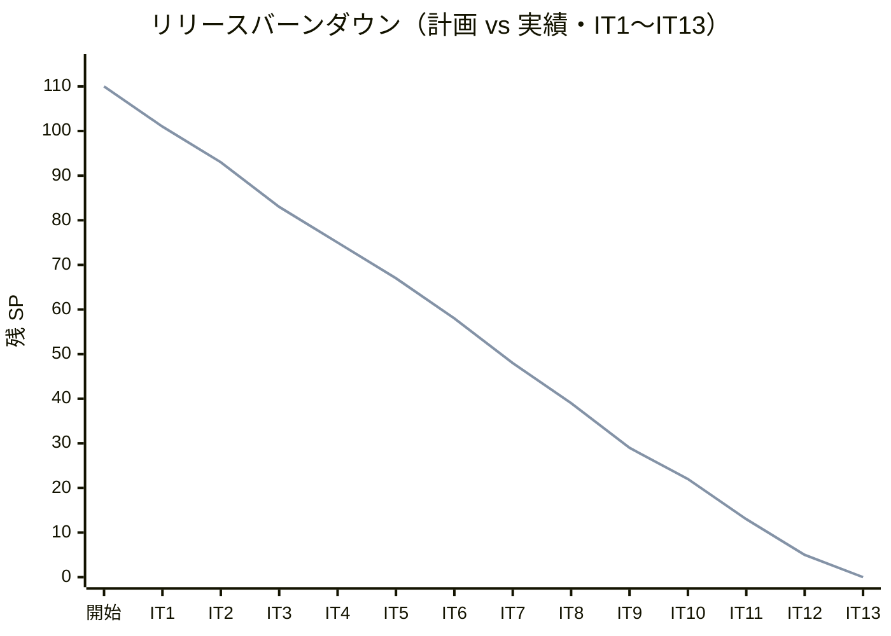
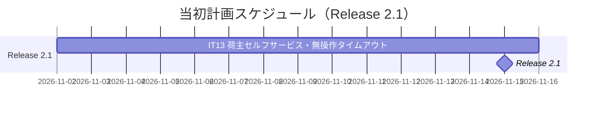
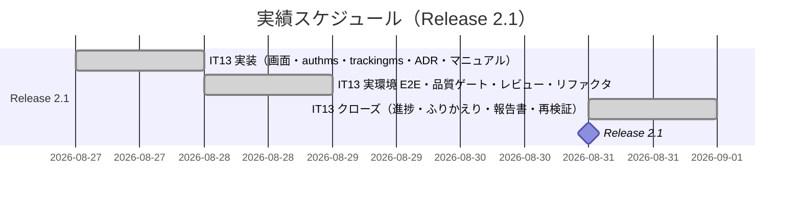
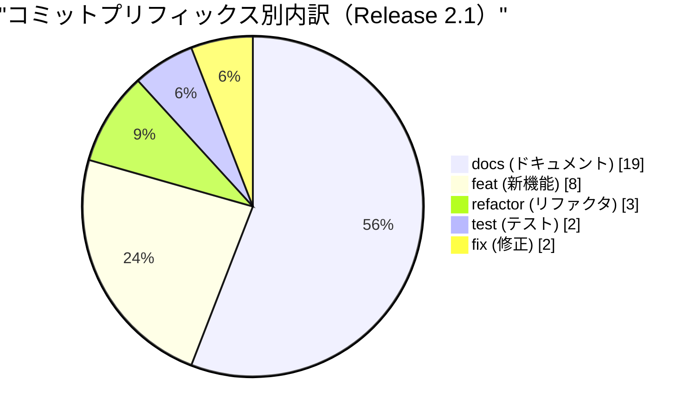
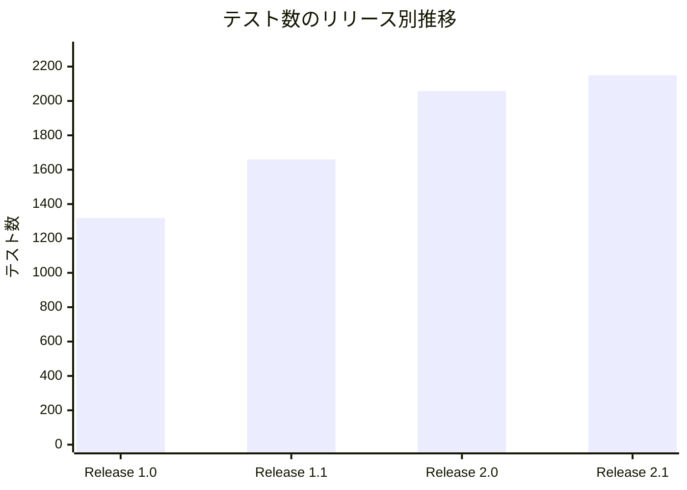
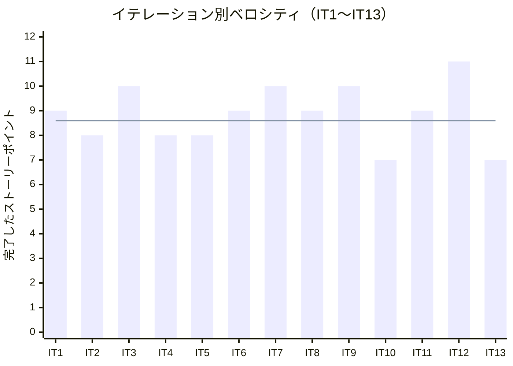

# リリース完了報告書 2.1 - 国際貨物輸送管理システム（java/take-7）

**報告書作成日**: 2026-08-31

## 概要

国際貨物輸送管理システム（Cargo Tracker）Release 2.1 のリリース完了報告書です。
IT13 の 1 イテレーション、7 ストーリーポイント（US33 5 SP + 技術課題 TD-01 2 SP）を
100% 達成し、**荷主が自分で自社の貨物を追えるようになりました**。

**これは最後のリリースです。** 計画した 33 ユーザーストーリー・110 SP と、
バッファに置いた技術課題 2 SP を、13 イテレーションですべて消化しました。

Release 1.0 が正常系の一気通貫を、Release 1.1 がそこから外れたときの戻り方を、
Release 2.0 が金額の流れを作りました。Release 2.1 が扱ったのは**社外の人が
自分で使う画面**です——これまでの 32 ストーリーはすべて社内の担当者が使うものでした。

> **前提の欠落を明記します。** 本リリースにも **git タグ（`java/take-7/v2.1.0`）と
> `CHANGELOG.md` がありません**（Release 1.0・1.1・2.0 と同じ状態で、**4 リリース連続**です）。
> コミット分析は、Release 2.0 のクローズ commit（`7bf64254c`）から本報告書の直前
> （`1dc2e7e9e`）までの範囲で代用しています。タグと CHANGELOG の作成は
> `developing-release` の領域であり、本報告書では行っていません。

---

## プロジェクトサマリー

| 項目 | 値 |
|------|-----|
| **リリース期間** | 2026-08-27 10:06 〜 2026-08-31 12:52 |
| **含まれるイテレーション** | IT13（1 イテレーション） |
| **総ストーリーポイント** | 7 SP（US33 5 SP + TD-01 2 SP。**US 分の 5 SP のみリリース計画の 110 SP に算入**） |
| **総コミット数** | 34（実装 29 + クローズ 5） |
| **変更規模** | 653 ファイル・+6,854 / -2,109 行 |
| **総テスト数** | **2,150**（バックエンド 1,509 + フロントエンド 519 + E2E 94 + 実環境 E2E 28） |
| **ユーザーストーリー数** | 1（US33） |
| **技術課題** | 1（TD-01・**IT2 で起票してから 9 イテレーション棚上げ**） |
| **新規 ADR** | 1 件（[ADR-029](../adr/029-shipper-tracking-boundary-and-inactivity-timeout.md)） |

---

## 計画と実績の差異分析

### イテレーション別達成状況

| イテレーション | リリース | 計画 SP | 実績 SP | 達成率 | 差異 |
|---------------|---------|---------|---------|--------|------|
| IT13 | Release 2.1 | 7 | 7 | 100% | 0 |
| **合計** | | **7** | **7** | **100%** | **0** |

### リリース別達成状況（全 6 リリース）

| リリース | 内容 | 計画 SP | 実績 SP | 達成率 |
|---------|------|---------|---------|--------|
| Release 0.1 予約・荷主 | IT1〜IT2 | 17 | 17 | 100% |
| Release 0.2 経路・航海 | IT3〜IT6 | 35 | 35 | 100% |
| Release 1.0 一気通貫 | IT7〜IT8 | 19 | 19 | 100% |
| Release 1.1 例外系 | IT9〜IT10 | 17 | 17 | 100% |
| Release 2.0 精算・見積 | IT11〜IT12 | 17 | 17 | 100% |
| **Release 2.1 セルフサービス** | **IT13** | **5（+ バッファ 2）** | **5（+ バッファ 2）** | **100%** |
| **累計** | **IT1〜IT13** | **110（+ バッファ 2）** | **110（+ バッファ 2）** | **100%** |

### リリースバーンダウン

**分析結果**: 13 イテレーションを通じて計画と実績が一致し、**残 SP は 0 になりました**。
ただし [Release 2.0 の報告書](release_report-2_0_0.md)に書いたとおり、
**線が重なることは「未達が無い」ことを意味しません**——IT11 の受入基準 2 件は
IT12 で返済しており、IT13 も 4 件を Release 2.2 候補へ送っています。
**バーンダウンは「送ったもの」を表示しません。**

---

## 計画日程 vs 実績日数の差異分析

### イテレーション別日程比較

| IT | 計画期間 | 計画日数 | 実績期間 | 実績日数 | 短縮日数 | 短縮率 |
|----|---------|---------|----------|---------|---------|--------|
| 13 | 2026-11-02 〜 11-15 | 14 日 | 2026-08-27 10:06 〜 08-28 17:56 | **約 1.3 日**（実装 11 時間 + 検証 7 時間） | 12.7 日 | 90.7% |
| — | （クローズ作業） | — | 2026-08-31 11:57 〜 12:52 | 約 1 時間 | — | — |

> **短縮率は AI 駆動開発の効果であり、人間のチームの見積もりが誤っていたことを示すもの
> ではありません。** 計画の 14 日はドキュメント上の枠です。
> **この数値からベロシティを外挿することはできません。**

> **クローズが 3 日空いています**（08-28 → 08-31）。実装と検証は 08-28 に終わっていましたが、
> **その間に入れたパッケージ構成リファクタが品質ゲートを壊しており**、
> 08-31 の再検証で初めて分かりました（後述）。

### 工期短縮の可視化

```mermaid
xychart-beta
    title "計画日数 vs 実績日数（Release 2.1）"
    x-axis ["IT13"]
    y-axis "日数" 0 --> 15
    bar "計画" [14]
    bar "実績" [1.3]
```

### 計画 vs 実績ガントチャート

#### 当初計画スケジュール

#### 実績スケジュール

### サマリー

| 指標 | 値 |
|------|-----|
| **計画総日数** | 14 日 |
| **実績総日数** | 約 1.3 日（クローズを含めて 3 営業日にまたがる） |
| **短縮日数** | 12.7 日 |
| **短縮率** | **90.7%** |
| **効率倍率** | **約 10.8 倍** |

### 差異分析

1. **US33 は既存機能の組み合わせだった。** 認証（US26）・追跡（US14〜US18）・
   荷主（US02）はすべて実装済みで、新しく作ったのは**紐付けと境界**だけである
2. **TD-01 は 2 SP のうち大半が「決めること」だった。** 実装（アイドル判定 + ルートガード）は
   小さく、判定時間・予告の有無・入力中の内容の扱いを ADR で固定するのに時間を使った
3. **クローズが最も長かった。** 実装 11 時間に対し、検証・レビュー・再検証で
   ほぼ同じだけの時間を使っている

### 工期短縮の要因分析

| 要因 | 説明 |
|------|------|
| 既存基盤の再利用 | 認証・追跡・ACL・契約テストの型が 12 イテレーション分そろっていた |
| 着手前の整合性検証 | 設計反映 5 件を着手前に潰し、実装中の手戻りが無かった |
| 受け入れテスト先行 | US33 の 4 受入基準を E2E に翻訳してから実装に入った |
| 決定の組み合わせを先に列挙 | IT12 の Try 1。既存 ADR 3 件との衝突を着手前に解消した |

---

## コミットログ分析

### コミットプリフィックス別内訳

| プリフィックス | 件数 | 割合 | 説明 |
|---------------|------|------|------|
| docs | 19 | 55.9% | 進捗反映・ADR・設計・マニュアル・クローズ文書 |
| feat | 8 | 23.5% | 荷主ポータル・紐付け API・追跡 API・タイムアウト |
| refactor | 3 | 8.8% | パッケージ構成の統一（653 ファイル） |
| test | 2 | 5.9% | 受入 E2E・実バックエンド E2E |
| fix | 2 | 5.9% | npm CLI の解決パス・SonarQube 指摘 14 件 |
| **合計** | **34** | **100%** | |

### コミットプリフィックス別パイチャート

### 分析

1. **docs が 55.9% を占める。** 内訳は「1 タスク終えるごとの進捗反映」が大半で、
   IT12 のふりかえり Try 3（「Phase を終えたら同じコミットで状態表を更新する」）を
   実行した結果である。**それでもレビューは、状態表の更新漏れを 2 件見つけた**
2. **refactor 3 件が 653 ファイル中の大半を動かした。** IT13 の機能実装は 98 ファイルで、
   残りはパッケージ構成の統一である。**この 3 件が品質ゲートを壊した**（後述）
3. **fix 2 件はどちらも「実装の欠陥」ではない。** 1 件は運用スクリプトのパス、
   1 件はリファクタが持ち込んだ静的解析の指摘である

---

## 品質メトリクス

### テストカバレッジ

| 対象 | 目標 | 実績 | 判定 |
|------|------|------|------|
| バックエンド（全体・命令） | 80% | **92.3%** | 達成 |
| バックエンド（ドメイン層） | 90% | **95.9%** | 達成 |
| バックエンド（新規コード） | 80% | **90.3%** | 達成 |
| フロントエンド（新規コード） | 80% | **80.2%** | 達成 |

### テスト数のリリース別推移

| リリース | バックエンド | フロントエンド | E2E | 実環境 E2E | 合計 |
|---------|------------|--------------|-----|-----------|------|
| Release 1.0 | 926 | 335 | 58 | — | 1,319 |
| Release 1.1 | 1,142 | 439 | 60 | 19 | 1,660 |
| Release 2.0 | 1,437 | 506 | 88 | 27 | 2,058 |
| **Release 2.1** | **1,509** | **519** | **94** | **28** | **2,150** |

### 静的解析

| 指標 | 結果 |
|------|------|
| CI | 緑（[run 33354760556](https://github.com/k2works/case-study-cargo-tracker/actions/runs/33354760556)） |
| SonarQube Backend | **PASS**（Bug 0・Vulnerability 0・新規違反 0・重複 0.05%・Hotspot レビュー 100%） |
| SonarQube Frontend | **PASS**（新規違反 0・重複 0.38%） |
| ArchUnit | 違反 0（全サービス） |
| JIG / jig-erd | 再生成し、生成物差分なし |

> **この PASS は 1 度失われて取り戻したものです。** 詳細は「果たせなかったこと」を参照。

### ベロシティ

| 項目 | 値 |
|------|-----|
| 平均ベロシティ | **8.6 SP / イテレーション**（112 SP ÷ 13 IT） |
| 最大ベロシティ | 11 SP（IT12。うち 3 SP は US21 の再実施） |
| 最小ベロシティ | 7 SP（IT10・IT13） |
| 初期見積もり | 10 SP（実効 8 SP） |

> **初期見積もり 10 SP に対し実績 8.6 SP で、実効ベロシティ 8 SP の想定に収まりました。**
> マイクロサービス構成による +補正（イベント・契約テスト・ACL）を織り込んだ
> 初期値の置き方は妥当だったと言えます。

---

## リリース履歴

| リリース | 含まれる IT | SP | 状態 |
|---------|-----------|-----|------|
| Release 0.1 予約基盤 | IT1〜IT2 | 17 | 完了（報告書なし） |
| Release 0.2 経路設計・予約確定 | IT3〜IT6 | 35 | 完了（報告書なし） |
| Release 1.0 荷役・追跡・例外 | IT7〜IT8 | 19 | [完了](release_report-1_0_0.md) |
| Release 1.1 誤配・通関・キャンセル承認 | IT9〜IT10 | 17 | [完了](release_report-1_1_0.md) |
| Release 2.0 精算・見積 | IT11〜IT12 | 17 | [完了](release_report-2_0_0.md) |
| **Release 2.1 荷主のセルフサービス** | **IT13** | **5（+ 2）** | **完了（本報告書）** |

---

## 主要な成果物

### 実装した主要機能

1. **荷主の自社貨物追跡**（Release 2.1 / IT13・US33）

     - authms に `user_shipper_link` を置き、利用者と荷主を紐付ける
     - trackingms が authms（紐付け）と bookingms（`CargoSnapshot`）の**2 本の ACL**を通して自社判定する
     - 一覧に状態・現在地・到着予定・**未解決の例外**を出す
     - 他社の貨物は**追跡番号を知っていても 404**（403 にすると「その番号は在る」と教えることになる）
     - 未紐付けの利用者には `200 + linked=false` で問い合わせ先を出す（空の一覧で終わらせない）

2. **共用端末の無操作タイムアウト**（Release 2.1 / IT13・TD-01）

     - 15 分無操作で警告（「保存されません」を明示）、20 分でログアウト
     - タブを閉じたときの `sessionStorage` 破棄（[ADR-005](../adr/005-token-storage-in-session-storage.md)）は従来どおり
     - 警告が入力中の操作を隠さないことを Playwright のスクリーンショットで確認

3. **パッケージ構成の統一**（IT13・返済）

     - 全サービスのパッケージ構成を cargo tracker の型に揃えた（653 ファイル）

### 技術的成果

| 成果 | 内容 |
|------|------|
| テスト駆動開発 | 2,150 テスト、バックエンド全体 92.3%・ドメイン層 95.9% |
| サービス境界 | **DB の外部キーを張らずに紐付けを実現**。`user_shipper_link.shipper_id` は外部 ID で、整合は内部 API と契約テストが守る |
| 認可の分離 | 公開追跡（認証不要）と荷主向け追跡（認証あり）を URL・API・認可すべて分けた |
| ADR | [ADR-029](../adr/029-shipper-tracking-boundary-and-inactivity-timeout.md)（決定 5 件）。`AdrComplianceTableTest` で検査名の実在を機械確認 |
| マニュアル | 14 章「荷主ポータル」新設・キャプチャ 5 枚 |

---

## 果たせなかったこと

### 1. 品質ゲートを記録した後の変更を、誰も測り直していなかった

**Release 2.1 で最も学びのあった失敗です。**

IT13 の品質ゲート（SonarQube 両プロジェクト PASS）を 08-28 に記録した後、
同じ日に**パッケージ構成リファクタ 3 件（653 ファイル）**を入れました。CI は緑でした。
しかし 08-31 のクローズ作業で再スキャンすると、**Backend の Quality Gate は ERROR に
戻っていました**——新規違反 14 件（未使用 import・空 package・ラムダ・URI 定数）と
Security Hotspot 1 件です。

- 違反 14 件は直しました（コミット `667516f5`）
- Security Hotspot 1 件は**利用者が UI で承認**して PASS になりました

> **「品質ゲートは通した」は、その時点のコードについての事実でしかありません。**
> 大きなリファクタを後から入れるなら、ゲートも測り直す必要があります。

### 2. SonarQube の Hotspot は、4 度目も利用者の手を借りた

走査トークンでは `api/hotspots/search` も `api/issues/do_transition` も
`Insufficient privileges` を返し、**列挙も承認もできません**。
IT5・IT6・IT12 と同じ形で **4 度目**です。IT13 でしたのは
「ゲート条件を `new_security_hotspots_reviewed=100.0` で自動判定する」と**決めた**ことだけで、
権限そのものは解いていません。

### 3. 荷主向け一覧は「直近 100 件」の中でしか働かない

`findRecent(100)` で取ってから所有判定しているため、**自社の貨物が直近 100 件から落ちると
荷主の一覧から消えます**。IT13 の業務量では起きませんが、**いつ壊れるかは件数だけで決まります**。

### 4. 1 荷主に複数の担当者を置けない

`user_shipper_link.shipper_id` を UNIQUE にしたため **1 荷主 1 利用者**です。
法人荷主では複数担当者が普通に起きます。

### 5. 請求書を探せない（3 リリース連続）

経理担当者から IT11・IT12・IT13 と **3 イテレーション連続**で指摘されています。
検索・発行月の絞り込み・合計が無く、**月末の締めは表計算に落ちたまま**です。

### 6. 通知は最後まで代替のままだった

**メールを送る仕組みは、Release 2.1 まで一度も作りませんでした。** 経路確定・通関完了・
キャンセル承認・誤配・精算書の 5 つは、いずれも**画面が「送っていないので営業から
伝えてください」と言う**形です。運用で回す約束が 5 つ残ります。

---

## 総評

国際貨物輸送管理システム（java/take-7）は、全 **110 SP・33 ユーザーストーリー**を
**13 イテレーション**で **100%** 達成し、バッファに置いた技術課題 2 SP も消化して完了しました。

### ハイライト

- **全 33 ユーザーストーリー完了**: US01〜US33。予約 → 経路 → 荷役 → 通関 → 引取 → 料金 → 精算、
  そして荷主自身の追跡までが 1 本でつながっています
- **2,150 テストによる品質保証**: バックエンド 1,509 + フロントエンド 519 + E2E 94 + 実環境 28
- **6 段階リリース戦略の完走**: 幅を広げるより、細くても端から端までつながっていることを
  優先しました（ウォーキングスケルトン）
- **ADR 29 件**: 決定は文章で終わらせず、`AdrComplianceTableTest` が検査名の実在を守ります
- **ベロシティ 8.6 SP の安定**: 13 イテレーションで 7〜11 SP に収まりました

### このリリースが示したこと

**Release 2.1 の主題は「社外の人が使う画面をどう守るか」でした。**

これまでの 32 ストーリーはすべて社内の担当者が使うもので、認可は「役割で分ける」だけで
足りていました。US33 で初めて、**同じ役割の中で見えるものが人によって違う**（自社の貨物だけ）
という要求が出ます。ここで引いた線は 3 つです。

1. **紐付けは認証側に置き、業務側のスキーマに混ぜない**——混ぜた瞬間、認証の都合が
   予約のテーブルに漏れる
2. **境界は「見せない」ではなく「存在を知らせない」**——403 は「その番号は在る」と教える
3. **公開と限定は URL から分ける**——守るものが違うものを、同じ経路に載せない

**そして最後の失敗が、最も再現しやすい形をしていました。** 品質ゲートを通した後に
大きなリファクタを入れ、CI が緑だったので測り直さなかった——**「通した」を
「通っている」と読み替えた**わけです。13 イテレーションを通じて繰り返し出てきた形
（決定を書いて満足する・翻訳したところで満足する・件数を出して満足する）の、最後の 1 つでした。

### プロジェクト完了メトリクス（最終）

| 指標 | 値 |
|------|-----|
| **総ストーリーポイント** | **110 SP / 110 SP（100%）** + バッファ 2 SP |
| **総コミット数** | **508**（`main` からの分岐以降・マージを除く。Release 2.1 は 34） |
| **総テスト数** | **2,150** |
| **テストカバレッジ** | バックエンド全体 92.3% / ドメイン層 95.9% / 新規コード 90.3%（BE）・80.2%（FE） |
| **リリース回数** | **6**（0.1・0.2・1.0・1.1・2.0・2.1） |
| **イテレーション回数** | **13** |
| **ユーザーストーリー数** | **33 / 33 完了** |
| **平均ベロシティ** | 8.6 SP / イテレーション |
| **ADR** | **29 件**（ADR-001〜029） |
| **マニュアル** | 全 15 章（00 はじめに 〜 14 荷主ポータル） |

### 次に取り組むなら（Release 2.2 候補）

[IT13 ふりかえり](retrospective-13.md)の引き継ぎ表に 10 件あります。
**3 度目・4 度目が 4 件**あり、いずれも「余力次第の返済枠」に置き続けた結果です。

| 優先 | 内容 | 何度目か |
|------|------|---------|
| 1 | 請求書の検索・発行月の絞り込みと合計 | **3 度目** |
| 2 | SonarQube 走査トークンへの Hotspot 権限 | **4 度目** |
| 3 | 荷主向け一覧の所有判定を Read Model へ降ろす | 1 度目 |
| 4 | 1 荷主に複数担当者を紐付ける | 1 度目 |
| 5 | git タグと CHANGELOG の作成（`developing-release`） | **4 リリース連続の欠落** |

> **TD-01 が 9 イテレーション棚上げされた形を、繰り返さないことです。**
> 3 度目・4 度目は返済枠ではなく、SP 付きのタスクとして計画に居場所を与えてください。

---

**Release 2.1 完了** — 予約から精算まで、そして荷主自身の目まで。33 ストーリー、13 イテレーション。
