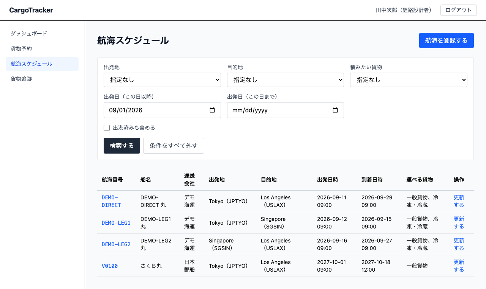
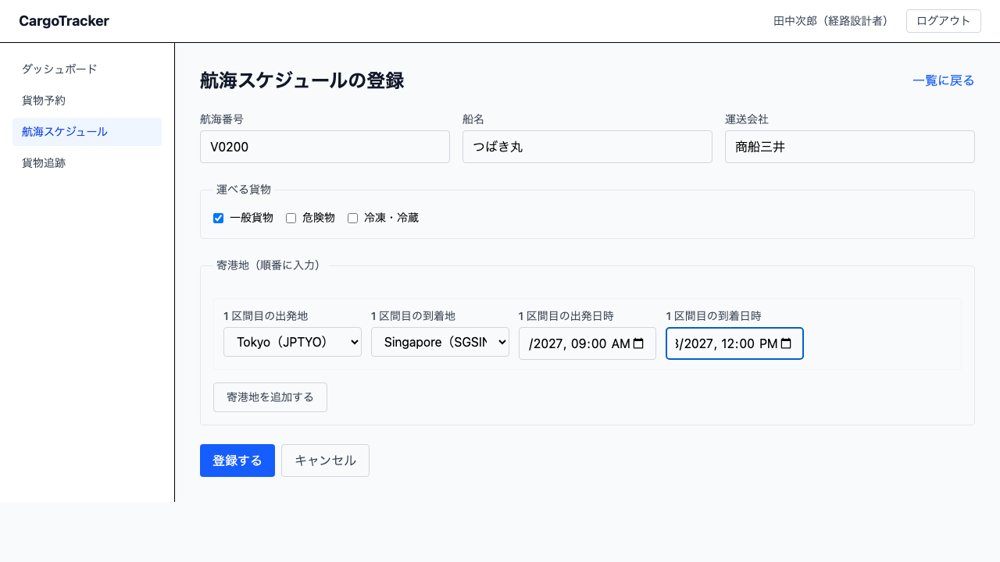
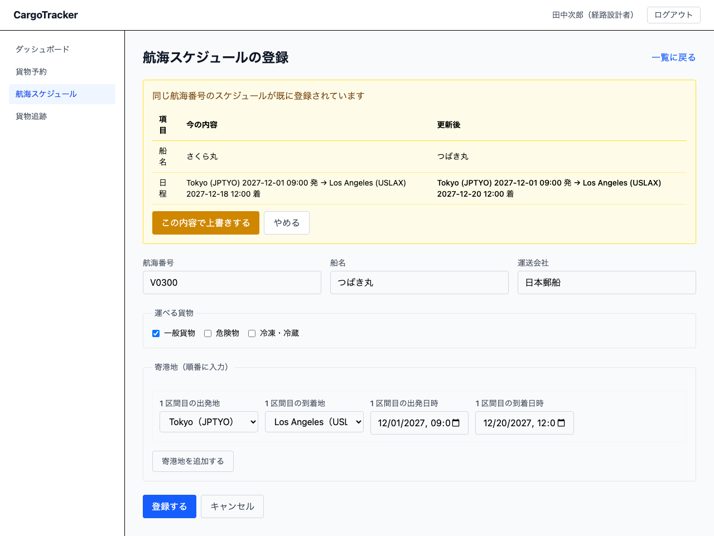
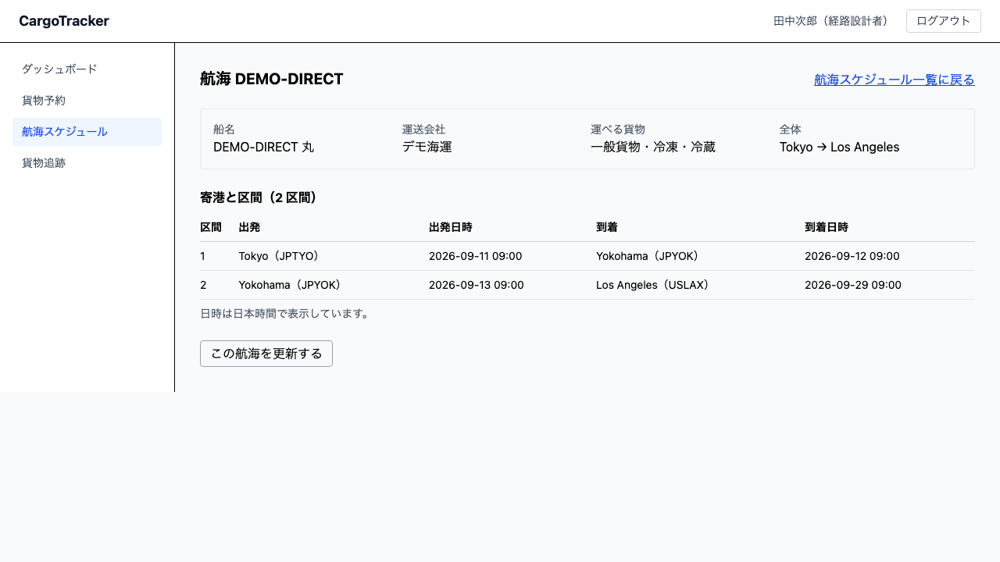

# 05 航海スケジュール

船がいつ・どの港を回るかを登録し、予約に合う便を探す画面です。**経路設計者**が使います。

本章は [01 業務フロー](01-業務フロー.md#steps) の**工程 4（航海スケジュールを登録する）**に
対応します。ここで登録した航海が、工程 5（経路を決めて予約に紐付ける）の材料になります。

## 画面の開き方

メニュー「航海スケジュール」（URL: `/routing/voyages`）、または経路設計ダッシュボードの
「航海スケジュールを見る」から開きます。

| 節 | 内容 |
| :--- | :--- |
| [5.1](#search-voyage) | 航海スケジュールを探す |
| [5.2](#register-voyage) | 航海スケジュールを登録する |
| [5.3](#update-voyage) | 航海スケジュールを更新する |
| [5.4](#voyage-detail) | 航海の寄港と時刻を確かめる |

> **予約に対して経路の候補を出す操作は [06 経路設計](06-経路設計.md) にあります。**
> 本章は航海そのものの登録・更新と、条件に合う航海を探すところまでです。

> **港湾制約による絞り込みは行いません。** 「この港はこの船を受け入れられるか」という制約は
> 扱わないと決めました。積める貨物は港ではなく**航海**が持ちます。検索で絞れるのは
> **出発地・目的地・出発日・積みたい貨物**の 4 つです。

---

## 5.1 航海スケジュールを探す {#search-voyage}

### この画面でできること

登録済みの航海を、出発が早い順に一覧します。予約に合う便を探すために絞り込めます。

> **既定では、本日以降に出発する航海だけを表示します。** 出発が早い順に並ぶため、絞らないと
> もう出てしまった船が先頭を占めます。過去の便も見たいときは [出港済みも含める] にチェックを
> 入れてください。

### 画面の説明

### 絞り込みの項目

| 項目 | 説明 |
| :--- | :--- |
| 出発地 | 一覧から選びます。**その港を出て、目的地へ向かう向き**の航海だけが残ります |
| 目的地 | 一覧から選びます |
| 積みたい貨物 | 一般貨物・危険物・冷凍・冷蔵から選びます。運べる航海だけが残ります |
| 出発日（この日以降） | この日以降に出発する航海に絞ります。既定は本日です |
| 出発日（この日まで） | この日までに出発する航海に絞ります |
| 出港済みも含める | チェックすると「この日以降」の指定が外れ、出港済みの航海も出ます |

> **出発日の絞り込みが見るのは、航海全体の出発日（最初の区間の出発）です。** 途中の港から
> 積む予定でも、その港の出発日ではなく最初の区間の出発日で絞られます。

### 一覧に出る項目

| 項目 | 説明 |
| :--- | :--- |
| 航海番号 | 航海の識別子です |
| 船名 | どの船かを示します。荷役の現場や問い合わせで貨物を追うときに使います |
| 運送会社 | その船を運航する会社です |
| 出発地・目的地 | 最初の出発地と、最後の到着地です |
| 出発日時・到着日時 | 日本時間で表示します |
| 運べる貨物 | その船が運べる貨物種別です |
| 操作 | [更新する] からスケジュールを直せます。**今の内容が入力欄に入った状態**で開きます |

### 操作手順

1. メニュー「航海スケジュール」を開きます
2. 絞り込みの項目を入れます（すべて任意です）
3. [検索する] を押します

### 条件に合う航海が無かったとき

「条件に合う航海はありませんでした。」と表示され、[条件をすべて外して探し直す] が出ます。

> **出発日の範囲と積みたい貨物は、絞り込みが強く効きます。** 見つからないときは、まずこの 2 つを
> 外して探し直してください。

### 件数が多いとき

> **表示は先頭 50 件までです。** 51 件以上あるときは「◯件ありますが、先頭の 50 件だけを
> 表示しています」と表示されます。この行が出ているときは、**一覧に出ていない航海があります**。
> 条件を絞り込んでください。

---

## 5.2 航海スケジュールを登録する {#register-voyage}

### この画面でできること

新しい航海を登録します。寄港地は順番に、いくつでも追加できます。

### 画面の開き方

一覧画面の [航海を登録する]（URL: `/routing/voyages/new`）から開きます。

### 画面の説明

### 入力する項目

| 項目 | 必須 | 説明 |
| :--- | :--- | :--- |
| 航海番号 | ○ | 航海の識別子です |
| 船名 | ○ | どの船かが分からないと、荷役や問い合わせで貨物を追えません |
| 運送会社 | ○ | 同上 |
| 運べる貨物 | ○ | 1 つ以上を選びます。危険物・冷凍は運べる船が限られます |
| N 区間目の出発地・到着地 | ○ | 一覧から選びます |
| N 区間目の出発日時・到着日時 | ○ | 日本時間で入力します |

### 操作手順

1. 一覧画面で [航海を登録する] を押します
2. 航海番号・船名・運送会社を入力します
3. 「運べる貨物」で、その船が運べる種別にチェックを入れます
4. 1 区間目の出発地・到着地・出発日時・到着日時を入力します
5. 寄港地が複数あるときは [寄港地を追加する] を押し、区間を足します
6. [登録する] を押します

> **区間を追加すると、出発地に前の区間の到着地が入ります。** 東京 → 上海 → ロサンゼルスなら、
> 2 区間目の出発地は上海として扱われます。入れ直す必要はありません。

### よくある入力の誤り

| 表示されるメッセージ | 直し方 |
| :--- | :--- |
| 航海番号は必須です | 航海番号の欄が空です |
| 船名は必須です | 船名の欄が空です |
| 運送会社は必須です | 運送会社の欄が空です |
| 対応できる貨物種別を 1 つ以上選んでください | 「運べる貨物」のチェックがすべて外れています |
| N 区間目の出発地を選んでください | その区間の出発地が「選んでください」のままです |
| N 区間目の到着地を選んでください | その区間の到着地が「選んでください」のままです |
| N 区間目の出発地と到着地は同じにできません | どちらかを別の港に変えます |
| N 区間目の出発日時を入力してください | その区間の出発日時の欄が空です |
| N 区間目の到着日時を入力してください | その区間の到着日時の欄が空です |
| N 区間目の到着日時は出発日時より後にしてください | 到着日時を入れ直します。出発と同じ時刻は受け付けません |
| N 区間目は、前の区間の到着地から出発するようにしてください | 前の区間の到着地に合わせます |
| N 区間目が前の区間の到着より前に出発しています | 出発日時を入れ直します。前の区間の到着と同じ時刻（滞船 0 分）は受け付けます |
| 寄港地を 1 区間以上入力してください | 区間がすべて削除されています。[寄港地を追加する] で足します |
| 区間の出発地が見つかりません | 一覧に無い港が選ばれています。選び直してください |
| 区間の到着地が見つかりません | 一覧に無い港が選ばれています。選び直してください |
| 対応できる貨物種別は一覧から選んでください | 「運べる貨物」に一覧外の値が入っています。選び直してください |
| 登録できませんでした。時間をおいて再度お試しください。 | 入力の誤りではありません。しばらく待ってからもう一度押してください |

> **メッセージは上の表の字面そのままで表示されます。** 入力した値は付きません
> （貨物予約と同じ扱いです）。

> **「運べる貨物」をすべて外して登録することはできません。** 何も運べない航海は検索に
> 一切出てこないため、登録できても後で「経路が見つからない」という形でしか気づけません。

> **日時は日本時間で入力します。** 入力した時刻がそのまま日本時間として扱われます。

---

## 5.3 航海スケジュールを更新する {#update-voyage}

### この画面でできること

登録済みの航海の内容を差し替えます。**何が変わるかを確認してから**上書きします。

### 操作手順

1. 一覧画面で、直したい航海の行の [更新する] を押します
2. 見出しが「航海スケジュールの更新」の画面が開きます。**今の内容がすべて入力欄に入っています**
3. 変えたいところだけを直します（遅延なら到着日時だけを直せば済みます）
4. [登録する] を押します
5. 「同じ航海番号のスケジュールが既に登録されています」と表示され、変更の一覧が出ます
6. 内容を確かめて [この内容で上書きする] を押します

> **打ち直す必要はありません。** 10 区間ある航海の到着を 1 日ずらすために全部入力し直すと、
> その途中で別の項目まで変わってしまいます。今の内容を読み込んだ状態から直してください。

> **同じ航海番号を入れても「登録できません」とは言われません。** 同じ番号を入れるのは、
> 多くの場合スケジュールの差し替えだからです。そこで止めると、別の番号を作る（同じ航海が
> 2 つできる）か、一覧から探し直すことになります。

### 変更の一覧の見かた

| 列 | 説明 |
| :--- | :--- |
| 項目 | 変わる項目の名前（船名・運送会社・対応できる貨物種別・寄港地・日程） |
| 今の内容 | 登録されている内容 |
| 更新後 | [この内容で上書きする] を押したときの内容 |

> **[やめる] を押せば、既存のスケジュールは変わりません。** 入力した内容は画面に残るので、
> 直してからもう一度 [登録する] を押せます。

> **「日程」は全区間の出発・到着をまとめて比べます。** 遅延で到着だけが変わった場合も
> ここに差分として出ます。日時は日本時間で表示します。

> **内容が同じときは、「同じ航海番号のスケジュールが既に登録されています。変更はありません」と
> 表示され、[閉じる] だけが出ます。** 押しても何も変わらないため、上書きのボタンは出しません。

---

## 5.4 航海の寄港と時刻を確かめる {#voyage-detail}

### この画面でできること

一覧の**航海番号**を押すと、その航海の詳細を開きます。一覧は出発地と目的地しか出さないため、
途中でどこに寄るか・区間ごとに何時に出て何時に着くかは、ここでしか分かりません。

経路の候補に出た航海が本当に使えるか（積み替えの港にいつ着くか）を確かめるときに使います。

### 表示される内容

| 項目 | 説明 |
| :--- | :--- |
| 船名・運送会社 | どの船が運ぶか |
| 運べる貨物 | この航海が積める貨物種別 |
| 全体 | 最初の出発地と最後の到着地 |
| 寄港と区間 | 区間ごとの出発地・出発日時・到着地・到着日時 |

> **日時は日本時間で表示します。**

> **日時は日本時間で表示しています。**（画面の下にもそう書いてあります）

> **画面の右上の [航海スケジュール一覧に戻る] で、一覧へ戻れます。**

> **[この航海を更新する] を押すと、いまの内容が入った状態で登録画面が開きます。**
> 打ち直す必要はありません。

### この節で出るメッセージ

| メッセージ | いつ出るか | どうすればよいか |
| :--- | :--- | :--- |
| 読み込んでいます… | 航海を読み込んでいる間 | 待つ |
| 指定された航海が見つかりません。 | 航海番号が誤っている / その航海が消えている | 一覧から入り直す |

---

## 関連する章

- [01 業務フロー](01-業務フロー.md#steps) — 工程 4 の位置づけ
- [04 貨物予約](04-貨物予約.md) — 経路を組む対象になる予約
- [06 経路設計](06-経路設計.md) — 登録した航海から経路の候補を出す
