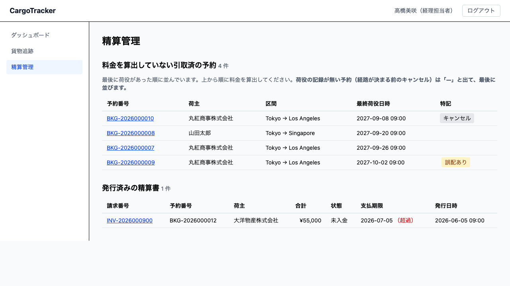
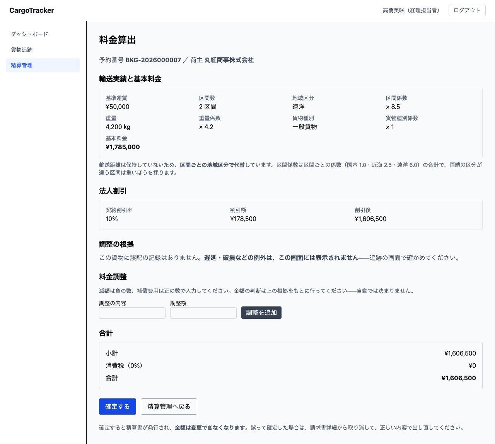
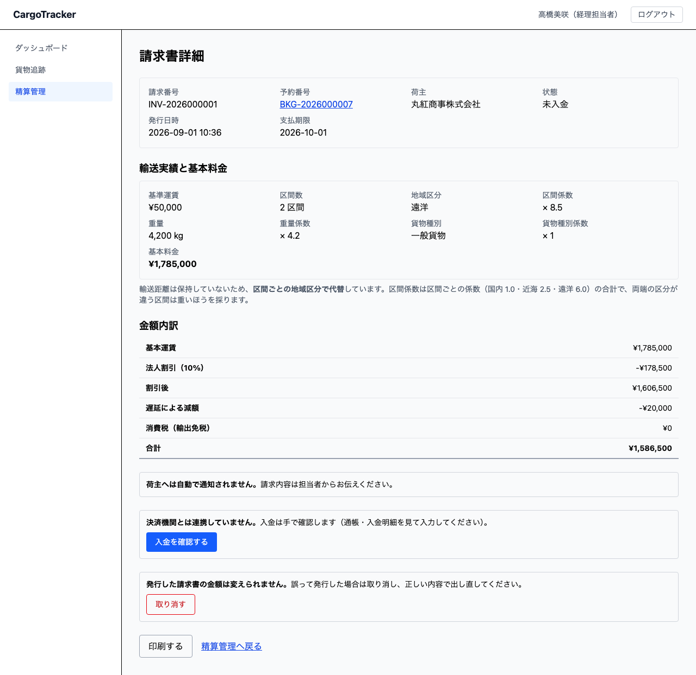

# 12 精算管理

引き取りが終わった貨物に、いくら請求するかを決める画面です。**経理担当者**が使います。

本章は [01 業務フロー](01-業務フロー.md#steps) の「料金を計算して請求書を発行する」に
あたります。

> **請求書を発行すると、金額は変えられません。** 請求書は荷主へ出す約束であり、
> 出したあとに黙って変わると、請求の根拠が消えるためです。**訂正が必要になったら
> 取り消して出し直します**（[12.4](#void)）——消すのではなく、取り消した記録を残します。

## 画面の開き方

メニューの **[精算管理]** を押します。URL は `/billing` です。
経理ダッシュボードの **[料金を算出する]** からも開けます。



## 12.1 料金を算出する {#calculate}

### 待っている案件を見つける {#find}

精算管理の画面には、2 つの一覧があります。

| 一覧 | 内容 |
| :--- | :--- |
| 料金を算出していない引取済の予約 | **これからの仕事**です。最後に荷役があった順に並びます |
| 発行済みの精算書 | **済ませた仕事**です。新しい順に並びます |

#### 料金を算出していない予約の一覧 {#unbilled-columns}

| 列 | 説明 |
| :--- | :--- |
| 予約番号 | 押すと料金算出の画面が開きます |
| 荷主 | 請求先です |
| 区間 | **積出港 → 仕向港**です。途中の経由港は出ません（区間**数**は料金算出の画面で確かめられます） |
| 最終荷役日時 | 最後に荷役があった日時です。**引取の日時とは限りません**。記録が無ければ「—」 |
| 特記 | 料金の判断に関わる印です（下記） |

#### 発行済みの精算書の一覧 {#invoice-columns}

| 列 | 説明 |
| :--- | :--- |
| 請求番号 | 押すと請求書詳細が開きます |
| 予約番号 | どの貨物への請求かを表します |
| 荷主 | **発行した時点**の社名です（あとで社名が変わっても、この欄は変わりません） |
| 合計 | 消費税を含む請求額です |
| 状態 | 支払いの状態です（[12.2](#payment-status)）。取り消した請求書には「（取消済）」が付きます |
| 支払期限 | 発行日から 30 日後です。**催促の判断に使います** |
| 発行日時 | 請求書を発行した日時です |

> **最後に荷役があった順に並びます。** いちばん待たせている荷主への請求が上に来ます。
> **引取の日時とは限りません**——キャンセルされた予約は引き取っていませんが、途中まで
> 運ばれていれば荷役の記録を持ちます。荷役の記録が無い予約（経路が決まる前のキャンセル）は
> 「—」と出て、最後に並びます。
>
> **ログインすると、ダッシュボードに件数が出ます。** 「料金を算出していない引取済の
> 予約が N 件あります」。**この件数と一覧のほかに、気づく手段はありません**
> ——メールでのお知らせは次のリリース以降です。毎朝ここを開いてください。

一覧の **特記** の欄には、料金の判断に関わる印が出ます。

| 印 | 意味 |
| :--- | :--- |
| 誤配あり | 予定していない港で荷役がありました。料金調整の判断が要ります |
| キャンセル | キャンセルされた予約です。キャンセル料が算定されます |

### 料金を出す {#amount}

一覧で**予約番号**を押すと、料金算出の画面が開きます。
URL は `/billing/new/:bookingId` です。



画面の上から順に、次のものが出ます。

#### 輸送実績と基本料金 {#basis}

基本料金は次の式で決まります。

```text
基本料金 = 基準運賃 × 区間係数 × 重量係数 × 貨物種別係数
```

| 項目 | 内容 |
| :--- | :--- |
| 基準運賃 | 1 区間・1,000kg・一般貨物のときの運賃です |
| 区間数 | 旅程の区間数です。直行なら 1、積み替えが 1 回なら 2 になります |
| 地域区分 | 旅程でいちばん重い区分です（国内 / 近海 / 遠洋） |
| 区間係数 | **区間ごとの地域係数の合計**です（国内 1.0・近海 2.5・遠洋 6.0）。両端の区分が違う区間は**重いほう**を採ります |
| 重量・重量係数 | 重量（kg）÷ 1,000 です。**下限は 0.1** です |
| 貨物種別・貨物種別係数 | 一般貨物 1.0 ／ 危険物 1.8 ／ 冷凍・冷蔵 1.5 |

> **輸送距離は使っていません。** システムは港の緯度経度を持っていないため、
> **区間ごとの地域区分で代替**しています（IT12 で改訂）。画面にもそのことが出ます。
>
> 例: 東京 → 横浜（国内 1 区間）は係数 1.0、東京 → シンガポール → ロサンゼルス
> （近海 + 遠洋）は 2.5 + 6.0 = 8.5 です。**同じ「2 区間」でも金額は変わります。**
> 一方、**同じ区分の中では距離の差を見ません**——東京 → 大阪と東京 → 那覇は同じ扱いです。
>
> **金額の内訳は、荷主に説明するためのものです。** 「なぜその金額か」を聞かれたときは、
> この欄をそのままお伝えください。

#### 法人割引 {#discount}

荷主が法人で、契約割引率が登録されていれば、**自動で入ります**。
経理担当者が入力するものではありません——手で入れると、契約と違う率が入るためです。

割引率は荷主の登録画面（[03 荷主管理](03-荷主管理.md)）で設定します。

> **個人のお客様には、割引の欄そのものが出ません。** 「0%」ではなく「契約がない」
> ためです。法人でも割引率が登録されていなければ、同じく割引はありません。

#### キャンセル料 {#cancellation-fee}

キャンセルされた予約では、キャンセル料が加算されます。

| キャンセルを申請した時点の状態 | 料率 |
| :--- | :--- |
| 仮受付・経路提案中 | 0%（まだ何も手配していません） |
| 荷主へ通知済 | 5% |
| 確定済・追跡番号発行済 | 10% |
| 輸送中 | 30%（船から降ろす実費がかかります） |

> **料率は「申請した時点」の状態で決まります。** 承認した時点ではありません
> ——輸送中に申請されたものは、承認が翌日でも輸送中の料率になります。
> 画面には申請時点の状態と料率が出ますので、荷主にはそれをお伝えください。

#### 調整の根拠 {#evidence}

誤配や例外（遅延・破損・紛失）があった貨物では、その記録が出ます。

- **誤配** — いつ・どこで予定ルートから外れたか
- **例外** — どの例外が、いつ起きたか

> **金額は自動では決まりません。** どれだけ減額するか、補償費用をいくら乗せるかは、
> 荷主との関係で決まる話であり、規則にできないためです。
> **画面は根拠を出すところまで**で、金額の判断は経理担当者が行います。
>
> **遅延・破損などの例外は、この画面には表示されません。** 表示されるのは誤配の記録だけです
> ——例外が起きているかは[09 貨物追跡](09-貨物追跡.md)で確かめてください。画面にも
> そのことが出ます。誤配も例外も無い貨物では「この貨物に誤配の記録はありません。」と出ます。

#### 料金調整 {#adjustment}

調整を入れるときは、**内容**と**金額**を入れて **[調整を追加]** を押します。

- 減額は**負の数**（例: `-10000`）
- 補償費用は**正の数**（例: `50000`）

> **内容は必ず入れてください。** 空のままでは追加できません。
> 金額だけが残ると、あとから誰も理由を言えなくなるためです。

### 操作手順 {#calculate-steps}

1. 精算管理の一覧で、**予約番号**を押します
2. **輸送実績と基本料金**を確かめます
3. 法人のお客様なら、**契約割引率**が入っていることを確かめます
4. 誤配・例外があれば、**調整の根拠**を読んで金額を判断します
5. 調整が要るなら、**内容**と**金額**を入れて **[調整を追加]** を押します
6. **合計**を確かめます
7. **[確定する]** を押します

> **確定すると、請求書が発行され、金額は変えられなくなります。** 押す前に合計を
> 確かめてください。**誤って確定したときは、取り消して出し直します**（[12.4](#void)）
> ——金額を書き換えるのではなく、取り消した記録を残して新しい請求番号で出します。

## 12.1.5 発行済みの精算書を探す {#search}

### この画面でできること

月末の締めで「その月に出した精算書の合計」や「特定の荷主の精算書」を引きます。
**画面の見出しは「発行済みの精算書」です**——請求書と同じものを指します。

### 画面の説明

| 項目 | 説明 |
| :--- | :--- |
| 請求番号・荷主名・予約番号 | いずれかに**含まれる**語で絞ります（部分一致） |
| 発行月 | その月に発行した請求書だけに絞ります |
| 件数 | 条件に合う**総件数**（表示している件数ではありません） |
| 合計 | 条件に合う請求書の合計金額。**取り消し済み（赤伝）は入りません** |
| 「条件を消す」 | 絞り込みを外して一覧に戻ります |

### 操作手順

1. 探す語を入れます（入れた分だけ絞り込まれます）
2. 月で絞るときは発行月を選びます
3. 件数と合計を読みます
4. 対象の**請求番号**を押すと、その請求書を開けます

> **合計は締めの数字としてそのまま使えます。** 取り消した請求書（赤伝）は
> 合計にも件数にも入りません——入れると、誤りに気づく手段が無いまま判断に入ります。
>
> **200 件を超えると、その旨が出ます。** 出たときは条件を絞ってください。
> 黙って切ると「一覧に出ていないから無い」と読まれるため、必ず知らせます。
>
> **シミュレーションが作った請求書は出ません。**

## 12.2 請求書を確認する {#invoice}

確定すると、請求書詳細が開きます。URL は `/billing/:invoiceId` です。
精算管理の一覧からも、**請求番号**を押して開けます。



### 金額内訳 {#breakdown}

| 行 | 内容 |
| :--- | :--- |
| 基本運賃 | 区間（地域区分）・重量・貨物種別から算出した金額です |
| 法人割引（率） | 契約割引率と、その割引額です |
| 割引後 | 基本運賃から割引を引いた金額です |
| キャンセル料（状態・料率） | 申請時点の状態と料率、その金額です |
| （調整の明細） | 入力した調整が、内容つきで並びます |
| 消費税 | 国内輸送は 10% です。**出発地と目的地の国が違う場合は「輸出免税」**と出て 0 円になります |
| 合計 | 荷主に請求する金額です |

> **割引「率」も載ります。** 割引額だけでは、あとから率を復元できないためです
> （基本料金と割引額から割り戻すと、端数の分だけずれます）。

### 支払いの状態 {#payment-status}

発行した請求書は **「未入金」** から始まります。

| 状態 | 意味 |
| :--- | :--- |
| 未入金 | 発行した時点の状態です |
| 入金済 | 入金を確認した状態です（[12.3](#payment)） |
| 支払期限超過 | 支払期限を過ぎた状態です。**列に記録されるのではなく、支払期限と今日の日付から判断されます** |
| 返金済 | 返金した状態です（**次のリリース以降**） |

> **支払期限は発行日から 30 日後**です。請求書詳細と精算管理の一覧に出ます。
> 期限を過ぎた請求は、**経理ダッシュボードに件数で出ます**——押すと、その一覧が開きます
> （[12.3](#overdue)）。

## 12.3 入金を確認する {#payment}

請求書詳細の **[入金を確認する]** を押します。URL は `/billing/:invoiceId/payment` です。

> **決済機関とは連携していません。** 通帳や入金明細を見て、経理担当者が入力します。
> 画面にもそのことが出ます。

### 入力する項目 {#payment-fields}

| 項目 | 説明 |
| :--- | :--- |
| 入金日 | 入金があった日です。**日付だけ**を入れます（通帳に時刻はありません） |
| 入金額 | 実際に入金された金額です。**請求額が初めから入っています**——違う金額を入れると差額が出ます（[下記](#difference)） |
| 入金方法 | 銀行振込 / 手形 / 相殺 / その他 から選びます |
| 参照番号（任意） | 振込の照会番号などです。**相殺には振込番号がありません** |

> **入れた内容は請求書に残ります。** 「入金済」だけでは、いつ・いくら・どの振込かを
> あとから追えないためです。荷主から問い合わせがあったとき、ここを見て答えられます。

### 請求額と違う金額を入れたとき {#difference}

**「請求額と ◯◯ の差があります（不足／過入金）」**と出て、1 度目は止まります。

> **振込手数料の差引か、一部入金かを確かめてください。** どちらも日常的に起きます。
> 確かめたうえで進める場合は、**もう一度 [確認する]** を押します。
>
> **一部入金は扱えません**（次のリリース以降）。確認すると「入金済」で閉じ、
> 支払期限を過ぎた請求の一覧からも消えます。残額を追う必要がある場合は、
> 確認せずに経理責任者へご相談ください。

### 入金を確認するとどうなるか {#after-payment}

1. 請求書の状態が **「入金済」** になります
2. **予約の状態が「精算済」になります**（[04 貨物予約](04-貨物予約.md)の一覧・詳細で確かめられます）
3. 支払期限を過ぎた請求の一覧から消えます

> **一度確認した入金は、もう一度確認できません。** 2 回目を通すと、入金が 2 件あったのか
> 操作を重ねただけなのかが、あとから区別できなくなるためです。

### 支払期限を過ぎた請求を見つける {#overdue}

経理ダッシュボードに **「支払期限を過ぎた請求が N 件あります」** と出ます。押すと、
その請求だけを並べた一覧（`/billing?filter=overdue`）が開きます。

> **未払いのお知らせメールは送っていません。** 気づく手段はこの件数だけですので、
> 毎朝ダッシュボードを確かめてください。

## 12.4 請求書を取り消して出し直す {#void}

金額を間違えて確定したときは、請求書を**取り消して**、正しい内容で**出し直します**。

1. 請求書詳細の **[取り消す]** を押します
2. **取り消しの理由**を入れます（必須）
3. **[取り消しを記録する]** を押します

> **理由は必ず入れてください。** 残っていないと、あとから見て「二重発行の失敗」と
> 区別がつきません。取り消した請求書は消えず、理由とともに残ります——**DB を直すのは
> 監査に耐えない**ためです。

取り消すと、その予約は精算管理の「料金を算出していない引取済の予約」に戻ります。
もう一度料金を算出して確定すると、**新しい請求番号**で発行されます。

> **入金済の請求書は取り消せません。** 返金は別の手続きです（次のリリース以降）。

## 12.5 請求書を印刷する {#print}

請求書詳細の **[印刷する]** を押すと、ブラウザの印刷画面が開きます。

紙に載るのは請求書の内容だけです。**メニュー・操作ボタン・社内向けの注意書き
（「荷主へは自動で通知されません」など）は印刷されません。** 紙の先頭には
**宛名（荷主名 御中）と発行元・請求番号・発行日・支払期限**が出ます。

> **画面の数字がそのまま紙になります。** 書き写して表計算で作ると、システムの金額と
> 実際に送った請求書が食い違い始めます。
>
> **振込先の口座は載りません**（システムが口座を持っていないため）。送付状などで
> 別途お知らせください。

## よくある入力の誤り {#errors}

| 出るメッセージ | 原因 | 対処 |
| :--- | :--- | :--- |
| 調整の内容を入力してください。 | 調整の**内容**が空のまま [調整を追加] を押した | 内容を入れてください。あとから「なぜこの金額を引いたのか」を説明できるようにするためです |
| 調整額を数値で入力してください。 | 調整**額**が空、または数値でない | 減額は負の数（例: `-10000`）、補償費用は正の数で入れてください |
| 料金を算出できませんでした。引取が終わっていないか、すでに精算書が発行されています。 | 引取が終わっていない予約を開いた／別の担当者が先に確定した | **一覧から入ったのにこれが出た場合は、別の担当者が先に確定した可能性があります。** 一覧を開き直して、発行済みの精算書に無いか確かめてください |
| 確定できませんでした。すでに精算書が発行されている可能性があります。 | 確定の直前に、別の担当者が同じ予約を確定した | 発行済みの精算書を確かめてください。二重に請求書が出ることはありません |
| 請求額と ◯◯ の差があります（不足／過入金）。 | 入金額が請求額と違う | **振込手数料の差引か、一部入金かを確かめてください。** 確かめたうえで進める場合は、もう一度 [確認する] を押します |
| 入金を確認できませんでした。入力内容をお確かめください。 | 入金日・入金額が空、またはすでに入金済／取消済みの請求書だった | 入力を確かめてください。すでに入金済の場合は、請求書詳細の状態欄に出ています |
| 取り消せませんでした。 | すでに取り消し済み、または入金済だった | 請求書詳細を開き直してください。**入金済の請求書は取り消せません**（返金は次のリリース以降） |

## いまはまだできないこと {#not-yet}

- **請求書の通知は送っていません。** 発行しても、荷主へメールは届きません。
  **画面がそのことを言います**——「荷主へは自動で通知されません」。
  **請求内容は担当者からお伝えください**。黙っていると「請求書が届いていない」
  という問い合わせになります
- **請求書の通知も未払いのお知らせも送っていません。** 入金のお願いは担当者からお伝えください。
  期限超過に気づく手段は、経理ダッシュボードの件数だけです
- **印刷した紙に振込先の口座は載りません。** システムが口座を持っていないためです。
  送付状などで別途お知らせください
- **一部入金は扱えません。** 差額があると画面が知らせますが、確認すると「入金済」で閉じます。
  分割入金の記録は次のリリース以降です
- **返金はできません。** 入金済の請求書を戻す手続きは次のリリース以降です
- **輸送距離は使っていません**（[12.1](#basis)）。**区間ごとの地域区分**（国内・近海・遠洋）で
  代替しています。同じ区分の中では、短い区間と長い区間が同じ扱いになります。実際の運賃表に
  合わせる場合は、港の座標を登録する仕組みが要ります
- **基準運賃 50,000 円は暫定の値です。** 1 区間・1,000kg・一般貨物のときの運賃として
  置いた数字であり、実際の運賃表ではありません。**社外に出す前に経理責任者へご確認ください**
- **消費税率は変えられません。** 国内は 10%、国際輸送は輸出免税（0%）で自動的に決まります。
  軽減税率は扱いません（運賃には適用されません）
- **状態で絞り込めません。** 「期限内だがまだ入金が無い請求」を月で見る手段がありません。
  期限を過ぎたものだけは[ダッシュボードの件数](#overdue)から見られます
- **分割入金は扱えません。** 1 通の請求書に記録できる入金は 1 件です

## 関連する章 {#related}

- [03 荷主管理](03-荷主管理.md) — 法人の契約割引率を登録します
- [08 荷役管理](08-荷役管理.md) — 引取（CLAIM）を記録すると、この画面に現れます
- [11 キャンセル](11-キャンセル.md) — キャンセルされた予約のキャンセル料を算定します
