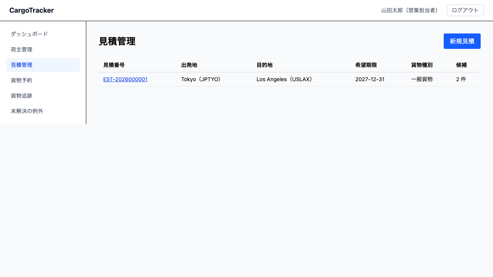
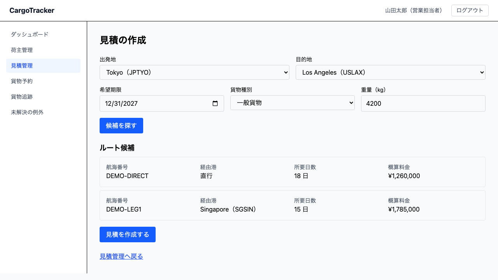

# 13 見積管理

荷主に「**いくらで、何日で運べるか**」を答えるための画面です。**営業担当者**が使います。

本章は [01 業務フロー](01-業務フロー.md#steps) の「見積を作る」にあたります。
予約より**前**の工程です——見積を作っても、貨物の予約は入りません。

> **概算料金は、精算のときと同じ式で出します。** 見積と請求が違う金額になると、
> 荷主との話が最初からやり直しになるためです。ただし**割引前・税別**の金額です
> （[13.3](#candidates)）。

## 画面の開き方

メニューの **[見積管理]** を押します。URL は `/booking/estimates` です。
営業ダッシュボードの **[輸送見積を作る]**・**[見積管理を開く]** からも開けます。

## 13.1 見積の一覧を見る {#list}

| 列 | 説明 |
| :--- | :--- |
| 見積番号 | 押すと見積詳細が開きます。**荷主と読み合わせる番号**です（`EST-2026000001` の形） |
| 出発地・目的地 | 見積を出した区間です |
| 希望期限 | 荷主から聞いた「いつまでに着けたいか」です |
| 貨物種別 | 一般貨物・危険物・冷凍/冷蔵貨物のいずれかです |
| 候補 | 見つかったルート候補の件数です。**0 件のこともあります**（[13.3](#no-candidates)） |

一覧は**新しい順**に並びます。直近に作った見積から見えます。

## 13.2 見積を作る {#create-estimate}

**[新規見積]** を押します。URL は `/booking/estimates/new` です。

### 入力する項目 {#fields}

| 項目 | 説明 |
| :--- | :--- |
| 出発地 | 積み出す港を選びます |
| 目的地 | 荷降しする港を選びます。**出発地と同じ港は選べません** |
| 希望期限 | 荷主が「いつまでに着けたいか」です |
| 貨物種別 | 危険物を選ぶと、**危険物申告の入力**が出ます（[13.4](#hazardous)） |
| 重量（kg） | 貨物の重量です。概算料金に効きます |

### 操作手順 {#create-steps}

1. 5 つの項目を入れます
2. **[候補を探す]** を押します
3. **ルート候補**を確かめます（[13.3](#candidates)）
4. **[見積を作成する]** を押します
5. 見積詳細が開き、**見積番号**が出ます

> **[候補を探す] だけでは保存されません。** 荷主と話しながら条件を変えられるように、
> 探した時点では残しません。**[見積を作成する]** を押して初めて見積番号が発行されます。

## 13.3 ルート候補を読む {#candidates}

候補ごとに 4 つの項目が出ます。

| 項目 | 説明 |
| :--- | :--- |
| 航海番号 | どの便で運ぶかです |
| 経由港 | 積み替える港です。**積み替えが無ければ「直行」**と出ます |
| 所要日数 | 出発から到着までの日数です |
| 概算料金 | **割引前・税別**の金額です。**候補ごとに違います**（下記） |

> **どの候補を実際に使うかで金額が変わります。** 料金は区間ごとの地域区分から
> 決まるため、直行と積み替えありでは金額が変わります（積み替えありのほうが
> 高くなることがあります）。**経路を決めるのは経路設計者**ですので、荷主には
> 「経路によって幅があります」とお伝えください。

> **概算料金は割引前・税別です。** 法人のお客様の契約割引と消費税は、実際に運び終えた
> あとの精算（[12 精算管理](12-精算管理.md)）で反映されます。荷主にお伝えするときは
> 「割引前の目安です」と添えてください。

### 期限に間に合う候補が無いとき {#no-candidates}

**「希望期限に間に合うルートがありません。最短でも N 日超過します。」** と出ます。

> **「候補が無い」と「間に合う候補が無い」は違います。** 前者は、その区間の便が
> 登録されていません（経路設計者にご確認ください）。後者は便はあるが期限に届かない
> ——**何日超過するか**が出ますので、荷主に期限の見直しをご相談ください。

## 13.4 危険物の見積 {#hazardous}

貨物種別で **危険物** を選ぶと、危険物申告の入力が出ます
（危険物クラス・UN 番号・正式品名）。項目は [04 貨物予約](04-貨物予約.md) と同じです。

> **種別を戻すと、入力した危険物申告は消えます。** 画面に出ていない値が黙って
> 送られるのを防ぐためです。

## 13.5 見積から予約する {#to-booking}

見積詳細の **[この見積で予約する]** を押すと、貨物予約の登録画面が開き、
**見積の条件が入った状態**で始まります。

> **打ち直さないでください。** 同じ条件を手で入れ直すと、そこで食い違いが生まれます。

### 見積と違う内容で登録するとき {#mismatch}

条件を変えて **[登録する]** を押すと、**食い違っている項目**が出ます。

> **1 度目は止まります。** 「見積 EST-… と食い違っています。食い違っている項目: 重量。」
> のような案内が出ます。条件が変わること自体は普通に起きます（荷主が数量を増やす、
> 期限が延びる）ので、**荷主に確かめてから、もう一度 [登録する] を押すと登録されます**。
>
> **条件を直してから押した場合も、もう一度確かめ直します**——直したのに古い警告のまま
> 登録される、ということはありません。

## よくある入力の誤り {#errors}

| 出るメッセージ | 原因 | 対処 |
| :--- | :--- | :--- |
| 出発地と目的地を選んでください。 | どちらかが未選択 | 港を選んでください |
| 出発地と目的地が同じです。 | 同じ港を選んだ | 別の港を選んでください |
| 希望期限を入力してください。 | 期限が空 | 荷主に確かめて入れてください |
| この区間のルートが見つかりません。 | その区間の便が登録されていない | 経路設計者に航海スケジュールの登録状況をご確認ください |
| 候補が変わりました。 | 候補を探したあとに航海スケジュールが変わった | **保存した内容を開いて確かめ、荷主に伝えた数字と違っていれば連絡してください** |
| 重量を入力してください。 | 重量が空、または 0 以下 | 実際の重量を入れてください |
| 候補を探せませんでした。しばらくしてからお試しください。 | 経路の検索先（経路サービス）に届かなかった | 少し待って押し直してください。続く場合は運用担当者へご連絡ください |

## いまはまだできないこと {#not-yet}

- **見積に荷主を入れられません。** そのため、(1) 概算料金は**割引前**にしかならず、
  (2) 一覧を荷主で探せず、(3) 予約との突き合わせにも荷主が入りません
  （**別の荷主の見積で予約を作れてしまいます**）。次のリリースで扱います
- **見積の有効期限はありません。** 作った見積はそのまま残ります。期限切れの扱いは
  次のリリース以降です。**希望期限を過ぎた見積も一覧に残ります**ので、
  日付をご確認ください
- **見積を検索できません。** 一覧を目で追うことになります
- **見積を荷主へ送れません。** メールの仕組みがありません。**内容は担当者からお伝えください**
- **見積の金額は割引前・税別です**（[13.3](#candidates)）。契約割引と消費税は精算で反映されます
- **基準運賃 50,000 円は暫定の値です。** 1 区間・1,000kg・一般貨物のときの運賃として
  置いた数字であり、実際の運賃表ではありません

## 関連する章 {#related}

- [04 貨物予約](04-貨物予約.md) — 見積から予約へ進みます
- [05 航海スケジュール](05-航海スケジュール.md) — 候補が出ないときは、便の登録状況を確かめます
- [12 精算管理](12-精算管理.md) — 実際の請求額は、運び終えたあとにここで確定します
