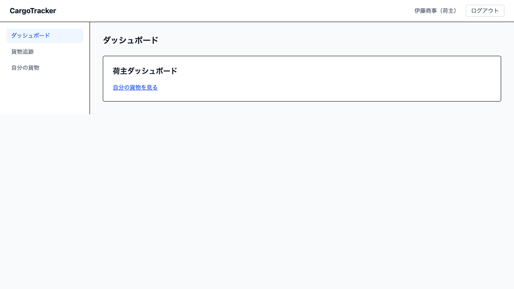
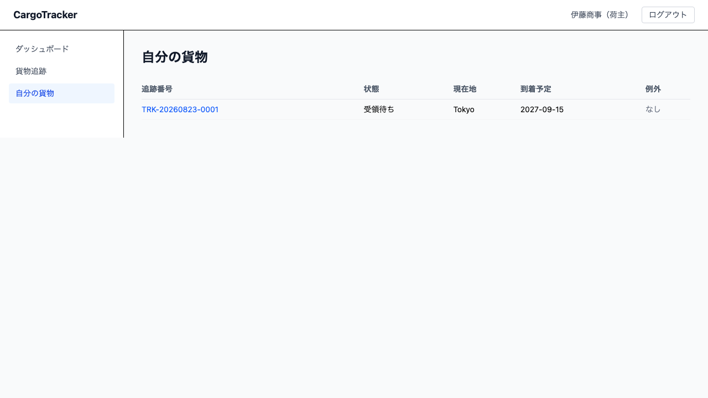
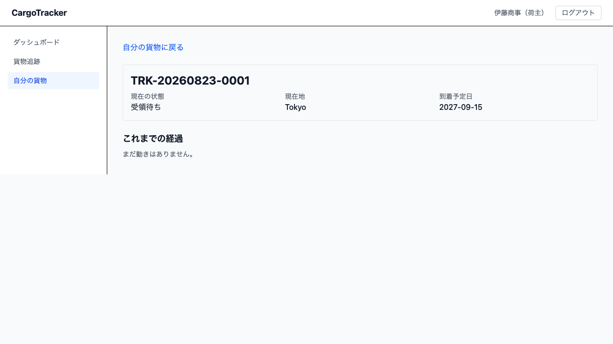
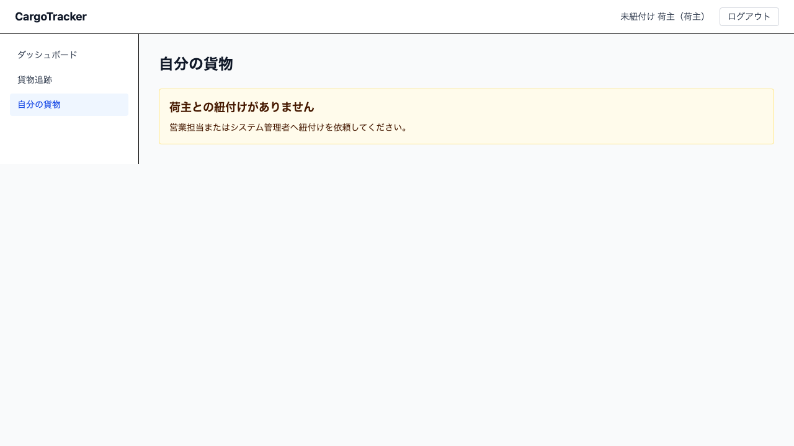
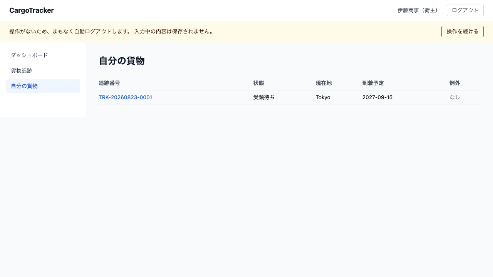

# 14 荷主ポータル

荷主の担当者が、ログインして自社の貨物だけを確認する画面です。追跡番号を 1 件ずつ入力する公開追跡とは別に、紐付けられた荷主の貨物だけが一覧に出ます。

本章は [01 業務フロー](01-業務フロー.md#steps) の**工程 11.5（自社貨物をまとめて確認する）**に対応します。

## 画面の開き方

ログイン後のダッシュボードで「自分の貨物を見る」をクリックします。サイドバーの「自分の貨物」からも開けます（URL: `/shipper/tracking`）。

| 節 | 内容 |
| :--- | :--- |
| [14.1](#shipper-dashboard) | 荷主ダッシュボードから開く |
| [14.2](#tracking-list) | 自分の貨物を一覧で見る |
| [14.3](#tracking-detail) | 貨物の詳細を見る |
| [14.4](#unlinked) | 荷主との紐付けが無いとき |
| [14.5](#timeout) | 無操作タイムアウト |

## 14.1 荷主ダッシュボードから開く {#shipper-dashboard}

### この画面でできること

荷主としてログインし、自分の貨物一覧へ進みます。

### 画面の説明

| # | 項目 | 説明 |
|---|------|------|
| ① | 「自分の貨物を見る」 | 自社貨物の一覧へ移動します |
| ② | 「自分の貨物」 | どの画面からでも一覧へ戻れるメニューです |
| ③ | 利用者名と担当 | ログインしている荷主担当者を確認します |

### 操作手順

1. 荷主の利用者 ID でログインします
2. ダッシュボードの「自分の貨物を見る」をクリックします

## 14.2 自分の貨物を一覧で見る {#tracking-list}

### この画面でできること

自社の貨物だけを一覧で確認します。他社の貨物は、追跡番号を知っていてもこの一覧には出ません。

### 画面の説明

| 列 | 説明 |
| :--- | :--- |
| 追跡番号 | 詳細画面へのリンクです |
| 状態 | 現在の輸送状態です |
| 現在地 | いま貨物がある港です |
| 到着予定 | 到着の見込みです。決まっていないときは「未定」と出ます |
| 例外 | 遅延・破損・紛失などの問題があるかを示します |

### 操作手順

1. サイドバーの「自分の貨物」をクリックします
2. 一覧で状態・現在地・到着予定を確認します
3. 詳しく見たい追跡番号をクリックします

## 14.3 貨物の詳細を見る {#tracking-detail}

### この画面でできること

自社貨物の現在の状態と、これまでの経過を確認します。

### 画面の説明

| 項目 | 説明 |
| :--- | :--- |
| 現在の状態 | 受領待ち・輸送中・引取済みなど、いまの状態です |
| 現在地 | いま貨物がある港です |
| 到着予定日 | 到着の見込みです |
| これまでの経過 | 状態が変わった日時と場所を並べます |

### 操作手順

1. 一覧で追跡番号をクリックします
2. 状態・現在地・到着予定日を確認します
3. 「自分の貨物に戻る」をクリックすると一覧に戻ります

> **他社の追跡番号を直接開いても詳細は表示されません。** 自社の貨物として確認できない番号は「自社の貨物として確認できません」と表示されます。

## 14.4 荷主との紐付けが無いとき {#unlinked}

### この画面でできること

ログインはできるが、利用者 ID と荷主がまだ紐付いていない状態を確認します。

### 画面の説明

| 項目 | 説明 |
| :--- | :--- |
| 荷主との紐付けがありません | 利用者 ID と荷主の設定がまだ終わっていない状態です |
| 問い合わせ案内 | 営業担当またはシステム管理者へ依頼する内容です |

### 操作手順

1. 表示された案内を確認します
2. 営業担当またはシステム管理者へ、利用者 ID と荷主の紐付けを依頼します

> **空の一覧ではありません。** 自社貨物が無い場合と、利用者 ID の設定が無い場合は別の状態です。

## 14.5 無操作タイムアウト {#timeout}

### この画面でできること

共用端末で席を離れたとき、ログイン状態が残り続けないようにします。

### 画面の説明

| 項目 | 説明 |
| :--- | :--- |
| 警告 | 15 分間操作がないと表示されます |
| 「操作を続ける」 | ログイン状態を続けます |
| 自動ログアウト | 20 分間操作がないとログイン画面へ戻ります |

### 操作手順

1. 続けて使う場合は「操作を続ける」をクリックします
2. 作業を終える場合は右上の「ログアウト」をクリックします

> **入力中の内容は保存されません。** 警告が出たら、続けるかログアウトするかをその場で判断してください。

## 14.5 貨物の知らせを受け取る {#notifications}

### この画面でできること

自社の貨物に新しい知らせ（積み込み・出港・遅延・破損など）があると、
**画面の隅にポップアップで出ます**。一覧を開いていなくても気づけます。

### 画面の説明

| 項目 | 説明 |
| :--- | :--- |
| 知らせの文言 | 何が起きたかを 1 行で示します |
| 追跡番号 | どの貨物の知らせかを示します |
| 「この貨物を開く」 | その貨物の詳細へ移動します |
| 「×」 | その知らせだけを閉じます |

### 操作手順

1. ログインしたまま画面を開いておきます（**数分以内に気づけます**）
2. 知らせが出たら、内容を読みます
3. 対応が要るときは「この貨物を開く」から詳細へ移動します
4. 読み終えたら「×」で閉じます

> **一度出た知らせは、もう一度は出ません。** 別のパソコンやスマートフォンで
> 開き直しても出ません——**読んだ位置はシステムが覚えています**。
> 過去の知らせを読み直したいときは、[14.3 貨物の詳細](#tracking-detail)の
> **「お知らせ」欄**を見てください。**いつの知らせかも一緒に出ます。**
>
> **「×」で閉じなくても読んだことになります。** 画面をそのまま閉じても、
> 次のログインで同じ知らせがもう一度出ることはありません。
>
> **荷主以外の担当者には出ません。** 営業担当者や追跡管理者は、それぞれの一覧で
> 状況を把握します。
>
> **紐付けが済むまでは出ません。** 利用者と荷主の紐付け（管理者が行います）が
> 無いあいだ、知らせは記録されるだけで画面には出ません。
> [14.1](#shipper-dashboard) に紐付けの案内が出ている場合は、まず担当者へ問い合わせてください。
