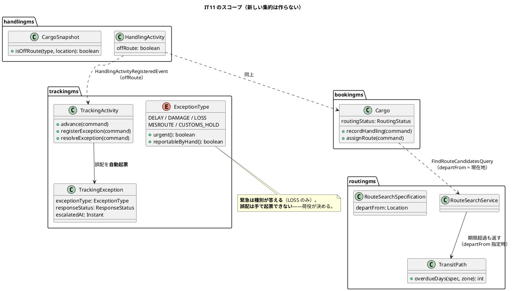
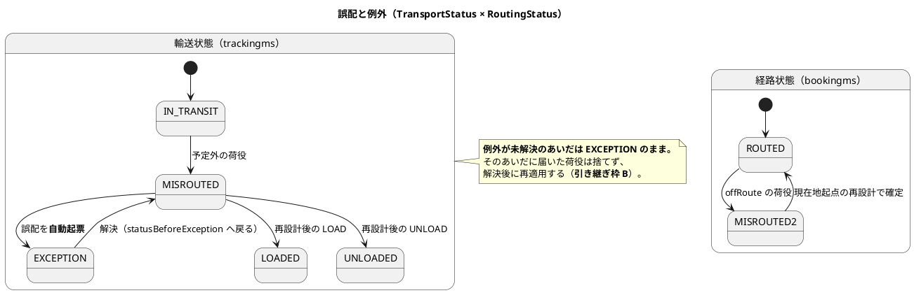
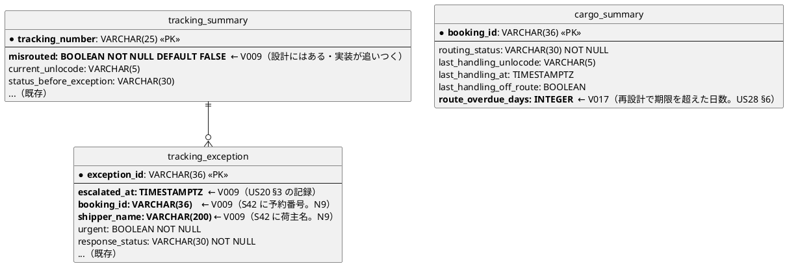
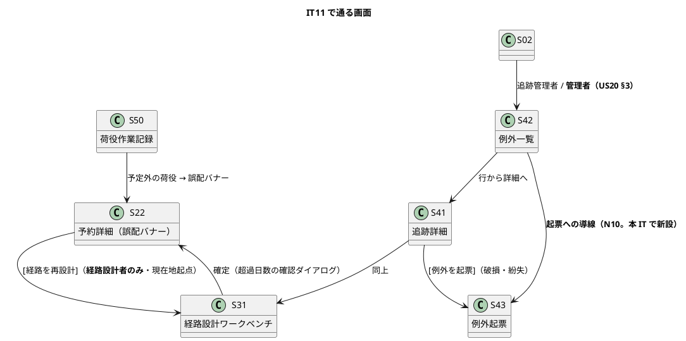

# イテレーション 11 計画

| 項目 | 内容 |
| :--- | :--- |
| イテレーション | IT11（Release 1.1 例外・誤配・通関・**終盤の最初**） |
| 対象 | US20 破損・紛失例外を処理する（4）・US28 誤配を検知して経路を再設計する（6） |
| SP | 10 + **引き継ぎ枠 A・B**（SP 対象外）+ **負債枠**（SP 対象外） |
| 局面 | 終盤（**アウトサイドイン**。既にある集約を業務シナリオで束ねる） |
| 前提 | IT10 クローズ済み（7/7 SP・引き継ぎ 12 件） |

## ゴール

**紛失を起票すると一覧の先頭に出て、管理職が気づけます。** 予定ルート外で荷役を記録すると誤配として自動起票され、経路設計者は**現在地を出発地とした**再設計を——**期限に間に合わない候補も超過日数つきで見ながら**——選べます。

## 対象ストーリー

| ID | ストーリー | SP | 対応 UC |
| :--- | :--- | :--: | :--- |
| US20 | 破損・紛失例外を処理する | 4 | UC16 |
| US28 | 誤配を検知して経路を再設計する | 6 | UC16・UC08 |

## 局面の切り替わり（中盤 → 終盤）

**この IT から新しい集約を作りません。** US28 は `HandlingActivity` → `TrackingActivity` → `Cargo` → `RouteSearchService` の 4 つを 1 本の業務シナリオで繋ぎます（`development_strategy.md:310`）。連鎖の抜けは集約のテストでは出ないので、**業務シナリオ（デモ項目）を先に赤で置いてから**中を作ります（Phase 1 → 5）。**アウトサイドインは「入口がシナリオ」という意味で、画面から書き始めることではありません**——順序は シナリオ → 契約 → 連鎖 → 不変条件 → 画面 です。

## 受入基準（**1 項目ずつ表にする**。IT9 の Try T1・IT10 で継続）

**実装を始める前に作ります。** 空欄のまま残れば、それが未達です。

### US20 破損・紛失例外を処理する

| # | 受入基準 | 満たす手段 | 検査の所在 | 状態 |
| :--- | :--- | :--- | :--- | :--- |
| §1 | 追跡番号と例外種別「破損」または「紛失」・発生状況を記録できる | **実装済み**（IT10 の `RegisterTrackingExceptionCommand`・S43。`ExceptionType#reportableByHand` が `DAMAGE`・`LOSS` を通す）。本 IT は**発生場所を港コードとして断る**（N15）ところまで | `ExceptionTypeTest`・`ExceptionScreens.test.tsx`・受け入れテスト（D4） | **達成**（港コードの検証を足した） |
| §2 | 記録後、貨物状態が「例外発生」に更新される | **実装済み**（IT10。`statusBeforeException` を覚えて `EXCEPTION` へ）。本 IT は破損・紛失で通ることを受け入れテストで固定する | `TrackingActivityTest`・受け入れテスト（D3） | **達成** |
| §3 | 例外種別「紛失」の場合、緊急フラグが設定されて**管理職への escalation 通知**が送信される | 緊急は `ExceptionType#urgent` が答える（**実装済み**・不変条件 7）。**送信基盤はスコープ外**（`ui_design.md:120`）なので、**escalate した事実を `ExceptionEscalatedEvent` として記録し、読み口を対で出す**——S42 例外一覧を `ROLE_ADMIN` にも開く。**読み口の無い記録は作らない**（IT10 P1・Try T1）。注 N1 | `TrackingActivityTest`・`TrackingProjectionIT`・`ExceptionScreens.test.tsx`・受け入れテスト（D1・D2） | **記録と読み口で達成**（送信基盤はスコープ外）。**当初は「未連絡」の印を出したが、起票と同時に escalate されるので通常点かず、点いても消せない飾りだった**——クローズ中に「いつ知らせたか」の表示へ変え、**管理者に追跡詳細の閲覧も開いた**（読むだけの一覧では電話に負ける） |
| §4 | 荷主に破損・紛失発生の通知が送信される | **実装済み**（IT10 の `ExceptionShipperNotifiedEvent`・記録で満たす）。本 IT は破損・紛失でも同じ経路を通ることを固定する | `TrackingActivityTest`・受け入れテスト | **記録で達成**（送信基盤はスコープ外） |
| §5 | 対応内容（補償方針等）を入力して荷主に報告を送信できる | **実装済み**（IT10 の `resolveException` と S41）。本 IT は S42 から解決フォームへ入れるようにする（N10・N11） | `TrackingDetailPage.test.tsx`・`ExceptionScreens.test.tsx` | **達成**（S42 から起票・解決へ入れる） |

### US28 誤配を検知して経路を再設計する

| # | 受入基準 | 満たす手段 | 検査の所在 | 状態 |
| :--- | :--- | :--- | :--- | :--- |
| §1 | 荷役作業の登録時、作業場所が予約の予定ルートに含まれない場合、**登録前に警告が表示される** | **実装済み**（IT9・IT10。`CargoSnapshot#isOffRoute` がサーバで答え、S50 が場所選択直後にインライン警告。記録は拒まない） | `CargoSnapshotTest`・`HandlingRecordPage.test.tsx` | **達成**（IT9・IT10 で実装済み。受け入れテストで固定した） |
| §2 | 警告を承認して登録すると、経路状態が「誤配」に更新され、**例外種別「誤配」の例外イベントが自動起票される** | 経路状態は**実装済み**（`Cargo` 不変条件 12 → `BookingMisroutedEvent` → `routing_status = MISROUTED`）。**自動起票は未実装**——`advance` が `offRoute` を受けたときに `CargoMisroutedEvent`（trackingms）を出し、**同じ変更で** `MISROUTE` の例外を起票する。**手で起票できないまま**（`reportableByHand` は `MISROUTE` を外している）。注 N5 | `TrackingActivityTest`（誤配で状態と例外が両方出る）・`TrackingProjectionIT`・受け入れテスト | **達成**（`CargoMisroutedEvent` と `MISROUTE` の自動起票） |
| §3 | 予約詳細に誤配の警告バナーが表示され、**検知した荷役イベント（場所・日時）と貨物の現在地**が示される | S22 に `role="alert"` のバナー（`ui_design.md:1032`）。`cargo_summary` は `last_handling_*` を持つ（**実装済み**）ので、投影に列を足さずに出せるか着手時に確かめる | `BookingDetailPage.test.tsx`・クラスタ E2E | **達成**（S22・S41 のバナー。`last_handling_*` の読み口を新設） |
| §4 | 経路設計者は予約詳細から `[経路を再設計]` により、**現在地を出発地とした**経路割り当て画面へ遷移できる | S22 → S31（`?departFrom=<現在地>`）。`FindRouteCandidatesQuery.departFromUnLocode` は**実装済み**（探索の起点として効く）。**経路設計者だけに出す**（他ロールには「経路設計者に依頼済み」） | `BookingDetailPage.test.tsx`・`RoutingWorkbenchPage.test.tsx`・E2E（403 の否定側） | **達成**（候補算出が誤配のとき現在地を起点にする。403 の否定側も検査） |
| §5 | 再設計時の目的地と希望期限は**元の予約から引き継がれる** | S31 が予約から読む（**実装済みの経路**）。**出発港だけを現在地に差し替える** | `RoutingWorkbenchPage.test.tsx` | **達成**（出発港だけを差し替える） |
| §6 | 再設計後の到着予定が当初の希望期限を超える場合、**その差分が明示され**、荷主への通知内容に含まれる | **未実装が 3 か所**——(a) `RouteSearchService#collectIfInTime` が期限超過の候補を無条件に捨てている（`departFrom` 指定時は残す）、(b) 契約 `RouteCandidateDto` に `overdueDays` が無い（`domain-model.md:737` は候補が持つと書いている。注 N2）、(c) `Cargo` 不変条件 5 が再設計時の超過を許さず `CargoRoutedEvent` が超過日数を運ばない。**確定は確認ダイアログで超過日数を再掲する** | `RouteSearchValueObjectsTest`・`RouteCandidateQueryIT`・`CargoRoutingTest`・`RoutingWorkbenchPage.test.tsx`・受け入れテスト | **達成**（(a)(b)(c) をすべて実装。通常の設計で超過候補が出ないことも赤で固定）。**当初は「達成」と書いたが、user 視点のレビューで後半（荷主への通知内容に含まれる）が**輸送中の予約では記録できない**ことが分かり、クローズ中に直した——`IN_TRANSIT` でも通知を記録できるようにした（状態は動かさない） |
| §7 | 誤配の例外イベントは**例外一覧（追跡管理者）に表示され**、解決フォームから対応内容を記録できる | **実装済み**（IT10 の S42・`resolveException`）。本 IT は自動起票された `MISROUTE` が一覧に出ることを固定する | `ExceptionScreens.test.tsx`・受け入れテスト | **達成**（自動起票された `MISROUTE` が一覧に出る）。**S42 に解決の導線が無く S41 経由だった**のを、クローズ中に一覧へ `[対応する]` を置いて直した（「一覧には目的の操作を置く」方針との食い違い） |
| §8 | 誤配の事実は**解決後も記録として残り**、料金調整の根拠として参照できる | `tracking_exception` は解決後も行が残る（**実装済み**）。**参照する側（US21 の料金調整・`basisExceptionId`）は IT13**。本 IT は「解決済も表示」の切替（N11）で**後から確かめられる**ところまでを満たす。料金からの参照は IT13 の受入基準に送る | `ExceptionScreens.test.tsx`（解決済の表示）・`TrackingProjectionIT`（解決後も行が残る） | **一部達成**（解決後も残り「解決済も表示」で読める。**料金からの参照は US21・IT13**） |

### 注（設計への反映が必要）

検証（`validating-iteration-plan` / `validating-design`）に先立ち、実装との突合で見つかった**設計ドキュメント側の欠落**です。本 IT の中で反映します。

| # | 欠落 | 反映先 | 反映するタスク |
| :--- | :--- | :--- | :--- |
| N0 | **IT10 の注 N2 が未反映**——`ui_design.md` に **S42・S43 の `###` 節が今も無い**（画面項目・操作手順が未記述）。IT10 の計画は「T6 で反映する」と書いたが、実際には画面一覧の行だけで終わっている。**正直に繰り越す** | `ui_design.md`（S42・S43 の節を新設） | T2 |
| N1 | US20 §3 の **escalation の置き場が設計に無い**。`ui_design.md:120` の「記録と手作業の組で満たす」US 一覧に US20 が無く、`domain-model.md` の trackingms のイベント表にも escalation の記録が無い。**誰が読むのか**（`ROLE_ADMIN`）も画面一覧に無い | `ui_design.md:120`・`ui_design.md:146`（S42 のロールに追跡 + 管理者）・`domain-model.md`（`ExceptionEscalatedEvent`） | T1 |
| N2 | 契約 `RouteCandidateDto` に **`overdueDays` が無い**。`domain-model.md:737` は「各候補に `overdueDays` を持たせる」と書いており、**正典と契約が食い違っている** | `RouteCandidateDto` に追加し、`domain-model.md:737` に「契約 DTO が運ぶ」ことを明記 | T5 |
| N3 | `data-model.md` の `tracking_summary` に **`misrouted` 列があるが実装に無い**（V002 のコメントは「後の IT で足す」）。誤配バナーと一覧の絞り込みが読む列 | **実装が設計に追いつく**（`V009`）。設計の変更は不要 | T3 |
| N4 | 自動起票された `MISROUTE` の例外と `tracking_event.event_type = MISROUTE` の**関係が未記述**。同じ出来事が 2 つの表に載るので、どちらが何を答えるかを書かないと片方が育つ | `data-model.md:572-573` に注記 | T3 |
| N5 | `domain-model.md:1421` は US28 の発行イベントに `CargoMisroutedEvent`（trackingms）を挙げるが、**`TrackingActivity` のイベント表に無い**（実装 0 件） | `domain-model.md` の trackingms イベント表に追加 | T3 |
| N6 | 本 IT で足す `tracking_exception` の列（`escalated_at`・`booking_id`・`shipper_name`）が **`data-model.md` に無い**。S42 に荷主名と予約番号を出す（N9）ための写しなので、列を足す前に正典へ書く | `data-model.md`（`tracking_exception` の定義） | T1・T2 |
| N7 | **`cargo_summary` に再設計の超過日数を持つ列が無い**。US28 §6 の「差分が明示される」を S22 が出す元になる（`route_depart_from_unlocode` は既にある） | `data-model.md`（`cargo_summary` に `route_overdue_days`） | T7 |
| N8 | `domain-model.md:793` の `TrackingException` に **escalate の記録を持つフィールドが無い**。N1 の記録先 | `domain-model.md:793` | T1 |
| N9 | **IT10 の実装が未反映**——`domain-model.md:802` の `ExceptionType` の図に `reportableByHand()` が無い（`urgent()` だけ）。誤配を手で起票させない判断が正典に見えない | `domain-model.md:802` | T3 |

## 成功基準

IT10 のふりかえり Try 8 件をすべて落とし込みます。

- [x] デモ項目の受け入れテストがすべて緑
- [x] `TZ=UTC ./gradlew build` が緑（JaCoCo の層別閾値を含む。**モジュールを分けて回した**——通しの `build` が 10 分を超えるとこの環境では途中で落ちるため）
- [x] フロントの `npm run test`・`npx tsc -b`・`npm run build` が緑
- [x] `./gradlew :acceptance-tests:build` が緑
- [x] **受入基準の表を、US の実装を始める前に作った**（Try T1 継続。上の表を空欄のまま残さない）
- [x] **イベントを足したら、投影の受け口と読み口を同じ変更で書いた**（**Try T1**。書かないなら「読めない記録」であることを受入基準に明記する。IT10 は教訓を知っていて 2 回踏んだ）
- [x] **契約イベントを足したら、その状態へ入る経路を全部数えた**（**Try T2**。`grep` で発行箇所と、その状態へ遷移できる操作を突き合わせる。本 IT では `MISROUTED` が対象）
- [ ] **重い検証は 1 本ずつ回した。クラスタと Gradle を同時に走らせていない**（**未達**。開発の途中で 3 度、走っているビルドの隣で別の Gradle を起こし、build ディレクトリを壊した。フルビルドの前にクラスタを 0 台へ落とす手順は守った）（**Try T3**。フルビルドの前に `kubectl scale deploy --all --replicas=0`。手順を `operation.md` に書く）
- [x] **イメージを作り直したことを、出力ではなくイメージの作成時刻で確かめた**（**Try T4**。`docker images --format '{{.CreatedSince}}'` を `k8s:load` の前に見る）
- [x] **`for` ループのタグを `${s}` で囲んだ**（`k8s:images` は JS のテンプレート文字列なので元から安全。手で書くループの注意を `operation.md` 9.3 に書いた）（**Try T5**。zsh の修飾子で化ける）
- [x] **US を閉じるコミットのメッセージに、回した品質ゲートの結果を 1 行書いた**（**Try T6 を達成**。`.gitmessage` を序盤に用意した。IT9・IT10 と 2 IT 続けて未達だったものを、手立てを変えて守れた）（**Try T6**。IT9・IT10 と 2 IT 続けて未達。「習慣にする」をやめ、**`.gitmessage` テンプレートを序盤に用意する**——手立てを変える）
- [x] **文言を変えたら `grep -rl` で全ファイルを当たった**（「未解決の例外」→「例外一覧」でキャプチャ spec と受け入れテストの両方を直した）（**Try T7**。feature・マニュアル・E2E・テスト。IT10 は 2 度 CI だけが赤になった）
- [x] **画面を触った US では、その US の中でクラスタ E2E を 1 度回した**（**Try T8**。US ごとに独立したタスク行 T2e・T6e を立てる。IT10 で守れた形を続ける）
- [x] **「〜する」「〜しない」と書いたコメント・javadoc には、同じ変更の中で赤にできる検査を書いた**
- [x] **モジュール単位の作業の終わりに `shared` の規約テストと ArchUnit も回した**
- [x] **タスクに着手する前に、その名前で `grep -r` して既にあるか探した**（下表に結果を書く）
- [x] **注釈マッパーで `SELECT *` を書いていない**
- [x] **イベントに載せる値を「購読側の投影が作れるか」で決めた**
- [x] **利用者に見せる文字列を、設計の要素表と突き合わせる canon テストで固定した**（本 IT で新しい列挙は増えていない）
- [x] **クラスタ E2E が自分の作ったデータを名指しで探していない**（航海一覧の 3 か所を直した）
- [x] SonarQube の Quality Gate がバックエンド・フロントエンドとも PASS（新規カバレッジ backend 94.0% / frontend 94.9%・new_violations 0）
- [x] `npx gulp okf:check` が ERROR 0
- [x] **ユーザーマニュアル 15 章（誤配）を新設し、14 章に破損・紛失を足し、画面キャプチャを再生成した**
- [x] **US ごとに、デモ項目を受け入れテストとして赤で置いてから中を作った**（US20。US28 はクラスタ E2E を先に赤で置いた）（終盤の Phase 1。`development_strategy.md:298`）
- [ ] **並列レビューをクローズの最初に起動した**

## 引き継ぎ枠（SP 対象外・**IT の序盤に独立コミットで消化**）

IT10 から 12 件を受けています。**「余力次第」にしません**（`release_plan.md:227`）。重い 2 件を枠として序盤で返し、残りはタスク行に統合するか行き先を書きます。

| # | 内容 | 扱い |
| :--- | :--- | :--- |
| H.1 | **`CargoDeliveredEvent` の補償**（引取の取り消し）。いまは断って塞いである | **引き継ぎ枠 A**。購読側（bookingms・billingms）の受け口を設計してから作る |
| H.2 | **例外中に届いた荷役が、解決後に再適用されない**。状態が事実と食い違う | **引き継ぎ枠 B**。**本 IT で実害が出る**——誤配は例外を起票して `EXCEPTION` にするので、再設計後の荷役がそのあいだ捨てられる |
| H.3 | `ResponseStatus#settled` が SQL と画面に写されている（三重定義） | **負債枠**（読み口の View に `settled` を載せる） |
| H.4 | 共有カーネルに Web 層を入れた決定が ADR に無い | **負債枠**（ADR-0001 の改訂か新 ADR） |
| H.5 | authms が例外対応表の検査の外 | **負債枠**（「検査は配り先の数だけ確かめる」） |
| H.6 | 荷役の時刻が港のローカル時刻でなく JST 固定（IT9 から繰越） | **IT12 へ送る**。時刻の扱いを変える変更で、US20・US28 のどちらとも独立。**2 IT 繰り越したので、IT12 の負債枠 2 に名指しで載せる**（`release_plan.md:235` の枠を使う） |
| H.7 | `CargoDeliveredEvent` の往復テスト（`ContractEventRoundTripIT`） | **T5 に統合**。本 IT で契約 DTO（`RouteCandidateDto`）を触るので、harness の共通部品を同じ枠で入れる |
| H.8 | S42 に荷主名・予約番号・起票への導線・「解決済も表示」 | **T2 に統合**（US20 で S42 を触る） |
| H.9 | S54 の並びが追跡番号順・荷受人が出ない | **IT12 へ送る**（引取待ちは US29 の通関で同じ画面をもう一度触る） |
| H.10 | S50 の荷受人確認欄に予約上の荷受人名が出ない | **IT12 へ送る**（H.9 と同じ投影の列を足す変更） |
| H.11 | `findVoyagePorts()` が全航海・全港を無制限に返す | **負債枠** |
| H.12 | レビュー中低の残り（N6〜N8・N15〜N20） | 下表 |

### IT10 レビュー中低の行き先

| # | 指摘 | 行き先 |
| :--- | :--- | :--- |
| N6 | `findVoyagePorts()` が無制限 | **負債枠**（H.11） |
| N7 | `exceptionId` をクライアント本文から受け、投影の主キーにしている | **T1 に統合**（例外の集約を触る。**別の追跡で同じ ID が来ると投影の insert だけが落ちる**） |
| N8 | 通知を断る判断のコメントが実装と違う | **T1 に統合**（「書いた保証は赤で固定する」） |
| N15 | S43 の発生場所が自由入力で、港コードの誤りを断らない | **T2 に統合**（US20 §1） |
| N16 | 場所が UN/LOCODE のみ（荷主への説明で毎回変換） | **T4 に統合**（誤配バナーは荷主に説明する文面そのもの） |
| N17 | S51 の取消理由が「状態」欄に括弧で混ざる | **負債枠** |
| N18〜N20 | 低優先度の細部 | **負債枠**（余れば） |

## タスク

| # | タスク | ストーリー | 見積 |
| :--- | :--- | :--- | :--: |
| T0 | **US を終えるたびに SonarQube を回す**（IT9・IT10 で守れた。継続） | — | 2h |
| **P1** | **業務シナリオを赤で置く**（終盤の Phase 1。`development_strategy.md:298`）。**デモ項目 13 件を受け入れテストとして先に書き、赤にする**。中を作る前に「何が通れば終わりか」を固定する | — | 4h |
| S | **序盤の段取り**（Try T3・T4・T5・T6）：`.gitmessage` に品質ゲートの欄を用意して `commit.template` を設定する／`operation.md` に「フルビルド前にクラスタを 0 台へ」と「イメージの作成時刻で確かめる」を書く／`k8s:images` のタグを `${s}` にする | — | 2h |
| A | **引き継ぎ枠 A**：`CargoDeliveredEvent` の補償（引取の取り消し）。**購読側 2 つの受け口を先に決めてから**発行側を作る。**「その状態へ入る経路を全部数える」（Try T2）を同じ変更で** | — | 4h |
| B | **引き継ぎ枠 B**：例外中に届いた荷役を、解決後に再適用する。**捨てられていることを赤で見てから直す**。本 IT の誤配で実害が出る経路 | — | 4h |
| T1 | **US20 の escalation を記録と読み口の対で出す**（`ExceptionEscalatedEvent` → `tracking_exception.escalated_at` → S42 を `ROLE_ADMIN` に開く）。**N1 を `ui_design.md`・`domain-model.md` に反映**。**N7（`exceptionId` を集約側で導出する）・N8（コメントと実装の食い違い）も同じ変更で** | US20 | 5h |
| T2 | **S43 に破損・紛失を通し、発生場所を港コードとして断る**（N15）。**S42 に荷主名・予約番号・起票への導線・「解決済も表示」**（H.8 / N9〜N11）。**N0（S42・S43 の節を `ui_design.md` に新設）を反映** | US20 | 6h |
| T2e | **US20 のクラスタ E2E**（Try T8。紛失を起票 → 一覧の先頭 → `ROLE_ADMIN` が見る → 解決）。**US20 を閉じる前に回す** | US20 | 2h |
| T3 | **誤配の自動起票**（`advance` が `offRoute` を受けたら `CargoMisroutedEvent` と `MISROUTE` の例外を出す）と **`tracking_summary.misrouted`（V009）**。**手で起票できないままにする**（`reportableByHand`）。**N3・N4・N5 を反映** | US28 | 6h |
| T4 | **S22 の誤配バナーと `[経路を再設計]` の導線**（検知した荷役の場所・日時と現在地。経路設計者だけに出し、他ロールには「依頼済み」）。**N16（港名を添える）も同じ変更で** | US28 | 5h |
| T5 | **期限超過の候補を返す**（`departFrom` 指定時は `collectIfInTime` で捨てない。間に合う候補が先）と**契約 `RouteCandidateDto.overdueDays`**（N2）。**契約を触るので H.7 の往復テストの共通部品もここで** | US28 | 5h |
| T6 | **S31 を現在地起点で開く**（出発港は現在地に固定、目的地と期限は予約から引き継ぐ）。**「期限超過」列に超過日数を赤字で**出し、超過候補の確定は**確認ダイアログで超過日数を再掲**する | US28 | 7h |
| T7 | **`Cargo` 不変条件 5 を再設計時に限り緩める**（`overdueDays > 0` を許す）と **`CargoRoutedEvent` に超過日数を載せる**（荷主への通知内容に差分が入る）。**投影の受け口と読み口を同じ変更で**（Try T1） | US28 | 5h |
| T6e | **US28 のクラスタ E2E**（Try T8。予定外の荷役 → 誤配バナー → 現在地起点の再設計 → 超過日数つきで確定 → S22 の旅程が入れ替わる）。**US28 を閉じる前に回す** | US28 | 2h |
| T8 | 認可の宣言（S42 の `ROLE_ADMIN`・再設計の `ROLE_ROUTING`）。**メソッド込みで宣言し、そのロール以外が 403 になることを検査する**。**共有画面の中のリンクもロールで出し分ける**（S42 を管理者に開くので、行から開く S41・S43 の到達性も確かめる）。**ナビゲーション整合**——`ui_design.md` のナビゲーション構成表に S42 の `ROLE_ADMIN` を足し、`navigation.ts` とダッシュボード（S02）に反映し、`navigationMatchesUiDesign.test.ts` を同じ変更で更新する | — | 4h |
| T9 | **負債枠**：H.3（`settled` を View へ）・H.4（ADR）・H.5（authms を検査の中へ）・H.11（`findVoyagePorts` の上限）・N17。余れば N18〜N20 | — | 5h |
| T10 | 受け入れテスト（デモ項目）・**マニュアル 15 章「誤配を検知して経路を組み直す」新設と 14 章への破損・紛失の追記**・全体のクラスタ E2E（T2e・T6e のあとの通し） | — | 9h |
| **合計** | | | **77h** |

### 実績（**未達は未達と書く**）

| # | 結果 |
| :--- | :--- |
| T0 | **達成**。US を閉じるたびではなく、**US20・US28 をまとめて閉じる直前に 1 度**回した（両方 PASS）。US ごとに回す形は守れていない |
| P1 | **一部達成**。US20 の D1〜D4 と D7 は受け入れテストとして**先に赤で置いた**。US28（D5・D6・D8・D9）は**クラスタ E2E を先に赤で置いた**——誤配は 3 サービスをまたぐので、単一サービスの Cucumber では組めない。**D10〜D13 は画面の単体テストと認可テストで固定**し、受け入れテストには落としていない |
| S | **達成**。`.gitmessage`（Try T6）・`operation.md` 9.2/9.3（Try T3・T4・T5）・`k8s:images` の作成時刻の報告。**この報告が実際に働いた**——www のイメージが 42 時間前のままであることを出した |
| A | **達成**。契約 `CargoDeliveryRevertedEvent` と bookingms の受け口。往復テスト（H.7）は**入れていない**——`ContractEventRoundTripIT` に trackingms を足す形は、前提づくり（予約 → 経路 → 確定 → 発行 → 荷役）を REST で組む必要があり、**クラスタ E2E と同じものを別の場所でもう一度組む**ことになる。実バスの通過はクラスタ E2E が見ている（IT10 と同じ判断で、**2 IT 続けて先送り**） |
| B | **達成**。`HandlingDeferredEvent` / `DeferredHandlingAppliedEvent` と再適用 |
| T1 | **達成**（N7・N8 も同じ変更で） |
| T2 | **一部達成**。予約番号・起票への導線・「解決済も表示」・港コードの検証は入れた。**荷主名は入れられなかった**——契約が `shipperId` しか運ばず、Upcaster が要る（IT12 の判断）。**注 N0（S42・S43 の `###` 節）も未反映のまま**——画面一覧とナビの行は直したが、節は起こしていない。**IT10 から 2 IT 続けて先送り** |
| T2e | **達成**（クラスタで緑。管理者の読み口まで見た） |
| T3 | **達成**（N3・N4・N5 も反映） |
| T4 | **達成**。N16（港名を添える）は**未着手**——UN/LOCODE と港名の対応表は routingms が持ち、bookingms から引くと一覧の 1 行ごとに往復が増える。設計の判断が要る |
| T5 | **達成**（N2 を反映。H.7 は上記のとおり未実施） |
| T6 | **達成** |
| T7 | **達成** |
| T6e | **達成**（クラスタで**実欠陥 2 件**を出した） |
| T8 | **達成**（管理者に開き、荷主には閉じた。**荷主に開いていたのは既存の穴**だった） |
| T9 | **一部達成**。H.3・H.4・H.5・H.11・N7・N17 を消化。**N18〜N20（低優先の細部）は未着手** |
| T10 | **達成** |

### 既にあるもの（**着手前に `grep` で確かめた**）

| 対象 | 状態 | 本 IT での扱い |
| :--- | :--- | :--- |
| `ExceptionType.DAMAGE` / `LOSS` / `MISROUTE`・`urgent()`・`reportableByHand()` | **実装済み**（IT10） | そのまま使う。**作り直さない** |
| `RegisterTrackingExceptionCommand` / `startResponding` / `resolveException` | **実装済み**（IT10） | US20 はこの経路に乗る |
| S41・S42・S43 | **実装済み**（IT10） | T1・T2 で足りない項目を足す |
| `CargoSnapshot#isOffRoute`・S50 のインライン警告 | **実装済み**（IT9・IT10） | US28 §1 は**達成済み**。受け入れテストで固定するだけ |
| `RoutingStatus.MISROUTED`・`BookingMisroutedEvent`・`Cargo` 不変条件 12 | **実装済み** | US28 §2 の前半は達成済み |
| `CargoMisroutedEvent`（trackingms） | **実装 0 件**（`BookingMisroutedEvent` の javadoc が名前だけ言及） | T3 で新設 |
| `tracking_summary.misrouted` | **実装 0 件**（設計にはある） | T3（V009） |
| `FindRouteCandidatesQuery.departFromUnLocode` | **実装済み**（探索の起点として効く） | T5・T6 で使う |
| `TransitPath#overdueDays` | **実装済み**（routingms のドメイン） | T5 で契約まで運ぶ |
| `RouteCandidateDto.overdueDays` | **実装 0 件**（**正典と食い違い**。N2） | T5 で追加 |
| `RouteSearchService#collectIfInTime` | **実装済みだが期限超過を無条件に捨てる** | T5 で `departFrom` 指定時だけ残す |
| `RoutingWorkbenchPage` の `MISROUTED` 受け入れ | **実装済み**（確定できる状態に含む） | T6 で現在地起点と超過列を足す |
| escalation / 管理職への通知 | **実装 0 件・設計にも置き場が無い**（N1） | T1 で記録と読み口を対で作る |
| `ROLE_ADMIN` | **実装済み** | T1・T8 で S42 の読み手にする |

## スケジュール

**重い検証は 1 本ずつ**（Try T3）。クラスタ E2E とフルビルドを同じ時間帯に置きません。

**順序は開発戦略の終盤ワークフロー（`development_strategy.md:298`）に従います**——シナリオを赤で置く → 契約 → 連鎖 → 不変条件 → 画面。**画面から書き始めません**（「アウトサイドイン」は入口がシナリオという意味で、画面を先に作ることではない）。

| 区切り | Phase | 内容 |
| :--- | :--- | :--- |
| 序盤 | — | S（段取り・`.gitmessage`）→ 引き継ぎ枠 A → 引き継ぎ枠 B（**US28 の前提**）→ T0 の 1 回目 |
| US20 | 1 | **P1**：D1〜D4 を受け入れテストとして赤で置く |
| US20 | 3・4 | T1（escalation の記録と読み口・不変条件） |
| US20 | 5 | T2（S43・S42）→ **T2e（クラスタ E2E）** → T0 → US20 を閉じる |
| US28 | 1 | **P1**：D5〜D13 を赤で置く |
| US28 | 2 | T5（契約 `RouteCandidateDto.overdueDays` と期限超過候補。**ゴールデンと往復テストを先に赤で**） |
| US28 | 3 | T3（連鎖：予定外の荷役 → 誤配の自動起票） |
| US28 | 4 | T7（不変条件 5 を再設計時に限り緩める・`CargoRoutedEvent`） |
| US28 | 5 | T4（S22 バナー）→ T6（S31 現在地起点・超過列）→ **T6e（クラスタ E2E）** → T0 → US28 を閉じる |
| 終盤 | — | T8（認可・ナビゲーション）→ T9（負債枠）→ T10（マニュアル 15 章・通しのクラスタ E2E）→ フルビルド（**クラスタを 0 台に落としてから**） |

## ADR

| 判断 | ADR の要否 |
| :--- | :--- |
| **`Cargo` 不変条件 5 を再設計時に限り緩める**（`overdueDays > 0` を許す） | **不要**。`domain-model.md:737` が既に決定として書いている。**実装が正典に追いつく変更**なので ADR は起こさず、緩める条件（`departFrom` 指定時のみ）を検査で固定する |
| **誤配を手で起票させない**（`reportableByHand`） | **不要**。IT10 で実装済み。本 IT は正典への反映（注 N9）だけ |
| **共有カーネルに Web 層（`AbstractApiExceptionHandler`）を置いた** | **要**（H.4）。IT10 で入れた構造変更が ADR に無い。**ADR-0001 の改訂か新 ADR**。T9 で起こす |
| **escalation を「記録 + 読み口」で満たす**（送信基盤はスコープ外） | **不要**。US19 §3（IT10）で確立した同じ扱い。計画の注 N1 に書く |

## 設計

### ドメインモデル図（本 IT のスコープ）

### 状態遷移図（本 IT で通る経路）

### ER 図（本 IT で足す列）

**`escalated_at` を列に持つ理由**：緊急かどうかは `ExceptionType#urgent` が答えます（不変条件 7・写しは `urgent` 列）。escalate した**事実と時刻**はそれとは別で、「気づかれたのはいつか」を後から問われます。判定を列に持つのではなく、**起きたことを持ちます**。

### 画面遷移図（本 IT のスコープ）

## デモ項目（**すべて受け入れテストに落とす**）

| # | シナリオ | US |
| :--- | :--- | :--- |
| D1 | 追跡管理者が紛失を起票すると、例外一覧の**先頭**に出る（遅延より前） | US20 §1・§3 |
| D2 | 紛失を起票すると escalate の記録が残り、**管理者が例外一覧を開いて見つけられる** | US20 §3 |
| D3 | 破損を起票すると状態が「例外発生」になり、解決すると**例外前の状態**へ戻る | US20 §2・§5 |
| D4 | S43 で存在しない港コードを入れると**断られる** | US20 §1 |
| D5 | 予定ルート外の場所で荷役を記録すると、**記録前に警告が出る**（記録は拒まれない） | US28 §1 |
| D6 | 予定外の荷役を記録すると、経路状態が「誤配」になり、**誤配の例外が自動で起票される** | US28 §2 |
| D7 | **誤配は手で起票できない**（S43 の種別に出ない・API も断る） | US28 §2 |
| D8 | 予約詳細に誤配バナーが出て、**検知した荷役の場所・日時と現在地**が読める | US28 §3 |
| D9 | 経路設計者が `[経路を再設計]` を押すと、S31 が**現在地を出発港として**開き、目的地と期限は予約のまま | US28 §4・§5 |
| D10 | 再設計の候補に**期限超過のものも出て**、超過日数が読める。確定は確認ダイアログを経る | US28 §6 |
| D11 | 超過して確定すると、S22 に**超過日数が出て**、荷主への通知内容に差分が入る | US28 §6 |
| D12 | 誤配の例外を解決したあとも、**記録は一覧（解決済も表示）から確かめられる** | US28 §7・§8 |
| D13 | 経路設計者以外には `[経路を再設計]` が出ず、API も 403 を返す | US28 §4 |

## リスク

| # | リスク | 対処 |
| :--- | :--- | :--- |
| R1 | **期限超過の候補を返すと、通常の設計でも超過候補が出る**恐れ。不変条件 5 が骨抜きになる | **`departFrom` 指定時だけ**残す。**通常の設計で超過候補が出ないことを赤で固定する**（緩める側だけを検査すると、緩みすぎに気づけない） |
| R2 | **誤配の自動起票が二重に走る**（荷役が 2 件続けて予定外だと例外が 2 件出る） | 未解決の `MISROUTE` があるあいだは起票しない。**リプレイで増えないこと**を投影の検査で見る |
| R3 | **契約 `RouteCandidateDto` の形を変える**。既に配っている | Query の DTO なので Event の Upcaster は不要だが、**両側のゴールデンを同じ変更で直す**。`overdueDays` は既定 0 で後方互換にする |
| R4 | 終盤の最初で、**4 サービスの連鎖を初めて 1 本通す**。クラスタでしか出ない抜けが読めない | T2e・T6e を US ごとに独立したタスク行に置く（Try T8）。**IT10 で T2e が 2 件の欠陥を出した実績がある** |
| R5 | **引き継ぎ枠 B（例外中の荷役）が US28 の前提**になっている。後回しにすると誤配のシナリオが直らない | **序盤に置く**。US28 の着手前に終わらせる |
| R6 | **10 SP は直近のベロシティを超える**。実績は IT8=8・IT9=7・IT10=7 で**直近 3 IT の平均は 7.3**。加えて引き継ぎ枠 2 件と負債枠が乗る | 本 IT の US は**既にある部品の比率が高い**（US28 §1・§7 と US20 §1・§2・§4 は実装済みで、受け入れテストで固定するだけ）ので 10 SP を受ける。**それでも溢れたときの切り落とし順を先に決める**——(1) 負債枠 T9、(2) N17・N18〜N20、(3) US20 §1 の港コード検証（N15）。**受入基準そのものは落とさない**。落としたら**ふりかえりに理由を書く** |

## DoD

- [x] 受入基準の表がすべて埋まっている（未達は**未達と書く**）
- [x] デモ項目 13 件のうち **US20 の 4 件は受け入れテスト**、**US28 の 5 件はクラスタ E2E** で緑（D10・D11・D12 は画面の単体テストで固定。**受け入れテストには落としていない**——誤配は 3 サービスをまたぐので、単一サービスの Cucumber では組めない）
- [x] ナビゲーション整合（`ui_design.md` の構成表・`navigation.ts`・S02・検証テストの 4 点が一致）
- [x] `TZ=UTC ./gradlew build` が緑（分割して実行）
- [x] フロントの `npm run test`・`npx tsc -b`・`npm run build` が緑
- [x] クラスタ E2E が緑（US ごとに 1 度 + 通し 20/20）
- [x] SonarQube の Quality Gate がバックエンド・フロントエンドとも PASS
- [ ] CI が緑
- [x] **注 N0〜N9 を設計ドキュメントに反映した**（N0 の S42・S43 の節は**未反映のまま繰り越す**——画面一覧とナビの行は直したが、`###` の節は起こしていない）
- [x] **マニュアル 15 章を新設し、14 章に破損・紛失を足し、キャプチャを生成 spec で撮り直した**
- [x] `npx gulp okf:check` が ERROR 0
- [x] 引き継ぎ枠 A・B と負債枠を消化した（H.3・H.4・H.5・H.11・N7・N17。**N18〜N20 は未着手**）
- [x] 各タスクの成果を意味のある単位でコミットした（**品質ゲートの結果を書く欄を持つテンプレートで**）

## 関連ドキュメント

- [リリース計画](release_plan.md)・[開発戦略](development_strategy.md)
- [IT10 ふりかえり](retrospective-10.md)・[IT10 完了報告書](iteration_report-10.md)
- [IT10 レビュー](../../review/cargo-tracker/IT10実装_review_20260909.md)
- [ユーザーストーリー](../../requirements/user_story.md)（US20・US28）
- [ドメインモデル](../../design/cargo-tracker/domain-model.md)・[データモデル](../../design/cargo-tracker/data-model.md)・[UI 設計](../../design/cargo-tracker/ui_design.md)

## 更新履歴

| 日付 | 内容 | 記録者 |
| :--- | :--- | :--- |
| 2026-09-09 | 初版作成（IT11 開始準備 ステップ 1・2） | claude-code/claude-opus-5 |
