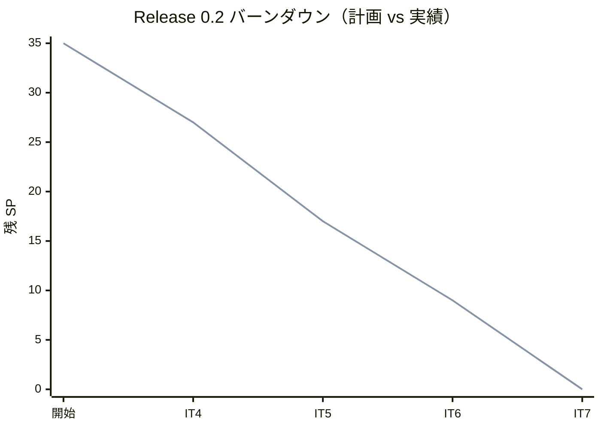
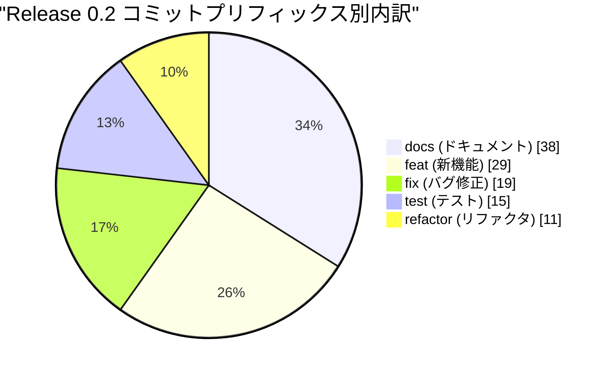
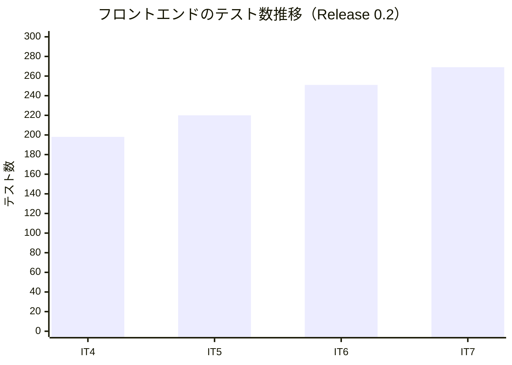
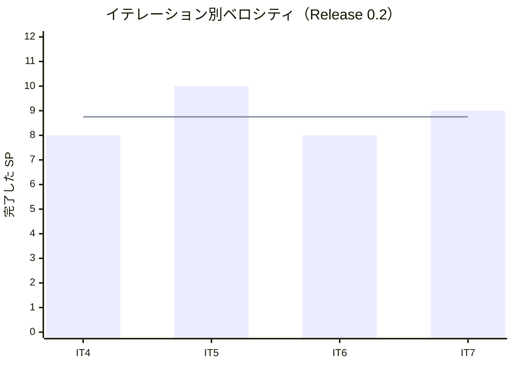

# リリース完了報告書 0.2 - Cargo Tracker（CQRS / Event Sourcing 版）

**報告書作成日**: 2026-09-11

## 概要

Cargo Tracker v0.2「経路設計と予約確定」のリリース完了報告書です。全 4 イテレーション（IT4〜IT7）、35 ストーリーポイントを 100% 達成し、**貨物予約から経路設計・荷主への通知・予約確定・追跡番号発行までが 1 本につながりました**。

**本リリースで、サービスをまたぐ連鎖が初めて通りました。** IT7 で契約コマンドの 1 本目（`IssueTrackingNumberCommand`）と `BookingReactionHandler` の 1 本目が入り、bookingms → trackingms の連鎖が実クラスタで動いています。

> **本報告書のデータ源について。** この worktree には java/take-8 用のリリースタグと CHANGELOG のエントリがありません。数値は `release_plan.md`（Single Source of Truth）・各 `iteration_report-N.md`・git ログの実測値だけで作成しており、**推測値は使っていません**。イテレーション境界は各 IT の「計画を作成する」コミットで区切っています（IT4 開始 `dd8f28022`、Release 1.0 の開始 `bdaecdf4a` の直前まで）。

---

## プロジェクトサマリー

| 項目 | 値 |
| :--- | :--- |
| **リリース期間** | 2026-09-05 〜 2026-09-07（3 日） |
| **総イテレーション数** | 4（IT4〜IT7） |
| **総ストーリーポイント** | 35 SP |
| **総コミット数** | 112 |
| **ユーザーストーリー数** | 9（US25・US07・US32・US08・US09・US10・US11・US12・US13・US14） |
| **局面** | 中盤（インサイドアウト） |

---

## 計画と実績の差異分析

### イテレーション別達成状況

| イテレーション | ストーリー | 計画 SP | 実績 SP | 達成率 | 差異 |
| :--- | :--- | :--: | :--: | :--: | :--: |
| IT4 | US25(3)・US07(3)・US32(2) | 8 | 8 | 100% | 0 |
| IT5 | US08(6)・US09(4) | 10 | 10 | 100% | 0 |
| IT6 | US10(3)・US11(2)・US12(3) | 8 | 8 | 100% | 0 |
| IT7 | US13(3)・US14(6) | 9 | 9 | 100% | 0 |
| **合計** | | **35** | **35** | **100%** | **0** |

### リリースバーンダウン

**分析結果**: 計画と実績が完全に一致しました。4 イテレーション連続で 100%（プロジェクト通算では IT1 から 7 回連続）。ベロシティは IT4 終了時点で 9 → 8.75 SP に再調整しましたが、IT5 の 10 SP・IT7 の 9 SP で戻しています。

---

## 計画日程 vs 実績日数の差異分析

| IT | 計画日数 | 実績 | 備考 |
| :--- | :--: | :--- | :--- |
| IT4 | 14 日 | 2026-09-05（1 日） | 返済枠 6 件をすべて返済 |
| IT5 | 14 日 | 2026-09-05（1 日） | 引き継ぎ枠 6 件を繰越ゼロで返済 |
| IT6 | 14 日 | 2026-09-06（1 日） | 引き継ぎ枠 3 件を繰越ゼロで返済 |
| IT7 | 14 日 | 2026-09-06〜09-07（2 日） | 引き継ぎ枠 3 件を繰越ゼロで返済 |
| **合計** | **56 日** | **3 日**（暦日） | **短縮率 94.6%** |

**この短縮率は人間のチームとの比較ではありません。** 計画の 14 日／IT は人間のチームを前提に置いた値で、実績は AI エージェントが連続で作業した暦日です。**意味があるのは「計画 SP に対する達成率」と「繰越ゼロの連続回数」のほうです。**

### 差異分析

1. **4 IT すべてで引き継ぎ枠・返済枠を繰越ゼロで消化しました。** 「余力次第の返済枠」にしない方針（リリース計画）が効いています。
2. **IT5 で 10 SP を達成しました。** 直前の再調整値（8.75）を上回りましたが、経路候補算出（US08）が routingms の既存部品を Query Bus 越しに使う形だったため収まりました。
3. **未達の受入基準が 7 件あります**（IT5 で 3・IT6 で 2・IT7 で 2）。いずれも前提のストーリーが後続 IT にあるもの（費用は US21・IT13、キャンセルは US30・IT15、送信基盤はスコープ外）で、**未達として正直に記録しています**。

---

## コミットログ分析

| プリフィックス | 件数 | 割合 | 説明 |
| :--- | :--: | :--: | :--- |
| docs | 38 | 33.9% | ドキュメント更新 |
| feat | 29 | 25.9% | 新機能追加 |
| fix | 19 | 17.0% | バグ修正 |
| test | 15 | 13.4% | テスト追加 |
| refactor | 11 | 9.8% | リファクタリング |
| **合計** | **112** | **100%** | |

### 分析

1. **docs が最多（33.9%）です。** 正典（ドメインモデル・データモデル・UI 設計）を実装と同じ変更で直す運用の結果で、このリリースでは着手前の検証が「そもそも動かない計画」を複数止めています（IT7 の `BookingSaga` は Axon 5 に API が無く、`BookingReactionHandler` に直しました）。
2. **fix が 17.0% あります。** 多くはクローズのレビュー指摘（IT6 は高 5 件・中 9 件）と SonarQube の指摘で、**クローズ前に直し切っています**。
3. **test が 13.4%。** クラスタ E2E の追加が中心で、IT4 の 10 本から IT7 の 15 本まで増えました。

---

## 品質メトリクス

| IT | バックエンド | フロントエンド | 受け入れ | クラスタ E2E | SonarQube |
| :--- | :--- | :--- | :--- | :--- | :--- |
| IT4 | `TZ=UTC build` 緑 | 198 テスト緑 | 39 シナリオ緑 | 10/10 緑（2 回） | 両者 PASSED |
| IT5 | `TZ=UTC build` 緑 | 220 テスト緑（行 97.3% / 分岐 85.8%） | 緑 | 11/11 緑（2 回） | PASS |
| IT6 | 528 件緑 | 251 件緑 | 8 feature | 14/14 緑（2 回） | 両者 PASS（カバレッジ 93.4%・重複 1.6%・Bug 0） |
| IT7 | `TZ=UTC build` 緑 | 269 件緑（行 96.98% / 分岐 86.19%） | 10 features 緑 | 15/15 緑 | 両者 PASSED |

### ベロシティ

| 項目 | 値 |
| :--- | :--- |
| 平均ベロシティ | 8.75 SP / イテレーション |
| 最大ベロシティ | 10 SP（IT5） |
| 最小ベロシティ | 8 SP（IT4・IT6） |

---

## 主要な成果物

### 実装した主要機能

1. **航海スケジュールの更新と検索**（IT4 / US25・US07）

     - 出港済みを除いた一覧、端点・出発期間・対応貨物種別での絞り込み
     - **「毎朝どう使うか」から確かめた結果**、受入基準に無くても出港済みを既定で外す判断に至りました

2. **仮受付の予約修正**（IT4 / US32）

     - US06 の受入基準 4 から切り出した 2 SP。「何を変えたか」を残します

3. **経路候補の算出と確定**（IT5 / US08・US09）

     - bookingms → routingms を **Axon Query Bus 越しに**呼ぶ形（BC 独立性を保つ ACL）
     - 期限内の候補だけを提示し、選んで確定する

4. **条件調整と荷主への通知**（IT6 / US10・US11・US12）

     - 条件を変えて再算出し、通知すると「経路通知済」になる

5. **予約確定と追跡番号発行**（IT7 / US13・US14）

     - **契約コマンドの 1 本目**（`IssueTrackingNumberCommand`）と **`BookingReactionHandler` の 1 本目**
     - 通知していない予約は確定できない。確定 → 追跡番号発行 → trackingms に追跡が作られる

### 技術的成果

| 成果 | 内容 |
| :--- | :--- |
| **サービスをまたぐ連鎖** | IT7 で bookingms → trackingms が実クラスタで通りました。**Saga ではなく Reaction Handler** で調整します（Axon 5 に Saga の API が無いため。ADR-0001 決定 6） |
| **共有カーネルの整理** | `QueryDispatcher` を共有カーネルへ移し、BC 間のクエリ呼び出しを 1 か所に集約 |
| **業務タイムゾーン** | 表示だけでなく入力（S33）と期間の絞り込みも業務タイムゾーンに揃えました（IT6 負債 H.3） |
| **クラスタ E2E** | 10 本 → 15 本。**モックが通す欠陥を捕まえる**検査として定着 |

---

## 総評

Release 0.2 は全 35 SP を 4 イテレーションで 100% 達成し、**貨物予約から予約確定・追跡番号発行までが実クラスタで 1 本につながりました**。

### ハイライト

- **4 IT すべてで計画 SP を 100% 達成**（プロジェクト通算 7 回連続）
- **引き継ぎ枠・返済枠を 4 IT 連続で繰越ゼロ**——「余力次第にしない」方針が機能しています
- **サービスをまたぐ連鎖の 1 本目**が実クラスタで動きました
- **着手前の検証が「動かない計画」を止めました**——`BookingSaga` は Axon 5 に API が無く、計画のまま着手すればコンパイルできませんでした

### 残された課題

未達の受入基準 7 件は、いずれも前提のストーリーが後続 IT にあるものです。**未達を未達と記録しており**、Release 1.0 以降で順に解消しています（費用は IT13 の US21 で、キャンセルは IT15 の US30 で）。

---

**リリース完了** — 2026-09-07
