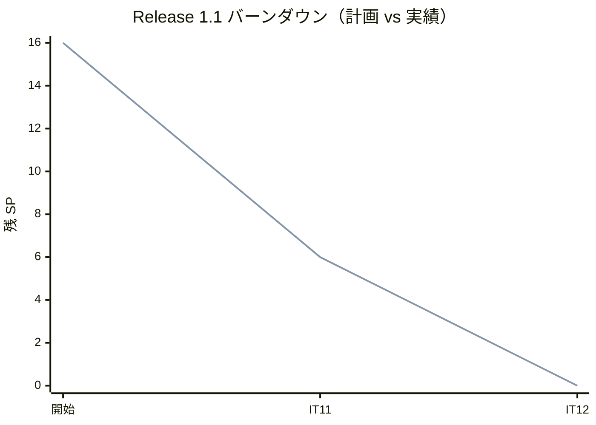
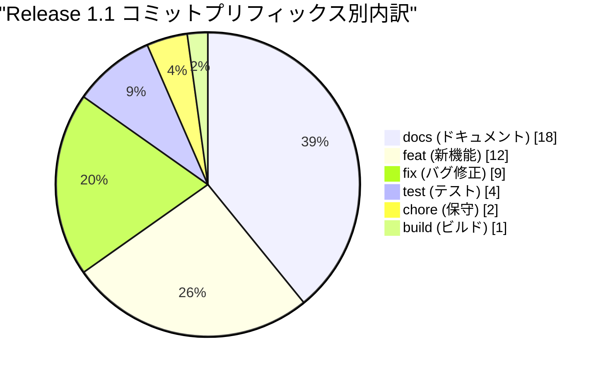
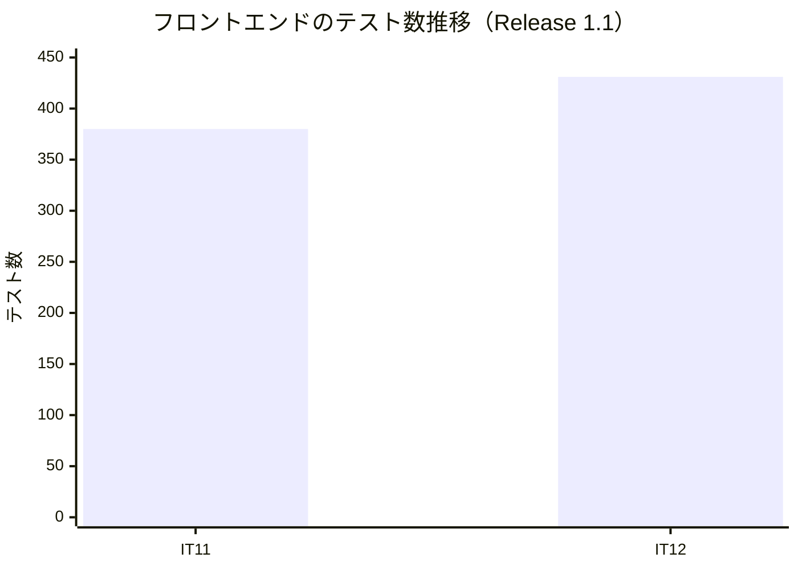
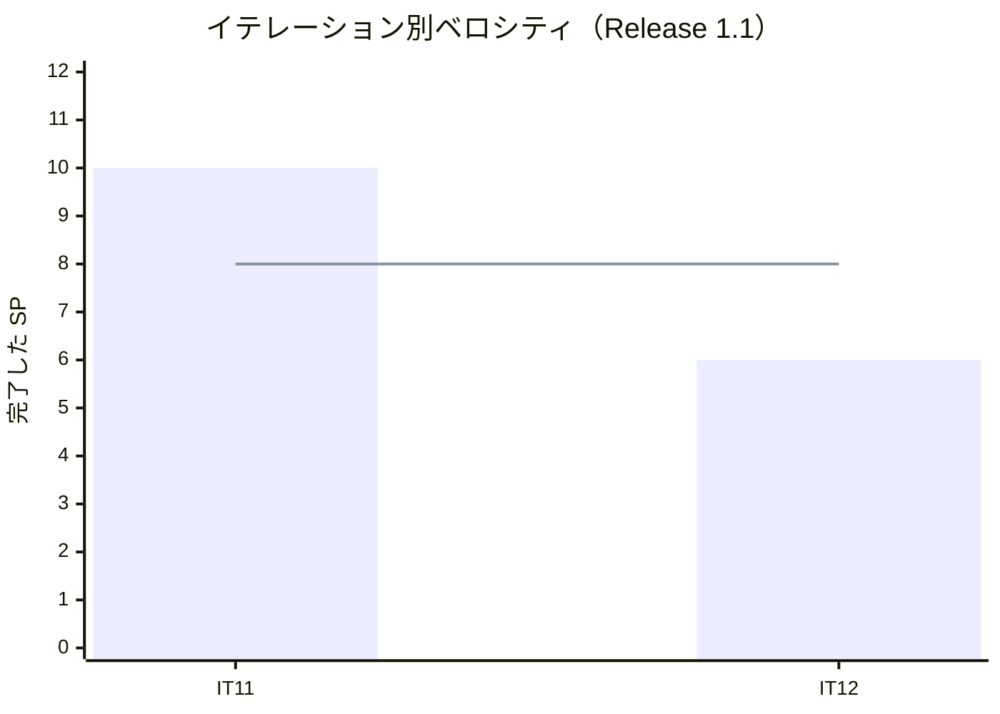

# リリース完了報告書 1.1 - Cargo Tracker（CQRS / Event Sourcing 版）

**報告書作成日**: 2026-09-11

## 概要

Cargo Tracker v1.1「例外・誤配・通関」のリリース完了報告書です。全 2 イテレーション（IT11〜IT12）、16 ストーリーポイントを 100% 達成し、**輸送中に起きる異常（破損・紛失・誤配・通関の留置）を業務として扱えるようになりました**。

**本リリースから局面が終盤（アウトサイドイン）に移りました。** 既にある集約を業務シナリオ起点で束ねる進め方に変わり、IT11 は新しい集約を作らずに荷役 → 誤配検知 → 追跡の例外 → 予約の経路状態 → 現在地起点の再設計を 1 本で通しました。IT12 は例外的に新設集約（`CustomsDeclaration`）を作りましたが、これは税関という別の当事者との手続きで、荷役の一種ではないためです。

> **本報告書のデータ源について。** この worktree には java/take-8 用のリリースタグと CHANGELOG のエントリがありません。数値は `release_plan.md`（Single Source of Truth）・各 `iteration_report-N.md`・git ログの実測値だけで作成しており、**推測値は使っていません**。イテレーション境界は各 IT の「計画を作成する」コミットで区切っています（IT11 開始 `7f27cb51b`、IT13 開始 `c3aa2bf03` の直前まで）。

---

## プロジェクトサマリー

| 項目 | 値 |
| :--- | :--- |
| **リリース期間** | 2026-09-09 〜 2026-09-11（3 日） |
| **総イテレーション数** | 2（IT11〜IT12） |
| **総ストーリーポイント** | 16 SP |
| **総コミット数** | 46 |
| **ユーザーストーリー数** | 3（US20・US28・US29） |
| **局面** | 終盤（アウトサイドイン）— **移行の最初のリリース** |

---

## 計画と実績の差異分析

### イテレーション別達成状況

| イテレーション | ストーリー | 計画 SP | 実績 SP | 達成率 | 差異 |
| :--- | :--- | :--: | :--: | :--: | :--: |
| IT11 | US20(4)・US28(6) | 10 | 10 | 100% | 0 |
| IT12 | US29(6) | 6 | 6 | 100% | 0 |
| **合計** | | **16** | **16** | **100%** | **0** |

### リリースバーンダウン

**分析結果**: 2 イテレーションとも計画どおり（プロジェクト通算 12 回連続 100%）。IT11 の 10 SP は直近 3 IT の平均 7.3 を超えましたが、**既存部品の比率が高く収まりました**——終盤のアプローチ（既存集約の結合）が効いた結果です。

---

## 計画日程 vs 実績日数の差異分析

| IT | 計画日数 | 実績 | 備考 |
| :--- | :--: | :--- | :--- |
| IT11 | 14 日 | 2026-09-09（1 日） | 引き継ぎ枠 2 件 + 負債枠 6 件を返済（7 回連続で繰越ゼロ） |
| IT12 | 14 日 | 2026-09-09〜09-10（2 日） | 引き継ぎ枠 2 件 + 負債枠 2 件を消化（8 回連続）。**枠 A は一部未達** |
| **合計** | **28 日** | **2 日**（暦日） | **短縮率 92.9%** |

**この短縮率は人間のチームとの比較ではありません**（Release 0.2・1.0 と同じ注記）。

### 差異分析

1. **IT12 の引き継ぎ枠 A（死信キュー）が一部未達で終わりました。** 退避と処理継続は入ったものの処理の列が全体で 1 本のままで、「この版に手立てが無い」と記録しました。**この結論は誤りで、IT13 で `@SequencingPolicy` により解決しています**（記録は消さず ADR-0014 に但し書きで改めました）。
2. **正典を 3 か所直しました**（IT12）——履歴は Event Store から読めない・`held_business_days` は使わない・共有カーネルには置かない。**実装が正典を追い越した箇所は正典を直す**運用です。
3. **CI が時限式のフィクスチャを出しました**（IT12）。固定日付を現実の時刻が追い越し、13 件が赤に。IT13 の負債枠で `AcceptanceFixtureTime` と規約テストに落としました。

---

## コミットログ分析

| プリフィックス | 件数 | 割合 | 説明 |
| :--- | :--: | :--: | :--- |
| docs | 18 | 39.1% | ドキュメント更新 |
| feat | 12 | 26.1% | 新機能追加 |
| fix | 9 | 19.6% | バグ修正 |
| test | 4 | 8.7% | テスト追加 |
| chore | 2 | 4.3% | 保守作業 |
| build | 1 | 2.2% | ビルド設定 |
| **合計** | **46** | **100%** | |

### 分析

1. **コミット総数が 46 と、Release 1.0 の半分です。** イテレーション数が 2 と少ないことに加え、**終盤は既存部品の結合が中心**で新規実装が減ったためです。
2. **docs が再び最多（39.1%）**。正典の訂正 3 件・ADR-0014 の起票・マニュアル 2 章の追加が含まれます。
3. **fix 9 件は 1.0 の 24 件から大きく減りました。** レビューの高指摘も IT11 で 9 件・IT12 で 3 件と減っています。**終盤に入って既存の型が固まった効果**と読めます。

---

## 品質メトリクス

| IT | バックエンド | フロントエンド | 受け入れ | クラスタ E2E | SonarQube |
| :--- | :--- | :--- | :--- | :--- | :--- |
| IT11 | 全モジュール `build` 緑（`TZ=UTC` でも緑） | 380 件緑 | 13 件緑 | **20/20 緑**（通し） | 両者 PASS（新規カバレッジ 94.0% / 95.0%・重複 0.1% / 0.0%） |
| IT12 | 分割フルビルド 5 群すべて緑（`TZ=UTC`） | 431 件緑 | handling 19/19 ほか全緑 | **21/21 緑**（通し） | 両者 PASS（Bug 0・脆弱性 0・重複 0.2% / 0.0%・新規カバレッジ 94.0% / 95.0%） |

### 静的解析

| 指標 | 結果 |
| :--- | :--- |
| SonarQube Quality Gate | **両プロジェクトとも PASS**（IT11・IT12 とも） |
| Bug / Vulnerability | **0 / 0** |
| 重複率 | 0.1〜0.2%（backend）/ 0.0%（frontend）。基準 3% 未満 |
| 新規コードのカバレッジ | 94.0%（backend）/ 95.0%（frontend）。基準 80% 以上 |
| CI | **success** |

### ベロシティ

| 項目 | 値 |
| :--- | :--- |
| 平均ベロシティ | 8.0 SP / イテレーション |
| 最大ベロシティ | 10 SP（IT11） |
| 最小ベロシティ | 6 SP（IT12） |

---

## 主要な成果物

### 実装した主要機能

1. **破損・紛失の例外**（IT11 / US20）

     - 紛失が一覧の先頭に出る。**気づく手段を、対処できる人へ繋ぐ**

2. **誤配の検知と再設計**（IT11 / US28）

     - 予定ルート外の荷役で誤配になり、**現在地起点で**再設計すると（期限超過でも）候補が出る
     - 新しい集約を作らず、荷役 → 誤配検知 → 追跡の例外 → 予約の経路状態 → 再設計を 1 本で通しました

3. **通関申告**（IT12 / US29）

     - **`CustomsDeclaration` の新設**（終盤で初めての新設集約）
     - 通関が留置のあいだ引取が断られる。通関済にすると引取できる
     - 留置 3 営業日超が督促対象として出る

### 技術的成果

| 成果 | 内容 |
| :--- | :--- |
| **終盤への移行** | 既存集約を業務シナリオで束ねるアプローチに移行。IT11 は新設ゼロで 10 SP を達成しました |
| **毒イベントの退避**（[ADR-0014](../../adr/cargo-tracker/0014-poison-events-are-parked-not-blocking.md)） | 処理を止めずに退避する形。**列の分割は当時「手立てが無い」と記録しましたが、IT13 で誤りと判明**しました |
| **3 サービス連鎖** | handlingms → trackingms → 引取のガードが通りました |
| **正典の訂正 3 件** | 実装が正典を追い越した箇所を正典側で直しました |

---

## 総評

Release 1.1 は全 16 SP を 2 イテレーションで 100% 達成し、**異常系（破損・紛失・誤配・通関の留置）が業務として扱えるようになりました**。

### ハイライト

- **2 IT とも計画 SP を 100% 達成**（プロジェクト通算 12 回連続）
- **繰越ゼロを 8 回連続**で継続
- **終盤への移行が成功**——IT11 は新設集約ゼロで 10 SP、既存部品の結合で異常系を通しました
- **fix コミットが 24 件（1.0）→ 9 件に減少**。既存の型が固まった効果

### 正直に記録すること

- **IT12 の引き継ぎ枠 A（死信キューの列分割）は一部未達です。** さらに当時の「この版に手立てが無い」という結論は**誤りでした**——IT13 で `@SequencingPolicy` により解決しています。記録は消さず、ADR-0014 に但し書きで改めました。**誤っていた記録を消すと、次に同じことを疑う人が経緯を追えません。**
- **CI が時限式のフィクスチャを出しました。** 固定日付を現実の時刻が追い越して 13 件が赤に。IT13 で規約テストに落として再発を止めています。

---

**リリース完了** — 2026-09-10
