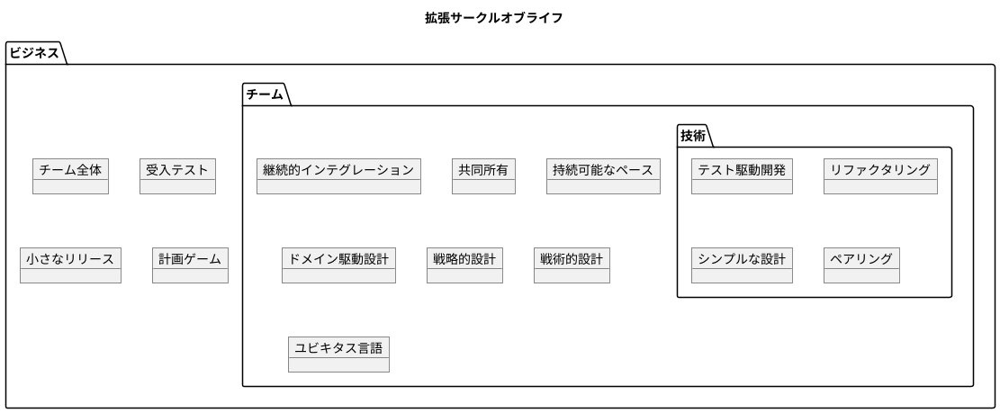
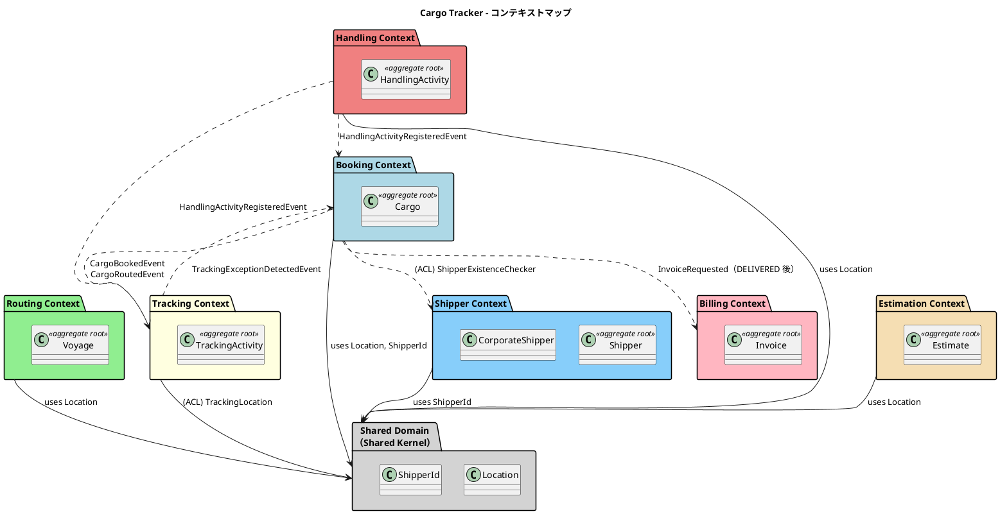

# 第 1 章：XP と DDD をなぜ一緒に語るのか

| 項目 | 内容 |
| :--- | :--- |
| 対象 | シリーズ全体 |
| 実績 | 20 イテレーション／8 日／US01〜US36／テスト 1,578 件（＋ E2E 21 件） |
| 主題 | ドメインモデルは、どのプラクティスによって育つのか |

## DDD には「動かす力」が無い

境界づけられたコンテキスト、集約、値オブジェクト、腐敗防止層 — DDD が与えるのは**設計の語彙**です。どこに何を置くべきかは教えてくれますが、**いつ、何をきっかけにそれを変えるか**は教えてくれません。

これは欠陥ではなく分業です。モデルを動かす力は別のところから来ます。本シリーズでは、それが XP のプラクティスだったと主張します。

`docs/reference/よいソフトウェアとは.md` は、XP のサークルオブライフに DDD を重ねた図を持っています。

> 転記元：`docs/reference/よいソフトウェアとは.md`「拡張サークルオブライフ」

**戦略的設計・戦術的設計・ユビキタス言語がチームプラクティスの層に置かれている**のがこの図の主張です。DDD は技術プラクティスの上位にあるのではなく、**継続的インテグレーションや共同所有と同じ層で、日々の作業として実践されるもの**として配置されています。

本シリーズはこの配置が実際に成り立ったかを、20 イテレーションの記録で検証します。

**ただし、この図のすべてを検証できたわけではありません。** 体制は開発者 1 名であり、ペアリング・共同所有・オンサイト顧客・持続可能なペースは実質的に検証されていません。どのプラクティスに根拠があり、どれに無いかは [シリーズ概要](index.md#verified-practices) にまとめています。**検証できていないものを、できたかのように書かないためです。**

## 何を作ったか

題材は国際貨物輸送管理システムです。荷主が貨物の輸送を予約し、経路が割り当てられ、荷役が記録され、到着後に請求される — その一連の業務を扱います。

> 転記元：`design/domain-model.md`「Cargo Tracker - コンテキストマップ」（Security サブドメイン・外部 ACL ポートの注記・`billing ..> shared`・`estimation ..> booking`（将来）の 4 要素を省略）

**この図は最終形です。** 第 1 イテレーションの時点でこの形はありませんでした。Handling は Tracking の一部として始まり、ADR-010 で独立した Bounded Context（以下 **BC**）に昇格しています。Estimation が実質的に立ち上がったのは 20 回のうち 18 回目です。

**図が最初から正しかったのではなく、20 回の反復の結果としてこの形に落ち着いた** — これが主題 M1 です。

## 言葉はどこから来たか

本シリーズを通じて使う座標軸を先に示します。業務の言葉は 6 つの層を通って実装に降りています。

| 層 | 一次資料 | そこで定まる語彙 | 対応する XP プラクティス |
| :--- | :--- | :--- | :--- |
| 戦略 | `strategy/inception-deck.md`、`business_architecture.md` | 扱う対象と扱わない対象の名前 | メタファー、計画ゲーム |
| 要件 | `requirements/requirements_definition.md`（RDRA 2.0） | アクター・業務フロー・情報の名前 | オンサイト顧客、チーム全体 |
| ユースケース | `requirements/system_usecase.md`（UC01〜UC22） | 業務手順の名前 | 受入テスト |
| ストーリー | `requirements/user_story.md`（US01〜） | 実装単位の名前 | ストーリー、小さなリリース |
| ドメインモデル | `design/domain-model.md` の対訳表 | コード上の識別子 | シンプルな設計 |
| 実装 | `apps/` の型名・`package-info.java`・Javadoc | 実際に動いている語彙 | 共同所有、継続的インテグレーション |

**この 6 層は上から下へ一方向に流れたわけではありません。** 実装で見つかった業務上の区別が上流の語彙を書き換えた箇所と、上流の語彙が実装に降りきらずに取り残された箇所の両方があります。

本シリーズでは、あるドキュメントが**正典**であるという言い方をします。これは参照元プロジェクトの用語で、**同じ事実が複数箇所に書かれているとき、どれを正しいものとするかを 1 つに決めたもの**を指します。たとえばテーブルの所有 BC は `data-model.md` の表が正典であり、検査はその表を読みます（第 10 章）。**正典を決めないと、書き写しが増えてどれも古くなります。**

本シリーズでは「受入テストを書いた」ではなく「UC13『荷役作業を記録する』を受入テストの単位にした」と書きます。**プラクティス名を単独で使うと、業務から切り離された作業手順の紹介になる**ためです。

## 三つの成果物、三つの進め方

同じ 20 イテレーションのなかで、成果物ごとに進め方が違いました。この非対称が本シリーズの見どころです。

| 成果物 | 進め方 | 根拠 |
| :--- | :--- | :--- |
| **ドメインモデル** | イテレーションで育てた | BC は一度に立たず、Handling は後から独立、Estimation は IT18 |
| **データモデル** | 最初に全体を作り、以後は差分 | `V1__init.sql` で 20 テーブルを一度に作成。以降 40 本のうち新規テーブルは 5 本だけで、残りは `ALTER TABLE` 109 文 |
| **ユーザーマニュアル** | 実装に追随させた | 「実装済みの画面のみを扱う」と制約し、画面キャプチャ 62 枚を Playwright で自動再生成 |

**スキーマだけ先に全体を作ったのは、DDD の教条ではなく XP の判断です。** 集約はテストがあれば作り直せますが、テーブルはデータが載った瞬間に移行コストが跳ね上がります。**変更コストが高い箇所を先に決める** — その一点でデータモデルだけ扱いが違いました。

詳しくは第 3 章（データモデルの初期構築）、第 5 章（マニュアルを受け入れの道具として使う）で扱います。

## 設計と実装を突き合わせる

設計ドキュメントは書いた時点の意図であり、実装がそのとおりである保証はありません。参照元はこの隙間を、コードから設計ドキュメントを生成する JIG で埋めています。

> `docs/design` は「こう設計した」、JIG の出力は「こう実装されている」を示す。
> **両者を突き合わせることで、設計と実装の乖離を目視ではなく生成物で検出する。**
>
> — `apps/cargo-tracker/build.gradle`

`domain-model.md` には `domain.html` が、ユビキタス言語の対訳表には `glossary.html`（Javadoc から抽出）が、`data-model.md` の ER 図には実スキーマから生成した ER 図が対応します。**設計の各成果物に、実装から生成した相方がある**という構図です。

ただし**可視化は検査ではありません**。JIG は乖離を見せますが、赤くはしません。だから守られたのは検査に落とした項目だけでした（M4）。この役割分担は第 10 章で扱います。

## ふりかえりの記号

各章で、参照元のふりかえり（`retrospective-N.md`）や計画の項目を `P1`・`T3` のように参照します。

| 記号 | 意味 |
| :--- | :--- |
| K / P / T | KPT（Keep ／ Problem ／ Try） |
| C | そのイテレーションの返済枠（技術的負債の項目） |
| D | 次のイテレーションへ送った据え置き項目 |
| R | クローズ前レビューでの指摘 |

## 本シリーズの読み方

| 部 | 章 | 関心 |
| :--- | :--- | :--- |
| 第 1 部 | 第 2〜4 章 | 業務をどう分割し、どの順で作るかを決めた（計画ゲーム × 戦略的設計） |
| 第 2 部 | 第 5〜8 章 | モデルをどう彫り出し、どう割り、どう守ったか（TDD・リファクタリング × 戦術的設計） |
| 第 3 部 | 第 9〜12 章 | 設計をどう腐らせずに保ったか（CI・共同所有・ふりかえり） |

第 2 部だけコード中心です。設計の実物を先に見たい場合は第 5 章から読み、計画の経緯は後から遡っても構いません。**実際、執筆もその順で行いました** — 計画の章を先に書くと「こう計画したからこうなった」という後知恵の物語になるためです。

次章では、インセプションデッキの 10 の質問から業務領域の分割がどう導かれたかを扱います。

---

- 次の章：[第 2 章：インセプションデッキから境界づけられたコンテキストへ](02-inception-to-contexts.md)
- [シリーズ概要](index.md)
