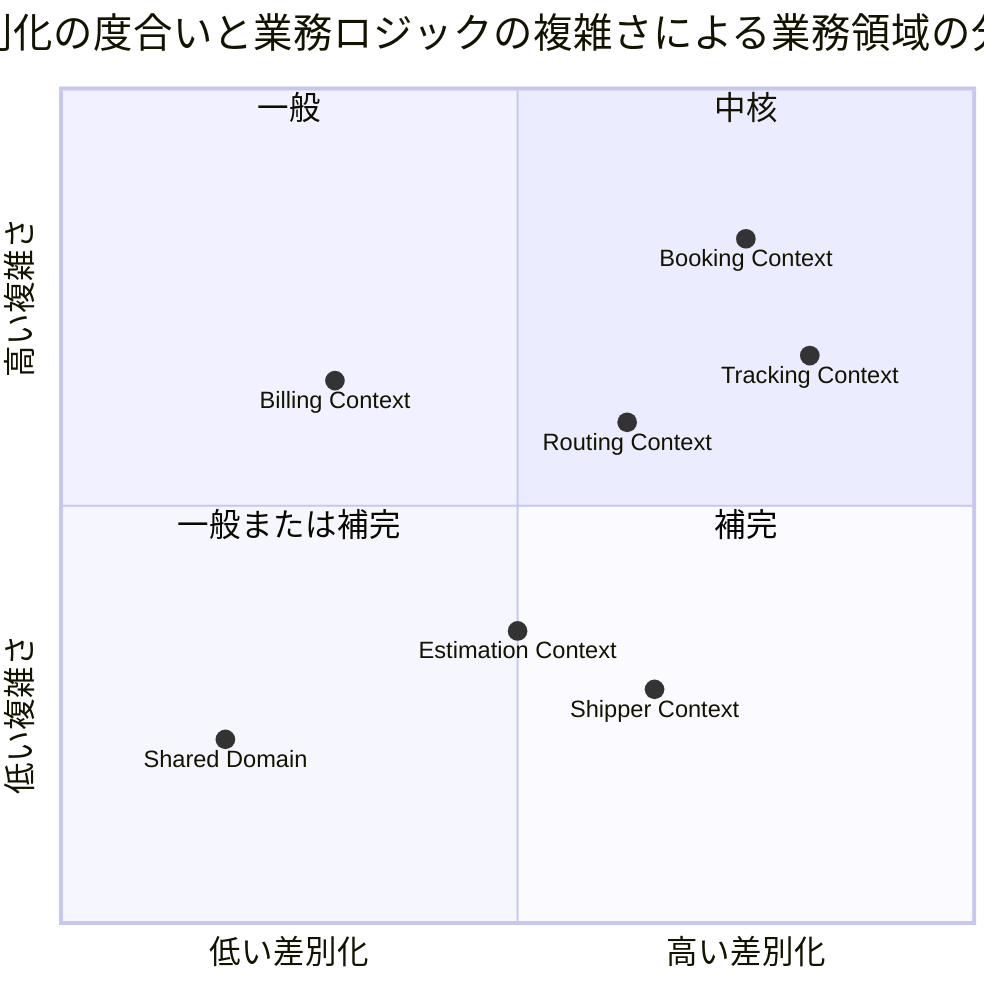

# 第 2 章：インセプションデッキから境界づけられたコンテキストへ

| 項目 | 内容 |
| :--- | :--- |
| 一次資料 | `strategy/inception-deck.md`／`strategy/business_architecture.md`／`design/domain-model.md` |
| プラクティス | 計画ゲーム、チーム全体 |
| 主題 | M1（モデルはイテレーションで育つ）／M2（境界は最初から正しくない） |

## このプラクティスが解こうとした問題

境界づけられたコンテキストをどう決めるか、という問いには決まった手続きがありません。**業務を切るのだから、切り方の根拠は業務の側にしかありません。**

参照元はその根拠をインセプションデッキとビジネスアーキテクチャに置いています。本章はその経路を追います。

インセプションデッキは 10 の質問で構成されますが、**業務領域の分割に効いたのは 3 つ**でした — 「1. なぜやるのか」「4. スコープの範囲はどこか」「5. 主なステークホルダーは」です。

## どう実践したか

### 「なぜやるのか」が名前を与える

インセプションデッキの最初の質問が、扱う対象の名前を決めています。

> - **予約・ルート選定の煩雑さ**：荷主が最適なルート選定と予約手続きに多大な手間を要している
> - **経路設計の複雑さと属人化**：多数の制約条件を考慮した最適経路の設計が複雑であり、**経路設計者の経験と勘に依存している**
> - **荷役作業の手動記録によるタイムラグ**：荷役作業の記録が手動で行われており、貨物状態の更新が遅れる
> - **透明性の欠如による不安と問い合わせ増加**：輸送状況が見えないため、問い合わせが増加している
>
> — `strategy/inception-deck.md`「1. なぜやるのか？」

**この 4 つの問題文に、後の BC の名前がすべて出ています。** 予約（Booking）、経路（Routing）、荷役（Handling）、追跡（Tracking）。

問題を業務の言葉で書いた時点で、**分けるべき単位はすでに現れていた**ということです。ここで「予約管理モジュール」「マスタ管理モジュール」のような実装都合の名前を使っていたら、この対応は生まれません。

ガイディングプリンシプルにも明記があります。

> | アプリケーション | ドメイン駆動設計（DDD） | **境界付けられたコンテキストでシステムを分割し、ビジネス変化に追従できる構造を維持する** |

### スコープの範囲が「作らないもの」を決める

4 つ目の質問がもう一つの側面を担っています。

| スコープ内（優先順位順） | スコープ外 |
| :--- | :--- |
| 1 貨物予約管理 ／ 2 経路設計 ／ 3 貨物追跡 ／ 4 荷役作業管理 ／ 5 通知 ／ 6 精算管理 | 船舶・航路の運航管理、港湾施設の物理的管理、人事・給与、一般経理・財務、**税関申告システム（連携は行うが申告業務自体は対象外）** |

> 出典：`strategy/inception-deck.md`「4. スコープの範囲はどこか？」

**「連携は行うが申告業務自体は対象外」** — この一行が、後の `CustomsClearancePort` という外部 ACL ポートの位置づけを決めています。通関は業務フローに現れますが、それを行うのは自分たちではない。だから**集約ではなくポートになります**。

スコープ内の優先順位も、そのままイテレーションの順序になりました（第 3 章）。

### ステークホルダーがアクターになる

| ステークホルダー | 対話する BC |
| :--- | :--- |
| 営業担当者 | Booking・Estimation |
| 経路設計者 | Routing + Booking |
| 荷役作業員 | Handling |
| 追跡管理者 | Tracking |
| 経理担当者 | Billing |
| 荷主・荷受人 | Booking（読取）＋ Tracking（読取） |

> 出典：`strategy/inception-deck.md`「5. 主なステークホルダーは？」と `design/domain-model.md`「アクターとコンテキストの対応」

**ステークホルダーの一覧と BC の一覧が、ほぼ 1 対 1 で並びます。** これは偶然ではなく、業務の担い手が違えば使う言葉が違い、言葉が違えばモデルが分かれるという、コンテキスト境界の定義そのものです。

第 5 章で扱う「ロールが違えば画面が違い、画面が違えば入口が違う」という観察は、ここに根を持っています。

### 業務領域を分類する

`domain-model.md` は BC を列挙するだけでなく、**差別化の度合いと業務ロジックの複雑さ**で分類しています。

> 転記元：`design/domain-model.md`

**この図は設計図ではなく投資判断です。** 中核（Booking・Tracking）には繰り返し手を入れ、補完（Billing）は後ろに寄せ、汎用（Shared）は増やさない。実績でどう現れたかは第 3 章で扱います。

## モデルがどう変わったか

導出された BC は 7 つ（＋共有カーネル＋ Security サブドメイン）です。ただし**この形は最初のものではありません**。

| 変化 | 経緯 |
| :--- | :--- |
| Handling が独立した | 当初は Tracking の一部。ADR-010 で独立 BC に昇格 |
| 共有カーネルの範囲が確定した | 2 つの設計ドキュメントが 1 要素と 4 要素で食い違っていた。ADR-005 で 2 要素に確定（第 8 章） |
| Security が追加された | 補完サブドメインとして ADR-007 で位置づけ |
| Estimation が最後に立った | スコープ内優先度 1 に含まれるが、実質的な実装は IT18 |

インセプションデッキから導けたのは**候補**であり、確定ではありませんでした。

## 働かなかったケース

### 件数だけが取り残された

`domain-model.md` の概要は、いまも次のように書かれています。

> システムは以下の **6 つの境界付けられたコンテキスト**と共有ドメイン（共有カーネル）で構成される。

**同じ文の直後の表には 7 つ並んでいます。** Handling が ADR-010 で独立 BC に昇格した際、表は更新されたのに本文の件数だけが取り残されました。

これは些細な誤記に見えますが、本シリーズの主題 M3（ユビキタス言語は放っておくと実装から離れる）の最小の実例です。**業務領域の分割そのものがイテレーションで変わり、文書の記述が実態から遅れました。** 件数は表を数えれば分かるのに、誰も数え直していません。

第 9 章では、この種のずれを検査で捕まえる話をします。

### 分類の数値に根拠が無い

quadrantChart の座標（Booking [0.75, 0.82] など）は**誰かが置いた見立て**であり、測定値ではありません。にもかかわらず、着手順や投資配分の説明にそのまま使われます。

**見立てであることを承知で使うのは有効ですが、数値の見た目が根拠の強さを偽装する**危険は残ります。本シリーズでは、この分類が実績とどう一致し、どこで一致しなかったかを第 3 章で照合します。

次章では、この分割をどう 20 イテレーションに割り付けたかを扱います。

---

- 前の章：[第 1 章：XP と DDD をなぜ一緒に語るのか](01-xp-and-ddd.md)
- 次の章：[第 3 章：小さなリリースとイテレーション計画](03-releases-and-stories.md)
- [シリーズ概要](index.md)
