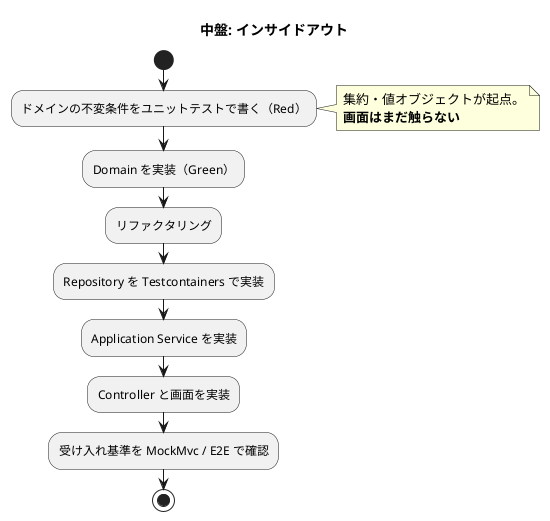

# 第 4 章：開発戦略 — 7 局面で TDD の入口を切り替える

| 項目 | 内容 |
| :--- | :--- |
| 一次資料 | `development/development_strategy.md`／`design/test_strategy.md` |
| プラクティス | テスト駆動開発、受入テスト |
| 主題 | M1（モデルはイテレーションで育つ） |

## このプラクティスが解こうとした問題

TDD には二つの入り方があります。

| アプローチ | 入口 | 危険 |
| :--- | :--- | :--- |
| アウトサイドイン | 画面・API の受入基準 | 上位から作ると**貧血ドメインモデル**になりやすい |
| インサイドアウト | 集約の不変条件 | 画面に繋ぐ段で**要らないものを作っていた**ことが分かる |

どちらか一方を教条的に選ぶと、選ばなかった側の危険をそのまま引き受けます。**参照元は局面ごとに切り替えました。**

## どう実践したか

### 条件から入口を選ぶ

**真似すべきはこの表です。** 局面の名前は結果のラベルであり、判断はすべて**状況**から導かれています。

| 状況 | 選ぶ入口 | 理由 |
| :--- | :--- | :--- |
| 画面も API も未実装。基盤も未確立 | アウトサイドイン | UI のニーズから API を導出し**薄く貫通**させるのが安全 |
| 基盤は確立済み。**中核ドメインが複雑** | インサイドアウト | 経路候補算出・8 状態の遷移・荷役と輸送状態の連動は、上位から作ると貧血モデルになりやすい |
| 基本実装済み × ドメイン複雑 | アウトサイドイン | 例外対応・誤配・通関は既存集約の組み合わせ。**業務シナリオを受け入れテストで束ねる** |
| **すべて実装済み。ドメインは変えない** | アウトサイドイン | 未達の受入基準は既存の集約を読み取って表示するだけ。**条件が前と同じなので、同じ選択をする** |
| **BC は新設だが、設計は確定済み** | アウトサイドイン | **未知なのは業務ではなく配線である** |
| 基盤は確立済み。**新規 BC・金額・丸め規則** | インサイドアウト | **丸めと割引の規則は画面から下ろすと必ず表示都合が混ざる** |

> 出典：`development/development_strategy.md`「アプローチ選択の根拠」

**「条件が同じなら同じ選択をする」と明記されている**のがこの表の要点です。整流局面が「条件が終盤と同じなので、同じ選択をする」と書いているのがその実例です。

見積局面の「未知なのは業務ではなく配線である」も同型です。**新規 BC だからインサイドアウト、ではありません。** 設計が確定していれば、残っているのは配線であり、配線はアウトサイドインのほうが速い。

### その結果、7 局面になった

上の表を 20 イテレーションに当てはめた結果がこれです。**この表を先に真似しないでください** — 局面の区切りは題材と進み方に固有のものです。

| 局面 | 対象 IT | 主アプローチ | 狙い |
| :--- | :--- | :--- | :--- |
| **序盤** | IT1〜IT2 | アウトサイドイン | 縦切りで「歩けるスケルトン」を通し、アーキテクチャ基盤の妥当性を早期に検証する |
| **中盤** | IT3〜IT6 | インサイドアウト | 経路設計と追跡という中核ドメインを、ドメイン層から堅牢に作り込む |
| **終盤** | IT7〜IT12 | アウトサイドイン | 既存ドメインを業務シナリオ起点で結合する |
| **精算** | IT13〜IT15 | IT13 のみインサイドアウト、以降アウトサイドイン | 金額を扱う新規 BC をドメイン層から固めるのは IT13 だけ |
| **整流** | IT16〜IT17 | アウトサイドイン | **新規ストーリーを作らない局面**。宣言した規則に検査を与える |
| **見積** | IT18 | アウトサイドイン | 最後の未実装 BC を立ち上げる |
| **出荷と是正** | IT19〜IT20 | アウトサイドイン | 正典に届いていない実装を返す |

> 出典：同上

**「精算」「見積」は局面名がそのまま業務領域名です。** 局面の切り替えは技術的な都合ではなく、**業務領域の切り替え**として設計されています。第 3 章で見た「ストーリーの並び順が BC の立ち上がる順序を決めた」ことの裏返しです。

精算局面はさらに細かく、**同じ局面の中で IT13 だけアプローチを変えています**。

> 金額を扱う新規 BC（Billing）をドメイン層から固めるのは **IT13 だけ**である。集約が揃った後は既存の組み合わせであり、**条件が変わったのでアプローチも変える**。

### 局面ごとにワークフローが図で固定されている

序盤と中盤で、Red の置き場所が入れ替わります。

> 転記元：`development/development_strategy.md`「中盤: インサイドアウト」

序盤は「受け入れ基準から E2E / MockMvc テストを書く（Red）」から始まり、注記に「**ドメインの形はまだ決めない**」とあります。中盤は「集約・値オブジェクトが起点。**画面はまだ触らない**」です。

**変わるのは入口だけです。**

> **Red-Green-Refactor は全局面で不変。変えるのはテストの入口とレイヤー貫通の順序だけ。**
>
> — `development/development_strategy.md`

### 中盤の手順が具体的

中盤（インサイドアウト）の手順は 4 項目に絞られています。

1. **不変条件を先にテストにする**。BookingStatus の遷移表は**許可・拒否の全セル**を `@ParameterizedTest` で網羅する
2. **境界値を必ず含める**（期限当日の時刻付き到着・ちょうど 48 時間・金額の丸め）
3. ドメインが緑になってから外側へ展開する
4. 画面は最後に付ける

**「許可・拒否の全セル」という指定が効いています。** 遷移表を仕様として持っている以上、テストは表の写像であるべきで、代表値のサンプリングでは不足です。

境界値の指定に「期限当日の時刻付き到着」が明示されているのは、第 6 章で扱う DATE と TIMESTAMP の境界バグが実際に起きたためです。**ふりかえりで見つかった失敗が、戦略ドキュメントの必須項目に昇格しています。**

## モデルがどう変わったか

局面の切り替えは、モデルの作られ方を直接変えました。

| 局面 | モデルへの影響 |
| :--- | :--- |
| 序盤（アウトサイドイン） | Shipper は薄い。業務ロジックはほぼ無く、レイヤーの貫通だけが成果 |
| 中盤（インサイドアウト） | Booking・Routing・Tracking の不変条件がここで固まる。第 6 章の値オブジェクトはこの局面の産物 |
| 終盤（アウトサイドイン） | 新しい集約はほとんど増えず、既存集約の**組み合わせ**が増える。第 5 章のシナリオテスト 8 本はこの局面 |
| 整流（アウトサイドイン） | 集約は変えず、**検査だけが増える**（第 10 章） |

**中盤でドメインを固めたから、終盤に組み合わせで済んだ** — この因果が実績として追えます。もし全期間をアウトサイドインで通していたら、終盤の「既存集約の組み合わせ」という前提そのものが成立しませんでした。

## 働かなかったケース

### 局面の想定より受入基準が残った

整流局面（IT16・IT17）は、そもそも**前の局面で残った未達を返すために新設された**ものです。IT15 で US30 を完了扱いにしたものの、受入基準の一部（陸揚げ地を荷役の一覧に出す）が未達のまま残りました。

**「完了」の判定が実際の到達性を見ていなかった**ということです。第 5 章の「状態を進めた直後にもう一度同じ画面を開く」という Try は、この種の見落としへの対処でしたが、IT15 でも同じ形が出ています。

### 局面名が後から付いた

7 局面のうち「整流」「見積」「出荷と是正」は、当初の戦略には存在しません。**計画時点では 4 局面（序盤・中盤・終盤・精算）でした。**

局面が増えたこと自体は失敗ではなく、むしろ計画が実態に追随した結果です。ただし**「局面戦略」という枠組みが、後から局面を足せる程度に緩かった**ことは記録しておく価値があります。厳密な段階モデルであれば、整流のような「何も作らない局面」は表現できませんでした。

次章から第 2 部に入り、この戦略のもとでモデルが実際にどう彫り出されたかをコードで追います。

> 第 2 部は [第 5 章：受入テストから集約を立ち上げる](05-acceptance-to-aggregates.md) から始まります。

---

- 前の章：[第 3 章：小さなリリースとイテレーション計画](03-releases-and-stories.md)
- 次の章：[第 5 章：受入テストから集約を立ち上げる](05-acceptance-to-aggregates.md)
- [シリーズ概要](index.md)
