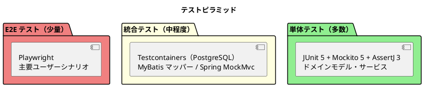

# 第 5 章：受入テストから集約を立ち上げる

| 項目 | 内容 |
| :--- | :--- |
| 対象 US | US13（予約確定）／US14（追跡番号発行）／US15（荷役記録） |
| 対象 UC | UC11・UC12・UC13 |
| プラクティス | 受入テスト、テスト駆動開発 |
| 主題 | M1（モデルはイテレーションで育つ） |

## 扱う業務ルール

貨物予約は、経路が確定してから確定操作を受け付け、確定後に追跡番号が発行され、そこから荷役作業が記録できるようになります。**業務としては一本の線ですが、実装上は 3 つの境界づけられたコンテキストをまたぎます**（Booking → Tracking → Handling）。

集約の境界は、この線のどこで切るかで決まります。そして**どこで切るかは、受入テストが先に決めました**。

## テストから始める

テストの形はあらかじめ決まっています。



> 転記元：`design/architecture_backend.md`「テストピラミッド」

**本章が扱うのは真ん中の層です。** 受入テストは MockMvc で書かれ、実 PostgreSQL の上で走ります。E2E（Playwright）は主要シナリオだけに絞り、業務シナリオの網羅はこの層が引き受けます。

参照元は BC をまたぐ業務シナリオを `scenario/` パッケージに集め、8 本の受入テストとして持っています。

| ファイル | 扱う業務 |
| :--- | :--- |
| `CargoLifecycleScenarioTest` | 予約確定 → 追跡番号発行 → 荷役記録（US13 / US14 / US15） |
| `RouteConfirmationScenarioTest` | 経路の確定と予約への紐付け（US09 / US11） |
| `CargoClaimScenarioTest` | 引取による配送完了（US16） |
| `ClaimCodeScenarioTest` | 引取確認コードの採番と照合（US35） |
| `ClaimCorrectionScenarioTest` | 引取記録の訂正・取り消し（US36） |
| `CustomsClearanceScenarioTest` | 通関を通してから引き渡す（US29） |
| `MisrouteScenarioTest` | 誤配を検知して経路を組み直す（US28） |
| `ConcurrentRouteOperationScenarioTest` | 2 人が同じ予約を同時に操作したときの振る舞い |

クラスの Javadoc が、置き場所の理由をそのまま書いています。

```java
/**
 * 予約確定 → 追跡番号発行 → 荷役記録（US13 / US14 / US15）。
 *
 * <p>受入基準に 1:1 で対応させる。<strong>BC をまたぐのが仕事</strong>であるため
 * {@code scenario} に置く（ArchUnit ルール 4 の除外対象）。
 *
 * <p><strong>状態を進めた直後に、同じ画面をもう一度開く</strong>（IT5 の Try T1）。
 * 到達性の抜けは 4 イテレーション連続で起きており、受入基準には現れない。
 */
```

> 出典：`apps/.../test/.../scenario/CargoLifecycleScenarioTest.java`

**「BC をまたぐのが仕事」だから ArchUnit の除外対象にする** — ここが重要です。BC 間の依存を禁じる構造検査は普段は正しく働きますが、業務シナリオのテストだけは越境が目的です。**禁止の例外を、パッケージという場所で表明しています**（第 10 章で扱う契約の形です）。

テスト本体は受入基準を 1 メソッドに写します。

```java
/** 受入基準（US13）: 確定操作を行うと予約状態が「予約確定」に更新される。 */
@Test
void 経路が確定した予約を確定できる() throws Exception {
    var bookingId = 経路確定済みの予約("JPOSA", "USLAX", new BigDecimal("100000"));

    mockMvc.perform(post("/bookings/{id}/confirm", bookingId)
                    .with(user("sales").roles("SALES")).with(csrf()))
            .andExpect(redirectedUrl("/bookings/" + bookingId));
```

> 出典：同上

**入口は画面（HTTP）です。** 集約のメソッドを直接呼ばず、営業担当者のロールで POST します。これがアウトサイドインの実際の形で、「誰がどの画面から操作するか」がテストに残ります。

前提の組み立てもすべて業務の言葉です。

```java
private UUID 経路確定済みの予約(String origin, String destination, BigDecimal capacityKg)
        throws Exception {
    var bookingId = 引き渡し済みの予約(origin, destination);
    String voyage = 航海を登録する(origin, destination, capacityKg);
    mockMvc.perform(post("/bookings/{id}/route/proposals", bookingId)
            .with(user("router").roles("ROUTER")).with(csrf()));
    mockMvc.perform(post("/bookings/{id}/route/selection", bookingId)
            .param("voyageNumber", voyage)
            .with(user("router").roles("ROUTER")).with(csrf()));
    return bookingId;
}
```

> 出典：同上

**前提を SQL で作らず、実際の画面操作で作っています。** 「経路確定済みの予約」は状態の名前ではなく、**そこへ至る操作列**として定義されています。この書き方だと、途中の操作が壊れたときに前提の組み立てで落ちるため、**シナリオ全体が導線の検査を兼ねます**。

## モデルに落とす

受入テストが通る最小の実装を入れると、集約の輪郭が決まります。この線では次のように切れました。

| BC | 集約ルート | 受け持つ判断 |
| :--- | :--- | :--- |
| Booking | `Cargo` | 確定できる状態か、経路が付いているか |
| Tracking | `TrackingActivity` | 追跡番号を発行してよいか、状態をどう進めるか |
| Handling | `HandlingActivity` | 荷役をこの貨物に記録してよいか |

**この 3 分割は最初から見えていたものではありません。** Handling は当初 Tracking の一部として設計されていました（ADR-002）。そのとき統合を選んだ根拠の一つが「**荷役作業員と追跡管理者でユビキタス言語が分岐していない**」です。担い手が違うことは分かったうえで、言語は同じだと判断していました。

**実装すると、その判断が覆りました。**

> 実装してみると、**言語は分岐していた**。
>
> — `adr/010-*.md`

同一 BC の中に `HandlingType` と `TrackingEventType`、`HandlingVoyageNumber` と `TrackingVoyageNumber` のような対応する型が 3 組でき、`TrackingEventType.valueOf(handlingType.name())` という**文字列を経由した変換**まで生まれていました。

**「統合されていた」のではなく、「境界が引かれていなかっただけ」でした。** 担い手の違いは分岐の原因であって、分割の根拠ではありません。**根拠になったのは、実装に現れた型の分岐です**（M2）。

## 後から効いた／効かなかった

### 効いた：状態を進めた直後に同じ画面をもう一度開く

IT5 のふりかえりで、次の Try が出ています。

> **状態を進める操作を作ったら、進めた後にもう一度同じ画面を開く。** 受入基準に無くても必ず確かめる
>
> — `retrospective-5.md` T1

**受入基準は「操作できること」しか書きません。** 操作した後にその画面がどう見えるか、次に何ができるかは書かれていないため、状態を進めた結果として画面が壊れていても受入テストは緑になります。到達性の抜けは**4 イテレーション連続**で起きていました。

以後、シナリオテストには「進めた後にもう一度開く」アサートが入っています。これは受入基準の写経では出てこない、**シナリオを書く人間の側が足した検査**です。

### 効いた：受け入れの最後の関門としてのマニュアル

受入テストが緑でも、業務担当者がその画面で仕事を終えられるとは限りません。参照元はその隙間をユーザーマニュアル（16 ファイル・画面キャプチャ 62 枚）で埋めています。

マニュアルの執筆テンプレートは節の構成を固定しています。

> **この画面でできること → 画面の開き方 → 画面の説明**
>
> この順序は読者が実際に迷う順序であり、崩すと読者は自分の状況に対応する記述を探せなくなる。
>
> — `docs/manual/index.md`

**「画面の開き方」が書けないとき、その画面へ到達する導線が無い**ということです。ロール別・状態別の到達性の欠落は、受入テストが緑のままマニュアル執筆で初めて見つかります。

画面キャプチャは Playwright（`e2e/manual/manual-screenshots.spec.js`・1,119 行）で自動再生成されます。**手で貼った画像は腐りますが、生成される画像は実装に追随します**。

### 効かなかった：受入基準の写経だけでは足りなかった

シナリオテストは受入基準に 1:1 で対応していますが、IT5 のふりかえりには次の指摘があります。

> 算出（`/proposals`）には楽観的ロックの衝突処理を足したのに、**確定（`/selection`）には足していなかった**。同じ例外を投げる経路が他にないかを見ていない。
>
> — `retrospective-5.md` P2

受入基準に「同時に 2 人が操作したら」という記述はありません。**受入基準に無い振る舞いは、受入テストからは絶対に出てこない**という当たり前の限界です。対処は `ConcurrentRouteOperationScenarioTest` の新設と、「例外処理を足したら同じ例外を投げる経路を数える」という Try でした。

**受入テストは仕様の下限を守る道具であり、上限を決める道具ではない** — 第 6 章の不変条件は、この上限側を集約に持たせる話になります。

次章では、業務ルールを画面ではなく集約に置く判断を扱います。

---

- 前の章：[第 4 章：開発戦略 — 7 局面で TDD の入口を切り替える](04-development-strategy.md)
- 次の章：[第 6 章：値オブジェクトと不変条件](06-value-objects-and-invariants.md)
- [シリーズ概要](index.md)
