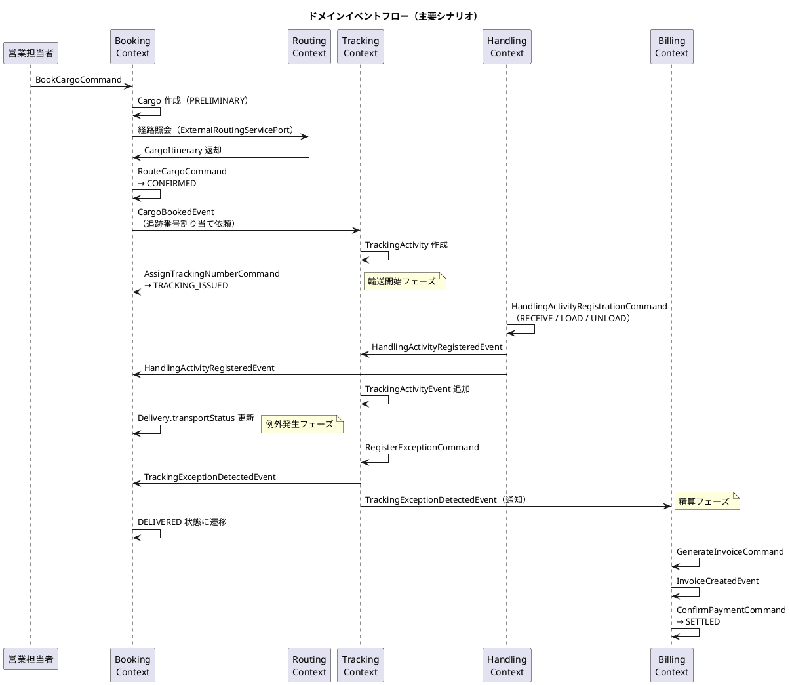

# 第 8 章：境界を守る五つの手段

| 項目 | 内容 |
| :--- | :--- |
| 対象 ADR | ADR-005（共有カーネルの範囲）／ADR-009（BC 間の状態伝播）／ADR-010（Handling の独立） |
| 対象 IT | IT1（共有カーネル）／IT6（イベント）／IT15・IT16（検査） |
| プラクティス | 継続的インテグレーション、リファクタリング |
| 主題 | M2（境界は最初から正しくない） |

## 扱う問題

BC を分けたら、次に決めるのは**越え方**です。参照元は五つの手段を持っています。**うち二つは、他の三つを入れた後で必要になったもの**です。

| 手段 | 何を決めるか | 決まった時期 |
| :--- | :--- | :--- |
| 共有カーネル | どの BC でも意味が変わらない値だけを共有する | IT1（ADR-005） |
| 腐敗防止層（ACL） | 相手の都合を自分の言葉に翻訳して受け取る | 序盤から |
| ドメインイベント | 起きた事実を非同期に伝える | IT6（ADR-009。判断を反転） |
| **向きを一方通行に保つ** | 依存の循環を断つ／閉じ込める | IT8（ADR-012） |
| **失敗の届け先を決める** | できなかったことを誰がいつ知るか | IT14（ADR-021） |

**五つとも、越境の痛みが出てから決まりました。** 設計として先に置かれたものは一つもありません。

## 手段 1：共有カーネルを 2 要素に限定する

きっかけは設計ドキュメント間の食い違いでした。

| ドキュメント | 共有カーネルの範囲 |
| :--- | :--- |
| `architecture_backend.md` | `Location`（UN/LOCODE）**のみ** |
| `domain-model.md` | `Location` + `ShipperId` + `TransportStatus` + `RoutingStatus` |

> 共有カーネルはシステムで最も変更コストが高い部分である。範囲が曖昧なままだと「**どこにも属さないもの置き場**」に劣化し、時間とともに肥大化する。
>
> — `adr/005-*.md`

決定は `Location` と `ShipperId` の 2 つに限定することでした。判断基準が明快です。

| 要素 | 判断 | 理由 |
| :--- | :--- | :--- |
| `Location` | 残す | UN/LOCODE は国際標準であり、**コンテキストごとに解釈が分岐しない** |
| `ShipperId` | 残す | 識別子は値としての同一性のみを持ち、**業務的な振る舞いを持たない** |
| `TransportStatus` | Tracking へ戻す | **集約の状態そのもの**であり、共有は集約のカプセル化を BC 境界を越えて破る |
| `RoutingStatus` | Routing へ戻す | 同上 |

> 出典：`adr/005-*.md`

`TransportStatus` を外す理由が本 ADR の中心です。

> 共有カーネルに置くと、**Tracking に新しい輸送状態を 1 つ追加するだけで Booking・Handling・Billing の再ビルドとレビューが強制される**。最も変更されうる部分に最も高い変更コストを課す配置になっている。
>
> 他コンテキストが必要としているのは「Tracking の状態そのもの」ではなく「**自分の関心事に翻訳された状態**」である。たとえば Billing が知りたいのは `DELIVERED` かどうかの一点であり、9 値すべてではない。

**「共有すべきか」は「同じ値を使うか」ではなく「変更コストをどこに置くか」で決まります。** そして「翻訳された状態が欲しいだけ」という観察が、次の手段（ACL）を要求します。

この限定は全期間を通じて守られました。20 イテレーション後の共有カーネルは、いまも 2 要素です。

**ただし、守られたのは検査があった範囲だけでした。** ADR-005 は `shared.domain.model` の範囲を決めましたが、**`shared.application` については何も述べていません**。IT9 のレビューで、このパッケージがどの ArchUnit ルールにも守られていないことが判明します。しかも **BC 間参照を禁じるルールは `shared` を依存先から除外している**ため、ここに置いたものは BC 間結合の検査を素通りしました。実際に `CurrentUser`・`ShipperScopedPrincipal` が「Security が実装し Booking が読む」という越境をここで受けていました。

IT10 で 6 クラスを許可する形のルールを足して止めています。**限定が効いたのは、限定した範囲に検査があったからです**（M4）。

## 手段 2：腐敗防止層で翻訳する

ACL は 2 層に分かれています。**ポート（インターフェース）は `application/internal/outboundservices/acl`、それを実装するアダプタは `infrastructure/acl`** です。相手の型をそのまま受け取らず、自分の言葉に変換します。

| 層 | 置き場 | 持つ BC |
| :--- | :--- | :--- |
| ポート | `application/internal/outboundservices/acl` | billing / booking / estimation / handling / routing / shipper / tracking |
| アダプタ | `infrastructure/acl` | booking / estimation / handling / routing / security / shipper / tracking |

**この 2 層構成が要点です。** ポートを application に置くのは、**必要とする側が形を決める**ためです。実装が infrastructure にあるのは、相手の都合（DB・HTTP・他 BC のサービス）がそこにしか無いからです。

第 1 章のコンテキストマップで `booking ..> shipper : (ACL) ShipperExistenceChecker` と書かれている線がこれです。ポートは `booking/application/internal/outboundservices/acl/ShipperExistenceChecker`、アダプタは `shipper/infrastructure/acl/ShipperExistenceCheckerAdapter` にあります。

**ポートが Booking 側にあることに注目してください。** Booking が知りたいのは「その荷主が存在するか」の一点であり、`Shipper` 集約の全体ではありません。**必要な粒度を決めるのは呼ぶ側です。**

**ポートの名前が、必要としている情報の粒度をそのまま表しています。** `ShipperRepository` ではなく `ShipperExistenceChecker` である、という命名がそれです。

なお ArchUnit の BC 分離ルールでは、**ACL のポートのパッケージだけを除外**しています。BC 単位で除外を緩めると、ACL を置いた動機そのものが消えるためです。

## 手段 3：ドメインイベントで伝播する

三つ目が最も高くつきました。ADR-009 は**判断を一度反転しています**。

> **改訂 1（2026-08-08）**: 当初は「BC 間 ACL は同期・同一トランザクションで呼ぶ」と決めた。**本改訂で判断を反転し、状態の伝播はドメインイベントによる結果整合とする。**
>
> 反転の理由は「**1 つの操作が 3 つの集約を 1 トランザクションで更新する形が、集約境界の原則からの逸脱として重すぎた**」ことである。
>
> — `adr/009-*.md`

反転を要求したのは業務の側でした。

> 荷役は最も頻度の高い操作であり、**追跡や予約の都合で荷役の記録が失敗してはならない**。順序が逆だった。

**「どちらが正しいか」ではなく「どちらが止まってよいか」で決まっています。** 同期を選ぶと、追跡の更新が失敗したときに荷役の記録まで巻き戻ります。荷役作業員は目の前で貨物を扱っており、彼らの作業が追跡システムの都合で失敗するのは業務として逆です。

きっかけも記録されています。

> IT6（US13 / US14 / US15）で BC 間 ACL ポートが 4 件になり、**1 つの操作が複数の BC に書き込む形**が実装に現れた。（中略）**実装と設計書で故障モードがまるで違う。**
>
> この食い違いは IT6 のマルチパースペクティブレビュー（architect M2 / H3）で指摘された。**どちらが正しいかを決めずに実装が先行していた。**

第 5 章で見た「予約確定 → 追跡番号発行 → 荷役記録」の一本の線が、実装として通った瞬間に境界の問題が可視化された、ということです。**線を通すまで、この問題は見えていません**（M2）。

改訂前の記述は代替案の節に残されています。**判断の経緯を追えるようにするため**です。

結果として、BC 間は次のように繋がりました。

> 転記元：`design/domain-model.md`「ドメインイベントフロー（主要シナリオ）」

**荷役（`handling`）から出る矢印が 2 本とも一方通行である**ことに注目してください。荷役は Tracking と Booking へイベントを送りますが、返事を待ちません。だから追跡や予約が落ちても、荷役の記録は成功します。

## 手段 4：向きを一方通行に保つ

ここまでの三つを入れても、**依存が循環していないとは限りません**。

IT7 のクローズ後、JIG のパッケージ図で **Booking ⇄ Routing** と **Booking ⇄ Tracking** が循環していることが分かりました。可視化が問題を見せた例です（第 9 章）。

ADR-012 の決定は、**断てるものは呼び出しの向きを一方通行にして断ち、断てないものは理由を記録したうえでインフラ層に閉じ込める**というものでした。Booking ⇄ Tracking の循環は実際に消え、残ったのは Booking ⇄ Routing の 1 つだけです。

この ADR には、本シリーズの図の読み方に関わる注意書きがあります。

> **本 ADR は「呼び出しの向き」で記述する。**（中略）**パッケージ依存の向きは呼び出しと逆になる**（ポートは呼ぶ側が定義し、アダプタは呼ばれる側が実装する）。
>
> — `adr/012-*.md`

**手段 2 で見た 2 層構成が、そのまま向きの反転を生みます。** 呼び出しは Booking → Shipper ですが、`ShipperExistenceChecker` を定義するのは Booking なので、パッケージ依存は Shipper → Booking です。**両者を混ぜて書くと、規律が正反対に読めます。**

本シリーズのコンテキストマップ（第 1 章）の矢印は**呼び出しの向き**です。

## 手段 5：失敗の届け先を決める

ADR-009 は「状態の伝播はイベント、コマンドは同期」と分類しました。**5 イテレーション後、この分類は不十分と判定されます。**

きっかけは `BookingSettlementPort.settle` です。`boolean` を返す契約なのに、呼び出し側が戻り値を捨てていました。結果として「**入金確認済みだが予約が精算済みでない**」請求書が生まれ、ログにも画面にも残りませんでした。その予約は精算後も引取記録を訂正できてしまいます。

**テストは全緑、SonarQube も PASS。** 見つけたのはレビューです。

ADR-021 は判断基準を書き換えました。

> BC 境界を越えて状態を変える経路を、同期の ACL ポートにするかドメインイベントにするかは「**できなかったことを誰がいつ知り、その人は動けるか**」で決める。同期にする場合は、**失敗が届く先を名簿に登録しなければ検査が落ちる**。
>
> — `adr/021-*.md`

**基準が「戻り値を使っているか」から「誰が気づけるか」へ移りました。** `settle` は同期のまま残されましたが、理由が業務で説明されています — 「US23 の受入基準そのものであり、経理担当者はその場で気づいて手を打てる」。届け先は請求書詳細の警告と監査ログです。

**「例外にしない」ことと「記録しない」ことは別です。** 戻り値を捨てた同期ポートは、失敗が誰にも見えないまま業務の守りを外します。

## 後から効いた／効かなかった

### 効かなかった：規則を書いただけでは守られなかった

ADR-009 は決定の中で「購読側は新しいトランザクションで書く」と明記しています。しかしその規則は**7 イテレーションのあいだ、半分しか守られませんでした**。

> ADR-009 の規則 2 は「購読側は新しいトランザクションで書く」と明記している。**自分が足した購読先サービスは素の `@Transactional` だった。** それだけなら「新入りの見落とし」で済むが、**検査を書いた瞬間、同じ違反が既存に 5 本あることが分かった**。
>
> **「ADR に書いた」と「守られている」の間に何も無かった。**
>
> — `retrospective-15.md` P1

**指摘は 1 本、実測は 6 本。** 記録は実態より小さくなります。この対処が第 10 章の主題です。

### 効かなかった：同じ形が 2 回出た

ADR-009 は同期案の危険を先に書いていました。

> **楽観的ロックの失敗を握り潰すと、同期にした利点（片方だけ成功しない）がそのまま失われる。** IT6 のレビューでは実際に 3 か所で戻り値が捨てられていた。

**先に書いてあったのに、IT14 で同じ形（`settle` の戻り値の握り潰し）が出ています。** 手段 5 が必要になったのはそのためです。書いておくことは、繰り返しを止めません（M4）。

### 効いた：境界の変更が集約の境界を動かさなかった

五つの手段はいずれも**越え方**の変更であり、**どのクラスがどの集約に属するか**は変えていません。ADR-024 の「変えなかったもの」にも同じことが書かれています。

**境界の内側（集約）と境界の越え方（連携）を別々に動かせたこと**が、20 イテレーションを通じてモデルが崩れなかった理由の一つです。

**そして越え方は 5 回にわたって足されました。** 一度で決まらないことが前提であれば、それを足せる構造にしておくことのほうが重要になります。

次章からは第 3 部に入り、育ててきたこのモデルを腐らせないための仕組みを扱います。まずはユビキタス言語です。

---

- 前の章：[第 7 章：リファクタリングでモデルが割れる](07-refactoring-splits-the-model.md)
- 次の章：[第 9 章：ユビキタス言語はどこで離れるか](09-ubiquitous-language.md)
- [シリーズ概要](index.md)
