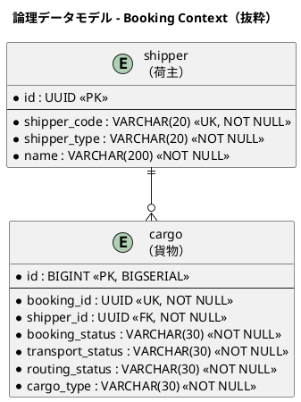

# 第 9 章：ユビキタス言語はどこで離れるか

| 項目 | 内容 |
| :--- | :--- |
| 一次資料 | `strategy/inception-deck.md`／`requirements/`／`design/domain-model.md`／`docs/manual/用語集.md` |
| 検査 | `PackageInfoPresenceTest`（IT19）／JIG の `glossary.html` |
| プラクティス | 継続的インテグレーション |
| 主題 | M3（ユビキタス言語は、放っておくと実装から離れる） |

## このプラクティスが解こうとした問題

ユビキタス言語は「決めれば守られる」ものとして語られがちですが、実際には**層が多い**ぶんだけ離れていきます。

第 1 章で示した 6 層を、1 つの語で端から端まで辿ってみます。

| 層 | その語はどう現れるか |
| :--- | :--- |
| 戦略 | 「荷役作業の手動記録によるタイムラグ」（`inception-deck.md`） |
| 要件 | アクター「荷役作業員」（`requirements_definition.md`） |
| ユースケース | UC13「荷役作業を記録する」（`system_usecase.md`） |
| ストーリー | US15「荷役作業を記録する」（`user_story.md`） |
| ドメインモデル | `HandlingActivity`（対訳表：荷役作業） |
| 実装 | `handling/domain/model/aggregates/HandlingActivity.java` |
| マニュアル | 「08. 荷役管理」（業務担当者向け） |

**この語は 7 か所すべてで一致しています。** 問題は、一致していない語のほうです。

## どう実践したか

### 対訳表を正典として持つ

`domain-model.md` は**英語コード名／日本語業務用語／使用コンテキスト／説明**の 4 列で対訳表を持っています。各行には由来の注記が入り、たとえば `HazardousDeclaration` には「存在しない値は申告が無いのと同じ結果になる（IT12 / C6）」と、**その語の意味が確定したイテレーションまで**記録されています。

**対訳表は用語集ではなく、判断の記録です。**

### 実装側の相方を生成する

対訳表だけでは「そう決めた」ことしか分かりません。参照元は JIG で**実装側の用語集**を生成しています。

| 設計側 | 実装側（JIG の生成物） |
| :--- | :--- |
| `domain-model.md` の対訳表 | `glossary.html`（Javadoc から抽出） |
| `domain-model.md` のドメインモデル図 | `domain.html` |
| `data-model.md` の ER 図 | `jigErd` の出力（実スキーマから生成） |

> `docs/design` は「こう設計した」、JIG の出力は「こう実装されている」を示す。**両者を突き合わせることで、設計と実装の乖離を目視ではなく生成物で検出する。**
>
> — `apps/cargo-tracker/build.gradle`

JIG の設定は `modelPattern = '.+'` で全パッケージを対象にしています（生成物はビルド成果物のため記事には収録していません。[ドキュメントポータル](index.md#portals)で閲覧できます）。理由は「BC ごとの構造を見たい」からで、**BC 分割が実装に現れているかを確認する道具**としても使われています。

### 可視化の入力そのものを検査する

`glossary.html` は Javadoc から抽出されるため、**Javadoc を書かなければ空になります**。参照元はこの入力を検査に落としました。

```java
/**
 * <strong>すべてのパッケージに {@code package-info.java} がある。</strong>
 *
 * <p><strong>パッケージの説明は JIG の出力に載る。</strong>（中略）説明が無いパッケージは
 * <strong>パッケージ名だけの箱として描かれる</strong> —— 図を読む人には
 * 「何を入れる場所なのか」が分からない。
 *
 * <p><strong>欠落は人が気づけない。</strong> 新しいパッケージを作るとき、
 * クラスを置けば動く。{@code package-info.java} が無くてもコンパイルは通り、
 * テストも緑になる。<strong>気づくのは JIG の図を眺めたときだけ</strong>であり、
 * それは誰かが眺めたときにしか起きない。
 *
 * <p><strong>実測（IT19）: 74 パッケージ中 14 が欠けていた。</strong>
 * Billing Context はほぼ全域が欠けており、**BC を 1 つ足したときに
 * まとめて漏れる**形だった。
 */
```

> 出典：`apps/.../test/.../support/PackageInfoPresenceTest.java`

**「74 パッケージ中 14 が欠けていた」** — 誰かが図を眺めるまで、この欠落は存在しないのと同じでした。

さらに「**BC を 1 つ足したときにまとめて漏れる**」という観察が重要です。欠落はランダムではなく、**新しい領域を足す作業に構造的に付随します**。Billing は IT13 で立ち上がった BC であり、そのときの漏れが IT19 まで残っていました。

説明の書き方まで指定されています。

> **説明は「何を入れる場所か」を書く。** クラスの一覧を書き写すと、クラスが増えるたびに古くなる。

**書き写した記述は追随しません** — これは第 10 章で扱う「正典を読む検査」と同じ原理です。

### 用語は層をまたいで一致しているか

同じ語がデータモデルにも降ります。



> 転記元：`design/data-model.md`「論理データモデル - Booking Context」（列は抜粋）

**`shipper`・`cargo`・`booking_status` は、対訳表の「荷主」「貨物」「予約状態」とそのまま対応します。** 用語が戦略から DB まで一本で降りている状態です。

そしてこの一致は、**第 10 章で検査に落とされています**（`DataModelDocumentSchemaTest`）。設計ドキュメントに書いた列が実スキーマに無ければ赤になります。**ユビキタス言語のうち、機械が確かめられるのは「名前が実在するか」までです。**

### 業務担当者向けのもう一つの出口

対訳表は開発者向けです。同じ語彙が、業務担当者向けには `docs/manual/用語集.md` として別に存在します。

マニュアル本体の読者定義が、その理由を示しています。

> 読者は業務担当者であり、開発者ではありません。（中略）このマニュアルの価値は網羅性ではなく、**画面の前に座った担当者がその場で手を動かせること**にあります。
>
> — `docs/manual/index.md`

**6 層の外側に、もう一つ出口があります。** そしてこの出口は、設計側の対訳表とは別に腐ります。

## モデルがどう変わったか

ユビキタス言語の検査は、**モデルを直接は変えません**。変えたのは「モデルを説明する義務」の所在です。

| 変化 | 内容 |
| :--- | :--- |
| パッケージを作る＝説明を書く | `package-info.java` が無ければ CI が赤。パッケージ分割（ADR-024）の際に 27 パッケージ分の説明が追加された |
| 用語の由来が残る | 対訳表に IT 番号・ADR 番号が入り、「なぜこの名前か」が追える |
| 実装側の語彙が可視化される | `glossary.html` により、Javadoc を書いていない箇所が図として見える |

## 働かなかったケース

### 件数だけが取り残された

第 2 章で触れたとおり、`domain-model.md` の概要は「**6 つの境界付けられたコンテキスト**」と書きながら、直後の表に 7 つを列挙しています。Handling が ADR-010 で独立した際、**表は更新されたのに本文の件数が残りました**。

これは検査の外側です。`PackageInfoPresenceTest` は説明の**存在**を見ますが、**中身が正しいかは見ません**（Javadoc にもそう明記されています）。件数の整合を機械で見るには、表を数えて本文と突き合わせる専用の検査が要ります。

**「どこまで検査するか」には必ず線があり、その線の外は人の注意に預けられます。** 重要なのは、預けたことを自覚しているかどうかです。

### 可視化は検査ではない

JIG は乖離を**見せます**が、**赤くはしません**。`domain.html` を開けば設計と実装のずれが分かりますが、開かなければ何も起きません。

第 10 章の主題はここから始まります。**設計ドキュメントを実行可能にする**とはどういうことか、そして何がその外に残ったかを扱います。

---

- 前の章：[第 8 章：境界を守る五つの手段](08-guarding-boundaries.md)
- 次の章：[第 10 章：設計ドキュメントを実行可能にする](10-executable-design-docs.md)
- [シリーズ概要](index.md)
