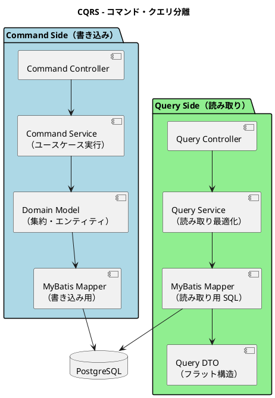

# 第 10 章：設計ドキュメントを実行可能にする

| 項目 | 内容 |
| :--- | :--- |
| 検査 | `PackageStructureTest`（ArchUnit）／`DataModelDocumentSchemaTest`／`ReadSideRuleLocationTest`／`DelegatingAccessorRatchetTest` ほか |
| 対象 ADR | ADR-009・ADR-015・ADR-022・ADR-024 |
| プラクティス | 継続的インテグレーション |
| 主題 | M4（設計の規則は、検査に落とさなければ守られない） |

## このプラクティスが解こうとした問題

**規則を宣言した瞬間に、守った気になります。**

第 8 章で見たとおり、ADR-009 の規則 2 は 7 イテレーションのあいだ半分しか守られませんでした。指摘は 1 本、検査を書いたら 6 本です。

> **「ADR に書いた」と「守られている」の間に何も無かった。**
>
> — `retrospective-15.md` P1

対処は ADR のフォーマット変更でした。すべての ADR に「何がどこで守るか」の節を置き、**規則ごとに（守るもの・守り手・対象範囲）の 3 列**で書きます。守り手が無ければ**「守らない」と明記**します。

**3 列目が本質です。** 検査があることは十分条件ではありません。ADR-024 の表がその実例を持っています。

> | すべてのパッケージに説明がある | **`PackageInfoPresenceTest`**（IT19 で追加） | `.java` を置いたディレクトリに `package-info.java` があること。**中身が正しいかは見ない** |
>
> — `adr/024-*.md`

**「中身が正しいかは見ない」と書くことが、この形式の価値です。**

> この宣言と実態の乖離が **AI と組むとなぜ高い頻度で出るか**は、[実践 AI 駆動開発 第 7 章](../ai-driven-development/07-rules-into-checks.md) が扱います。本章が扱うのは、**設計ドキュメントそのものをビルドの入力にする**という設計成果物の側の話です。

## どう実践したか

### 正典を読ませる

ADR-015 は「テーブルの所有 BC」を定めています。その正典は `data-model.md` の表であり、検査は**その表自身を読みます**。

> **本表がテーブルの所有 Bounded Context の正典である。** `MapperTableOwnershipTest` はマッパーの SQL が自分の BC のテーブルだけを触っていることを検査する。
>
> **本表と検査の名簿の一致は、検査自身が確かめる**（IT17 の R2）。（中略）**片方だけを直せば赤くなる**。IT16 までは名簿が本表の書き写しで、「ずれたら正典を読み直して直す」という**人の注意力だけが同期の担保**だった。
>
> — `design/data-model.md`

**書き写した名簿は追随しません。** IT16 で正典の表を新設し、IT17 で「表と名簿が一致すること」自体を検査対象にしました。ビルドは表をテストの入力に含めているため、**表だけを直したときもテストが再実行されます**。

同じ原理が `DataModelDocumentSchemaTest` にもあります。

```java
/**
 * <strong>{@code data-model.md} が書いている列が、実際のスキーマに存在すること。</strong>
 *
 * <p>IT9 で危険物・冷凍の 6 列を追加したとき、設計ドキュメントには 8 イテレーション前から
 * その列が書かれていた。<strong>テーブルはあるが列が無い</strong>という形の乖離は、
 * マイグレーションを一覧しても気づけない。（IT10 でも同じ形が再発している）
 *
 * <p>この乖離が高くつくのは、<strong>計画が設計ドキュメントを読んで立つ</strong>からである。
 * 「列はもうある」という前提でタスクを見積もり、実装の途中でマイグレーションが
 * 要ることに気づく。<strong>2 回続いた見落としは、次も起きる。</strong>
 *
 * <p>検査は<strong>片方向である</strong>。ドキュメントに書かれた列が実在することだけを見る。
 * 逆（スキーマにあるがドキュメントに無い）は、<strong>まだ書いていないだけ</strong>の
 * 段階が正常にありうるため、ここでは落とさない。
 */
```

> 出典：`apps/.../test/.../support/DataModelDocumentSchemaTest.java`

**片方向であることを明示している**のが要点です。設計が実装を先回りするのは正常な状態であり、それを赤にすると設計を書けなくなります。**検査すべきなのは「先回りしたまま忘れた」ことのほうです。**

### 機械が判定できる代理指標を選ぶ

規則の対象になる構造を先に示します。



> 転記元：`design/architecture_backend.md`「CQRS - コマンド・クエリ分離」（note は省略）

**読み取り側はドメインモデルを経由しません。** だから業務の判断が読み取り側に入り込むと、集約の外に規則が漏れます。ADR-022 が置いたのはこの一点です。

ADR-022 は「読み取り側の**規則**は application 層に置き、**問い合わせ**は infrastructure に残す」と決めています。しかし「規則かどうか」を機械が一般に判定することはできません。

```java
/**
 * <p><strong>見るのは「しきい値の比較」だけである。</strong> 規則かどうかを機械が
 * 一般に判定することはできない。だが<strong>数と比べて分岐する</strong>コードは、
 * ほぼ必ず業務か画面の規則である。
 *
 * <ul>
 *   <li>「残り 3 日以内は赤、7 日以内は橙」（{@code ui_design.md}）—— 規則</li>
 *   <li>「行が無ければ空を返す」（{@code == null} / {@code isEmpty()}）—— 問い合わせの後始末</li>
 * </ul>
 *
 * <p><strong>定数に逃がしても拾う</strong>（IT19 のクローズ前レビュー）
 */
```

> 出典：`apps/.../test/.../support/ReadSideRuleLocationTest.java`

**完全な判定を諦めて、相関の強い代理指標を選ぶ** — これが「検査に落とせない規則」への現実的な答えです。「定数に逃がしても拾う」という追加は、**検査を回避する自然な書き方をレビューが見つけた**結果です。

### 減らせないものは上限で固定する

すべての負債を返せるわけではありません。返せないものは**ラチェット**で悪化だけを止めます。

```java
/**
 * 単純な委譲アクセサを<strong>増やさない</strong>（IT17 の引き継ぎ C1）。
 *
 * <p><strong>これは育つ負債である。</strong> レコードを分けるたびに増える。
 * IT18 で数え直したところ、記録の「6 レコード・34 個」に対し
 * <strong>実測は 38 ファイル・249 個</strong>だった（4 度目の過小記録）。
 *
 * <p>IT18 で {@code BookingView} の 39 個を返した。残りは<strong>上限で固定する</strong> ——
 * 減らすのは自由だが、<strong>増やすと落ちる</strong>。
 */
```

> 出典：`apps/.../test/.../support/DelegatingAccessorRatchetTest.java`

**記録 34 個に対し実測 249 個。** 起票時の件数と実測が食い違うのは 4 度目でした。**目視で数えた記録は、実態より小さくなります。**

そして「述語は対象外」という除外も明記されています。`isRouted()` のような判断はビューが持つべきで、テンプレートに書き下すと同じ規則が画面の数だけ散ります。**検査は「増やしてはいけないもの」だけを数え、「増やしてよいもの」を巻き込まない**という線引きです。

## モデルがどう変わったか

検査に落とした結果、**設計ドキュメントがビルドの入力になりました**。

| ドキュメント | 検査 | ビルドを落とす条件 |
| :--- | :--- | :--- |
| `data-model.md` の列定義 | `DataModelDocumentSchemaTest` | 書いた列がスキーマに無い |
| `data-model.md` の所有 BC 表 | `MapperTableOwnershipTest` | 表と名簿がずれる／マッパーが他 BC の表を触る |
| ADR-022 の層の規則 | `ReadSideRuleLocationTest` | infrastructure にしきい値比較がある |
| ADR-024 の 3 つ組契約 | `EntityEncapsulationTest` | 表に無い相手が `entities` の操作を呼ぶ |
| ADR-009 の伝播規則 | `EventualConsistencyPropagationTest` ほか | 購読が規定のトランザクション設定でない |

**ドキュメントは読み物から、実行される仕様になりました。**

## 検査の書き方 — 3 つの部品

ここまで 4 つの技法を見てきましたが、**検査そのものをどう書くか**には触れていません。最も汎用性の高い `DataModelDocumentSchemaTest` を例に、実物を示します。**普通の JUnit と AssertJ だけ**で書かれており、ArchUnit も専用フレームワークも要りません。

```java
@Test
void ドキュメントが書いている列はすべて実在する() throws IOException {
    Map<String, Set<String>> documented = 設計ドキュメントの列();
    assertThat(documented)
            .as("data-model.md から ER 図のテーブルを読めていること")
            .hasSizeGreaterThan(10);

    List<String> gaps = new ArrayList<>();
    for (var table : documented.entrySet()) {
        Set<String> actual = 実スキーマの列(table.getKey());
        if (actual.isEmpty()) {
            gaps.add("テーブルが無い: %s".formatted(table.getKey()));
            continue;
        }
        for (String column : table.getValue()) {
            if (!actual.contains(column)) {
                gaps.add("列が無い: %s.%s".formatted(table.getKey(), column));
            }
        }
    }

    assertThat(gaps)
            .as("""
                    data-model.md に書かれている列が実スキーマにありません。
                    **ドキュメントを直すか、マイグレーションを足すかは中身次第です。**
                    列名を変えたのにドキュメントが古いなら前者、
                    書いたつもりで作っていないなら後者です。""")
            .isEmpty();
}
```

> 出典：同上

**構造は 3 つの部品だけです。** ①設計ドキュメントをパースして「テーブル → 列」の対応を作る、②実スキーマから同じ形を取る、③差分を集めて空であることを主張する。

3 つの細部が効いています。

| 細部 | 意図 |
| :--- | :--- |
| `hasSizeGreaterThan(10)` を先に置く | **パースが失敗して 0 件になったとき、差分も 0 件になって緑になる**。検査自身が空振りしていないかを最初に確かめる |
| 差分を集めてから一度に主張する | 最初の 1 件で落とすと、直しては走らせるを繰り返すことになる |
| 失敗メッセージに**直し方の判断基準**を書く | 「ドキュメントを直すか、マイグレーションを足すかは中身次第」。赤を見た人が、どちらへ倒すかを自分で決められる |

**この形はどのプロジェクトにも移せます。** 設計ドキュメントが Markdown で、スキーマが DB にあるなら、同じ 3 部品で書けます。

## 検査は邪魔にならなかったか

検査を増やせば、誤検知（偽陽性）が出ます。現場ではそこから「テストが邪魔だから閾値を上げる／除外を足す」が始まります。**実績はどうだったか。**

まず前提として、**無効化された検査は 1 件もありません**（`@Disabled` / `@Ignore` は実装全体で 0 件）。空振りを許す設定も、IT1 の計画で禁止されています。

> **有効化のたびに、違反を実際に検出できることを確認します。** `allowEmptyShould(true)` で通すことはしません。何も検査していないルールを緑にすると、実装が入った後も検査されていないことに気づけなくなります。
>
> — `iteration_plan-1.md`

そのうえで、偽陽性は実際に起きています。

### 検査が自分自身を違反として拾った（3 回）

ソースを走査する検査は、自分のソースも走査します。

> 走査する検査は IT17 の時点で 10 本あり、いずれも「`Files.walk` して `.java` を集める」「自分を除外する」を各自で書いていた。IT16 では**その自己除外を 3 度書き忘れ、3 度とも症状が出てから直した。**
>
> — `apps/.../test/.../support/SourceScan.java`

**対処が「除外リストを足す」ではありません。** 共通の土台を作り、**自分の除外を既定にしました**。

> 本クラスは**自分の除外を既定にする**。（中略）呼び出し元のテストクラスのファイルを自動で外すため、**書き忘れても起きない。**

**除外リストは肥大化しますが、書き忘れても起きない構造は肥大化しません。** 検査の形骸化を防いだのはこの判断です。

### 誤検知のリスクを、実害が出る前に登録した

IT16 のクローズ前レビューが、まだ症状の出ていないリスクを指摘しています。

> 8 本の検査がすべて正規表現でソースを走査する。コメントアウトされたコードや文字列の中の形も拾いうる。**いまは実害が出ていない**が、検査が増えるほど誤検知の確率は上がる。
>
> — `review/IT16クローズ_review_...md`

IT17 で返済され、コメントと文字列リテラルを空白に置き換えて返す `code()` が用意されました。ただし**一律には潰していません**。

> SQL のように**文字列リテラルの中身こそが検査対象**である検査は `text()` を使う — **どちらが正しいかは検査ごとに違う。**
>
> — `SourceScan.java`

**偽陽性を一括で潰すと、別の検査が空振りします。** リテラルを一律に除外すれば、SQL を読む `MapperTableOwnershipTest` は何も見なくなります。**誤検知対策そのものが、検査を無力化しうる**という二次被害を避けた記録です。

### 偽陽性を設計で防いだ

第 7 章の `EntityEncapsulationTest` が「型名だけで判定しない」としていたのも、偽陽性対策でした。

> **（型・メソッド・呼んでよい相手）の 3 つ組**で書いたことで、`ExceptionOccurrence.raise` や `commandService.resolve` を誤検知せず、設計も変えずに代償を返せた。
>
> — `retrospective-20.md`

**規則を広げると、守るべきでないものを巻き込みます。** そして巻き込まれた開発者は、その検査を憎むようになります。**憎まれた検査は、いずれ緩められます。**

## 働かなかったケース

### 検査は「実数」を明らかにする

レビューの指摘と、検査を作った後の実測が繰り返し食い違いました。

| 対象 | 指摘 | 検査による実測 |
| :--- | ---: | ---: |
| BC をまたぐ SQL（IT11 → IT12） | 2 本 | **9 本**（7 本は既存） |
| ADR-009 規則 2 の違反（IT15） | 1 本 | **6 本**（既存 5 本） |
| 委譲アクセサ（IT18） | 34 個 | **249 個** |

**目視は必ず少なく数えます。** そして少なく数えた件数のまま「対処済み」と記録されると、負債は見えないところで育ちます。

### 対象が 0 件の検査は緑になる

第 7 章で触れたとおり、ADR-024 のパッケージ分割で共有カーネルの検査が対象 0 件になりました。

> **サブパッケージへ移した瞬間、ルールは「何も検査していない」状態になった。** `allowEmptyShould(true)` を使っていなければ、これは赤で気づける。
>
> — `adr/024-*.md`

**「違反 0 件」と「検査対象 0 件」は同じ緑です。** 構造を変えるリファクタリングは、構造を検査するルールを静かに無効化します。

### 検査の外に残るもの

ADR-009 の 5 つの規則のうち、**IT15 の時点で検査があったのは 2 件だけ**でした。

> **規則 1 に守り手が無かった。** IT15 で規則 2 の検査を書いたときに規則 1 を見ておらず、**「必ず守ること」と書いた 5 件のうち検査があったのは 2 件だけだった**。
>
> — `adr/009-*.md`

**検査を 1 本書いたことが、隣の規則の空白を隠しました。** 規則 2 の検査（`@TransactionalEventListener` を書いたファイルだけを見る）は、素の `@EventListener` に戻すと対象から消えて緑になります。この穴は IT16 で規則 1 の検査（全ソースから購読を探す）を足して塞がれ、現在は **5 件中 3 件に守り手があります**。

残る 2 件は「守らない」と明記されています。

| 規則 | 守り手 |
| :--- | :--- |
| イベントは命令ではなく事実を運ぶ | **守らない。** 命名の規律であり機械的に判定できない |
| 購読側の楽観的ロック失敗をログに残す | **守らない。** ハンドラが握り潰しても落ちない |

IT16 で ADR 19 件を棚卸ししたところ、**13 件が「守らない」に該当**しました。

> 書けない検査を書いたふりをするより、**どこが人の注意に預けられているかを残す**ほうが安全である。
>
> — `retrospective-16.md` K4

**19 件中 13 件が人の注意に預けられている** — この数字を隠さなかったことが、この仕組みの誠実さです。

次章では、検査ではなく実行環境そのものが設計の誤りを暴いた事例を扱います。

---

- 前の章：[第 9 章：ユビキタス言語はどこで離れるか](09-ubiquitous-language.md)
- 次の章：[第 11 章：継続的インテグレーションが暴いたもの](11-continuous-integration.md)
- [シリーズ概要](index.md)
