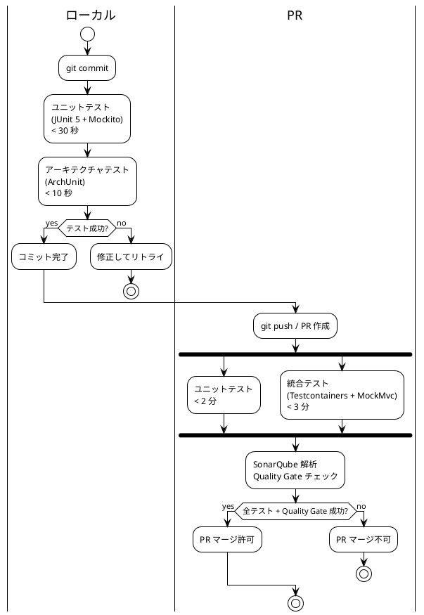

# 第 11 章：継続的インテグレーションが暴いたもの

| 項目 | 内容 |
| :--- | :--- |
| 検査 | `PostgreSQLIntegrationTestBase`／`H2DialectSmokeTest`／`ListQueryEfficiencyTest`／`RecentBusinessTime` |
| 対象 ADR | ADR-003（DB 戦略） |
| プラクティス | 継続的インテグレーション |
| 主題 | M2（動かして初めてずれが見える） |

## このプラクティスが解こうとした問題

設計の誤りは、設計レビューでは見つからないことがあります。**実行環境が違うと、同じコードが違う振る舞いをする**からです。

参照元は、この種の「環境が暴いた設計の問題」を繰り返し踏んでいます。本章はそれを 3 種類に分けて扱います。

## どう実践したか

検査を走らせる場所は 3 段に分かれています。



> 転記元：`design/test_strategy.md`（main ブランチ以降は省略）

**ローカルで走るのは 40 秒以内の検査だけです。** 実 DB を要する統合テストは PR に置かれます。第 10 章で見た検査群（ソースを走査するもの）はローカル側に入り、**書いた直後に赤くなります**。

### SQL の正しさを実 DB に固定する

```java
/**
 * <p><strong>SQL の正しさを検証する場所は実 PostgreSQL に固定する</strong>（ADR-003）。
 * ローカルのアプリ起動には H2 を使うが、Repository / Mapper のテストを H2 で書くと
 * 方言差（{@code TIMESTAMPTZ}・部分インデックス・{@code NUMERIC} の丸め）により
 * 「テストは緑だが本番で落ちる」状態になる。
 */
```

> 出典：`apps/.../test/.../support/PostgreSQLIntegrationTestBase.java`

Testcontainers でシングルトンコンテナを共有し、クラスごとの起動を避けています。実行時間が現実的でなくなるためです。

さらに構成の追加についても注意が書かれています。

> **`@Import` でテストごとに構成を足さない。** 構成が変わると Spring は**別のコンテキストを作る**。

**テスト基盤の設計判断が、Javadoc に理由つきで残っています。** この基底クラス自体をテストする `PostgreSQLTestBaseTest` も存在します。

### 方言差は両方向に起きる

ADR-003 の「H2 で判断しない」は正しい方針ですが、**逆方向の失敗が繰り返し起きました**。

```java
/**
 * すべてのクエリが <strong>H2 でも解釈できる SQL</strong> であることを確かめる。
 *
 * <p>ADR-003 は「SQL の正しさを H2 で判断しない」と定めており、それは正しい。
 * <strong>だが逆方向の失敗が繰り返し起きている。</strong> PostgreSQL でしか解釈できない
 * SQL を書くと、Testcontainers のテストは全部緑のまま、
 * <strong>ローカル起動でだけ画面が 500 になる</strong>。
 *
 * <p>IT2 と IT3 で 3 回踏んだ。
 *
 * <ol>
 *   <li>{@code setval}（マイグレーション）— ローカル起動が落ちた</li>
 *   <li>{@code INTERVAL 'N days'}（動作確認用データ）— ローカル起動が落ちた</li>
 *   <li>{@code LATERAL}（航路一覧のクエリ）— 画面が 500 になった</li>
 * </ol>
 *
 * <p>いずれも「画面を触ろうとした瞬間」まで分からなかった。**H2 を使う目的は
 * 画面を触るサイクルを短くすることであり、H2 で動かない SQL を書くとその目的が消える。**
 */
```

> 出典：`apps/.../test/.../support/H2DialectSmokeTest.java`

**3 回踏んでから検査になっています。** そして検査の性質が独特です — 結果の正しさは見ず、**すべてのクエリを H2 に投げて「解釈できるか」だけを確かめます**。

これはマイグレーションの構成にも反映されています。`common/`（41 本）と `postgresql/`・`h2/` に分離し、**方言固有のものだけを隔離**する形です。共通側に方言を書くと、本番のテストは全緑のままローカル起動だけが落ちます。

### 時間ではなく回数で測る

N+1 問題の検出も、環境依存を避ける形で設計されています。

```java
/**
 * <p><strong>時間で測らない。</strong> 経過時間のアサートは遅いマシンでは偽陽性、
 * 速いマシンでは<strong>N+1 を残したままでも緑になる</strong>。
 * <strong>「何回問い合わせたか」を数える。</strong>
 *
 * <p><strong>件数を変えて、増え方を見る。</strong> 1 件のときと 5 件のときで
 * 問い合わせ回数が変わらなければ、件数に比例していない。絶対値を固定すると、
 * 実装を少し変えるたびに落ちて意味を失う。
 */
```

> 出典：`apps/.../test/.../support/ListQueryEfficiencyTest.java`

**「経過時間のアサートは、脆弱な実装に戻しても緑になる」** — 検査は判別できなければ意味がありません。絶対値ではなく**増え方**を見るという設計も、実装の変更に耐えるための判断です。

IT16 で「計測がある」ことを検査にした時点で、**計測が無いものが 6 件あり**、`NOT_MEASURED_YET` として名前で据え置かれました。IT17 でそれを返しています。**据え置きを名前で残す**のは、第 10 章のラチェットと同じ発想です。

### 真夜中に壊れるテスト

最後は時刻です。

```java
/**
 * 「ついさっき」を表す作業日時を、<strong>日をまたがずに</strong>作る。
 *
 * <p><strong>{@code LocalDateTime.now(clock).minusHours(1)} は真夜中に壊れる。</strong>
 * 業務のタイムゾーンで 00:00〜00:59 に走らせると前日に落ち、
 * 「作業日時が追跡番号の発行日（今日）より前です」という<strong>正しい拒否</strong>を
 * 受ける。テストは赤くなるが、赤いのはテストの作り方であって実装ではない。
 *
 * <p><strong>実際に踏んだ</strong>（IT20 の品質ゲート。2026-08-13 00:09 に 20 件が落ちた）。
 * 6 か所に同じ書き方が散っていたため、ここへ寄せた ——
 * <strong>同じ間違いを 6 回書けるなら、7 回目も書ける。</strong>
 */
```

> 出典：`apps/.../test/.../support/RecentBusinessTime.java`

**20 イテレーション目、最後の品質ゲートで 20 件が落ちています。** 原因は実装ではなくテストの作り方でした。

しかもこのヘルパー自体が最初は間違っていました。

> 初版は `hoursAgo` だけを持ち、真夜中に丸めるときも順序を保とうとして時間の代わりに分だけ戻していた。**これは 01:00 で順序を逆転させた**（1 時間前は 00:00 へ丸められ、2 時間前は 00:58 になる。クローズ前レビュー H4）。

**「何時間前」と「順番」は別の要求である** — 集約に持たせるべき区別と同じものが、テストヘルパーにも要りました。

## モデルがどう変わったか

環境が暴いた問題は、いずれも**ドメインモデルの誤りではありません**。しかし業務ルールとしては誤った結果を生みます。

| 環境の差 | 業務としての誤り |
| :--- | :--- |
| H2 と PostgreSQL の方言差 | 航路一覧の画面が開けない |
| 業務タイムゾーンと UTC | 時差の分だけ「当日」の受付が拒否される時間帯ができる |
| 一覧の問い合わせ回数 | 件数が増えると業務時間内に一覧が開かなくなる |

**「正しく設計されたモデル」と「業務が回ること」の間には、実行環境という層があります。** 継続的インテグレーションはこの層を毎回踏み直す仕組みであり、だから設計レビューでは出ない問題が出ます。

## 働かなかったケース

### 検査ができるまで 3 回踏んだ

H2 の方言差は IT2 と IT3 で 3 回踏んでから検査になりました。**1 回目と 2 回目は「直して終わり」でした。**

3 回目で「これは繰り返す形だ」と判断されて検査になっていますが、**同じ形を 3 回踏むまで気づけない**のが実態です。第 12 章のふりかえりは、この判断を早めるための仕組みです。

### 環境固有の設定が最後まで残った

`jigErd`（実スキーマからの ER 図生成）は Docker と Graphviz に依存するため、通常の `test` から除外されています。**除外されたものは、誰かが手で実行しない限り走りません。**

第 9 章の「可視化は検査ではない」がここにも当てはまります。ER 図の生成は設計と実装の突合に使えますが、CI から外れている以上、突合は人の作業として残りました。

次章では、これらの失敗をどう次のイテレーションへ渡したかを扱います。

---

- 前の章：[第 10 章：設計ドキュメントを実行可能にする](10-executable-design-docs.md)
- 次の章：[第 12 章：ふりかえりが設計を変えた](12-retrospectives.md)
- [シリーズ概要](index.md)
