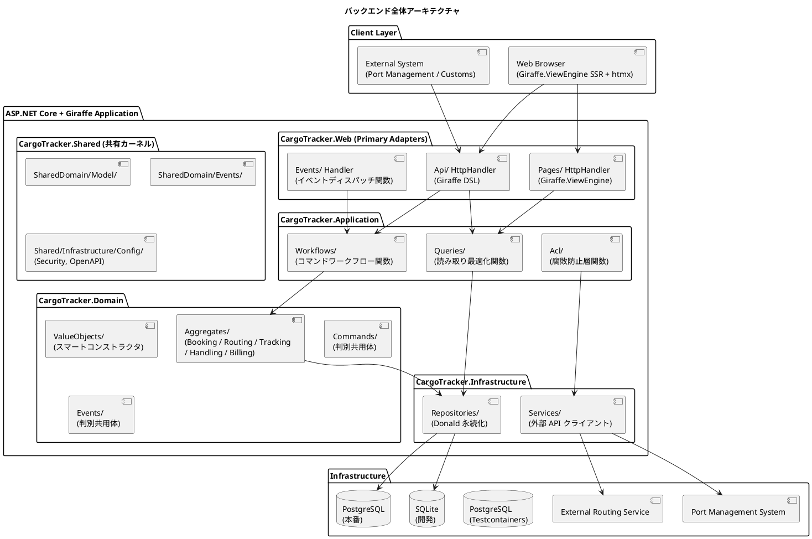
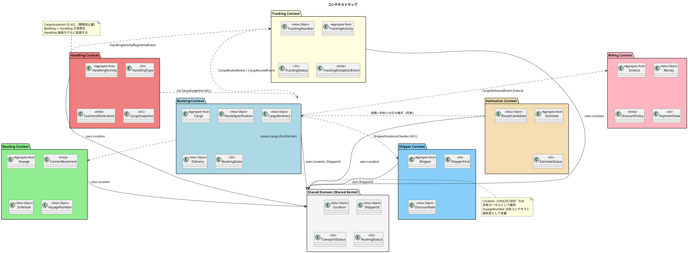
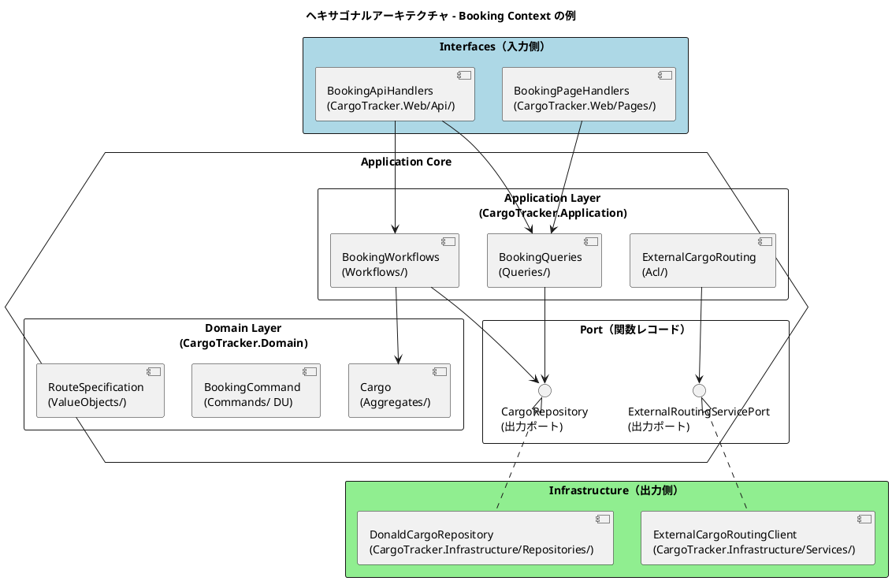
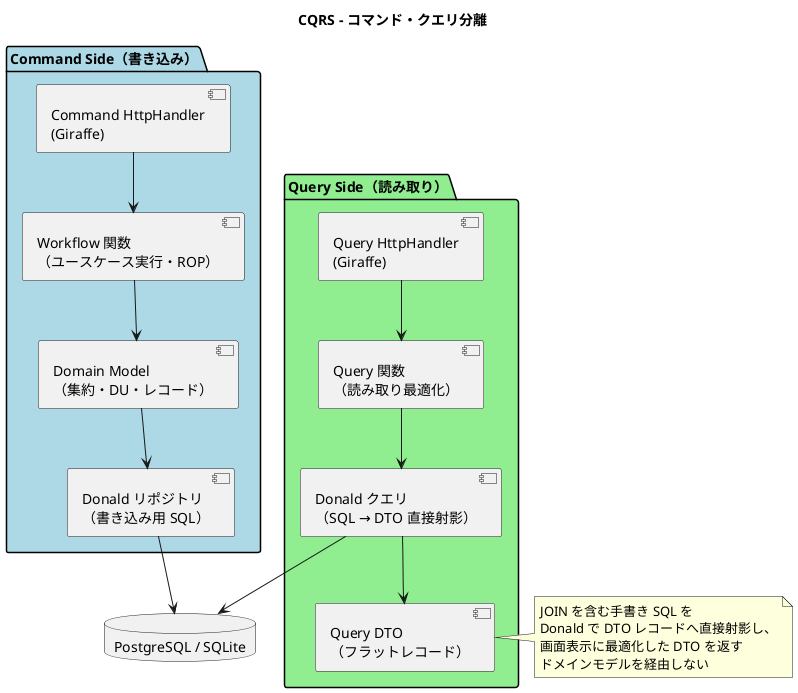
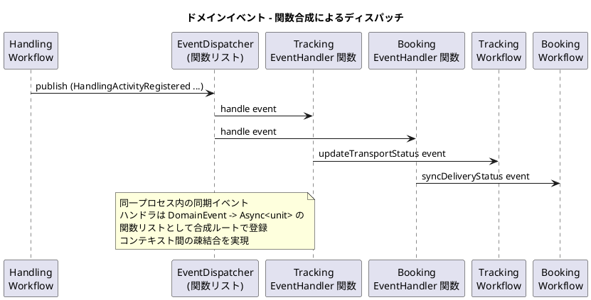
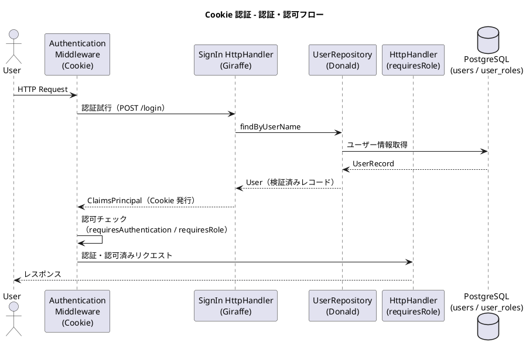
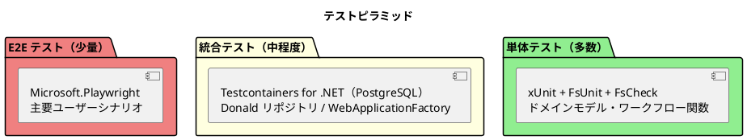

# バックエンドアーキテクチャ - 国際貨物輸送管理システム

## 概要

本ドキュメントでは、国際貨物輸送管理システムのバックエンドアーキテクチャを定義します。
C# (ASP.NET Core) 版設計のアーキテクチャ思想（DDD・ヘキサゴナル・イベント駆動）を継承しつつ、
F# 9 / .NET 10 (LTS) + Giraffe を基盤とした関数型スタイルの現代的な実装に移植します。

C# 版との最大の違いは、**判別共用体（DU）とレコードによる不変ドメインモデル**、
**Result 型による Railway Oriented Programming（ROP）**、
**関数合成による依存注入（Port = 関数レコード）** を中心に据える点です。
MediatR は使用せず、Command / Query / Event を判別共用体と関数合成で表現します。

## アーキテクチャパターン選択

### 業務領域カテゴリーの評価

| 評価軸 | 判定 | 根拠 |
| :--- | :--- | :--- |
| 業務領域カテゴリー | **中核の業務領域** | 国際貨物輸送は複雑なビジネスルール（通関、積み替え、例外処理）を持つ |
| データ構造の複雑さ | **複雑** | エンティティ間の関係が多く、コンテキスト間でデータを共有・変換する必要がある |
| 特殊要件 | **あり** | 金額を扱う（Billing Context）、監査記録が必要（荷役履歴）、状態遷移が厳密 |

### 選択したアーキテクチャパターン

上記評価から、以下の組み合わせを採用します。

- **関数型ドメインモデル**: ビジネスルールを判別共用体・レコード・スマートコンストラクタで表現し、不正状態を型で表現不可能にする（Make Illegal States Unrepresentable）
- **ポートとアダプター（ヘキサゴナルアーキテクチャ）**: Port を関数型インターフェース（レコード of functions）として定義し、ドメインを技術的関心事から独立させる。アダプターの差し替えは関数の部分適用で行う
- **CQRS（コマンドクエリ責務分離）**: Booking / Tracking の読み書き負荷特性の違いに対応。Command / Query を判別共用体で定義し、ワークフロー関数（`Command -> Async<Result<DomainEvent list, AppError>>`）として実装する

Billing Context は `Money` 値オブジェクト（最小通貨単位の整数）による金額管理を行いますが、初期フェーズではイベントソーシングは適用しません。

## 全体アーキテクチャ



## 境界付けられたコンテキスト

### コンテキストマップ

システムは 7 つの境界付けられたコンテキスト（Booking / Shipper / Routing / Tracking / Handling / Billing / Estimation）と、コンテキスト数には含めない Shared Kernel（Shared Domain）で構成します（詳細は [ドメインモデル設計](domain-model.md) を参照）。



> F# では `BookingState` / `TransportStatus` / `HandlingType` / `PaymentState` などの列挙的概念を
> 判別共用体（DU）で定義します。網羅的パターンマッチにより、状態遷移の考慮漏れをコンパイル時に検出できます。
> DU 名は [ドメインモデル設計](domain-model.md) を正とし、DB カラム名（例: `booking_status` の文字列判別子）との
> 対応付けは data-model 側の責務とします。

### 各コンテキストの説明

各コンテキストが実現するユーザーストーリー（US）は [ユーザーストーリー](../requirements/user_story.md) を参照してください。

#### 1. Booking Context（予約コンテキスト）

荷物予約の中核ロジックを担います。荷物の登録・経路割り当て・状態管理を責務とします。

| 要素 | 内容 |
| :--- | :--- |
| 集約ルート | `Cargo` |
| 主要概念 | `RouteSpecification`, `CargoItinerary`, `Delivery` |
| `BookingState` | `Preliminary` / `RouteProposed` / `Confirmed` / `TrackingIssued` / `InTransit` / `Delivered` / `Settled` / `Cancelled`（データ付き DU。詳細は [ドメインモデル設計](domain-model.md) 参照） |
| アクター | 荷主、営業担当者 |
| 対応 US | US04, US05, US06, US09, US11, US12, US13, US14 |

#### 2. Shipper Context（荷主コンテキスト）

荷主（個人・法人）の登録・管理を担います。法人荷主の契約番号・割引率を `ShipperKind` DU で型安全に保持します。

| 要素 | 内容 |
| :--- | :--- |
| 集約ルート | `Shipper` |
| 主要概念 | `ShipperKind`, `ShipperCode`, `DiscountRate` |
| アクター | 営業担当者 |
| 対応 US | US02, US03 |

#### 3. Routing Context（経路コンテキスト）

航路・運航スケジュールを管理します。外部経路システムとの統合を担います。

| 要素 | 内容 |
| :--- | :--- |
| 集約ルート | `Voyage` |
| 主要概念 | `CarrierMovement`, `Schedule`, `VoyageNumber` |
| アクター | 経路設計者、外部経路システム |
| 対応 US | US07, US08, US10, US24, US25 |

#### 4. Tracking Context（追跡コンテキスト）

荷物の現在状態・輸送ステータスを管理します。CQRS の読み取り側最適化が特に有効なコンテキストです。

| 要素 | 内容 |
| :--- | :--- |
| 集約ルート | `TrackingActivity` |
| 主要概念 | `TrackingNumber`, `TrackingStatus`, `TrackingExceptionEvent` |
| `TrackingStatus` | `NotReceived` / `Received` / `Loaded` / `OnboardCarrier` / `Unloaded` / `AwaitingClaim` / `Claimed` / `InException` / `Unknown`（Shared の `TransportStatus` と同一の 9 ケース。両者の変換は Tracking のアプリケーション層で行う。domain-model.md 参照） |
| アクター | 追跡管理者、荷主、荷受人 |
| 対応 US | US14, US17, US18, US19, US20 |

#### 5. Handling Context（荷役コンテキスト）

港湾・税関での荷役作業を記録します。`CargoSnapshot` ACL で Booking Context への依存を吸収します。

| 要素 | 内容 |
| :--- | :--- |
| 集約ルート | `HandlingActivity` |
| 主要概念 | `HandlingType`, `CustomsDeclaration`, `CargoSnapshot`（ACL） |
| アクター | 荷役作業員、港湾管理システム、税関 |
| 対応 US | US15, US16 |

#### 6. Billing Context（精算コンテキスト）

運賃・精算書の管理を担います。`Money` 値オブジェクトで金額を厳密に管理します。

| 要素 | 内容 |
| :--- | :--- |
| 集約ルート | `Invoice` |
| 主要概念 | `Money`, `DiscountPolicy`, `PaymentState` |
| アクター | 経理担当者、荷主、決済機関 |
| 対応 US | US21, US22, US23 |

#### 7. Estimation Context（見積コンテキスト）

輸送見積の作成・ルート候補の管理を担います。将来的に見積から予約への引き継ぎフローを実装予定です。

| 要素 | 内容 |
| :--- | :--- |
| 集約ルート | `Estimate` |
| 主要概念 | `RouteCandidate`, `WeightKg`, `EstimateStatus` |
| アクター | 営業担当者 |
| 対応 US | US01 |

#### 8. Shared Domain（共有ドメイン / コンテキスト数には含めない）

`Location`（UN/LOCODE）のみ共有カーネルとして維持します。`VoyageNumber` は各コンテキスト固有型として定義し、共有しません。

## ヘキサゴナルアーキテクチャ（ポートとアダプター）



### Port の定義方式

Port は **レコード of functions** として定義します。C# のインターフェース + モックライブラリに代わり、
テストでは関数リテラルを差し込むだけでスタブが完成します。

```fsharp
// CargoTracker.Booking.Application.Ports
type CargoRepository =
    { FindByBookingId: BookingId -> Async<Result<Cargo option, DataError>>
      Save: Cargo -> IDbTransaction -> Async<Result<unit, DataError>> }

type ExternalRoutingServicePort =
    { FetchCandidateRoutes: RouteSpecification -> Async<Result<CargoItinerary list, RoutingError>> }
```

### エラー型の階層と合成の境界

ドメイン層は `DomainError`（`ValidationError` / `InvalidStateTransition` / `BusinessRuleViolation` / `NotFound` の 4 ケース DU。[ドメインモデル設計](domain-model.md) を正とする）のみを返します。
`DataError`（永続化エラー：接続断・一意制約違反等）と `RoutingError`（外部経路サービスエラー）は
インフラ層のアダプター / Port が返す `DomainError` とは別の型であり、ドメイン層には持ち込みません。
両者は**アプリケーション層のワークフロー関数**で `AppError` に合成します。

```fsharp
// CargoTracker.Booking.Application.Errors
// アプリケーション層でドメイン / インフラのエラーを合成する
type AppError =
    | Domain of DomainError     // ドメイン層：検証・状態遷移・業務ルール違反・未検出
    | Data of DataError         // インフラ層：永続化エラー
    | Routing of RoutingError   // インフラ層：外部経路サービスエラー
```

変換の境界は次のとおりです。

| 層 | 扱うエラー型 | 変換 |
| :--- | :--- | :--- |
| Domain | `DomainError` | 変換なし（純粋関数の `Result` の Error レール） |
| Infrastructure（Port 実装） | `DataError` / `RoutingError` | 例外・HTTP エラーをアダプター内で各エラー型へ変換 |
| Application（Workflow） | `AppError` | `Result.mapError AppError.Domain` / `AsyncResult.mapError AppError.Data` 等で持ち上げて合成 |
| Interfaces（HttpHandler） | HTTP レスポンス | `AppError -> HTTP ステータス + エラー DTO` の変換関数を一元管理 |

### レイヤー責務一覧

> Practical DDD のパッケージ構造を F# のプロジェクト・モジュール構成に読み替えて準拠します。
> F# はファイル順コンパイルのため、依存方向がプロジェクトファイル（`.fsproj`）内のファイル順序としても強制されます。

| レイヤー | プロジェクト / モジュール | 責務 | 依存方向 |
| :--- | :--- | :--- | :--- |
| **Domain** | `CargoTracker.Domain`（`Aggregates`, `ValueObjects`, `Commands`, `Events`） | ビジネスルール・不変条件・集約・値オブジェクト・コマンド / イベント定義（すべて不変な DU / レコード） | 外部に依存しない（FsToolkit.ErrorHandling のみ） |
| **Application** | `CargoTracker.Application`（`Workflows`, `Queries`, `Ports`, `Acl`） | ワークフロー関数によるユースケース実行・Port 定義・ACL 経由の外部連携 | Domain のみ依存 |
| **Infrastructure** | `CargoTracker.Infrastructure`（`Repositories`, `Services`, `Migrations`） | 永続化（Donald + Npgsql / Microsoft.Data.Sqlite による手書き SQL マッピング）・外部サービスクライアント・DbUp スクリプト | Application / Domain に依存 |
| **Interfaces** | `CargoTracker.Web`（`Api`, `Pages`, `Views`, `Events`, `CompositionRoot`） | Giraffe HttpHandler・DTO・Giraffe.ViewEngine ビュー・イベントディスパッチ・合成ルート | Application に依存 |

### モジュール構成例（Booking Context）

> 名前空間・モジュール構成は垂直スライス（`CargoTracker.<Context>.<Layer>`、例: `CargoTracker.Booking.Domain`）を採用します（ADR-0001 参照）。

```
CargoTracker.Booking/
├── Domain/
│   ├── ValueObjects.fs          値オブジェクト（RouteSpecification, Delivery, Leg 等。スマートコンストラクタ）
│   ├── Commands.fs              コマンド DU（BookCargo, RouteCargo）
│   ├── Events.fs                イベント DU（CargoBooked, CargoRouted）
│   └── Aggregates.fs            集約ルート（Cargo, BookingId）と状態遷移関数
├── Application/
│   ├── Ports.fs                 出力ポート（CargoRepository, ExternalRoutingServicePort。関数レコード）
│   ├── Workflows.fs             コマンドワークフロー（bookCargo, routeCargo）
│   ├── Queries.fs               クエリ関数（findBooking, listBookings）
│   └── Acl.fs                   ACL（externalCargoRouting）
├── Infrastructure/
│   ├── CargoRepository.fs       リポジトリ実装（Donald + 手書き SQL）
│   └── ExternalRoutingClient.fs 外部サービス実装（HttpClient）
└── Interfaces/
    ├── Dto.fs                   リクエスト / レスポンス DTO と Command への変換関数
    ├── ApiHandlers.fs           REST HttpHandler（Giraffe DSL）
    ├── Views.fs                 Giraffe.ViewEngine ビュー
    ├── PageHandlers.fs          画面 HttpHandler
    └── EventHandlers.fs         イベントハンドラ関数（onCargoBooked）
```

### Giraffe ハンドラと合成ルートの例

```fsharp
// Interfaces/ApiHandlers.fs — HttpHandler は Workflows を部分適用して構築する
module CargoTracker.Booking.Interfaces.ApiHandlers

open Giraffe
open FsToolkit.ErrorHandling

let bookCargoHandler (workflow: BookCargoWorkflow) : HttpHandler =
    fun next ctx ->
        task {
            let! dto = ctx.BindJsonAsync<BookCargoRequest>()
            let result =
                dto
                |> Dto.toBookCargoCommand   // Result<BookCargoCommand, DomainError>（ValidationError ケース）
                |> Result.mapError AppError.Domain

            match! result |> AsyncResult.ofResult |> AsyncResult.bind workflow with
            | Ok events -> return! (setStatusCode 201 >=> json (Dto.ofEvents events)) next ctx
            | Error err -> return! (Errors.toResponse err) next ctx   // AppError -> HTTP レスポンス
        }

// Web/CompositionRoot.fs — Port の実装を部分適用で結線する（DI コンテナ非依存）
module CargoTracker.Web.CompositionRoot

let buildBookingRoutes (connFactory: DbConnectionFactory) : HttpHandler =
    let repository = DonaldCargoRepository.create connFactory
    let routing = ExternalRoutingClient.create httpClientFactory
    let publish = EventDispatcher.create [ TrackingEventHandlers.onCargoBooked ]

    let bookCargo = Workflows.bookCargo repository publish
    let routeCargo = Workflows.routeCargo repository routing publish

    subRoute "/api/v1/bookings" (
        choose [
            POST >=> route "" >=> ApiHandlers.bookCargoHandler bookCargo
            PUT >=> routef "/%s/route" (ApiHandlers.routeCargoHandler routeCargo)
            GET >=> routef "/%s" (ApiHandlers.getBookingHandler (Queries.findBooking repository))
        ])
```

## CQRS 設計



### CQRS 適用方針

- **コマンド側**: 判別共用体で定義したコマンドをワークフロー関数（`Command -> Async<Result<DomainEvent list, AppError>>`）で処理します。不変条件の検証は Result / Validation の合成（ROP）で行い、リポジトリ（Donald + 手書き SQL）で永続化します
- **クエリ側**: 集約を経由せず、クエリ関数が Donald で SQL を発行し画面表示用 DTO レコードへ直接射影して返します
- **CQRS が特に有効なコンテキスト**: Booking（一覧・詳細の頻繁な参照）、Tracking（リアルタイム状態確認）

### Railway Oriented Programming によるワークフロー

```fsharp
// Application/Workflows.fs
module CargoTracker.Booking.Application.Workflows

open FsToolkit.ErrorHandling

type BookCargoWorkflow = BookCargoCommand -> Async<Result<DomainEvent list, AppError>>

let bookCargo
    (repository: CargoRepository)
    (publish: DomainEvent -> Async<unit>)
    : BookCargoWorkflow =
    fun command ->
        asyncResult {
            // 1. 値オブジェクトの検証（DomainError -> AppError へ持ち上げ）
            let! routeSpec =
                RouteSpecification.create command.Origin command.Destination command.Deadline
                |> Result.mapError AppError.Domain

            // 2. 集約の生成（純粋関数。副作用なし）
            //    domain-model.md の標準シグネチャ
            //    book : ... -> Result<Cargo * DomainEvent list, DomainError> に従う
            let! cargo, events =
                Cargo.book command.BookingId command.ShipperId command.Consignee
                           routeSpec command.CargoType command.BookingAmount
                |> Result.mapError AppError.Domain

            // 3. 永続化（トランザクション内）→ コミット成功後にイベント発行
            do! repository.SaveWithTransaction cargo
                |> AsyncResult.mapError AppError.Data
            for event in events do
                do! publish event |> Async.map Ok

            return events
        }
```

## イベント駆動設計



### ドメインイベント一覧

| イベント | 発生元コンテキスト | 処理先コンテキスト | 内容 |
| :--- | :--- | :--- | :--- |
| `CargoBooked` | Booking | Tracking | 追跡番号の割り当てトリガー |
| `CargoRouted` | Booking | Tracking | 経路・旅程の確定をトラッキングに通知 |
| `HandlingActivityRegistered` | Handling | Tracking, Booking | 荷役作業登録 → 輸送ステータス同期 |
| `TrackingExceptionDetected` | Tracking | Booking, Notification | 例外検知 → 関係者への通知 |
| `InvoiceCreated` | Billing | Notification | 精算書発行 → 荷主への通知 |

### 関数合成による実装方針（MediatR 不使用）

```fsharp
// Shared/Events.fs — ドメインイベントは判別共用体で定義する
// 各ケースはプリミティブ / 共有型のみを持つ Payload レコードで構成し、
// Shared に配置することで BC → Event → 全 BC の循環参照を回避する（ADR-0002 参照）
type DomainEvent =
    | CargoBooked of CargoBookedPayload
    | CargoRouted of CargoRoutedPayload
    | HandlingActivityRegistered of HandlingActivityPayload
    | TrackingExceptionDetected of TrackingExceptionPayload
    | InvoiceCreated of InvoicePayload

// Shared/EventDispatcher.fs — ハンドラは関数リスト。合成ルートで登録する
module EventDispatcher =

    type EventHandler = DomainEvent -> Async<unit>

    /// 登録されたハンドラを順次実行するディスパッチ関数を返す
    let create (handlers: EventHandler list) : DomainEvent -> Async<unit> =
        fun event ->
            handlers
            |> List.map (fun handle -> handle event)
            |> Async.Sequential
            |> Async.Ignore

// Tracking/Interfaces/EventHandlers.fs — 部分適用済みワークフローを閉じ込める
module TrackingEventHandlers =

    let onHandlingRegistered (updateStatus: UpdateTransportStatusWorkflow) : EventHandler =
        fun event ->
            match event with
            | HandlingActivityRegistered payload ->
                updateStatus payload |> Async.Ignore
            | _ -> async.Return ()   // 関心外のイベントは無視（網羅的マッチ）
```

> **設計注意**: イベントは集約関数の戻り値（`Cargo * DomainEvent`）として蓄積し、
> Unit of Work のトランザクション（`IDbTransaction`）コミット成功後にディスパッチします
> （post-commit ディスパッチ。詳細は ADR-0002 を参照）。
> ワークフロー内から永続化前にディスパッチ関数を呼び出すことは禁止します。
> 高可用性が必要なシステムへ移行する際は Transactional Outbox パターンへの移行を検討してください。

## C# → F# + Giraffe 移行マッピング

| C# (ASP.NET Core) 技術 | F# + Giraffe 移行先 | 移行ポイント |
| :--- | :--- | :--- |
| Microsoft.Extensions.DependencyInjection（コンストラクタインジェクション） | 関数の部分適用による合成ルート（`CompositionRoot.fs`） | DI コンテナに頼らず、Port 実装を部分適用で結線する。ASP.NET Core DI は `IHttpClientFactory` 等インフラ層のみに限定 |
| ASP.NET Core MVC（`[ApiController]`, `[HttpGet]`, Controller） | Giraffe HttpHandler DSL（`route` / `routef` / `>=>`） | 属性ベースのルーティングから関数合成によるルーティングへ |
| MediatR（`INotification` / `IMediator.Publish()`） | 判別共用体イベント + ディスパッチ関数（`DomainEvent -> Async<unit>`） | 同一プロセス内の同期イベント。post-commit ディスパッチの規律（ADR-0002 参照）はそのまま継承する |
| Dapper（`SqlMapper.TypeHandler` / 自動マッピング） | **Donald + Npgsql / Microsoft.Data.Sqlite** | 手書き SQL は共通。自動マッピングから `IDataReader -> 'T` の明示的な読み取り関数へ移行し、スマートコンストラクタ経由でドメイン型を復元する |
| DataAnnotations + FluentValidation | スマートコンストラクタ + FsToolkit.ErrorHandling の `Validation` | 型駆動バリデーション。不正値は値オブジェクトの生成段階で `Error` として弾き、全エラーを適用的に収集する |
| ASP.NET Core Identity | ASP.NET Core Cookie 認証 + RBAC（Giraffe `requiresAuthentication` / `requiresRole`） | Identity は使用せず、Giraffe と統合しやすい Cookie 認証ミドルウェア + ポリシーで実装 |
| Razor ビュー（`.cshtml` + Tag Helper） | Giraffe.ViewEngine（F# DSL による型安全な HTML 生成） | テンプレートファイルではなく F# 関数としてビューを定義。部分ビューはビュー関数の合成に対応 |
| DbUp | DbUp | バージョン付き SQL スクリプトによる forward-only マイグレーション（変更なし） |
| DI ライフタイム（`Singleton` / `Scoped` / `Transient`） | 不変値 + 部分適用（実質すべて Singleton 相当） | 状態を持たない純粋関数が基本のため、ライフタイム管理自体が不要になる |
| `TransactionScope` / 明示的トランザクション | ADO.NET トランザクション（`IDbTransaction` / Unit of Work 関数） | 1 ユースケース = 1 トランザクションを原則とする（変更なし） |
| ASP.NET Core Health Checks | ASP.NET Core Health Checks | `/health` エンドポイントによる Liveness / Readiness 検査（変更なし） |

## プロジェクト構造

```
apps/cargo-tracker/src/CargoTracker.Web/          # ASP.NET Core + Giraffe ホスト（CargoTracker.sln）
└── （Api / Pages / Views / Events / CompositionRoot.fs / Program.fs）

名前空間ルート: CargoTracker
├── Booking/
│   ├── Domain/
│   │   ├── ValueObjects.fs    # BookingId, CargoSpecification, BookingState（DU）等
│   │   ├── Events.fs          # BookingRegistered, DomainEvent
│   │   └── Aggregates.fs      # Booking 集約と状態遷移関数
│   ├── Application/
│   │   ├── Ports.fs           # BookingRepository（出力ポート・関数レコード）
│   │   ├── Workflows.fs       # registerBooking ワークフロー
│   │   ├── Queries.fs         # findBooking クエリ関数
│   │   └── Acl.fs             # ShipperExistencePort / ACL Adapter
│   └── Infrastructure/
│       ├── BookingRepository.fs   # Donald による実装
│       ├── EventHandlers.fs       # Booking イベントハンドラ
│       └── Seed.fs                # 開発用シードデータ
├── Shipper/
│   ├── Domain/                # Shipper 集約、ShipperName、ContactInfo 等
│   ├── Application/           # registerShipper / findShipper
│   └── Infrastructure/        # ShipperRepository, Seed
├── Estimation/
│   ├── Domain/                # Estimate 集約、RouteCandidate、WeightKg 等
│   ├── Application/           # createEstimate / findEstimate
│   └── Infrastructure/        # EstimateRepository
├── Routing/                   # プレースホルダのみ（将来実装予定）
├── Tracking/                  # プレースホルダのみ（将来実装予定）
├── Handling/                  # プレースホルダのみ（将来実装予定）
├── Billing/                   # プレースホルダのみ（将来実装予定）
└── Shared/
    ├── Domain/                # 共有 ID 型（ShipperId など）・Location
    └── Infrastructure/
        ├── Config/            # SecurityConfig, OpenApiConfig
        ├── EventDispatcher.fs # イベントディスパッチ関数
        └── Web/               # ホーム画面ハンドラ
```

> スキーマ管理は DbUp で行い、バージョン付き SQL スクリプト（`Scripts/0001_xxx.sql`）をアプリケーション起動時または CI/CD から適用します。
> ログは Serilog、ヘルスチェックは ASP.NET Core Health Checks（`/health`）で提供します。
> F# はファイル順コンパイルのため、`.fsproj` のファイル順序がレイヤー依存方向（Domain → Application → Infrastructure → Interfaces）の静的な証明になります。

## API 設計方針

### REST API 設計原則

| 原則 | 内容 |
| :--- | :--- |
| **リソース指向** | URL はリソースを表す名詞。動詞は HTTP メソッドで表現する |
| **バージョニング** | `/api/v1/` プレフィックスでバージョンを管理する |
| **レスポンス形式** | JSON。エラーレスポンスは `{ "code": "BOOKING_NOT_FOUND", "message": "..." }` 形式。`AppError`（`Domain of DomainError` / `Data` / `Routing`）からエラーレスポンスへの変換関数を一元管理する |
| **ステータスコード** | 成功: 200/201/204、クライアントエラー: 400/404/409、サーバーエラー: 500 |
| **HATEOAS** | 初期フェーズでは適用しない |

### 主要エンドポイント（例）

| メソッド | パス | 説明 |
| :--- | :--- | :--- |
| `POST` | `/api/v1/bookings` | 貨物予約の登録 |
| `GET` | `/api/v1/bookings/{bookingId}` | 予約詳細の取得 |
| `PUT` | `/api/v1/bookings/{bookingId}/route` | 経路の割り当て |
| `GET` | `/api/v1/tracking/{trackingNumber}` | 追跡情報の取得 |
| `POST` | `/api/v1/handling` | 荷役作業の登録 |
| `GET` | `/api/v1/voyages` | 航路一覧の取得 |

## セキュリティ設計

### Cookie 認証 + RBAC による認証・認可

ASP.NET Core Identity は使用せず、Giraffe と統合しやすい **Cookie 認証ミドルウェア + ロールベース認可** を採用します。
ユーザーストアは Donald によるリポジトリ実装（`users` / `user_roles` テーブル）で自前管理します。



```fsharp
// Giraffe による認可の合成例
let requiresSales: HttpHandler =
    requiresRole "Sales" (RequestErrors.FORBIDDEN "権限がありません")

let bookingRoutes =
    POST >=> route "/api/v1/bookings" >=> requiresSales >=> bookCargoHandler workflow
```

### ロール設計

| ロール | 権限 | 対象ユーザー |
| :--- | :--- | :--- |
| `Shipper` | 予約照会・追跡照会 | 荷主 |
| `Sales` | 予約登録・経路割り当て | 営業担当者 |
| `Handler` | 荷役作業登録 | 荷役作業員 |
| `Tracker` | 追跡情報管理・例外対応 | 追跡管理者 |
| `Accountant` | 精算書管理 | 経理担当者 |
| `Admin` | 全機能 | システム管理者 |

## テスト戦略



### 各層のテスト方針

| テスト対象 | テスト種別 | 使用技術 | 方針 |
| :--- | :--- | :--- | :--- |
| ドメインモデル（集約・値オブジェクト） | 単体テスト | xUnit, FsUnit, FsCheck | 依存なしの純粋関数。ビジネスルールを網羅的にテストし、不変条件はプロパティベーステスト（FsCheck）で検証 |
| ワークフロー関数 | 単体テスト | xUnit, FsUnit | Port は関数レコードのため、モックライブラリ不要。関数リテラルでスタブを差し込みユースケースのフローをテスト |
| Donald リポジトリ | 統合テスト | Testcontainers for .NET, PostgreSQL | 実 DB への SQL を検証。スキーマを DbUp で適用 |
| Giraffe HttpHandler | 統合テスト | `WebApplicationFactory<Program>` | エンドポイントの入出力・バリデーション・Giraffe.ViewEngine のレンダリングをテスト |
| アーキテクチャ | アーキテクチャテスト | ArchUnitNET | Domain → Infrastructure の依存禁止等をアセンブリ解析で検証（ファイル順コンパイルと二重の防御） |
| E2E | E2E テスト | Microsoft.Playwright | 主要ユーザーシナリオ（予約 → 追跡 → 配達）を htmx 部分更新を含めて検証 |
