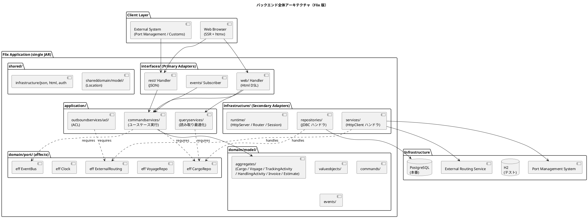
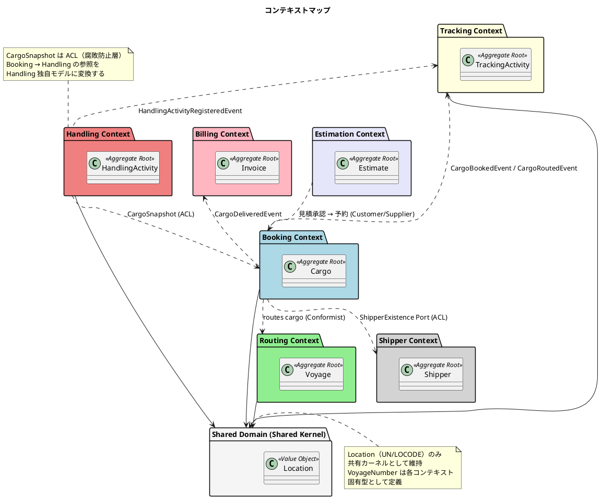
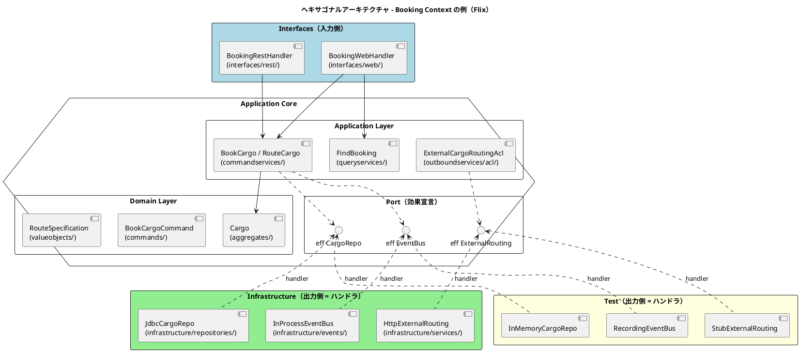
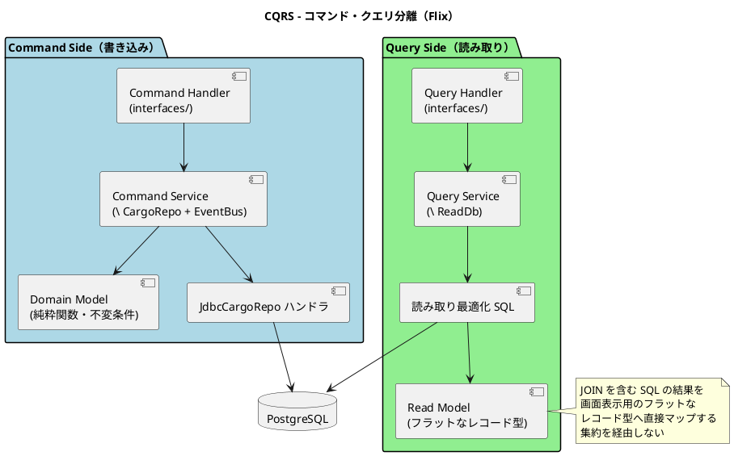
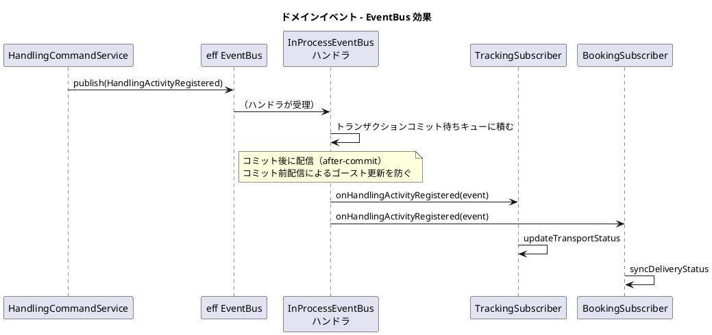
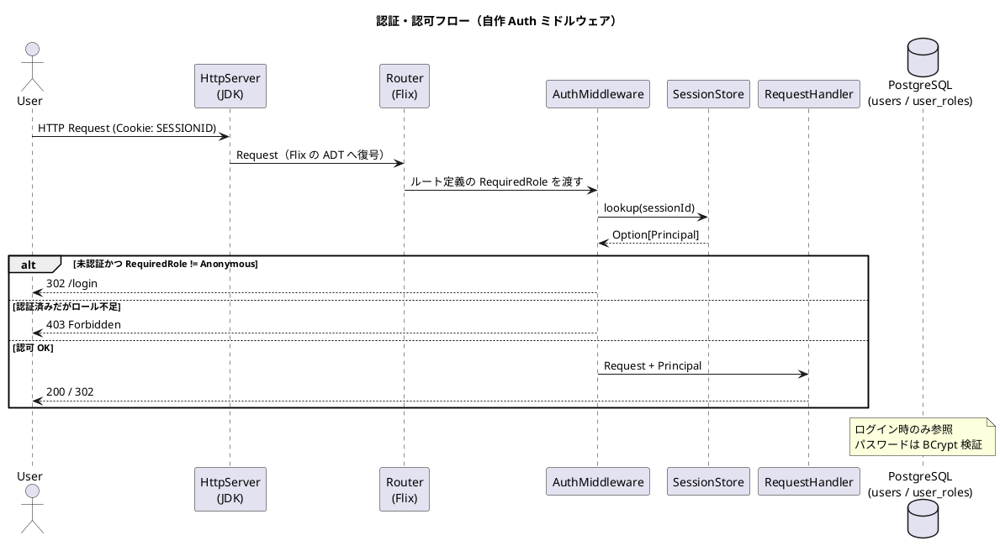
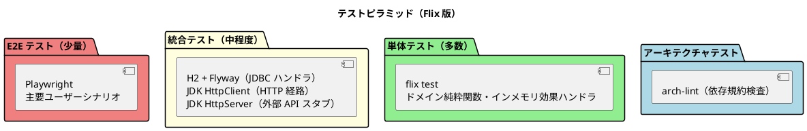

# バックエンドアーキテクチャ - 国際貨物輸送管理システム（Flix 版）

## 概要

本ドキュメントでは、国際貨物輸送管理システムのバックエンドアーキテクチャを定義する。
Jakarta EE 参考実装のアーキテクチャ思想（DDD・ヘキサゴナル・イベント駆動）を継承しつつ、
**Flix 単一言語 + Java 相互運用**を基盤とした関数型の実装に移植する。

Java/Spring 版との最大の相違は次の 2 点である。

| 観点 | Java/Spring 版 | Flix 版 |
| :--- | :--- | :--- |
| 出力ポートの表現 | `interface` + DI コンテナによる実装注入 | **代数的効果（effect）+ ハンドラ**による実装注入 |
| テストダブル | Mockito によるモック生成 | **インメモリ実装のハンドラ**を適用（追加ライブラリ不要） |

## アーキテクチャパターン選択

### 業務領域カテゴリーの評価

| 評価軸 | 判定 | 根拠 |
| :--- | :--- | :--- |
| 業務領域カテゴリー | **中核の業務領域** | 国際貨物輸送は複雑なビジネスルール（通関、積み替え、例外処理）を持つ |
| データ構造の複雑さ | **複雑** | エンティティ間の関係が多く、コンテキスト間でデータを共有・変換する必要がある |
| 特殊要件 | **あり** | 金額を扱う（Billing Context）、監査記録が必要（荷役履歴）、状態遷移が厳密 |

### 選択したアーキテクチャパターン

- **ドメインモデル**: ビジネスルールを ADT とその上の純粋関数にカプセル化する
- **ポートとアダプター（ヘキサゴナル）**: 出力ポートを効果として定義し、ドメイン層を技術的関心事から独立させる
- **CQRS**: Booking / Tracking の読み書き負荷特性の違いに対応し、クエリを読み取り最適化モデルで返す

Billing Context は `Money` 値オブジェクトで金額を管理するが、初期フェーズではイベントソーシングを適用しない。

### Flix 言語機能とアーキテクチャ要素の対応

| アーキテクチャ要素 | Flix の表現 | 効能 |
| :--- | :--- | :--- |
| 値オブジェクト | `enum` の単一ケース + スマートコンストラクタ（`Result` を返す） | 不正値をコンパイル境界で排除。等価性は構造的 |
| エンティティ・集約ルート | 不変レコード（`{ id = ..., status = ... }`）または `enum` | 状態遷移を「旧状態 → 新状態」を返す純粋関数として書ける |
| 状態（Status 系） | `enum`（列挙） | パターンマッチの網羅性検査により、状態追加時の考慮漏れをコンパイラが検出する |
| ドメインサービス | 純粋関数（効果なし） | 副作用がないことが型に現れる |
| 出力ポート（リポジトリ・ACL） | `eff`（効果宣言） | 実装の注入をハンドラで行う。DI コンテナ不要 |
| アプリケーションサービス | 効果を要求する関数（`\ CargoRepo + Clock`） | 必要な副作用が**シグネチャに列挙される**。隠れた依存が作れない |
| ドメインイベント | `enum DomainEvent` + `eff EventBus` | 発行先を効果として抽象化し、同期／非同期を後から差し替えられる |
| ビジネスルール違反 | `Result[DomainError, t]` | 例外に頼らず、失敗を型で強制的に扱わせる |
| 経路の到達可能性判定 | Datalog 制約（`#{ ... }` + `query`） | Routing Context の探索ロジックを宣言的に記述できる（詳細は Routing の節） |

## 全体アーキテクチャ



## 境界付けられたコンテキスト

コンテキストの分割・責務・ユビキタス言語は [ドメインモデル設計](domain-model.md) を正典とする。本節ではアーキテクチャ上の位置づけのみを示す。



| コンテキスト | 集約ルート | Flix モジュール | 主なアクター |
| :--- | :--- | :--- | :--- |
| Booking（予約） | `Cargo` | `CargoTracker/Booking` | 荷主、営業担当者 |
| Shipper（荷主） | `Shipper` | `CargoTracker/Shipper` | 営業担当者 |
| Estimation（見積） | `Estimate` | `CargoTracker/Estimation` | 営業担当者、荷主 |
| Routing（経路） | `Voyage` | `CargoTracker/Routing` | 経路設計者、外部経路システム |
| Tracking（追跡） | `TrackingActivity` | `CargoTracker/Tracking` | 追跡管理者、荷主、荷受人 |
| Handling（荷役） | `HandlingActivity` | `CargoTracker/Handling` | 荷役作業員、港湾管理システム、税関 |
| Billing（精算） | `Invoice` | `CargoTracker/Billing` | 経理担当者、決済機関 |
| Shared（共有） | - | `CargoTracker/Shared` | - |

## ヘキサゴナルアーキテクチャ（効果としてのポート）



### ポートの定義と注入（設計イメージ）

> 以下のコードは設計意図を示す擬似コードである。実際の構文は採用する Flix バージョンに合わせること。

```flix
/// 出力ポート = 効果宣言（domain/port/）
eff CargoRepo {
    def findByTrackingId(id: TrackingId): Option[Cargo]
    def store(cargo: Cargo): Unit
    def listAll(): List[Cargo]
}

eff EventBus {
    def publish(event: DomainEvent): Unit
}

eff Clock {
    def now(): Timestamp
}

/// アプリケーションサービス（application/commandservices/）
/// 必要な副作用がシグネチャにすべて現れる
def routeCargo(cmd: RouteCargoCommand): Result[DomainError, Cargo] \ CargoRepo + EventBus + Clock =
    match CargoRepo.findByTrackingId(cmd.trackingId) {
        case None        => Err(CargoNotFound(cmd.trackingId))
        case Some(cargo) =>
            // ドメイン層の純粋関数。効果を一切要求しない
            match Cargo.assignItinerary(cargo, cmd.itinerary, Clock.now()) {
                case Err(e)      => Err(e)
                case Ok(updated) =>
                    CargoRepo.store(updated);
                    EventBus.publish(CargoRouted(updated.trackingId, Clock.now()));
                    Ok(updated)
            }
    }

/// 本番の合成ルート（infrastructure/runtime/）
def runWithProductionAdapters(f: Unit -> a \ ef): a \ (ef - CargoRepo - EventBus - Clock) + IO =
    run {
        run {
            run f() with Jdbc.cargoRepoHandler(connectionPool)
        } with InProcess.eventBusHandler(subscribers)
    } with SystemClock.handler()
```

**この設計の要点**

1. ドメイン層（`Cargo.assignItinerary`）は効果を要求しない純粋関数であり、依存も副作用も持たない
2. アプリケーション層が要求する効果は関数シグネチャに列挙され、**隠れた依存を作れない**（DI コンテナのフィールド注入のような不透明さがない）
3. アダプタの差し替えは `run ... with handler` の入れ替えだけで済む。テストでは `InMemory.cargoRepoHandler(...)` を適用する
4. `Clock` を効果にすることで、期限判定などの時刻依存ロジックをテストで完全に固定できる

### レイヤー責務一覧

| レイヤー | モジュール | 責務 | 依存方向 |
| :--- | :--- | :--- | :--- |
| **Domain** | `domain/model/{aggregates,valueobjects,commands,events}`, `domain/port` | ビジネスルール・不変条件・集約・値オブジェクト・コマンド・ドメインイベント・**効果宣言（ポート）** | 外部に依存しない。`Shared` 以外の他コンテキストを参照しない |
| **Application** | `application/{commandservices,queryservices,outboundservices/acl}` | ユースケース実行・集約操作・ACL 経由の外部連携 | Domain のみ依存。効果を「要求」するがハンドラは知らない |
| **Infrastructure** | `infrastructure/{repositories,services,events,runtime}` | **効果ハンドラの実装**（JDBC・HttpClient・イベント配信）、HTTP サーバ起動、合成ルート | Application / Domain に依存 |
| **Interfaces** | `interfaces/{web,rest,rest/dto,rest/transform,events}` | ルーティング・リクエスト復号・`Html` 生成・JSON 変換・イベント購読 | Application に依存 |

### アーキテクチャ規約（`arch-lint` で機械検査する）

1. `domain/**` は `infrastructure/**`・`interfaces/**` を参照しない
2. `domain/**` は `java.**` を参照しない（Java 相互運用はインフラ層に閉じる）
3. `application/**` は `infrastructure/**` を参照しない（効果宣言経由でのみ結合する）
4. 異なる Bounded Context 間で直接参照しない（`Shared` の共有カーネル、ACL、イベントのみ）
5. 効果ハンドラの適用（`run ... with`）は `infrastructure/runtime/**` とテストコードにのみ現れる

> 規約 5 は特に重要である。アプリケーション層の途中でハンドラを適用すると、実装が固定され差し替え可能性が失われる。

## モジュール構成

```
apps/cargo-tracker/
├── flix.toml                       # 依存・パッケージ定義
├── src/
│   ├── Main.flix                   # エントリポイント（合成ルート呼び出し）
│   ├── booking/
│   │   ├── domain/
│   │   │   ├── model/
│   │   │   │   ├── Cargo.flix              # 集約ルート・状態遷移関数
│   │   │   │   ├── BookingStatus.flix      # enum
│   │   │   │   ├── RouteSpecification.flix # 値オブジェクト
│   │   │   │   ├── CargoItinerary.flix
│   │   │   │   └── Delivery.flix
│   │   │   ├── command/Commands.flix
│   │   │   ├── event/BookingEvents.flix
│   │   │   └── port/CargoRepo.flix         # eff 宣言
│   │   ├── application/
│   │   │   ├── commandservices/BookCargo.flix
│   │   │   ├── queryservices/FindBooking.flix
│   │   │   └── outboundservices/acl/ShipperExistenceAcl.flix
│   │   ├── infrastructure/
│   │   │   ├── repositories/JdbcCargoRepo.flix   # eff ハンドラ
│   │   │   └── mapper/CargoRow.flix              # ResultSet ⇄ ADT
│   │   └── interfaces/
│   │       ├── web/BookingPages.flix             # Html DSL による画面
│   │       ├── rest/BookingApi.flix
│   │       └── events/BookingSubscribers.flix
│   ├── shipper/        ...（同一構造）
│   ├── estimation/     ...
│   ├── routing/        ...
│   ├── tracking/       ...
│   ├── handling/       ...
│   ├── billing/        ...
│   └── shared/
│       ├── domain/model/Location.flix
│       └── infrastructure/
│           ├── http/{Server.flix, Router.flix, Request.flix, Response.flix}
│           ├── html/{Html.flix, Layout.flix, Components.flix}
│           ├── json/{Encode.flix, Decode.flix}
│           ├── db/{Pool.flix, Tx.flix, Migration.flix}
│           ├── auth/{Session.flix, Password.flix, Csrf.flix}
│           └── runtime/Composition.flix          # 全ハンドラの合成ルート
├── test/
│   ├── booking/...                 # ドメイン単体・アプリ（インメモリハンドラ）
│   ├── integration/...             # H2 + 実 HTTP
│   └── support/{InMemoryHandlers.flix, Fixtures.flix}
└── resources/
    ├── db/migration/               # Flyway SQL（V1__init.sql 等）
    └── static/                     # bootstrap.min.css, htmx.min.js
```

## CQRS 設計



### CQRS 適用方針

- **コマンド側**: 集約（ADT）を通じて状態を遷移させる。不変条件は `Result[DomainError, Cargo]` で表現し、`Ok` の場合のみ `CargoRepo.store` する
- **クエリ側**: 集約を再構築せず、`ReadDb` 効果で JOIN クエリを実行し、画面表示用のフラットなレコード型（例：`{ trackingId = String, origin = String, status = String, ... }`）を返す
- **効果の分離**: 書き込み用 `CargoRepo` と読み取り用 `ReadDb` を別効果にすることで、「クエリサービスが誤って書き込む」ことを型レベルで防ぐ
- **CQRS が特に有効なコンテキスト**: Booking（一覧・詳細の頻繁な参照）、Tracking（リアルタイム状態確認）

## トランザクション設計

Flix には宣言的トランザクション（`@Transactional`）が存在しないため、**スコープ関数**で明示的に表現する。

```flix
/// shared/infrastructure/db/Tx.flix
/// 1 ユースケース = 1 トランザクション。ハンドラ内で BEGIN / COMMIT / ROLLBACK を制御する
def transactional(f: Unit -> Result[e, a] \ ef): Result[e, a] \ ef + IO
```

| 規約 | 内容 |
| :--- | :--- |
| 境界 | アプリケーションサービス 1 呼び出し = 1 トランザクション。`interfaces/` 層で `transactional` を巻く |
| ロールバック | `Err(_)` 返却時および例外送出時にロールバックする |
| 集約をまたぐ更新 | 禁止。1 トランザクションで更新する集約は 1 つとし、他集約への波及はドメインイベントで行う |
| イベント発行時点 | `EventBus.publish` はトランザクション内で「発行予約」だけを行い、**コミット後**に購読者へ配信する（後述） |

## イベント駆動設計



### ドメインイベント一覧

| イベント | 発生元 | 処理先 | 内容 |
| :--- | :--- | :--- | :--- |
| `EstimateApproved` | Estimation | Booking | 見積承認 → 予約登録トリガー |
| `CargoBooked` | Booking | Tracking | 追跡番号の割り当てトリガー |
| `CargoRouted` | Booking | Tracking | 経路・旅程の確定を追跡へ通知 |
| `HandlingActivityRegistered` | Handling | Tracking, Booking | 荷役作業登録 → 輸送ステータス同期 |
| `TrackingExceptionDetected` | Tracking | Booking, Notification | 例外検知 → 関係者への通知 |
| `CargoDelivered` | Booking | Billing | 配送完了 → 精算書作成トリガー |
| `InvoiceCreated` | Billing | Notification | 精算書発行 → 荷主への通知 |

### イベント購読の登録方式

購読者は `infrastructure/runtime/Composition.flix` の 1 箇所で明示的に登録する。
アノテーションスキャンのような暗黙の登録は行わない。

```flix
def subscribers(): List[DomainEvent -> Unit \ CargoRepo + TrackingRepo + Clock] =
    Tracking.Subscribers.all() ::: Booking.Subscribers.all() ::: Billing.Subscribers.all()
```

> **将来の拡張**: 高可用性が必要になった時点で、`InProcessEventBus` ハンドラを Transactional Outbox 実装に差し替える。
> 購読側・発行側のコードは変更不要である（効果の宣言が変わらないため）。

## Routing Context における Datalog の活用

Flix 固有の機能として、**経路の到達可能性判定と積み替え制約の検証**に Datalog 制約解決を用いる。

```flix
/// 航海スケジュールから到達可能性を導出する
def reachability(movements: List[CarrierMovement]): #{ Edge(String, String), Reachable(String, String) } =
    let facts = movements |> List.map(m -> #{ Edge(m.departure, m.arrival). });
    let rules = #{
        Reachable(x, y) :- Edge(x, y).
        Reachable(x, z) :- Reachable(x, y), Edge(y, z).
    };
    List.foldLeft((acc, f) -> acc <+> f, rules, facts)

/// RouteSpecification を満たす経路が存在するか
def isRoutable(spec: RouteSpecification, movements: List[CarrierMovement]): Bool =
    let db = reachability(movements);
    not List.isEmpty(query db select (o, d) from Reachable(o, d)
                     where o == spec.origin and d == spec.destination)
```

| 適用箇所 | 内容 |
| :--- | :--- |
| 到達可能性判定 | 出発地から目的地へ到達する航海の組み合わせが存在するかを推移閉包で判定する |
| 積み替え整合性検証 | 旅程の隣接する Leg で「降ろす港 = 次に積む港」が成立するかを制約として表現する |
| 適用しない箇所 | 最適経路の選択（コスト最小化）。これは外部経路システムの責務とし、`ExternalRouting` 効果で委譲する |

> **注意**: Datalog の利用は Routing Context 内に閉じる。ドメインモデルの外部インターフェース（`Voyage` の公開関数）は
> 通常の ADT で表現し、Datalog は実装詳細に留める。これにより他コンテキストは Datalog を意識しない。

## API 設計方針

### REST API 設計原則

| 原則 | 内容 |
| :--- | :--- |
| **リソース指向** | URL はリソースを表す名詞。動詞は HTTP メソッドで表現する |
| **バージョニング** | `/api/v1/` プレフィックス |
| **レスポンス形式** | JSON。エラーは `{ "code": "CARGO_NOT_FOUND", "message": "..." }` 形式 |
| **ステータスコード** | 成功: 200/201/204、クライアントエラー: 400/404/409、サーバーエラー: 500 |
| **エラーの発生源** | `DomainError`（ADT）から HTTP ステータス・コードへの変換表を 1 箇所（`shared/infrastructure/http/ErrorMapping.flix`）に集約する |
| **HATEOAS** | 初期フェーズでは適用しない |

### 主要エンドポイント（例）

| メソッド | パス | 説明 | 必要ロール |
| :--- | :--- | :--- | :--- |
| `POST` | `/api/v1/bookings` | 貨物予約の登録 | `Sales` |
| `GET` | `/api/v1/bookings/{trackingId}` | 予約詳細の取得 | `Sales`, `Shipper` |
| `PUT` | `/api/v1/bookings/{trackingId}/route` | 経路の割り当て | `Sales` |
| `GET` | `/api/v1/tracking/{trackingId}` | 追跡情報の取得 | `Tracker`, `Shipper` |
| `POST` | `/api/v1/handling` | 荷役作業の登録 | `Handler` |
| `GET` | `/api/v1/voyages` | 航路一覧の取得 | `Sales`, `Tracker` |
| `POST` | `/api/v1/estimates/{estimateId}/approve` | 見積の承認 | `Shipper`, `Sales` |
| `GET` | `/api/v1/billing/invoices/{invoiceId}` | 精算書詳細の取得 | `Accountant` |

### ルーティングの表現

ルーティング表は ADT のリストとして定義し、**認可要件をルート定義の一部**として持たせる。

```flix
enum Route {
    case Route(HttpMethod, PathPattern, RequiredRole, RequestHandler)
}

def routes(): List[Route] =
    Route(Post, path"/api/v1/bookings",              RoleRequired(Sales),   Booking.Api.create) ::
    Route(Get,  path"/api/v1/bookings/{trackingId}", RoleAnyOf(Sales :: Shipper :: Nil), Booking.Api.detail) ::
    Route(Get,  path"/public/tracking/{trackingId}", Anonymous,             Tracking.Public.show) ::
    Nil
```

この形により「認可設定の付け忘れ」がコンパイルエラー（`RequiredRole` の欠落）になり、
ルーティング表そのものを単体テストで検証できる（[テスト戦略](test_strategy.md) 参照）。

## セキュリティ設計

### 認証・認可フロー



### ロール設計

| ロール（Flix `enum Role`） | 権限 | 対象ユーザー |
| :--- | :--- | :--- |
| `Shipper` | 予約照会・追跡照会・見積承認 | 荷主 |
| `Sales` | 見積作成・予約登録・経路割り当て | 営業担当者 |
| `Handler` | 荷役作業登録 | 荷役作業員 |
| `Tracker` | 追跡情報管理・例外対応 | 追跡管理者 |
| `Accountant` | 精算書管理 | 経理担当者 |
| `Admin` | 全機能 | システム管理者 |

### 主要な防御

| 対策 | 実装 |
| :--- | :--- |
| パスワード | jBCrypt（コスト 12）。`Password` 効果のハンドラ内に閉じる |
| セッション | `SecureRandom` 由来の 256bit ID、`HttpOnly` / `Secure` / `SameSite=Lax` Cookie、サーバ側ストアで失効管理 |
| CSRF | セッション単位トークン。`Html.form` が hidden フィールドを自動付与し、ミドルウェアが状態変更メソッドで検証する |
| SQL インジェクション | `PreparedStatement` のみ使用。文字列連結による SQL 組み立てを `arch-lint` で禁止検査する |
| XSS | `Html` DSL がテキストノードを既定でエスケープする。エスケープ回避は `Html.rawUnsafe` のみで可能とし、使用箇所をレビュー必須にする |

## Jakarta EE / Spring → Flix 移行マッピング

| Jakarta EE / Spring | Flix 版の対応 | 移行ポイント |
| :--- | :--- | :--- |
| CDI / Spring DI（`@Inject`, `@Service`） | 効果宣言 + ハンドラ適用 | 実行時の依存解決がなくなり、依存が型に現れる |
| JAX-RS / Spring MVC（`@Path`, `@GetMapping`） | `Route` ADT のルーティング表 | アノテーションスキャンをやめ、明示的なリストにする |
| CDI Events / `ApplicationEventPublisher` | `eff EventBus` | 発行側の記述はほぼ等価。配信方式はハンドラ差し替えで変更可能 |
| JPA / MyBatis | `java.sql` 相互運用 + 手書きマッパー | ORM を持たない。SQL を明示管理する（CQRS と相性が良い） |
| Bean Validation（`@Valid`） | スマートコンストラクタ + `Result` | 検証は値オブジェクト生成時に行い、不正値を型から排除する |
| Spring Security | 自作 `Auth` ミドルウェア | 認可をルーティング表の宣言として持つ |
| `@Transactional` | `transactional` スコープ関数 | 境界を明示的に書く |
| Thymeleaf | `Html` DSL | テンプレートを型付き関数として書く |
| Mockito | インメモリ効果ハンドラ | テストダブルが言語機能で得られる |
| ArchUnit | `arch-lint`（自作） | `use` / `import` 宣言の静的走査 |

## テスト戦略（概要）



| テスト対象 | 種別 | 手段 | 方針 |
| :--- | :--- | :--- | :--- |
| ドメインモデル（集約・値オブジェクト） | 単体 | `flix test` | 効果を一切要求しない純粋関数。ビジネスルールを網羅する |
| アプリケーションサービス | 単体 | インメモリ効果ハンドラ | ユースケースのフローと発行イベントを検証する |
| JDBC ハンドラ・SQL | 統合 | H2 + Flyway | 実 SQL を検証。CI 日次で実 PostgreSQL にも流す |
| ルーティング・認可 | 統合 | JDK `HttpClient` | ロール別のアクセス可否を全ルートで検証する |
| 外部 API 連携（ACL） | 契約 | JDK `HttpServer` スタブ | リクエスト／レスポンス契約を固定する |
| アーキテクチャ規約 | 静的検査 | `arch-lint` | 前掲の 5 規約を CI で強制する |
| 主要シナリオ | E2E | Playwright | 見積 → 予約 → 経路 → 荷役 → 追跡 → 精算 |

詳細は [テスト戦略](test_strategy.md) を参照すること。

## このアーキテクチャのリスクと対処

| リスク | 影響 | 対処 |
| :--- | :--- | :--- |
| Flix が 0.x 系であり破壊的変更が入る | 全モジュールのビルド不能 | `flix.toml` でバージョン固定。アップグレードは独立コミット + フルテストとし、結果を ADR に記録する |
| Web・セキュリティ基盤を自作する | 実装欠陥、開発コスト増 | 自作範囲を JDK 標準の薄いラッパに限定。OWASP ASVS L1 チェックリストでレビュー。セキュリティ回帰テストを必須化 |
| カバレッジ計測不能 | 品質ゲートの空洞化 | 行カバレッジを使わず、ビジネスルール ⇄ テストのトレーサビリティ表で網羅を担保 |
| 効果の要求がシグネチャに伝播し記述が冗長になる | 可読性低下 | 効果の粒度をポート単位に保ち、乱立させない。共通の組み合わせは型別名で束ねる |
| 開発者の学習コスト（代数的効果・Datalog） | 立ち上がりの遅延 | ウォーキングスケルトンで 1 ユースケースを縦に貫き、パターンを確立してから横展開する |
