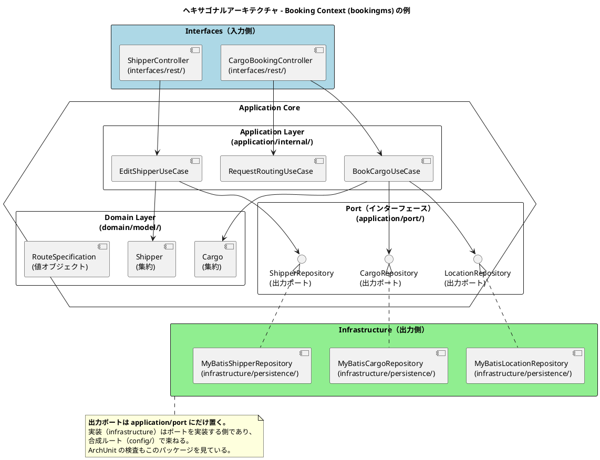
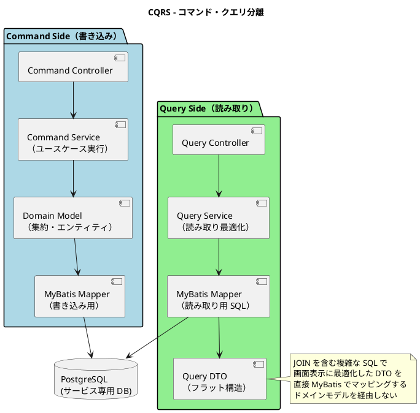
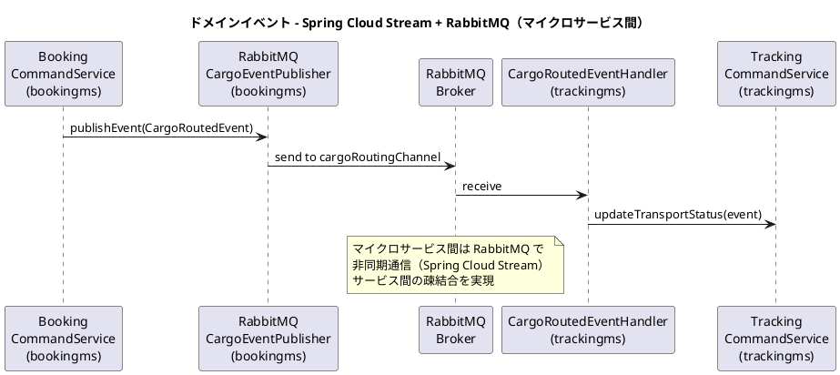
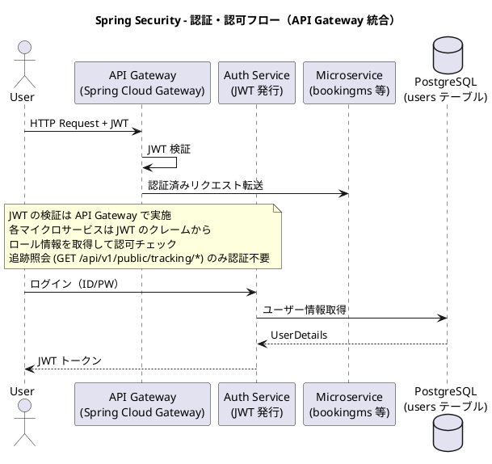
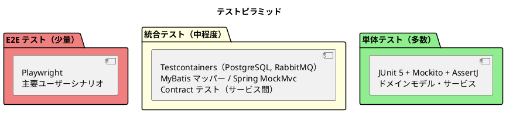

# バックエンドアーキテクチャ - 国際貨物輸送管理システム

## 概要

本ドキュメントでは、国際貨物輸送管理システムのバックエンドアーキテクチャを定義する。
Practical DDD in Enterprise Java（Chapter 5）のマイクロサービスアーキテクチャ思想（DDD・ヘキサゴナル・イベント駆動・CQRS）を継承しつつ、
Spring Boot / Java / Gradle を基盤とし、データアクセスには MyBatis を採用した現代的な実装とする。

本設計は take-3 のマイクロサービス設計を基礎とし、本プロジェクトの要件定義で追加された
通関手続き（UC21）・予約キャンセル承認（UC22）・誤配検知と経路再設計（US28）・アカウント保護（US31）を反映している。

## アーキテクチャパターン選択

### 業務領域カテゴリーの評価

| 評価軸 | 判定 | 根拠 |
| :--- | :--- | :--- |
| 業務領域カテゴリー | **中核の業務領域** | 国際貨物輸送は複雑なビジネスルール（経路設計、積み替え、通関、例外処理）を持つ |
| データ構造の複雑さ | **複雑** | エンティティ間の関係が多く、コンテキスト間でデータを共有・変換する必要がある |
| 特殊要件 | **あり** | 金額を扱う（Billing Context）、監査記録が必要（荷役履歴・通関・キャンセル承認）、状態遷移が厳密 |

### 選択したアーキテクチャパターン

上記評価から、以下の組み合わせを採用する。

- **ドメインモデル**: ビジネスルールをドメインオブジェクトにカプセル化し、手続き的なロジックを排除する
- **ポートとアダプター（ヘキサゴナルアーキテクチャ）**: ドメインを技術的関心事から独立させ、テスト容易性を確保する
- **CQRS（コマンドクエリ責務分離）**: Booking / Tracking の読み書き負荷特性の違いに対応し、クエリを読み取り最適化モデルで返す
- **マイクロサービス**: 各バウンデッドコンテキストを独立したデプロイ単位とし、スケーラビリティと独立性を確保する

Billing Context は `Money` 値オブジェクトによる金額管理を行うが、初期フェーズではイベントソーシングは適用しない。

## 全体アーキテクチャ

```plantuml
@startuml
title バックエンド全体アーキテクチャ（マイクロサービス）

package "Client Layer" {
  [Web Browser\n(React SPA)]
  [External System\n(Port Management / Customs)]
}

package "API Gateway (gatewayms)" {
  [Spring Cloud Gateway\n(@Route + JWT Filter)]
}

package "Auth Microservice (authms)" {
  [Auth REST Controller] as auth_rest
  [Domain Model\n(User, Role, AccountLock)] as auth_domain
  [MyBatis Repository] as auth_repo
  [JWT Provider] as jwt
}

package "Booking Microservice (bookingms)" {
  package "interfaces/" {
    [rest/ Controller\n(@RestController)] as booking_rest
    [events/ Handler\n(@EventListener)] as booking_events
  }
  package "application/" {
    [internal/\n(ユースケース)] as booking_cmd
    [port/\n(出力ポート)] as booking_qry
    [internal/ ACL] as booking_acl
  }
  package "domain/model/" {
    [Cargo, Shipper\n(集約)] as booking_agg
  }
  package "infrastructure/" {
    [persistence/\n(MyBatis)] as booking_repo
    [messaging/\n(RabbitMQ・未着手)] as booking_broker
  }
}

package "Routing Microservice (routingms)" {
  [REST Controller] as routing_rest
  [Domain Model\n(Voyage)] as routing_domain
  [MyBatis Repository] as routing_repo
}

package "Tracking Microservice (trackingms)" {
  [REST Controller] as tracking_rest
  [Event Subscriber] as tracking_sub
  [Domain Model\n(TrackingActivity)] as tracking_domain
  [MyBatis Repository] as tracking_repo
}

package "Handling Microservice (handlingms)" {
  [REST Controller] as handling_rest
  [Domain Model\n(HandlingActivity,\nCustomsDeclaration)] as handling_domain
  [MyBatis Repository] as handling_repo
  [RabbitMQ Publisher] as handling_broker
}

package "Billing Microservice (billingms)" {
  [REST Controller] as billing_rest
  [Event Subscriber] as billing_sub
  [Domain Model\n(Invoice)] as billing_domain
  [MyBatis Repository] as billing_repo
}

queue "RabbitMQ\n(Message Broker)" as MQ

database "auth_db\n(PostgreSQL)" as ADB
database "booking_db\n(PostgreSQL)" as BDB
database "routing_db\n(PostgreSQL)" as RDB
database "tracking_db\n(PostgreSQL)" as TDB
database "handling_db\n(PostgreSQL)" as HDB
database "billing_db\n(PostgreSQL)" as BIDB

[Web Browser\n(React SPA)] --> [Spring Cloud Gateway\n(@Route + JWT Filter)]
[External System\n(Port Management / Customs)] --> [Spring Cloud Gateway\n(@Route + JWT Filter)]

[Spring Cloud Gateway\n(@Route + JWT Filter)] --> auth_rest
[Spring Cloud Gateway\n(@Route + JWT Filter)] --> booking_rest
[Spring Cloud Gateway\n(@Route + JWT Filter)] --> routing_rest
[Spring Cloud Gateway\n(@Route + JWT Filter)] --> tracking_rest
[Spring Cloud Gateway\n(@Route + JWT Filter)] --> handling_rest
[Spring Cloud Gateway\n(@Route + JWT Filter)] --> billing_rest

auth_repo --> ADB

booking_acl --> routing_rest : REST API（同期）
booking_broker --> MQ : TrackingNumberIssuedEvent / CargoRoutedEvent /\nCargoCancelledEvent
handling_broker --> MQ : HandlingActivityRegisteredEvent /\nCustomsStatusChangedEvent
MQ --> tracking_sub : イベント購読
MQ --> billing_sub : イベント購読

booking_repo --> BDB
routing_repo --> RDB
tracking_repo --> TDB
handling_repo --> HDB
billing_repo --> BIDB

@enduml
```



## 境界付けられたコンテキスト

### コンテキストマップ

```plantuml
@startuml
title コンテキストマップ（マイクロサービス境界）

package "Booking Context\n(bookingms)" as booking #LightBlue {
  class Cargo <<Aggregate Root>>
  class RouteSpecification <<Value Object>>
  class CargoItinerary <<Value Object>>
  class Delivery <<Value Object>>
  class BookingStatus <<Enum>>
  class CancellationRequest <<Entity>>
}

package "Routing Context\n(routingms)" as routing #LightGreen {
  class Voyage <<Aggregate Root>>
  class CarrierMovement <<Entity>>
  class Schedule <<Value Object>>
  class VoyageNumber <<Value Object>>
}

package "Tracking Context\n(trackingms)" as tracking #LightYellow {
  class TrackingActivity <<Aggregate Root>>
  class TrackingNumber <<Value Object>>
  class TransportStatus <<Enum>>
  class TrackingExceptionEvent <<Entity>>
}

package "Handling Context\n(handlingms)" as handling #LightCoral {
  class HandlingActivity <<Aggregate Root>>
  class HandlingType <<Enum>>
  class CustomsDeclaration <<Aggregate Root>>
  class CustomsStatus <<Enum>>
  class CargoSnapshot <<ACL>>
}

package "Billing Context\n(billingms)" as billing #LightPink {
  class Invoice <<Aggregate Root>>
  class Money <<Value Object>>
  class DiscountPolicy <<Entity>>
  class PaymentStatus <<Enum>>
}

package "Auth Context\n(authms)" as auth #LightSkyBlue {
  class User <<Aggregate Root>>
  class Role <<Entity>>
  class Password <<Value Object>>
  class Email <<Value Object>>
  class AccountLock <<Value Object>>
}

package "Shared Domain\n(共有カーネル)" as shared #WhiteSmoke {
  class Location <<Value Object>>
}

booking --> shared : uses Location
routing --> shared : uses Location
tracking --> shared : uses Location
handling --> shared : uses Location

auth <.. booking : JWT 検証（API Gateway 経由）
auth <.. tracking : JWT 検証（API Gateway 経由）
booking ..> routing : REST API（同期）\nroutes cargo (Conformist)
handling ..> booking : via CargoSnapshot (ACL)
tracking <.. booking : TrackingNumberIssuedEvent / CargoRoutedEvent /\nCargoCancelledEvent (RabbitMQ 非同期)
tracking <.. handling : HandlingActivityRegisteredEvent /\nCustomsStatusChangedEvent (RabbitMQ 非同期)
billing <.. tracking : CargoDeliveredEvent\n(RabbitMQ 非同期)

note top of handling
  CargoSnapshot は ACL（腐敗防止層）
  Booking → Handling の参照を
  Handling 独自モデルに変換する
  CustomsDeclaration は引取（CLAIM）荷役の
  前提条件（通関済でなければ拒否）
end note

note right of shared
  Location（UN/LOCODE）のみ
  共有カーネルとして維持
  VoyageNumber は各コンテキスト
  固有型として定義
end note

note top of auth
  認証コンテキストは独立した
  マイクロサービスとして分離
  JWT トークンの発行・検証を担当
  AccountLock で総当たり攻撃を防御（US31）
end note

note bottom of booking
  マイクロサービス間通信:
  同期 = REST API
  非同期 = RabbitMQ + Spring Cloud Stream
  輸送中キャンセルは CancellationRequest で
  追跡管理者の承認を経て確定（UC22）
end note

@enduml
```



### 各コンテキストの説明

#### 1. Auth Context（認証コンテキスト）― authms

ユーザー認証・認可の中核ロジックを担う。JWT トークンの発行と検証を責務とする。ビジネスドメインとは独立した支援コンテキスト。
認証失敗 5 回連続でアカウントを一時ロックし、ロック中と認証情報誤りで同一メッセージを返す（US31）。

| 要素 | 内容 |
| :--- | :--- |
| 集約ルート | `User` |
| 主要概念 | `Role`, `Password`, `Email`, `UserName`, `AccountLock`（失敗回数・ロック期限） |
| アクター | 全ユーザー（認証時） |
| DB | `auth_db` |

#### 2. Booking Context（予約コンテキスト）― bookingms

貨物予約の中核ロジックを担う。貨物の登録・経路割り当て・状態管理・キャンセル承認フローを責務とする。

| 要素 | 内容 |
| :--- | :--- |
| 集約ルート | `Cargo` |
| 主要概念 | `RouteSpecification`, `CargoItinerary`, `Delivery`, `CancellationRequest` |
| `BookingStatus` | `PRELIMINARY` / `ROUTE_PROPOSED` / `CONFIRMED` / `TRACKING_ISSUED` / `IN_TRANSIT` / `DELIVERED` / `SETTLED` / `CANCELLED` |
| キャンセル規則 | 輸送開始前は即時キャンセル。`IN_TRANSIT` では `CancellationRequest`（理由必須）を起票し、追跡管理者が陸揚げ地を指定して承認・却下する（UC22） |
| アクター | 荷主、営業担当者、追跡管理者（キャンセル承認） |
| DB | `booking_db` |

#### 3. Routing Context（経路コンテキスト）― routingms

航路・運航スケジュールを管理する。経路候補の算出と最適経路の提案を担う。
誤配時の再設計（US28）では、貨物の現在地を出発地とした経路候補算出を同一 API で提供する。

| 要素 | 内容 |
| :--- | :--- |
| 集約ルート | `Voyage` |
| 主要概念 | `CarrierMovement`, `Schedule`, `VoyageNumber` |
| アクター | 経路設計者 |
| DB | `routing_db` |

#### 4. Tracking Context（追跡コンテキスト）― trackingms

貨物の現在状態・輸送ステータスを管理する。CQRS の読み取り側最適化が特に有効なコンテキスト。
荷役イベントの作業場所が予定ルート外の場合、例外種別「誤配」を自動起票し `MISROUTED` に遷移させる（US28）。
通関の「留置」は例外種別「税関保留」として起票する（UC21 連携）。

| 要素 | 内容 |
| :--- | :--- |
| 集約ルート | `TrackingActivity` |
| 主要概念 | `TrackingNumber`, `TransportStatus`, `TrackingExceptionEvent` |
| `TransportStatus` | `NOT_RECEIVED` / `RECEIVED` / `LOADED` / `IN_TRANSIT` / `UNLOADED` / `AWAITING_CLAIM` / `DELIVERED` / `MISROUTED` |
| 例外種別 | `DELAY`（遅延）/ `DAMAGE`（破損）/ `LOST`（紛失）/ `MISROUTE`（誤配）/ `CUSTOMS_HOLD`（税関保留） |
| アクター | 追跡管理者、荷主、荷受人 |
| DB | `tracking_db` |

#### 5. Handling Context（荷役コンテキスト）― handlingms

港湾での荷役作業と通関申告を記録する。`CargoSnapshot` ACL で Booking Context への依存を吸収する。
通関状態が `CLEARED` でない貨物に対する引取（CLAIM）荷役は拒否する（UC21）。

| 要素 | 内容 |
| :--- | :--- |
| 集約ルート | `HandlingActivity`, `CustomsDeclaration` |
| 主要概念 | `HandlingType`（RECEIVE / LOAD / UNLOAD / CLAIM）, `CustomsStatus`（PENDING / CLEARED / HELD / REJECTED）, `CargoSnapshot`（ACL） |
| 通関規則 | 状態更新には理由の入力が必須で、変更履歴（日時・変更者・理由）を監査ログに残す。HELD が 3 日を超えたら督促通知 |
| アクター | 荷役作業員、追跡管理者（通関状態管理） |
| DB | `handling_db` |

#### 6. Billing Context（請求コンテキスト）― billingms

運賃・請求書の管理を担う。`Money` 値オブジェクトで金額を厳密に管理する。
キャンセル料（状態別料率）と例外に伴う料金調整も本コンテキストで扱う。

| 要素 | 内容 |
| :--- | :--- |
| 集約ルート | `Invoice` |
| 主要概念 | `Money`, `DiscountPolicy`（法人割引 0〜30%）, `PaymentStatus`, `CancellationFee` |
| アクター | 経理担当者、荷主、決済機関 |
| DB | `billing_db` |

#### 7. Shared Domain（共有ドメイン）

`Location`（UN/LOCODE）と、Gateway と各サービスの認証契約（`AuthenticatedUser` / `Role` / `AuthenticatedUserFilter`。ADR-004 / ADR-007）のみ共有カーネルとして維持する。**置いてよいパッケージを列挙し、列挙に無いものを違反とする検査**（`SharedKernelScopeTest`）を置く。サービス独立性の検査は共有カーネルをまるごと除外しているため、枠を決めないと際限なく太り、1 箇所の変更が 7 サービスの再デプロイになる。業務ロジック・DTO・ユーティリティは置かない。**置き場所は共有カーネル 1 箇所に限る**（各コンテキストの `domain/model/entities/` には置かない。二重に定義すると、どちらが正か分からないまま両方が育つ）。`VoyageNumber` は各コンテキスト固有型として定義し、共有しない。各マイクロサービスが共有ライブラリとして参照する。

## ヘキサゴナルアーキテクチャ（ポートとアダプター）



### レイヤー責務一覧

> Practical DDD in Enterprise Java (Chapter 3) のパッケージ構造を参考にしつつ、
> **集約が 1 つの段階では過剰な細分はしていません**。下表は実装の実体です。

| レイヤー | パッケージ | 責務 | 依存方向 |
| :--- | :--- | :--- | :--- |
| **Domain** | `domain/model/` | ビジネスルール・不変条件・集約・値オブジェクト・ドメインサービス | 外部に依存しない |
| **Application** | `application/internal/`（ユースケース）、`application/port/`（**出力ポート**） | ユースケース実行・集約操作・外部への依存をポートとして宣言 | Domain のみ依存 |
| **Infrastructure** | `infrastructure/persistence/`、`infrastructure/security/` | 永続化（MyBatis）・認証の実装。出力ポートを実装する | Application / Domain に依存 |
| **Interfaces** | `interfaces/rest/` | REST API Controller・リクエスト / レスポンス | Application に依存 |
| **合成ルート** | `config/` | ポートと実装を束ねる（Bean 定義）。ここだけが両側を知ってよい | すべてに依存してよい |

> **DTO を `rest/dto/` に分けていません。** Controller と 1 対 1 で対応する型であり、
> 同じパッケージに置いたほうが変更が 1 箇所で済みます。分けるのは、同じ DTO を複数の
> Controller が使うようになったときです。

### パッケージ構成（全マイクロサービス）

各バウンデッドコンテキストは独立した Spring Boot アプリケーション（独立した Gradle サブプロジェクト）として構成する。
認証コンテキスト（authms）もビジネスコンテキストと同様に独立したマイクロサービスとする。

> **この節は実装を正典とします**（IT5・残作業 10）。take-3 から引き継いだ目標形
> （`aggregates` / `entities` / `valueobjects` / `commandservices` の細分）は採用していません。
> 集約が 1 つの段階では過剰であり、**必要になった時点で分ける**という判断を IT2 で確定しました。
> 各パッケージの実際の責務は `package-info.java` に書いており、JIG の出力（用語集・パッケージ図）で
> 確認できます。
>
> 実装と目標形の主な違いは 3 つです。
>
> 1. **出力ポートは `application/port` に置きます**（目標形の `outboundservices/acl` ではありません）。
>    依存性逆転を示す場所を 1 箇所に決め、ArchUnit の検査もこのパッケージを見ています
> 2. **集約と値オブジェクトは `domain/model` 直下**に置きます
> 3. **永続化は `infrastructure/persistence`** に置きます（`repositories` / `services` / `brokers` の
>    3 分割はしていません）。RabbitMQ を使う段階になったら `infrastructure/messaging` を足します
>
> **未着手のサービス**（handlingms・billingms）は `config` のみが存在します。
> 実装のないパッケージを図に描くと、どれが動いているか読めなくなるため書きません。
>
> **trackingms は IT6 で追跡の開始まで実装しました（縮小実装です）。** 集約は
> `TrackingActivity` ですが、設計上そこに内包される荷役イベント（`TrackingActivityEvent`）と
> 例外（`TrackingExceptionEvent`）は **US15 以降** で足します。テーブルも同様に
> `tracking_activity` だけです。**縮小実装であることを書かないと、実装漏れと読まれます。**

```
apps/backend/                            Gradle マルチプロジェクトルート
│
├── authms/                              ★ 認証マイクロサービス（独立デプロイ）
│   └── src/main/java/com/example/authms/
│       ├── domain/model/                User, UserIdentity, LoginState, AuthEventType
│       ├── application/
│       │   ├── internal/                LoginUseCase, LoginResult
│       │   └── port/                    ★ 出力ポート（UserRepository, PasswordVerifier,
│       │                                  TokenIssuer, AuthAuditLogger）
│       ├── infrastructure/
│       │   ├── persistence/             MyBatisUserRepository, UserMapper, UserRecord,
│       │   │                            AuthAuditLogMapper, PersistentAuthAuditLogger
│       │   └── security/                BCryptPasswordVerifier, JwtTokenIssuer
│       ├── interfaces/rest/             AuthController, LoginRequest / LoginResponse 等
│       └── config/                      AuthConfig（ポートの実装を束ねる合成ルート）
│
├── bookingms/                           ★ 予約マイクロサービス（独立デプロイ）
│   └── src/main/java/com/example/bookingms/
│       ├── domain/model/                Cargo, Shipper（集約）／BookingId, RouteSpecification,
│       │                                CargoSpecification, Dimensions, EmailAddress,
│       │                                CorporateContract, DiscountRate 等（値オブジェクト）
│       ├── application/
│       │   ├── internal/                BookCargoUseCase, RequestRoutingUseCase,
│       │   │                            RegisterShipperUseCase, EditShipperUseCase,
│       │   │                            SearchCargoUseCase, SearchShipperUseCase
│       │   └── port/                    ★ 出力ポート（CargoRepository, ShipperRepository,
│       │                                  LocationRepository, CargoSummary）
│       ├── infrastructure/persistence/  MyBatisCargoRepository, MyBatisShipperRepository,
│       │                                MyBatisLocationRepository, 各 Mapper / Record
│       ├── interfaces/rest/             CargoBookingController, ShipperController,
│       │                                リクエスト / レスポンス（DTO は同じパッケージに置く）
│       └── config/                      BookingConfig
│
├── routingms/                           ★ 経路設計マイクロサービス（独立デプロイ）
│   └── src/main/java/com/example/routingms/
│       ├── domain/model/                Voyage（集約）／Schedule, CarrierMovement, TransitPath,
│       │                                TransitEdge, RouteSearchSpecification, VoyageNumber,
│       │                                VoyageDifference（値オブジェクト）／TransitPathFinder,
│       │                                RouteRecommendation（ドメインサービス）
│       ├── application/
│       │   ├── internal/                RegisterVoyageUseCase, SearchVoyageUseCase,
│       │   │                            FindRouteCandidatesUseCase, VoyageOutcome
│       │   └── port/                    ★ 出力ポート（VoyageRepository, LocationRepository,
│       │                                  VoyageSearchCriteria）
│       ├── infrastructure/persistence/  MyBatisVoyageRepository, MyBatisLocationRepository,
│       │                                VoyageMapper, 各 Record
│       ├── interfaces/rest/             VoyageController, RouteController, 各レスポンス
│       └── config/                      RoutingConfig
│
├── trackingms/                          ★ 追跡マイクロサービス（独立デプロイ）
│   └── src/main/java/com/example/trackingms/
│       ├── domain/model/                TrackingActivity（集約）／TrackingNumber,
│       │                                TrackingBookingId, TransportStatus（値オブジェクト）
│       ├── application/
│       │   ├── internal/                StartTrackingUseCase
│       │   └── port/                    ★ 出力ポート（TrackingActivityRepository,
│       │                                  LocationRepository）
│       ├── infrastructure/
│       │   ├── persistence/             MyBatisTrackingActivityRepository, 各 Mapper / Record
│       │   └── messaging/               TrackingNumberIssuedListener, TrackingEventChannels,
│       │                                TrackingNumberIssuedMessage（ACL。[ADR-022]）
│       └── config/                      TrackingConfig
│
├── handlingms/                          ★ 荷役マイクロサービス（未着手・config のみ）
├── billingms/                           ★ 請求マイクロサービス（未着手・config のみ）
│
├── gatewayms/                           ★ API Gateway（独立デプロイ）
│   └── src/main/java/com/example/gatewayms/
│       └── security/                    GatewaySecurityConfig, JwtAuthenticationFilter,
│                                        JwtKeys, PublicPath, PublicPathMatcher
│
├── shared/                              ★ 共有ライブラリ（デプロイ単位ではない）
│   └── src/main/java/com/example/shared/
│       ├── auth/                        AuthenticatedUser, Role, AuthenticatedUserFilter
│       │                                （Gateway と各サービスの認証契約。ADR-004 / ADR-007）
│       └── domain/model/                Location（UN/LOCODE）
│
├── settings.gradle                      Gradle マルチプロジェクト設定
├── build.gradle                         共通設定（Java, 品質管理, テスト）
├── gradlew, gradlew.bat                 Gradle Wrapper
└── config/
    ├── checkstyle/checkstyle.xml         Checkstyle ルール
    └── spotbugs/exclude-filter.xml       SpotBugs 除外フィルター
```

> **ポイント**: `apps/backend/` が Gradle マルチプロジェクトのルートであり、
> 各ディレクトリ（authms, bookingms, routingms, ...）は独立した Gradle サブプロジェクトとなる。
> それぞれが独自の `build.gradle`、`application.yml`、`Dockerfile` を持つ。
> `shared/` のみライブラリとして各サービスが `implementation project(':shared')` で依存する。
> Kubernetes マニフェスト（`ops/k8s/kustomize/`）とフロントエンド（`apps/frontend/`）は `apps/` 直下に配置する。

## CQRS 設計



### CQRS 適用方針

- **コマンド側**: ドメインモデル（集約）を通じて状態変更。不変条件の検証後、MyBatis で永続化する
- **クエリ側**: ドメインモデルを経由せず、MyBatis の XML マッパーで JOIN クエリを直接記述し、画面表示用 DTO を返す
- **CQRS が特に有効なコンテキスト**: Booking（一覧・詳細の頻繁な参照）、Tracking（リアルタイム状態確認）

## イベント駆動設計



### ドメインイベント一覧

| イベント | 発行元サービス | 処理先サービス | チャネル | 内容 |
| :--- | :--- | :--- | :--- | :--- |
| ~~`CargoBookedEvent`~~ | — | — | — | **廃止**（[ADR-022](../adr/022-domain-event-contract.md) 決定 1）。trackingms が採番する前提の設計だったが、採番は bookingms が行う（[ADR-021](../adr/021-shipper-notification-and-confirmation-transitions.md)）。「割り当てを依頼する」イベントは要らなくなった |
| `TrackingNumberIssuedEvent` | bookingms | trackingms | cargoBookingChannel | **追跡番号を発行したとき**（US14）に発行し、trackingms が追跡を作る。ペイロードは `trackingNumber` / `bookingId` / `originUnLocode` / `destinationUnLocode` / `arrivalDeadline` / `occurredAt`（[ADR-022](../adr/022-domain-event-contract.md) 決定 2） |
| `CargoRoutedEvent` | bookingms | trackingms | cargoRoutingChannel | 経路・旅程の確定を追跡に通知。**IT6 では発行しない**（追跡を作るのに旅程は要らず、要るのは荷役の照合＝US15・IT7）。[ADR-022](../adr/022-domain-event-contract.md) 決定 1 |
| `CargoCancelledEvent` | bookingms | trackingms | cargoBookingChannel（ルーティングキー `cargo.cancelled`） | キャンセル確定 → 追跡へお知らせを記録（**済**・IT9）。**理由は載せない**——公開の追跡照会に流れる経路に社内の判断を置かない。**billingms へは発行しない**——キャンセル料の算定は US23・IT11 であり、読む側の無い配線を先に敷かない（[ADR-025](../adr/025-customs-declaration-and-cancellation-approval.md) 決定 3） |
| `HandlingActivityRegisteredEvent` | handlingms | trackingms（済）, bookingms（**済**・IT9。[ADR-025](../adr/025-customs-declaration-and-cancellation-approval.md) 決定 1） | cargoHandlingChannel | 荷役作業登録 → 輸送ステータス同期。予定ルート外の作業場所は誤配検知の入力（US28） |
| `CustomsStatusChangedEvent` | handlingms | trackingms | cargoHandlingChannel（ルーティングキー `cargo.customs-status-changed`） | 通関状態変更（**済**・IT9）。HELD なら例外「税関保留」を自動起票する。**理由も載せる**——行き先は追跡管理者の画面（認証の内側）であり、税関に問い合わせるときの手がかりになる。CLEARED の通知は代替（画面が「送っていない」と言う） |
| `CargoDeliveredEvent` | trackingms | billingms | deliveryChannel | 配送完了 → 精算開始 |
| `InvoiceCreatedEvent` | billingms | （通知システム） | billingChannel | 請求書発行 → 荷主への通知 |

### Spring Cloud Stream + RabbitMQ の実装方針

```java
// イベント発行（bookingms - infrastructure/messaging/。RabbitMQ を使う段階で追加する）
@Service
public class RabbitMQCargoEventPublisher {
    private final StreamBridge streamBridge;

    public void trackingNumberIssued(TrackingNumberIssued event) {
        // コミットのあとに送る（[ADR-022] 決定 6）。境目はユースケースが張る
        streamBridge.send("cargoBooking-out-0", event);
    }
}

// イベント受信（trackingms - interfaces/events/）
@Configuration
public class CargoRoutedEventHandler {
    private final TrackingCommandService trackingCommandService;

    @Bean
    public Consumer<CargoRoutedEvent> cargoRouting() {
        return trackingCommandService::initializeTracking;
    }
}
```

> **設計注意**: `@TransactionalEventListener(phase = TransactionPhase.AFTER_COMMIT)` を使用し、
> トランザクションコミット後にイベントを発行する。
> 高可用性が必要なシステムへ移行する際は Transactional Outbox パターンへの移行を検討すること。

## マイクロサービス間通信

### 同期通信（REST API）

Booking Service が Routing Service の経路候補を取得する際、ACL を介して REST API を呼び出す。

```java
// ACL の実装（bookingms - infrastructure/routing/）。
// 出力ポート（RouteCandidateFinder）は application/port に置き、これはその実装である。
// 置き場所を分けるのは、ポートが「何を頼むか」、実装が「どう呼ぶか」であり、
// HTTP か gRPC かがドメイン側の依存に現れないようにするため
@Service
public class RestRouteCandidateFinder implements RouteCandidateFinder {
    private final RestClient restClient;

    public List<CargoItinerary> fetchRouteCandidates(RouteSpecification spec, CargoType cargoType) {
        // routingms の型（TransitPath / TransitEdge）を持ち込まない。
        // 直接デシリアライズすると、相手のドメインの変更がこちらのコンパイルを壊す。
        // 受けるのは bookingms 側の DTO であり、そこからこちらの言葉へ変換する。
        RouteCandidateListDto response = restClient.get()
            .uri(uriBuilder -> uriBuilder
                .path("/api/v1/routes")
                .queryParam("origin", spec.getOrigin().getUnLocCode())
                .queryParam("destination", spec.getDestination().getUnLocCode())
                // 期限は日付で送る（ADR-017 決定 3）。日時に変換しない
                .queryParam("deadline", spec.getArrivalDeadline())
                .queryParam("cargoType", cargoType)
                .build())
            .retrieve()
            .body(RouteCandidateListDto.class);

        return response.candidates().stream().map(this::toCargoItinerary).toList();
    }

    private CargoItinerary toCargoItinerary(RouteCandidateDto candidate) {
        List<Leg> legs = candidate.legs().stream()
            .map(leg -> new Leg(
                leg.voyageNumber(),
                leg.fromUnLocode(),
                leg.toUnLocode(),
                leg.departureTime(),
                leg.arrivalTime()))
            .toList();
        return new CargoItinerary(legs);
    }
}
```

### 通信方式一覧

| 通信パターン | 発信元 | 発信先 | 方式 | エンドポイント / チャネル |
| :--- | :--- | :--- | :--- | :--- |
| 同期 | bookingms | routingms | REST | `GET /api/v1/routes` |
| 非同期 | bookingms | trackingms | RabbitMQ | `cargoBookingChannel` |
| 非同期 | bookingms | trackingms | RabbitMQ | `cargoRoutingChannel` |
| 非同期 | bookingms | trackingms | RabbitMQ | `cargoBookingChannel`（既存の交換機に相乗りする。交換機を増やさない） |
| 非同期 | handlingms | trackingms, bookingms | RabbitMQ | `cargoHandlingChannel` |
| 非同期 | handlingms | trackingms | RabbitMQ | `cargoHandlingChannel`（交換機を増やさない。送り手が同じなのでルーティングキーを 1 本足す） |
| 非同期 | trackingms | billingms | RabbitMQ | `deliveryChannel` |

## データベース設計方針

### Database per Service パターン

各マイクロサービスが専用のデータベースを持つ。他サービスのデータには直接アクセスしない。

| サービス | データベース名 | 主要テーブル | RDBMS |
| :--- | :--- | :--- | :--- |
| authms | auth_db | users, roles, user_roles | PostgreSQL 16.x |
| bookingms | booking_db | location, shipper, cargo, leg, estimate, route_candidate, cancellation_request | PostgreSQL 16.x |
| routingms | routing_db | voyage, carrier_movement | PostgreSQL 16.x |
| trackingms | tracking_db | tracking_activity, handling_event, tracking_exception_event | PostgreSQL 16.x |
| handlingms | handling_db | handling_activity, customs_declaration, customs_status_history | PostgreSQL 16.x |
| billingms | billing_db | invoice, discount_policy | PostgreSQL 16.x |

### MyBatis 実装例

```java
// ドメイン層: リポジトリインターフェース（出力ポート）
public interface CargoRepository {
    void save(Cargo cargo);
    Optional<Cargo> findByBookingId(BookingId bookingId);
    List<Cargo> findAll();
}

// インフラ層: MyBatis Mapper
@Mapper
public interface CargoMapper {
    void insertCargo(CargoRecord record);
    void updateCargo(CargoRecord record);
    CargoRecord selectByBookingId(@Param("bookingId") String bookingId);
    List<CargoRecord> selectAll();
}

// インフラ層: リポジトリ実装
@Repository
public class MyBatisCargoRepository implements CargoRepository {
    private final CargoMapper cargoMapper;

    @Override
    public void save(Cargo cargo) {
        CargoRecord record = CargoRecordAssembler.toRecord(cargo);
        if (cargo.getId() == null) {
            cargoMapper.insertCargo(record);
        } else {
            cargoMapper.updateCargo(record);
        }
    }

    @Override
    public Optional<Cargo> findByBookingId(BookingId bookingId) {
        CargoRecord record = cargoMapper.selectByBookingId(bookingId.getBookingId());
        return Optional.ofNullable(record)
            .map(CargoRecordAssembler::toDomainModel);
    }
}
```

### トランザクション管理

- **サービス内**: Spring の `@Transactional` で管理
- **サービス間**: 結果整合性（Eventual Consistency）をイベント駆動で実現
- **補償トランザクション**: 失敗時はドメインイベントで補償処理を実行

## API 設計方針

### REST API 設計原則

| 原則 | 内容 |
| :--- | :--- |
| **リソース指向** | URL はリソースを表す名詞。動詞は HTTP メソッドで表現する |
| **バージョニング** | `/api/v1/` プレフィックスでバージョンを管理する |
| **レスポンス形式** | JSON。エラーレスポンスは `{ "code": "BOOKING_NOT_FOUND", "message": "..." }` 形式 |
| **ステータスコード** | 成功: 200/201/204、クライアントエラー: 400/403/404/409、サーバーエラー: 500 |
| **API Gateway** | Spring Cloud Gateway で各マイクロサービスへルーティングする |

### 主要エンドポイント

#### authms

| メソッド | パス | 説明 | 対応 UC |
| :--- | :--- | :--- | :--- |
| `POST` | `/api/v1/auth/login` | ログイン（JWT 発行）。失敗 5 回連続でロック | UC20 |
| `POST` | `/api/v1/auth/logout` | ログアウト（セッション破棄記録） | UC20 |
| `GET` | `/api/v1/admin/accounts/locked` | ロック中アカウントの一覧。システム管理者のみ | UC20 |
| `POST` | `/api/v1/admin/accounts/{username}/unlock` | アカウントのロック解除。システム管理者のみ | UC20 |

##### `POST /api/v1/auth/login` の契約

IT1 でログイン画面のニーズから導出した（アウトサイドイン）。

リクエスト:

```json
{ "userId": "sales01", "password": "..." }
```

成功（200）:

```json
{
  "token": "<JWT>",
  "userId": "sales01",
  "displayName": "山田太郎",
  "roles": ["ROLE_SALES"]
}
```

失敗（401）:

```json
{ "message": "利用者 ID またはパスワードが正しくありません" }
```

- **認証情報誤り・アカウントロック中・無効化アカウントはすべて 401 かつ同一の文言で返す**（US31）。
  理由を区別すると「その利用者 ID は存在する」ことを攻撃者に教えてしまう。ロック発生の通知は
  メール等の帯域外で行う
- `displayName` と `roles` を応答に含めるのは、画面が誰として入っているか・どのメニューを出すかを
  判断するため。トークンを復号して得るのではなく明示的に返す（画面が JWT の中身に依存しない）

#### bookingms

| メソッド | パス | 説明 | 対応 UC |
| :--- | :--- | :--- | :--- |
| `POST` | `/api/v1/shippers` | 荷主の登録（個人・法人） | UC02 |
| `GET` | `/api/v1/shippers` | 荷主一覧・検索 | UC02 |
| `GET` | `/api/v1/shippers/{shipperId}` | 荷主詳細の取得 | UC02 |

##### `POST /api/v1/shippers` の契約（メールアドレス重複時の分岐）

IT1 で荷主登録画面のニーズから導出した。

リクエスト:

```json
{
  "type": "INDIVIDUAL",
  "name": "山田太郎",
  "email": "yamada@example.com",
  "address": "東京都千代田区 1-1-1",
  "phone": "03-1234-5678",
  "registerAnyway": false
}
```

登録成功（201）: 採番された荷主を返す（`shipperCode` は `SHP-` + 6 桁）。

同一メールアドレスの荷主が既にある（409）:

```json
{
  "message": "同じメールアドレスの荷主が既に登録されています",
  "existing": { "id": 1, "shipperCode": "SHP-000001", "type": "INDIVIDUAL", "name": "山田太郎", "address": "...", "phone": "..." }
}
```

- **409 は失敗ではなく利用者への問いかけである。** 営業担当者は既存の荷主を使うか、別の荷主として登録するかを、その場の事情で判断する（同姓同名の別のお客様、同じ代表アドレスを使う別部署が実在する）。したがって `shipper.email` は UNIQUE にしない
- `registerAnyway: true` を送ると重複を確認せず新しい荷主として登録し、別の荷主コードを採番する
- 同一メールが複数ある場合、`existing` には**最初に登録された荷主**を返す。毎回違う荷主を提示すると営業の判断が揺れる
- 画面側は 409 を受けて「既存の荷主を使う」「それでも新規で登録する」の 2 択を出す（`ui_design.md` の荷主登録）
| `POST` | `/api/v1/bookings` | 貨物予約の登録 | UC03 |
| `GET` | `/api/v1/bookings/{bookingId}` | 予約詳細の取得 | UC03 |
| `GET` | `/api/v1/bookings` | 予約一覧の取得 | UC03 |
| `GET` | `/api/v1/bookings/locations` | 予約の入力に使う地点の一覧（画面に対訳表を持たせない） | UC03 |
| `GET` | `/api/v1/bookings/hazard-classes` | 危険物クラスの一覧 | UC03 |
| `GET` | `/api/v1/bookings/by-tracking-number/{trackingNumber}` | 追跡番号で予約を引く（`CargoSnapshot` の契約。荷役作業員は予約番号を知らない。[ADR-023](../adr/023-handling-activity-validation.md) 決定 2） | UC13 |
| `POST` | `/api/v1/bookings/{bookingId}/routing-request` | 経路設計を依頼する（`RoutingStatus` を `ROUTING_REQUESTED` へ）。営業担当者のみ | UC06 |
| `POST` | `/api/v1/bookings/{bookingId}/consultation-request` | 候補が無いときに営業へ相談を戻す。経路設計者のみ | UC08 |
| `PUT` | `/api/v1/bookings/{bookingId}/schedule` | 期限・出発希望日の変更。営業担当者のみ | UC04 |
| `PUT` | `/api/v1/bookings/{bookingId}/route` | 経路の割り当て（誤配再設計時は現在地起点）。**候補の中身（区間の並び）を丸ごと受け取り、確定時に成立を再検証する**（[ADR-019](../adr/019-route-assignment-api.md)）。経路設計者のみ。成立しない経路は 409 | UC09, UC08 |
| `POST` | `/api/v1/bookings/{bookingId}/route-notification` | 経路を荷主へ通知する（US12）。営業担当者のみ。**メールは送らない**——通知したという事実を記録し、画面が見せる（通知の仕組みが入る IT8 まで代替）。[ADR-021](../adr/021-shipper-notification-and-confirmation-transitions.md) 決定 1・決定 2 | UC10 |
| `PUT` | `/api/v1/bookings/{bookingId}/confirm` | 予約確定。**通知した予約にだけ行える**（[ADR-021](../adr/021-shipper-notification-and-confirmation-transitions.md) 決定 1）。営業担当者のみ | UC11 |
| `PUT` | `/api/v1/bookings/{bookingId}/return-to-routing` | 荷主が変更を希望したので経路設計へ戻す（US13-4）。**`RoutingStatus` も `ROUTING_REQUESTED` に戻る**（同 決定 4）。**確定後は行えない**（同 決定 3）。営業担当者のみ | UC11 |
| `POST` | `/api/v1/bookings/{bookingId}/tracking-number` | 追跡番号発行。**確定した予約にだけ行え、二重には発行しない**。採番は DB のシーケンス（[ADR-011](../adr/011-booking-id-numbering.md) と同じ形）。経路設計者のみ | UC12 |
| `GET` | `/api/v1/cancellations` | 承認待ちのキャンセル申請の一覧。追跡管理者のみ。**`/api/v1/bookings/` の下に置かない**——`/api/v1/bookings/{bookingId}` が `cancellations` を予約 ID として拾う（IT9 でモックが実際にそうなった） | UC22 |
| `POST` | `/api/v1/bookings/{bookingId}/cancellation` | キャンセル申請（輸送開始前は即確定、輸送中は承認待ち）。理由は必須。**営業担当者のみ**——自分の申請を自分で承認できると承認の意味が無くなる。応答は `awaitingApproval` で承認を待つかどうかを返す（画面が状態名を見比べない） | UC22 |
| `GET` | `/api/v1/bookings/{bookingId}/cancellation` | その予約のキャンセル申請。**無ければ 204**（空の申請を作って返さない）。営業担当者・追跡管理者 | UC22 |
| `PUT` | `/api/v1/bookings/{bookingId}/cancellation/approve` | キャンセル承認（追跡管理者・陸揚げ地指定）。**陸揚げ地は候補（現在地の港・次の寄港地）に限る**（[ADR-025](../adr/025-customs-declaration-and-cancellation-approval.md) 決定 4） | UC22 |
| `PUT` | `/api/v1/bookings/{bookingId}/cancellation/reject` | キャンセル却下（理由必須）。追跡管理者のみ。**予約は輸送中のまま維持される** | UC22 |

#### routingms

| メソッド | パス | 説明 | 対応 UC |
| :--- | :--- | :--- | :--- |
| `GET` | `/api/v1/voyages` | 航海スケジュール一覧 | UC05 |
| `POST` | `/api/v1/voyages` | 航海スケジュール登録 | UC19 |
| `PUT` | `/api/v1/voyages/{voyageNumber}` | 航海スケジュール更新 | UC19 |
| `GET` | `/api/v1/voyages/{voyageNumber}` | 航海スケジュールの詳細 | UC05 |
| `GET` | `/api/v1/voyages/locations` | 航海の入力に使う地点の一覧 | UC19 |
| `GET` | `/api/v1/routes` | 経路候補算出。**推奨順に並んだ複数候補**を返す（[ADR-017](../adr/017-route-candidates-api.md)）。`origin` に現在地を指定して再設計可 | UC06 |

##### `GET /api/v1/routes` の契約（[ADR-017](../adr/017-route-candidates-api.md)）

IT4 で経路設計画面のニーズから導出した。**単数の「最適経路」ではなく、経路設計者が見比べて選ぶための複数候補**を返す。

リクエスト:

```text
GET /api/v1/routes?origin=JPTYO&destination=USLAX&deadline=2026-09-30&cargoType=GENERAL&maxTransshipments=2
```

- **`deadline` は日付（`YYYY-MM-DD`）である。** 業務上「9 月 30 日まで」は「30 日中に着けばよい」を意味するため、サーバが業務タイムゾーンでのその日の終わりに直す。**日付を送って日時で受け取らない**（IT3 でその食い違いが実バックエンドでだけ落ちた）
- `origin` には任意の地点を指定できる（貨物の現在地を起点にした再設計。US28）
- `maxTransshipments` は省略可。候補が無かったときに条件を緩めて再算出するために受け取る

成功（200）:

```json
{
  "candidates": [
    {
      "rank": 1,
      "direct": true,
      "voyageNumbers": ["V0100"],
      "departureTime": "2026-09-01T09:00:00Z",
      "arrivalTime": "2026-09-15T12:00:00Z",
      "transitDays": 14,
      "transshipmentCount": 0,
      "transitPorts": [],
      "estimatedCost": 720000,
      "legs": [
        { "voyageNumber": "V0100", "fromUnLocode": "JPTYO", "fromName": "Tokyo",
          "toUnLocode": "USLAX", "toName": "Los Angeles",
          "departureTime": "2026-09-01T09:00:00Z", "arrivalTime": "2026-09-15T12:00:00Z" }
      ]
    }
  ],
  "totalCount": 1,
  "appliedCriteria": {
    "originUnLocode": "JPTYO", "originName": "Tokyo",
    "destinationUnLocode": "USLAX", "destinationName": "Los Angeles",
    "arrivalDeadline": "2026-09-30T14:59:59.999999999Z",
    "cargoType": "GENERAL", "maxTransshipments": 2
  }
}
```

- **候補が 0 件でも 200 と空配列を返す。** 「無い」は正常な結果であり 404 ではない。`appliedCriteria` を返すのは、画面が「どの条件が効いているか」を示して条件を緩める操作を出せるようにするためである
- 並びは [ADR-018](../adr/018-route-search-rules.md) の推奨順（直行優先 → 到着の早い順 → 積み替えの少ない順）。**画面は並べ替えない**
- `estimatedCost` は<strong>概算</strong>であり請求金額ではない（US21 で実料金に差し替える）
- 港は UN/LOCODE と名称を対で返す（画面に対訳表を持たせない）
- **候補は永続化しない**（[ADR-017](../adr/017-route-candidates-api.md) の決定 2）

#### trackingms

| メソッド | パス | 説明 | 対応 UC |
| :--- | :--- | :--- | :--- |
| `GET` | `/api/v1/public/tracking/{trackingNumber}` | 追跡情報照会（**認証不要**。公開経路は `/api/v1/public/` 配下に分ける） | UC15 |
| `GET` | `/api/v1/tracking/manage/{trackingNumber}` | 管理用の追跡詳細（経過・例外・お知らせ） | UC14 |
| `GET` | `/api/v1/tracking/manage/{trackingNumber}/statuses` | その貨物にいま進められる状態の一覧。**画面はこれを見てボタンを出し分ける**（集約の述語をそのまま呼ぶ） | UC14 |
| `POST` | `/api/v1/tracking/manage` | 貨物状態の手動更新（US17） | UC14 |
| `GET` | `/api/v1/tracking/manage/exception-types` | 手で起票できる例外種別（`DELAY` / `DAMAGE` / `LOST` の 3 種だけ。[ADR-024](../adr/024-tracking-manual-update-and-exceptions.md) 決定 11） | UC16 |
| `GET` | `/api/v1/tracking/manage/exceptions/open` | 未解決の例外一覧 | UC16 |
| `GET` | `/api/v1/tracking/manage/exceptions` | 例外の記録（解決済みを含む。US19-5） | UC16 |
| `POST` | `/api/v1/tracking/manage/exceptions` | 例外の起票（遅延・破損・紛失） | UC16 |
| `POST` | `/api/v1/tracking/manage/exceptions/{exceptionId}/resolve` | 例外解決の記録 | UC16 |

> **経路は `/api/v1/tracking/manage` 配下にまとめている。** 設計は当初
> `/api/v1/tracking/{trackingNumber}/...` を想定していたが、実装は追跡番号を
> パスの先頭に置いていない。番号を持たない操作（種別の一覧・未解決の一覧）が
> あり、番号を先頭に置くと置き場所が無くなるためである。

#### handlingms

| メソッド | パス | 説明 | 対応 UC |
| :--- | :--- | :--- | :--- |
| `POST` | `/api/v1/handling` | 荷役作業の登録（CLAIM は通関済チェック。ガードの配線は IT9） | UC13 |
| `GET` | `/api/v1/handling` | 荷役作業の一覧・検索 | UC13 |
| `GET` | `/api/v1/handling/locations` | 作業場所の一覧 | UC13 |
| `GET` | `/api/v1/handling/types` | 荷役種別の一覧（`RECEIVE` / `LOAD` / `UNLOAD` / `CLAIM`） | UC13 |
| `POST` | `/api/v1/customs` | 通関申告の登録（初期状態 PENDING） | UC21 |
| `PUT` | `/api/v1/customs/{declarationId}/status` | 通関状態の更新（理由必須・監査ログ） | UC21 |
| `GET` | `/api/v1/customs` | 通関申告一覧（貨物 ID・追跡番号・状態で検索） | UC21 |
| `GET` | `/api/v1/customs/{declarationId}` | 通関申告の詳細（状態変更履歴を伴う） | UC21 |
| `GET` | `/api/v1/customs/statuses` | 通関状態の選択肢（画面に対訳表を置かない） | UC21 |
| `GET` | `/api/v1/customs/overdue` | 留置 3 日超の件数（US29-6。**件数から対象一覧へ辿れる**） | UC21 |

#### billingms

| メソッド | パス | 説明 | 対応 UC |
| :--- | :--- | :--- | :--- |
| `POST` | `/api/v1/billing/{bookingId}/calculate` | 輸送料金算出（法人割引・キャンセル料・例外調整含む） | UC17 |
| `POST` | `/api/v1/billing/{bookingId}/settlement` | 精算処理 | UC18 |

## セキュリティ設計

### Spring Security による認証・認可



### ロール設計

| ロール | 権限 | 対象ユーザー |
| :--- | :--- | :--- |
| `ROLE_SHIPPER` | 予約照会・追跡照会・キャンセル申し出 | 荷主 |
| `ROLE_SALES` | 荷主登録・予約登録・見積・キャンセル申請 | 営業担当者 |
| `ROLE_ROUTING` | 航海スケジュール管理・経路候補算出・経路確定・追跡番号発行 | 経路設計者 |
| `ROLE_HANDLER` | 荷役作業登録・通関申告登録 | 荷役作業員 |
| `ROLE_TRACKER` | 追跡情報管理・例外対応・通関状態管理・キャンセル承認 | 追跡管理者 |
| `ROLE_ACCOUNTANT` | 請求書管理 | 経理担当者 |
| `ROLE_ADMIN` | 全機能・アカウントロック解除 | システム管理者 |

## テスト戦略



### 各層のテスト方針

| テスト対象 | テスト種別 | 使用技術 | 方針 |
| :--- | :--- | :--- | :--- |
| ドメインモデル（集約・値オブジェクト） | 単体テスト | JUnit 5, AssertJ | 依存なし。ビジネスルール（通関ガード・キャンセル承認・誤配検知）を網羅的にテスト |
| Application Service | 単体テスト | JUnit 5, Mockito | リポジトリをモック化。ユースケースのフローをテスト |
| MyBatis Mapper | 統合テスト | Testcontainers（PostgreSQL） | 実 DB への SQL を検証。スキーマを Flyway で適用 |
| REST Controller | 統合テスト | Spring MockMvc | エンドポイントの入出力・バリデーション・認可をテスト |
| サービス間契約 | Contract テスト | Spring Cloud Contract | マイクロサービス間 API の契約を検証 |
| アーキテクチャ | アーキテクチャテスト | ArchUnit | レイヤー依存・BC 独立性（ACL ポートのみ越境可）を検証 |
| E2E | E2E テスト | Playwright | 主要ユーザーシナリオ（予約 → 経路設計 → 追跡 → 通関 → 引取 → 精算）を検証 |

## マイクロサービス技術スタック

| カテゴリ | 技術 | バージョン |
| :--- | :--- | :--- |
| フレームワーク | Spring Boot | 4.x |
| Java | Eclipse Temurin | 25 |
| データアクセス | MyBatis + MyBatis Spring Boot Starter | 4.x |
| メッセージング | Spring Cloud Stream + RabbitMQ | 4.x |
| API ゲートウェイ | Spring Cloud Gateway | 4.x |
| サービス間通信 | RestClient / WebClient | - |
| データベース | PostgreSQL / H2（開発用） | 16.x / 2.x |
| マイグレーション | Flyway | 10.x |
| API ドキュメント | springdoc-openapi | 3.x |
| ビルドツール | Gradle (Wrapper) | 9.x |
| 品質管理 | Checkstyle / SpotBugs | - |
| カバレッジ | JaCoCo | - |
| 品質分析 | SonarQube | - |
| コンテナ | Docker / Kubernetes（kind）+ Kustomize | - |
| テスト | JUnit 5, Mockito, AssertJ, Testcontainers | - |
| アーキテクチャテスト | ArchUnit | 1.x |
| Contract テスト | Spring Cloud Contract | 4.x |

## 参照

- [要件定義書](../requirements/requirements_definition.md)
- [システムユースケース](../requirements/system_usecase.md)
- [ユーザーストーリー](../requirements/user_story.md)
- [フロントエンドアーキテクチャ設計](architecture_frontend.md)
- [インフラストラクチャアーキテクチャ設計](architecture_infrastructure.md)
- [アーキテクチャ設計ガイド](../reference/アーキテクチャ設計ガイド.md)
