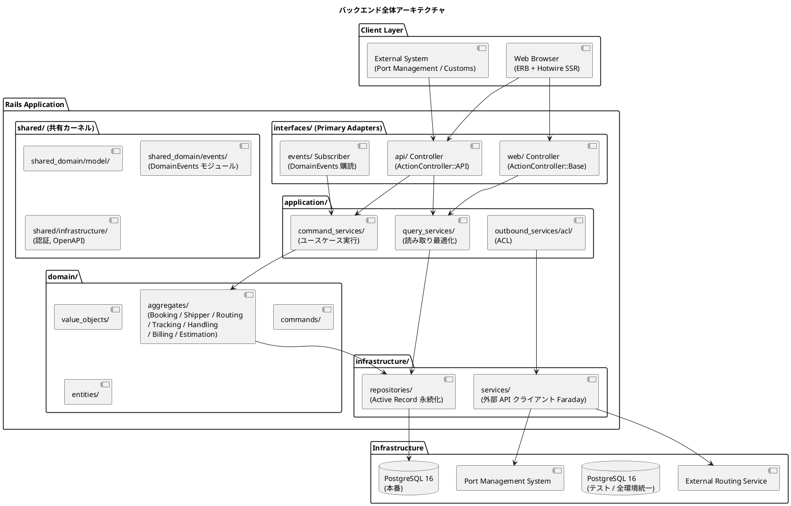
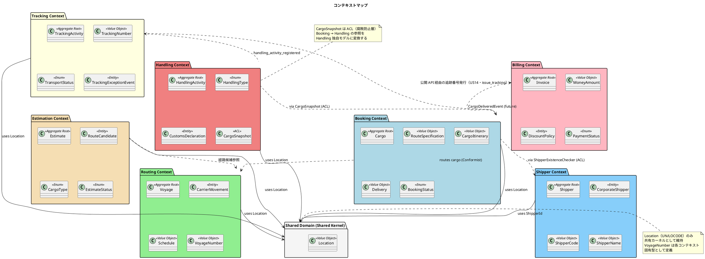
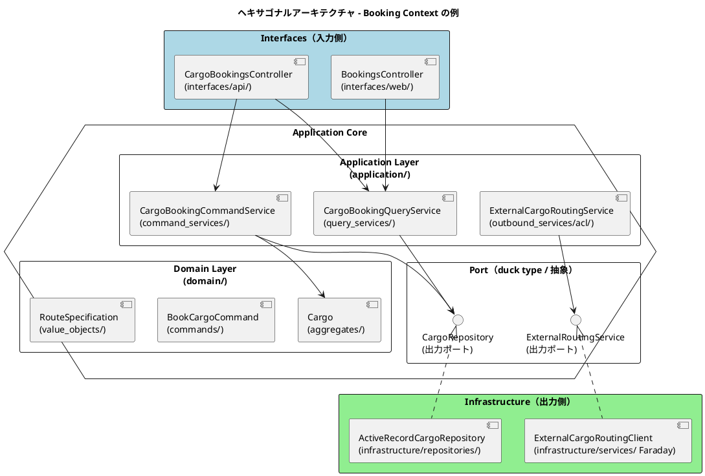
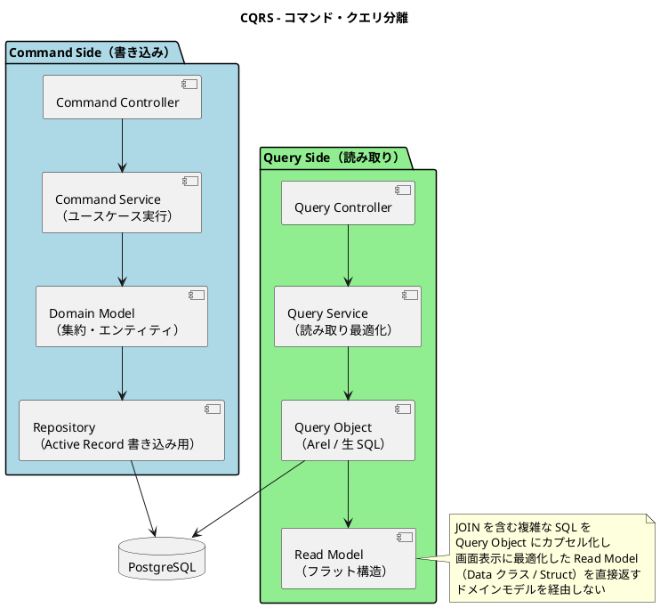
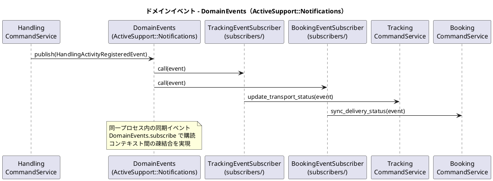
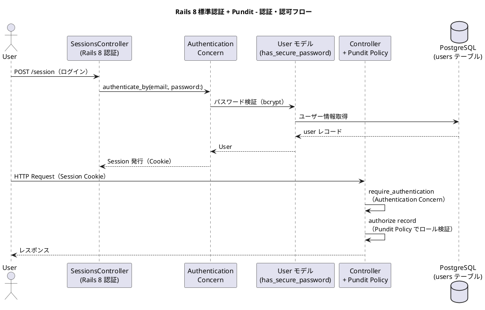
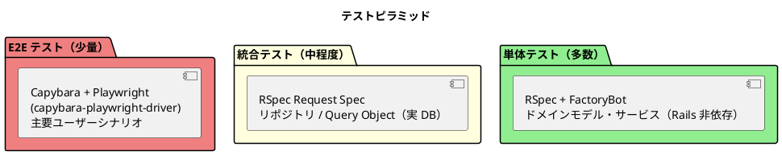

# バックエンドアーキテクチャ - 国際貨物輸送管理システム

## 概要

本ドキュメントでは、国際貨物輸送管理システムのバックエンドアーキテクチャを定義する。
Jakarta EE 参考実装のアーキテクチャ思想（DDD・ヘキサゴナル・イベント駆動）を継承しつつ、
Ruby 3.4 / Rails 8.x（Rails 8.0 系 GA）を基盤とした現代的な実装に翻案する。
Rails の規約（Convention over Configuration）を活かしながら、ドメイン層をフレームワークから独立させる構成を採る。

## アーキテクチャパターン選択

### 業務領域カテゴリーの評価

| 評価軸 | 判定 | 根拠 |
| :--- | :--- | :--- |
| 業務領域カテゴリー | **中核の業務領域** | 国際貨物輸送は複雑なビジネスルール（通関、積み替え、例外処理）を持つ |
| データ構造の複雑さ | **複雑** | エンティティ間の関係が多く、コンテキスト間でデータを共有・変換する必要がある |
| 特殊要件 | **あり** | 金額を扱う（Billing Context）、監査記録が必要（荷役履歴）、状態遷移が厳密 |

### 選択したアーキテクチャパターン

上記評価から、以下の組み合わせを採用する。

- **ドメインモデル**: ビジネスルールを Plain Old Ruby Object（PORO）のドメインオブジェクトにカプセル化し、Fat Model / Fat Controller に陥る手続き的なロジックを排除する
- **ポートとアダプター（ヘキサゴナルアーキテクチャ）**: ドメインを Rails / Active Record などの技術的関心事から独立させ、テスト容易性を確保する
- **CQRS（コマンドクエリ責務分離）**: Booking / Tracking の読み書き負荷特性の違いに対応し、クエリを Query Object による読み取り最適化モデルで返す

Billing Context は `MoneyAmount` 値オブジェクトによる金額管理を行うが、初期フェーズではイベントソーシングは適用しない。

コンテキスト境界とレイヤ依存の静的検証には **Packwerk** を使用し、`packs/` 配下にコンテキストごとのパッケージを配置する。

## 全体アーキテクチャ



## 境界付けられたコンテキスト

### コンテキストマップ



### 各コンテキストの説明

本システムは Booking / Shipper / Routing / Tracking / Handling / Billing / Estimation / Shared Domain の 8 つの境界付けられたコンテキストで構成する（正典は `docs/design/domain-model.md`）。

#### 1. Booking Context（予約コンテキスト）

荷物予約の中核ロジックを担う。荷物の登録・経路割り当て・状態管理を責務とする。

| 要素 | 内容 |
| :--- | :--- |
| 集約ルート | `Cargo` |
| 主要概念 | `RouteSpecification`, `CargoItinerary`, `Delivery` |
| `BookingStatus` | `PRELIMINARY` / `ROUTE_REQUESTED`（経路設計中）/ `ROUTE_PROPOSED` / `CONFIRMED` / `TRACKING_ISSUED` / `IN_TRANSIT` / `DELIVERED` / `SETTLED` / `CANCELLED` |
| アクター | 荷主、営業担当者 |

#### 2. Shipper Context（荷主コンテキスト）

荷主（個人・法人）の登録・管理を担う。Booking Context からは `ShipperExistenceChecker` ACL を通じてのみ参照される。

| 要素 | 内容 |
| :--- | :--- |
| 集約ルート | `Shipper` |
| 主要概念 | `CorporateShipper`, `ShipperCode`, `ShipperName` |
| アクター | 営業担当者、荷主 |

#### 3. Routing Context（経路コンテキスト）

航路・運航スケジュールを管理する。外部経路システムとの統合を担う。

| 要素 | 内容 |
| :--- | :--- |
| 集約ルート | `Voyage` |
| 主要概念 | `CarrierMovement`, `Schedule`, `VoyageNumber` |
| アクター | 経路設計者、外部経路システム |

#### 4. Tracking Context（追跡コンテキスト）

荷物の現在状態・輸送ステータスを管理する。CQRS の読み取り側最適化が特に有効なコンテキスト。IT5 で `TrackingActivity` 集約（`TrackingNumber`＝`TRK-` + 8 桁 hex）を確立し、追跡番号発行（US14）・状態手動更新（US17）を実装済み。Booking への参照は `TrackingBookingId`（string・ADR-0003）とドメインイベント（プリミティブ Hash）のみで、`packs/tracking` は `enforce_privacy: true`・依存は `packs/booking` の公開 API に限定（Packwerk 違反ゼロ）。

| 要素 | 内容 |
| :--- | :--- |
| 集約ルート | `TrackingActivity`（`tracking_activities`・`lock_version` 楽観ロック） |
| 主要概念 | `TrackingNumber`, `TrackingStatus`（ユビキタス言語・DB は `transport_status` に永続化）, `TrackingActivityEvent`（追跡イベント履歴）, `TrackingLocation`（ACL 変換） |
| `TrackingStatus` | `NOT_RECEIVED` / `RECEIVED` / `LOADED` / `ONBOARD_CARRIER` / `UNLOADED` / `AWAITING_CLAIM` / `CLAIMED` / `EXCEPTION`（IT6 追加。`for_handling` で荷役種別からマッピング） |
| `ExceptionType`（IT6） | `DELAY` / `DAMAGE` / `LOST`（`escalation_required?`）/ `CUSTOMS_HOLD`（税関自動登録は将来スコープ）。`TrackingExceptionEvent`（集約内エンティティ）で例外の発生・解決を管理（US19/US20） |
| アクター | 追跡管理者、荷主、荷受人 |

#### 5. Handling Context（荷役コンテキスト）

港湾・荷役作業を記録する。IT5 で `HandlingActivity` 集約（`register` / `route_check`）を確立し、荷役記録（US15）・引取（US16）を実装済み。`CargoSnapshot` ACL（Booking 公開ビューからの射影）で Booking Context への依存を吸収し、Booking の内部集約には依存しない。`packs/handling` は `enforce_privacy: true`・依存は `packs/booking` の公開 API に限定（Packwerk 違反ゼロ）。

| 要素 | 内容 |
| :--- | :--- |
| 集約ルート | `HandlingActivity`（`handling_activities`） |
| 主要概念 | `HandlingType`（RECEIVE / LOAD / UNLOAD / CLAIM・`requires_voyage_number?` / `route_bound?`）, `RecipientConfirmation`（CLAIM 時必須・署名 or 確認コード・US16）, `CargoSnapshot`（ACL）, `HandlingActivityHistory`（Read Model・`most_recently_completed_event`） |
| アクター | 荷役作業員、追跡管理者 |

#### 6. Billing Context（請求コンテキスト）

運賃・請求書の管理を担う。`MoneyAmount` 値オブジェクトで金額を厳密に管理する。

| 要素 | 内容 |
| :--- | :--- |
| 集約ルート | `Invoice` |
| 主要概念 | `MoneyAmount`, `DiscountPolicy`, `PaymentStatus` |
| アクター | 経理担当者、荷主、決済機関 |

#### 7. Estimation Context（見積コンテキスト）

輸送見積の作成（US01）と経路候補算出（US08）の受け皿となる。Routing Context の情報を参照して経路候補を提示する。

| 要素 | 内容 |
| :--- | :--- |
| 集約ルート | `Estimate` |
| 主要概念 | `RouteCandidate`, `CargoType`, `EstimateStatus` |
| アクター | 営業担当者、荷主 |

#### 8. Shared Domain（共有ドメイン）

`Location`（UN/LOCODE）のみ共有カーネルとして維持する。`VoyageNumber` は各コンテキスト固有型として定義し、共有しない。

## ヘキサゴナルアーキテクチャ（ポートとアダプター）

Rails では DI コンテナを使用せず、**コンストラクタ注入 + 明示的な組み立て**でポートとアダプターを接続する。
出力ポートは Ruby の duck typing で表現し、Application Service のコンストラクタでリポジトリ実装を受け取る。
デフォルト実装の組み立ては各コンテキストのファクトリメソッド（もしくは Controller 内の組み立てコード）で行い、
サービスロケータやグローバルな DI コンテナには依存しない。



### レイヤー責務一覧

> Practical DDD のパッケージ構造思想を Packwerk のパック構成に写像する。

| レイヤー | ディレクトリ | 責務 | 依存方向 |
| :--- | :--- | :--- | :--- |
| **Domain** | `domain/aggregates/`, `domain/value_objects/`, `domain/commands/`, `domain/entities/` | ビジネスルール・不変条件・集約・値オブジェクト・コマンド定義（PORO） | 外部に依存しない（Rails 非依存） |
| **Application** | `application/command_services/`, `application/query_services/`, `application/outbound_services/acl/` | ユースケース実行・集約操作・ACL 経由の外部連携 | Domain のみ依存 |
| **Infrastructure** | `infrastructure/repositories/`, `infrastructure/services/` | 永続化（Active Record）・外部サービスクライアント（Faraday） | Application / Domain に依存 |
| **Interfaces** | `interfaces/api/`, `interfaces/api/serializers/`, `interfaces/web/`, `interfaces/events/` | API Controller・シリアライザ・画面 Controller（ERB + Hotwire）・イベント購読 | Application に依存 |

各レイヤの依存方向は Packwerk の `package.yml`（`enforce_dependencies: true`）で静的に検証する。

### パック構成例（Booking Context）

```
packs/booking/
├── package.yml                  # Packwerk パッケージ定義（依存: packs/shared のみ）
├── app/
│   ├── domain/
│   │   └── booking/
│   │       ├── aggregates/          集約ルート（Cargo, BookingId）
│   │       ├── commands/            コマンド（BookCargoCommand, RouteCargoCommand）
│   │       ├── entities/            エンティティ（Location）
│   │       └── value_objects/       値オブジェクト（RouteSpecification, Delivery, Leg 等）
│   ├── application/
│   │   └── booking/
│   │       ├── command_services/    コマンドサービス（CargoBookingCommandService）
│   │       ├── query_services/      クエリサービス（CargoBookingQueryService）
│   │       └── outbound_services/
│   │           └── acl/             ACL（ExternalCargoRoutingService）
│   ├── infrastructure/
│   │   └── booking/
│   │       ├── repositories/        リポジトリ実装（ActiveRecordCargoRepository）
│   │       ├── records/             Active Record モデル（CargoRecord）
│   │       └── services/            外部サービス実装（ExternalCargoRoutingClient）
│   ├── controllers/
│   │   └── booking/
│   │       ├── api/                 API Controller（CargoBookingsController）
│   │       └── web/                 画面 Controller（BookingsController）
│   ├── views/
│   │   └── booking/                 ERB テンプレート（Turbo Frames / Streams）
│   └── subscribers/
│       └── booking/                 イベント購読（cargo_booked / cargo_routed 等の Subscriber）
└── spec/                            パック単位の RSpec
```

Active Record モデルは `CargoRecord` のように `Record` サフィックスを付けて infrastructure 層に配置し、
ドメイン集約 `Cargo` とはリポジトリ実装内で相互変換する。ドメイン層に `ApplicationRecord` を継承させない。

## CQRS 設計



### CQRS 適用方針

- **コマンド側**: ドメインモデル（集約）を通じて状態変更。不変条件の検証後、リポジトリ実装が Active Record で永続化する
- **クエリ側**: ドメインモデルを経由せず、Query Object 内で Arel または `select_all` による生 SQL の JOIN クエリを記述し、画面表示用 Read Model（`Data.define` による不変オブジェクト）を返す
- **CQRS が特に有効なコンテキスト**: Booking（一覧・詳細の頻繁な参照）、Tracking（リアルタイム状態確認）

```ruby
# Query Object の例（packs/booking/app/application/booking/query_services/）
module Booking
  class CargoSummaryQuery
    CargoSummary = Data.define(:booking_id, :origin, :destination, :status, :last_handling)

    def initialize(connection: ActiveRecord::Base.connection)
      @connection = connection
    end

    def call(booking_id)
      row = @connection.select_one(sanitized_sql(booking_id))
      row && CargoSummary.new(**row.symbolize_keys)
    end
  end
end
```

## イベント駆動設計

コンテキスト間の連携には、`ActiveSupport::Notifications` をラップした **DomainEvents モジュール**を使用する。
同一プロセス内の同期イベントとして発行・購読し、コンテキスト間の疎結合を実現する。



### ドメインイベント一覧

イベント名は snake_case のユビキタス言語で統一し、`DomainEvents` 経由で `domain_event.<snake_case>` として発行・購読する（ペイロードはプリミティブ Hash）。

| イベント（実装名 snake_case） | 発火タイミング | 発生元コンテキスト | 処理先 | 内容 |
| :--- | :--- | :--- | :--- | :--- |
| `cargo_booked` | 貨物予約登録時 | Booking | Tracking | 追跡番号の割り当てトリガー（将来連携） |
| `cargo_routed` | `assign_itinerary`（経路紐付け・US09/US11） | Booking | 通知ハンドラ | 確定経路を荷主へ通知（US12・`ROUTE_NOTIFIED`） |
| `cargo_confirmed` | `confirm`（予約確定・US13） | Booking | 通知ハンドラ | 経路設計者へ追跡番号発行依頼（`TRACKING_REQUESTED`） |
| `cargo_cancelled` | `cancel`（予約キャンセル・US13） | Booking | 通知ハンドラ | 荷主へキャンセル確認（`BOOKING_CANCELLED`） |
| `tracking_number_issued` | `AssignTrackingNumber`（追跡番号発行・US14） | Tracking | 通知ハンドラ | 荷主へ追跡番号と追跡方法を通知（`TRACKING_ISSUED`・**IT5 実装済み**） |
| `handling_activity_registered` | `RegisterHandlingActivity`（荷役作業登録・US15/US16） | Handling | Tracking, Booking, 通知ハンドラ | Tracking が TrackingStatus・追跡イベント履歴を同期、Booking が BookingStatus（初回 LOAD→IN_TRANSIT・CLAIM→DELIVERED）と `last_handling_event_*` を同期、荷主へ状態変更通知（`HANDLING_*`・**IT5 実装済み**） |
| `tracking_status_updated` | `UpdateTrackingStatusManually`（状態手動更新・US17） | Tracking | 通知ハンドラ | 荷主へ状態変更を通知（`STATUS_UPDATED`・**IT5 実装済み**） |
| `tracking_exception_detected` | `RegisterException`（例外登録・US19/US20） | Tracking | 通知ハンドラ | 荷主へ例外通知・紛失（LOST）時は管理職へエスカレーション通知（`EXCEPTION_*`・**IT6 実装済み**） |
| `tracking_exception_resolved` | `ResolveException`（対応報告・US19/US20） | Tracking | 通知ハンドラ | 荷主へ対応報告を通知（`EXCEPTION_RESOLVED`・**IT6 実装済み**） |
| `invoice_created` | 料金算出・請求書発行（US21/US22） | Billing | 通知ハンドラ | 荷主へ精算書発行を通知（INVOICE_CREATED・**IT7 実装済み**） |
| `invoice_settled` | 精算完了（US23） | Billing | 通知ハンドラ | 荷主へ精算完了を通知し予約を SETTLED 同期（INVOICE_SETTLED・**IT7 実装済み**） |

> **実装状況（IT4）**: Booking Context 起点の `cargo_routed` / `cargo_confirmed` / `cargo_cancelled` を実装済み。`Booking::Public::NotificationWiring` で `Booking::Application::NotificationSubscribers` を結線し、`Shared::Public::NotificationRecorder` 経由で `notifications` に永続化する。購読側の例外は非伝播（集約の状態遷移を妨げない）。
>
> **実装状況（IT5）**: Tracking Context 起点の `tracking_number_issued`（US14）/ `tracking_status_updated`（US17）、Handling Context 起点の `handling_activity_registered`（US15/US16）を実装済み。いずれも各コンテキストのアプリケーションサービスがコミット後に発行する（ADR-0002）。`handling_activity_registered` の購読側で Tracking が TrackingStatus と TrackingActivityEvent 履歴を同期し、Booking が BookingStatus（初回 LOAD→IN_TRANSIT・CLAIM→DELIVERED）と `cargos.last_handling_event_*` を同期する。US14 の追跡番号発行は `cargo_confirmed` 購読による自動生成は採らず、経路設計者（MVP は営業担当者が代替）の明示発行操作（`POST /bookings/:id/issue_tracking`）をトリガーとする。

### DomainEvents モジュールの実装方針

```ruby
# 共有カーネル（packs/shared/app/shared_domain/events/domain_events.rb）
module DomainEvents
  NAMESPACE = "cargo_tracker.domain_event"

  module_function

  def publish(event)
    ActiveSupport::Notifications.instrument("#{NAMESPACE}.#{event.class.event_name}", event: event)
  end

  def subscribe(event_class, subscriber)
    ActiveSupport::Notifications.subscribe("#{NAMESPACE}.#{event_class.event_name}") do |_name, _s, _f, _id, payload|
      subscriber.call(payload[:event])
    end
  end
end

# ドメインイベントの発行（Application Service 内）
module Handling
  class HandlingCommandService
    def initialize(repository:, events: DomainEvents)
      @repository = repository
      @events = events
    end

    def register_handling_activity(command)
      activity = HandlingActivity.register(command)
      @repository.store(activity)
      # ドメインロジック実行後、トランザクションコミット後にイベント発行
      @events.publish(HandlingActivityRegisteredEvent.new(activity: activity))
    end
  end
end

# イベント購読の組み立て（config/initializers/domain_event_subscriptions.rb）
Rails.application.config.after_initialize do
  DomainEvents.subscribe(
    Handling::HandlingActivityRegisteredEvent,
    Tracking::HandlingActivityRegisteredSubscriber.new
  )
end
```

> **設計注意**: 同期購読はデフォルトで発行側と同一トランザクション内で実行される。
> コミット前に購読側の処理が実行されるリスクを避けるため、イベント発行は
> `ActiveRecord::Base.transaction` のブロック外（コミット完了後）、または
> `after_commit` 相当のタイミング（`ActiveRecord.after_all_transactions_commit` 等）で行うこと。
> 高可用性が必要なシステムへ移行する際は Solid Queue + Transactional Outbox パターンへの移行を検討すること。

### 通知の設計方針（ドメインイベント駆動）

荷主への通知（確定経路通知・例外通知・請求書発行通知など）は、ドメインイベント駆動で実現します。

1. 集約がビジネス上の事実をドメインイベント（`cargo_routed`, `cargo_confirmed`, `cargo_cancelled`, `tracking_exception_detected`, `invoice_created` など）として発行する
2. イベントハンドラ（Subscriber）がイベントを購読し、**NotificationPort**（出力ポート）を呼び出す
3. NotificationPort の Secondary Adapter が通知を送信し、送信記録を `notifications` テーブルへ永続化する

これにより、通知という技術的関心事をドメインロジックから分離し、通知手段（メール・画面内通知など）の追加・変更をアダプタの差し替えで実現できます。送信記録が `notifications` テーブルに残るため、監査・再送にも対応できます。

## Java/Spring Boot → Ruby/Rails 移行マッピング

| Spring Boot 技術 | Rails 移行先 | 移行ポイント |
| :--- | :--- | :--- |
| Spring DI（`@Component`, `@Service`） | コンストラクタ注入 + 明示的な組み立て | DI コンテナは使わない。デフォルト引数でデフォルト実装を注入し、テストではモックを渡す |
| Spring MVC（`@RestController`, `@GetMapping`） | Rails Controller + `config/routes.rb` | エンドポイント定義はルーティング DSL へ。Controller は Primary Adapter として薄く保つ |
| `ApplicationEventPublisher.publishEvent()` | `DomainEvents.publish()`（ActiveSupport::Notifications ラップ） | 同期イベントはほぼ等価。同一プロセス内通信 |
| MyBatis（XML マッパー） | **Active Record**（書き込み）+ Query Object（読み取り） | 書き込みはリポジトリ実装内の Active Record、読み取りは Arel / 生 SQL を Query Object に集約 |
| Flyway | Active Record マイグレーション | `db/migrate/` でスキーマをバージョン管理。`schema.rb` が最新状態を表す |
| Bean Validation（`@Valid`） | Active Model Validations | ドメイン側は値オブジェクトのコンストラクタで検証、境界では `ActiveModel::Model` を使ったフォームオブジェクトで検証 |
| Spring Security 7.x | Rails 8 標準認証（`has_secure_password` + Session）+ Pundit | 認証は Rails 8 の authentication generator、認可は Pundit の Policy で RBAC を実装 |
| Thymeleaf + htmx | ERB + Hotwire（Turbo Frames / Streams + Stimulus）+ Bootstrap 5.3 | サーバサイドレンダリング + 部分更新の思想は共通 |
| Spring WebClient | Faraday | ACL ポートの Secondary Adapter 実装として HTTP クライアントを隔離 |
| `@Transactional` | `ActiveRecord::Base.transaction` | 宣言的からブロック明示へ。トランザクション境界は Command Service が持つ |
| ArchUnit | Packwerk | `packs/` によるコンテキスト境界・レイヤ依存の静的検証。CI で `packwerk check` を実行 |

## ディレクトリ構造

Packwerk の `packs/` をトップレベルに置き、コンテキストごとにパックを分割する。

```
apps/cargo-tracker/
├── app/                            # Rails 標準（共通レイアウト・ApplicationController 等の最小限）
├── config/
│   ├── routes.rb                   # 全コンテキストのルーティング
│   └── initializers/
│       └── domain_event_subscriptions.rb   # イベント購読の組み立て
├── db/
│   └── migrate/                    # Active Record マイグレーション
├── packs/
│   ├── booking/
│   │   ├── package.yml             # 依存: packs/shared
│   │   └── app/
│   │       ├── domain/booking/             # Cargo 集約、BookingId、CargoSpecification、BookingStatus 等
│   │       ├── application/booking/        # RegisterBookingCommandService, FindBookingQueryService, ACL
│   │       ├── infrastructure/booking/     # ActiveRecordBookingRepository, BookingRecord
│   │       ├── controllers/booking/        # API / Web Controller
│   │       ├── views/booking/              # ERB + Turbo
│   │       └── subscribers/booking/        # BookingEventSubscriber
│   ├── shipper/
│   │   ├── package.yml
│   │   └── app/
│   │       ├── domain/shipper/             # Shipper 集約、ShipperName、ContactInfo 等
│   │       ├── application/shipper/        # RegisterShipperCommandService, FindShipperQueryService
│   │       ├── infrastructure/shipper/     # ActiveRecordShipperRepository, ShipperRecord
│   │       └── controllers/shipper/
│   ├── routing/                    # Routing Context（航海・経路候補・IT3 実装済み）
│   ├── tracking/                   # Tracking Context（追跡・例外処理・IT5/IT6 実装済み）
│   ├── handling/                   # Handling Context（荷役記録・IT5 実装済み）
│   ├── billing/                    # Billing Context（料金算出・請求・精算・IT7 実装済み）
│   ├── estimation/                 # Estimation Context（見積・経路候補永続化・IT7 実装済み）
│   └── shared/
│       ├── package.yml             # 依存なし（共有カーネル）
│       └── app/
│           ├── shared_domain/model/        # 共有 ID 型（ShipperId など）、Location
│           ├── shared_domain/events/       # DomainEvents モジュール
│           └── shared/infrastructure/      # 認証設定、OpenAPI 設定、HomeController
├── packwerk.yml                    # Packwerk 全体設定
└── spec/                           # RSpec（パック横断の統合・システムテスト）
```

## API 設計方針

### REST API 設計原則

| 原則 | 内容 |
| :--- | :--- |
| **リソース指向** | URL はリソースを表す名詞。`resources` DSL で定義し、動詞は HTTP メソッドで表現する |
| **バージョニング** | `namespace :api { namespace :v1 }` による `/api/v1/` プレフィックスでバージョンを管理する |
| **レスポンス形式** | JSON。エラーレスポンスは `{ "code": "BOOKING_NOT_FOUND", "message": "..." }` 形式 |
| **ステータスコード** | 成功: 200/201/204、クライアントエラー: 400/404/409/422、サーバーエラー: 500 |
| **HATEOAS** | 初期フェーズでは適用しない |

### 主要エンドポイント（例）

| メソッド | パス | 説明 |
| :--- | :--- | :--- |
| `POST` | `/api/v1/bookings` | 貨物予約の登録 |
| `GET` | `/api/v1/bookings/:booking_id` | 予約詳細の取得 |
| `PUT` | `/api/v1/bookings/:booking_id/route` | 経路の割り当て |
| `GET` | `/api/v1/tracking/:tracking_number` | 追跡情報の取得 |
| `POST` | `/api/v1/handling` | 荷役作業の登録 |
| `GET` | `/api/v1/voyages` | 航路一覧の取得 |

## セキュリティ設計

### Rails 8 標準認証 + Pundit による認証・認可

認証は Rails 8 の authentication generator が生成する `has_secure_password` + Session ベースの仕組みを使用し、
認可は Pundit の Policy クラスでロールベースアクセス制御（RBAC）を実装する。



```ruby
# ロールは User の enum + Pundit Policy で表現する
class User < ApplicationRecord
  has_secure_password
  enum :role, { shipper: 0, sales: 1, handler: 2, tracker: 3, accountant: 4, admin: 5 }
end

# packs/booking/app/policies/booking/cargo_policy.rb
module Booking
  class CargoPolicy < ApplicationPolicy
    def create? = user.sales? || user.admin?
    def assign_route? = user.sales? || user.admin?
    def show? = user.shipper? || user.sales? || user.admin?
  end
end
```

### ロール設計

| ロール | 権限 | 対象ユーザー |
| :--- | :--- | :--- |
| `shipper` | 予約照会・追跡照会 | 荷主 |
| `sales` | 予約登録・経路割り当て | 営業担当者 |
| `handler` | 荷役作業登録 | 荷役作業員 |
| `tracker` | 追跡情報管理・例外対応 | 追跡管理者 |
| `accountant` | 請求書管理 | 経理担当者 |
| `admin` | 全機能 | システム管理者 |

## テスト戦略



### 各層のテスト方針

| テスト対象 | テスト種別 | 使用技術 | 方針 |
| :--- | :--- | :--- | :--- |
| ドメインモデル（集約・値オブジェクト） | 単体テスト | RSpec | Rails 非依存の PORO として、ビジネスルールを網羅的にテスト |
| Application Service | 単体テスト | RSpec（`instance_double`） | リポジトリをモック化。ユースケースのフローをテスト |
| リポジトリ / Query Object | 統合テスト | RSpec + 実 DB（PostgreSQL 16・全環境統一） | 実 DB への SQL を検証。スキーマは Active Record マイグレーションで適用 |
| Controller（API / Web） | 統合テスト | RSpec Request Spec | エンドポイントの入出力・バリデーション・認可（Pundit）をテスト |
| コンテキスト境界 | 静的検証 | Packwerk（`packwerk check`） | パック間依存とレイヤ依存の違反を CI で検出 |
| E2E | E2E テスト | Capybara + Playwright（capybara-playwright-driver） | 主要ユーザーシナリオ（予約 → 追跡 → 配達）を検証 |

## トレーサビリティ概要（US ↔ コンテキスト / 集約 ↔ 主要画面）

`docs/requirements/user_story.md` のユーザーストーリーと、本ドキュメントのコンテキスト・集約、`docs/design/ui_design.md` の主要画面との対応を示します。

| US | ユーザーストーリー | コンテキスト / 集約 | 主要画面 |
| :--- | :--- | :--- | :--- |
| US01 | 輸送見積を作成する | Estimation / `Estimate` | 見積一覧・見積作成・見積詳細 |
| US02 | 荷主を登録する | Shipper / `Shipper` | 荷主登録 |
| US03 | 法人荷主を登録する | Shipper / `Shipper`（`CorporateShipper`） | 荷主登録 |
| US04 | 貨物予約を登録する | Booking / `Cargo` | 貨物予約登録 |
| US05 | 危険物・冷凍貨物の予約を登録する | Booking / `Cargo` | 貨物予約登録 |
| US06 | 予約情報を経路設計者に引き渡す | Booking / `Cargo` | 予約詳細 |
| US07 | 航海スケジュールを検索する | Routing / `Voyage` | 航路一覧 |
| US08 | 経路候補を算出する | Routing / 一時 `RouteCandidate`（IT3・非永続・ADR-0004）→ Estimation / `Estimate`（`RouteCandidate` 永続化・IT7） | 見積詳細・経路割り当て |
| US09 | 経路を選択・確定する | Booking / `Cargo` + Routing / `Voyage` | 経路割り当て |
| US10 | 経路条件を調整して再算出する | Booking / `Cargo` + Routing / `Voyage` | 経路割り当て |
| US11 | 経路情報を予約に紐付ける | Booking / `Cargo` | 経路割り当て・予約詳細 |
| US12 | 確定経路を荷主に通知する | Booking / `Cargo`（ドメインイベント → NotificationPort） | 予約詳細 |
| US13 | 予約を確定する | Booking / `Cargo` | 予約詳細 |
| US14 | 追跡番号を発行する | Tracking / `TrackingActivity` | 予約詳細・追跡詳細 |
| US15 | 荷役作業を記録する | Handling / `HandlingActivity` | 荷役作業登録 |
| US16 | 引取作業を記録する | Handling / `HandlingActivity` | 荷役作業登録 |
| US17 | 貨物状態を手動更新する | Tracking / `TrackingActivity` | 追跡詳細 |
| US18 | 追跡情報を照会する | Tracking / `TrackingActivity` | 貨物追跡入力・追跡詳細・公開貨物追跡（`/public/tracking`・認証不要・30 秒ポーリング） |
| US19 | 遅延例外を処理する | Tracking / `TrackingActivity`（`TrackingExceptionEvent`） | 例外管理一覧・例外イベント登録（`/exceptions`・IT6 実装） |
| US20 | 破損・紛失例外を処理する | Tracking / `TrackingActivity`（`TrackingExceptionEvent`） | 例外管理一覧・例外イベント登録（`/exceptions`・IT6 実装） |
| US21 | 輸送料金を算出する | Billing / `Invoice` | 請求書一覧・請求書詳細 |
| US22 | 法人割引を適用する | Billing / `Invoice`（`DiscountPolicy`）+ Shipper / `Shipper` | 請求書詳細・割引ポリシー一覧 |
| US23 | 精算を処理する | Billing / `Invoice` | 請求書詳細 |
| US24 | 航海スケジュールを新規登録する | Routing / `Voyage` | 航路一覧 |
| US25 | 既存航海スケジュールを更新する | Routing / `Voyage` | 航路一覧 |
