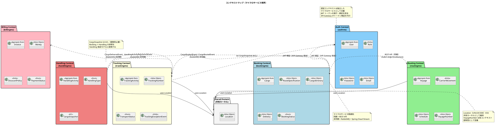
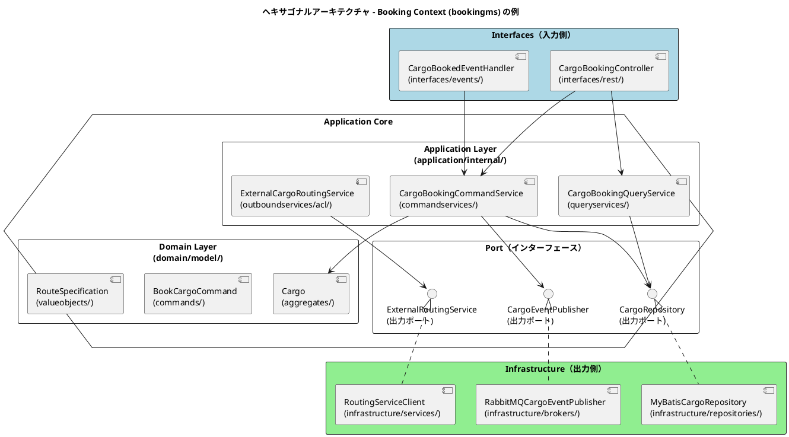
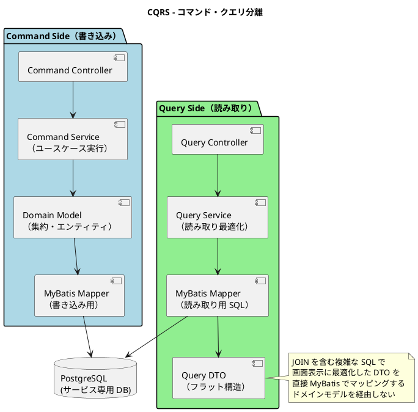
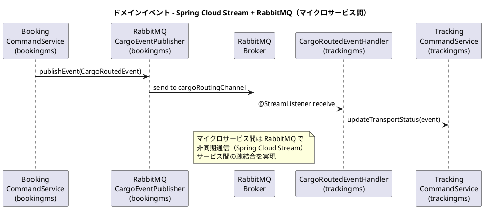
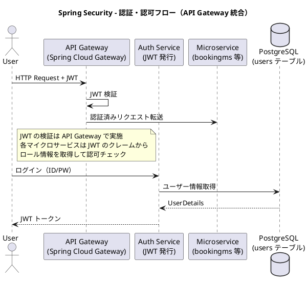
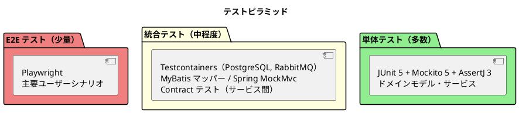

# バックエンドアーキテクチャ - 国際貨物輸送管理システム

## 概要

本ドキュメントでは、国際貨物輸送管理システムのバックエンドアーキテクチャを定義する。
Practical DDD in Enterprise Java（Chapter 5）のマイクロサービスアーキテクチャ思想（DDD・ヘキサゴナル・イベント駆動・CQRS）を継承しつつ、
Spring Boot 4.x / Java 25 を基盤とし、データアクセスには MyBatis を採用した現代的な実装とする。

## アーキテクチャパターン選択

### 業務領域カテゴリーの評価

| 評価軸 | 判定 | 根拠 |
| :--- | :--- | :--- |
| 業務領域カテゴリー | **中核の業務領域** | 国際貨物輸送は複雑なビジネスルール（経路設計、積み替え、例外処理）を持つ |
| データ構造の複雑さ | **複雑** | エンティティ間の関係が多く、コンテキスト間でデータを共有・変換する必要がある |
| 特殊要件 | **あり** | 金額を扱う（Billing Context）、監査記録が必要（荷役履歴）、状態遷移が厳密 |

### 選択したアーキテクチャパターン

上記評価から、以下の組み合わせを採用する。

- **ドメインモデル**: ビジネスルールをドメインオブジェクトにカプセル化し、手続き的なロジックを排除する
- **ポートとアダプター（ヘキサゴナルアーキテクチャ）**: ドメインを技術的関心事から独立させ、テスト容易性を確保する
- **CQRS（コマンドクエリ責務分離）**: Booking / Tracking の読み書き負荷特性の違いに対応し、クエリを読み取り最適化モデルで返す
- **マイクロサービス**: 各バウンデッドコンテキストを独立したデプロイ単位とし、スケーラビリティと独立性を確保する

Billing Context は `Money` 値オブジェクトによる金額管理を行うが、初期フェーズではイベントソーシングは適用しない。

## 全体アーキテクチャ

```plantuml
@startuml
title バックエンド全体アーキテクチャ（マイクロサービス）

package "Client Layer" {
  [Web Browser\n(React SPA)]
  [External System\n(Port Management / Customs)]
}

package "API Gateway (gatewayms)" {
  [Spring Cloud Gateway\n(@Route + JWT Filter)]
}

package "Auth Microservice (authms)" {
  [Auth REST Controller] as auth_rest
  [Domain Model\n(User, Role)] as auth_domain
  [MyBatis Repository] as auth_repo
  [JWT Provider] as jwt
}

package "Booking Microservice (bookingms)" {
  package "interfaces/" {
    [rest/ Controller\n(@RestController)] as booking_rest
    [events/ Handler\n(@EventListener)] as booking_events
  }
  package "application/internal/" {
    [commandservices/] as booking_cmd
    [queryservices/] as booking_qry
    [outboundservices/acl/] as booking_acl
  }
  package "domain/model/" {
    [aggregates/\n(Cargo)] as booking_agg
  }
  package "infrastructure/" {
    [repositories/\n(MyBatis)] as booking_repo
    [brokers/\n(RabbitMQ Publisher)] as booking_broker
  }
}

package "Routing Microservice (routingms)" {
  [REST Controller] as routing_rest
  [Domain Model\n(Voyage)] as routing_domain
  [MyBatis Repository] as routing_repo
}

package "Tracking Microservice (trackingms)" {
  [REST Controller] as tracking_rest
  [Event Subscriber] as tracking_sub
  [Domain Model\n(TrackingActivity)] as tracking_domain
  [MyBatis Repository] as tracking_repo
}

package "Handling Microservice (handlingms)" {
  [REST Controller] as handling_rest
  [Domain Model\n(HandlingActivity)] as handling_domain
  [MyBatis Repository] as handling_repo
  [RabbitMQ Publisher] as handling_broker
}

package "Billing Microservice (billingms)" {
  [REST Controller] as billing_rest
  [Event Subscriber] as billing_sub
  [Domain Model\n(Invoice)] as billing_domain
  [MyBatis Repository] as billing_repo
}

queue "RabbitMQ\n(Message Broker)" as MQ

database "auth_db\n(PostgreSQL)" as ADB
database "booking_db\n(PostgreSQL)" as BDB
database "routing_db\n(PostgreSQL)" as RDB
database "tracking_db\n(PostgreSQL)" as TDB
database "handling_db\n(PostgreSQL)" as HDB
database "billing_db\n(PostgreSQL)" as BIDB

[Web Browser\n(React SPA)] --> [Spring Cloud Gateway\n(@Route)]
[External System\n(Port Management / Customs)] --> [Spring Cloud Gateway\n(@Route)]

[Spring Cloud Gateway\n(@Route)] --> auth_rest
[Spring Cloud Gateway\n(@Route)] --> booking_rest
[Spring Cloud Gateway\n(@Route)] --> routing_rest
[Spring Cloud Gateway\n(@Route)] --> tracking_rest
[Spring Cloud Gateway\n(@Route)] --> handling_rest
[Spring Cloud Gateway\n(@Route)] --> billing_rest

auth_repo --> ADB

booking_acl --> routing_rest : REST API（同期）
booking_broker --> MQ : CargoBookedEvent / CargoRoutedEvent
handling_broker --> MQ : HandlingActivityRegisteredEvent
MQ --> tracking_sub : イベント購読
MQ --> billing_sub : イベント購読

booking_repo --> BDB
routing_repo --> RDB
tracking_repo --> TDB
handling_repo --> HDB
billing_repo --> BIDB

@enduml
```



## 境界付けられたコンテキスト

### コンテキストマップ



### 各コンテキストの説明

#### 1. Auth Context（認証コンテキスト）― authms

ユーザー認証・認可の中核ロジックを担う。JWT トークンの発行と検証を責務とする。ビジネスドメインとは独立した支援コンテキスト。

| 要素 | 内容 |
| :--- | :--- |
| 集約ルート | `User` |
| 主要概念 | `Role`, `Password`, `Email`, `UserName` |
| アクター | 全ユーザー（認証時） |
| DB | `auth_db` |

#### 2. Booking Context（予約コンテキスト）― bookingms

貨物予約の中核ロジックを担う。貨物の登録・経路割り当て・状態管理を責務とする。

| 要素 | 内容 |
| :--- | :--- |
| 集約ルート | `Cargo` |
| 主要概念 | `RouteSpecification`, `CargoItinerary`, `Delivery` |
| `BookingStatus` | `PRELIMINARY` / `ROUTE_PROPOSED` / `CONFIRMED` / `TRACKING_ISSUED` / `IN_TRANSIT` / `DELIVERED` / `SETTLED` / `CANCELLED` |
| アクター | 荷主、営業担当者 |
| DB | `booking_db` |

#### 3. Routing Context（経路コンテキスト）― routingms

航路・運航スケジュールを管理する。経路候補の算出と最適経路の提案を担う。

| 要素 | 内容 |
| :--- | :--- |
| 集約ルート | `Voyage` |
| 主要概念 | `CarrierMovement`, `Schedule`, `VoyageNumber` |
| アクター | 経路設計者 |
| DB | `routing_db` |

#### 4. Tracking Context（追跡コンテキスト）― trackingms

貨物の現在状態・輸送ステータスを管理する。CQRS の読み取り側最適化が特に有効なコンテキスト。

| 要素 | 内容 |
| :--- | :--- |
| 集約ルート | `TrackingActivity` |
| 主要概念 | `TrackingNumber`, `TransportStatus`, `TrackingExceptionEvent` |
| `TransportStatus` | `NOT_RECEIVED` / `RECEIVED` / `LOADED` / `IN_TRANSIT` / `UNLOADED` / `AWAITING_CLAIM` / `DELIVERED` / `MISROUTED` |
| アクター | 追跡管理者、荷主、荷受人 |
| DB | `tracking_db` |

#### 5. Handling Context（荷役コンテキスト）― handlingms

港湾での荷役作業を記録する。`CargoSnapshot` ACL で Booking Context への依存を吸収する。

| 要素 | 内容 |
| :--- | :--- |
| 集約ルート | `HandlingActivity` |
| 主要概念 | `HandlingType`, `CargoSnapshot`（ACL） |
| アクター | 荷役作業員 |
| DB | `handling_db` |

#### 6. Billing Context（請求コンテキスト）― billingms

運賃・請求書の管理を担う。`Money` 値オブジェクトで金額を厳密に管理する。

| 要素 | 内容 |
| :--- | :--- |
| 集約ルート | `Invoice` |
| 主要概念 | `Money`, `DiscountPolicy`, `PaymentStatus` |
| アクター | 経理担当者、荷主、決済機関 |
| DB | `billing_db` |

#### 7. Shared Domain（共有ドメイン）

`Location`（UN/LOCODE）のみ共有カーネルとして維持する。`VoyageNumber` は各コンテキスト固有型として定義し、共有しない。各マイクロサービスが共有ライブラリとして参照する。

## ヘキサゴナルアーキテクチャ（ポートとアダプター）



### レイヤー責務一覧

> Practical DDD in Enterprise Java (Chapter 3) のパッケージ構造に準拠する。

| レイヤー | パッケージ | 責務 | 依存方向 |
| :--- | :--- | :--- | :--- |
| **Domain** | `domain/model/aggregates/`, `domain/model/valueobjects/`, `domain/model/commands/`, `domain/model/entities/` | ビジネスルール・不変条件・集約・値オブジェクト・コマンド定義 | 外部に依存しない |
| **Application** | `application/internal/commandservices/`, `application/internal/queryservices/`, `application/internal/outboundservices/acl/` | ユースケース実行・集約操作・ACL 経由の外部マイクロサービス連携 | Domain のみ依存 |
| **Infrastructure** | `infrastructure/repositories/`, `infrastructure/services/`, `infrastructure/brokers/` | 永続化（MyBatis）・外部サービスクライアント・メッセージブローカー | Application / Domain に依存 |
| **Interfaces** | `interfaces/rest/`, `interfaces/rest/dto/`, `interfaces/rest/transform/`, `interfaces/events/` | REST API Controller・DTO・DTO 変換・イベントハンドラ | Application に依存 |

### パッケージ構成（全マイクロサービス）

各バウンデッドコンテキストは独立した Spring Boot アプリケーション（独立した Gradle サブプロジェクト）として構成する。
認証コンテキスト（authms）もビジネスコンテキストと同様に独立したマイクロサービスとする。

```
cargo-tracker/                           ルートプロジェクト
│
├── authms/                              ★ 認証マイクロサービス（独立デプロイ）
│   └── src/main/java/com/cargotracker/authms/
│       ├── domain/
│       │   └── model/
│       │       ├── aggregates/          集約ルート（User, UserId）
│       │       ├── entities/            エンティティ（Role）
│       │       └── valueobjects/        値オブジェクト（Password, Email, UserName）
│       ├── application/
│       │   └── internal/
│       │       ├── commandservices/     コマンドサービス（AuthCommandService）
│       │       └── queryservices/       クエリサービス（AuthQueryService）
│       ├── infrastructure/
│       │   ├── repositories/            リポジトリ実装（MyBatisUserRepository, UserMapper）
│       │   ├── security/               JWT 発行・検証（JwtTokenProvider）
│       │   └── config/                 SecurityConfig, CorsConfig
│       └── interfaces/
│           └── rest/                    REST Controller（AuthController）
│               └── dto/                 LoginRequest, TokenResponse
│
├── bookingms/                           ★ 予約マイクロサービス（独立デプロイ）
│   └── src/main/java/com/cargotracker/bookingms/
│       ├── domain/
│       │   └── model/
│       │       ├── aggregates/          集約ルート（Cargo, BookingId）
│       │       ├── commands/            コマンド（BookCargoCommand, RouteCargoCommand）
│       │       ├── entities/            エンティティ（Location）
│       │       └── valueobjects/        値オブジェクト（RouteSpecification, Delivery, Leg 等）
│       ├── application/
│       │   └── internal/
│       │       ├── commandservices/     コマンドサービス（CargoBookingCommandService）
│       │       ├── queryservices/       クエリサービス（CargoBookingQueryService）
│       │       └── outboundservices/
│       │           └── acl/             ACL（ExternalCargoRoutingService）
│       ├── infrastructure/
│       │   ├── repositories/            リポジトリ実装（MyBatisCargoRepository, CargoMapper）
│       │   ├── services/                外部サービス実装（RoutingServiceClient）
│       │   └── brokers/
│       │       └── rabbitmq/            RabbitMQ イベント発行（CargoEventSource）
│       ├── interfaces/
│       │   ├── rest/                    REST Controller（CargoBookingController）
│       │   │   ├── dto/                 リクエスト / レスポンス DTO
│       │   │   └── transform/           DTO ⇔ コマンド変換（Assembler）
│       │   └── events/                  イベントハンドラ（CargoBookedEventHandler）
│       └── shareddomain/                共有ドメイン（Location, クロスコンテキストイベント）
│           ├── model/
│           └── events/
│
├── routingms/                           ★ 経路設計マイクロサービス（独立デプロイ）
│   └── src/main/java/com/cargotracker/routingms/
│       ├── domain/
│       │   └── model/
│       │       ├── aggregates/          集約ルート（Voyage, VoyageNumber）
│       │       ├── entities/            エンティティ（CarrierMovement）
│       │       └── valueobjects/        値オブジェクト（Schedule, TransitPath, TransitEdge）
│       ├── application/
│       │   └── internal/
│       │       ├── commandservices/     コマンドサービス（VoyageCommandService）
│       │       └── queryservices/       クエリサービス（CargoRoutingQueryService）
│       ├── infrastructure/
│       │   └── repositories/            リポジトリ実装（MyBatisVoyageRepository, VoyageMapper）
│       └── interfaces/
│           └── rest/                    REST Controller（CargoRoutingController）
│               ├── dto/
│               └── transform/
│
├── trackingms/                          ★ 追跡マイクロサービス（独立デプロイ）
│   └── src/main/java/com/cargotracker/trackingms/
│       ├── domain/
│       │   └── model/
│       │       ├── aggregates/          集約ルート（TrackingActivity, TrackingNumber）
│       │       ├── entities/            エンティティ（TrackingExceptionEvent）
│       │       └── valueobjects/        値オブジェクト（TransportStatus）
│       ├── application/
│       │   └── internal/
│       │       ├── commandservices/     コマンドサービス（TrackingCommandService）
│       │       └── queryservices/       クエリサービス（TrackingQueryService）
│       ├── infrastructure/
│       │   └── repositories/            リポジトリ実装（MyBatisTrackingRepository）
│       └── interfaces/
│           ├── rest/                    REST Controller（TrackingController）
│           └── events/                  イベント受信（CargoRoutedEventHandler）
│
├── handlingms/                          ★ 荷役マイクロサービス（独立デプロイ）
│   └── src/main/java/com/cargotracker/handlingms/
│       ├── domain/
│       │   └── model/
│       │       ├── aggregates/          集約ルート（HandlingActivity）
│       │       ├── entities/            エンティティ（CargoSnapshot ― ACL）
│       │       └── valueobjects/        値オブジェクト（HandlingType）
│       ├── application/
│       │   └── internal/
│       │       └── commandservices/     コマンドサービス（HandlingCommandService）
│       ├── infrastructure/
│       │   ├── repositories/            リポジトリ実装（MyBatisHandlingRepository）
│       │   └── brokers/
│       │       └── rabbitmq/            RabbitMQ イベント発行
│       └── interfaces/
│           └── rest/                    REST Controller（HandlingController）
│
├── billingms/                           ★ 請求マイクロサービス（独立デプロイ）
│   └── src/main/java/com/cargotracker/billingms/
│       ├── domain/
│       │   └── model/
│       │       ├── aggregates/          集約ルート（Invoice）
│       │       ├── entities/            エンティティ（DiscountPolicy）
│       │       └── valueobjects/        値オブジェクト（Money, PaymentStatus）
│       ├── application/
│       │   └── internal/
│       │       ├── commandservices/     コマンドサービス（BillingCommandService）
│       │       └── queryservices/       クエリサービス（BillingQueryService）
│       ├── infrastructure/
│       │   └── repositories/            リポジトリ実装（MyBatisInvoiceRepository）
│       └── interfaces/
│           ├── rest/                    REST Controller（BillingController）
│           └── events/                  イベント受信（CargoDeliveredEventHandler）
│
├── gatewayms/                           ★ API Gateway（独立デプロイ）
│   └── src/main/java/com/cargotracker/gatewayms/
│       └── config/                      ルーティング定義、JWT フィルター
│
└── shared/                              ★ 共有ライブラリ（デプロイ単位ではない）
    └── src/main/java/com/cargotracker/shared/
        └── domain/
            └── model/                   Location（UN/LOCODE）等
```

> **ポイント**: 各ディレクトリ（authms, bookingms, routingms, ...）は独立した Gradle サブプロジェクトであり、
> それぞれが独自の `build.gradle`、`application.yml`、`Dockerfile` を持つ。
> `shared/` のみライブラリとして各サービスが依存する。

## CQRS 設計



### CQRS 適用方針

- **コマンド側**: ドメインモデル（集約）を通じて状態変更。不変条件の検証後、MyBatis で永続化する
- **クエリ側**: ドメインモデルを経由せず、MyBatis の XML マッパーで JOIN クエリを直接記述し、画面表示用 DTO を返す
- **CQRS が特に有効なコンテキスト**: Booking（一覧・詳細の頻繁な参照）、Tracking（リアルタイム状態確認）

## イベント駆動設計



### ドメインイベント一覧

| イベント | 発行元サービス | 処理先サービス | チャネル | 内容 |
| :--- | :--- | :--- | :--- | :--- |
| `CargoBookedEvent` | bookingms | trackingms | cargoBookingChannel | 追跡番号の割り当てトリガー |
| `CargoRoutedEvent` | bookingms | trackingms | cargoRoutingChannel | 経路・旅程の確定を追跡に通知 |
| `HandlingActivityRegisteredEvent` | handlingms | trackingms, bookingms | handlingChannel | 荷役作業登録 → 輸送ステータス同期 |
| `CargoDeliveredEvent` | trackingms | billingms | deliveryChannel | 配送完了 → 精算開始 |
| `InvoiceCreatedEvent` | billingms | （通知システム） | billingChannel | 請求書発行 → 荷主への通知 |

### Spring Cloud Stream + RabbitMQ の実装方針

```java
// イベント発行（bookingms - infrastructure/brokers/rabbitmq/）
@Service
@EnableBinding(CargoEventSource.class)
public class RabbitMQCargoEventPublisher {
    private final CargoEventSource cargoEventSource;

    @TransactionalEventListener(phase = TransactionPhase.AFTER_COMMIT)
    public void handleCargoBookedEvent(CargoBookedEvent event) {
        cargoEventSource.cargoBooking()
            .send(MessageBuilder.withPayload(event).build());
    }
}

// チャネル定義（bookingms - infrastructure/brokers/rabbitmq/）
public interface CargoEventSource {
    @Output("cargoBookingChannel")
    MessageChannel cargoBooking();

    @Output("cargoRoutingChannel")
    MessageChannel cargoRouting();
}

// イベント受信（trackingms - interfaces/events/）
@Service
@EnableBinding(Sink.class)
public class CargoRoutedEventHandler {
    private final TrackingCommandService trackingCommandService;

    @StreamListener(target = Sink.INPUT)
    public void receiveEvent(CargoRoutedEvent event) {
        trackingCommandService.initializeTracking(event);
    }
}
```

> **設計注意**: `@TransactionalEventListener(phase = TransactionPhase.AFTER_COMMIT)` を使用し、
> トランザクションコミット後にイベントを発行する。
> 高可用性が必要なシステムへ移行する際は Transactional Outbox パターンへの移行を検討すること。

## マイクロサービス間通信

### 同期通信（REST API）

Booking Service が Routing Service の経路候補を取得する際、ACL を介して REST API を呼び出す。

```java
// ACL（bookingms - application/internal/outboundservices/acl/）
@Service
public class ExternalCargoRoutingService {
    private final RestTemplate restTemplate;

    public CargoItinerary fetchRouteForSpecification(RouteSpecification spec) {
        TransitPath transitPath = restTemplate.getForObject(
            routingServiceUrl + "/api/routing/routes/optimal"
                + "?origin={origin}&destination={destination}&deadline={deadline}",
            TransitPath.class,
            spec.getOrigin().getUnLocCode(),
            spec.getDestination().getUnLocCode(),
            spec.getArrivalDeadline());

        return toCargoItinerary(transitPath);
    }

    private CargoItinerary toCargoItinerary(TransitPath transitPath) {
        List<Leg> legs = transitPath.getTransitEdges().stream()
            .map(edge -> new Leg(
                edge.getVoyageNumber(),
                edge.getFromUnLocode(),
                edge.getToUnLocode(),
                edge.getFromDate(),
                edge.getToDate()))
            .collect(Collectors.toList());
        return new CargoItinerary(legs);
    }
}
```

### 通信方式一覧

| 通信パターン | 発信元 | 発信先 | 方式 | エンドポイント / チャネル |
| :--- | :--- | :--- | :--- | :--- |
| 同期 | bookingms | routingms | REST | `GET /api/routing/routes/optimal` |
| 非同期 | bookingms | trackingms | RabbitMQ | `cargoBookingChannel` |
| 非同期 | bookingms | trackingms | RabbitMQ | `cargoRoutingChannel` |
| 非同期 | handlingms | trackingms, bookingms | RabbitMQ | `handlingChannel` |
| 非同期 | trackingms | billingms | RabbitMQ | `deliveryChannel` |

## データベース設計方針

### Database per Service パターン

各マイクロサービスが専用のデータベースを持つ。他サービスのデータには直接アクセスしない。

| サービス | データベース名 | 主要テーブル | RDBMS |
| :--- | :--- | :--- | :--- |
| authms | auth_db | users, roles, user_roles | PostgreSQL 16.x |
| bookingms | booking_db | cargo, leg, shipper | PostgreSQL 16.x |
| routingms | routing_db | voyage, carrier_movement | PostgreSQL 16.x |
| trackingms | tracking_db | tracking_activity, handling_event | PostgreSQL 16.x |
| handlingms | handling_db | handling_activity | PostgreSQL 16.x |
| billingms | billing_db | invoice, discount_policy | PostgreSQL 16.x |

### MyBatis 実装例

```java
// ドメイン層: リポジトリインターフェース（出力ポート）
public interface CargoRepository {
    void save(Cargo cargo);
    Optional<Cargo> findByBookingId(BookingId bookingId);
    List<Cargo> findAll();
}

// インフラ層: MyBatis Mapper
@Mapper
public interface CargoMapper {
    void insertCargo(CargoRecord record);
    void updateCargo(CargoRecord record);
    CargoRecord selectByBookingId(@Param("bookingId") String bookingId);
    List<CargoRecord> selectAll();
}

// インフラ層: リポジトリ実装
@Repository
public class MyBatisCargoRepository implements CargoRepository {
    private final CargoMapper cargoMapper;

    @Override
    public void save(Cargo cargo) {
        CargoRecord record = CargoRecordAssembler.toRecord(cargo);
        if (cargo.getId() == null) {
            cargoMapper.insertCargo(record);
        } else {
            cargoMapper.updateCargo(record);
        }
    }

    @Override
    public Optional<Cargo> findByBookingId(BookingId bookingId) {
        CargoRecord record = cargoMapper.selectByBookingId(bookingId.getBookingId());
        return Optional.ofNullable(record)
            .map(CargoRecordAssembler::toDomainModel);
    }
}
```

### トランザクション管理

- **サービス内**: Spring の `@Transactional` で管理
- **サービス間**: 結果整合性（Eventual Consistency）をイベント駆動で実現
- **補償トランザクション**: 失敗時はドメインイベントで補償処理を実行

## API 設計方針

### REST API 設計原則

| 原則 | 内容 |
| :--- | :--- |
| **リソース指向** | URL はリソースを表す名詞。動詞は HTTP メソッドで表現する |
| **バージョニング** | `/api/v1/` プレフィックスでバージョンを管理する |
| **レスポンス形式** | JSON。エラーレスポンスは `{ "code": "BOOKING_NOT_FOUND", "message": "..." }` 形式 |
| **ステータスコード** | 成功: 200/201/204、クライアントエラー: 400/404/409、サーバーエラー: 500 |
| **API Gateway** | Spring Cloud Gateway で各マイクロサービスへルーティングする |

### 主要エンドポイント

#### authms

| メソッド | パス | 説明 | 対応 UC |
| :--- | :--- | :--- | :--- |
| `POST` | `/api/v1/auth/login` | ログイン（JWT 発行） | - |
| `POST` | `/api/v1/auth/register` | ユーザー登録 | - |
| `GET` | `/api/v1/auth/me` | 認証ユーザー情報取得 | - |

#### bookingms

| メソッド | パス | 説明 | 対応 UC |
| :--- | :--- | :--- | :--- |
| `POST` | `/api/v1/bookings` | 貨物予約の登録 | UC03 |
| `GET` | `/api/v1/bookings/{bookingId}` | 予約詳細の取得 | UC03 |
| `GET` | `/api/v1/bookings` | 予約一覧の取得 | UC03 |
| `PUT` | `/api/v1/bookings/{bookingId}/route` | 経路の割り当て | UC09 |
| `PUT` | `/api/v1/bookings/{bookingId}/confirm` | 予約確定 | UC11 |
| `POST` | `/api/v1/bookings/{bookingId}/tracking-number` | 追跡番号発行 | UC12 |

#### routingms

| メソッド | パス | 説明 | 対応 UC |
| :--- | :--- | :--- | :--- |
| `GET` | `/api/v1/voyages` | 航海スケジュール一覧 | UC05 |
| `POST` | `/api/v1/voyages` | 航海スケジュール登録 | UC19 |
| `PUT` | `/api/v1/voyages/{voyageNumber}` | 航海スケジュール更新 | UC19 |
| `GET` | `/api/v1/routes/optimal` | 最適経路候補算出 | UC06 |

#### trackingms

| メソッド | パス | 説明 | 対応 UC |
| :--- | :--- | :--- | :--- |
| `GET` | `/api/v1/tracking/{trackingNumber}` | 追跡情報照会 | UC15 |
| `PUT` | `/api/v1/tracking/{trackingNumber}/status` | 貨物状態更新 | UC14 |
| `POST` | `/api/v1/tracking/{trackingNumber}/exceptions` | 例外処理 | UC16 |

#### handlingms

| メソッド | パス | 説明 | 対応 UC |
| :--- | :--- | :--- | :--- |
| `POST` | `/api/v1/handling` | 荷役作業の登録 | UC13 |

#### billingms

| メソッド | パス | 説明 | 対応 UC |
| :--- | :--- | :--- | :--- |
| `POST` | `/api/v1/billing/{bookingId}/calculate` | 輸送料金算出 | UC17 |
| `POST` | `/api/v1/billing/{bookingId}/settlement` | 精算処理 | UC18 |

## セキュリティ設計

### Spring Security による認証・認可



### ロール設計

| ロール | 権限 | 対象ユーザー |
| :--- | :--- | :--- |
| `ROLE_SHIPPER` | 予約照会・追跡照会 | 荷主 |
| `ROLE_SALES` | 予約登録・経路割り当て | 営業担当者 |
| `ROLE_HANDLER` | 荷役作業登録 | 荷役作業員 |
| `ROLE_TRACKER` | 追跡情報管理・例外対応 | 追跡管理者 |
| `ROLE_ACCOUNTANT` | 請求書管理 | 経理担当者 |
| `ROLE_ADMIN` | 全機能 | システム管理者 |

## テスト戦略



### 各層のテスト方針

| テスト対象 | テスト種別 | 使用技術 | 方針 |
| :--- | :--- | :--- | :--- |
| ドメインモデル（集約・値オブジェクト） | 単体テスト | JUnit 5, AssertJ | 依存なし。ビジネスルールを網羅的にテスト |
| Application Service | 単体テスト | JUnit 5, Mockito | リポジトリをモック化。ユースケースのフローをテスト |
| MyBatis Mapper | 統合テスト | Testcontainers（PostgreSQL） | 実 DB への SQL を検証。スキーマを Flyway で適用 |
| REST Controller | 統合テスト | Spring MockMvc | エンドポイントの入出力・バリデーションをテスト |
| サービス間契約 | Contract テスト | Spring Cloud Contract | マイクロサービス間 API の契約を検証 |
| E2E | E2E テスト | Playwright | 主要ユーザーシナリオ（予約 → 追跡 → 配達）を検証 |

## マイクロサービス技術スタック

| カテゴリ | 技術 | バージョン |
| :--- | :--- | :--- |
| フレームワーク | Spring Boot | 4.x |
| Java | OpenJDK | 25 |
| データアクセス | MyBatis + MyBatis Spring Boot Starter | 4.x |
| メッセージング | Spring Cloud Stream + RabbitMQ | 4.x |
| API ゲートウェイ | Spring Cloud Gateway | 4.x |
| サービス間通信 | RestTemplate / WebClient | - |
| データベース | PostgreSQL | 8.x |
| マイグレーション | Flyway | 10.x |
| ビルドツール | Gradle | 8.x |
| コンテナ | Docker / Docker Compose | - |
| テスト | JUnit 5, Mockito, AssertJ, Testcontainers | - |
| Contract テスト | Spring Cloud Contract | 4.x |

## 参照

- [要件定義書](../requirements/requirements_definition.md)
- [システムユースケース](../requirements/system_usecase.md)
- [ユーザーストーリー](../requirements/user_story.md)
- [フロントエンドアーキテクチャ設計](architecture_frontend.md)
- [インフラストラクチャアーキテクチャ設計](architecture_infrastructure.md)
- [アーキテクチャ設計ガイド](../reference/アーキテクチャ設計ガイド.md)
