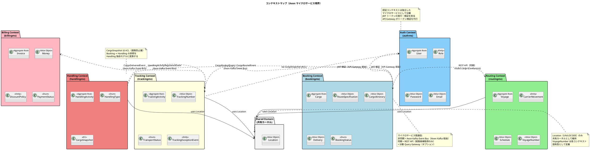
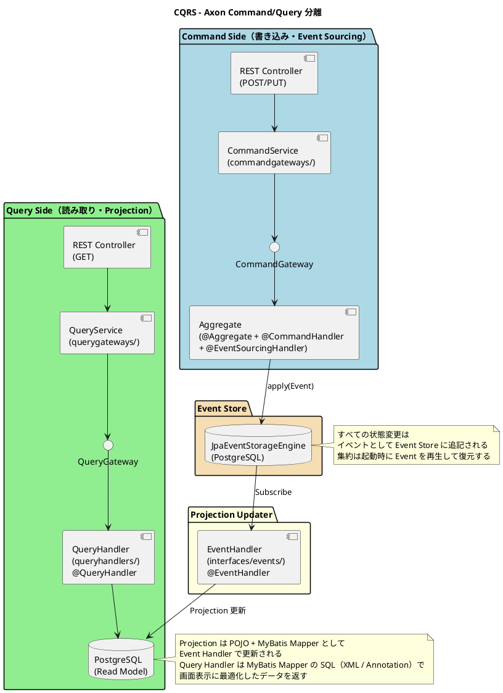
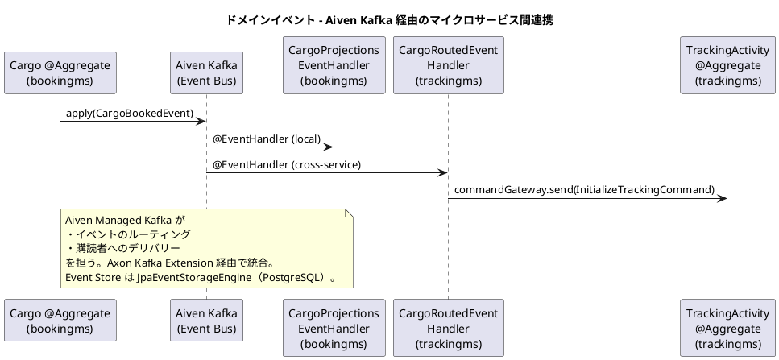
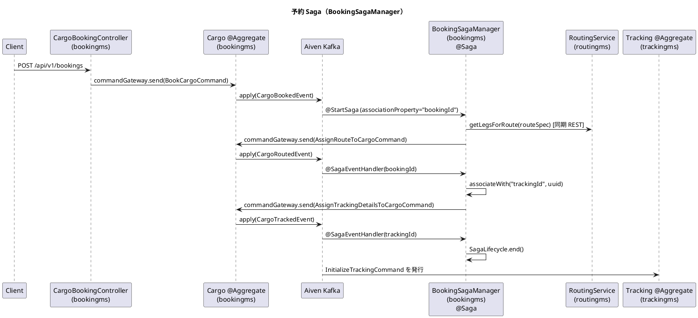
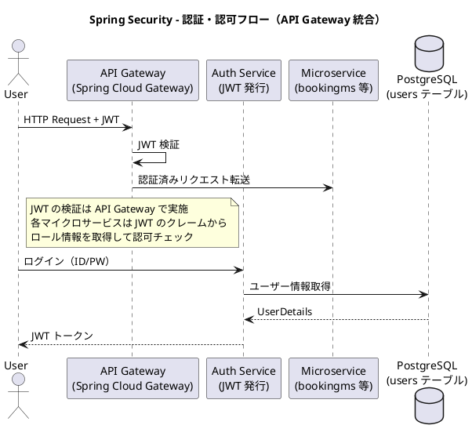
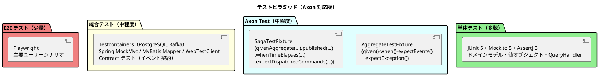

# バックエンドアーキテクチャ - 国際貨物輸送管理システム

## 概要

本ドキュメントでは、国際貨物輸送管理システムのバックエンドアーキテクチャを定義する。
Practical DDD in Enterprise Java（Chapter 6）の Axon Framework によるマイクロサービス実装思想（DDD・ヘキサゴナル・CQRS・Event Sourcing・Saga）を継承しつつ、フレームワークは最新の **Axon Framework 5 系** を採用し、Spring Boot 4.0.5 / Java 25 / Gradle 9.2.1 を基盤とした現代的な実装とする。

メッセージングは **Axon Framework 5 + Axon Kafka Extension** を採用し、イベントバスに **Aiven Managed Kafka** を使用する。マイクロサービス間のコマンド・イベント・クエリを統一的なバスで疎結合に連携する。集約は Event Sourcing で永続化し、Event Store は **JPA（PostgreSQL）ベースの EmbeddedEventStore** を使用する。参照モデル（Projection）は **MyBatis + PostgreSQL** で構築する。

> **注記（take-4 との差分）**: take-4 は Axon Framework 5 + Axon Server 構成。本プロジェクト（take-5）は Axon Server を廃止し、**Axon Kafka Extension** + **Aiven Managed Kafka** でイベントバスを実現する。Event Store は Axon の `JpaEventStorageEngine`（PostgreSQL バック）を使用する。デプロイは **Heroku** を採用する。
>
> - 参考実装の `@Entity` / `EntityManager`（JPA）→ 本プロジェクトでは **MyBatis Mapper + Mapper XML（または Annotation）** に置換
> - Aggregate の永続化は Axon の `JpaEventStorageEngine`（PostgreSQL）を使用
> - **Axon の Token Store / Saga Store は JDBC ベース実装**（`JdbcTokenStore` / `JdbcSagaStore`）を採用（MyBatis 採用時の標準的選択）
> - Annotation 中心 API から **機能ベース API（Configurer / Component Registry）** への移行が推奨される領域あり
> - `@Aggregate` / `@CommandHandler` / `@EventHandler` / `@QueryHandler` / `@Saga` は維持されるが、設定 API は刷新されている
> - イベントメッセージのシリアライザは Jackson が推奨デフォルト

## アーキテクチャパターン選択

### 業務領域カテゴリーの評価

| 評価軸 | 判定 | 根拠 |
| :--- | :--- | :--- |
| 業務領域カテゴリー | **中核の業務領域** | 国際貨物輸送は複雑なビジネスルール（経路設計、積み替え、例外処理）を持つ |
| データ構造の複雑さ | **複雑** | エンティティ間の関係が多く、コンテキスト間でデータを共有・変換する必要がある |
| 特殊要件 | **あり** | 状態遷移が厳密、監査記録（イベントログ）が必要、金額を扱う、業務プロセスが長期にわたる |

### 選択したアーキテクチャパターン

上記評価から、以下の組み合わせを採用する。

- **ドメインモデル**: ビジネスルールをドメインオブジェクトにカプセル化し、手続き的なロジックを排除する
- **ポートとアダプター（ヘキサゴナルアーキテクチャ）**: ドメインを技術的関心事から独立させ、テスト容易性を確保する
- **CQRS（コマンドクエリ責務分離）**: コマンド側を Event Sourcing 集約、クエリ側を Projection（読み取り最適化モデル）で分離する。Axon の `CommandGateway` / `QueryGateway` で実現する
- **Event Sourcing**: 集約の状態をイベント系列として保存し、状態を任意の時点に再現可能にする。監査記録と例外調査が容易になる
- **Saga（プロセスマネージャ）**: 予約→経路割り当て→追跡番号発行のような複数集約・複数コンテキストにまたがる業務プロセスを、`@Saga` で一貫性ある形で調整する
- **マイクロサービス**: 各バウンデッドコンテキストを独立したデプロイ単位とし、スケーラビリティと独立性を確保する

### Axon Framework 5 採用理由

| 観点 | 評価 |
| :--- | :--- |
| CQRS / Event Sourcing / Saga の統合 | フレームワークが Command Bus・Event Bus・Query Bus・Saga Manager を一体的に提供する |
| 分散メッセージング | Axon Kafka Extension + Aiven Kafka により同一インフラ上でイベントのルーティングが可能 |
| トランザクション境界 | 集約単位でのトランザクション・イベント発行を Axon が保証する |
| 監査・追跡 | Event Store に保存された全イベントを後から再生・分析可能 |
| 既存スタックとの親和性 | Spring Boot Starter による統合が容易 |
| 最新版の利点（v5） | Jakarta EE 対応、機能ベース設定 API、改善された Saga / Event Processor、Java 17+ の言語機能を活用した API 改善 |

> **参考**: 採用判断の詳細は [ADR-0001 メッセージング基盤として Axon Kafka + Aiven を採用する](../adr/0001-axon-framework-adoption.md) を参照。

## 全体アーキテクチャ

```plantuml
@startuml
title バックエンド全体アーキテクチャ（Axon ベースマイクロサービス）

package "Client Layer" {
  [Web Browser\n(React SPA)]
  [External System\n(Port Management / Customs)]
}

package "API Gateway (gatewayms)" {
  [Spring Cloud Gateway\n(@Route + JWT Filter)]
}

package "Auth Microservice (authms)" {
  [Auth REST Controller] as auth_rest
  [Domain Model\n(User, Role)] as auth_domain
  [MyBatis Mapper] as auth_repo
  [JWT Provider] as jwt
}

package "Booking Microservice (bookingms)" {
  package "interfaces/" {
    [rest/ Controller\n(@RestController)] as booking_rest
    [events/ EventHandler\n(@EventHandler → Projection)] as booking_events
  }
  package "application/internal/" {
    [commandgateways/\n(CargoBookingService)] as booking_cmd
    [querygateways/\n(CargoProjectionService)] as booking_qry
    [outboundservices/acl/\n(ExternalCargoRoutingService)] as booking_acl
    [sagaparticipants/\n(BookingSagaManager)] as booking_saga
  }
  package "domain/" {
    [model/\n(Cargo @Aggregate)] as booking_agg
    [commands/\n(BookCargoCommand 等)] as booking_cmds
    [events/\n(CargoBookedEvent 等)] as booking_evts
    [queries/, queryhandlers/, projections/] as booking_qparts
  }
}

package "Routing Microservice (routingms)" {
  [REST Controller] as routing_rest
  [Voyage @Aggregate] as routing_agg
  [Projection (MyBatis)] as routing_proj
}

package "Tracking Microservice (trackingms)" {
  [REST Controller] as tracking_rest
  [TrackingActivity @Aggregate] as tracking_agg
  [Projection (MyBatis)] as tracking_proj
  [Saga Manager] as tracking_saga
}

package "Handling Microservice (handlingms)" {
  [REST Controller] as handling_rest
  [HandlingActivity @Aggregate] as handling_agg
  [Projection (MyBatis)] as handling_proj
}

package "Billing Microservice (billingms)" {
  [REST Controller] as billing_rest
  [Invoice @Aggregate] as billing_agg
  [Projection (MyBatis)] as billing_proj
}

node "Aiven Kafka\n(マネージドサービス)" as kafka

database "auth_db\n(PostgreSQL)" as ADB
database "booking_read_db\n(PostgreSQL)" as BDB
database "routing_read_db\n(PostgreSQL)" as RDB
database "tracking_read_db\n(PostgreSQL)" as TDB
database "handling_read_db\n(PostgreSQL)" as HDB
database "billing_read_db\n(PostgreSQL)" as BIDB

[Web Browser\n(React SPA)] --> [Spring Cloud Gateway\n(@Route + JWT Filter)]
[External System\n(Port Management / Customs)] --> [Spring Cloud Gateway\n(@Route + JWT Filter)]

[Spring Cloud Gateway\n(@Route + JWT Filter)] --> auth_rest
[Spring Cloud Gateway\n(@Route + JWT Filter)] --> booking_rest
[Spring Cloud Gateway\n(@Route + JWT Filter)] --> routing_rest
[Spring Cloud Gateway\n(@Route + JWT Filter)] --> tracking_rest
[Spring Cloud Gateway\n(@Route + JWT Filter)] --> handling_rest
[Spring Cloud Gateway\n(@Route + JWT Filter)] --> billing_rest

auth_repo --> ADB

booking_cmd --> kafka : Kafka Events (CommandGateway)
booking_agg --> kafka : Kafka Events (apply)
kafka --> booking_events : Kafka Events (@EventHandler)
booking_events --> BDB : Projection 書き込み
booking_qry --> kafka : Kafka Events (QueryGateway)

routing_agg --> kafka : Kafka Events
kafka --> routing_proj : Kafka Events
routing_proj --> RDB

tracking_agg --> kafka : Kafka Events
kafka --> tracking_proj : Kafka Events
tracking_proj --> TDB

handling_agg --> kafka : Kafka Events
kafka --> handling_proj : Kafka Events
handling_proj --> HDB

billing_agg --> kafka : Kafka Events
kafka --> billing_proj : Kafka Events
billing_proj --> BIDB

booking_acl --> routing_rest : REST API（同期 / 経路候補取得）

note bottom of kafka
  Aiven Managed Kafka が
  イベントバスを提供する
  Event Store は JpaEventStorageEngine
  （PostgreSQL）を使用する
end note

@enduml
```



> **設計上のポイント**:
>
> - 各マイクロサービスは **Command 側のイベントを `JpaEventStorageEngine`（PostgreSQL）に永続化** する（Event Sourcing）
> - **Projection（Read Model）は各サービス専用の PostgreSQL** に MyBatis で保存する
> - サービス間のイベント連携は **Axon Kafka Extension 経由の Aiven Kafka** で行う（Axon Server 不要）
> - 同期通信が必要なクエリ（例: 経路候補取得）は ACL 経由の REST API、または Axon の分散 Query Gateway で実現する

## 境界付けられたコンテキスト

### コンテキストマップ



### 各コンテキストの説明

#### 1. Auth Context（認証コンテキスト）― authms

ユーザー認証・認可の中核ロジックを担う。JWT トークンの発行と検証を責務とする。ビジネスドメインとは独立した支援コンテキスト。認証データは状態指向のため Event Sourcing を適用せず、MyBatis で直接管理する。

| 要素 | 内容 |
| :--- | :--- |
| 集約ルート | `User` |
| 主要概念 | `Role`, `Password`, `Email`, `UserName` |
| 永続化 | MyBatis + PostgreSQL（Event Sourcing 適用外） |
| アクター | 全ユーザー（認証時） |
| DB | `auth_db` |

#### 2. Booking Context（予約コンテキスト）― bookingms

貨物予約の中核ロジックを担う。貨物の登録・経路割り当て・状態管理を責務とする。Saga（`BookingSagaManager`）で経路割り当て〜追跡番号発行まで自動化する。

| 要素 | 内容 |
| :--- | :--- |
| 集約ルート | `Cargo` |
| 主要概念 | `RouteSpecification`, `CargoItinerary`, `Delivery` |
| `BookingStatus` | `PRELIMINARY` / `ROUTE_PROPOSED` / `CONFIRMED` / `TRACKING_ISSUED` / `IN_TRANSIT` / `DELIVERED` / `SETTLED` / `CANCELLED` |
| 永続化 | Event Store（JpaEventStorageEngine / PostgreSQL）+ MyBatis Projection |
| Saga | `BookingSagaManager`（`CargoBookedEvent` → `AssignRouteToCargoCommand` → `AssignTrackingDetailsToCargoCommand`） |
| アクター | 荷主、営業担当者 |
| DB | `booking_read_db` |

#### 3. Routing Context（経路コンテキスト）― routingms

航路・運航スケジュールを管理する。経路候補の算出と最適経路の提案を担う。航海スケジュール登録（UC19）も担当する。

| 要素 | 内容 |
| :--- | :--- |
| 集約ルート | `Voyage` |
| 主要概念 | `CarrierMovement`, `Schedule`, `VoyageNumber` |
| 永続化 | Event Store（JpaEventStorageEngine / PostgreSQL）+ MyBatis Projection |
| アクター | 経路設計者 |
| DB | `routing_read_db` |

#### 4. Tracking Context（追跡コンテキスト）― trackingms

貨物の現在状態・輸送ステータスを管理する。CQRS の読み取り側最適化が特に有効なコンテキスト。Event Sourcing により全状態遷移を時系列で再生可能。

| 要素 | 内容 |
| :--- | :--- |
| 集約ルート | `TrackingActivity` |
| 主要概念 | `TrackingNumber`, `TransportStatus`, `TrackingExceptionEvent` |
| `TransportStatus` | `NOT_RECEIVED` / `RECEIVED` / `LOADED` / `IN_TRANSIT` / `UNLOADED` / `AWAITING_CLAIM` / `DELIVERED` / `MISROUTED` |
| 永続化 | Event Store（JpaEventStorageEngine / PostgreSQL）+ MyBatis Projection |
| アクター | 追跡管理者、荷主、荷受人 |
| DB | `tracking_read_db` |

#### 5. Handling Context（荷役コンテキスト）― handlingms

港湾での荷役作業を記録する。`CargoSnapshot` ACL で Booking Context への依存を吸収する。

| 要素 | 内容 |
| :--- | :--- |
| 集約ルート | `HandlingActivity` |
| 主要概念 | `HandlingType`, `CargoSnapshot`（ACL） |
| 永続化 | Event Store（JpaEventStorageEngine / PostgreSQL）+ MyBatis Projection |
| アクター | 荷役作業員 |
| DB | `handling_read_db` |

#### 6. Billing Context（請求コンテキスト）― billingms

運賃・請求書の管理を担う。`Money` 値オブジェクトで金額を厳密に管理する。`CargoDeliveredEvent` の受信で精算を開始する。

| 要素 | 内容 |
| :--- | :--- |
| 集約ルート | `Invoice` |
| 主要概念 | `Money`, `DiscountPolicy`, `PaymentStatus` |
| 永続化 | Event Store（JpaEventStorageEngine / PostgreSQL）+ MyBatis Projection |
| アクター | 経理担当者、荷主、決済機関 |
| DB | `billing_read_db` |

#### 7. Shared Domain（共有ドメイン）

`Location`（UN/LOCODE）のみ共有カーネルとして維持する。`VoyageNumber` は各コンテキスト固有型として定義し、共有しない。各マイクロサービスが共有ライブラリとして参照する。

## ヘキサゴナルアーキテクチャ（ポートとアダプター）

```plantuml
@startuml
title ヘキサゴナルアーキテクチャ - Booking Context (bookingms) の例（Axon 統合）

rectangle "Interfaces（入力側）" as iface #LightBlue {
  [CargoBookingController\n(interfaces/rest/)]
  [CargoProjectionsEventHandler\n(interfaces/events/)\n@EventHandler]
}

hexagon "Application Core" as core {
  rectangle "Application Layer\n(application/internal/)" {
    [CargoBookingService\n(commandgateways/)]
    [CargoProjectionService\n(querygateways/)]
    [BookingSagaManager\n(sagaparticipants/)\n@Saga]
    [ExternalCargoRoutingService\n(outboundservices/acl/)]
  }
  rectangle "Domain Layer\n(domain/)" {
    [Cargo @Aggregate\n(model/)]
    [BookCargoCommand 他\n(commands/)]
    [CargoBookedEvent 他\n(events/)]
    [CargoSummary Projection\n(projections/)]
    [CargoSummaryQuery 他\n(queries/)]
    [CargoAggregateQueryHandler\n(queryhandlers/)\n@QueryHandler]
  }
}

rectangle "Axon Framework / Spring（出力側）" as infra #LightGreen {
  [CommandGateway]
  [QueryGateway]
  [EventStore (JpaEventStorageEngine / PostgreSQL)]
  [MyBatis SqlSession / Mapper\n(Projection DB)]
  [RestTemplate / WebClient\n(Routing 同期呼出)]
}

[CargoBookingController\n(interfaces/rest/)] --> [CargoBookingService\n(commandgateways/)]
[CargoProjectionsEventHandler\n(interfaces/events/)\n@EventHandler] --> [MyBatis SqlSession / Mapper\n(Projection DB)]

[CargoBookingService\n(commandgateways/)] --> [CommandGateway]
[CommandGateway] --> [Cargo @Aggregate\n(model/)]
[Cargo @Aggregate\n(model/)] --> [EventStore (JpaEventStorageEngine / PostgreSQL)] : apply()

[CargoProjectionService\n(querygateways/)] --> [QueryGateway]
[QueryGateway] --> [CargoAggregateQueryHandler\n(queryhandlers/)\n@QueryHandler]
[CargoAggregateQueryHandler\n(queryhandlers/)\n@QueryHandler] --> [MyBatis SqlSession / Mapper\n(Projection DB)]

[BookingSagaManager\n(sagaparticipants/)\n@Saga] --> [CommandGateway]
[ExternalCargoRoutingService\n(outboundservices/acl/)] --> [RestTemplate / WebClient\n(Routing 同期呼出)]

@enduml
```



### レイヤー責務一覧

> Practical DDD in Enterprise Java (Chapter 6) の Axon ベースパッケージ構造に準拠する。

| レイヤー | パッケージ | 責務 | 依存方向 |
| :--- | :--- | :--- | :--- |
| **Domain** | `domain/model/`（Aggregate）、`domain/commands/`、`domain/events/`、`domain/queries/`、`domain/queryhandlers/`、`domain/projections/` | 集約・コマンド・イベント・クエリ・クエリハンドラ・Projection 定義 | 外部に依存しない（Axon の `@Aggregate` 等のアノテーションのみ依存） |
| **Application** | `application/internal/commandgateways/`、`application/internal/querygateways/`、`application/internal/sagaparticipants/`、`application/internal/outboundservices/acl/` | コマンド送信・クエリ発行・Saga・ACL 経由の外部マイクロサービス連携 | Domain と Axon Gateway に依存 |
| **Infrastructure** | `infrastructure/repositories/mybatis/`、`infrastructure/services/`、`infrastructure/config/` | MyBatis Mapper（Projection 用）、外部サービスクライアント、Axon 設定 | Application / Domain に依存 |
| **Interfaces** | `interfaces/rest/`、`interfaces/rest/dto/`、`interfaces/rest/transform/`、`interfaces/events/` | REST API Controller・DTO・DTO 変換・Projection 更新用 `@EventHandler` | Application に依存 |

### パッケージ構成（全マイクロサービス）

各バウンデッドコンテキストは独立した Spring Boot アプリケーション（独立した Gradle サブプロジェクト）として構成する。
認証コンテキスト（authms）もビジネスコンテキストと同様に独立したマイクロサービスとする（ただし Event Sourcing は適用しない）。

```
apps/backend/                            Gradle マルチプロジェクトルート
│
├── authms/                              ★ 認証マイクロサービス（独立デプロイ）
│   └── src/main/java/com/example/authms/
│       ├── domain/
│       │   └── model/
│       │       ├── aggregates/          集約ルート（User, UserId）
│       │       ├── entities/            エンティティ（Role）
│       │       └── valueobjects/        値オブジェクト（Password, Email, UserName）
│       ├── application/
│       │   └── internal/
│       │       ├── commandservices/     コマンドサービス（AuthCommandService）
│       │       └── queryservices/       クエリサービス（AuthQueryService）
│       ├── infrastructure/
│       │   ├── repositories/mybatis/        MyBatis Mapper（UserMapper, UserRepository 実装）
│       │   ├── security/                JWT 発行・検証（JwtTokenProvider）
│       │   └── config/                  SecurityConfig, CorsConfig
│       └── interfaces/
│           └── rest/                    REST Controller（AuthController）
│               └── dto/                 LoginRequest, TokenResponse
│
├── bookingms/                           ★ 予約マイクロサービス（独立デプロイ、Axon）
│   └── src/main/java/com/example/bookingms/
│       ├── BookingMSApplication.java
│       ├── domain/
│       │   ├── model/                   集約 Cargo（@Aggregate）と値オブジェクト群
│       │   ├── commands/                BookCargoCommand, AssignRouteToCargoCommand 他
│       │   ├── events/                  CargoBookedEvent, CargoRoutedEvent 他
│       │   ├── queries/                 CargoSummaryQuery, ListCargoSummariesQuery
│       │   ├── queryhandlers/           CargoAggregateQueryHandler（@QueryHandler）
│       │   └── projections/             CargoSummary（POJO、MyBatis ResultMap でマッピング）
│       ├── application/
│       │   └── internal/
│       │       ├── commandgateways/     CargoBookingService（CommandGateway ラッパー）
│       │       ├── querygateways/       CargoProjectionService（QueryGateway ラッパー）
│       │       ├── sagaparticipants/    BookingSagaManager（@Saga）
│       │       └── outboundservices/
│       │           └── acl/             ExternalCargoRoutingService（Routing 同期呼出）
│       ├── infrastructure/
│       │   ├── repositories/mybatis/        Projection 用 MyBatis Mapper（XML / Annotation）
│       │   ├── services/                Routing サービスクライアント実装
│       │   └── config/                  AxonConfig, KafkaConfig, JpaConfig
│       ├── interfaces/
│       │   ├── rest/                    REST Controller（CargoBookingController, CargoProjectionController）
│       │   │   ├── dto/                 リクエスト / レスポンス DTO
│       │   │   └── transform/           DTO ⇔ コマンド変換（Assembler）
│       │   └── events/                  Projection 更新用 EventHandler（CargoProjectionsEventHandler）
│       └── shareddomain/                共有ドメイン（Location, クロスコンテキストイベント）
│
├── routingms/                           ★ 経路設計マイクロサービス（独立デプロイ、Axon）
│   └── src/main/java/com/example/routingms/
│       ├── domain/
│       │   ├── model/                   Voyage（@Aggregate）、CarrierMovement
│       │   ├── commands/                RegisterVoyageCommand, UpdateVoyageScheduleCommand 他
│       │   ├── events/                  VoyageRegisteredEvent, VoyageScheduleUpdatedEvent
│       │   ├── queries/                 VoyageQuery, ListVoyagesQuery, OptimalRouteQuery
│       │   ├── queryhandlers/           VoyageQueryHandler
│       │   └── projections/             VoyageProjection（POJO + MyBatis ResultMap）
│       ├── application/
│       │   └── internal/
│       │       ├── commandgateways/     VoyageCommandService
│       │       └── querygateways/       VoyageQueryService
│       ├── infrastructure/
│       │   ├── repositories/mybatis/
│       │   └── config/
│       └── interfaces/
│           └── rest/                    REST Controller（VoyageController, RoutingController）
│
├── trackingms/                          ★ 追跡マイクロサービス（独立デプロイ、Axon）
│   └── src/main/java/com/example/trackingms/
│       ├── domain/
│       │   ├── model/                   TrackingActivity（@Aggregate）
│       │   ├── commands/                InitializeTrackingCommand, UpdateTransportStatusCommand 他
│       │   ├── events/                  TrackingInitializedEvent, TransportStatusUpdatedEvent, CargoDeliveredEvent
│       │   ├── queries/                 TrackingQuery, TrackingHistoryQuery
│       │   ├── queryhandlers/
│       │   └── projections/             TrackingProjection（POJO + MyBatis ResultMap）
│       ├── application/
│       │   └── internal/
│       │       ├── commandgateways/     TrackingCommandService
│       │       ├── querygateways/       TrackingQueryService
│       │       └── sagaparticipants/    TrackingSagaManager（必要に応じて）
│       ├── infrastructure/
│       │   ├── repositories/mybatis/
│       │   └── config/
│       └── interfaces/
│           ├── rest/                    REST Controller（TrackingController）
│           └── events/                  外部イベントハンドラ
│                                       （CargoRoutedEventHandler, HandlingActivityRegisteredEventHandler）
│
├── handlingms/                          ★ 荷役マイクロサービス（独立デプロイ、Axon）
│   └── src/main/java/com/example/handlingms/
│       ├── domain/
│       │   ├── model/                   HandlingActivity（@Aggregate）
│       │   ├── commands/                RegisterHandlingActivityCommand
│       │   ├── events/                  HandlingActivityRegisteredEvent
│       │   ├── queries/, queryhandlers/, projections/
│       ├── application/
│       │   └── internal/
│       │       ├── commandgateways/     HandlingCommandService
│       │       └── querygateways/
│       ├── infrastructure/
│       │   ├── repositories/mybatis/
│       │   └── config/
│       └── interfaces/
│           └── rest/                    REST Controller（HandlingController）
│
├── billingms/                           ★ 請求マイクロサービス（独立デプロイ、Axon）
│   └── src/main/java/com/example/billingms/
│       ├── domain/
│       │   ├── model/                   Invoice（@Aggregate）
│       │   ├── commands/                CalculateInvoiceCommand, SettleInvoiceCommand
│       │   ├── events/                  InvoiceCalculatedEvent, InvoiceSettledEvent
│       │   ├── queries/, queryhandlers/, projections/
│       ├── application/
│       │   └── internal/
│       │       ├── commandgateways/     BillingCommandService
│       │       └── querygateways/       BillingQueryService
│       ├── infrastructure/
│       │   ├── repositories/mybatis/
│       │   └── config/
│       └── interfaces/
│           ├── rest/                    REST Controller（BillingController）
│           └── events/                  CargoDeliveredEventHandler
│
├── gatewayms/                           ★ API Gateway（独立デプロイ）
│   └── src/main/java/com/example/gatewayms/
│       └── config/                      ルーティング定義、JWT フィルター
│
├── shared/                              ★ 共有ライブラリ（デプロイ単位ではない）
│   └── src/main/java/com/example/shared/
│       └── domain/
│           └── model/                   Location（UN/LOCODE）等
│
├── settings.gradle                      Gradle マルチプロジェクト設定
├── build.gradle                         共通設定（Java 25, Axon, 品質管理, テスト）
├── gradlew, gradlew.bat                 Gradle Wrapper (9.2.1)
└── config/
    ├── checkstyle/checkstyle.xml         Checkstyle ルール
    └── spotbugs/exclude-filter.xml       SpotBugs 除外フィルター
```

> **ポイント**: `apps/backend/` が Gradle マルチプロジェクトのルートであり、
> 各ディレクトリ（authms, bookingms, routingms, ...）は独立した Gradle サブプロジェクトとなる。
> それぞれが独自の `build.gradle`、`application.yml`、`Dockerfile` を持つ。
> `shared/` のみライブラリとして各サービスが `implementation project(':shared')` で依存する。
> フロントエンドコンテナを含む Docker Compose（`apps/docker-compose.yml`）は `apps/` 直下に配置する。

## CQRS 設計（Axon Framework）



### CQRS 適用方針

- **コマンド側**: ドメインモデル（集約）を通じて状態変更。`@CommandHandler` が不変条件を検証し、`AggregateLifecycle.apply()` でイベントを発行する。イベントは Axon の `JpaEventStorageEngine`（PostgreSQL）に永続化される
- **イベント駆動の Projection 更新**: `@EventHandler` が Event Store のイベントを購読し、MyBatis Mapper 経由で Projection テーブルを更新する。結果整合性ベース
- **クエリ側**: `@QueryHandler` が MyBatis Mapper の SQL（XML またはアノテーション）で Projection から画面表示用 DTO を返す。集約モデルを経由しない
- **CQRS が特に有効なコンテキスト**: Booking（一覧・詳細の頻繁な参照）、Tracking（リアルタイム状態確認・履歴照会）

### Aggregate 実装例（Booking Context）

```java
@Aggregate
public class Cargo {

    @AggregateIdentifier
    private String bookingId;
    private BookingAmount bookingAmount;
    private Location origin;
    private RouteSpecification routeSpecification;
    private Itinerary itinerary;
    private RoutingStatus routingStatus;
    private TransportStatus transportStatus;

    protected Cargo() {}

    @CommandHandler
    public Cargo(BookCargoCommand command) {
        if (command.getBookingAmount() < 0) {
            throw new IllegalArgumentException("Booking Amount cannot be negative");
        }
        apply(new CargoBookedEvent(
            command.getBookingId(),
            new BookingAmount(command.getBookingAmount()),
            new Location(command.getOriginLocation()),
            new RouteSpecification(
                new Location(command.getOriginLocation()),
                new Location(command.getDestLocation()),
                command.getDestArrivalDeadline())));
    }

    @CommandHandler
    public void handle(AssignRouteToCargoCommand command) {
        if (routingStatus.equals(RoutingStatus.ROUTED)) {
            throw new IllegalArgumentException("Cargo already routed");
        }
        apply(new CargoRoutedEvent(command.getBookingId(),
            new Itinerary(command.getLegs())));
    }

    @EventSourcingHandler
    public void on(CargoBookedEvent event) {
        this.bookingId = event.getBookingId();
        this.bookingAmount = event.getBookingAmount();
        this.origin = event.getOriginLocation();
        this.routeSpecification = event.getRouteSpecification();
        this.routingStatus = RoutingStatus.NOT_ROUTED;
        this.transportStatus = TransportStatus.NOT_RECEIVED;
    }

    @EventSourcingHandler
    public void on(CargoRoutedEvent event) {
        this.itinerary = event.getItinerary();
        this.routingStatus = RoutingStatus.ROUTED;
    }
}
```

### Projection 実装例（Booking Context、MyBatis）

```java
// 1) Projection 用の POJO（純粋なドメイン値、JPA アノテーション無し）
public class CargoSummary {
    private String bookingId;
    private String transportStatus;
    private RoutingStatus routingStatus;
    private String specOriginUnlocode;
    private String specDestinationUnlocode;
    private LocalDate deadline;
    // getters / setters / constructors / equals / hashCode
}

// 2) MyBatis Mapper（XML またはアノテーション）
@Mapper
public interface CargoSummaryMapper {

    @Insert("""
        INSERT INTO cargo_summary (
            booking_id, transport_status, routing_status,
            spec_origin_unlocode, spec_destination_unlocode, deadline,
            created_at, updated_at, version
        ) VALUES (
            #{bookingId}, #{transportStatus}, #{routingStatus},
            #{specOriginUnlocode}, #{specDestinationUnlocode}, #{deadline},
            NOW(), NOW(), 0
        )
        """)
    void insert(CargoSummary summary);

    @Update("""
        UPDATE cargo_summary
        SET routing_status = #{routingStatus},
            updated_at = NOW(),
            version = version + 1
        WHERE booking_id = #{bookingId}
        """)
    void updateRoutingStatus(@Param("bookingId") String bookingId,
                             @Param("routingStatus") RoutingStatus routingStatus);

    @Select("SELECT * FROM cargo_summary WHERE booking_id = #{bookingId}")
    @ResultMap("cargoSummaryResultMap")
    CargoSummary findByBookingId(@Param("bookingId") String bookingId);

    @Select("""
        SELECT * FROM cargo_summary
        ORDER BY created_at DESC
        LIMIT #{limit} OFFSET #{offset}
        """)
    @ResultMap("cargoSummaryResultMap")
    List<CargoSummary> findAll(@Param("offset") int offset, @Param("limit") int limit);
}

// 3) Event Handler（Axon @EventHandler で Projection を更新）
@Service
public class CargoProjectionsEventHandler {

    private final CargoSummaryMapper cargoSummaryMapper;

    public CargoProjectionsEventHandler(CargoSummaryMapper mapper) {
        this.cargoSummaryMapper = mapper;
    }

    @EventHandler
    @Transactional
    public void on(CargoBookedEvent event) {
        CargoSummary summary = new CargoSummary(
            event.getBookingId(), "",
            RoutingStatus.NOT_ROUTED,
            event.getOriginLocation().getUnLocCode(),
            event.getRouteSpecification().getDestination().getUnLocCode(),
            event.getRouteSpecification().getArrivalDeadline());
        cargoSummaryMapper.insert(summary);
    }

    @EventHandler
    @Transactional
    public void on(CargoRoutedEvent event) {
        cargoSummaryMapper.updateRoutingStatus(event.getBookingId(), RoutingStatus.ROUTED);
    }
}
```

> **ResultMap**: 複雑なオブジェクトはアノテーションよりも **XML マッパー** (`src/main/resources/mybatis/CargoSummaryMapper.xml`) に `<resultMap>` を定義する方が保守性が高い。本プロジェクトでは Read Model は XML マッパー方式を基本とする。

### Query Handler 実装例（MyBatis）

```java
@Component
public class CargoAggregateQueryHandler {

    private final CargoSummaryMapper cargoSummaryMapper;

    public CargoAggregateQueryHandler(CargoSummaryMapper mapper) {
        this.cargoSummaryMapper = mapper;
    }

    @QueryHandler
    public CargoSummaryResult handle(CargoSummaryQuery query) {
        CargoSummary summary = cargoSummaryMapper.findByBookingId(query.getBookingId());
        if (summary == null) {
            throw new CargoNotFoundException(query.getBookingId());
        }
        return new CargoSummaryResult(summary);
    }

    @QueryHandler
    public ListCargoSummaryResult handle(ListCargoSummariesQuery query) {
        List<CargoSummary> list = cargoSummaryMapper.findAll(query.getOffset(), query.getLimit());
        return new ListCargoSummaryResult(list);
    }
}
```

### MyBatis 設定例

```yaml
# application.yml
mybatis:
  mapper-locations: classpath:mybatis/*.xml
  type-aliases-package: com.example.bookingms.domain.projections
  configuration:
    map-underscore-to-camel-case: true   # DB の snake_case → Java の camelCase
    default-fetch-size: 100
    default-statement-timeout: 5
    cache-enabled: false                  # Read Model の整合性を優先
```

## イベント駆動設計（Axon Kafka Event Bus）



### ドメインイベント一覧

| イベント | 発行元サービス | 主な購読サービス | 用途 |
| :--- | :--- | :--- | :--- |
| `CargoBookedEvent` | bookingms | bookingms（Projection）, trackingms（Saga） | 予約登録 → 経路割り当て Saga 起動 |
| `CargoRoutedEvent` | bookingms | bookingms（Projection）, trackingms | 経路確定 → 追跡開始 |
| `CargoDestinationChangedEvent` | bookingms | bookingms（Projection） | 仕向地変更を Projection に反映 |
| `CargoTrackedEvent` | bookingms | bookingms（Projection）, Saga 終了 | 追跡番号発行 → Saga 終了 |
| `VoyageRegisteredEvent` / `VoyageScheduleUpdatedEvent` | routingms | routingms（Projection） | 航海スケジュール反映 |
| `HandlingActivityRegisteredEvent` | handlingms | trackingms, bookingms（Projection） | 荷役記録 → 輸送ステータス同期 |
| `TransportStatusUpdatedEvent` | trackingms | trackingms（Projection） | 状態遷移の Projection 反映 |
| `CargoDeliveredEvent` | trackingms | billingms（精算開始） | 配送完了 → 精算 |
| `InvoiceCalculatedEvent` / `InvoiceSettledEvent` | billingms | billingms（Projection）, 通知（将来） | 請求書発行・精算完了 |

### Axon Kafka 設定例

```yaml
# application.yml（各マイクロサービス）
axon:
  kafka:
    bootstrap-servers: ${KAFKA_BOOTSTRAP_SERVERS}
    default-topic: cargo-events
    producer:
      event-processor-mode: tracking
    properties:
      security.protocol: SSL
      ssl.truststore.location: /etc/ssl/certs/ca-certificates.crt
  
  eventhandling:
    processors:
      default:
        mode: tracking

spring:
  jpa:
    hibernate:
      ddl-auto: validate
```

> **設計注意**:
>
> - **Aggregate からの `apply()`** は同期的に Event Store に書き込まれ、トランザクションコミット後に Kafka 経由で購読者へ配信される
> - **クロスサービスのイベント購読** は、対象イベントクラスを共有ライブラリ（`shareddomain/events/`）に置き、購読側で `@EventHandler` を定義する
> - **Tracking Event Processor** は再生（リプレイ）が可能。Projection が壊れた場合は Token をリセットしてイベントを再生する
> - **トランザクション境界** は集約単位で完結する。サービスをまたぐ業務は Saga で調整する

## Saga パターン（Axon Saga）



### Saga 実装例

```java
@Saga
public class BookingSagaManager {

    @Autowired private transient CommandGateway commandGateway;
    @Autowired private transient CargoBookingService cargoBookingService;

    @StartSaga
    @SagaEventHandler(associationProperty = "bookingId")
    public void handle(CargoBookedEvent event) {
        commandGateway.send(new AssignRouteToCargoCommand(
            event.getBookingId(),
            cargoBookingService.getLegsForRoute(event.getRouteSpecification())));
    }

    @SagaEventHandler(associationProperty = "bookingId")
    public void handle(CargoRoutedEvent event) {
        String trackingId = UUID.randomUUID().toString();
        SagaLifecycle.associateWith("trackingId", trackingId);
        commandGateway.send(new AssignTrackingDetailsToCargoCommand(
            event.getBookingId(), trackingId));
    }

    @SagaEventHandler(associationProperty = "trackingId")
    public void handle(CargoTrackedEvent event) {
        SagaLifecycle.end();
    }
}
```

### 補償アクション

Saga で連鎖するコマンドが失敗した場合、`@SagaEventHandler` 内で補償用のコマンド（`CancelCargoCommand` 等）を発行することで、結果整合性を担保する。

## マイクロサービス間通信

### 通信方式一覧

| 通信パターン | 発信元 | 発信先 | 方式 | 内容 |
| :--- | :--- | :--- | :--- | :--- |
| 同期（クエリ） | bookingms | routingms | REST（ACL 経由） | 経路候補取得 |
| 非同期（イベント） | bookingms | bookingms / trackingms | Axon Kafka Event Bus | 予約・経路・追跡 |
| 非同期（イベント） | handlingms | trackingms / bookingms | Axon Kafka Event Bus | 荷役記録 |
| 非同期（イベント） | trackingms | billingms | Axon Kafka Event Bus | 配送完了 |
| 内部コマンド連携 | Saga（bookingms） | bookingms / trackingms | Axon Command Bus | Saga からの集約呼出 |

### 同期通信（REST）例

```java
@Service
public class ExternalCargoRoutingService {

    private final RestTemplate restTemplate;
    private final String routingServiceUrl;

    public CargoItinerary fetchRouteForSpecification(RouteSpecification spec) {
        TransitPath transitPath = restTemplate.getForObject(
            routingServiceUrl + "/api/v1/routes/optimal"
                + "?origin={origin}&destination={destination}&deadline={deadline}",
            TransitPath.class,
            spec.getOrigin().getUnLocCode(),
            spec.getDestination().getUnLocCode(),
            spec.getArrivalDeadline());
        return toCargoItinerary(transitPath);
    }

    private CargoItinerary toCargoItinerary(TransitPath transitPath) {
        List<Leg> legs = transitPath.getTransitEdges().stream()
            .map(edge -> new Leg(
                edge.getVoyageNumber(),
                edge.getFromUnLocode(),
                edge.getToUnLocode(),
                edge.getFromDate(),
                edge.getToDate()))
            .collect(Collectors.toList());
        return new CargoItinerary(legs);
    }
}
```

## データベース設計方針

### Database per Service パターン

各マイクロサービスは **専用の Read Model 用 DB（Projection）** を持つ。コマンド側のイベントは Axon の `JpaEventStorageEngine`（PostgreSQL）に統合的に保存される。

| サービス | DB 用途 | データベース名 | 主要 Projection / テーブル | RDBMS |
| :--- | :--- | :--- | :--- | :--- |
| authms | 状態 DB（CRUD） | auth_db | users, roles, user_roles | PostgreSQL 16.x |
| bookingms | Read Model + Event Store | booking_read_db | cargo_summary_projection, domain_event_entry | PostgreSQL 16.x |
| routingms | Read Model + Event Store | routing_read_db | voyage_projection, schedule_projection, domain_event_entry | PostgreSQL 16.x |
| trackingms | Read Model + Event Store | tracking_read_db | tracking_projection, handling_event_projection, domain_event_entry | PostgreSQL 16.x |
| handlingms | Read Model + Event Store | handling_read_db | handling_activity_projection, domain_event_entry | PostgreSQL 16.x |
| billingms | Read Model + Event Store | billing_read_db | invoice_projection, domain_event_entry | PostgreSQL 16.x |

### トランザクション管理

- **集約単位**: 単一の集約に対するコマンド処理は Axon が自動的にトランザクションを管理する
- **Projection 更新**: `@EventHandler` の処理は `@Transactional`（Spring）で保護し、Axon Token Store（JDBC）と MyBatis による Read Model 更新を **同一 JDBC トランザクション** で実行する
- **MyBatis SqlSession**: Spring の `DataSourceTransactionManager` で管理。Token Store も同一 DataSource を共有することで at-least-once 配信時の冪等性を担保
- **サービス間**: 結果整合性（Eventual Consistency）。Saga による補償アクションで整合性を担保する

### Event Store の運用方針

- イベントのスキーマ変更は **アップキャスター（Upcaster）** で吸収する
- 巨大な集約は **スナップショット** を定期取得し、再生コストを抑制する
- Read Model の再構築が必要な場合は **Token をリセット** してイベントを再生する
- Axon の `JdbcTokenStore` / `JdbcSagaStore` は Read Model と同じ PostgreSQL 内に `token_entry` / `saga_entry` テーブルを持つ（Read Model DB の Flyway マイグレーションで作成）

## API 設計方針

### REST API 設計原則

| 原則 | 内容 |
| :--- | :--- |
| **リソース指向** | URL はリソースを表す名詞。動詞は HTTP メソッドで表現する |
| **バージョニング** | `/api/v1/` プレフィックスでバージョンを管理する |
| **コマンド/クエリ分離** | コマンドは POST/PUT/DELETE、クエリは GET を厳格に分離する |
| **レスポンス形式** | JSON。エラーレスポンスは `{ "code": "BOOKING_NOT_FOUND", "message": "..." }` 形式 |
| **ステータスコード** | 成功: 200/201/202/204、クライアントエラー: 400/404/409、サーバーエラー: 500 |
| **API Gateway** | Spring Cloud Gateway で各マイクロサービスへルーティングする |
| **非同期コマンドの結果通知** | コマンド受付時に 202 Accepted を返し、Projection 反映後にクエリで確認可能とする |

### 主要エンドポイント

#### authms

| メソッド | パス | 説明 | 対応 UC |
| :--- | :--- | :--- | :--- |
| `POST` | `/api/v1/auth/login` | ログイン（JWT 発行） | - |
| `POST` | `/api/v1/auth/register` | ユーザー登録 | - |
| `GET` | `/api/v1/auth/me` | 認証ユーザー情報取得 | - |

#### bookingms

| メソッド | パス | 説明 | 対応 UC |
| :--- | :--- | :--- | :--- |
| `POST` | `/api/v1/bookings` | 貨物予約の登録（BookCargoCommand） | UC03 |
| `GET` | `/api/v1/bookings/{bookingId}` | 予約詳細の取得（CargoSummaryQuery） | UC03 |
| `GET` | `/api/v1/bookings` | 予約一覧（ListCargoSummariesQuery） | UC03 |
| `PUT` | `/api/v1/bookings/{bookingId}/route` | 経路の割り当て（AssignRouteToCargoCommand） | UC09 |
| `PUT` | `/api/v1/bookings/{bookingId}/destination` | 仕向地変更（ChangeDestinationCommand） | UC08 |
| `PUT` | `/api/v1/bookings/{bookingId}/confirm` | 予約確定 | UC11 |
| `POST` | `/api/v1/bookings/{bookingId}/tracking-number` | 追跡番号発行（AssignTrackingDetailsToCargoCommand） | UC12 |
| `POST` | `/api/v1/quotes` | 輸送見積作成 | UC01 |
| `POST` | `/api/v1/shippers` | 荷主登録 | UC02 |

#### routingms

| メソッド | パス | 説明 | 対応 UC |
| :--- | :--- | :--- | :--- |
| `GET` | `/api/v1/voyages` | 航海スケジュール一覧 | UC05 |
| `POST` | `/api/v1/voyages` | 航海スケジュール登録（RegisterVoyageCommand） | UC19 |
| `PUT` | `/api/v1/voyages/{voyageNumber}` | 航海スケジュール更新（UpdateVoyageScheduleCommand） | UC19 |
| `GET` | `/api/v1/routes/optimal` | 最適経路候補算出 | UC06 |

#### trackingms

| メソッド | パス | 説明 | 対応 UC |
| :--- | :--- | :--- | :--- |
| `GET` | `/api/v1/tracking/{trackingNumber}` | 追跡情報照会（TrackingQuery） | UC15 |
| `PUT` | `/api/v1/tracking/{trackingNumber}/status` | 貨物状態更新（UpdateTransportStatusCommand） | UC14 |
| `POST` | `/api/v1/tracking/{trackingNumber}/exceptions` | 例外処理 | UC16 |

#### handlingms

| メソッド | パス | 説明 | 対応 UC |
| :--- | :--- | :--- | :--- |
| `POST` | `/api/v1/handling` | 荷役作業の登録（RegisterHandlingActivityCommand） | UC13 |

#### billingms

| メソッド | パス | 説明 | 対応 UC |
| :--- | :--- | :--- | :--- |
| `POST` | `/api/v1/billing/{bookingId}/calculate` | 輸送料金算出（CalculateInvoiceCommand） | UC17 |
| `POST` | `/api/v1/billing/{bookingId}/settlement` | 精算処理（SettleInvoiceCommand） | UC18 |

## セキュリティ設計

### Spring Security による認証・認可



### ロール設計

| ロール | 権限 | 対象ユーザー |
| :--- | :--- | :--- |
| `ROLE_SHIPPER` | 予約照会・追跡照会 | 荷主 |
| `ROLE_SALES` | 予約登録・経路割り当て | 営業担当者 |
| `ROLE_HANDLER` | 荷役作業登録 | 荷役作業員 |
| `ROLE_TRACKER` | 追跡情報管理・例外対応 | 追跡管理者 |
| `ROLE_ACCOUNTANT` | 請求書管理 | 経理担当者 |
| `ROLE_ROUTING` | 航海スケジュール登録・更新 | 経路設計者 |
| `ROLE_ADMIN` | 全機能 | システム管理者 |

## テスト戦略



### 各層のテスト方針

| テスト対象 | テスト種別 | 使用技術 | 方針 |
| :--- | :--- | :--- | :--- |
| 集約（Aggregate） | Axon Test Fixture | `AggregateTestFixture` | Given Events → When Command → Expect Events / Exception を BDD 風に記述 |
| Saga | Axon Test Fixture | `SagaTestFixture` | 与えるイベント / 発行されるコマンド / Saga の関連付けと終了を検証 |
| 値オブジェクト | 単体テスト | JUnit 5, AssertJ | 不変条件・等価性を網羅的にテスト |
| QueryHandler / Projection | 統合テスト | Testcontainers（PostgreSQL） | 実 DB への Projection 反映と Named Query を検証 |
| REST Controller | 統合テスト | Spring MockMvc / WebTestClient | エンドポイントの入出力・バリデーション・JWT 検証 |
| サービス間契約 | Contract テスト | Spring Cloud Contract（イベント契約） | クロスサービスのイベントスキーマを検証 |
| E2E | E2E テスト | Playwright | 主要ユーザーシナリオ（予約 → 経路 → 追跡 → 配達） |

### Aggregate Test の例

```java
class CargoAggregateTest {

    private FixtureConfiguration<Cargo> fixture;

    @BeforeEach
    void setUp() {
        fixture = new AggregateTestFixture<>(Cargo.class);
    }

    @Test
    void bookCargo_発行されるイベント() {
        fixture.givenNoPriorActivity()
            .when(new BookCargoCommand("B001", 1000,
                    "USNYC", "JPTYO", new Date()))
            .expectSuccessfulHandlerExecution()
            .expectEvents(new CargoBookedEvent("B001", new BookingAmount(1000),
                    new Location("USNYC"),
                    new RouteSpecification(
                        new Location("USNYC"), new Location("JPTYO"), any(Date.class))));
    }
}
```

## マイクロサービス技術スタック

| カテゴリ | 技術 | バージョン |
| :--- | :--- | :--- |
| フレームワーク | Spring Boot | 4.0.5 |
| Java | Eclipse Temurin | 25 |
| CQRS / Event Sourcing / Saga | Axon Framework | 5.x |
| メッセージング基盤 | **Axon Kafka Extension + Aiven Managed Kafka** | Axon 5 互換版 |
| Event Store | `JpaEventStorageEngine`（PostgreSQL バック） | Axon 5 同梱 |
| データアクセス（Projection / Auth） | **MyBatis + mybatis-spring-boot-starter** | 3.5.x / 3.0.x |
| Axon Token / Saga Store | `JdbcTokenStore` / `JdbcSagaStore` | Axon 5 同梱 |
| API ゲートウェイ | Spring Cloud Gateway | 4.x |
| サービス間通信（同期） | RestTemplate / WebClient | - |
| データベース | PostgreSQL / H2（開発用） | 16.x / 2.x |
| マイグレーション（Projection） | Flyway | 10.x |
| API ドキュメント | springdoc-openapi | 3.0.2 |
| ビルドツール | Gradle (Wrapper) | 9.2.1 |
| 品質管理 | Checkstyle / SpotBugs | 10.21.4 / 6.1.3 |
| カバレッジ | JaCoCo | - |
| 品質分析 | SonarQube | 6.3.1.5724（プラグイン） |
| コンテナ | Docker / Docker Compose | - |
| テスト | JUnit 5, Mockito, AssertJ, Testcontainers, Axon Test | 1.20.4 |
| アーキテクチャテスト | ArchUnit | 1.4.1 |
| Contract テスト | Spring Cloud Contract | 4.x |
| デプロイ | Heroku | - |

### 依存関係（build.gradle 抜粋）

```groovy
dependencies {
    // Axon Framework
    implementation 'org.axonframework:axon-spring-boot-starter:5.x'
    // Axon Kafka Extension（Aiven Managed Kafka との統合）
    implementation 'org.axonframework.extensions.kafka:axon-kafka-spring-boot-starter:4.x'
    // その他依存関係...
}
```

### 環境変数（Heroku / Kafka 接続情報）

| 環境変数 | 説明 |
| :--- | :--- |
| `KAFKA_BOOTSTRAP_SERVERS` | Aiven Kafka のブートストラップサーバーアドレス |
| `KAFKA_SECURITY_PROTOCOL` | SSL（Aiven のデフォルト） |
| `DATABASE_URL` | Heroku PostgreSQL の接続 URL |

## 参照

- [要件定義書](../requirements/requirements_definition.md)
- [システムユースケース](../requirements/system_usecase.md)
- [ユーザーストーリー](../requirements/user_story.md)
- [フロントエンドアーキテクチャ設計](architecture_frontend.md)
- [インフラストラクチャアーキテクチャ設計](architecture_infrastructure.md)
- [ADR-0001 メッセージング基盤として Axon Kafka + Aiven を採用する](../adr/0001-axon-framework-adoption.md)
- [アーキテクチャ設計ガイド](../reference/アーキテクチャ設計ガイド.md)
