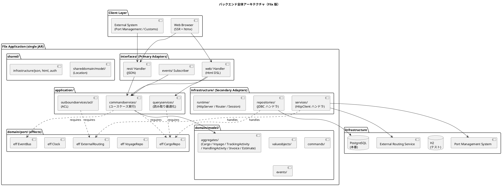
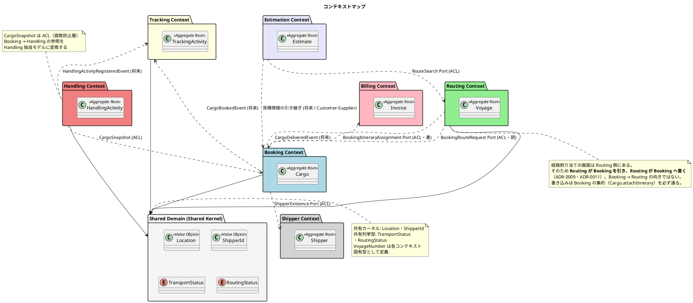
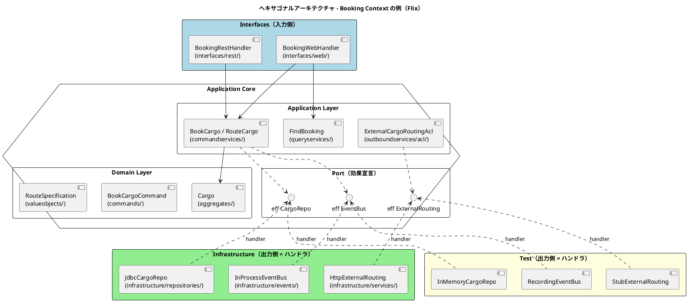
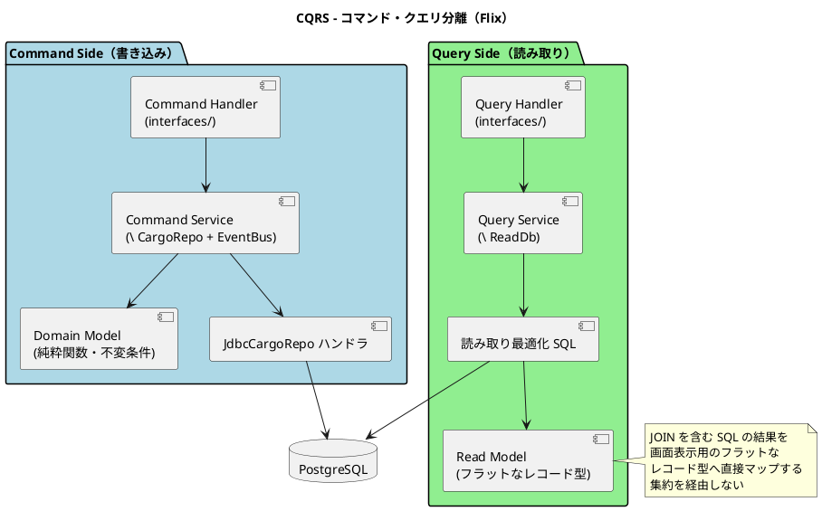
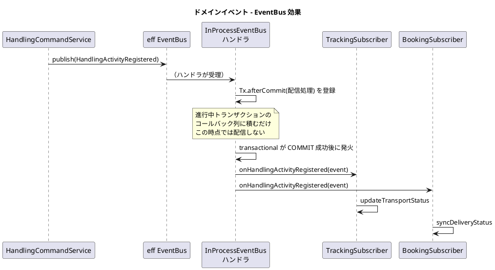
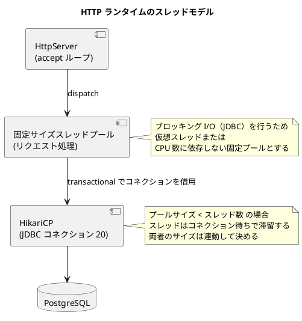
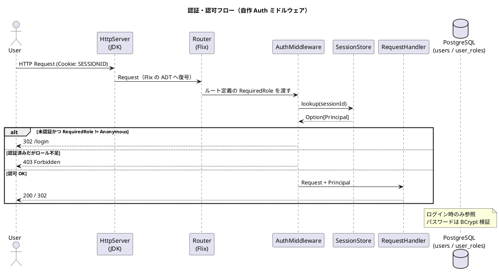
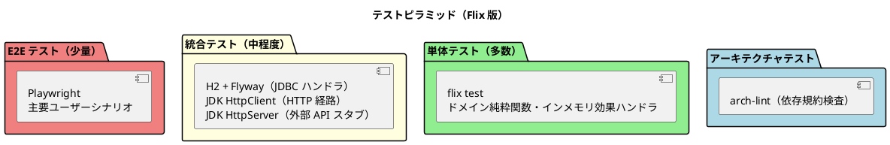

# バックエンドアーキテクチャ - 国際貨物輸送管理システム（Flix 版）

## 概要

本ドキュメントでは、国際貨物輸送管理システムのバックエンドアーキテクチャを定義する。
Jakarta EE 参考実装のアーキテクチャ思想（DDD・ヘキサゴナル・イベント駆動）を継承しつつ、
**Flix 単一言語 + Java 相互運用**を基盤とした関数型の実装に移植する。

Java/Spring 版との最大の相違は次の 2 点である。

| 観点 | Java/Spring 版 | Flix 版 |
| :--- | :--- | :--- |
| 出力ポートの表現 | `interface` + DI コンテナによる実装注入 | **代数的効果（effect）+ ハンドラ**による実装注入 |
| テストダブル | Mockito によるモック生成 | **インメモリ実装のハンドラ**を適用（追加ライブラリ不要） |

## アーキテクチャパターン選択

### 業務領域カテゴリーの評価

| 評価軸 | 判定 | 根拠 |
| :--- | :--- | :--- |
| 業務領域カテゴリー | **中核の業務領域** | 国際貨物輸送は複雑なビジネスルール（通関、積み替え、例外処理）を持つ |
| データ構造の複雑さ | **複雑** | エンティティ間の関係が多く、コンテキスト間でデータを共有・変換する必要がある |
| 特殊要件 | **あり** | 金額を扱う（Billing Context）、監査記録が必要（荷役履歴）、状態遷移が厳密 |

### 選択したアーキテクチャパターン

- **ドメインモデル**: ビジネスルールを ADT とその上の純粋関数にカプセル化する
- **ポートとアダプター（ヘキサゴナル）**: 出力ポートを効果として定義し、ドメイン層を技術的関心事から独立させる
- **CQRS**: Booking / Tracking の読み書き負荷特性の違いに対応し、クエリを読み取り最適化モデルで返す

Billing Context は `Money` 値オブジェクトで金額を管理するが、初期フェーズではイベントソーシングを適用しない。

### Flix 言語機能とアーキテクチャ要素の対応

| アーキテクチャ要素 | Flix の表現 | 効能 |
| :--- | :--- | :--- |
| 値オブジェクト | `enum` の単一ケース + スマートコンストラクタ（`Result` を返す） | 不正値をコンパイル境界で排除。等価性は構造的 |
| エンティティ・集約ルート | 不変レコード（`{ id = ..., status = ... }`）または `enum` | 状態遷移を「旧状態 → 新状態」を返す純粋関数として書ける |
| 状態（Status 系） | `enum`（列挙） | パターンマッチの網羅性検査により、状態追加時の考慮漏れをコンパイラが検出する |
| ドメインサービス | 純粋関数（効果なし） | 副作用がないことが型に現れる |
| 出力ポート（リポジトリ・ACL） | `eff`（効果宣言） | 実装の注入をハンドラで行う。DI コンテナ不要 |
| アプリケーションサービス | 効果を要求する関数（`\ CargoRepo + Clock`） | 必要な副作用が**シグネチャに列挙される**。隠れた依存が作れない |
| ドメインイベント | `enum DomainEvent` + `eff EventBus` | 発行先を効果として抽象化し、同期／非同期を後から差し替えられる |
| ビジネスルール違反 | `Result[DomainError, t]` | 例外に頼らず、失敗を型で強制的に扱わせる |
| 経路の到達可能性判定 | Datalog 制約（`#{ ... }` + `query`） | Routing Context の探索ロジックを宣言的に記述できる（詳細は Routing の節） |

## 全体アーキテクチャ



## 境界付けられたコンテキスト

コンテキストの分割・責務・ユビキタス言語は [ドメインモデル設計](domain-model.md) を正典とする。本節ではアーキテクチャ上の位置づけのみを示す。



| コンテキスト | 集約ルート | Flix モジュール | 主なアクター |
| :--- | :--- | :--- | :--- |
| Booking（予約） | `Cargo` | `CargoTracker/Booking` | 荷主、営業担当者 |
| Shipper（荷主） | `Shipper` | `CargoTracker/Shipper` | 営業担当者 |
| Estimation（見積） | `Estimate` | `CargoTracker/Estimation` | 営業担当者、荷主 |
| Routing（経路） | `Voyage` | `CargoTracker/Routing` | 経路設計者、外部経路システム |
| Tracking（追跡） | `TrackingActivity` | `CargoTracker/Tracking` | 追跡管理者、荷主、荷受人 |
| Handling（荷役） | `HandlingActivity` | `CargoTracker/Handling` | 荷役作業員、港湾管理システム、税関 |
| Billing（精算） | `Invoice` | `CargoTracker/Billing` | 経理担当者、決済機関 |
| Shared（共有） | - | `CargoTracker/Shared` | - |

> **共有対象**: 共有カーネルは `Location`・`ShipperId`、共有列挙型は `TransportStatus`・`RoutingStatus` とする。
> 正典は [ドメインモデル設計 - 共有コンポーネント一覧](domain-model.md) であり、増やす場合はそちらを先に更新する。

## ヘキサゴナルアーキテクチャ（効果としてのポート）



### ポートの定義と注入（設計イメージ）

> 以下のコードは Flix 0.75.1 の構文に基づく。効果宣言・ハンドラ・Java 相互運用の各構文は実機で動作確認済みである
> （[アプリケーション開発環境セットアップ手順書](../operation/アプリケーション開発環境セットアップ手順書.md) 7 章）。

```flix
/// 出力ポート = 効果宣言（domain/port/）
eff CargoRepo {
    def findByTrackingId(id: TrackingId): Option[Cargo]
    def store(cargo: Cargo): Unit
    def listAll(): List[Cargo]
}

eff EventBus {
    def publish(event: DomainEvent): Unit
}

eff Clock {
    def now(): Timestamp
}

/// アプリケーションサービス（application/commandservices/）
/// 必要な副作用がシグネチャにすべて現れる
def routeCargo(cmd: RouteCargoCommand): Result[DomainError, Cargo] \ CargoRepo + EventBus + Clock =
    match CargoRepo.findByTrackingId(cmd.trackingId) {
        case None        => Err(CargoNotFound(cmd.trackingId))
        case Some(cargo) =>
            // ドメイン層の純粋関数。効果を一切要求しない
            match Cargo.assignItinerary(cargo, cmd.itinerary, Clock.now()) {
                case Err(e)      => Err(e)
                case Ok(updated) =>
                    CargoRepo.store(updated);
                    EventBus.publish(CargoRouted(updated.trackingId, Clock.now()));
                    Ok(updated)
            }
    }

/// 本番のアダプタ（infrastructure/repositories/）
/// ハンドラの各操作は継続 k を最後の引数に受け取り、k(戻り値) で呼び出し元へ返す
def withJdbcCargoRepo(f: Unit -> a \ ef + CargoRepo): a \ (ef - CargoRepo) + Tx + IO =
    run f() with handler CargoRepo {
        def findByTrackingId(id, k) = k(CargoSql.selectByTrackingId(Tx.connection(), id))
        def store(cargo, k)         = CargoSql.upsert(Tx.connection(), cargo); k()
        def listAll(k)              = k(CargoSql.selectAll(Tx.connection()))
    }

/// 合成ルート（infrastructure/runtime/）はハンドラを入れ子に適用する
def runWithProductionAdapters(f: Unit -> a \ ef): a \ (ef - CargoRepo - EventBus - Clock) + IO =
    withSystemClock(() ->
        withInProcessEventBus(subscribers(), () ->
            withJdbcCargoRepo(f)))
```

**この設計の要点**

1. ドメイン層（`Cargo.assignItinerary`）は効果を要求しない純粋関数であり、依存も副作用も持たない
2. アプリケーション層が要求する効果は関数シグネチャに列挙され、**隠れた依存を作れない**（DI コンテナのフィールド注入のような不透明さがない）
3. アダプタの差し替えは `run ... with handler` の入れ替えだけで済む。テストでは `InMemory.cargoRepoHandler(...)` を適用する
4. `Clock` を効果にすることで、期限判定などの時刻依存ロジックをテストで完全に固定できる

### レイヤー責務一覧

> **効果の配置**: 業務ポート（`CargoRepo`・`ExternalRouting` 等）は各コンテキストの `domain/port` に置く。
>
> **技術横断の効果は「宣言」と「実装」で置き場所を分ける**（IT3-IT4 の実装で確定）。
>
> | 効果 | 宣言（`eff`） | 実装（ハンドラ） |
> | :--- | :--- | :--- |
> | `Session`・`Password`・`UserRepo`・`Clock` | `shared/domain/port/` | `shared/infrastructure/{security,time}/` |
> | `Tx` | `shared/infrastructure/db/` | 同左（`transactional` / `readOnly` がスコープ関数を兼ねる） |
>
> 宣言をドメイン側へ置くのは、これらを**要求する**のがアプリケーション層であり、
> アプリケーション層は `infrastructure` を参照できない（`arch-lint` 規約 3）ためである。
> `Tx` だけが例外なのは、宣言とスコープ関数（`transactional`）が一体であり、
> スコープ関数がコネクションプールという技術的資源を直接扱うからである。

| レイヤー | モジュール | 責務 | 依存方向 |
| :--- | :--- | :--- | :--- |
| **Domain** | `domain/model/{aggregates,valueobjects,commands,events}`, `domain/port` | ビジネスルール・不変条件・集約・値オブジェクト・コマンド・ドメインイベント・**業務ポートの効果宣言** | 外部に依存しない。`Shared` 以外の他コンテキストを参照しない |
| **Application** | `application/{commandservices,queryservices,outboundservices/acl}` | ユースケース実行・集約操作・ACL 経由の外部連携 | Domain のみ依存。効果を「要求」するがハンドラは知らない |
| **Infrastructure** | `infrastructure/{repositories,services,events,runtime}` | **効果ハンドラの実装**（JDBC・HttpClient・イベント配信）、HTTP サーバ起動、合成ルート | Application / Domain に依存 |
| **Interfaces** | `interfaces/{web,rest,rest/dto,rest/transform,events}` | ルーティング・リクエスト復号・`Html` 生成・JSON 変換・イベント購読 | Application に依存 |

### アーキテクチャ規約（`arch-lint` で機械検査する）

1. `domain/**` は `infrastructure/**`・`interfaces/**` を参照しない
2. `domain/**` は `java.**` を参照しない（Java 相互運用はインフラ層に閉じる）
3. `application/**` は `infrastructure/**` を参照しない（効果宣言経由でのみ結合する）
4. 異なる Bounded Context 間で直接参照しない（`Shared` の共有カーネル、ACL、イベントのみ）
5. **効果ハンドラの合成**（複数ハンドラの入れ子適用）は `infrastructure/runtime/**` とテストコードにのみ現れる
6. `application/**`・`interfaces/**`・`domain/**` に `run ... with handler` が出現しない
7. ルーティング表は 1 つだけ（ADR-0005）
8. 状態を変える `form` は `Components.form` を通す（CSRF トークンの埋め込み漏れを防ぐ）
9. 画面から参照する静的資産は `resources/static/**` に置く
10. `shared/**` は Bounded Context を参照しない
11. 合成ルートの BC 間翻訳は `src/composition/acl/` にのみ置く（ADR-0011）

> **規約の正典は [arch-lint 規約一覧](arch_lint_rules.md) である**。本表は要約であり、
> 検出方法・既知の例外・既知の穴はそちらに書く。IT9 のレビュー H6 で、
> **本表が 1〜6 のまま止まっていて規約 7〜11 が見えない**状態が見つかった。
> 規約を足したら両方を同じ変更で更新する。

> **規約 5・6 の区別**（IT1 のレビュー指摘により明確化）:
>
> - **ハンドラの定義**（`withJdbcCargoRepo` のように 1 つの効果へ実装を与えるラップ関数）は、
>   対応するアダプタのディレクトリ（`infrastructure/{repositories,services,db}`）に置いてよい
> - **ハンドラの合成**（`withSystemClock(() -> withEventBus(() -> withJdbcRepo(f)))` のように
>   複数を入れ子で適用し、実行可能な形にすること）は合成ルートとテストのみで行う
>
> 当初「`run ... with` の出現箇所」で規約を定義していたが、それではアダプタ側のラップ関数まで
> 違反になり、設計自身のコード例とも矛盾していた。`arch-lint` は規約 6（レイヤ違反）を構文走査で、
> 規約 5（合成）は「ハンドラ適用が 2 段以上入れ子になっている箇所」として検査する。

## モジュール構成

### モジュール命名規約（Flix の制約に基づく）

Flix 0.75.1 には次の制約がある（IT1 で実測）。

| 制約 | 内容 |
| :--- | :--- |
| 同名トップレベルモジュールの重複禁止 | `mod CargoTracker { ... }` を複数ファイルで宣言できない |
| ドット区切り宣言は参照不可 | `mod A.B.C { ... }` と宣言しても `A.B.C.f` で参照解決できない |
| 型エイリアスは非公開 | `pub type alias` はモジュール境界を越えて公開されない。`enum` で包む |

したがって**モジュール階層をドットではなく接頭辞で表現する**。

| ディレクトリ | モジュール名 |
| :--- | :--- |
| `shared/infrastructure/db/Pool.flix` | `SharedDbPool` |
| `shared/infrastructure/http/Router.flix` | `SharedHttpRouter` |
| `shared/infrastructure/html/Html.flix` | `SharedHtml` |
| `shared/infrastructure/runtime/Composition.flix` | `AppComposition` |
| `tracking/domain/port/ReadDb.flix` | `TrackingReadDb` |
| `tracking/application/queryservices/TrackingQuery.flix` | `TrackingQuery` |
| `tracking/infrastructure/repositories/JdbcReadDb.flix` | `TrackingJdbcReadDb` |
| `tracking/interfaces/web/TrackingPublicPages.flix` | `TrackingPublicPages` |

**レイヤ規約の検査はモジュール名ではなくディレクトリパスで行う**（`arch-lint`）。

> **予約語に注意**: `run`・`as`・`handler` は予約語であり、関数名・変数名に使えない。

```
apps/cargo-tracker/
├── flix.toml                       # 依存・パッケージ定義
├── src/
│   ├── Main.flix                   # エントリポイント（合成ルート呼び出し）
│   ├── booking/
│   │   ├── domain/
│   │   │   ├── model/
│   │   │   │   ├── Cargo.flix              # 集約ルート・状態遷移関数
│   │   │   │   ├── BookingStatus.flix      # enum
│   │   │   │   ├── RouteSpecification.flix # 値オブジェクト
│   │   │   │   ├── CargoItinerary.flix
│   │   │   │   └── Delivery.flix
│   │   │   ├── command/Commands.flix
│   │   │   ├── event/BookingEvents.flix
│   │   │   └── port/CargoRepo.flix         # eff 宣言
│   │   ├── application/
│   │   │   ├── commandservices/BookCargo.flix
│   │   │   ├── queryservices/FindBooking.flix
│   │   │   └── outboundservices/acl/ShipperExistenceAcl.flix
│   │   ├── infrastructure/
│   │   │   ├── repositories/JdbcCargoRepo.flix   # eff ハンドラ
│   │   │   └── mapper/CargoRow.flix              # ResultSet ⇄ ADT
│   │   └── interfaces/
│   │       ├── web/BookingPages.flix             # Html DSL による画面
│   │       ├── rest/BookingApi.flix
│   │       └── events/BookingSubscribers.flix
│   ├── shipper/        ...（同一構造）
│   ├── estimation/     ...
│   ├── routing/        ...
│   ├── tracking/       ...
│   ├── handling/       ...
│   ├── billing/        ...
│   └── shared/
│       ├── domain/model/Location.flix
│       └── infrastructure/
│           ├── http/{Server.flix, Router.flix, Request.flix, Response.flix}
│           ├── html/{Html.flix, Layout.flix, Components.flix}
│           ├── json/{Encode.flix, Decode.flix}
│           ├── db/{Pool.flix, Tx.flix, Migration.flix}
│           ├── auth/{Session.flix, Password.flix, Csrf.flix}
│           └── runtime/Composition.flix          # 全ハンドラの合成ルート
├── test/
│   ├── booking/...                 # ドメイン単体・アプリ（インメモリハンドラ）
│   ├── integration/...             # H2 + 実 HTTP
│   └── support/{InMemoryHandlers.flix, Fixtures.flix}
└── resources/
    ├── db/migration/               # Flyway SQL（V1__init.sql 等）
    └── static/                     # bootstrap.min.css, htmx.min.js
```

## CQRS 設計



### CQRS 適用方針

- **コマンド側**: 集約（ADT）を通じて状態を遷移させる。不変条件は `Result[DomainError, Cargo]` で表現し、`Ok` の場合のみ `CargoRepo.store` する
- **クエリ側**: 集約を再構築せず、`ReadDb` 効果で JOIN クエリを実行し、画面表示用のフラットなレコード型（例：`{ trackingId = String, origin = String, status = String, ... }`）を返す
- **効果の分離**: 書き込み用 `CargoRepo` と読み取り用 `ReadDb` を別効果にすることで、「クエリサービスが誤って書き込む」ことを型レベルで防ぐ
- **CQRS が特に有効なコンテキスト**: Booking（一覧・詳細の頻繁な参照）、Tracking（リアルタイム状態確認）

## トランザクション設計

Flix には宣言的トランザクション（`@Transactional`）が存在しないため、**`Tx` 効果とスコープ関数**で明示的に表現する。
ここでの要点は、**「リポジトリ効果のハンドラが、どのコネクション上で SQL を実行するか」をトランザクションスコープが決める**ことである。

### `Tx` 効果とリポジトリ効果の結線

```flix
/// shared/infrastructure/db/Tx.flix
/// 進行中のトランザクション（コネクションとコミット後コールバック列）を保持する効果
eff Tx {
    def connection(): Connection                 // 現在のトランザクションのコネクション
    def afterCommit(action: Unit -> Unit \ IO): Unit   // コミット後に実行する処理を登録する
}

/// 1 ユースケース = 1 トランザクション。
/// プールからコネクションを 1 本借り、その 1 本を Tx 効果として供給する。
/// Ok なら COMMIT → 登録されたコールバックを順に実行、Err/例外なら ROLLBACK（コールバックは破棄）。
def transactional(pool: DataSource, f: Unit -> Result[e, a] \ ef + Tx): Result[e, a] \ ef + IO

/// リポジトリのハンドラは自分でコネクションを取得しない。必ず Tx から受け取る。
def withJdbcCargoRepo(f: Unit -> a \ ef + CargoRepo): a \ (ef - CargoRepo) + Tx + IO =
    run f() with handler CargoRepo {
        def findByTrackingId(id, k) = k(CargoSql.selectByTrackingId(Tx.connection(), id))
        def store(cargo, k)         = CargoSql.upsert(Tx.connection(), cargo); k()
        def listAll(k)              = k(CargoSql.selectAll(Tx.connection()))
    }
```

**この結線が満たす性質**

1. リポジトリハンドラは `Tx.connection()` 経由でしかコネクションを得られないため、**同一トランザクション内の全 SQL が同一コネクション上で実行される**ことが型で保証される
2. `transactional` の外でリポジトリ効果を使おうとすると、`Tx` 効果が解決されずコンパイルエラーになる。トランザクション外の更新が構文上書けない
3. コネクションのプールからの借用・返却は `transactional` の 1 箇所に集約される

> **合成ルートでの注意**: `runWithProductionAdapters` はプール（`DataSource`）までを供給し、
> **コネクションの取得は行わない**。`transactional` を巻くのは `interfaces/` 層（ルートハンドラ）であり、
> リクエスト 1 件 = トランザクション 1 件 = コネクション 1 本の対応になる。

### 規約

| 規約 | 内容 |
| :--- | :--- |
| 境界 | アプリケーションサービス 1 呼び出し = 1 トランザクション。`interfaces/` 層で `transactional` を巻く |
| ロールバック | `Err(_)` 返却時および例外送出時にロールバックする |
| 集約をまたぐ更新 | 禁止。1 トランザクションで更新する集約は 1 つとし、他集約への波及はドメインイベントで行う。**波及先が無い場合**（書き込む集約が 1 つで、他の集約は読むだけ）はこの規約にかからず、同期の ACL 呼び出しでよい（[ADR-0011](../adr/ADR-0011-routing-writes-booking-through-its-aggregate.md)） |
| イベント発行時点 | `EventBus.publish` は `Tx.afterCommit` に配信処理を登録するだけとし、**コミット後**に購読者へ配信する（後述） |
| 読み取り専用 | クエリサービスは `ReadDb` 効果を使い、読み取り専用トランザクション（`setReadOnly(true)`）で実行する |
| ネスト | `transactional` のネストは禁止。`arch-lint` で検査する |

## イベント駆動設計



### ドメインイベント一覧

| イベント | 発生元 | 処理先 | 内容 |
| :--- | :--- | :--- | :--- |
| `EstimateApproved`（将来） | Estimation | Booking | 見積承認 → 予約登録トリガー。**現イテレーションでは未実装**（`EstimateStatus` に承認状態が存在しないため。[ドメインモデル設計](domain-model.md) を参照） |
| `CargoBooked` | Booking | Tracking | 追跡番号の割り当てトリガー |
| `CargoRouted` | Booking | Tracking | 経路・旅程の確定を追跡へ通知 |
| `HandlingActivityRegistered` | Handling | Tracking, Booking | 荷役作業登録 → 輸送ステータス同期 |
| `TrackingExceptionDetected` | Tracking | Booking, Notification | 例外検知 → 関係者への通知 |
| `CargoDelivered` | Booking | Billing | 配送完了 → 精算書作成トリガー |
| `InvoiceCreated` | Billing | Notification | 精算書発行 → 荷主への通知 |

### イベント配信のタイミング（after-commit の実現）

`EventBus` 効果のハンドラは配信を行わず、`Tx.afterCommit` に配信処理を登録するだけである。
実際の配信は `transactional` が COMMIT に成功した後に行う。

```flix
/// infrastructure/events/InProcessEventBus.flix
def withInProcessEventBus(subs: List[Subscriber], f: Unit -> a \ ef + EventBus): a \ (ef - EventBus) + Tx =
    run f() with handler EventBus {
        def publish(event, k) =
            Tx.afterCommit(() -> List.forEach(s -> Subscriber.notify(s, event), subs));
            k()
    }
```

| 論点 | 決定 |
| :--- | :--- |
| どのトランザクションのコミットを待つか | `Tx` 効果のスコープが一意に定める。`transactional` の外で `publish` するとコンパイルエラーになる |
| ロールバック時 | 登録済みコールバックは破棄され、配信されない |
| 購読者の処理が失敗したら | 発行元トランザクションは既にコミット済みのため巻き戻さない。失敗はログとメトリクスに記録し、リトライ可能な処理のみ再試行する |
| 購読者が新たに更新を行う場合 | 購読者側で改めて `transactional` を巻く（別トランザクション） |
| 反映の遅延 | コミット完了 + 購読者の処理時間。UI ではこの遅延を前提に表示する（[UI 設計](ui_design.md)） |

### イベント購読の登録方式

購読者は `infrastructure/runtime/Composition.flix` の 1 箇所で明示的に登録する。
アノテーションスキャンのような暗黙の登録は行わない。

```flix
def subscribers(): List[DomainEvent -> Unit \ CargoRepo + TrackingRepo + Clock] =
    Tracking.Subscribers.all() ::: Booking.Subscribers.all() ::: Billing.Subscribers.all()
```

> **将来の拡張**: 高可用性が必要になった時点で、`InProcessEventBus` ハンドラを Transactional Outbox 実装に差し替える。
> 購読側・発行側のコードは変更不要である（効果の宣言が変わらないため）。

## Routing Context における Datalog の活用

Flix 固有の機能として、**経路の到達可能性判定と積み替え制約の検証**に Datalog 制約解決を用いる。

```flix
/// 航海スケジュールから到達可能性を導出する
def reachability(movements: List[CarrierMovement]): #{ Edge(String, String), Reachable(String, String) } =
    let facts = movements |> List.map(m -> #{ Edge(m.departure, m.arrival). });
    let rules = #{
        Reachable(x, y) :- Edge(x, y).
        Reachable(x, z) :- Reachable(x, y), Edge(y, z).
    };
    List.foldLeft((acc, f) -> acc <+> f, rules, facts)

/// RouteSpecification を満たす経路が存在するか
def isRoutable(spec: RouteSpecification, movements: List[CarrierMovement]): Bool =
    let db = reachability(movements);
    not List.isEmpty(query db select (o, d) from Reachable(o, d)
                     where o == spec.origin and d == spec.destination)
```

| 適用箇所 | 内容 |
| :--- | :--- |
| 到達可能性判定 | 出発地から目的地へ到達する航海の組み合わせが存在するかを推移閉包で判定する |
| 積み替え整合性検証 | 旅程の隣接する Leg で「降ろす港 = 次に積む港」が成立するかを制約として表現する |
| 適用しない箇所 | 最適経路の選択（コスト最小化）。これは外部経路システムの責務とし、`ExternalRouting` 効果で委譲する |

> **注意**: Datalog の利用は Routing Context 内に閉じる。ドメインモデルの外部インターフェース（`Voyage` の公開関数）は
> 通常の ADT で表現し、Datalog は実装詳細に留める。これにより他コンテキストは Datalog を意識しない。

## API 設計方針

### REST API 設計原則

| 原則 | 内容 |
| :--- | :--- |
| **リソース指向** | URL はリソースを表す名詞。動詞は HTTP メソッドで表現する |
| **バージョニング** | `/api/v1/` プレフィックス |
| **レスポンス形式** | JSON。エラーは `{ "code": "CARGO_NOT_FOUND", "message": "..." }` 形式 |
| **ステータスコード** | 成功: 200/201/204、クライアントエラー: 400/404/409、サーバーエラー: 500 |
| **エラーの発生源** | `DomainError`（ADT）から HTTP ステータス・コードへの変換表を 1 箇所（`shared/infrastructure/http/ErrorMapping.flix`）に集約する |
| **HATEOAS** | 初期フェーズでは適用しない |

### 主要エンドポイント（例）

| メソッド | パス | 説明 | 必要ロール |
| :--- | :--- | :--- | :--- |
| `POST` | `/api/v1/bookings` | 貨物予約の登録 | `Sales` |
| `GET` | `/api/v1/bookings/{trackingId}` | 予約詳細の取得 | `Sales`, `Shipper` |
| `PUT` | `/api/v1/bookings/{trackingId}/route` | 経路の割り当て | `Router` |
| `GET` | `/api/v1/tracking/{trackingId}` | 追跡情報の取得 | `Tracker`, `Shipper`, `Consignee` |
| `POST` | `/api/v1/handling` | 荷役作業の登録 | `Handler` |
| `GET` | `/api/v1/voyages` | 航路一覧の取得 | `Router`, `Sales`, `Tracker` |
| `POST` | `/api/v1/voyages` | 航海スケジュールの登録 | `Router` |
| `PUT` | `/api/v1/voyages/{voyageNumber}` | 航海スケジュールの更新 | `Router` |
| `POST` | `/api/v1/estimates` | 見積の作成 | `Sales` |
| `GET` | `/api/v1/estimates/{estimateId}` | 見積詳細の取得 | `Sales`, `Shipper` |
| `GET` | `/api/v1/billing/invoices/{invoiceId}` | 精算書詳細の取得 | `Accountant` |

### ルーティングの表現

ルーティング表は ADT のリストとして定義し、**認可要件をルート定義の一部**として持たせる。

```flix
enum Route {
    case Route(HttpMethod, PathPattern, RequiredRole, RequestHandler)
}

def routes(): List[Route] =
    Route(Post, path"/api/v1/bookings",              RoleRequired(Sales),   Booking.Api.create) ::
    Route(Get,  path"/api/v1/bookings/{trackingId}", RoleAnyOf(Sales :: Shipper :: Nil), Booking.Api.detail) ::
    Route(Get,  path"/public/tracking/{trackingId}", Anonymous,             Tracking.Public.show) ::
    Nil
```

この形により「認可設定の付け忘れ」がコンパイルエラー（`RequiredRole` の欠落）になり、
ルーティング表そのものを単体テストで検証できる（[テスト戦略](test_strategy.md) 参照）。

## HTTP ランタイム設計

JDK 内蔵の `com.sun.net.httpserver.HttpServer` を用いるが、**`setExecutor` を明示しない場合は
accept ループと同一スレッドで全リクエストが直列処理される**。非機能要件（[非機能要件](non_functional.md) 2.2）の
スループット目標を満たすには、Executor の構成が必須である。

### スレッドモデル



### 構成方針

> **実装状況（IT7 時点）**: 4 項目すべて実装済み（TS12）。実装は
> `shared/infrastructure/http/RuntimeGuard.flix` と `Server.flix` にあり、
> **全リクエストが必ず通る 1 点**で適用する。防御をルートごとに書くと、
> 書き漏らしたルートが無防備になる（認可をルーティング表の宣言にしたのと同じ判断）。
>
> **下表の「スループット目標に対する成立性」は依然として未検証**である。
> 追跡 API の負荷試験は TS12b として IT8 へ分割した。
> 負荷試験を経ずに目標を「達成できる」と扱わないこと。

| 項目 | 決定 | 実装状況 | 根拠 |
| :--- | :--- | :---: | :--- |
| Executor | `Executors.newVirtualThreadPerTaskExecutor()`（JVM 25 の仮想スレッド）を既定とする | **済**（IT1） | リクエスト処理は JDBC・外部 API 呼び出しでブロックする。仮想スレッドならスレッド数の見積もりが不要になる |
| 同時実行の上限 | セマフォでリクエスト同時実行数を制限する（既定 200。`APP_MAX_CONCURRENT_REQUESTS`） | **済**（IT7） | 仮想スレッドは無制限に生成できるため、上限を設けないと DB コネクション待ちが積み上がり、レイテンシが青天井になる |
| JDBC プール | `maximumPoolSize = 20`（[非機能要件](non_functional.md) 6.2） | **済**（IT1。H2 は 4） | 同時実行上限 200 に対しコネクションは 20。DB を要する処理はここで直列化される。**スループットの実質的な律速はこの値である** |
| バックプレッシャ | 同時実行上限に達した場合は `503` + `Retry-After` を返す（**待たない**） | **済**（IT7） | キューに無制限に積むより、明示的に拒否する方が復旧が速い。待つ実装にすると「同時実行数」ではなく「待ち行列の長さ」を制限することになる |
| タイムアウト | リクエスト処理 30 秒でハンドラを中断し `504` を返す（`APP_REQUEST_TIMEOUT_SECONDS`） | **済**（IT7） | 滞留したリクエストがスレッドと接続を占有し続けるのを防ぐ。処理は別スレッドへ渡し、超過時は `cancel(true)` で割り込む |

> **「入れたこと」ではなく「働くこと」を検証している**（IT6 ふりかえり Try T1）。
> `RuntimeGuardTest` は上限を 1 に落とした構成へ**同時に到達**させて `503` を観測し、
> **その後に後続が成功すること**まで確かめる。枠を返さない経路が 1 つでもあると
> 枠が減り続け、最終的にすべてが `503` になる——「503 が返った」だけを見るテストは
> その壊れ方を緑のまま通す。タイムアウトについても同じ形の検証を置いている。
>
> 遅延を起こす診断ルート（`GET /health/slow`）は**テスト起動でのみ表へ加わる**
> （`AppComposition.startServerWith` の診断フラグ）。誰でも呼べる待機の口は、
> それ自体が最も安価な攻撃手段になる。

### スループット目標に対する成立性

| 目標（非機能要件 2.2） | 実測（IT8・TS12b） | 前提 |
| :--- | :--- | :--- |
| 平常時 50 RPS | **達成**（同時実行 50 で 1,915 RPS・p95 48ms） | 開発機 1 台・H2 |
| ピーク時 200 RPS | **達成**（同時実行 200 で 1,468 RPS・p95 394ms） | 同上。水平分散を含まない単体の値 |
| 追跡 API 1,000 RPS | **達成**（最大 2,306 RPS・同時実行 100） | 同上。**DB が H2 のファイルであり PostgreSQL ではない** |

> **測定条件と限界は [非機能要件 2.2 の実測値](non_functional.md#実測値it8ts12b)に記録した。**
> 負荷生成とアプリが同一マシンであり、DB は H2 である。
> **この数値をそのまま本番の見込みとして扱わない**——PostgreSQL のネットワーク往復が
> 入っていないため、DB 参照を伴う経路としては楽観的すぎる。
>
> 検討していたキャッシュ（TTL 30 秒の Read Model）は**入れない**。
> 目標の 2.3 倍が出ている段階でキャッシュを足すのは、
> **測って要らないと分かったものを足す**ことになる。
> PostgreSQL での実測で不足が出た時点で改めて判断する。

### タイムアウト時の過剰入場（TS12b・タスク 3.3）

IT7 で、タイムアウト時に**同時実行の枠が「≤ N」を厳密には守らない**ことを記録した。
`cancel(true)` は割り込みを入れるだけであり、JDBC の待機や純粋な計算ループは
割り込みに応じない。応じない処理は走り続けるのに、枠は `504` を返した時点で返される——
**実際に動いている数が N を超えうる**。

**IT8 で測ったうえで、現状維持を選ぶ。**

| 検討した対策 | 判断 |
| :--- | :--- |
| 枠の返却をタスクの完了まで遅らせる | **却下**。滞留したタスクが完了しない限り枠が戻らず、`503` が続く。**守るはずの可用性を失う** |
| 別プロセス・別プールへ隔離する | **却下**。現時点で隔離すべき遅い経路が特定できていない |
| 現状維持（採用） | 下記 |

現状維持とする理由は 2 つある。

1. **過剰入場を観測できなかった**。既定の同時実行 200 では、追跡 API に
   4,000 件を一斉送信しても `503` すら出ない（枠に達しない）。
   30 秒を超える処理が現時点で 1 つも無く、**`504` を起こす条件自体が作れない**。
2. **観測できない問題に対策を入れない**（[Try T7](../development/retrospective-7.md)）。
   枠の返却を遅らせる案は、**測っていない問題を防ぐために、測って分かっている
   可用性を犠牲にする**取引になる。

> **再検討の条件を決めておく**。次のいずれかが起きたら本判断を見直す。
>
> - `504` が本番で観測される（＝ 30 秒を超える経路が生まれた）
> - PostgreSQL での実測で `503` が目標 RPS 未満で発生する
> - 帳票・一括処理など、**秒単位で終わらない経路**を追加する

### セッションストア

| 環境 | 実装 | 理由 |
| :--- | :--- | :--- |
| ローカル・テスト | インメモリ（`Session` 効果のインメモリハンドラ） | 単一プロセスで完結する |
| ステージング・本番 | **DB（`sessions` テーブル）** | 複数タスク構成で必須。下記参照 |

**インメモリで済ませられない理由**: [非機能要件](non_functional.md) 4.1 は「同一ユーザーの同時セッション数 1
（後続ログインが既存セッションを無効化）」を要求する。ALB のスティッキーセッションは同一ユーザーを同一タスクへ
固定するだけで、**別タスクが保持するセッションを無効化する手段を持たない**。したがって ECS を複数タスクで
運用する時点で共有セッションストアが必要になる。

- 初期リリースから DB 実装を採用する（`Session` 効果のハンドラ差し替えのみで済む）
- 性能が問題になった場合に ElastiCache 実装へ差し替える。アプリケーション層のコードは変更不要
- セッション要件（同時セッション数 1）を緩和する選択肢もあるが、**その場合は非機能要件側の改訂が必要**であり、ADR で判断すること

## セキュリティ設計

### 認証・認可フロー



### ロール設計

本システムのロールは以下の 8 種とする。**本表を全ドキュメントの正典とし**、
UI 設計・非機能要件・データモデルはこの定義を参照する。

実装は共有カーネルのドメイン層（`SharedSecurity`・`src/shared/domain/model/Security.flix`）に置く。
HTTP・HTML の各層はこれを参照する向きとし、逆流させない（IT3）。

| ロール（Flix `enum Role`） | 永続化値（`user_roles.role`） | 権限 | 対象ユーザー |
| :--- | :--- | :--- | :--- |
| `Shipper` | `ROLE_SHIPPER` | 予約照会・追跡照会・見積内容の確認 | 荷主 |
| `Consignee` | `ROLE_CONSIGNEE` | 追跡照会のみ | 荷受人 |
| `Sales` | `ROLE_SALES` | 見積作成・荷主登録・予約登録・予約確定・経路設計者への引き渡し | 営業担当者 |
| `Router` | `ROLE_ROUTER` | 航海スケジュール登録・更新・経路候補算出・**経路の選択と割り当て** | 経路設計者 |
| `Handler` | `ROLE_HANDLER` | 荷役作業登録・引取作業登録 | 荷役作業員 |
| `Tracker` | `ROLE_TRACKER` | 追跡情報管理・例外対応 | 追跡管理者 |
| `Accountant` | `ROLE_ACCOUNTANT` | 精算書管理・支払記録 | 経理担当者 |
| `Admin` | `ROLE_ADMIN` | 全機能・割引ポリシー管理 | システム管理者 |

> **経路割り当ての担当ロール**: 業務ユースケース（`docs/requirements/business_usecase.md`）では
> 航海スケジュール検索・経路候補算出・経路選択確定は経路設計者の専門業務として定義されている。
> したがって経路の選択・割り当ては `Sales` ではなく **`Router`** の権限とする。
> 営業担当者は「経路設計者への引き渡し」（US06）までを担う。

### 用語

| 用語 | 意味 |
| :--- | :--- |
| **ロック** | ログイン失敗が 5 回連続したことによる**一時的**な停止（30 分で自動解除。`users.locked_until`） |
| **無効化** | 管理者による**恒久的**な停止（`users.enabled = false`）。自動では解除されない |

判定はロックより無効化を先に行う。恒久的な状態の方を優先して案内するためである。

### 認可の可否表（全ルート × 全ロール）

**ルーティング表がこの表の正典**であり、実装は `AuthorizationTest` と `LoginHttpTest` で固定する。
本表は **IT7 時点**のルートを示す。ルートを追加したら本表と認可テストを同一コミットで更新する。

> **突合の機械化には穴がある**（IT7 で判明）。`AppRoutesTest.testRouteRolesMatchDesignTable` は
> ルーティング表と、**同テストファイル内に書かれた可否表のリテラル**を比較する。
> つまり突合しているのはコードとコードであり、**本ドキュメントは検査の対象外**である。
> 実際、本表は IT4 時点のまま IT5・IT6 で追加された 9 ルートを欠いていた。
>
> テストは「表を更新せずにルートを足すと落ちる」ことを保証するが、
> **落ちたときに直す先はテスト内のリテラルであり、本表ではない**。
> 本表の同期は人の規律に依存する。ルートを追加したら、
> テスト・本表・`Layout.navItems` の 3 箇所を同一コミットで更新すること。
>
> なお **`navItems` とルーティング表の突合は機械化されている**
> （`NavigationReachabilityTest`。IT7）。導線の欠落は 2 回再発したため機械に任せた。

| ルート | 認可要件 | 未認証 | Shipper | Consignee | Sales | Router | Handler | Tracker | Accountant | Admin |
| :--- | :--- | :---: | :---: | :---: | :---: | :---: | :---: | :---: | :---: | :---: |
| `GET /public/tracking` | Anonymous | 可 | 可 | 可 | 可 | 可 | 可 | 可 | 可 | 可 |
| `GET /public/tracking/{trackingNumber}` | Anonymous | 可 | 可 | 可 | 可 | 可 | 可 | 可 | 可 | 可 |
| `GET /login` | Anonymous | 可 | 可 | 可 | 可 | 可 | 可 | 可 | 可 | 可 |
| `POST /login` | Anonymous | 可 | 可 | 可 | 可 | 可 | 可 | 可 | 可 | 可 |
| `GET /health/live` | Anonymous | 可 | 可 | 可 | 可 | 可 | 可 | 可 | 可 | 可 |
| `GET /health/ready` | Anonymous | 可 | 可 | 可 | 可 | 可 | 可 | 可 | 可 | 可 |
| `GET /static/**` | Anonymous | 可 | 可 | 可 | 可 | 可 | 可 | 可 | 可 | 可 |
| `GET /shippers` | `Sales` | **302 → /login** | 403 | 403 | 可 | 403 | 403 | 403 | 403 | 可 |
| `GET /shippers/new` | `Sales` | **302 → /login** | 403 | 403 | 可 | 403 | 403 | 403 | 403 | 可 |
| `GET /shippers/new/corporate-fields` | `Sales` | **302 → /login** | 403 | 403 | 可 | 403 | 403 | 403 | 403 | 可 |
| `POST /shippers` | `Sales` | **302 → /login** | 403 | 403 | 可 | 403 | 403 | 403 | 403 | 可 |
| `GET /bookings` | `Sales`・`Shipper`・`Router` | **302 → /login** | 可 | 403 | 可 | 可 | 403 | 403 | 403 | 可 |
| `GET /bookings/new` | `Sales` | **302 → /login** | 403 | 403 | 可 | 403 | 403 | 403 | 403 | 可 |
| `GET /bookings/new/cargo-type-fields` | `Sales` | **302 → /login** | 403 | 403 | 可 | 403 | 403 | 403 | 403 | 可 |
| `POST /bookings` | `Sales` | **302 → /login** | 403 | 403 | 可 | 403 | 403 | 403 | 403 | 可 |
| `GET /bookings/{bookingId}` | `Sales`・`Shipper`・`Router` | **302 → /login** | 可 | 403 | 可 | 可 | 403 | 403 | 403 | 可 |
| `GET /bookings/{bookingId}/route` | `Router` | **302 → /login** | 403 | 403 | 403 | 可 | 403 | 403 | 403 | 可 |
| `POST /bookings/{bookingId}/assign-to-routing` | `Sales` | **302 → /login** | 403 | 403 | 可 | 403 | 403 | 403 | 403 | 可 |
| `GET /bookings/{bookingId}/confirm` | `Sales` | **302 → /login** | 403 | 403 | 可 | 403 | 403 | 403 | 403 | 可 |
| `POST /bookings/{bookingId}/confirm` | `Sales` | **302 → /login** | 403 | 403 | 可 | 403 | 403 | 403 | 403 | 可 |
| `POST /bookings/{bookingId}/route` | `Router` | **302 → /login** | 403 | 403 | 403 | 可 | 403 | 403 | 403 | 可 |
| `GET /voyages` | `Router`・`Sales` | **302 → /login** | 403 | 403 | 可 | 可 | 403 | 403 | 403 | 可 |
| `GET /voyages/new` | `Router` | **302 → /login** | 403 | 403 | 403 | 可 | 403 | 403 | 403 | 可 |
| `GET /voyages/leg-fields` | `Router` | **302 → /login** | 403 | 403 | 403 | 可 | 403 | 403 | 403 | 可 |
| `POST /voyages` | `Router` | **302 → /login** | 403 | 403 | 403 | 可 | 403 | 403 | 403 | 可 |
| `GET /voyages/{voyageNumber}/edit` | `Router` | **302 → /login** | 403 | 403 | 403 | 可 | 403 | 403 | 403 | 可 |
| `POST /voyages/{voyageNumber}` | `Router` | **302 → /login** | 403 | 403 | 403 | 可 | 403 | 403 | 403 | 可 |
| `POST /voyages/{voyageNumber}/apply` | `Router` | **302 → /login** | 403 | 403 | 403 | 可 | 403 | 403 | 403 | 可 |
| `GET /` | 全ロール | **302 → /login** | 可 | 可 | 可 | 可 | 可 | 可 | 可 | 可 |
| `POST /logout` | 全ロール | **302 → /login** | 可 | 可 | 可 | 可 | 可 | 可 | 可 | 可 |

**判定の規則**（`SharedHttpAuth.decide`）:

| 状態 | 結果 |
| :--- | :--- |
| `Anonymous` のルート | 常に通す |
| 未認証 かつ 認証必須のルート | `302 /login`（403 ではない。まだログインしていない利用者には「権限がない」ではなく「ログインが必要」が正しい案内） |
| 認証済み かつ ロール不足 | `403 Forbidden`（ログイン画面へ戻さない。ログイン済みなのにログイン画面が出るのは不可解） |
| `Admin` | 常に通す（ロール表で「全機能」と定義。ルート定義への書き漏らしで管理者が締め出されるのを防ぐ） |

**CSRF の検証対象**: 状態を変更するメソッド（GET 以外）かつ `Anonymous` 以外のルート。
ログインはセッション成立前の操作であり、検証すべきトークンがまだ存在しないため対象外とする。

**パス一致・メソッド不一致は 405** を返す（IT4）。404 は「そのパスがどのメソッドでも存在しない」場合に限る。

### ルートのトランザクションモード（`TxMode`）

ルート定義は認可要件に加えて、**トランザクションを開くかどうか**を宣言する。
トランザクションの要否はハンドラを呼ぶ前に決める必要があるため、ルート定義以外に置き場所がない。
詳細は [ADR-0005](../adr/ADR-0005-single-routing-table.md) を参照。

| モード | 意味 | 本表のルート |
| :--- | :--- | :--- |
| `NoTx` | DB を使わない。トランザクションを開かない | `GET /health/live`・`GET /health/ready` |
| `ReadOnly` | 読み取り専用（コミットしない） | `GET /`・`GET /login`・`GET /public/tracking**` |
| `Write` | 状態を変更する | `POST /login`・`POST /logout`・`POST /shippers`・`POST /bookings` |

`NoTx` のルートは `Anonymous` に限る。認可の判定にはセッションの参照（= DB アクセス）が要るためである
（`AppRoutesTest.testNoTxRoutesAreAnonymous` で強制）。

### 主要な防御

| 対策 | 実装 |
| :--- | :--- |
| パスワード | jBCrypt（コスト 12）。`Password` 効果のハンドラ内に閉じる |
| JDBC ドライバ登録 | `Class.forName("org.postgresql.Driver")` を接続前に実行する。Flix の実行時クラスローダでは ServiceLoader による自動登録が機能しない（実測） |
| セッション | `SecureRandom` 由来の ID（`UUID` 2 連結・64 文字）、`HttpOnly` / `SameSite=Lax` Cookie、サーバ側ストアで失効管理。**`Secure` は `APP_SECURE_COOKIE=true` のときのみ付与する**（HTTPS で運用する環境では必ず設定する。開発の HTTP で付けるとブラウザが Cookie を送らない） |
| CSRF | セッション単位トークン。`Html.form` が hidden フィールドを自動付与し、ミドルウェアが状態変更メソッドで検証する |
| SQL インジェクション | `PreparedStatement` のみ使用。文字列連結による SQL 組み立てを `arch-lint` で禁止検査する |
| XSS | `Html` DSL がテキストノードを既定でエスケープする。エスケープ回避は `Html.rawUnsafe` のみで可能とし、使用箇所をレビュー必須にする |

## Jakarta EE / Spring → Flix 移行マッピング

| Jakarta EE / Spring | Flix 版の対応 | 移行ポイント |
| :--- | :--- | :--- |
| CDI / Spring DI（`@Inject`, `@Service`） | 効果宣言 + ハンドラ適用 | 実行時の依存解決がなくなり、依存が型に現れる |
| JAX-RS / Spring MVC（`@Path`, `@GetMapping`） | `Route` ADT のルーティング表 | アノテーションスキャンをやめ、明示的なリストにする |
| CDI Events / `ApplicationEventPublisher` | `eff EventBus` | 発行側の記述はほぼ等価。配信方式はハンドラ差し替えで変更可能 |
| JPA / MyBatis | `java.sql` 相互運用 + 手書きマッパー | ORM を持たない。SQL を明示管理する（CQRS と相性が良い） |
| Bean Validation（`@Valid`） | スマートコンストラクタ + `Result` | 検証は値オブジェクト生成時に行い、不正値を型から排除する |
| Spring Security | 自作 `Auth` ミドルウェア | 認可をルーティング表の宣言として持つ |
| `@Transactional` | `transactional` スコープ関数 | 境界を明示的に書く |
| Thymeleaf | `Html` DSL | テンプレートを型付き関数として書く |
| Mockito | インメモリ効果ハンドラ | テストダブルが言語機能で得られる |
| ArchUnit | `arch-lint`（自作） | `use` / `import` 宣言の静的走査 |

## テスト戦略（概要）



| テスト対象 | 種別 | 手段 | 方針 |
| :--- | :--- | :--- | :--- |
| ドメインモデル（集約・値オブジェクト） | 単体 | `flix test` | 効果を一切要求しない純粋関数。ビジネスルールを網羅する |
| アプリケーションサービス | 単体 | インメモリ効果ハンドラ | ユースケースのフローと発行イベントを検証する |
| JDBC ハンドラ・SQL | 統合 | H2 + Flyway | 実 SQL を検証。CI 日次で実 PostgreSQL にも流す |
| ルーティング・認可 | 統合 | JDK `HttpClient` | ロール別のアクセス可否を全ルートで検証する |
| 外部 API 連携（ACL） | 契約 | JDK `HttpServer` スタブ | リクエスト／レスポンス契約を固定する |
| アーキテクチャ規約 | 静的検査 | `arch-lint` | 前掲の 5 規約を CI で強制する |
| 主要シナリオ | E2E | Playwright | 見積 → 予約 → 経路 → 荷役 → 追跡 → 精算 |

詳細は [テスト戦略](test_strategy.md) を参照すること。

## このアーキテクチャのリスクと対処

| リスク | 影響 | 対処 |
| :--- | :--- | :--- |
| Flix が 0.x 系であり破壊的変更が入る | 全モジュールのビルド不能 | `flix.toml` でバージョン固定。アップグレードは独立コミット + フルテストとし、結果を ADR に記録する |
| Web・セキュリティ基盤を自作する | 実装欠陥、開発コスト増 | 自作範囲を JDK 標準の薄いラッパに限定。OWASP ASVS L1 チェックリストでレビュー。セキュリティ回帰テストを必須化 |
| カバレッジ計測不能 | 品質ゲートの空洞化 | 行カバレッジを使わず、ビジネスルール ⇄ テストのトレーサビリティ表で網羅を担保 |
| 効果の要求がシグネチャに伝播し記述が冗長になる | 可読性低下 | 効果の粒度をポート単位に保ち、乱立させない。共通の組み合わせは型別名で束ねる |
| 開発者の学習コスト（代数的効果・Datalog） | 立ち上がりの遅延 | ウォーキングスケルトンで 1 ユースケースを縦に貫き、パターンを確立してから横展開する |
