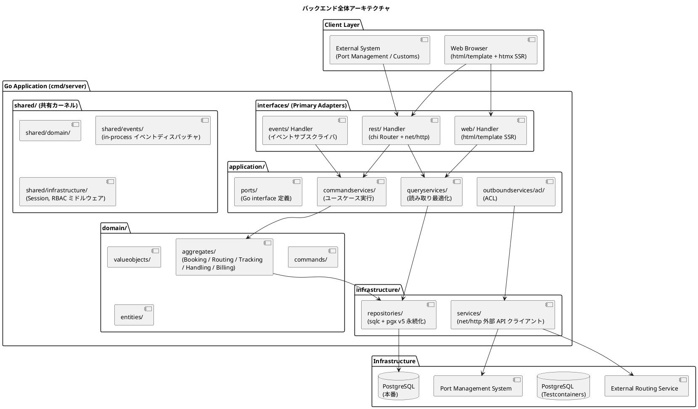
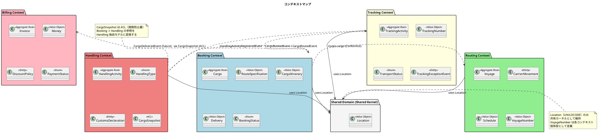
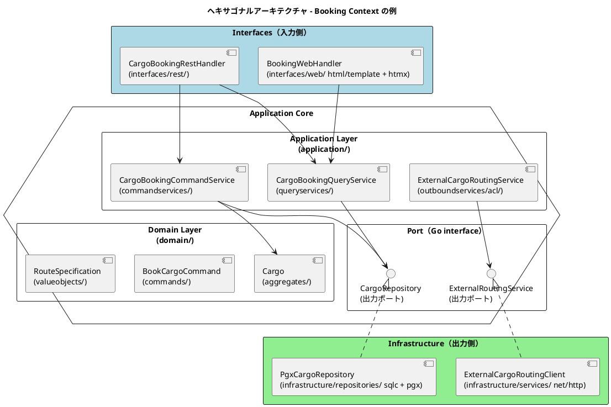
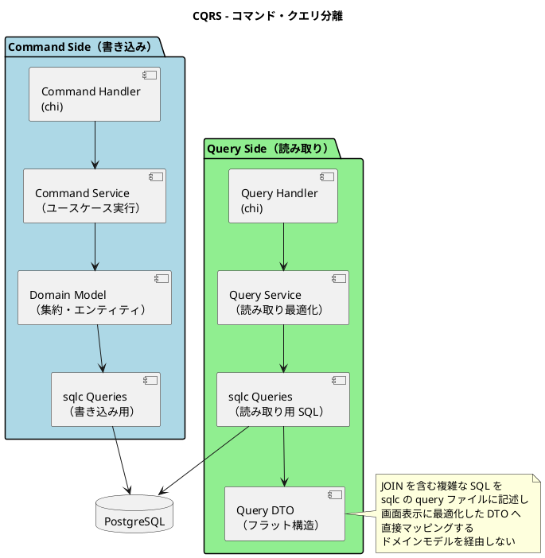
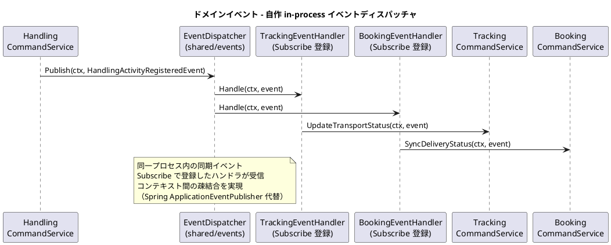
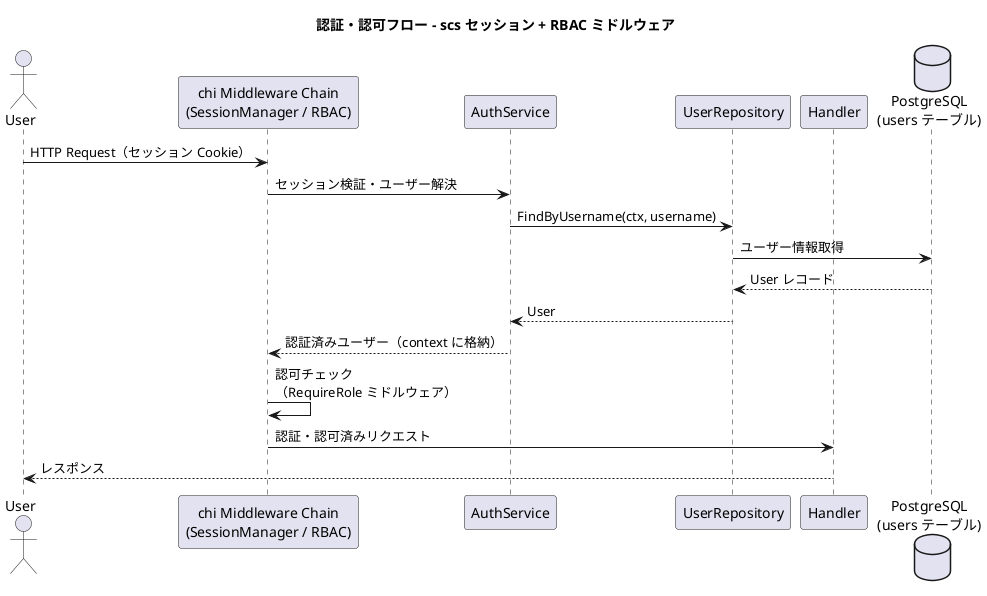
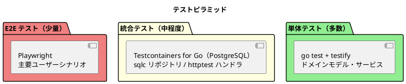

# バックエンドアーキテクチャ - 国際貨物輸送管理システム

## 概要

本ドキュメントでは、国際貨物輸送管理システムのバックエンドアーキテクチャを定義します。
Jakarta EE 参考実装のアーキテクチャ思想（DDD・ヘキサゴナル・イベント駆動）を継承しつつ、
Go 1.24.x / chi v5 / net/http を基盤とした現代的な実装に移植します。

## アーキテクチャパターン選択

### 業務領域カテゴリーの評価

| 評価軸 | 判定 | 根拠 |
| :--- | :--- | :--- |
| 業務領域カテゴリー | **中核の業務領域** | 国際貨物輸送は複雑なビジネスルール（通関、積み替え、例外処理）を持つ |
| データ構造の複雑さ | **複雑** | エンティティ間の関係が多く、コンテキスト間でデータを共有・変換する必要がある |
| 特殊要件 | **あり** | 金額を扱う（Billing Context）、監査記録が必要（荷役履歴）、状態遷移が厳密 |

### 選択したアーキテクチャパターン

上記評価から、以下の組み合わせを採用します。

- **ドメインモデル**: ビジネスルールをドメインオブジェクト（Go の struct とメソッド）にカプセル化し、手続き的なロジックを排除する
- **ポートとアダプター（ヘキサゴナルアーキテクチャ）**: ドメインを技術的関心事から独立させ、テスト容易性を確保する。ポートは Go interface として application 層で定義する
- **CQRS（コマンドクエリ責務分離）**: Booking / Tracking の読み書き負荷特性の違いに対応し、クエリを読み取り最適化モデルで返す

Billing Context は `Money` 値オブジェクトによる金額管理を行いますが、初期フェーズではイベントソーシングは適用しません。

## 全体アーキテクチャ



## 境界付けられたコンテキスト

### コンテキストマップ



### 各コンテキストの説明

#### 1. Booking Context（予約コンテキスト）

荷物予約の中核ロジックを担います。荷物の登録・経路割り当て・状態管理を責務とします。

| 要素 | 内容 |
| :--- | :--- |
| 集約ルート | `Cargo` |
| 主要概念 | `RouteSpecification`, `CargoItinerary`, `Delivery` |
| `BookingStatus` | `PRELIMINARY` / `ROUTE_PROPOSED` / `CONFIRMED` / `TRACKING_ISSUED` / `IN_TRANSIT` / `DELIVERED` / `SETTLED` / `CANCELLED` |
| アクター | 荷主、営業担当者 |

#### 2. Routing Context（経路コンテキスト）

航路・運航スケジュールを管理します。外部経路システムとの統合を担います。

| 要素 | 内容 |
| :--- | :--- |
| 集約ルート | `Voyage` |
| 主要概念 | `CarrierMovement`, `Schedule`, `VoyageNumber` |
| アクター | 経路設計者、外部経路システム |

#### 3. Tracking Context（追跡コンテキスト）

荷物の現在状態・輸送ステータスを管理します。CQRS の読み取り側最適化が特に有効なコンテキストです。

| 要素 | 内容 |
| :--- | :--- |
| 集約ルート | `TrackingActivity` |
| 主要概念 | `TrackingNumber`, `TransportStatus`, `TrackingExceptionEvent` |
| `TransportStatus` | `NOT_RECEIVED` / `RECEIVED` / `LOADED` / `IN_TRANSIT` / `UNLOADED` / `CUSTOMS_INSPECTION` / `AWAITING_CLAIM` / `DELIVERED` / `MISROUTED` |
| アクター | 追跡管理者、荷主、荷受人 |

#### 4. Handling Context（荷役コンテキスト）

港湾・税関での荷役作業を記録します。`CargoSnapshot` ACL で Booking Context への依存を吸収します。

| 要素 | 内容 |
| :--- | :--- |
| 集約ルート | `HandlingActivity` |
| 主要概念 | `HandlingType`, `CustomsDeclaration`, `CargoSnapshot`（ACL） |
| アクター | 荷役作業員、港湾管理システム、税関 |

#### 5. Billing Context（請求コンテキスト）

運賃・請求書の管理を担います。`Money` 値オブジェクトで金額を厳密に管理します。

| 要素 | 内容 |
| :--- | :--- |
| 集約ルート | `Invoice` |
| 主要概念 | `Money`, `DiscountPolicy`, `PaymentStatus` |
| アクター | 経理担当者、荷主、決済機関 |

#### 6. Shared Domain（共有ドメイン）

`Location`（UN/LOCODE）のみ共有カーネルとして維持します。`VoyageNumber` は各コンテキスト固有型として定義し、共有しません。

## ヘキサゴナルアーキテクチャ（ポートとアダプター）



### レイヤー責務一覧

> Practical DDD のパッケージ構造思想を Go の internal パッケージ構成に読み替えて準拠します。

| レイヤー | パッケージ | 責務 | 依存方向 |
| :--- | :--- | :--- | :--- |
| **Domain** | `internal/<context>/domain/`（aggregates, valueobjects, commands, entities） | ビジネスルール・不変条件・集約・値オブジェクト・コマンド定義 | 標準ライブラリのみ。外部に依存しない |
| **Application** | `internal/<context>/application/`（commandservices, queryservices, outboundservices/acl, ports） | ユースケース実行・集約操作・ポート（Go interface）定義・ACL 経由の外部連携 | Domain のみ依存 |
| **Infrastructure** | `internal/<context>/infrastructure/`（repositories, services） | 永続化（sqlc + pgx v5）・外部サービスクライアント（net/http）・ポートの実装 | Application / Domain に依存 |
| **Interfaces** | `internal/<context>/interfaces/`（rest, rest/dto, rest/transform, web, events） | REST Handler・DTO・DTO 変換・画面 Handler（html/template + htmx）・イベントハンドラ | Application に依存 |

### パッケージ構成例（Booking Context）

```
internal/booking/
├── domain/
│   ├── aggregates/          集約ルート（Cargo, BookingID）
│   ├── commands/            コマンド（BookCargoCommand, RouteCargoCommand）
│   ├── entities/            エンティティ（Location）
│   └── valueobjects/        値オブジェクト（RouteSpecification, Delivery, Leg 等）
├── application/
│   ├── ports/               出力ポート（CargoRepository, ExternalRoutingService の Go interface）
│   ├── commandservices/     コマンドサービス（CargoBookingCommandService）
│   ├── queryservices/       クエリサービス（CargoBookingQueryService）
│   └── outboundservices/
│       └── acl/             ACL（ExternalCargoRoutingService）
├── infrastructure/
│   ├── repositories/        リポジトリ実装（PgxCargoRepository, sqlc 生成コード）
│   └── services/            外部サービス実装（ExternalCargoRoutingClient）
└── interfaces/
    ├── rest/                REST Handler（CargoBookingRestHandler）
    │   ├── dto/             リクエスト / レスポンス DTO
    │   └── transform/       DTO ⇔ コマンド変換（Assembler）
    ├── web/                 画面 Handler（BookingWebHandler, html/template + htmx）
    └── events/              イベントハンドラ（CargoBookedEventHandler）
```

## CQRS 設計



### CQRS 適用方針

- **コマンド側**: ドメインモデル（集約）を通じて状態変更します。不変条件の検証後、sqlc + pgx v5 で永続化します
- **クエリ側**: ドメインモデルを経由せず、sqlc の query ファイルに JOIN クエリを直接記述し、画面表示用 DTO（型安全な生成コード）を返します
- **CQRS が特に有効なコンテキスト**: Booking（一覧・詳細の頻繁な参照）、Tracking（リアルタイム状態確認）
- **マイグレーション**: スキーマは golang-migrate で管理し、sqlc の型生成と整合させます

## イベント駆動設計



### ドメインイベント一覧

| イベント | 発生元コンテキスト | 処理先コンテキスト | 内容 |
| :--- | :--- | :--- | :--- |
| `CargoBookedEvent` | Booking | Tracking | 追跡番号の割り当てトリガー |
| `CargoRoutedEvent` | Booking | Tracking | 経路・旅程の確定をトラッキングに通知 |
| `HandlingActivityRegisteredEvent` | Handling | Tracking, Booking | 荷役作業登録 → 輸送ステータス同期 |
| `TrackingExceptionDetectedEvent` | Tracking | Booking, Notification | 例外検知 → 関係者への通知 |
| `InvoiceCreatedEvent` | Billing | Notification | 請求書発行 → 荷主への通知 |

### イベントディスパッチャの実装方針

```go
// shared/events - 自作 in-process イベントディスパッチャ
type Event interface {
	EventName() string
}

type Handler func(ctx context.Context, event Event) error

type Dispatcher struct {
	mu       sync.RWMutex
	handlers map[string][]Handler
}

func (d *Dispatcher) Subscribe(eventName string, h Handler) {
	d.mu.Lock()
	defer d.mu.Unlock()
	d.handlers[eventName] = append(d.handlers[eventName], h)
}

func (d *Dispatcher) Publish(ctx context.Context, event Event) error {
	d.mu.RLock()
	defer d.mu.RUnlock()
	for _, h := range d.handlers[event.EventName()] {
		if err := h(ctx, event); err != nil {
			return err
		}
	}
	return nil
}
```

```go
// ドメインイベントの発行（Application Service 内）
type HandlingCommandService struct {
	repo       ports.HandlingActivityRepository
	dispatcher *events.Dispatcher
}

func (s *HandlingCommandService) RegisterHandlingActivity(
	ctx context.Context, cmd commands.RegisterHandlingCommand,
) error {
	// ドメインロジック実行後にイベント発行
	activity, err := domain.NewHandlingActivity(cmd)
	if err != nil {
		return err
	}
	if err := s.repo.Save(ctx, activity); err != nil {
		return err
	}
	return s.dispatcher.Publish(ctx, NewHandlingActivityRegisteredEvent(activity))
}
```

```go
// イベントハンドラ（interfaces/events/ パッケージ、main で Subscribe 登録）
func RegisterTrackingEventHandlers(d *events.Dispatcher, svc *TrackingCommandService) {
	d.Subscribe("HandlingActivityRegistered", func(ctx context.Context, e events.Event) error {
		event := e.(HandlingActivityRegisteredEvent)
		return svc.UpdateTransportStatus(ctx, event)
	})
}
```

> **設計注意**: 同期ディスパッチではイベントハンドラが同一トランザクション外で実行されると
> 不整合のリスクがあります。集約の永続化とイベント発行の一貫性が必要な箇所では、
> pgx のトランザクション（`pgx.Tx`）をコミットした後に Publish する方針とします。
> 高可用性が必要なシステムへ移行する際は Transactional Outbox パターンへの移行を検討してください。

## Jakarta EE / Spring → Go 移行マッピング

| Jakarta EE / Spring 技術 | Go 移行先 | 移行ポイント |
| :--- | :--- | :--- |
| CDI / Spring DI（`@Inject`, `@Service`） | コンストラクタインジェクション（手動 wiring） | DI コンテナは使用せず、`cmd/server/main.go` で依存を組み立てる |
| JAX-RS / Spring MVC（`@RestController`） | chi v5 Router + `net/http` Handler | ルーティングは `chi.Router` に明示的に登録する |
| CDI Events / `ApplicationEventPublisher` | 自作 in-process イベントディスパッチャ（`shared/events`） | 同期イベントはほぼ等価。同一プロセス内通信 |
| JPA / MyBatis | **sqlc + pgx v5** | SQL 明示管理の思想は MyBatis と同じ。sqlc がコンパイル時に型安全なコードを生成する |
| Flyway | golang-migrate | SQL マイグレーションファイルで管理 |
| Bean Validation（`@Valid`） | ドメインのコンストラクタ関数でのバリデーション + エラー戻り値 | 不変条件はファクトリ関数（`NewXxx`）で強制する |
| Spring Security | alexedwards/scs セッション + 自作 RBAC ミドルウェア | セッションベース認証・ロールチェックを chi ミドルウェアで実装 |
| `@Component`（シングルトン） | main で一度だけ生成して注入 | ライフサイクル管理は明示的な生成順序で行う |
| `@Transactional` | `pgx.Tx` を用いた明示的トランザクション制御 | Application Service がトランザクション境界を管理する |
| Thymeleaf SSR | html/template + htmx | サーバーサイドレンダリング + 部分更新は htmx で実現 |
| ArchUnit | go-arch-lint | domain 層が infrastructure を import しない等のルールを CI で検証 |

## パッケージ構造

```
.
├── cmd/
│   └── server/
│       └── main.go            # エントリポイント・手動 DI（依存の組み立て）
├── internal/
│   ├── booking/
│   │   ├── domain/            # Cargo 集約、BookingID、RouteSpecification、BookingStatus 等
│   │   │   └── events/        # CargoBookedEvent, CargoRoutedEvent
│   │   ├── application/
│   │   │   ├── ports/         # CargoRepository, ExternalRoutingService（出力ポート interface）
│   │   │   ├── commandservices/   # CargoBookingCommandService
│   │   │   ├── queryservices/     # CargoBookingQueryService
│   │   │   └── outboundservices/  # ACL（ExternalCargoRoutingService）
│   │   ├── infrastructure/
│   │   │   ├── repositories/  # PgxCargoRepository, sqlc 生成コード
│   │   │   └── services/      # ExternalCargoRoutingClient（net/http）
│   │   └── interfaces/
│   │       ├── rest/          # REST Handler・DTO・Assembler
│   │       ├── web/           # 画面 Handler（html/template + htmx）
│   │       └── events/        # イベントハンドラ登録
│   ├── routing/               # Voyage 集約（同構造）
│   ├── tracking/              # TrackingActivity 集約（同構造）
│   ├── handling/              # HandlingActivity 集約・CargoSnapshot ACL（同構造）
│   ├── billing/               # Invoice 集約・Money（同構造）
│   └── shared/
│       ├── domain/            # Location（UN/LOCODE）、共有 ID 型
│       ├── events/            # in-process イベントディスパッチャ
│       └── infrastructure/
│           ├── auth/          # scs セッション管理・RBAC ミドルウェア
│           └── web/           # 共通テンプレート・HomeHandler
├── db/
│   ├── migrations/            # golang-migrate 用 SQL
│   └── queries/               # sqlc 用 query ファイル
├── sqlc.yaml                  # sqlc 設定
└── .go-arch-lint.yml          # アーキテクチャルール定義
```

### アーキテクチャルール検証（go-arch-lint）

以下のルールを CI で強制します。

- `domain` は標準ライブラリと同一コンテキストの `domain` 以外に依存しない
- `application` は `domain` と `shared/domain`・`shared/events` のみに依存する
- `infrastructure` から `interfaces` への依存を禁止する
- コンテキスト間の直接参照を禁止し、イベントまたは ACL 経由に限定する

## API 設計方針

### REST API 設計原則

| 原則 | 内容 |
| :--- | :--- |
| **リソース指向** | URL はリソースを表す名詞。動詞は HTTP メソッドで表現する |
| **バージョニング** | `/api/v1/` プレフィックスでバージョンを管理する |
| **レスポンス形式** | JSON。エラーレスポンスは `{ "code": "BOOKING_NOT_FOUND", "message": "..." }` 形式 |
| **ステータスコード** | 成功: 200/201/204、クライアントエラー: 400/404/409、サーバーエラー: 500 |
| **HATEOAS** | 初期フェーズでは適用しない |

### 主要エンドポイント（例）

| メソッド | パス | 説明 |
| :--- | :--- | :--- |
| `POST` | `/api/v1/bookings` | 貨物予約の登録 |
| `GET` | `/api/v1/bookings/{bookingId}` | 予約詳細の取得 |
| `PUT` | `/api/v1/bookings/{bookingId}/route` | 経路の割り当て |
| `GET` | `/api/v1/tracking/{trackingNumber}` | 追跡情報の取得 |
| `POST` | `/api/v1/handling` | 荷役作業の登録 |
| `GET` | `/api/v1/voyages` | 航路一覧の取得 |

## セキュリティ設計

### セッション認証・RBAC ミドルウェアによる認証・認可



- セッション管理は alexedwards/scs を使用し、セッションストアは PostgreSQL とします
- 認可は chi ミドルウェア（`RequireRole("ROLE_SALES")` 等）でルートグループ単位に適用します

### ロール設計

| ロール | 権限 | 対象ユーザー |
| :--- | :--- | :--- |
| `ROLE_SHIPPER` | 予約照会・追跡照会 | 荷主 |
| `ROLE_SALES` | 予約登録・経路割り当て | 営業担当者 |
| `ROLE_HANDLER` | 荷役作業登録 | 荷役作業員 |
| `ROLE_TRACKER` | 追跡情報管理・例外対応 | 追跡管理者 |
| `ROLE_ACCOUNTANT` | 請求書管理 | 経理担当者 |
| `ROLE_ADMIN` | 全機能 | システム管理者 |

## テスト戦略



### 各層のテスト方針

| テスト対象 | テスト種別 | 使用技術 | 方針 |
| :--- | :--- | :--- | :--- |
| ドメインモデル（集約・値オブジェクト） | 単体テスト | go test, testify | 依存なし。ビジネスルールを網羅的にテスト |
| Application Service | 単体テスト | go test, testify（ポートの手書きモック / スタブ） | リポジトリ interface をモック化。ユースケースのフローをテスト |
| リポジトリ（sqlc + pgx） | 統合テスト | Testcontainers for Go（PostgreSQL） | 実 DB への SQL を検証。スキーマを golang-migrate で適用 |
| REST Handler | 統合テスト | net/http/httptest | エンドポイントの入出力・バリデーションをテスト |
| E2E | E2E テスト | Playwright | 主要ユーザーシナリオ（予約 → 追跡 → 配達）を検証 |
