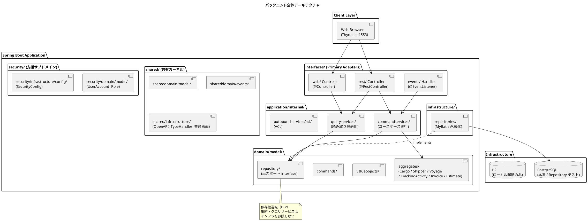
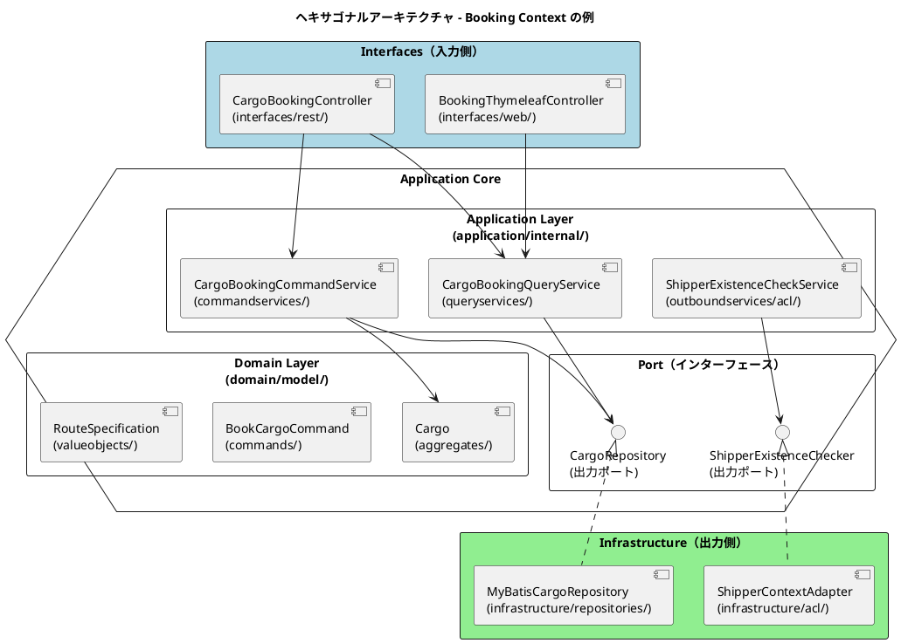
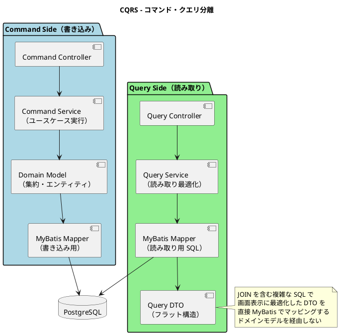
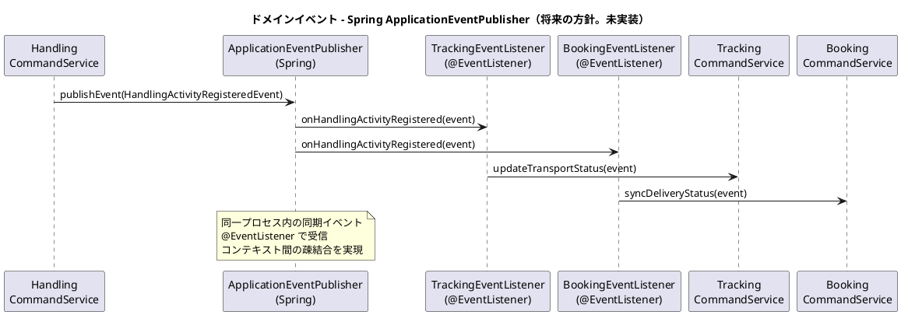
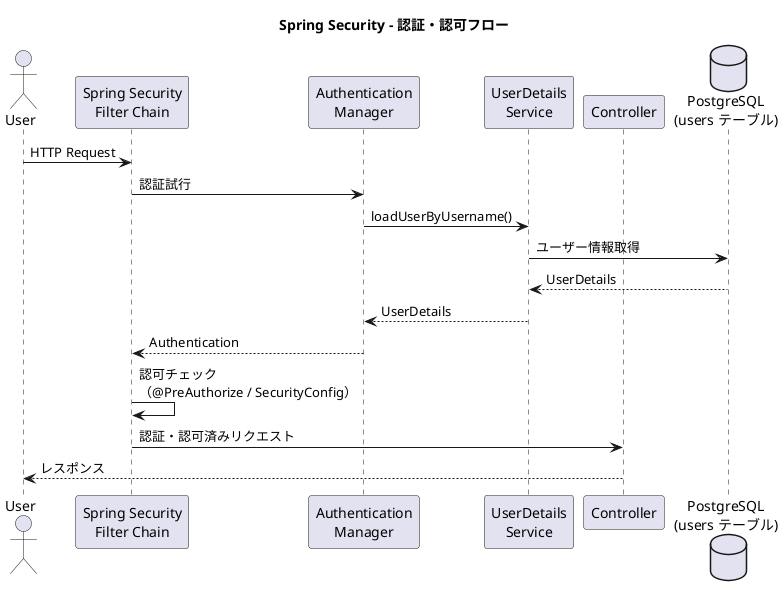
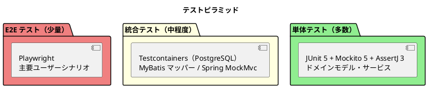

# バックエンドアーキテクチャ - 国際貨物輸送管理システム

## 概要

本ドキュメントでは、国際貨物輸送管理システムのバックエンドアーキテクチャを定義する。
Jakarta EE 参考実装のアーキテクチャ思想（DDD・ヘキサゴナル・イベント駆動）を継承しつつ、
Spring Boot 4.0 / Java 25 を基盤とした現代的な実装に移植する。

## アーキテクチャパターン選択

### 業務領域カテゴリーの評価

| 評価軸 | 判定 | 根拠 |
| :--- | :--- | :--- |
| 業務領域カテゴリー | **中核の業務領域** | 国際貨物輸送は複雑なビジネスルール（通関、積み替え、例外処理）を持つ |
| データ構造の複雑さ | **複雑** | エンティティ間の関係が多く、コンテキスト間でデータを共有・変換する必要がある |
| 特殊要件 | **あり** | 金額を扱う（Billing Context）、監査記録が必要（荷役履歴）、状態遷移が厳密 |

### 選択したアーキテクチャパターン

上記評価から、以下の組み合わせを採用する。

- **ドメインモデル**: ビジネスルールをドメインオブジェクトにカプセル化し、手続き的なロジックを排除する
- **ポートとアダプター（ヘキサゴナルアーキテクチャ）**: ドメインを技術的関心事から独立させ、テスト容易性を確保する
- **CQRS（コマンドクエリ責務分離）**: Booking / Tracking の読み書き負荷特性の違いに対応し、クエリを読み取り最適化モデルで返す

Billing Context は `Money` 値オブジェクトによる金額管理を行うが、初期フェーズではイベントソーシングは適用しない。

## 全体アーキテクチャ



## 境界付けられたコンテキスト

### コンテキストマップ

```plantuml
@startuml
title コンテキストマップ

package "Booking Context" as booking #LightBlue {
  class Cargo <<Aggregate Root>>
  class RouteSpecification <<Value Object>>
  class CargoItinerary <<Value Object>>
  class Delivery <<Value Object>>
  class BookingStatus <<Enum>>
}

package "Shipper Context" as shipper #Lavender {
  class Shipper <<Aggregate Root>>
  class ShipperCode <<Value Object>>
  class ShipperType <<Enum>>
  class ContractDiscountRate <<Value Object>>
}

package "Estimation Context" as estimation #Wheat {
  class Estimate <<Aggregate Root>>
  class RouteCandidate <<Entity>>
  class EstimateStatus <<Enum>>
}

package "Routing Context" as routing #LightGreen {
  class RoutingStatus <<Enum>>
  class Voyage <<Aggregate Root>>
  class CarrierMovement <<Entity>>
  class Schedule <<Value Object>>
  class VoyageNumber <<Value Object>>
}

package "Tracking Context" as tracking #LightYellow {
  class TrackingActivity <<Aggregate Root>>
  class TrackingNumber <<Value Object>>
  class TransportStatus <<Enum>>
  class TrackingExceptionEvent <<Entity>>
}

package "Handling Context" as handling #LightCoral {
  class HandlingActivity <<Aggregate Root>>
  class HandlingType <<Enum>>
  class CustomsDeclaration <<Entity>>
  class CargoSnapshot <<ACL>>
}

package "Billing Context" as billing #LightPink {
  class Invoice <<Aggregate Root>>
  class Money <<Value Object>>
  class DiscountPolicy <<Value Object>>
  class PaymentStatus <<Enum>>
}

package "Shared Domain (Shared Kernel)" as shared #WhiteSmoke {
  class Location <<Value Object>>
  class ShipperId <<Value Object>>
}

booking --> shared : uses Location, ShipperId
shipper --> shared : uses ShipperId
routing --> shared : uses Location
tracking --> shared : uses Location
estimation --> shared : uses Location

booking ..> shipper : via ShipperExistenceChecker (ACL)
booking ..> routing : via VoyageCapacityPort (ACL)
routing ..> booking : via CargoRouteAssignments (ACL)
booking ..> tracking : via TrackingPort (ACL)
handling ..> booking : via CargoSnapshots / HandlingProgressPort (ACL)
handling ..> tracking : via TrackingEvents (ACL)
billing ..> shipper : via ShipperDiscountPort (ACL)
billing ..> tracking : via TrackingPort (ACL)
booking <.. billing : via BookingSettlementPort (ACL)
estimation ..> routing : 航海スケジュールを参照
billing <.. booking : CargoDeliveredEvent (future)

note top of handling
  **独立した BC である**（ADR-010）。
  Tracking への連携も ACL を通す
  CargoSnapshots は ACL（腐敗防止層）
  Booking → Handling の参照を
  Handling 独自モデルに変換する
  **ポートが運ぶ値はポートと同じ
  パッケージに置く**（唯一の越境点）
end note

note right of shared
  共有カーネルは Location と
  ShipperId の 2 要素のみ（ADR-005）
  VoyageNumber・TransportStatus・
  RoutingStatus は各コンテキスト
  所有とし ACL 経由で参照
end note

@enduml
```



### 各コンテキストの説明

#### 1. Booking Context（予約コンテキスト）

荷物予約の中核ロジックを担う。荷物の登録・経路割り当て・状態管理を責務とする。

| 要素 | 内容 |
| :--- | :--- |
| 集約ルート | `Cargo` |
| 主要概念 | `RouteSpecification`, `CargoItinerary`, `Delivery` |
| `BookingStatus` | `PRELIMINARY` / `ROUTE_PROPOSED` / `CONFIRMED` / `TRACKING_ISSUED` / `IN_TRANSIT` / `DELIVERED` / `SETTLED` / `CANCELLED` |
| アクター | 荷主、営業担当者 |

#### 2. Shipper Context（荷主コンテキスト）

荷主の登録・管理と契約割引率を責務とする。Booking Context からは `ShipperExistenceChecker` ACL 経由で参照される。

| 要素 | 内容 |
| :--- | :--- |
| 集約ルート | `Shipper` |
| 主要概念 | `ShipperCode`, `ShipperType`（個人 / 法人）, `ContractDiscountRate` |
| アクター | 営業担当者、荷主 |

#### 3. Routing Context（経路コンテキスト）

航路・運航スケジュールを管理し、経路候補を算出する。経路算出は内部シミュレーションで実装する（ADR-006）。

| 要素 | 内容 |
| :--- | :--- |
| 集約ルート | `Voyage` |
| 主要概念 | `CarrierMovement`, `Schedule`, `VoyageNumber`, `RoutingStatus` |
| `RoutingStatus` | `NOT_ROUTED` / `ROUTED` / `MISROUTED`（本コンテキストが所有。ADR-005） |
| アクター | 経路設計者 |

#### 4. Estimation Context（見積コンテキスト）

輸送見積の作成とルート候補の管理を責務とする。予約前の照会フェーズを担う。

| 要素 | 内容 |
| :--- | :--- |
| 集約ルート | `Estimate` |
| 主要概念 | `RouteCandidate`, `EstimateStatus` |
| アクター | 営業担当者 |

#### 5. Tracking Context（追跡コンテキスト）

荷物の現在状態・輸送ステータスを管理する。CQRS の読み取り側最適化が特に有効なコンテキスト。

| 要素 | 内容 |
| :--- | :--- |
| 集約ルート | `TrackingActivity` |
| 主要概念 | `TrackingNumber`, `TransportStatus`, `TrackingExceptionEvent` |
| `TransportStatus` | `NOT_RECEIVED` / `RECEIVED` / `LOADED` / `ONBOARD_CARRIER` / `UNLOADED` / `AWAITING_CLAIM` / `CLAIMED` / `EXCEPTION` / `UNKNOWN`（本コンテキストが所有。ADR-005） |
| アクター | 追跡管理者、荷主、荷受人 |

#### 6. Handling Context（荷役コンテキスト）

港湾・税関での荷役作業を記録する。**独立した境界付けられたコンテキストである**（ADR-010。ADR-002 を置き換えた）。Booking / Tracking への参照はいずれも ACL ポートで吸収する（`CargoSnapshots` / `HandlingProgressPort` / `TrackingEvents`）。

> **ADR-002 は Tracking 内のモジュールとしていたが、実装すると言語は分岐していた。**
> `HandlingType` と `TrackingEventType`、`HandlingVoyageNumber` と `TrackingVoyageNumber`、
> `CargoBookingId` と `TrackingBookingId` を同じ BC の中で別々に定義しており、
> **統合されていたのではなく境界が引かれていなかった**（ADR-010）。

| 要素 | 内容 |
| :--- | :--- |
| 集約ルート | `HandlingActivity` |
| 主要概念 | `HandlingType`, `CustomsDeclaration`, `CargoSnapshot`（ACL の写し）, `HandlingVoyageNumber` |
| アクター | 荷役作業員、港湾管理システム、税関 |

#### 7. Billing Context（請求コンテキスト）

運賃・請求書の管理を担う。`Money` 値オブジェクトで金額を厳密に管理する（`domain-model.md` が名称の正典）。

| 要素 | 内容 |
| :--- | :--- |
| 集約ルート | `Invoice` |
| 主要概念 | `Money`, `DiscountPolicy`（値オブジェクト。`domain-model.md` が正典）, `PaymentStatus` |
| アクター | 経理担当者、荷主、決済機関 |

#### 8. Shared Domain（共有ドメイン）

共有カーネルは `Location`（UN/LOCODE）と `ShipperId` の **2 要素のみ**とする（ADR-005）。`VoyageNumber`・`TransportStatus`・`RoutingStatus` は各コンテキストの所有とし、他 BC からは ACL ポート経由で参照する。

## ヘキサゴナルアーキテクチャ（ポートとアダプター）



### レイヤー責務一覧

> Practical DDD in Enterprise Java (Chapter 3) のパッケージ構造に準拠する。

| レイヤー | パッケージ | 責務 | 依存方向 |
| :--- | :--- | :--- | :--- |
| **Domain** | `domain/model/`, `domain/event/`, `domain/repository/` | ビジネスルール・不変条件・集約・エンティティ・値オブジェクト・コマンド・ドメインイベント・出力ポート interface | 外部に依存しない |
| **Application** | `application/internal/commandservices/`, `application/internal/queryservices/`, `application/internal/outboundservices/acl/` | ユースケース実行・集約操作・BC 間 ACL の出力ポート定義 | Domain のみ依存 |
| **Infrastructure** | `infrastructure/repositories/`, `infrastructure/acl/`, `infrastructure/brokers/`, `infrastructure/config/` | 永続化（MyBatis）・BC 間 ACL アダプタ・イベントハンドラ・BC 固有構成 | Application / Domain に依存 |
| **Interfaces** | `interfaces/rest/`, `interfaces/rest/dto/`, `interfaces/rest/transform/`, `interfaces/web/`, `interfaces/events/` | REST API Controller・DTO・DTO 変換・画面 Controller・イベントハンドラ | Application に依存 |

### パッケージ構成（全 BC 共通の正典）

**本節が全 Bounded Context に適用されるパッケージ構成の正典である。** ArchUnit の `slices().matching("com.example.cargotracker.(*)..")` は「トップレベルパッケージ = BC 境界」を前提とするため、この構成を崩すと BC 分離ルールが機能しなくなる。

```text
com.example.cargotracker.<bounded-context>/
├── domain/
│   ├── model/                   集約ルート・エンティティ・値オブジェクト・コマンド
│   ├── event/                   ドメインイベント
│   └── repository/              リポジトリ interface（出力ポート。実装はここに置かない）
├── application/
│   └── internal/
│       ├── commandservices/     コマンドサービス（ユースケース実行）
│       ├── queryservices/       クエリサービス（CQRS 読み取り側）
│       └── outboundservices/
│           └── acl/             BC 間 ACL の出力ポート interface
├── infrastructure/
│   ├── repositories/            リポジトリ実装・MyBatis Mapper・Record
│   ├── acl/                     BC 間 ACL アダプタ実装
│   ├── brokers/                 ドメインイベントハンドラ
│   └── config/                  BC 固有の Spring 構成・シードデータ
└── interfaces/
    ├── rest/                    REST Controller
    │   ├── dto/                 リクエスト / レスポンス DTO
    │   └── transform/           DTO ⇔ コマンド変換（Assembler）
    ├── web/                     画面 Controller（Thymeleaf）
    └── events/                  外部起点のイベントハンドラ
```

**Booking Context に当てはめた例**:

```text
booking/
├── domain/
│   ├── model/                   Cargo（集約ルート）, BookingId, RouteSpecification,
│   │                            CargoItinerary, Delivery, Leg, BookCargoCommand 等
│   ├── event/                   CargoBookedEvent, CargoRoutedEvent
│   └── repository/              CargoRepository（出力ポート interface）
├── application/
│   └── internal/
│       ├── commandservices/     CargoBookingCommandService
│       ├── queryservices/       CargoBookingQueryService
│       └── outboundservices/
│           └── acl/             ShipperExistenceChecker（出力ポート interface）
├── infrastructure/
│   ├── repositories/            CargoRepositoryImpl, CargoMapper, CargoRecord
│   ├── acl/                     ShipperContextAdapter（ShipperExistenceChecker 実装）
│   ├── brokers/                 CargoBookedEventHandler
│   └── config/                  DefaultProfileBookingSeedConfiguration
└── interfaces/
    ├── rest/                    CargoBookingController
    │   ├── dto/
    │   └── transform/
    ├── web/                     BookingThymeleafController
    └── events/
```

> **注**: 旧版は本節と「パッケージ構造」節に**互換性のない 2 つの構成**を併記していた（`domain/model/aggregates|valueobjects` 系と `domain/model|event|repository` 系）。実装者がどちらを見るかで構造が分岐するため、後者に一本化した。

## CQRS 設計



### CQRS 適用方針

- **コマンド側**: ドメインモデル（集約）を通じて状態変更。不変条件の検証後、MyBatis で永続化する
- **クエリ側**: ドメインモデルを経由せず、MyBatis の XML マッパーで JOIN クエリを直接記述し、画面表示用 DTO を返す
- **CQRS が特に有効なコンテキスト**: Booking（一覧・詳細の頻繁な参照）、Tracking（リアルタイム状態確認）

## イベント駆動設計

> **IT6 時点でドメインイベントは採用していない。** BC 間の連携はすべて ACL ポートの
> **同期呼び出し**であり、同一トランザクションで完結する。荷役の登録（US15）は
> 荷役作業・追跡状態・予約の 3 つを 1 つのトランザクションで書く。
>
> 理由は 2 つある。荷役は本システムで最も頻度の高い操作であり、結果整合を挟むと
> 「登録したのに追跡に出ない」時間が現場に見えること（ADR-002 が Handling を
> Tracking に統合した理由と同じ）。もう 1 つは、**片方だけ成功する状態が業務上
> あり得ない**こと（確定済みなのに追跡番号が無い、荷役は記録されたのに輸送状態が
> 動いていない）である。
>
> **その代償として、ACL アダプタは楽観的ロックの失敗を握り潰してはならない。**
> 握り潰すと、同期にした利点（片方だけ成功しない）がそのまま失われる
> （IT6 のレビューで実際に 3 か所見つかった）。
>
> 以下は**将来 BC をまたぐ非同期が必要になった場合**の実装方針である。現時点の
> 実装ではない。採用する場合は ADR を起票すること。



### ドメインイベント一覧

| イベント | 発生元コンテキスト | 処理先コンテキスト | 内容 |
| :--- | :--- | :--- | :--- |
| `CargoBookedEvent` | Booking | Tracking | 追跡番号の割り当てトリガー（**未実装**。IT6 は `TrackingPort` の同期呼び出し） |
| `CargoRoutedEvent` | Booking | Tracking | 経路・旅程の確定をトラッキングに通知 |
| `HandlingActivityRegisteredEvent` | Handling | Tracking, Booking | 荷役作業登録 → 輸送ステータス同期（**未実装**。IT6 は同一トランザクションの直接呼び出し） |
| `TrackingExceptionDetectedEvent` | Tracking | Booking, Notification | 例外検知 → 関係者への通知 |
| `InvoiceCreatedEvent` | Billing | Notification | 請求書発行 → 荷主への通知 |

### Spring ApplicationEventPublisher の実装方針

```java
// ドメインイベントの発行（Application Service 内）
@Service
public class HandlingCommandService {
    private final ApplicationEventPublisher eventPublisher;

    public void registerHandlingActivity(RegisterHandlingCommand command) {
        // ドメインロジック実行後にイベント発行
        eventPublisher.publishEvent(new HandlingActivityRegisteredEvent(this, activity));
    }
}

// イベントリスナー（infrastructure/event/ パッケージ）
@Component
public class TrackingEventListener {
    @EventListener
    public void onHandlingActivityRegistered(HandlingActivityRegisteredEvent event) {
        trackingCommandService.updateTransportStatus(event);
    }
}
```

> **設計注意**: `@EventListener` はデフォルトでトランザクションコミット前に実行される。
> コミット前にリスナーが実行されるリスクを避けるため、ドメインイベントのリスナーには
> `@TransactionalEventListener(phase = TransactionPhase.AFTER_COMMIT)` を使用すること。
> 高可用性が必要なシステムへ移行する際は Transactional Outbox パターンへの移行を検討すること。

## Jakarta EE → Spring Boot 移行マッピング

| Jakarta EE 技術 | Spring Boot 移行先 | 移行ポイント |
| :--- | :--- | :--- |
| CDI（`@Inject`） | Spring DI（`@Component`, `@Service`, `@Repository`） | アノテーション名の変更のみ。コンストラクタインジェクションを優先する |
| JAX-RS（`@Path`, `@GET`） | Spring MVC（`@RestController`, `@GetMapping`） | エンドポイント定義のアノテーション変更 |
| CDI Events（`Event<T>.fire()`） | `ApplicationEventPublisher.publishEvent()` | 同期イベントはほぼ等価。同一プロセス内通信 |
| JPA / EclipseLink | **MyBatis**（XML マッパー） | ORM から SQL 明示管理へ変更。ドメインモデルの `@Entity` は不要になる |
| Bean Validation | Spring Validation（`@Valid`, `BindingResult`） | アノテーションは共通（Jakarta Validation API） |
| Jakarta Security | Spring Security 7.x | フォームベース認証・RBAC を Spring Security で実装 |
| `@ApplicationScoped` | `@Component`（シングルトンがデフォルト） | スコープ管理の思想は共通 |
| `@Transactional`（JTA） | `@Transactional`（Spring） | アノテーション名は同じ。JTA から Spring トランザクションへ変更 |

## トップレベルパッケージと実装状況

パッケージの内部構成は「[パッケージ構成（全 BC 共通の正典）](#パッケージ構成全-bc-共通の正典)」を参照すること。本節はトップレベルの割り当てと**実装状況のスナップショット**を示す。

```text
apps/cargo-tracker/src/main/java/com/example/cargotracker/
├── booking/       Booking Context
├── shipper/       Shipper Context
├── routing/       Routing Context
├── tracking/      Tracking Context（追跡・例外イベント）
├── handling/      Handling Context（荷役・通関。**独立した BC** — ADR-010）
├── billing/       Billing Context
├── estimation/    Estimation Context
├── security/      認証・認可の支援サブドメイン（業務 BC ではない）
│   ├── domain/model/            UserAccount, Role
│   ├── domain/repository/       UserAccountRepository
│   └── infrastructure/
│       ├── config/              SecurityConfig, CargoTrackerUserDetailsService,
│       │                        AuthenticationAuditListener
│       └── repositories/        MyBatisUserAccountRepository
└── shared/        共有カーネル（Location・ShipperId のみ — ADR-005）と横断的な構成
    ├── domain/model/            Location, ShipperId
    └── infrastructure/
        ├── config/              OpenApiConfig
        ├── web/                 HomeController
        └── persistence/         UUIDTypeHandler（MyBatis TypeHandler）
```

> **認証・認可を `shared/` に置かない理由**: 共有カーネルの構成要素は `Location` と `ShipperId`
> の 2 つのみと定めている（ADR-005）。`UserAccount` を shared に入れると、ロールを 1 つ増やす
> だけで全 BC の再ビルドとレビューを強制する。ArchUnit ルール 6 が `shared.domain.model` を
> 検査対象として、この境界を固定している。

### 実装状況（スナップショット）

> **本表は設計ではなく現況の記録である。** 設計としての約束は `docs/development/release_scope.md` が定める。

| パッケージ | 状況 | 対応リリース |
| :--- | :--- | :--- |
| `booking/` | 実装済み（Cargo 集約・BookingStatus・CQRS クエリ側。IT2） | Release 1 |
| `shipper/` | 実装済み（登録・訂正・楽観的ロック。IT1〜IT2） | Release 1 |
| `routing/` | 実装済み（Voyage 集約・Schedule の連結制約・航路検索。IT3） | Release 1 |
| `tracking/` | 実装済み（TrackingActivity 集約・TransportStatus・追跡番号の採番。IT6） | Release 1 |
| `handling/` | 実装済み（HandlingActivity 集約・荷役の妥当性検証・荷役画面。IT6。**IT6 クローズ後に独立 BC へ昇格** — ADR-010） | Release 1 |
| `billing/` | package-info のみ | Release 3 |
| `estimation/` | package-info のみ | Release 2 |

## API 設計方針

### REST API 設計原則

| 原則 | 内容 |
| :--- | :--- |
| **リソース指向** | URL はリソースを表す名詞。動詞は HTTP メソッドで表現する |
| **バージョニング** | `/api/v1/` プレフィックスでバージョンを管理する |
| **レスポンス形式** | JSON。エラーレスポンスは `{ "code": "BOOKING_NOT_FOUND", "message": "..." }` 形式 |
| **ステータスコード** | 成功: 200/201/204、クライアントエラー: 400/404/409、サーバーエラー: 500 |
| **HATEOAS** | 初期フェーズでは適用しない |

### 主要エンドポイント（例）

| メソッド | パス | 説明 |
| :--- | :--- | :--- |
| `POST` | `/api/v1/bookings` | 貨物予約の登録 |
| `GET` | `/api/v1/bookings/{bookingId}` | 予約詳細の取得 |
| `PUT` | `/api/v1/bookings/{bookingId}/route` | 経路の割り当て |
| `GET` | `/api/v1/tracking/{trackingNumber}` | 追跡情報の取得 |
| `POST` | `/api/v1/handling` | 荷役作業の登録 |
| `GET` | `/api/v1/voyages` | 航路一覧の取得 |

## セキュリティ設計

### Spring Security による認証・認可



### ロール設計

| ロール | 権限 | 対象ユーザー |
| :--- | :--- | :--- |
| `ROLE_SHIPPER` | 予約照会・追跡照会 | 荷主 |
| `ROLE_SALES` | 予約登録・経路割り当て | 営業担当者 |
| `ROLE_ROUTER` | 経路割り当て・航路管理 | 経路設計者 |
| `ROLE_HANDLER` | 荷役作業登録 | 荷役作業員 |
| `ROLE_TRACKER` | 追跡情報管理・例外対応 | 追跡管理者 |
| `ROLE_BILLING` | 請求書管理 | 経理担当者 |
| `ROLE_CONSIGNEE` | 追跡照会（限定情報） | 荷受人 |
| `ROLE_ADMIN` | 全機能 | システム管理者 |

> ロール名の正典は [非機能要件](non_functional.md) の RBAC ロール定義に従う。

## テスト戦略



### 各層のテスト方針

| テスト対象 | テスト種別 | 使用技術 | 方針 |
| :--- | :--- | :--- | :--- |
| ドメインモデル（集約・値オブジェクト） | 単体テスト | JUnit 5, AssertJ | 依存なし。ビジネスルールを網羅的にテスト |
| Application Service | 単体テスト | JUnit 5, Mockito | リポジトリをモック化。ユースケースのフローをテスト |
| MyBatis Mapper | 統合テスト | Testcontainers（実 PostgreSQL） | **SQL の正しさを検証する唯一の場所**。H2 では書かない（ADR-003） |
| REST Controller | 統合テスト | Spring MockMvc | エンドポイントの入出力・バリデーションをテスト |
| E2E | E2E テスト | Playwright | 主要ユーザーシナリオ（予約 → 追跡 → 配達）を検証。`test_strategy.md` が正典 |
