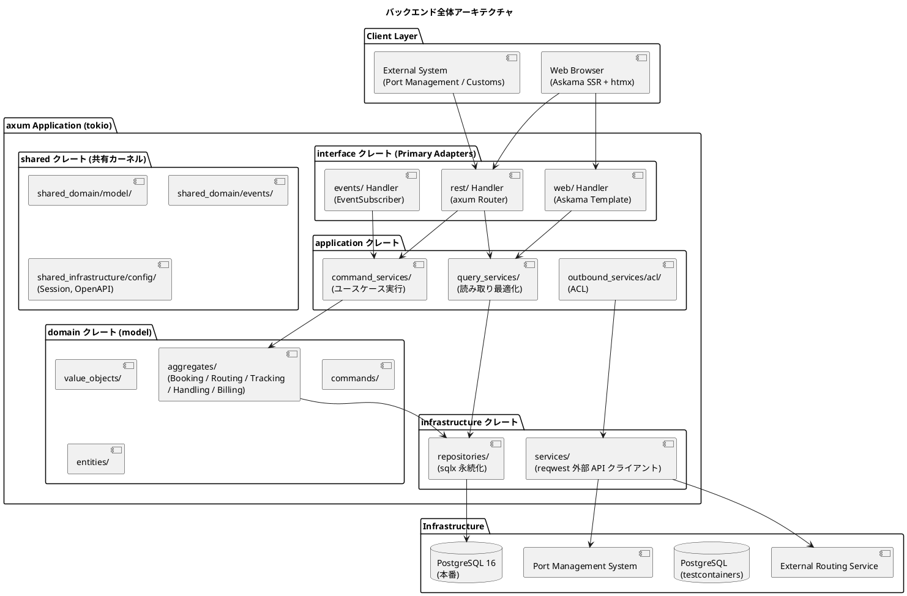
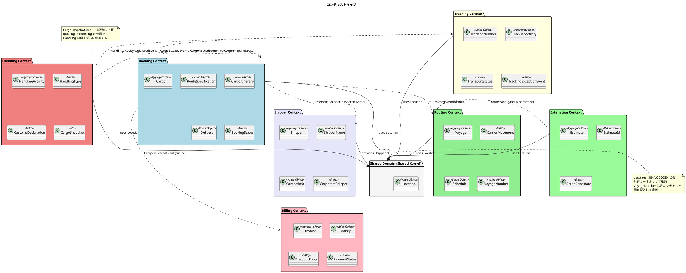
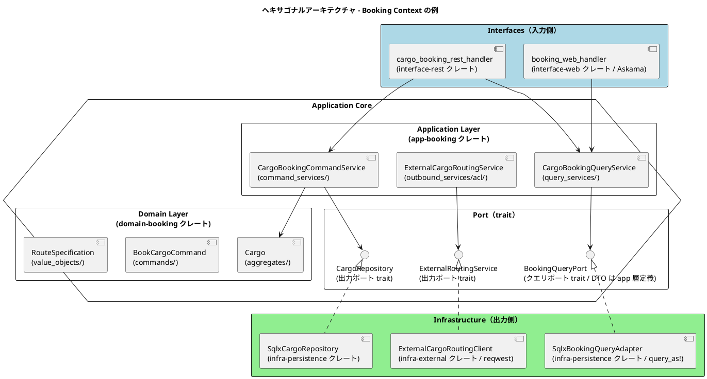
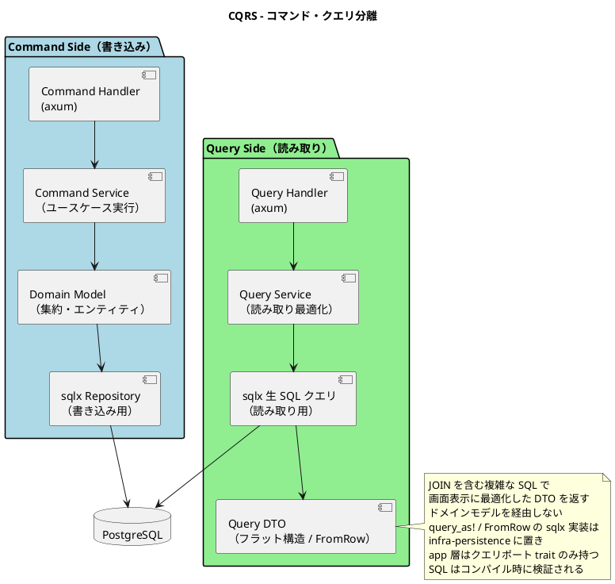
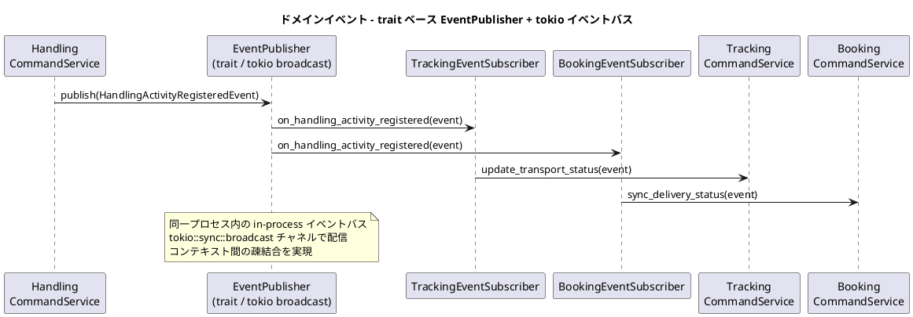
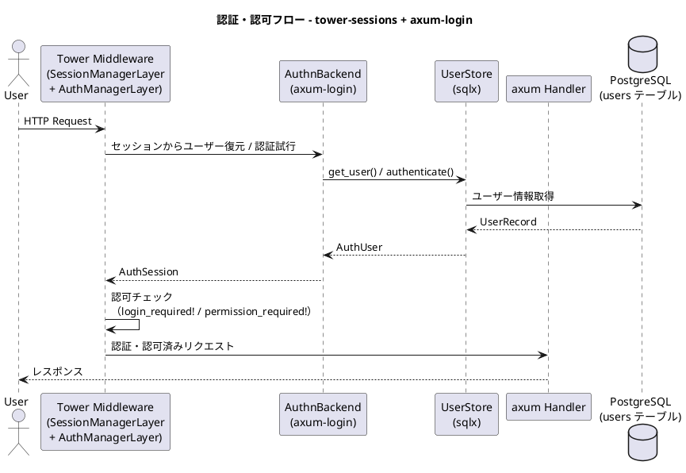
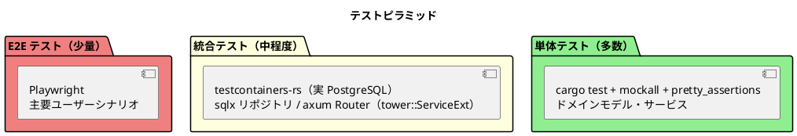

# バックエンドアーキテクチャ - 国際貨物輸送管理システム

## 概要

本ドキュメントでは、国際貨物輸送管理システムのバックエンドアーキテクチャを定義する。
Jakarta EE 参考実装のアーキテクチャ思想（DDD・ヘキサゴナル・イベント駆動）を継承しつつ、
Rust (stable, edition 2024) / axum を基盤とした現代的な実装に移植する。
集約の不変条件は Rust の型システム（newtype・enum・所有権）で表現し、
レイヤー間の依存制約は cargo workspace のクレート分割によってコンパイラで強制する。

## アーキテクチャパターン選択

### 業務領域カテゴリーの評価

| 評価軸 | 判定 | 根拠 |
| :--- | :--- | :--- |
| 業務領域カテゴリー | **中核の業務領域** | 国際貨物輸送は複雑なビジネスルール（通関、積み替え、例外処理）を持つ |
| データ構造の複雑さ | **複雑** | エンティティ間の関係が多く、コンテキスト間でデータを共有・変換する必要がある |
| 特殊要件 | **あり** | 金額を扱う（Billing Context）、監査記録が必要（荷役履歴）、状態遷移が厳密 |

### 選択したアーキテクチャパターン

上記評価から、以下の組み合わせを採用する。

- **ドメインモデル**: ビジネスルールをドメインオブジェクトにカプセル化し、手続き的なロジックを排除する。不変条件は newtype のスマートコンストラクタと `&mut self` 遷移メソッドが返す `Result` で強制し、不正値・不正遷移を生成時点で拒否する
- **ポートとアダプター（ヘキサゴナルアーキテクチャ）**: ドメインを技術的関心事から独立させ、テスト容易性を確保する。ポートは trait として定義し、`domain-*` クレートは axum / sqlx に依存しない
- **CQRS（コマンドクエリ責務分離）**: Booking / Tracking の読み書き負荷特性の違いに対応し、クエリを sqlx の生 SQL による読み取り最適化モデルで返す

Billing Context は `Money` 値オブジェクトによる金額管理を行うが、初期フェーズではイベントソーシングは適用しない。

## 全体アーキテクチャ



## 境界付けられたコンテキスト

システムは [ドメインモデル設計](domain-model.md) で定義した 8 つの境界付けられたコンテキスト（Booking / Shipper / Routing / Tracking / Handling / Billing / Estimation / Shared Domain）で構成される。

### コンテキストマップ



> **Rust での境界強制**: 各 Bounded Context は独立したクレート（`domain-booking`, `domain-routing` 等）として定義する。
> コンテキスト間の直接参照は Cargo.toml に依存を宣言しない限り不可能であり、ArchUnit のようなテストによる事後検証ではなく
> コンパイラによる事前強制で境界を守る。

### 各コンテキストの説明

#### 1. Booking Context（予約コンテキスト）

荷物予約の中核ロジックを担う。荷物の登録・経路割り当て・状態管理を責務とする。

| 要素 | 内容 |
| :--- | :--- |
| 集約ルート | `Cargo` |
| 主要概念 | `RouteSpecification`, `CargoItinerary`, `Delivery` |
| `BookingStatus` | `Preliminary` / `RouteProposed` / `Confirmed` / `TrackingIssued` / `InTransit` / `Delivered` / `Settled` / `Cancelled` |
| アクター | 荷主、営業担当者 |

#### 2. Shipper Context（荷主コンテキスト）

荷主の登録・管理・法人割引を担う。予約時の荷主参照は共有カーネルの `ShipperId` を通じて行う。

| 要素 | 内容 |
| :--- | :--- |
| 集約ルート | `Shipper` |
| 主要概念 | `ShipperName`, `ContactInfo`, `CorporateShipper` |
| アクター | 荷主、営業担当者 |

#### 3. Routing Context（経路コンテキスト）

航路・運航スケジュールを管理する。外部経路システムとの統合を担う。

| 要素 | 内容 |
| :--- | :--- |
| 集約ルート | `Voyage` |
| 主要概念 | `CarrierMovement`, `Schedule`, `VoyageNumber` |
| アクター | 経路設計者、外部経路システム |

#### 4. Tracking Context（追跡コンテキスト）

荷物の現在状態・輸送ステータスを管理する。CQRS の読み取り側最適化が特に有効なコンテキスト。

| 要素 | 内容 |
| :--- | :--- |
| 集約ルート | `TrackingActivity` |
| 主要概念 | `TrackingNumber`, `TransportStatus`, `TrackingExceptionEvent` |
| `TransportStatus` | `NotReceived` / `Received` / `Loaded` / `OnboardCarrier` / `Unloaded` / `AwaitingClaim` / `Claimed` / `Exception` / `Unknown` |
| アクター | 追跡管理者、荷主、荷受人 |

#### 5. Handling Context（荷役コンテキスト）

港湾・税関での荷役作業を記録する。`CargoSnapshot` ACL で Booking Context への依存を吸収する。

| 要素 | 内容 |
| :--- | :--- |
| 集約ルート | `HandlingActivity` |
| 主要概念 | `HandlingType`, `CustomsDeclaration`, `CargoSnapshot`（ACL） |
| アクター | 荷役作業員、港湾管理システム、税関 |

#### 6. Billing Context（請求コンテキスト）

運賃・請求書の管理を担う。`Money` 値オブジェクトで金額を厳密に管理する。

| 要素 | 内容 |
| :--- | :--- |
| 集約ルート | `Invoice` |
| 主要概念 | `Money`, `DiscountPolicy`, `PaymentStatus` |
| アクター | 経理担当者、荷主、決済機関 |

#### 7. Estimation Context（見積コンテキスト）

輸送見積の作成・ルート候補の管理を担う。予約成立前の見積フェーズを Booking から分離する。

| 要素 | 内容 |
| :--- | :--- |
| 集約ルート | `Estimate` |
| 主要概念 | `EstimateId`, `RouteCandidate` |
| アクター | 荷主、営業担当者 |

#### 8. Shared Domain（共有ドメイン）

`Location`（UN/LOCODE）・`ShipperId`・`TransportStatus` を共有カーネル（`shared-kernel` クレート）として維持する。`VoyageNumber` は各コンテキスト固有型として定義し、共有しない。

## ヘキサゴナルアーキテクチャ（ポートとアダプター）



### レイヤー責務一覧

> Practical DDD in Enterprise Java (Chapter 3) のパッケージ構造思想を cargo workspace のクレート構成として継承する。

| レイヤー | クレート / モジュール | 責務 | 依存方向 |
| :--- | :--- | :--- | :--- |
| **Domain** | `domain-booking` 等（`aggregates/`, `value_objects/`, `commands/`, `entities/`, `ports/`） | ビジネスルール・不変条件・集約・値オブジェクト・コマンド定義・出力ポート trait | 外部に依存しない（axum / sqlx / tokio に非依存。Cargo.toml が構造検証になる） |
| **Application** | `app-booking` 等（`command_services/`, `query_services/`, `outbound_services/acl/`） | ユースケース実行・集約操作・ACL 経由の外部連携 | Domain のみ依存 |
| **Infrastructure** | `infra-persistence`, `infra-external` | 永続化（sqlx）・外部サービスクライアント（reqwest）・ポート trait の実装 | Application / Domain に依存 |
| **Interfaces** | `interface-rest`, `interface-web`（`dto/`, `transform/`, `events/`） | axum Handler・DTO・DTO 変換・Askama 画面 Handler・イベントハンドラ | Application に依存 |

### 集約の不変条件を型で表現する（Rust コード例）

状態機械の正典は [ドメインモデル設計](domain-model.md) の `BookingStatus`（フラット enum）である。
不変条件は次の 3 点で守る。

1. **newtype + スマートコンストラクタ**: `BookingId::new` のように生成時に検証し、不正値は `Result` の `Err` として型レベルで排除する
2. **フィールド非公開 + `&mut self` 遷移メソッド**: 集約の状態変更は `assign_route` 等の公開メソッド経由に限定し、不正遷移は `BookingError::InvalidStateTransition` で拒否する
3. **網羅的 `match`**: 状態分岐は `match` で網羅し、状態追加時の考慮漏れをコンパイラが検出する

```rust
// domain-booking/src/value_objects.rs

/// newtype による識別子。生の String との取り違えをコンパイルエラーにする
#[derive(Debug, Clone, PartialEq, Eq, Hash)]
pub struct BookingId(String);

impl BookingId {
    pub fn new(value: impl Into<String>) -> Result<Self, BookingError> {
        let value = value.into();
        if value.trim().is_empty() {
            return Err(BookingError::InvalidBookingId);
        }
        Ok(Self(value))
    }
}

/// 状態は domain-model.md を正典とするフラットな enum で表現する。
/// 旅程や追跡番号などの状態固有データは Cargo 集約のフィールド（Option<T>）として保持する
#[derive(Debug, Clone, Copy, PartialEq, Eq, Serialize, Deserialize)]
pub enum BookingStatus {
    Preliminary,
    RouteProposed,
    Confirmed,
    TrackingIssued,
    InTransit,
    Delivered,
    Settled,
    Cancelled,
}

// domain-booking/src/aggregates.rs

/// 集約ルート。フィールドは非公開とし、遷移は &mut self メソッド経由でのみ行う。
/// 状態遷移メソッドは Result を返し、不正遷移を型付きエラーで拒否する
#[derive(Debug)]
pub struct Cargo {
    booking_id: BookingId,
    route_specification: RouteSpecification,
    status: BookingStatus,
    itinerary: Option<CargoItinerary>,
    tracking_number: Option<TrackingNumber>,
}

impl Cargo {
    pub fn book(command: BookCargoCommand) -> Result<(Self, CargoBookedEvent), BookingError> {
        let cargo = Self {
            booking_id: command.booking_id.clone(),
            route_specification: command.route_specification,
            status: BookingStatus::Preliminary,
            itinerary: None,
            tracking_number: None,
        };
        let event = CargoBookedEvent::from(&cargo);
        Ok((cargo, event))
    }

    pub fn assign_route(&mut self, itinerary: CargoItinerary) -> Result<CargoRoutedEvent, BookingError> {
        match self.status {
            BookingStatus::Preliminary | BookingStatus::RouteProposed => {
                if !itinerary.satisfies(&self.route_specification) {
                    return Err(BookingError::ItineraryDoesNotSatisfySpecification);
                }
                self.itinerary = Some(itinerary);
                self.status = BookingStatus::RouteProposed;
                Ok(CargoRoutedEvent::from(&*self))
            }
            other => Err(BookingError::InvalidStateTransition {
                from: other.name(),
                action: "assign_route",
            }),
        }
    }
}

// domain-booking/src/error.rs — thiserror によるレイヤ毎の型付きエラー
#[derive(Debug, thiserror::Error)]
pub enum BookingError {
    #[error("booking id must not be empty")]
    InvalidBookingId,
    #[error("itinerary does not satisfy route specification")]
    ItineraryDoesNotSatisfySpecification,
    #[error("invalid state transition: cannot {action} from {from}")]
    InvalidStateTransition { from: &'static str, action: &'static str },
}

// domain-booking/src/ports.rs — 出力ポートは trait として定義
#[async_trait::async_trait]
pub trait CargoRepository: Send + Sync {
    async fn find_by_booking_id(&self, id: &BookingId) -> Result<Option<Cargo>, RepositoryError>;
    async fn save(&self, cargo: &Cargo) -> Result<(), RepositoryError>;
}
```

> **代替案の記録**: 状態ごとにデータを持つ enum（例: `RouteProposed { itinerary: CargoItinerary }`）で
> 「経路未確定なのに旅程を持つ」状態を型レベルで排除する案も検討したが、sqlx 永続化マッピングの複雑さと
> domain-model.md との整合を優先し、フラット enum + `Option` フィールドを採用した。

### クレート構成例（Booking Context）

```
crates/
├── domain-booking/                # 依存: shared-kernel, thiserror のみ
│   └── src/
│       ├── aggregates.rs          # 集約ルート（Cargo, BookingId）
│       ├── commands.rs            # コマンド（BookCargoCommand, RouteCargoCommand）
│       ├── entities.rs            # エンティティ
│       ├── value_objects.rs       # 値オブジェクト（RouteSpecification, Delivery, Leg 等）
│       ├── events.rs              # ドメインイベント（CargoBookedEvent 等）
│       └── ports.rs               # 出力ポート trait（CargoRepository, ExternalRoutingService）
├── app-booking/                   # 依存: domain-booking, shared-kernel
│   └── src/
│       ├── command_services.rs    # コマンドサービス（CargoBookingCommandService）
│       ├── query_services.rs      # クエリサービス（CargoBookingQueryService）
│       ├── query_ports.rs         # クエリポート trait + Read Model DTO（sqlx 非依存）
│       └── outbound_services/
│           └── acl.rs             # ACL（ExternalCargoRoutingService）
├── infra-persistence/             # 依存: app-*, domain-*, sqlx
│   └── src/
│       └── booking/               # SqlxCargoRepository / SqlxBookingQueryAdapter（trait 実装、query_as!）
├── infra-external/                # 依存: domain-*, reqwest
│   └── src/
│       └── routing_client.rs      # ExternalCargoRoutingClient（trait 実装）
└── interface-rest/                # 依存: app-*, axum, utoipa
    └── src/
        └── booking/
            ├── handler.rs         # axum Handler（cargo_booking_handler）
            ├── dto.rs             # リクエスト / レスポンス DTO（serde）
            └── transform.rs       # DTO ⇔ コマンド変換
```

## CQRS 設計



### CQRS 適用方針

- **コマンド側**: ドメインモデル（集約）を通じて状態変更。不変条件の検証後、sqlx で永続化する
- **クエリ側**: ドメインモデルを経由せず、画面表示用 DTO を返す。app 層はクエリポート trait（戻り値 DTO は app 層で定義し sqlx に依存しない）のみを持ち、`query_as!` マクロ・`FromRow` 導出による sqlx 実装は `infra-persistence` に配置する（[ADR-0001](../adr/0001-cqrs-read-model-placement.md)）。SQL はコンパイル時に DB スキーマと照合して検証される
- **CQRS が特に有効なコンテキスト**: Booking（一覧・詳細の頻繁な参照）、Tracking（リアルタイム状態確認）

## イベント駆動設計



### ドメインイベント一覧

| イベント | 発生元コンテキスト | 処理先コンテキスト | 内容 |
| :--- | :--- | :--- | :--- |
| `CargoBookedEvent` | Booking | Tracking | 追跡番号の割り当てトリガー |
| `CargoRoutedEvent` | Booking | Tracking | 経路・旅程の確定をトラッキングに通知 |
| `HandlingActivityRegisteredEvent` | Handling | Tracking, Booking | 荷役作業登録 → 輸送ステータス同期 |
| `TrackingExceptionDetectedEvent` | Tracking | Booking, Notification | 例外検知 → 関係者への通知 |
| `InvoiceCreatedEvent` | Billing | Notification | 請求書発行 → 荷主への通知 |

### EventPublisher ポートの実装方針

イベント型の定義は各コンテキスト固有のクレートに置く（例: `domain-booking::CargoBookedEvent`、`domain-handling::HandlingActivityRegisteredEvent`）。shared-kernel には全コンテキストのイベントを束ねる enum は置かず、汎用の `EventEnvelope` と `EventPublisher` trait のみを置く。発行側は固有イベントをエンベロープにシリアライズして publish し、購読側は関心のあるトピックのみを購読してデシリアライズする。

この方式の利点は以下のとおりである。

- 新しいコンテキストやイベントを追加しても shared-kernel が変更されず、全クレートの再コンパイルや共有カーネルの肥大化を防げる
- エンベロープが `topic` + シリアライズ済み `payload` という形式であるため、将来メッセージブローカー（Kafka, NATS 等）へ移行する際にペイロード形式をそのまま流用できる

```rust
// shared-kernel/src/events.rs — 汎用エンベロープと出力ポートとしての EventPublisher trait
pub struct EventEnvelope {
    pub topic: String,                  // 例: "handling.activity_registered"
    pub payload: serde_json::Value,     // 固有イベントを serde でシリアライズしたもの
    pub occurred_at: chrono::DateTime<chrono::Utc>,
}

#[async_trait::async_trait]
pub trait EventPublisher: Send + Sync {
    async fn publish(&self, envelope: EventEnvelope) -> Result<(), EventError>;
}

// domain-handling/src/events.rs — イベント型はコンテキスト固有クレートで定義
#[derive(serde::Serialize, serde::Deserialize)]
pub struct HandlingActivityRegisteredEvent {
    pub tracking_number: String,
    pub activity_type: HandlingActivityType,
    pub location: String,
    pub completed_at: chrono::DateTime<chrono::Utc>,
}

// app-handling/src/command_services.rs — ドメインイベントの発行
pub struct HandlingCommandService<R, P>
where
    R: HandlingActivityRepository,
    P: EventPublisher,
{
    repository: R,
    event_publisher: P,
}

impl<R, P> HandlingCommandService<R, P>
where
    R: HandlingActivityRepository,
    P: EventPublisher,
{
    pub async fn register_handling_activity(
        &self,
        command: RegisterHandlingCommand,
    ) -> Result<(), HandlingServiceError> {
        // ドメインロジック実行後にイベント発行
        let (activity, event) = HandlingActivity::register(command)?;
        self.repository.save(&activity).await?;
        let envelope = EventEnvelope {
            topic: "handling.activity_registered".to_string(),
            payload: serde_json::to_value(&event)?,
            occurred_at: chrono::Utc::now(),
        };
        self.event_publisher.publish(envelope).await?;
        Ok(())
    }
}

// infra-eventbus/src/lib.rs — tokio broadcast による in-process 実装
pub struct TokioEventBus {
    sender: tokio::sync::broadcast::Sender<EventEnvelope>,
}

#[async_trait::async_trait]
impl EventPublisher for TokioEventBus {
    async fn publish(&self, envelope: EventEnvelope) -> Result<(), EventError> {
        self.sender.send(envelope).map_err(|_| EventError::NoSubscribers)?;
        Ok(())
    }
}

// interface-events（購読側）: 各コンテキストの Subscriber は tokio::spawn した
// 受信ループで broadcast::Receiver から取り出し、関心のある topic のみ
// フィルタして固有イベント型へデシリアライズし、CommandService を呼び出す
```

> **設計注意**: イベント発行はデータベーストランザクションのコミット後に行うこと。
> コミット前に Subscriber が実行されるリスクを避けるため、CommandService では
> `sqlx::Transaction` を commit した後に `publish` を呼び出す順序を規約とする。

### イベント消失の意味論

TokioEventBus は in-process の at-most-once 配信であり、イベント消失が起こり得る。以下を規約とする。

- **発行失敗はログ + メトリクスに留める**: 購読者ゼロ（`NoSubscribers`）や commit 後の publish 失敗は、業務エラーとして呼び出し元に伝播させない。この時点で集約の状態は commit 済みで正であり、CommandService は成功として応答する。イベント欠落は `tracing` によるエラーログとメトリクス（発行失敗カウンタ）で観測可能にする
- **Lagged（バッファ溢れ）への補償**: broadcast チャネルのバッファ溢れにより購読側が `RecvError::Lagged` を受け取った場合、欠落イベントの個別再送は行わない。購読側は定期リコンシリエーション（発生元コンテキストのテーブルを参照する Read Model の再構築クエリ）で追い付く設計とし、イベントは「即時性のヒント」、リコンシリエーションが「整合性の保証」という役割分担にする

### Transactional Outbox への移行トリガー

高可用性が必要なシステムへ移行する際は Transactional Outbox パターンへの移行を検討する。具体的には以下のいずれかが発生した時点を移行判断のトリガーとする。

- イベント消失に起因するデータ不整合インシデントが実際に発生した場合（リコンシリエーションで補償しきれないケースの顕在化）
- Tracking への反映遅延が SLO（例: 30 秒ポーリング 2 回分 = 60 秒以内の反映）に継続的に違反する場合
- Bounded Context を別プロセス・別サービスへ分離する場合（in-process broadcast が使えなくなるため、Outbox + メッセージブローカーが前提となる）

## Spring → Rust 移行マッピング

| Java 技術 | Rust 移行先 | 移行ポイント |
| :--- | :--- | :--- |
| Spring DI（`@Autowired`, `@Service`） | ジェネリクス + trait 境界によるコンストラクタ注入 | DI コンテナは使わない。`main`（composition root）で依存を組み立て、`axum::extract::State` で共有する |
| Spring MVC（`@RestController`） | axum Router + Handler 関数 | エンドポイントは `Router::route` で宣言。抽出は `Json<T>` / `Path<T>` 型で行う |
| Spring Events / `ApplicationEventPublisher` | `EventPublisher` trait + tokio broadcast | 同一プロセス内通信。trait ポートの背後に実装を隠す |
| MyBatis | **sqlx**（コンパイル時検証 SQL） | ORM ではなく SQL 明示管理。`query_as!` がスキーマとの整合をビルド時に検証する |
| Bean Validation（`@Valid`） | newtype コンストラクタ + `Result` 型 | バリデーションは値オブジェクト生成時に強制。不正値は型として存在できない |
| Spring Security | tower-sessions + axum-login | フォームベース認証・RBAC を Tower ミドルウェアで実装 |
| Spring Bean（シングルトンスコープ） | `Arc<T>` を `State` で共有 | 所有権と `Arc` によるスレッド安全な共有 |
| `@Transactional` | `sqlx::Transaction` の明示的な begin / commit | トランザクション境界をコードで明示。AOP マジックを排除 |
| ArchUnit | **cargo workspace のクレート分割** | 依存制約を Cargo.toml で宣言し、コンパイラが構造を検証。テストによる事後検証が不要になる |

## クレート構成（cargo workspace）

```
Cargo.toml                         # [workspace] members 定義
crates/
├── shared-kernel/                 # 共有カーネル: Location（UN/LOCODE）、ShipperId、TransportStatus、EventEnvelope、EventPublisher trait
│                                  #   依存: serde, thiserror のみ
├── domain-booking/                # Booking 集約、BookingId、RouteSpecification、BookingStatus、出力ポート trait
├── domain-shipper/                # Shipper 集約、ShipperName、ContactInfo、出力ポート trait
├── domain-routing/                # （Phase 2 で実装。現状 lib.rs のみ。「段階的実装計画」参照）
├── domain-tracking/               # （Phase 2 で実装。現状 lib.rs のみ。「段階的実装計画」参照）
├── domain-handling/               # （Phase 3 で実装。現状 lib.rs のみ。「段階的実装計画」参照）
├── domain-billing/                # （Phase 3 で実装。現状 lib.rs のみ。「段階的実装計画」参照）
├── domain-estimation/             # Estimate 集約、EstimateId、RouteCandidate、出力ポート trait（Phase 4 で実装。現状 lib.rs のみ。「段階的実装計画」参照）
├── app-booking/                   # RegisterBookingCommandService, FindBookingQueryService, ACL
├── app-shipper/                   # RegisterShipperCommandService, FindShipperQueryService
├── app-estimation/                # CreateEstimateCommandService, FindEstimateQueryService（Phase 4 で実装。現状 lib.rs のみ。「段階的実装計画」参照）
├── infra-persistence/             # SqlxCargoRepository / SqlxShipperRepository, Read Model クエリ, seed
│   └── migrations/                # sqlx migrate マイグレーション（コンテキスト別ディレクトリ）
├── infra-external/                # reqwest ベースの外部 API クライアント（ACL trait 実装）
├── infra-eventbus/                # TokioEventBus（EventPublisher 実装）
├── interface-rest/                # axum REST Handler, DTO, transform, utoipa OpenAPI
├── interface-web/                 # Askama SSR Handler, htmx 部分更新エンドポイント
└── cargo-tracker-server/          # composition root: main.rs, Router 組み立て, 設定, 認証
```

> **依存制約の強制**: `domain-*` クレートの Cargo.toml には axum / sqlx / tokio / reqwest を記載しない。
> これにより「ドメイン層がインフラ技術に依存しない」「異なる Bounded Context を直接参照しない」という
> ヘキサゴナルアーキテクチャの制約が `cargo build` の成否として機械的に検証される。

## 段階的実装計画

Bounded Context 単位で段階的に実装する。各 Phase は単独でユーザーに価値を届けられる縦のスライスとし、依存関係の順序（Shipper → Booking → Routing/Tracking → Handling/Billing → Estimation）を守る。

| Phase | 対象コンテキスト | 対象クレート | ビジネス価値の根拠 | 依存関係 |
| :--- | :--- | :--- | :--- | :--- |
| Phase 1 | Booking + Shipper + Shared Kernel | shared-kernel, domain-booking, domain-shipper, app-booking, app-shipper, infra-persistence, infra-external, interface-rest, interface-web, cargo-tracker-server | 貨物予約はシステムの中核ドメインであり、予約が成立しなければ後続の追跡・荷役・請求は存在し得ない。最小の価値提供単位 | Booking は shipper 存在確認 ACL（`ShipperExistenceChecker`）を通じて Shipper に依存するため、両者を同一 Phase で提供する |
| Phase 2 | Routing + Tracking | domain-routing, domain-tracking, app-routing, app-tracking, infra-eventbus | 貨物追跡は Cargo Tracker の第二の中核価値。経路割当（RouteCandidate 選択）と 30 秒ポーリングによる追跡表示を提供する | Phase 1 の Booking 集約（RouteSpecification）を前提とする。Tracking は Booking 発行イベント（CargoBookedEvent 等）を購読する |
| Phase 3 | Handling + Billing | domain-handling, domain-billing, app-billing, infra-persistence | 荷役記録により実輸送の進捗が反映され、MISROUTED 判定（旅程との突合）が可能になる。Billing は完了した輸送に対する料金計算（US21/US22・IT7）・精算書発行/入金確認（US23・IT8）で収益化を完結させる（**IT8 で Billing Context 完成・Release 1.1**）。予約 Settled 連携は `BookingSettlementPort` ACL、決済機関は `PaymentGatewayPort` ACL に隔離（BC 独立） | Handling イベントは Phase 2 の Tracking と Phase 1 の Booking に伝播する。Billing は確定料金（freight_charge）を精算書の入力とする（ADR-0009） |
| Phase 4 | Estimation | domain-estimation, app-estimation | 見積は予約前の営業導線を強化する付加価値機能。見積 → 予約引き継ぎ導線（見積内容を予約登録フォームへ引き継ぐ）とセットで提供して初めて価値が完結する | Phase 1 の Booking（引き継ぎ先）と Phase 2 の Routing（経路候補の料金算定）を前提とする |

## API 設計方針

### REST API 設計原則

| 原則 | 内容 |
| :--- | :--- |
| **リソース指向** | URL はリソースを表す名詞。動詞は HTTP メソッドで表現する |
| **バージョニング** | `/api/v1/` プレフィックスでバージョンを管理する |
| **レスポンス形式** | JSON（serde_json）。エラーレスポンスは `{ "code": "BOOKING_NOT_FOUND", "message": "..." }` 形式。ドメインエラーから HTTP レスポンスへの変換は `IntoResponse` 実装で一元化する |
| **ステータスコード** | 成功: 200/201/204、クライアントエラー: 400/404/409、サーバーエラー: 500 |
| **HATEOAS** | 初期フェーズでは適用しない |
| **OpenAPI** | utoipa の derive マクロでハンドラ・DTO から OpenAPI を生成し、Swagger UI を提供する |

### 主要エンドポイント（例）

| メソッド | パス | 説明 |
| :--- | :--- | :--- |
| `POST` | `/api/v1/bookings` | 貨物予約の登録 |
| `GET` | `/api/v1/bookings/{bookingId}` | 予約詳細の取得 |
| `PUT` | `/api/v1/bookings/{bookingId}/route` | 経路の割り当て |
| `GET` | `/api/v1/tracking/{trackingNumber}` | 追跡情報の取得 |
| `POST` | `/api/v1/handling` | 荷役作業の登録 |
| `GET` | `/api/v1/voyages` | 航路一覧の取得 |

## セキュリティ設計

### tower-sessions + axum-login による認証・認可



### ロール設計

| ロール | 権限 | 対象ユーザー |
| :--- | :--- | :--- |
| `SHIPPER` | 予約照会・追跡照会 | 荷主 |
| `SALES` | 予約登録・経路割り当て | 営業担当者 |
| `HANDLER` | 荷役作業登録 | 荷役作業員 |
| `TRACKER` | 追跡情報管理・例外対応 | 追跡管理者 |
| `BILLING` | 輸送料金算出・法人割引・請求書管理（`ROLE_BILLING`） | 経理担当者 |
| `ADMIN` | 全機能 | システム管理者 |

ロールは `enum Role` として定義し、axum-login の `AuthzBackend`（`has_perm`）でルート単位の RBAC を実装する。

## テスト戦略



### 各層のテスト方針

| テスト対象 | テスト種別 | 使用技術 | 方針 |
| :--- | :--- | :--- | :--- |
| ドメインモデル（集約・値オブジェクト） | 単体テスト | cargo test, pretty_assertions | 依存なし。ビジネスルール・状態遷移を網羅的にテスト。不正状態の多くは型で排除済み |
| Application Service | 単体テスト | cargo test, mockall | リポジトリ trait を `mockall::automock` でモック化。ユースケースのフローをテスト |
| sqlx リポジトリ / Read Model | 統合テスト | testcontainers-rs（実 PostgreSQL） | 実 DB への SQL を検証。スキーマを sqlx migrate で適用。H2 のような代替 DB は使用しない（sqlx のコンパイル時検証と実 PostgreSQL で十分なため） |
| axum Handler | 統合テスト | tower::ServiceExt::oneshot, wiremock | エンドポイントの入出力・バリデーション・外部 API スタブをテスト |
| E2E | E2E テスト | Playwright | 主要ユーザーシナリオ（予約 → 追跡 → 配達）を htmx の部分更新込みで検証 |
