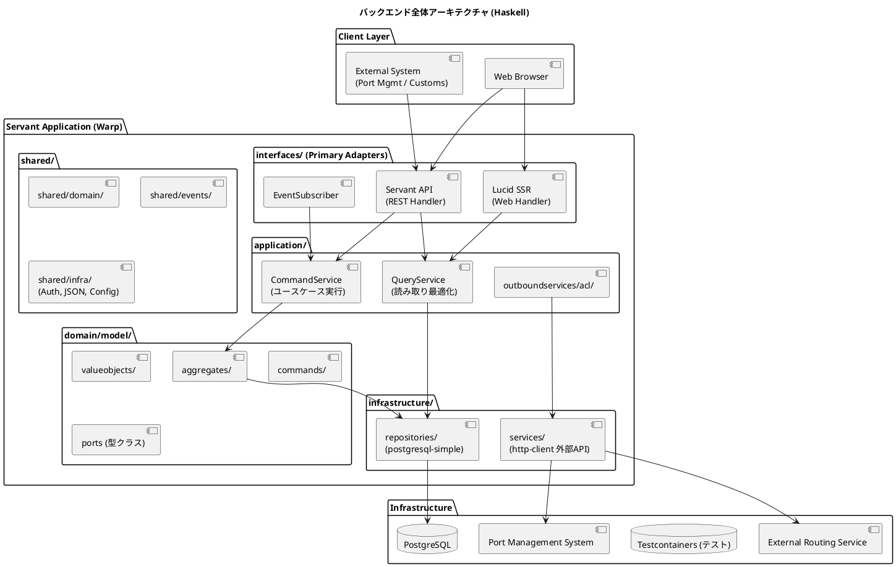
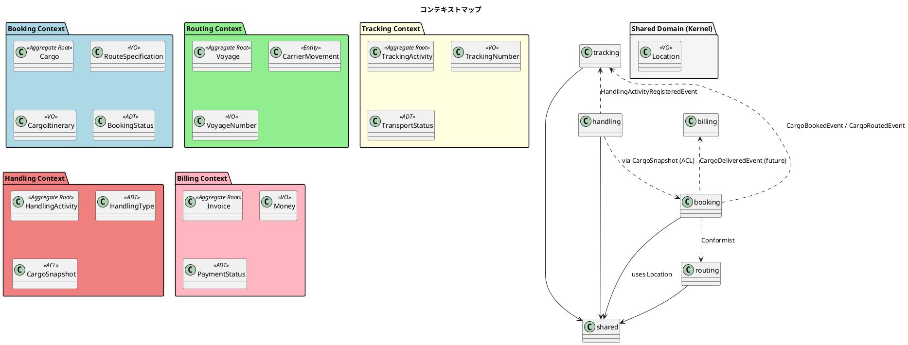
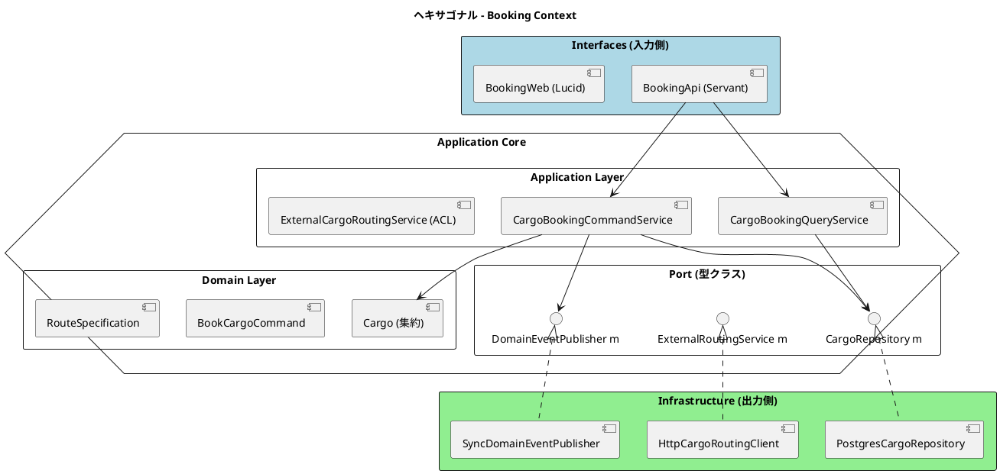
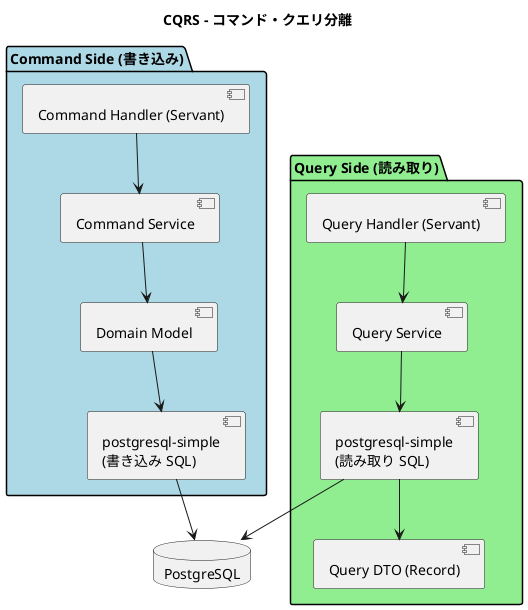
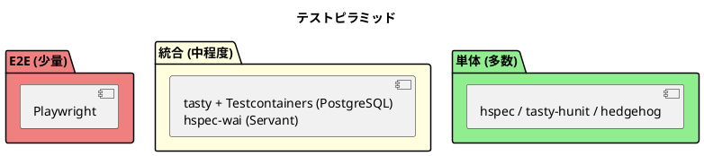

# バックエンドアーキテクチャ - 国際貨物輸送管理システム (Haskell 版)

## 概要

本ドキュメントでは、国際貨物輸送管理システムのバックエンドアーキテクチャを定義する。
Java/Spring Boot 版および Scala/Play 版のアーキテクチャ思想（DDD・ヘキサゴナル・イベント駆動・CQRS）を継承しつつ、
**Servant + Warp / Haskell (GHC 9.x)** を基盤とした関数型スタイルの実装に再設計する。

採用スタック選定の経緯と代替案の比較は [ADR 0001](../adr/0001-haskell-servant-stack.md) を参照すること（別途起票予定）。

## アーキテクチャパターン選択

### 業務領域カテゴリーの評価

| 評価軸 | 判定 | 根拠 |
| :--- | :--- | :--- |
| 業務領域カテゴリー | **中核の業務領域** | 国際貨物輸送は複雑なビジネスルール（通関、積み替え、例外処理）を持つ |
| データ構造の複雑さ | **複雑** | エンティティ間の関係が多く、コンテキスト間でデータを共有・変換する必要がある |
| 特殊要件 | **あり** | 金額（Billing）、監査記録（荷役履歴）、厳密な状態遷移 |

### 選択したアーキテクチャパターン

- **ドメインモデル**: 代数的データ型 (ADT) と純粋関数でビジネスルールを表現。`IO` を含まない純粋な計算に閉じる
- **ポートとアダプター (ヘキサゴナル)**: ドメインを技術的関心事から独立させ、効果は型クラスまたは `ReaderT` で抽象化
- **CQRS**: Booking / Tracking の読み書き負荷特性の違いに対応。クエリは読み取り最適化 DTO を返す

Billing Context は `Money` 値型で金額を厳密管理するが、初期フェーズでイベントソーシングは適用しない。

### Haskell によるドメインモデル表現方針

ドメイン層はフレームワーク・効果システムに依存しない純粋 Haskell で表現する。

| ドメイン概念 | Haskell での表現 | 例 |
| :--- | :--- | :--- |
| 集約・エンティティ | `data` レコード (イミュータブル) | `Cargo`, `Voyage` |
| 値オブジェクト | `newtype` + スマートコンストラクタ (`mkXxx`) | `TrackingNumber`, `Money` |
| 状態・種別 | `data` の代数的データ型 (網羅性検査) | `BookingStatus`, `TransportStatus` |
| ドメインエラー | `data DomainError` + `Either DomainError a` | `assignRoute :: Cargo -> Itinerary -> Either DomainError Cargo` |
| ドメインイベント | sum type `DomainEvent` + 個別 `data` | `CargoBookedEvent` |
| 出力ポート | 型クラス (`class Monad m => CargoRepository m where ...`) | `CargoRepository` |

```haskell
-- 値オブジェクト: newtype + スマートコンストラクタ
newtype TrackingNumber = TrackingNumber { unTrackingNumber :: Text }
  deriving (Eq, Show)

mkTrackingNumber :: Text -> Either DomainError TrackingNumber
mkTrackingNumber t
  | T.length t == 8 && T.all isAlphaNumUpper t = Right (TrackingNumber t)
  | otherwise = Left (InvalidTrackingNumber t)

-- 集約: 状態変更は新しい値を返す
data Cargo = Cargo
  { cargoBookingId         :: BookingId
  , cargoRouteSpecification :: RouteSpecification
  , cargoItinerary         :: Maybe CargoItinerary
  , cargoDelivery          :: Delivery
  , cargoStatus            :: BookingStatus
  } deriving (Eq, Show)

assignRoute :: Cargo -> CargoItinerary -> Either DomainError Cargo
assignRoute cargo itinerary
  | not (isSatisfiedBy (cargoRouteSpecification cargo) itinerary)
      = Left (RouteNotSatisfied (cargoBookingId cargo))
  | otherwise = do
      next <- transitionTo (cargoStatus cargo) RouteProposed
      Right $ cargo { cargoItinerary = Just itinerary, cargoStatus = next }
```

> 状態遷移の検証（`transitionTo`）を含む完全な定義は [ドメインモデル設計](domain-model.md) を参照。

### 効果システム方針

- 純粋ドメインは `IO` を含まない。`Either DomainError a` で失敗を表現
- アプリケーション層・インフラ層は **`ReaderT Env IO`** パターンを採用 (`AppM = ReaderT Env IO`)
- 出力ポートは型クラスとして定義し、`AppM` のインスタンスをインフラ層で提供する
- 将来 `effectful` / `polysemy` への移行余地を残すため、ハンドラはポート経由のみアクセスする

## 全体アーキテクチャ



## 境界付けられたコンテキスト

> 全コンテキストの戦術的設計 (集約・値オブジェクト・状態列挙) は [ドメインモデル設計](domain-model.md) を正とする。
> テーブル構成は [データモデル設計](data-model.md) を参照。

### コンテキストマップ



### 各コンテキストの責務 (要約)

> H-05 反映: 集約数を 7 (Booking / Shipper / Routing / Tracking / Handling / Billing / Estimation) として domain-model.md と統一。

| Context | 集約ルート | 主要概念 | 状態 |
| :--- | :--- | :--- | :--- |
| Booking | `Cargo` | `RouteSpecification`, `Delivery` | `Preliminary` / `RouteProposed` / `RouteAssigned` / `Confirmed` / `TrackingIssued` / `InTransit` / `Delivered` / `Settled` / `Cancelled` |
| Shipper | `Shipper` (sum type) | `IndividualShipper` / `CorporateShipper`, `DiscountRate` | - |
| Routing | `Voyage` | `CarrierMovement`, `Schedule` | - |
| Tracking | `TrackingActivity` | `TrackingNumber`, `TransportStatus` | `NotReceived` / `Received` / `Loaded` / `OnboardCarrier` / `Unloaded` / `AwaitingClaim` / `Claimed` / `InException` / `Unknown` |
| Handling | `HandlingActivity` | `HandlingType`, `CustomsDeclaration` | - |
| Billing | `Invoice` | `Money`, `DiscountPolicy`, `PaymentStatus` | - |
| Estimation | `Estimate` | `RouteCandidate`, `Weight`, `EstimateStatus` | `Created` / `Expired` |
| Shared | - | `Location` (UN/LOCODE), `ShipperId`, `TransportStatus` | - |

`VoyageNumber` は各コンテキスト固有型として共有しない。

## ヘキサゴナルアーキテクチャ (ポートとアダプター)



### レイヤー責務一覧

| レイヤー | モジュール (例) | 責務 | 依存方向 |
| :--- | :--- | :--- | :--- |
| **Domain** | `Booking.Domain.Model.*` | ビジネスルール・不変条件・集約・値オブジェクト・コマンド。Servant / DB に依存しない純粋 Haskell | 外部に依存しない |
| **Application** | `Booking.Application.CommandService`, `QueryService`, `Acl` | ユースケース実行・トランザクション境界・ACL 経由の外部連携 | Domain のみ依存 |
| **Infrastructure** | `Booking.Infrastructure.Repository`, `Booking.Infrastructure.Service` | 永続化 (postgresql-simple)・外部サービスクライアント (http-client) | Application / Domain に依存 |
| **Interfaces** | `Booking.Interfaces.Api`, `Booking.Interfaces.Web`, `Booking.Interfaces.Events` | Servant API・Lucid 画面・イベントサブスクライバ | Application に依存 |

### モジュール構成例 (Booking Context)

```text
src/Cargotracker/Booking/
├── Domain/Model/
│   ├── Aggregates/Cargo.hs
│   ├── Commands/BookCargo.hs
│   ├── Entities/
│   ├── Events/CargoBooked.hs
│   ├── ValueObjects/RouteSpecification.hs
│   ├── ValueObjects/Delivery.hs
│   └── Ports/CargoRepository.hs           -- 型クラス
├── Application/
│   ├── CommandService.hs
│   ├── QueryService.hs
│   └── Acl/ExternalCargoRouting.hs
├── Infrastructure/
│   ├── Repository/PostgresCargoRepository.hs
│   └── Service/HttpCargoRoutingClient.hs
└── Interfaces/
    ├── Api.hs                              -- Servant API 型 + handler
    ├── Api/Dto.hs                          -- JSON DTO (aeson)
    ├── Web.hs                              -- Lucid 画面
    └── Events/CargoBookedSubscriber.hs
```

### Servant API 型による契約

Servant では API はコンパイル時に型として表現される。型と Haskell ハンドラの不整合はコンパイルエラーとなる。

```haskell
type BookingAPI =
       "api" :> "v1" :> "bookings" :> ReqBody '[JSON] BookCargoRequest :> Post '[JSON] BookingIdDto
  :<|> "api" :> "v1" :> "bookings" :> Capture "bookingId" Text :> Get '[JSON] BookingDto
  :<|> "api" :> "v1" :> "bookings" :> Capture "bookingId" Text :> "route"
        :> ReqBody '[JSON] AssignRouteRequest :> Put '[JSON] BookingDto

bookingServer :: ServerT BookingAPI AppM
bookingServer = bookCargo :<|> showBooking :<|> assignRoute
```

### 依存解決 (ReaderT パターン)

`Module.scala` / Guice 相当の役割は `Env` レコードと `App.hs` の起動コードで担う。

```haskell
data Env = Env
  { envCargoRepo       :: SomeCargoRepository    -- 出力ポート実装
  , envRoutingService  :: SomeExternalRouting
  , envEventPublisher  :: SomeEventPublisher
  , envDbPool          :: Pool Connection
  , envLogger          :: Logger
  , envConfig          :: AppConfig
  }

type AppM = ReaderT Env IO

-- 起動時にポート → アダプタを束ねる
buildEnv :: AppConfig -> IO Env
buildEnv cfg = do
  pool   <- createDbPool cfg
  logger <- newLogger cfg
  pure Env
    { envCargoRepo      = postgresCargoRepository pool
    , envRoutingService = httpCargoRoutingClient cfg
    , envEventPublisher = syncDomainEventPublisher
    , envDbPool         = pool
    , envLogger         = logger
    , envConfig         = cfg
    }
```

## CQRS 設計



### CQRS 適用方針

- **コマンド側**: 集約を経由して状態変更し、`Either DomainError a` を返す。永続化はリポジトリ実装内のトランザクションで完結
- **クエリ側**: 集約を経由せず、JOIN を含む生 SQL で画面表示用 DTO (`data BookingSummary`) を直接組み立てる
- **特に有効なコンテキスト**: Booking (一覧・詳細)、Tracking (リアルタイム状態)

```haskell
data BookingSummary = BookingSummary
  { bsBookingId        :: Text
  , bsOrigin           :: Text
  , bsDestination      :: Text
  , bsStatus           :: Text
  , bsLastHandlingEvent :: Maybe Text
  } deriving (Generic, Show, ToJSON)

findBookingSummaries :: AppM [BookingSummary]
findBookingSummaries = withConn $ \conn ->
  liftIO $ query_ conn
    [sql|
      SELECT b.booking_id, b.origin, b.destination, b.status, h.event_type
      FROM bookings b
      LEFT JOIN LATERAL (
        SELECT event_type FROM handling_activities
        WHERE booking_id = b.booking_id
        ORDER BY completed_at DESC LIMIT 1
      ) h ON true
      ORDER BY b.created_at DESC
    |]
```

### トランザクション境界

トランザクションはアプリケーションサービス層で `withTransaction` ヘルパーにより明示する。

#### トランザクション境界規約 (H-07 反映)

ドメインエラー (`Left`) とトランザクションの組み合わせには以下の規約を **必ず** 適用する。

**規約 T-01: ドメイン検証はトランザクション開始前に行う**

`withTransaction` ブロックの中で `Cargo.create` 等の検証を行うと、`Left` 時にも空トランザクションが開始されコミットされる。検証は **必ずブロック外** で行い、`Left` の場合はトランザクションを開始しない。

**規約 T-02: トランザクション内の永続化失敗は例外をスローする**

postgresql-simple の `withTransaction` は例外がスローされた場合のみロールバックする。`Left` を返してもロールバックされないため、リポジトリ操作の失敗は `DomainErrorException` 等のカスタム例外を `throw` し、トランザクション外で `try` してハンドリングする。

**規約 T-03: イベント発行はトランザクションコミット後**

イベント発行を `withTransaction` 内で行うと、ロールバック時にイベントが既に発行済みとなる漏出が発生する。コミット完了後に発行する。

```haskell
-- 正しい実装: 検証はブロック外、永続化失敗は例外、イベント発行はコミット後
bookCargo :: BookCargoCommand -> AppM (Either DomainError BookingId)
bookCargo cmd = do
  env <- ask
  -- T-01: ドメイン検証 (純粋関数、トランザクション開始前)
  case Cargo.create cmd of
    Left err    -> pure (Left err)
    Right cargo -> do
      -- T-02: 永続化失敗は SqlError → DomainError 変換
      result <- liftIO $ try $ withTransaction (envDbConn env) $ do
        saveCargo (envCargoRepo env) cargo
        pure (cargoBookingId cargo)
      case result of
        Left (e :: SqlError) -> pure (Left (PersistenceFailed (toText e)))
        Right bookingId      -> do
          -- T-03: コミット後にイベント発行
          publish (envEventPublisher env) (CargoBookedEvent bookingId)
          pure (Right bookingId)
```

> 違反例: `withTransaction $ case Cargo.create cmd of Left err -> pure (Left err) ; Right ...` は空トランザクションが発生する。`withTransaction $ ... ; publish ...` はロールバック時にイベント漏出する。
> 規約違反を CI で検出するため、`bookCargo` パターンを `arch-check` のチェック対象に加える ([ADR 0002](../adr/0002-arch-check-implementation.md) 参照)。

## イベント駆動設計

### ドメインイベント一覧

| イベント | 発生元 | 処理先 | 内容 |
| :--- | :--- | :--- | :--- |
| `CargoBookedEvent` | Booking | Tracking | 追跡番号割り当てトリガー |
| `CargoRoutedEvent` | Booking | Tracking | 経路・旅程確定通知 |
| `HandlingActivityRegisteredEvent` | Handling | Tracking, Booking | 荷役 → 輸送ステータス同期 |
| `TrackingExceptionDetectedEvent` | Tracking | Booking, Notification | 例外検知 |
| `InvoiceCreatedEvent` | Billing | Notification | 請求書発行通知 |

### DomainEventPublisher の実装方針

```haskell
-- 共有カーネル: 出力ポートとサブスクライバ契約
class Monad m => DomainEventPublisher m where
  publish :: DomainEvent -> m ()

data DomainEventSubscriber = DomainEventSubscriber
  { isSubscribedTo :: DomainEvent -> Bool
  , handleEvent    :: DomainEvent -> AppM ()
  }

-- 同期ディスパッチ実装
newtype SyncPublisher = SyncPublisher { subscribers :: [DomainEventSubscriber] }

publishSync :: SyncPublisher -> DomainEvent -> AppM ()
publishSync (SyncPublisher subs) event =
  forM_ (filter (\s -> isSubscribedTo s event) subs) $ \s ->
    handleEvent s event `catch` \(e :: SomeException) ->
      logError ("event subscriber failed: " <> tshow e)
```

> **設計注意**: 同期ディスパッチをトランザクション内 (`withTransaction` ブロック内) で行うと、
> サブスクライバの処理が発行側のトランザクションに巻き込まれる。イベント発行はコミット後に行うこと。
> 高可用性が必要な段階で Transactional Outbox + メッセージブローカー (Kafka 等) への移行を検討する。

> **部分配信の防止**: 1 つの購読者の例外が後続を止めないよう、`catch` で隔離しログに残して次へ進む。

## Scala (Play) → Haskell (Servant) 対応マッピング

| Scala / Play | Haskell 移行先 | 移行ポイント |
| :--- | :--- | :--- |
| Guice DI (`@Inject`) | `ReaderT Env IO` + 型クラスポート | コンストラクタ DI を環境レコードで置換 |
| Play Controller + `conf/routes` | Servant API 型 + `serve` | 型としてのルーティング。整合性はコンパイル時に検証 |
| Play JSON `Format` | aeson `ToJSON` / `FromJSON` | `deriving` で自動導出 |
| ScalikeJDBC SQL interpolation | postgresql-simple `[sql|...|]` QuasiQuoter | 同等の生 SQL アプローチ |
| ScalikeJDBC `DB.localTx` | `withTransaction` (postgresql-simple) | 明示的トランザクション境界 |
| Twirl | Lucid (HTML EDSL) | フロントエンドアーキテクチャ参照 |
| Play Form | Web.FormUrlEncoded + 独自バリデーション | 入力検証 + ドメイン検証の二段構え |
| Play Session 認証 + ActionBuilder | Servant Auth (JWT or Cookie) + AuthHandler | カスタムハンドラで実装 |
| Typesafe Config | dhall / envparse / `Configurator` | 環境別オーバーレイは dhall を推奨 |
| Logback + logstash-encoder | `katip` / `co-log` (JSON sink) | 構造化ログ出力 |
| Spring Profile / `application-*.conf` | `APP_ENV` + dhall ファイル選択 | 環境切替 |
| Spring Actuator | 自作 `/health` エンドポイント | DB 疎通含めて自前定義 |
| Flyway | `dbmate` / `postgres-migrations` / 自作マイグレーター | SQL ファイルベースで運用 |

## API 設計方針

### REST API 設計原則

| 原則 | 内容 |
| :--- | :--- |
| **リソース指向** | URL は名詞、動詞は HTTP メソッド |
| **バージョニング** | `/api/v1/` プレフィックス |
| **レスポンス形式** | JSON (aeson)。エラーは `{ "code": "BOOKING_NOT_FOUND", "message": "..." }`。`DomainError` → HTTP エラーの変換は Interfaces 層の `domainErrorToServerError` で一元化 |
| **ステータスコード** | 成功 200/201/204、クライアント 400/404/409、サーバー 500 |

### 主要エンドポイント

| メソッド | パス | 説明 |
| :--- | :--- | :--- |
| `POST` | `/api/v1/bookings` | 貨物予約の登録 |
| `GET` | `/api/v1/bookings/:bookingId` | 予約詳細 |
| `PUT` | `/api/v1/bookings/:bookingId/route` | 経路割り当て |
| `GET` | `/api/v1/tracking/:trackingNumber` | 追跡情報 |
| `POST` | `/api/v1/handling` | 荷役作業登録 |
| `GET` | `/api/v1/voyages` | 航路一覧 |

## セキュリティ設計

### Servant Auth (servant-auth-server) による認証・認可

Spring Security / Play Session 相当を `servant-auth-server` の `AuthProtect` ハンドラと JWT (または署名付き Cookie) で実装する。

```haskell
type ProtectedAPI = AuthProtect "cookie-auth" :> BookingAPI

-- ロール
data Role
  = Shipper | Sales | RouteDesigner | Handler | Tracker | Accountant | Admin
  deriving (Eq, Show, Read, Generic, ToJSON, FromJSON)

data AuthenticatedUser = AuthenticatedUser
  { authUserId :: UserId
  , authRoles  :: [Role]
  }

requireRole :: Role -> AuthenticatedUser -> Handler ()
requireRole r u
  | r `elem` authRoles u = pure ()
  | otherwise            = throwError err403
```

| ロール | 権限 | 対象ユーザー |
| :--- | :--- | :--- |
| `Shipper` | 予約照会・追跡照会 | 荷主 |
| `Sales` | 見積・荷主登録・予約登録・確定 | 営業担当者 |
| `RouteDesigner` | 航海スケジュール・経路設計 | 経路設計者 |
| `Handler` | 荷役作業登録 | 荷役作業員 |
| `Tracker` | 追跡情報管理・例外対応 | 追跡管理者 |
| `Accountant` | 請求書管理 | 経理担当者 |
| `Admin` | 全機能 | システム管理者 |

## テスト戦略



### 各層のテスト方針

| 対象 | 種別 | 使用技術 | 方針 |
| :--- | :--- | :--- | :--- |
| ドメインモデル | 単体 | hspec, hedgehog (property test) | 純粋関数。`Either` の成功・失敗パスとビジネスルールを網羅 |
| Application Service | 単体 | hspec + ポートのモック実装 | リポジトリ・イベントポートを純粋なテストダブルに差し替え |
| Repository | 統合 | Testcontainers PostgreSQL | 実 DB への SQL を検証 |
| Servant API | 統合 | hspec-wai | エンドポイント入出力・認証・JSON 整合性 |
| アーキテクチャ規約 | 単体 | カスタム HLint ルール / `dependencies.dhall` 制約 | モジュール依存方向を検査 |
| E2E | E2E | Playwright | 主要シナリオ (予約 → 追跡 → 配達) |

> **ドメインモデルが純粋であることの利点**: 副作用を含まないため、テストは入出力検証のみで書ける。
> ピラミッドの土台を厚くするうえで、`Either` ベースのエラー表現と ADT の網羅性検査が直接効く。

### アーキテクチャ規約 (最低限)

1. ドメイン層がインフラ層に依存しない (`*.Domain.*` が `*.Infrastructure.*` を import しない)
2. ドメイン層が Servant / postgresql-simple / aeson に依存しない (例外: 共有カーネルの ID 型のみ)
3. アプリケーション層はポート (型クラス) 経由でのみインフラを参照
4. 異なる Bounded Context 間の直接参照禁止 (ACL / Event 経由のみ。`Shared` は除く)

CI で `hlint` + `weeder` + 自作 import 規約チェッカ (`stack exec arch-check`) を実行する。

## モジュール (パッケージ) 構成

```text
cargo-tracker/
├── package.yaml                       -- または cargo-tracker.cabal
├── src/Cargotracker/
│   ├── Booking/
│   │   ├── Domain/Model/...
│   │   ├── Application/...
│   │   ├── Infrastructure/...
│   │   └── Interfaces/...
│   ├── Shipper/
│   ├── Routing/                       -- 将来実装
│   ├── Tracking/                      -- 将来実装
│   ├── Handling/                      -- 将来実装
│   ├── Billing/                       -- 将来実装
│   └── Shared/
│       ├── Domain/Model/Location.hs
│       ├── Domain/Model/DomainEvent.hs
│       ├── Domain/Model/DomainError.hs
│       └── Infrastructure/
│           ├── Auth/
│           ├── Events/SyncPublisher.hs
│           ├── Db/Pool.hs
│           └── Logging/Katip.hs
├── app/Main.hs                        -- Warp 起動
├── db/migrations/                     -- SQL マイグレーション
├── test/
│   ├── unit/
│   └── integration/
└── stack.yaml / cabal.project
```

## 参照

- [ドメインモデル設計](domain-model.md)
- [データモデル設計](data-model.md)
- [フロントエンドアーキテクチャ](architecture_frontend.md)
- [インフラアーキテクチャ](architecture_infrastructure.md)
- Scala 版参考: `tmp/case-study-cargo-tracker/docs/design/architecture_backend.md`
