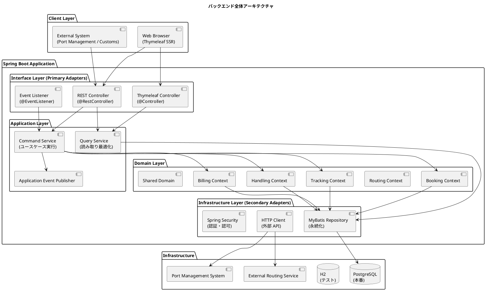
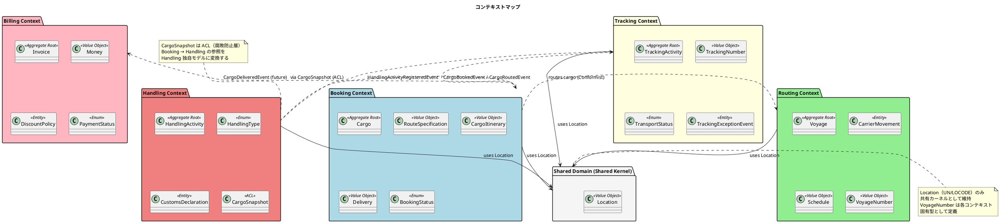
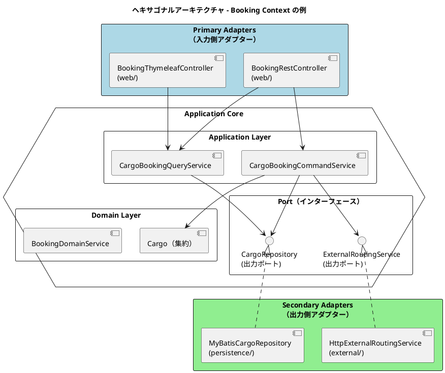
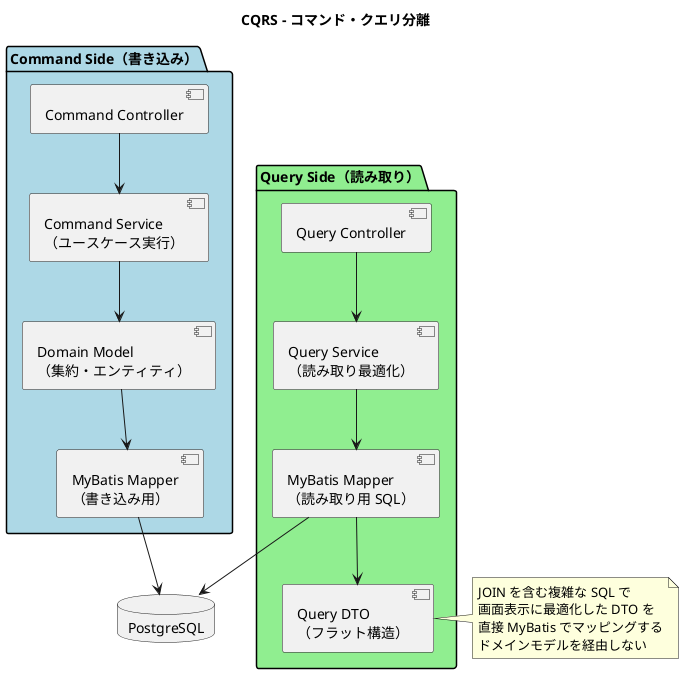
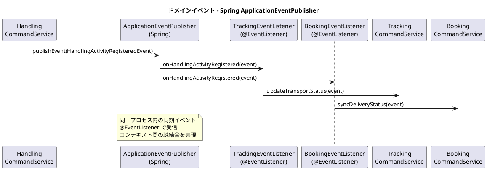
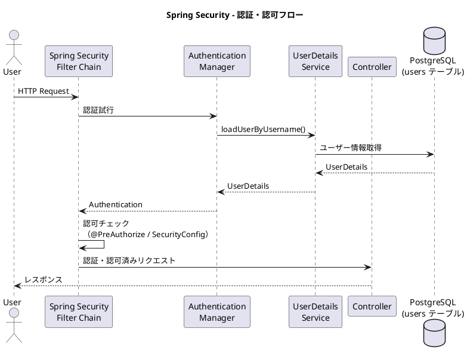
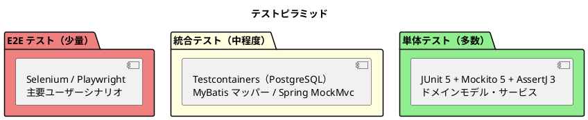

# バックエンドアーキテクチャ - 国際貨物輸送管理システム

## 概要

本ドキュメントでは、国際貨物輸送管理システムのバックエンドアーキテクチャを定義する。
Jakarta EE 参考実装のアーキテクチャ思想（DDD・ヘキサゴナル・イベント駆動）を継承しつつ、
Spring Boot 4.0 / Java 25 を基盤とした現代的な実装に移植する。

## アーキテクチャパターン選択

### 業務領域カテゴリーの評価

| 評価軸 | 判定 | 根拠 |
| :--- | :--- | :--- |
| 業務領域カテゴリー | **中核の業務領域** | 国際貨物輸送は複雑なビジネスルール（通関、積み替え、例外処理）を持つ |
| データ構造の複雑さ | **複雑** | エンティティ間の関係が多く、コンテキスト間でデータを共有・変換する必要がある |
| 特殊要件 | **あり** | 金額を扱う（Billing Context）、監査記録が必要（荷役履歴）、状態遷移が厳密 |

### 選択したアーキテクチャパターン

上記評価から、以下の組み合わせを採用する。

- **ドメインモデル**: ビジネスルールをドメインオブジェクトにカプセル化し、手続き的なロジックを排除する
- **ポートとアダプター（ヘキサゴナルアーキテクチャ）**: ドメインを技術的関心事から独立させ、テスト容易性を確保する
- **CQRS（コマンドクエリ責務分離）**: Booking / Tracking の読み書き負荷特性の違いに対応し、クエリを読み取り最適化モデルで返す

Billing Context は `MoneyAmount` 値オブジェクトによる金額管理を行うが、初期フェーズではイベントソーシングは適用しない。

## 全体アーキテクチャ



## 境界付けられたコンテキスト

### コンテキストマップ



### 各コンテキストの説明

#### 1. Booking Context（予約コンテキスト）

荷物予約の中核ロジックを担う。荷物の登録・経路割り当て・状態管理を責務とする。

| 要素 | 内容 |
| :--- | :--- |
| 集約ルート | `Cargo` |
| 主要概念 | `RouteSpecification`, `CargoItinerary`, `Delivery` |
| `BookingStatus` | `PRELIMINARY` / `ROUTE_PROPOSED` / `CONFIRMED` / `TRACKING_ISSUED` / `IN_TRANSIT` / `DELIVERED` / `SETTLED` / `CANCELLED` |
| アクター | 荷主、営業担当者 |

#### 2. Routing Context（経路コンテキスト）

航路・運航スケジュールを管理する。外部経路システムとの統合を担う。

| 要素 | 内容 |
| :--- | :--- |
| 集約ルート | `Voyage` |
| 主要概念 | `CarrierMovement`, `Schedule`, `VoyageNumber` |
| アクター | 経路設計者、外部経路システム |

#### 3. Tracking Context（追跡コンテキスト）

荷物の現在状態・輸送ステータスを管理する。CQRS の読み取り側最適化が特に有効なコンテキスト。

| 要素 | 内容 |
| :--- | :--- |
| 集約ルート | `TrackingActivity` |
| 主要概念 | `TrackingNumber`, `TransportStatus`, `TrackingExceptionEvent` |
| `TransportStatus` | `NOT_RECEIVED` / `RECEIVED` / `LOADED` / `IN_TRANSIT` / `UNLOADED` / `CUSTOMS_INSPECTION` / `AWAITING_CLAIM` / `DELIVERED` / `MISROUTED` |
| アクター | 追跡管理者、荷主、荷受人 |

#### 4. Handling Context（荷役コンテキスト）

港湾・税関での荷役作業を記録する。`CargoSnapshot` ACL で Booking Context への依存を吸収する。

| 要素 | 内容 |
| :--- | :--- |
| 集約ルート | `HandlingActivity` |
| 主要概念 | `HandlingType`, `CustomsDeclaration`, `CargoSnapshot`（ACL） |
| アクター | 荷役作業員、港湾管理システム、税関 |

#### 5. Billing Context（請求コンテキスト）

運賃・請求書の管理を担う。`Money` 値オブジェクトで金額を厳密に管理する。

| 要素 | 内容 |
| :--- | :--- |
| 集約ルート | `Invoice` |
| 主要概念 | `Money`, `DiscountPolicy`, `PaymentStatus` |
| アクター | 経理担当者、荷主、決済機関 |

#### 6. Shared Domain（共有ドメイン）

`Location`（UN/LOCODE）のみ共有カーネルとして維持する。`VoyageNumber` は各コンテキスト固有型として定義し、共有しない。

## ヘキサゴナルアーキテクチャ（ポートとアダプター）



### レイヤー責務一覧

| レイヤー | パッケージ | 責務 | 依存方向 |
| :--- | :--- | :--- | :--- |
| **Domain** | `domain/model/`, `domain/event/` | ビジネスルール・不変条件・ドメインイベント定義 | 外部に依存しない |
| **Application** | `application/command/`, `application/query/` | ユースケース実行・集約操作・イベント発行 | Domain のみ依存 |
| **Infrastructure** | `infrastructure/persistence/`, `infrastructure/web/`, `infrastructure/event/` | 永続化・HTTP・イベント処理の技術実装 | Application / Domain に依存 |

## CQRS 設計



### CQRS 適用方針

- **コマンド側**: ドメインモデル（集約）を通じて状態変更。不変条件の検証後、MyBatis で永続化する
- **クエリ側**: ドメインモデルを経由せず、MyBatis の XML マッパーで JOIN クエリを直接記述し、画面表示用 DTO を返す
- **CQRS が特に有効なコンテキスト**: Booking（一覧・詳細の頻繁な参照）、Tracking（リアルタイム状態確認）

## イベント駆動設計



### ドメインイベント一覧

| イベント | 発生元コンテキスト | 処理先コンテキスト | 内容 |
| :--- | :--- | :--- | :--- |
| `CargoBookedEvent` | Booking | Tracking | 追跡番号の割り当てトリガー |
| `CargoRoutedEvent` | Booking | Tracking | 経路・旅程の確定をトラッキングに通知 |
| `HandlingActivityRegisteredEvent` | Handling | Tracking, Booking | 荷役作業登録 → 輸送ステータス同期 |
| `TrackingExceptionDetectedEvent` | Tracking | Booking, Notification | 例外検知 → 関係者への通知 |
| `InvoiceCreatedEvent` | Billing | Notification | 請求書発行 → 荷主への通知 |

### Spring ApplicationEventPublisher の実装方針

```java
// ドメインイベントの発行（Application Service 内）
@Service
public class HandlingCommandService {
    private final ApplicationEventPublisher eventPublisher;

    public void registerHandlingActivity(RegisterHandlingCommand command) {
        // ドメインロジック実行後にイベント発行
        eventPublisher.publishEvent(new HandlingActivityRegisteredEvent(this, activity));
    }
}

// イベントリスナー（infrastructure/event/ パッケージ）
@Component
public class TrackingEventListener {
    @EventListener
    public void onHandlingActivityRegistered(HandlingActivityRegisteredEvent event) {
        trackingCommandService.updateTransportStatus(event);
    }
}
```

> **設計注意**: `@EventListener` はデフォルトでトランザクションコミット前に実行される。
> コミット前にリスナーが実行されるリスクを避けるため、ドメインイベントのリスナーには
> `@TransactionalEventListener(phase = TransactionPhase.AFTER_COMMIT)` を使用すること。
> 高可用性が必要なシステムへ移行する際は Transactional Outbox パターンへの移行を検討すること。

## Jakarta EE → Spring Boot 移行マッピング

| Jakarta EE 技術 | Spring Boot 移行先 | 移行ポイント |
| :--- | :--- | :--- |
| CDI（`@Inject`） | Spring DI（`@Component`, `@Service`, `@Repository`） | アノテーション名の変更のみ。コンストラクタインジェクションを優先する |
| JAX-RS（`@Path`, `@GET`） | Spring MVC（`@RestController`, `@GetMapping`） | エンドポイント定義のアノテーション変更 |
| CDI Events（`Event<T>.fire()`） | `ApplicationEventPublisher.publishEvent()` | 同期イベントはほぼ等価。同一プロセス内通信 |
| JPA / EclipseLink | **MyBatis**（XML マッパー） | ORM から SQL 明示管理へ変更。ドメインモデルの `@Entity` は不要になる |
| Bean Validation | Spring Validation（`@Valid`, `BindingResult`） | アノテーションは共通（Jakarta Validation API） |
| Jakarta Security | Spring Security 7.x | フォームベース認証・RBAC を Spring Security で実装 |
| `@ApplicationScoped` | `@Component`（シングルトンがデフォルト） | スコープ管理の思想は共通 |
| `@Transactional`（JTA） | `@Transactional`（Spring） | アノテーション名は同じ。JTA から Spring トランザクションへ変更 |

## パッケージ構造

```
apps/backend/src/main/java/com/example/cargotracker/
├── booking/
│   ├── domain/
│   │   ├── model/             # 集約（Cargo）、エンティティ、値オブジェクト（BookingStatus 等）
│   │   ├── event/             # CargoBookedEvent, CargoRoutedEvent
│   │   └── repository/        # CargoRepository インターフェース（出力ポート）
│   ├── application/
│   │   ├── command/           # CargoBookingCommandService（ユースケース実装）
│   │   └── query/             # CargoBookingQueryService（CQRS クエリ側）
│   └── infrastructure/
│       ├── persistence/       # MyBatisCargoRepository（リポジトリ実装）
│       │   └── mapper/        # CargoMapper.java, CargoMapper.xml
│       ├── web/               # BookingRestController, BookingController（入力アダプター）
│       └── event/             # BookingEventListener（@EventListener）
├── routing/
│   ├── domain/
│   ├── application/
│   └── infrastructure/
├── tracking/
│   ├── domain/
│   ├── application/
│   └── infrastructure/
├── handling/
│   ├── domain/
│   │   └── model/             # CargoSnapshot（ACL）を含む
│   ├── application/
│   └── infrastructure/
├── billing/
│   ├── domain/
│   │   └── model/             # Money 値オブジェクト
│   ├── application/
│   └── infrastructure/
└── shared/
    └── domain/
        └── model/             # Location（UN/LOCODE）共有カーネル
```

## API 設計方針

### REST API 設計原則

| 原則 | 内容 |
| :--- | :--- |
| **リソース指向** | URL はリソースを表す名詞。動詞は HTTP メソッドで表現する |
| **バージョニング** | `/api/v1/` プレフィックスでバージョンを管理する |
| **レスポンス形式** | JSON。エラーレスポンスは `{ "code": "BOOKING_NOT_FOUND", "message": "..." }` 形式 |
| **ステータスコード** | 成功: 200/201/204、クライアントエラー: 400/404/409、サーバーエラー: 500 |
| **HATEOAS** | 初期フェーズでは適用しない |

### 主要エンドポイント（例）

| メソッド | パス | 説明 |
| :--- | :--- | :--- |
| `POST` | `/api/v1/bookings` | 貨物予約の登録 |
| `GET` | `/api/v1/bookings/{bookingId}` | 予約詳細の取得 |
| `PUT` | `/api/v1/bookings/{bookingId}/route` | 経路の割り当て |
| `GET` | `/api/v1/tracking/{trackingNumber}` | 追跡情報の取得 |
| `POST` | `/api/v1/handling` | 荷役作業の登録 |
| `GET` | `/api/v1/voyages` | 航路一覧の取得 |

## セキュリティ設計

### Spring Security による認証・認可



### ロール設計

| ロール | 権限 | 対象ユーザー |
| :--- | :--- | :--- |
| `ROLE_SHIPPER` | 予約照会・追跡照会 | 荷主 |
| `ROLE_SALES` | 予約登録・経路割り当て | 営業担当者 |
| `ROLE_HANDLER` | 荷役作業登録 | 荷役作業員 |
| `ROLE_TRACKER` | 追跡情報管理・例外対応 | 追跡管理者 |
| `ROLE_ACCOUNTANT` | 請求書管理 | 経理担当者 |
| `ROLE_ADMIN` | 全機能 | システム管理者 |

## テスト戦略



### 各層のテスト方針

| テスト対象 | テスト種別 | 使用技術 | 方針 |
| :--- | :--- | :--- | :--- |
| ドメインモデル（集約・値オブジェクト） | 単体テスト | JUnit 5, AssertJ | 依存なし。ビジネスルールを網羅的にテスト |
| Application Service | 単体テスト | JUnit 5, Mockito | リポジトリをモック化。ユースケースのフローをテスト |
| MyBatis Mapper | 統合テスト | Testcontainers, H2 | 実 DB への SQL を検証。スキーマを Flyway で適用 |
| REST Controller | 統合テスト | Spring MockMvc | エンドポイントの入出力・バリデーションをテスト |
| E2E | E2E テスト | Selenium | 主要ユーザーシナリオ（予約 → 追跡 → 配達）を検証 |
