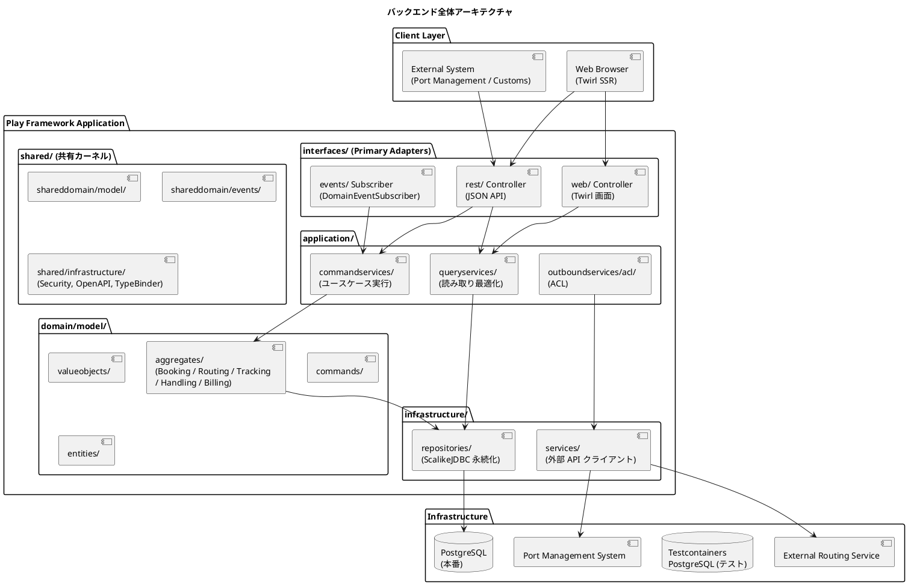
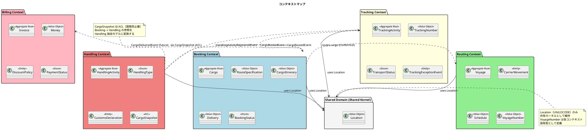
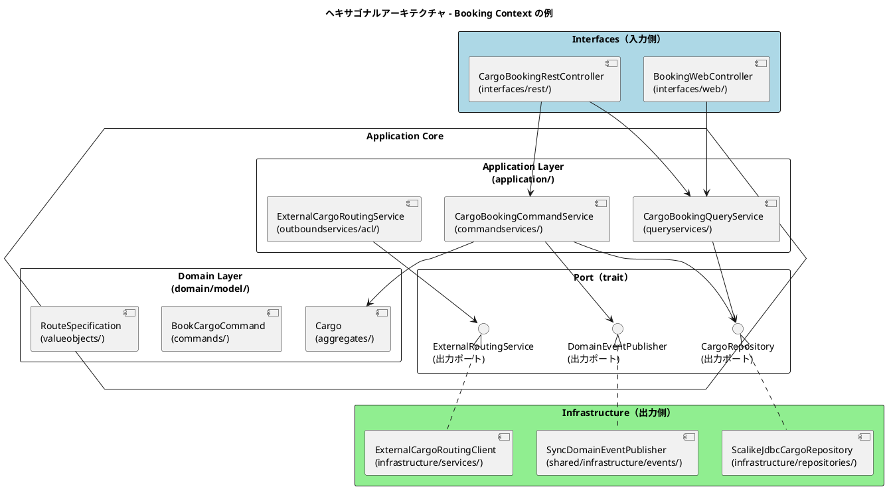
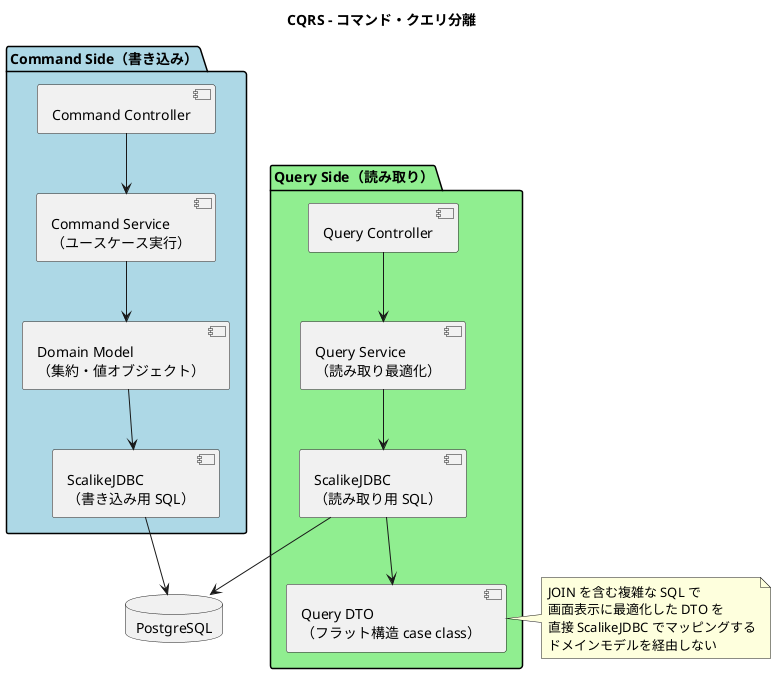
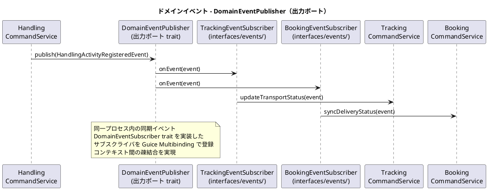
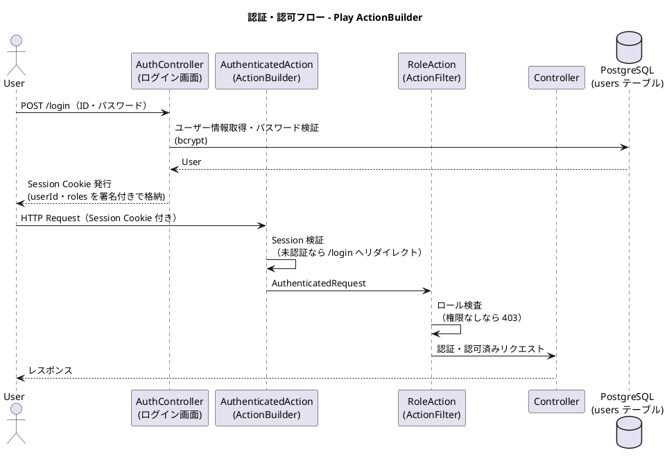
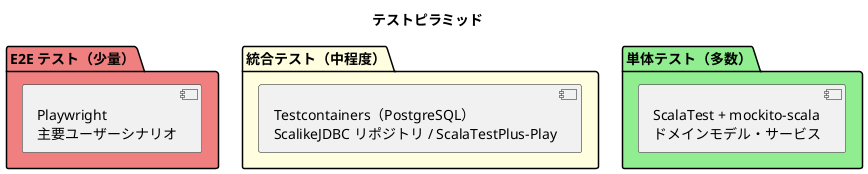

# バックエンドアーキテクチャ - 国際貨物輸送管理システム

## 概要

本ドキュメントでは、国際貨物輸送管理システムのバックエンドアーキテクチャを定義する。
Jakarta EE 参考実装および Java/Spring Boot 版のアーキテクチャ思想（DDD・ヘキサゴナル・イベント駆動）を継承しつつ、
**Play Framework 3.x / Scala 3** を基盤とした関数型スタイルの実装に再設計する。

スタック選定の経緯と代替案の比較は [ADR 0001](../adr/0001-play-framework-scala-stack.md) を参照すること。

## アーキテクチャパターン選択

### 業務領域カテゴリーの評価

| 評価軸 | 判定 | 根拠 |
| :--- | :--- | :--- |
| 業務領域カテゴリー | **中核の業務領域** | 国際貨物輸送は複雑なビジネスルール（通関、積み替え、例外処理）を持つ |
| データ構造の複雑さ | **複雑** | エンティティ間の関係が多く、コンテキスト間でデータを共有・変換する必要がある |
| 特殊要件 | **あり** | 金額を扱う（Billing Context）、監査記録が必要（荷役履歴）、状態遷移が厳密 |

### 選択したアーキテクチャパターン

上記評価から、以下の組み合わせを採用する。

- **ドメインモデル**: ビジネスルールをイミュータブルなドメインオブジェクトにカプセル化し、手続き的なロジックを排除する
- **ポートとアダプター（ヘキサゴナルアーキテクチャ）**: ドメインを技術的関心事から独立させ、テスト容易性を確保する
- **CQRS（コマンドクエリ責務分離）**: Booking / Tracking の読み書き負荷特性の違いに対応し、クエリを読み取り最適化モデルで返す

Billing Context は `Money` 値オブジェクトによる金額管理を行うが、初期フェーズではイベントソーシングは適用しない。

### Scala によるドメインモデル表現方針

ドメイン層は特定のフレームワーク・エフェクトシステムに依存せず、Scala 3 の言語機能のみで表現する。

| ドメイン概念 | Scala 3 での表現 | 例 |
| :--- | :--- | :--- |
| 集約・エンティティ | イミュータブル `case class`（状態変更は新インスタンスを返す） | `Cargo`, `Voyage` |
| 値オブジェクト | `opaque type` + スマートコンストラクタ、または `case class` | `TrackingNumber`, `Money` |
| 状態・種別 | `enum`（網羅性検査により遷移漏れをコンパイル時検出） | `BookingStatus`, `TransportStatus` |
| ドメインエラー | `enum DomainError` + `Either[DomainError, A]` | `Cargo.assignRoute` の戻り値 |
| ドメインイベント | `sealed trait DomainEvent` を継承した `case class` | `CargoBookedEvent` |
| 出力ポート | `trait`（インフラ層が実装） | `CargoRepository` |

```scala
// 値オブジェクト: opaque type + スマートコンストラクタ
opaque type TrackingNumber = String

object TrackingNumber:
  def apply(value: String): Either[DomainError, TrackingNumber] =
    if value.matches("[A-Z0-9]{8}") then Right(value)
    else Left(DomainError.InvalidTrackingNumber(value))

// 集約: 状態変更は新しいインスタンスを返す
final case class Cargo(
    bookingId: BookingId,
    routeSpecification: RouteSpecification,
    itinerary: Option[CargoItinerary],
    delivery: Delivery,
    status: BookingStatus
):
  def assignRoute(itinerary: CargoItinerary): Either[DomainError, Cargo] =
    if routeSpecification.isSatisfiedBy(itinerary) then
      Right(copy(itinerary = Some(itinerary), status = BookingStatus.RouteProposed))
    else Left(DomainError.RouteNotSatisfied(bookingId))
```

## 全体アーキテクチャ



## 境界付けられたコンテキスト

### コンテキストマップ



### 各コンテキストの説明

#### 1. Booking Context（予約コンテキスト）

荷物予約の中核ロジックを担う。荷物の登録・経路割り当て・状態管理を責務とする。

| 要素 | 内容 |
| :--- | :--- |
| 集約ルート | `Cargo` |
| 主要概念 | `RouteSpecification`, `CargoItinerary`, `Delivery` |
| `BookingStatus` | `Preliminary` / `RouteProposed` / `Confirmed` / `TrackingIssued` / `InTransit` / `Delivered` / `Settled` / `Cancelled` |
| アクター | 荷主、営業担当者 |

#### 2. Routing Context（経路コンテキスト）

航路・運航スケジュールを管理する。外部経路システムとの統合を担う。

| 要素 | 内容 |
| :--- | :--- |
| 集約ルート | `Voyage` |
| 主要概念 | `CarrierMovement`, `Schedule`, `VoyageNumber` |
| アクター | 経路設計者、外部経路システム |

#### 3. Tracking Context（追跡コンテキスト）

荷物の現在状態・輸送ステータスを管理する。CQRS の読み取り側最適化が特に有効なコンテキスト。

| 要素 | 内容 |
| :--- | :--- |
| 集約ルート | `TrackingActivity` |
| 主要概念 | `TrackingNumber`, `TransportStatus`, `TrackingExceptionEvent` |
| `TransportStatus` | `NotReceived` / `Received` / `Loaded` / `InTransit` / `Unloaded` / `CustomsInspection` / `AwaitingClaim` / `Delivered` / `Misrouted` |
| アクター | 追跡管理者、荷主、荷受人 |

#### 4. Handling Context（荷役コンテキスト）

港湾・税関での荷役作業を記録する。`CargoSnapshot` ACL で Booking Context への依存を吸収する。

| 要素 | 内容 |
| :--- | :--- |
| 集約ルート | `HandlingActivity` |
| 主要概念 | `HandlingType`, `CustomsDeclaration`, `CargoSnapshot`（ACL） |
| アクター | 荷役作業員、港湾管理システム、税関 |

#### 5. Billing Context（請求コンテキスト）

運賃・請求書の管理を担う。`Money` 値オブジェクトで金額を厳密に管理する。

| 要素 | 内容 |
| :--- | :--- |
| 集約ルート | `Invoice` |
| 主要概念 | `Money`, `DiscountPolicy`, `PaymentStatus` |
| アクター | 経理担当者、荷主、決済機関 |

#### 6. Shared Domain（共有ドメイン）

`Location`（UN/LOCODE）のみ共有カーネルとして維持する。`VoyageNumber` は各コンテキスト固有型として定義し、共有しない。

## ヘキサゴナルアーキテクチャ（ポートとアダプター）



### レイヤー責務一覧

> Java 版（Practical DDD in Enterprise Java, Chapter 3）のパッケージ構造を Scala / Play に対応付けて維持する。

| レイヤー | パッケージ | 責務 | 依存方向 |
| :--- | :--- | :--- | :--- |
| **Domain** | `domain/model/aggregates/`, `domain/model/valueobjects/`, `domain/model/commands/`, `domain/model/entities/` | ビジネスルール・不変条件・集約・値オブジェクト・コマンド定義。Play / ScalikeJDBC に依存しない純粋な Scala | 外部に依存しない |
| **Application** | `application/commandservices/`, `application/queryservices/`, `application/outboundservices/acl/` | ユースケース実行・集約操作・トランザクション境界（`DB.localTx`）・ACL 経由の外部連携 | Domain のみ依存 |
| **Infrastructure** | `infrastructure/repositories/`, `infrastructure/services/` | 永続化（ScalikeJDBC）・外部サービスクライアント（Play WS） | Application / Domain に依存 |
| **Interfaces** | `interfaces/rest/`, `interfaces/rest/dto/`, `interfaces/web/`, `interfaces/events/` | REST Controller・JSON DTO（Play JSON `Format`）・画面 Controller（Twirl）・イベントサブスクライバ | Application に依存 |

### パッケージ構成例（Booking Context）

```text
booking/
├── domain/
│   └── model/
│       ├── aggregates/          集約ルート（Cargo, BookingId）
│       ├── commands/            コマンド（BookCargoCommand, RouteCargoCommand）
│       ├── entities/            エンティティ
│       ├── events/              ドメインイベント（CargoBookedEvent）
│       ├── valueobjects/        値オブジェクト（RouteSpecification, Delivery, Leg 等）
│       └── repositories/        出力ポート trait（CargoRepository）
├── application/
│   ├── commandservices/         コマンドサービス（CargoBookingCommandService）
│   ├── queryservices/           クエリサービス（CargoBookingQueryService）
│   └── outboundservices/
│       └── acl/                 ACL（ExternalCargoRoutingService）
├── infrastructure/
│   ├── repositories/            リポジトリ実装（ScalikeJdbcCargoRepository）
│   └── services/                外部サービス実装（ExternalCargoRoutingClient）
└── interfaces/
    ├── rest/                    REST Controller（CargoBookingRestController）
    │   └── dto/                 リクエスト / レスポンス DTO（Play JSON Format）
    ├── web/                     画面 Controller（BookingWebController）
    └── events/                  イベントサブスクライバ（CargoBookedEventSubscriber）
```

### Play Framework との対応

Play 標準のディレクトリ規約とコンテキスト別パッケージは以下のように対応させる。

| Play の要素 | 本システムでの扱い |
| :--- | :--- |
| `conf/routes` | 全コンテキストのエンドポイント定義を一元管理。Controller はコンテキスト別パッケージ（`cargotracker.booking.interfaces.*`）を参照する |
| `app/views/` | Twirl テンプレート。フロントエンドアーキテクチャを参照 |
| `app/Module.scala` | Guice バインディング定義。出力ポート trait → インフラ実装の束ね先 |
| `conf/application.conf` | 環境設定（DB 接続・セキュリティ・Pekko） |

```scala
// Module.scala - ポートとアダプターの束ね（Guice）
class Module extends AbstractModule:
  override def configure(): Unit =
    bind(classOf[CargoRepository]).to(classOf[ScalikeJdbcCargoRepository])
    bind(classOf[ExternalRoutingService]).to(classOf[ExternalCargoRoutingClient])
    bind(classOf[DomainEventPublisher]).to(classOf[SyncDomainEventPublisher])
```

## CQRS 設計



### CQRS 適用方針

- **コマンド側**: ドメインモデル（集約）を通じて状態変更。`Either` による不変条件の検証後、ScalikeJDBC で永続化する
- **クエリ側**: ドメインモデルを経由せず、ScalikeJDBC の SQL interpolation で JOIN クエリを直接記述し、画面表示用 DTO（フラットな `case class`）を返す
- **CQRS が特に有効なコンテキスト**: Booking（一覧・詳細の頻繁な参照）、Tracking（リアルタイム状態確認）

```scala
// クエリ側: SQL interpolation で読み取り最適化 DTO に直接マッピング
final case class BookingSummary(
    bookingId: String,
    origin: String,
    destination: String,
    status: String,
    lastHandlingEvent: Option[String]
)

class CargoBookingQueryService @Inject() ():
  def findBookingSummaries(): List[BookingSummary] = DB.readOnly { implicit session =>
    sql"""
      SELECT b.booking_id, b.origin, b.destination, b.status, h.event_type
      FROM bookings b
      LEFT JOIN LATERAL (
        SELECT event_type FROM handling_activities
        WHERE booking_id = b.booking_id
        ORDER BY completed_at DESC LIMIT 1
      ) h ON true
      ORDER BY b.created_at DESC
    """.map(rs =>
      BookingSummary(
        rs.string("booking_id"),
        rs.string("origin"),
        rs.string("destination"),
        rs.string("status"),
        rs.stringOpt("event_type")
      )
    ).list.apply()
  }
```

### トランザクション境界

トランザクション境界はアプリケーションサービス層で `DB.localTx` により明示する。
Spring の `@Transactional` のような暗黙的な境界はなく、コード上で範囲が可視化される。

```scala
class CargoBookingCommandService @Inject() (
    cargoRepository: CargoRepository,
    eventPublisher: DomainEventPublisher
):
  def bookCargo(command: BookCargoCommand): Either[DomainError, BookingId] =
    DB.localTx { implicit session =>
      for
        cargo <- Cargo.create(command)
        _ = cargoRepository.save(cargo)
      yield
        eventPublisher.publish(CargoBookedEvent(cargo.bookingId, Instant.now()))
        cargo.bookingId
    }
```

## イベント駆動設計



### ドメインイベント一覧

| イベント | 発生元コンテキスト | 処理先コンテキスト | 内容 |
| :--- | :--- | :--- | :--- |
| `CargoBookedEvent` | Booking | Tracking | 追跡番号の割り当てトリガー |
| `CargoRoutedEvent` | Booking | Tracking | 経路・旅程の確定をトラッキングに通知 |
| `HandlingActivityRegisteredEvent` | Handling | Tracking, Booking | 荷役作業登録 → 輸送ステータス同期 |
| `TrackingExceptionDetectedEvent` | Tracking | Booking, Notification | 例外検知 → 関係者への通知 |
| `InvoiceCreatedEvent` | Billing | Notification | 請求書発行 → 荷主への通知 |

### DomainEventPublisher の実装方針

ドメインイベントの発行は出力ポート（`trait`）として定義し、初期フェーズでは同一プロセス内の同期ディスパッチで実装する。
Spring の `ApplicationEventPublisher` / `@EventListener` に相当する仕組みを、フレームワーク非依存の trait として自前定義する。

```scala
// 共有カーネル: イベント発行ポートとサブスクライバ契約
trait DomainEventPublisher:
  def publish(event: DomainEvent): Unit

trait DomainEventSubscriber:
  def isSubscribedTo(event: DomainEvent): Boolean
  def handle(event: DomainEvent): Unit

// インフラ実装: 登録されたサブスクライバへ同期ディスパッチ
class SyncDomainEventPublisher @Inject() (
    subscribers: java.util.Set[DomainEventSubscriber]  // Guice Multibinding
) extends DomainEventPublisher:
  override def publish(event: DomainEvent): Unit =
    subscribers.asScala.filter(_.isSubscribedTo(event)).foreach(_.handle(event))

// サブスクライバ例（interfaces/events/）
class TrackingEventSubscriber @Inject() (
    trackingCommandService: TrackingCommandService
) extends DomainEventSubscriber:
  override def isSubscribedTo(event: DomainEvent): Boolean =
    event.isInstanceOf[HandlingActivityRegisteredEvent]
  override def handle(event: DomainEvent): Unit =
    trackingCommandService.updateTransportStatus(
      event.asInstanceOf[HandlingActivityRegisteredEvent]
    )
```

> **設計注意**: 同期ディスパッチをトランザクション内（`DB.localTx` ブロック内）で行うと、
> サブスクライバの処理が発行側のトランザクションに巻き込まれる。
> イベント発行は**トランザクションコミット後**に行うこと（コマンドサービスで `localTx` ブロックの外に出す、
> またはコミットフックを使用する）。
> 高可用性が必要なシステムへ移行する際は Transactional Outbox パターン + Pekko / メッセージブローカーへの移行を検討すること。

## Spring Boot → Play Framework 移行マッピング

Java/Spring Boot 版の設計要素を Play Framework / Scala へ対応付ける。

| Spring Boot 技術 | Play Framework 移行先 | 移行ポイント |
| :--- | :--- | :--- |
| Spring DI（`@Component`, `@Service`） | Guice（`@Inject` + `Module` バインディング） | コンストラクタインジェクションは共通。ポート → アダプターの束ねは `Module.scala` に集約 |
| Spring MVC（`@RestController`, `@GetMapping`） | Play Controller + `conf/routes` | ルーティングはアノテーションでなく `routes` ファイルで一元管理（コンパイル時に検証される） |
| `ApplicationEventPublisher` / `@EventListener` | `DomainEventPublisher` trait + `DomainEventSubscriber` | フレームワーク機能でなく自前のポートとして定義。同期イベントの意味論は等価 |
| MyBatis（XML マッパー） | ScalikeJDBC（SQL interpolation） | SQL 明示管理の方針は共通。XML でなく Scala コード内の型安全な SQL 補間で記述 |
| Bean Validation（`@Valid`） | Play Form + ドメイン層スマートコンストラクタ | 入力形式検証は Play Form、ビジネスルール検証はドメイン層の `Either` で二段構え |
| Spring Security | Play Session 認証 + ActionBuilder + CSRF Filter | フォームベース認証・RBAC をカスタム ActionBuilder で実装 |
| `@Transactional` | ScalikeJDBC `DB.localTx` | 暗黙的トランザクションから明示的トランザクションへ。境界がコードで可視化される |
| Spring Profile | Typesafe Config（`application.conf` + 環境別オーバーレイ） | `-Dconfig.resource=production.conf` で環境切替 |
| Spring Boot Actuator | カスタム `/health` エンドポイント | Play には Actuator 相当がないため自作（インフラアーキテクチャ参照） |
| Thymeleaf | Twirl | 型安全なテンプレート。フロントエンドアーキテクチャ参照 |

## パッケージ構造

```text
apps/cargo-tracker/
├── app/
│   ├── cargotracker/
│   │   ├── booking/
│   │   │   ├── domain/model/        # Cargo 集約、BookingId、RouteSpecification、BookingStatus 等
│   │   │   ├── application/         # commandservices / queryservices / outboundservices/acl
│   │   │   ├── infrastructure/      # ScalikeJdbcCargoRepository、ExternalCargoRoutingClient
│   │   │   └── interfaces/          # rest / web / events
│   │   ├── shipper/
│   │   │   ├── domain/model/        # Shipper 集約、ShipperName、ContactInfo 等
│   │   │   ├── application/
│   │   │   ├── infrastructure/
│   │   │   └── interfaces/
│   │   ├── routing/                 # 将来実装予定
│   │   ├── tracking/                # 将来実装予定
│   │   ├── handling/                # 将来実装予定
│   │   ├── billing/                 # 将来実装予定
│   │   └── shared/
│   │       ├── domain/model/        # Location、共有 ID 型、DomainEvent、DomainError
│   │       └── infrastructure/
│   │           ├── events/          # SyncDomainEventPublisher
│   │           ├── security/        # AuthenticatedAction、RoleAction
│   │           └── persistence/     # ScalikeJDBC TypeBinder（opaque type 変換）
│   ├── views/                       # Twirl テンプレート（フロントエンドアーキテクチャ参照）
│   └── Module.scala                 # Guice バインディング定義
├── conf/
│   ├── routes                       # ルーティング定義
│   ├── application.conf             # 共通設定
│   └── db/migration/                # Flyway マイグレーション
├── test/                            # ユニット・統合テスト
└── build.sbt
```

## API 設計方針

### REST API 設計原則

| 原則 | 内容 |
| :--- | :--- |
| **リソース指向** | URL はリソースを表す名詞。動詞は HTTP メソッドで表現する |
| **バージョニング** | `/api/v1/` プレフィックスでバージョンを管理する |
| **レスポンス形式** | JSON（Play JSON）。エラーレスポンスは `{ "code": "BOOKING_NOT_FOUND", "message": "..." }` 形式。`DomainError` → エラーレスポンスの変換を interfaces 層で一元化する |
| **ステータスコード** | 成功: 200/201/204、クライアントエラー: 400/404/409、サーバーエラー: 500 |
| **HATEOAS** | 初期フェーズでは適用しない |

### 主要エンドポイント（例）

| メソッド | パス | 説明 |
| :--- | :--- | :--- |
| `POST` | `/api/v1/bookings` | 貨物予約の登録 |
| `GET` | `/api/v1/bookings/:bookingId` | 予約詳細の取得 |
| `PUT` | `/api/v1/bookings/:bookingId/route` | 経路の割り当て |
| `GET` | `/api/v1/tracking/:trackingNumber` | 追跡情報の取得 |
| `POST` | `/api/v1/handling` | 荷役作業の登録 |
| `GET` | `/api/v1/voyages` | 航路一覧の取得 |

```text
# conf/routes（抜粋）
POST    /api/v1/bookings                     cargotracker.booking.interfaces.rest.CargoBookingRestController.book()
GET     /api/v1/bookings/:bookingId          cargotracker.booking.interfaces.rest.CargoBookingRestController.show(bookingId: String)
PUT     /api/v1/bookings/:bookingId/route    cargotracker.booking.interfaces.rest.CargoBookingRestController.assignRoute(bookingId: String)
GET     /api/v1/tracking/:trackingNumber     cargotracker.tracking.interfaces.rest.TrackingRestController.show(trackingNumber: String)
```

## セキュリティ設計

### Play Session ベースの認証・認可

Spring Security 相当の機能を、Play の署名付き Session Cookie とカスタム ActionBuilder で実装する。



```scala
// ロール検査付きアクションの利用例
class HandlingWebController @Inject() (
    authenticated: AuthenticatedAction,
    cc: ControllerComponents
) extends AbstractController(cc):

  def registerForm: Action[AnyContent] =
    authenticated.withRole(Role.Handler) { implicit request =>
      Ok(views.html.handling.`new`(HandlingForm.form))
    }
```

### ロール設計

| ロール | 権限 | 対象ユーザー |
| :--- | :--- | :--- |
| `Shipper` | 予約照会・追跡照会 | 荷主 |
| `Sales` | 見積・荷主登録・予約登録・確定・通知 | 営業担当者 |
| `RouteDesigner` | 航海スケジュール管理・経路選択・確定・追跡番号発行 | 経路設計者 |
| `Handler` | 荷役作業登録 | 荷役作業員 |
| `Tracker` | 追跡情報管理・例外対応 | 追跡管理者 |
| `Accountant` | 請求書管理 | 経理担当者 |
| `Admin` | 全機能 | システム管理者 |

ロールは Scala 3 `enum Role` として定義し、Session に格納する際は文字列へシリアライズする。

## テスト戦略



### 各層のテスト方針

| テスト対象 | テスト種別 | 使用技術 | 方針 |
| :--- | :--- | :--- | :--- |
| ドメインモデル（集約・値オブジェクト） | 単体テスト | ScalaTest | 依存なしの純粋関数。`Either` の成功・失敗パスとビジネスルールを網羅的にテスト |
| Application Service | 単体テスト | ScalaTest, mockito-scala | リポジトリ・イベントポートをモック化。ユースケースのフローをテスト |
| ScalikeJDBC リポジトリ | 統合テスト | Testcontainers（PostgreSQL） | 実 DB への SQL を検証。スキーマを Flyway で適用 |
| Controller / routes | 統合テスト | ScalaTestPlus-Play（`FakeRequest`） | エンドポイントの入出力・バリデーション・Twirl レンダリングをテスト |
| アーキテクチャ規約 | 単体テスト | ArchUnit | JVM バイトコード検証のため Scala でも利用可。依存方向ルールを自動検証 |
| E2E | E2E テスト | Playwright | 主要ユーザーシナリオ（予約 → 追跡 → 配達）を検証 |

> **ドメインモデルが純粋であることの利点**: ドメイン層はフレームワーク・DB・エフェクトシステムに依存しないため、
> 単体テストはモックなしの入出力検証だけで書ける。テストピラミッドの土台を厚くするうえで、
> イミュータブル設計と `Either` ベースのエラー表現が直接効いてくる。

### ArchUnit 検証ルール（最低限）

1. ドメイン層がインフラ層に依存しないこと（`domain` パッケージが `infrastructure` パッケージを import しない）
2. ドメイン層が Play / ScalikeJDBC / Guice の API に依存しないこと
3. アプリケーション層がインフラ層を直接参照しないこと（ポート trait 経由で参照する）
4. 異なる Bounded Context 間でクラスを直接参照しないこと（ACL / Event 経由のみ。`shared` は除く）
