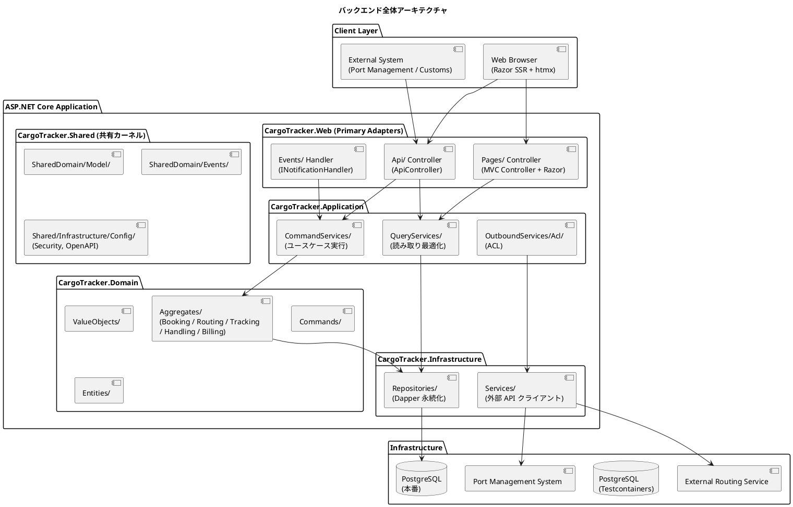
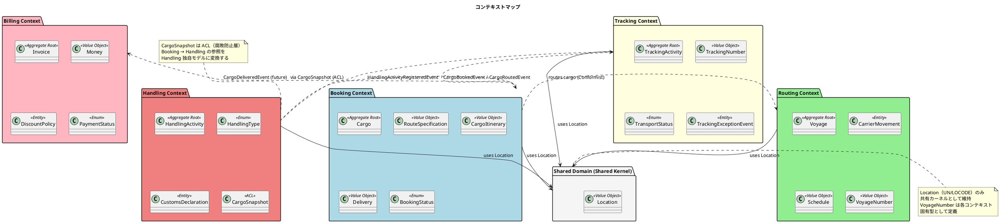
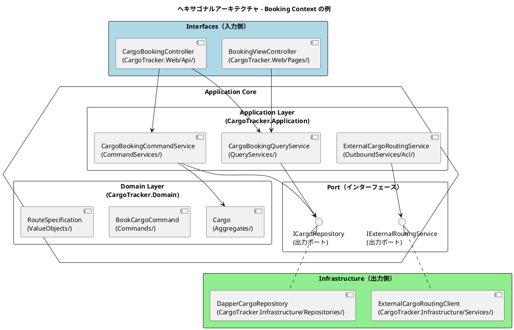
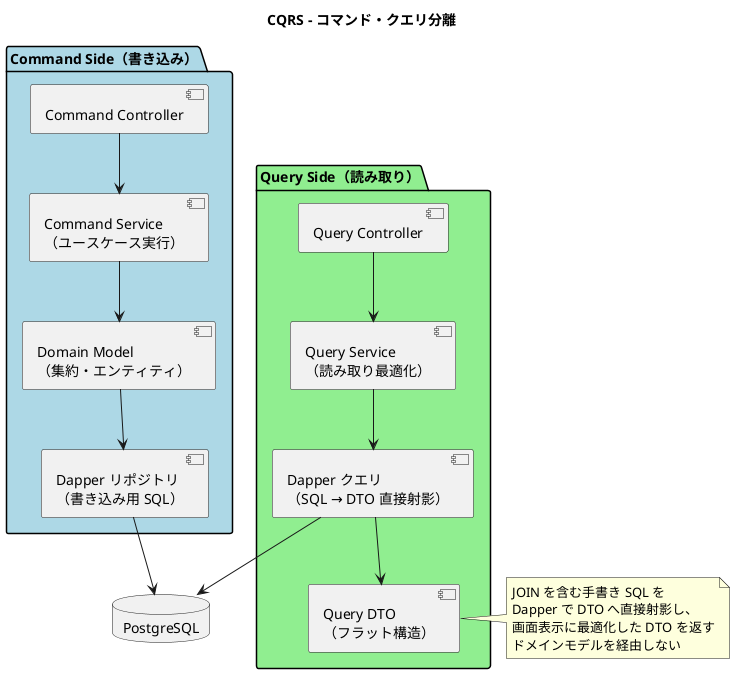
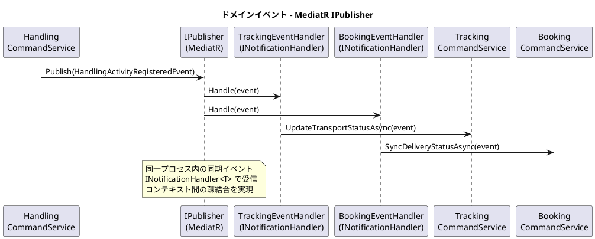
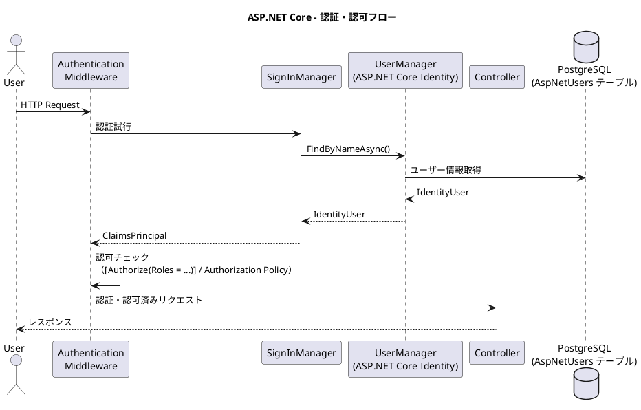
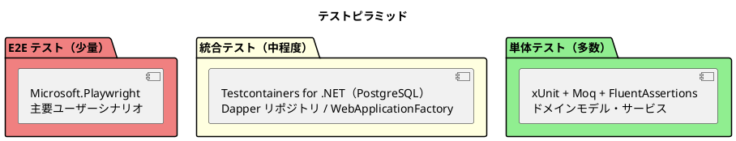

# バックエンドアーキテクチャ - 国際貨物輸送管理システム

## 概要

本ドキュメントでは、国際貨物輸送管理システムのバックエンドアーキテクチャを定義します。
Spring Boot 参考実装のアーキテクチャ思想（DDD・ヘキサゴナル・イベント駆動）を継承しつつ、
.NET 10 (LTS) / ASP.NET Core 10 を基盤とした現代的な実装に移植します。

## アーキテクチャパターン選択

### 業務領域カテゴリーの評価

| 評価軸 | 判定 | 根拠 |
| :--- | :--- | :--- |
| 業務領域カテゴリー | **中核の業務領域** | 国際貨物輸送は複雑なビジネスルール（通関、積み替え、例外処理）を持つ |
| データ構造の複雑さ | **複雑** | エンティティ間の関係が多く、コンテキスト間でデータを共有・変換する必要がある |
| 特殊要件 | **あり** | 金額を扱う（Billing Context）、監査記録が必要（荷役履歴）、状態遷移が厳密 |

### 選択したアーキテクチャパターン

上記評価から、以下の組み合わせを採用します。

- **ドメインモデル**: ビジネスルールをドメインオブジェクトにカプセル化し、手続き的なロジックを排除する
- **ポートとアダプター（ヘキサゴナルアーキテクチャ）**: ドメインを技術的関心事から独立させ、テスト容易性を確保する
- **CQRS（コマンドクエリ責務分離）**: Booking / Tracking の読み書き負荷特性の違いに対応し、クエリを読み取り最適化モデルで返す

Billing Context は `Money` 値オブジェクト（最小通貨単位の整数）による金額管理を行いますが、初期フェーズではイベントソーシングは適用しません。

## 全体アーキテクチャ



## 境界付けられたコンテキスト

### コンテキストマップ



### 各コンテキストの説明

#### 1. Booking Context（予約コンテキスト）

荷物予約の中核ロジックを担います。荷物の登録・経路割り当て・状態管理を責務とします。

| 要素 | 内容 |
| :--- | :--- |
| 集約ルート | `Cargo` |
| 主要概念 | `RouteSpecification`, `CargoItinerary`, `Delivery` |
| `BookingStatus` | `Preliminary` / `RouteProposed` / `Confirmed` / `TrackingIssued` / `InTransit` / `Delivered` / `Settled` / `Cancelled` |
| アクター | 荷主、営業担当者 |

#### 2. Routing Context（経路コンテキスト）

航路・運航スケジュールを管理します。外部経路システムとの統合を担います。

| 要素 | 内容 |
| :--- | :--- |
| 集約ルート | `Voyage` |
| 主要概念 | `CarrierMovement`, `Schedule`, `VoyageNumber` |
| アクター | 経路設計者、外部経路システム |

#### 3. Tracking Context（追跡コンテキスト）

荷物の現在状態・輸送ステータスを管理します。CQRS の読み取り側最適化が特に有効なコンテキストです。

| 要素 | 内容 |
| :--- | :--- |
| 集約ルート | `TrackingActivity` |
| 主要概念 | `TrackingNumber`, `TransportStatus`, `TrackingExceptionEvent` |
| `TransportStatus` | `NotReceived` / `Received` / `Loaded` / `InTransit` / `Unloaded` / `CustomsInspection` / `AwaitingClaim` / `Delivered` / `Misrouted` |
| アクター | 追跡管理者、荷主、荷受人 |

#### 4. Handling Context（荷役コンテキスト）

港湾・税関での荷役作業を記録します。`CargoSnapshot` ACL で Booking Context への依存を吸収します。

| 要素 | 内容 |
| :--- | :--- |
| 集約ルート | `HandlingActivity` |
| 主要概念 | `HandlingType`, `CustomsDeclaration`, `CargoSnapshot`（ACL） |
| アクター | 荷役作業員、港湾管理システム、税関 |

#### 5. Billing Context（請求コンテキスト）

運賃・請求書の管理を担います。`Money` 値オブジェクトで金額を厳密に管理します。

| 要素 | 内容 |
| :--- | :--- |
| 集約ルート | `Invoice` |
| 主要概念 | `Money`, `DiscountPolicy`, `PaymentStatus` |
| アクター | 経理担当者、荷主、決済機関 |

#### 6. Shared Domain（共有ドメイン）

`Location`（UN/LOCODE）のみ共有カーネルとして維持します。`VoyageNumber` は各コンテキスト固有型として定義し、共有しません。

## ヘキサゴナルアーキテクチャ（ポートとアダプター）



### レイヤー責務一覧

> Practical DDD のパッケージ構造を C# のプロジェクト・名前空間構成に読み替えて準拠します。

| レイヤー | プロジェクト / 名前空間 | 責務 | 依存方向 |
| :--- | :--- | :--- | :--- |
| **Domain** | `CargoTracker.Domain`（`Aggregates`, `ValueObjects`, `Commands`, `Entities`） | ビジネスルール・不変条件・集約・値オブジェクト・コマンド定義 | 外部に依存しない |
| **Application** | `CargoTracker.Application`（`CommandServices`, `QueryServices`, `OutboundServices.Acl`） | ユースケース実行・集約操作・ACL 経由の外部連携 | Domain のみ依存 |
| **Infrastructure** | `CargoTracker.Infrastructure`（`Repositories`, `Services`） | 永続化（Dapper 2.x + Npgsql による手書き SQL マッピング）・外部サービスクライアント | Application / Domain に依存 |
| **Interfaces** | `CargoTracker.Web`（`Api`, `Api.Dto`, `Api.Transform`, `Pages`, `Events`） | REST API Controller・DTO・DTO 変換・画面 Controller（Razor）・イベントハンドラ | Application に依存 |

### 名前空間構成例（Booking Context）

```
CargoTracker.Booking/
├── Domain/
│   └── Model/
│       ├── Aggregates/          集約ルート（Cargo, BookingId）
│       ├── Commands/            コマンド（BookCargoCommand, RouteCargoCommand）
│       ├── Entities/            エンティティ（Location）
│       └── ValueObjects/        値オブジェクト（RouteSpecification, Delivery, Leg 等）
├── Application/
│   └── Internal/
│       ├── CommandServices/     コマンドサービス（CargoBookingCommandService）
│       ├── QueryServices/       クエリサービス（CargoBookingQueryService）
│       └── OutboundServices/
│           └── Acl/             ACL（ExternalCargoRoutingService）
├── Infrastructure/
│   ├── Repositories/            リポジトリ実装（CargoRepository）
│   └── Services/                外部サービス実装（ExternalCargoRoutingClient）
└── Interfaces/
    ├── Api/                     REST Controller（CargoBookingController）
    │   ├── Dto/                 リクエスト / レスポンス DTO
    │   └── Transform/           DTO ⇔ コマンド変換（Assembler）
    ├── Pages/                   画面 Controller + Razor ビュー（BookingViewController）
    └── Events/                  イベントハンドラ（CargoBookedEventHandler）
```

## CQRS 設計



### CQRS 適用方針

- **コマンド側**: ドメインモデル（集約）を通じて状態変更します。不変条件の検証後、リポジトリ（Dapper + 手書き SQL）で永続化します
- **クエリ側**: 集約を経由せず、クエリサービスが Dapper で SQL を発行し画面表示用 DTO へ直接射影して返します
- **CQRS が特に有効なコンテキスト**: Booking（一覧・詳細の頻繁な参照）、Tracking（リアルタイム状態確認）

## イベント駆動設計



### ドメインイベント一覧

| イベント | 発生元コンテキスト | 処理先コンテキスト | 内容 |
| :--- | :--- | :--- | :--- |
| `CargoBookedEvent` | Booking | Tracking | 追跡番号の割り当てトリガー |
| `CargoRoutedEvent` | Booking | Tracking | 経路・旅程の確定をトラッキングに通知 |
| `HandlingActivityRegisteredEvent` | Handling | Tracking, Booking | 荷役作業登録 → 輸送ステータス同期 |
| `TrackingExceptionDetectedEvent` | Tracking | Booking, Notification | 例外検知 → 関係者への通知 |
| `InvoiceCreatedEvent` | Billing | Notification | 請求書発行 → 荷主への通知 |

### MediatR による実装方針

```csharp
// ドメインイベントの定義（INotification を実装した record）
public record HandlingActivityRegisteredEvent(HandlingActivity Activity) : INotification;

// 集約内でイベントを蓄積する（AggregateRoot 基底クラス。ADR-0002）
public class HandlingActivity : AggregateRoot
{
    public static HandlingActivity Register(RegisterHandlingCommand command)
    {
        var activity = new HandlingActivity(...);
        activity.AddDomainEvent(new HandlingActivityRegisteredEvent(activity));
        return activity;
    }
}

// Application Service は Unit of Work 経由で永続化し、
// コミット成功後に UoW が蓄積イベントを MediatR へディスパッチする（post-commit）
public class HandlingCommandService(IHandlingActivityRepository repository, IUnitOfWork uow)
{
    public async Task RegisterHandlingActivityAsync(RegisterHandlingCommand command, CancellationToken ct)
    {
        var activity = HandlingActivity.Register(command);
        uow.Track(activity);
        await repository.SaveAsync(activity, uow.Transaction);
        await uow.CommitAsync(ct);  // commit 成功後に HandlingActivityRegisteredEvent を発行
    }
}

// イベントハンドラ（Infrastructure/Events/ 名前空間）
public class TrackingEventHandler : INotificationHandler<HandlingActivityRegisteredEvent>
{
    private readonly TrackingCommandService _trackingCommandService;

    public TrackingEventHandler(TrackingCommandService trackingCommandService)
        => _trackingCommandService = trackingCommandService;

    public Task Handle(HandlingActivityRegisteredEvent notification, CancellationToken cancellationToken)
        => _trackingCommandService.UpdateTransportStatusAsync(notification, cancellationToken);
}
```

> **設計注意**: MediatR の `Publish` は呼び出し時点で同期的にハンドラを実行します。
> コミット前にハンドラが実行されるリスクを避けるため、上記の通り集約にドメインイベントを蓄積し、
> Unit of Work のトランザクション（`IDbTransaction`）コミット成功後にディスパッチします
> （post-commit ディスパッチ。詳細は ADR-0002 を参照）。
> コマンドサービスから `IPublisher` を直接呼び出すことは禁止します。
> 高可用性が必要なシステムへ移行する際は Transactional Outbox パターンへの移行を検討してください。

## Spring Boot → ASP.NET Core 移行マッピング

| Spring Boot 技術 | ASP.NET Core 移行先 | 移行ポイント |
| :--- | :--- | :--- |
| Spring DI（`@Autowired` / `@Component`） | Microsoft.Extensions.DependencyInjection（`AddScoped` / `AddSingleton`） | コンポーネントスキャンではなく `Program.cs` での明示的な登録。コンストラクタインジェクションを優先する |
| Spring MVC（`@RestController`, `@GetMapping`） | ASP.NET Core MVC（`[ApiController]`, `[HttpGet]`） | エンドポイント定義の属性変更 |
| Spring イベント（`ApplicationEventPublisher.publishEvent()`） | MediatR（`IPublisher.Publish()`） | 同期イベントはほぼ等価。同一プロセス内通信。`@TransactionalEventListener(AFTER_COMMIT)` 相当は post-commit ディスパッチで実現する |
| Spring Data JPA / Hibernate | **Dapper + Npgsql** | O/R マッピングから SQL 明示管理への移行。リポジトリ実装が手書き SQL を発行し、ドメインモデルを永続化属性から完全に独立させる |
| Bean Validation（`@Valid`） | DataAnnotations + FluentValidation | DTO には DataAnnotations、複雑なルールは FluentValidation で定義 |
| Spring Security | ASP.NET Core Identity + Cookie 認証 | フォームベース認証・RBAC を ASP.NET Core Identity で実装 |
| Thymeleaf | Razor ビュー（cshtml） | フラグメントはパーシャルビュー / ViewComponent に対応 |
| Flyway | DbUp | バージョン付き SQL スクリプトによる forward-only マイグレーション（Flyway と同思想） |
| Bean スコープ（`singleton` / `request`） | `AddSingleton` / `AddScoped` | DI コンテナのライフタイム管理として同等の思想 |
| `@Transactional` | ADO.NET トランザクション（`IDbTransaction` / Unit of Work） | 1 ユースケース = 1 トランザクションを原則とする |
| Spring Boot Actuator | ASP.NET Core Health Checks | `/health` エンドポイントによる Liveness / Readiness 検査 |

## プロジェクト構造

```
apps/cargo-tracker/src/CargoTracker.Web/          # ASP.NET Core ホスト（CargoTracker.sln）
└── （Api / Pages / Events / Program.cs）

名前空間ルート: CargoTracker
├── Booking/
│   ├── Domain/
│   │   ├── Model/             # Booking 集約、BookingId、CargoSpecification、BookingStatus 等
│   │   ├── Events/            # BookingRegisteredEvent, IDomainEvent
│   │   └── Repositories/      # IBookingRepository（出力ポート）
│   ├── Application/
│   │   └── Internal/
│   │       ├── CommandServices/   # RegisterBookingCommandService
│   │       ├── QueryServices/     # FindBookingQueryService
│   │       └── OutboundServices/  # IShipperExistencePort / ACL Adapter
│   └── Infrastructure/
│       ├── Repositories/      # BookingRepository, BookingEntityConfiguration
│       ├── Brokers/           # BookingEventHandler
│       └── Config/            # DevelopmentBookingSeedConfiguration
├── Shipper/
│   ├── Domain/
│   │   ├── Model/             # Shipper 集約、ShipperName、ContactInfo 等
│   │   ├── Events/            # ShipperRegisteredEvent
│   │   └── Repositories/      # IShipperRepository（出力ポート）
│   ├── Application/
│   │   └── Internal/
│   │       ├── CommandServices/   # RegisterShipperCommandService
│   │       └── QueryServices/     # FindShipperQueryService
│   └── Infrastructure/
│       ├── Repositories/      # ShipperRepository, ShipperEntityConfiguration
│       └── Config/            # DevelopmentShipperSeedConfiguration
├── Routing/                   # プレースホルダのみ（将来実装予定）
├── Tracking/                  # プレースホルダのみ（将来実装予定）
├── Handling/                  # プレースホルダのみ（将来実装予定）
├── Billing/                   # プレースホルダのみ（将来実装予定）
└── Shared/
    ├── Domain/
    │   └── Model/             # 共有 ID 型（ShipperId など）
    └── Infrastructure/
        ├── Config/            # SecurityConfig, OpenApiConfig
        └── Web/               # HomeController
```

> スキーマ管理は DbUp で行い、バージョン付き SQL スクリプト（`Scripts/0001_xxx.sql`）をアプリケーション起動時または CI/CD から適用します。
> ログは Serilog、ヘルスチェックは ASP.NET Core Health Checks（`/health`）で提供します。

## API 設計方針

### REST API 設計原則

| 原則 | 内容 |
| :--- | :--- |
| **リソース指向** | URL はリソースを表す名詞。動詞は HTTP メソッドで表現する |
| **バージョニング** | `/api/v1/` プレフィックスでバージョンを管理する |
| **レスポンス形式** | JSON。エラーレスポンスは `{ "code": "BOOKING_NOT_FOUND", "message": "..." }` 形式 |
| **ステータスコード** | 成功: 200/201/204、クライアントエラー: 400/404/409、サーバーエラー: 500 |
| **HATEOAS** | 初期フェーズでは適用しない |

### 主要エンドポイント（例）

| メソッド | パス | 説明 |
| :--- | :--- | :--- |
| `POST` | `/api/v1/bookings` | 貨物予約の登録 |
| `GET` | `/api/v1/bookings/{bookingId}` | 予約詳細の取得 |
| `PUT` | `/api/v1/bookings/{bookingId}/route` | 経路の割り当て |
| `GET` | `/api/v1/tracking/{trackingNumber}` | 追跡情報の取得 |
| `POST` | `/api/v1/handling` | 荷役作業の登録 |
| `GET` | `/api/v1/voyages` | 航路一覧の取得 |

## セキュリティ設計

### ASP.NET Core Identity による認証・認可



### ロール設計

| ロール | 権限 | 対象ユーザー |
| :--- | :--- | :--- |
| `Shipper` | 予約照会・追跡照会 | 荷主 |
| `Sales` | 予約登録・経路割り当て | 営業担当者 |
| `Handler` | 荷役作業登録 | 荷役作業員 |
| `Tracker` | 追跡情報管理・例外対応 | 追跡管理者 |
| `Accountant` | 請求書管理 | 経理担当者 |
| `Admin` | 全機能 | システム管理者 |

## テスト戦略



### 各層のテスト方針

| テスト対象 | テスト種別 | 使用技術 | 方針 |
| :--- | :--- | :--- | :--- |
| ドメインモデル（集約・値オブジェクト） | 単体テスト | xUnit, FluentAssertions | 依存なし。ビジネスルールを網羅的にテスト |
| Application Service | 単体テスト | xUnit, Moq | リポジトリをモック化。ユースケースのフローをテスト |
| Dapper リポジトリ | 統合テスト | Testcontainers for .NET, PostgreSQL | 実 DB への SQL を検証。スキーマを DbUp で適用 |
| REST Controller | 統合テスト | `WebApplicationFactory<Program>` | エンドポイントの入出力・バリデーションをテスト |
| E2E | E2E テスト | Microsoft.Playwright | 主要ユーザーシナリオ（予約 → 追跡 → 配達）を検証 |
