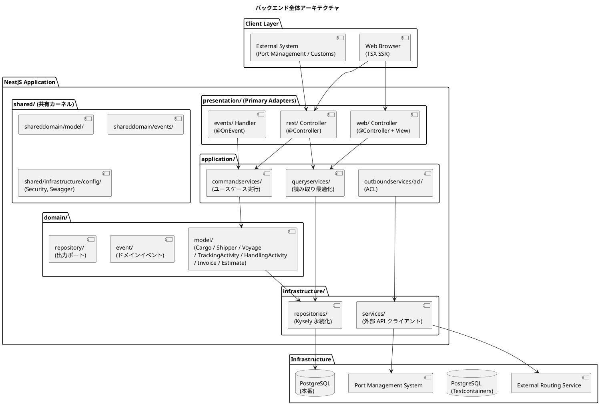
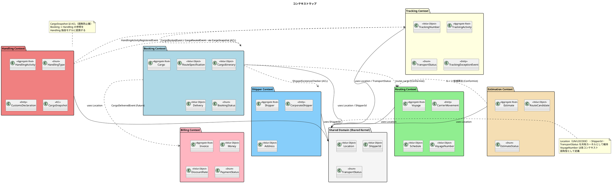
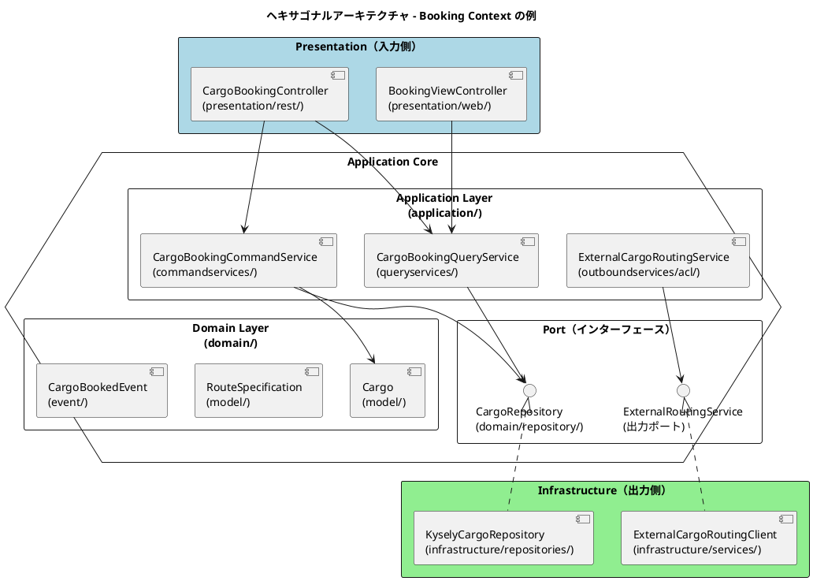
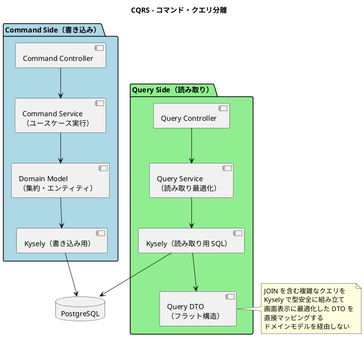
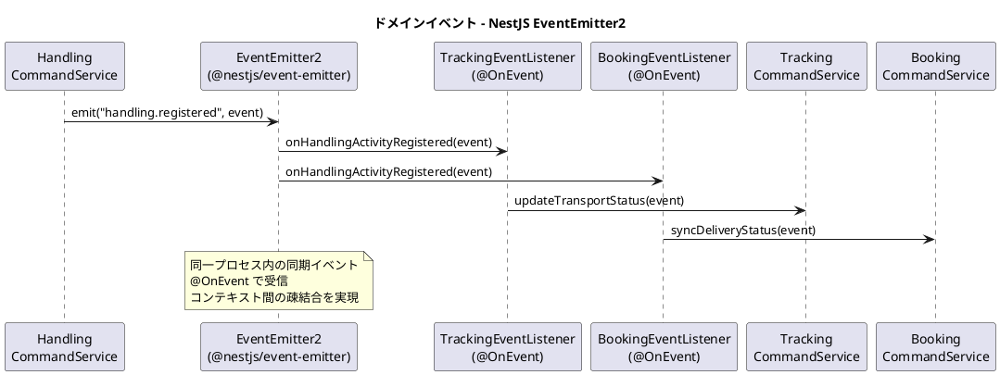
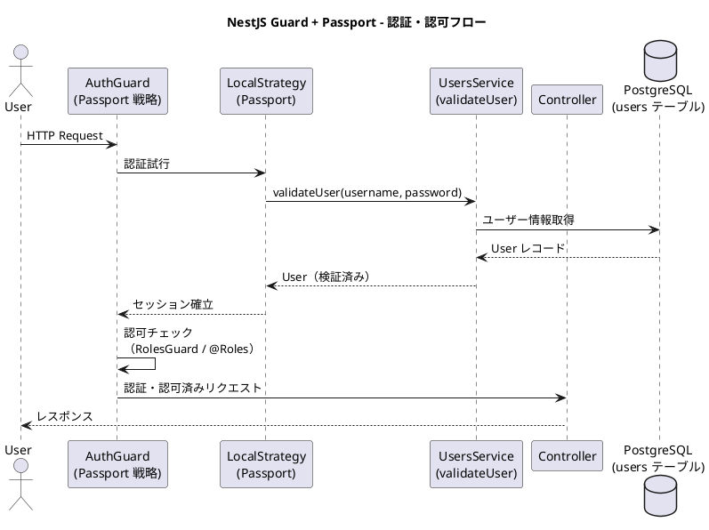
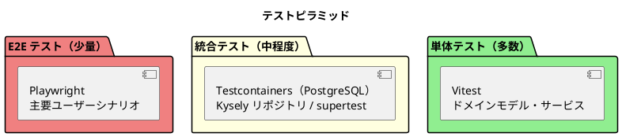

# バックエンドアーキテクチャ - 国際貨物輸送管理システム

## 概要

本ドキュメントでは、国際貨物輸送管理システムのバックエンドアーキテクチャを定義する。
Java / Spring Boot 版設計のアーキテクチャ思想（DDD・ヘキサゴナル・イベント駆動）を継承しつつ、
Node.js 24.18 LTS / TypeScript 5.x / NestJS 11 を基盤とした現代的な実装に移植する。

## アーキテクチャパターン選択

### 業務領域カテゴリーの評価

| 評価軸 | 判定 | 根拠 |
| :--- | :--- | :--- |
| 業務領域カテゴリー | **中核の業務領域** | 国際貨物輸送は複雑なビジネスルール（通関、積み替え、例外処理）を持つ |
| データ構造の複雑さ | **複雑** | エンティティ間の関係が多く、コンテキスト間でデータを共有・変換する必要がある |
| 特殊要件 | **あり** | 金額を扱う（Billing Context）、監査記録が必要（荷役履歴）、状態遷移が厳密 |

### 選択したアーキテクチャパターン

上記評価から、以下の組み合わせを採用する。

- **ドメインモデル**: ビジネスルールをドメインオブジェクトにカプセル化し、手続き的なロジックを排除する
- **ポートとアダプター（ヘキサゴナルアーキテクチャ）**: ドメインを技術的関心事から独立させ、テスト容易性を確保する
- **CQRS（コマンドクエリ責務分離）**: Booking / Tracking の読み書き負荷特性の違いに対応し、クエリを読み取り最適化モデルで返す

Billing Context は `MoneyAmount` 値オブジェクトによる金額管理を行うが、初期フェーズではイベントソーシングは適用しない。

## 全体アーキテクチャ



## 境界付けられたコンテキスト

### コンテキストマップ



> **正典**: 境界付けられたコンテキストと集約の定義は [ドメインモデル設計](domain-model.md) を正典とし、本書はそれに従う。
> システムは Booking / Shipper / Routing / Tracking / Handling / Billing / Estimation の 7 コンテキストと共有カーネル（Shared Domain）で構成される。

### 各コンテキストの説明

#### 1. Booking Context（予約コンテキスト）

荷物予約の中核ロジックを担う。荷物の登録・経路割り当て・状態管理を責務とする。

| 要素 | 内容 |
| :--- | :--- |
| 集約ルート | `Cargo` |
| 主要概念 | `RouteSpecification`, `CargoItinerary`, `Delivery` |
| `BookingStatus` | `PRELIMINARY` / `ROUTE_PROPOSED` / `CONFIRMED` / `TRACKING_ISSUED` / `IN_TRANSIT` / `DELIVERED` / `SETTLED` / `CANCELLED` |
| アクター | 荷主、営業担当者 |

#### 2. Shipper Context（荷主コンテキスト）

荷主の登録・管理・法人割引を担う。Booking Context から `ShipperExistenceChecker` ACL 経由で存在確認される。

| 要素 | 内容 |
| :--- | :--- |
| 集約ルート | `Shipper` |
| 主要概念 | `CorporateShipper`, `Address`, `ShipperId`（共有カーネル） |
| アクター | 荷主、営業担当者 |

#### 3. Routing Context（経路コンテキスト）

航路・運航スケジュールを管理する。外部経路システムとの統合を担う。

| 要素 | 内容 |
| :--- | :--- |
| 集約ルート | `Voyage` |
| 主要概念 | `CarrierMovement`, `Schedule`, `VoyageNumber` |
| アクター | 経路設計者、外部経路システム |

#### 4. Tracking Context（追跡コンテキスト）

荷物の現在状態・輸送ステータスを管理する。CQRS の読み取り側最適化が特に有効なコンテキスト。

| 要素 | 内容 |
| :--- | :--- |
| 集約ルート | `TrackingActivity` |
| 主要概念 | `TrackingNumber`, `TransportStatus`, `TrackingExceptionEvent` |
| `TransportStatus` | `NOT_RECEIVED` / `RECEIVED` / `LOADED` / `IN_TRANSIT` / `UNLOADED` / `CUSTOMS_INSPECTION` / `AWAITING_CLAIM` / `DELIVERED` / `MISROUTED` |
| アクター | 追跡管理者、荷主、荷受人 |

#### 5. Handling Context（荷役コンテキスト）

港湾・税関での荷役作業を記録する。`CargoSnapshot` ACL で Booking Context への依存を吸収する。

| 要素 | 内容 |
| :--- | :--- |
| 集約ルート | `HandlingActivity` |
| 主要概念 | `HandlingType`, `CustomsDeclaration`, `CargoSnapshot`（ACL） |
| アクター | 荷役作業員、港湾管理システム、税関 |

#### 6. Billing Context（精算コンテキスト）

運賃・請求書の管理を担う。`Money` 値オブジェクトで金額を厳密に管理する。

| 要素 | 内容 |
| :--- | :--- |
| 集約ルート | `Invoice` |
| 主要概念 | `Money`, `DiscountRate`, `PaymentStatus` |
| アクター | 経理担当者、荷主、決済機関 |

#### 7. Estimation Context（見積コンテキスト）

輸送見積の作成・ルート候補の管理を担う。Routing Context を参照してルート候補を算出する。

| 要素 | 内容 |
| :--- | :--- |
| 集約ルート | `Estimate` |
| 主要概念 | `RouteCandidate`, `EstimateStatus`, `CargoType` |
| アクター | 営業担当者、荷主 |

#### 8. Shared Domain（共有ドメイン）

`Location`（UN/LOCODE）・`ShipperId`・`TransportStatus` を共有カーネルとして維持する。`VoyageNumber` は各コンテキスト固有型として定義し、共有しない。

## ヘキサゴナルアーキテクチャ（ポートとアダプター）



### レイヤー責務一覧

> Practical DDD in Enterprise Java (Chapter 3) のパッケージ構造を TypeScript のディレクトリ構造に準拠して移植する。

| レイヤー | ディレクトリ | 責務 | 依存方向 |
| :--- | :--- | :--- | :--- |
| **Domain** | `domain/model/`, `domain/event/`, `domain/repository/` | ビジネスルール・不変条件・集約・値オブジェクト・ドメインイベント・リポジトリ出力ポート | 外部に依存しない |
| **Application** | `application/commandservices/`, `application/queryservices/`, `application/outboundservices/acl/` | ユースケース実行・集約操作・ACL 経由の外部連携 | Domain のみ依存 |
| **Infrastructure** | `infrastructure/repositories/`, `infrastructure/services/` | 永続化（Kysely）・外部サービスクライアント | Application / Domain に依存 |
| **Presentation** | `presentation/rest/`, `presentation/rest/dto/`, `presentation/rest/transform/`, `presentation/web/`, `presentation/events/` | REST API Controller・DTO・DTO 変換・画面 Controller・イベントハンドラ | Application に依存 |

### ディレクトリ構成例（Booking Context）

```
apps/cargo-tracker/src/contexts/booking/
├── domain/
│   ├── model/               集約ルート・エンティティ・値オブジェクト（Cargo, RouteSpecification, CargoItinerary, Delivery, Leg, BookingStatus 等）
│   ├── event/               ドメインイベント（CargoBookedEvent, CargoRoutedEvent）
│   └── repository/          リポジトリ出力ポート（CargoRepository）
├── application/
│   ├── commandservices/     コマンドサービス（CargoBookingCommandService）
│   ├── queryservices/       クエリサービス（CargoBookingQueryService）
│   └── outboundservices/
│       └── acl/             ACL（ExternalCargoRoutingService）
├── infrastructure/
│   ├── repositories/        リポジトリ実装（KyselyCargoRepository）
│   └── services/            外部サービス実装（ExternalCargoRoutingClient）
└── presentation/
    ├── rest/                REST Controller（CargoBookingController）
    │   ├── dto/             リクエスト / レスポンス DTO
    │   └── transform/       DTO ⇔ コマンド変換（Assembler）
    ├── web/                 画面 Controller（BookingViewController）
    └── events/              イベントハンドラ（CargoBookedEventHandler）
```

## CQRS 設計



### CQRS 適用方針

- **コマンド側**: ドメインモデル（集約）を通じて状態変更。不変条件の検証後、Kysely で永続化する
- **クエリ側**: ドメインモデルを経由せず、Kysely で JOIN クエリを型安全に記述し、画面表示用 DTO を返す
- **CQRS が特に有効なコンテキスト**: Booking（一覧・詳細の頻繁な参照）、Tracking（リアルタイム状態確認）

## イベント駆動設計



### ドメインイベント一覧

| イベント | 発生元コンテキスト | 処理先コンテキスト | 内容 |
| :--- | :--- | :--- | :--- |
| `CargoBookedEvent` | Booking | Tracking | 追跡番号の割り当てトリガー |
| `CargoRoutedEvent` | Booking | Tracking | 経路・旅程の確定をトラッキングに通知 |
| `HandlingActivityRegisteredEvent` | Handling | Tracking, Booking | 荷役作業登録 → 輸送ステータス同期 |
| `TrackingExceptionDetectedEvent` | Tracking | Booking, Notification | 例外検知 → 関係者への通知 |
| `InvoiceCreatedEvent` | Billing | Notification | 請求書発行 → 荷主への通知 |

### NestJS EventEmitter の実装方針

```typescript
// ドメインイベントの発行（Application Service 内）
@Injectable()
export class HandlingCommandService {
  constructor(private readonly eventEmitter: EventEmitter2) {}

  async registerHandlingActivity(command: RegisterHandlingCommand): Promise<void> {
    // ドメインロジック実行後にイベント発行
    this.eventEmitter.emit(
      "handling.registered",
      new HandlingActivityRegisteredEvent(activity),
    );
  }
}

// イベントリスナー（presentation/events/ ディレクトリ）
@Injectable()
export class TrackingEventListener {
  constructor(private readonly trackingCommandService: TrackingCommandService) {}

  @OnEvent("handling.registered")
  async onHandlingActivityRegistered(event: HandlingActivityRegisteredEvent): Promise<void> {
    await this.trackingCommandService.updateTransportStatus(event);
  }
}
```

> **設計注意**: `EventEmitter2` はデフォルトで同期的にリスナーを実行するため、
> トランザクションのコミット前にリスナーが実行されるリスクがある。
> コミット後の実行を保証するため、ドメインイベントはトランザクション完了後に発行するか、
> トランザクション境界（`Kysely` の `transaction()`）の外でイベントを emit する方針とする。
> 高可用性が必要なシステムへ移行する際は Transactional Outbox パターンへの移行を検討すること。

## Spring → NestJS 移行マッピング

| Spring 技術 | NestJS 移行先 | 移行ポイント |
| :--- | :--- | :--- |
| Spring DI（`@Autowired`, `@Component`, `@Service`） | NestJS DI（`@Injectable`, Provider, Module) | デコレータとモジュール登録に置換。コンストラクタインジェクションを優先する |
| Spring MVC（`@RestController`, `@GetMapping`） | NestJS Controller（`@Controller`, `@Get`） | エンドポイント定義のデコレータ変更 |
| Spring Events（`ApplicationEventPublisher.publishEvent()`） | `EventEmitter2.emit()`（@nestjs/event-emitter） | 同期イベントはほぼ等価。同一プロセス内通信。`@TransactionalEventListener(AFTER_COMMIT)` 相当はコミット後 emit で実現 |
| MyBatis（XML マッパー） | **Kysely**（型安全な SQL ビルダー） | 明示的な SQL 管理の方針は共通。SQL を XML ではなく型付きクエリビルダーで記述 |
| Bean Validation（`@Valid` + Hibernate Validator） | class-validator（`class-validator` + `ValidationPipe`） | DTO にデコレータでバリデーション定義。NestJS の `ValidationPipe` で適用 |
| Spring Security | NestJS Guard + Passport | セッションベース認証・RBAC を Guard と Passport 戦略で実装 |
| `@Component`（シングルトン） | Provider（シングルトンがデフォルト） | スコープ管理の思想は共通 |
| `@Transactional` | Kysely `transaction()` コールバック | 宣言的トランザクションを明示的なトランザクション境界に置換 |

## ディレクトリ構造

```
apps/cargo-tracker/src/
├── contexts/
│   ├── booking/
│   │   ├── domain/
│   │   │   ├── model/             # Cargo 集約、RouteSpecification、CargoItinerary、Delivery、Leg、BookingStatus 等
│   │   │   ├── event/             # CargoBookedEvent, CargoRoutedEvent, DomainEvent
│   │   │   └── repository/        # CargoRepository（出力ポートインターフェース）
│   │   ├── application/
│   │   │   ├── commandservices/   # CargoBookingCommandService
│   │   │   ├── queryservices/     # CargoBookingQueryService
│   │   │   └── outboundservices/  # ShipperExistenceChecker / ACL Adapter
│   │   ├── infrastructure/
│   │   │   ├── repositories/      # KyselyCargoRepository, CargoRecord
│   │   │   ├── brokers/           # CargoBookedEventHandler
│   │   │   └── config/            # DefaultProfileBookingSeed
│   │   ├── presentation/          # Controller, DTO, View
│   │   └── booking.module.ts      # NestJS モジュール定義（配線）
│   ├── shipper/
│   │   ├── domain/
│   │   │   ├── model/             # Shipper 集約、CorporateShipper、Address 等
│   │   │   ├── event/             # ShipperRegisteredEvent
│   │   │   └── repository/        # ShipperRepository（出力ポートインターフェース）
│   │   ├── application/
│   │   │   ├── commandservices/   # RegisterShipperCommandService
│   │   │   └── queryservices/     # FindShipperQueryService
│   │   ├── infrastructure/
│   │   │   ├── repositories/      # KyselyShipperRepository, ShipperRecord
│   │   │   └── config/            # DefaultProfileShipperSeed
│   │   ├── presentation/
│   │   └── shipper.module.ts
│   ├── routing/                   # domain/{model,event,repository}, application, infrastructure, presentation（将来実装予定）
│   ├── tracking/                  # domain/{model,event,repository}, application, infrastructure, presentation（将来実装予定）
│   ├── handling/                  # domain/{model,event,repository}, application, infrastructure, presentation（将来実装予定）
│   ├── billing/                   # domain/{model,event,repository}, application, infrastructure, presentation（将来実装予定）
│   └── estimation/                # domain/{model,event,repository}, application, infrastructure, presentation（将来実装予定）
├── shared/
│   ├── domain/
│   │   └── model/                 # 共有カーネル（Location, ShipperId, TransportStatus）
│   └── infrastructure/
│       ├── config/                # SecurityConfig, SwaggerConfig
│       ├── web/                   # HomeController
│       └── database/              # Kysely インスタンス、型定義
├── app.module.ts                  # ルートモジュール（合成ルート）
└── main.ts                        # エントリポイント
```

## API 設計方針

### REST API 設計原則

| 原則 | 内容 |
| :--- | :--- |
| **リソース指向** | URL はリソースを表す名詞。動詞は HTTP メソッドで表現する |
| **バージョニング** | `/api/v1/` プレフィックスでバージョンを管理する |
| **レスポンス形式** | JSON。エラーレスポンスは `{ "code": "BOOKING_NOT_FOUND", "message": "..." }` 形式 |
| **ステータスコード** | 成功: 200/201/204、クライアントエラー: 400/404/409、サーバーエラー: 500 |
| **HATEOAS** | 初期フェーズでは適用しない |

### 主要エンドポイント（例）

| メソッド | パス | 説明 |
| :--- | :--- | :--- |
| `POST` | `/api/v1/bookings` | 貨物予約の登録 |
| `GET` | `/api/v1/bookings/{bookingId}` | 予約詳細の取得 |
| `PUT` | `/api/v1/bookings/{bookingId}/route` | 経路の割り当て |
| `GET` | `/api/v1/tracking/{trackingNumber}` | 追跡情報の取得 |
| `POST` | `/api/v1/handling` | 荷役作業の登録 |
| `GET` | `/api/v1/voyages` | 航路一覧の取得 |

## セキュリティ設計

### NestJS Guard + Passport による認証・認可



### ロール設計

| ロール | 権限 | 対象ユーザー |
| :--- | :--- | :--- |
| `ROLE_SHIPPER` | 予約照会・追跡照会 | 荷主 |
| `ROLE_SALES` | 予約登録・経路割り当て | 営業担当者 |
| `ROLE_ROUTE_DESIGNER` | 経路割り当て・航路管理 | 経路設計者 |
| `ROLE_TRACKER` | 追跡情報管理・例外対応 | 追跡管理者 |
| `ROLE_HANDLER` | 荷役作業登録 | 荷役作業員 |
| `ROLE_BILLING` | 請求書管理 | 経理担当者 |

## テスト戦略



### 各層のテスト方針

| テスト対象 | テスト種別 | 使用技術 | 方針 |
| :--- | :--- | :--- | :--- |
| ドメインモデル（集約・値オブジェクト） | 単体テスト | Vitest | 依存なし。ビジネスルールを網羅的にテスト |
| Application Service | 単体テスト | Vitest（`vi.fn` モック） | リポジトリをモック化。ユースケースのフローをテスト |
| Kysely リポジトリ | 統合テスト | Testcontainers（PostgreSQL） | 実 DB への SQL を検証。スキーマを node-pg-migrate で適用 |
| REST Controller | 統合テスト | supertest | エンドポイントの入出力・バリデーションをテスト |
| E2E | E2E テスト | Playwright | 主要ユーザーシナリオ（予約 → 追跡 → 配達）を検証 |
