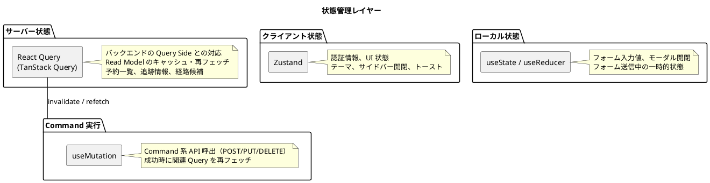

# フロントエンドアーキテクチャ設計

## 概要

バックエンドのマイクロサービス群（Axon Framework ベースの CQRS / Event Sourcing アーキテクチャ）が提供する REST API を消費する SPA（Single Page Application）を構築する。主な利用者は営業担当者・経路設計者・追跡管理者・荷役作業員・経理担当者であり、社内業務ツール・ダッシュボードとしての性質が強いため、SEO よりもインタラクティビティを優先する。

バックエンドが CQRS で設計されているため、フロントエンドも **Command（書き込み）と Query（読み取り）を明確に分離した API クライアント** とし、結果整合性に対する UX 対応（楽観的更新、コマンド受付後の Read Model 反映確認、ポーリング・再フェッチ）を一貫して行う。

## アーキテクチャ決定

### レンダリング戦略

| 判断項目 | 判定 | 理由 |
| :--- | :--- | :--- |
| SEO 重要度 | 低 | 社内業務ツール。追跡照会は時限署名トークン経由のため SEO 不要 |
| インタラクティビティ | 高 | リアルタイム追跡、フォーム操作が中心 |
| 更新頻度 | 高 | 追跡情報はリアルタイム更新 |

**選定結果**: React SPA

### 状態管理

| 判断項目 | 判定 | 理由 |
| :--- | :--- | :--- |
| 状態管理複雑性 | 中程度 | サーバー状態（API データ）が中心 |
| 更新頻度 | 高 | 追跡情報のポーリングや Read Model 反映確認 |
| 共有範囲 | 中 | 画面間でのデータ共有は限定的 |

**選定結果**: React Query（サーバー状態）+ Zustand（クライアント状態）

> **CQRS との整合**: React Query の `queryKey` をバックエンドの Query 名（例: `cargoSummary`、`listCargoSummaries`）と対応付ける。Command 送信後は `queryClient.invalidateQueries()` で関連 Query を再フェッチし、Read Model の最新化を待つ。

### スタイリング

| 判断項目 | 判定 | 理由 |
| :--- | :--- | :--- |
| パフォーマンス | 中 | 頻繁なレンダリングはあるが極端ではない |
| 開発速度 | 重視 | ユーティリティクラスで迅速にスタイル適用 |

**選定結果**: Tailwind CSS

## プロジェクト構造

中規模プロジェクトとして、フィーチャーベースの構造を採用する。

```text
src/
├── components/              # (1) 共通 UI コンポーネント
│   ├── ui/                  # 基本 UI パーツ（Button, Input, Modal, Table）
│   └── layout/              # レイアウトコンポーネント（Header, Sidebar）
├── config/                  # (2) アプリケーション設定
│   ├── constants.ts         # 定数定義（UN/LOCODE, ステータス等）
│   ├── env.ts               # 環境変数管理
│   └── api.ts               # API エンドポイント定義
├── features/                # (3) フィーチャー単位のコンポーネント
│   ├── booking/             # 貨物予約（UC01-04, UC11-12）
│   │   ├── api/             # Command / Query クライアント
│   │   ├── components/
│   │   ├── hooks/
│   │   └── types/
│   ├── routing/             # 経路設計・航海スケジュール（UC05-10, UC19）
│   │   ├── api/
│   │   ├── components/
│   │   ├── hooks/
│   │   └── types/
│   ├── tracking/            # 追跡・荷役・例外（UC13-16）
│   │   ├── api/
│   │   ├── components/
│   │   ├── hooks/
│   │   └── types/
│   ├── billing/             # 精算（UC17, UC18）
│   │   ├── api/
│   │   ├── components/
│   │   ├── hooks/
│   │   └── types/
│   └── auth/                # 認証
│       ├── api/
│       ├── components/
│       ├── hooks/
│       └── types/
├── layouts/                 # (4) アプリケーションレイアウト
│   ├── AppLayout.tsx
│   ├── AuthLayout.tsx
│   └── DashboardLayout.tsx
├── lib/                     # (5) 外部ライブラリ設定
│   ├── api-client.ts        # fetch ラッパー（commands / queries 分離）
│   └── auth.ts              # 認証ライブラリ設定
├── pages/                   # (6) ページコンポーネント
│   ├── BookingPage.tsx
│   ├── RoutingPage.tsx
│   ├── TrackingPage.tsx
│   ├── BillingPage.tsx
│   └── LoginPage.tsx
├── providers/               # (7) Context Provider
│   ├── AuthProvider.tsx
│   └── AppProviders.tsx
├── stores/                  # (8) 状態管理（Zustand）
│   ├── authStore.ts
│   └── uiStore.ts
├── types/                   # (9) TypeScript 型定義
│   ├── api.ts               # API 型定義（Command / Query DTO）
│   └── common.ts            # 共通型定義
└── utils/                   # (10) 汎用ユーティリティ
    ├── format.ts            # フォーマット関数
    └── validation.ts        # バリデーション
```

### フィーチャー内の Command / Query 分離

各フィーチャーの `api/` ディレクトリで Command 系と Query 系を明確に分離する。

```text
features/booking/api/
├── commands.ts              # 書き込み系 API（POST/PUT/DELETE）
│                            # bookCargo, assignRouteToCargo, changeDestination, ...
├── queries.ts               # 読み取り系 API（GET）
│                            # getCargoSummary, listCargoSummaries, ...
└── index.ts                 # 再エクスポート
```

## コンポーネント設計

### Container / Presentational パターン

```tsx
// Container: ロジック担当
// features/booking/components/BookingListContainer.tsx
export function BookingListContainer() {
  const { data: bookings, isLoading } = useBookings();
  const bookCargo = useBookCargo();

  const handleCreate = useCallback((data: BookCargoCommand) => {
    bookCargo.mutate(data);
  }, [bookCargo]);

  return (
    <BookingList
      bookings={bookings ?? []}
      loading={isLoading}
      submitting={bookCargo.isPending}
      onCreate={handleCreate}
    />
  );
}

// Presentational: UI 担当
// features/booking/components/BookingList.tsx
interface Props {
  bookings: CargoSummary[];
  loading: boolean;
  submitting: boolean;
  onCreate: (data: BookCargoCommand) => void;
}

export function BookingList({ bookings, loading, submitting, onCreate }: Props) {
  if (loading) return <LoadingSpinner />;
  return (
    <div>
      {bookings.map(booking =>
        <BookingItem key={booking.bookingId} data={booking} />
      )}
      <CreateButton disabled={submitting} onClick={onCreate} />
    </div>
  );
}
```

### Custom Hooks パターン（Query / Command）

```tsx
// features/booking/hooks/useBookings.ts （Query）
export function useBookings() {
  return useQuery({
    queryKey: ['bookings', 'list'],
    queryFn: () => bookingApi.listCargoSummaries(),
  });
}

// features/booking/hooks/useBookCargo.ts （Command）
export function useBookCargo() {
  const queryClient = useQueryClient();
  return useMutation({
    mutationFn: (command: BookCargoCommand) => bookingApi.bookCargo(command),
    onSuccess: () => {
      // Command 完了後、関連 Query を再フェッチして Read Model の最新化を待つ
      queryClient.invalidateQueries({ queryKey: ['bookings'] });
    },
  });
}

// features/tracking/hooks/useTracking.ts （Query + ポーリング）
export function useTracking(trackingNumber: string) {
  return useQuery({
    queryKey: ['tracking', trackingNumber],
    queryFn: () => trackingApi.getTracking(trackingNumber),
    refetchInterval: 30_000, // 30 秒ごとに Read Model から最新を取得
  });
}
```

### 結果整合性への UX 対応

Axon の Event Sourcing + Projection は **結果整合性** で Read Model が更新される。フロントエンドでは次のいずれかで吸収する。

| 戦略 | 用途 | 実装 |
| :--- | :--- | :--- |
| **invalidate + refetch** | 一般的なフォーム送信 | Command 成功時に `invalidateQueries` で再フェッチ |
| **楽観的更新（Optimistic UI）** | 即時応答が重要な操作 | `useMutation` の `onMutate` で楽観的に Query を更新し、`onError` でロールバック |
| **ポーリング** | リアルタイム性が必要な追跡画面 | `refetchInterval` で一定間隔再取得 |
| **コマンド受領通知 + 後追い確認** | 重い処理 | 202 Accepted + Query で完了確認 |
| **Server-Sent Events**（将来） | リアルタイム配信 | Tracking Service が SSE で Event を流す（次フェーズで検討） |

## 状態管理戦略



## 画面構成

### 主要画面一覧

| 画面 | パス | 対応 UC | 利用者 | 主な API |
| :--- | :--- | :--- | :--- | :--- |
| ログイン | /login | - | 全ユーザー | `POST /api/v1/auth/login` |
| ダッシュボード | /dashboard | - | 全ユーザー | サマリ Query 複数 |
| 見積作成 | /quotes/new | UC01 | 営業担当者 | `POST /api/v1/quotes` |
| 荷主登録 | /shippers/new | UC02 | 営業担当者 | `POST /api/v1/shippers` |
| 予約一覧 | /booking | UC03 | 営業担当者 | `GET /api/v1/bookings` |
| 予約登録 | /booking/new | UC03 | 営業担当者 | `POST /api/v1/bookings` |
| 予約詳細 | /booking/:id | UC04, UC11 | 営業担当者 | `GET /api/v1/bookings/{id}` |
| 航海スケジュール管理 | /routing/voyages | UC19 | 経路設計者 | `POST/PUT /api/v1/voyages` |
| 経路設計 | /routing/design/:bookingId | UC05-UC10 | 経路設計者 | `GET /api/v1/routes/optimal`, `PUT /api/v1/bookings/{id}/route` |
| 追跡照会 | /tracking/:trackingNumber?token=&lt;JWT&gt; | UC15 | 荷主、荷受人 | `GET /api/v1/tracking/{tn}`（時限署名トークン検証） |
| 荷役作業記録 | /tracking/handling | UC13 | 荷役作業員 | `POST /api/v1/handling` |
| 例外対応 | /tracking/exceptions | UC16 | 追跡管理者 | `POST /api/v1/tracking/{tn}/exceptions` |
| 精算管理 | /billing | UC17, UC18 | 経理担当者 | `POST /api/v1/billing/{id}/calculate`, `POST /api/v1/billing/{id}/settlement` |

## API 連携

### API クライアント設計（Command / Query 分離）

```tsx
// lib/api-client.ts
const BASE_URL = import.meta.env.VITE_API_BASE_URL;

async function request<T>(path: string, options: RequestInit = {}): Promise<T> {
  const token = useAuthStore.getState().token;
  const headers: HeadersInit = {
    'Content-Type': 'application/json',
    ...(token ? { Authorization: `Bearer ${token}` } : {}),
    ...options.headers,
  };

  const response = await fetch(`${BASE_URL}${path}`, { ...options, headers });

  if (response.status === 401) {
    useAuthStore.getState().logout();
    throw new Error('Unauthorized');
  }

  if (!response.ok) {
    const error = await response.json().catch(() => ({}));
    throw new ApiError(response.status, error.code, error.message ?? 'Request failed');
  }

  // 202 Accepted など空ボディの場合に対応
  if (response.status === 204 || response.status === 202) {
    return undefined as T;
  }
  return response.json();
}

// Query 用クライアント（読み取り専用）
export const queryClient = {
  get: <T>(path: string) => request<T>(path),
};

// Command 用クライアント（書き込み）
export const commandClient = {
  post: <T>(path: string, body: unknown) =>
    request<T>(path, { method: 'POST', body: JSON.stringify(body) }),
  put: <T>(path: string, body: unknown) =>
    request<T>(path, { method: 'PUT', body: JSON.stringify(body) }),
  delete: <T>(path: string) =>
    request<T>(path, { method: 'DELETE' }),
};
```

### フィーチャー API 例（Booking）

```tsx
// features/booking/api/commands.ts
import { commandClient } from '@/lib/api-client';

export const bookingCommands = {
  bookCargo: (cmd: BookCargoCommand) =>
    commandClient.post<void>('/api/v1/bookings', cmd),
  assignRoute: (id: string, cmd: AssignRouteCommand) =>
    commandClient.put<void>(`/api/v1/bookings/${id}/route`, cmd),
  confirm: (id: string) =>
    commandClient.put<void>(`/api/v1/bookings/${id}/confirm`, {}),
};

// features/booking/api/queries.ts
import { queryClient } from '@/lib/api-client';

export const bookingQueries = {
  getCargoSummary: (id: string) =>
    queryClient.get<CargoSummary>(`/api/v1/bookings/${id}`),
  listCargoSummaries: (params?: { offset?: number; limit?: number }) =>
    queryClient.get<CargoSummary[]>(`/api/v1/bookings?${qs(params)}`),
};
```

## エラーハンドリング

| エラー区分 | 対応 |
| :--- | :--- |
| 400 Bad Request | フォームエラーとして表示。Command の不正値を検出 |
| 401 Unauthorized | 認証ストアをクリアしログイン画面へ遷移 |
| 404 Not Found | リソース未存在のメッセージを表示 |
| 409 Conflict | 楽観的並行制御の競合。再取得を促すトーストを表示 |
| 422 Unprocessable | Command のドメイン規則違反（例: ROUTED 済みの再経路割当） |
| 500 Internal Server | 汎用エラートースト + Sentry へ送信 |
| Read Model 未反映（Command 直後の Query で見つからない） | リトライ（指数バックオフ）後に再フェッチ。最終的にユーザー操作（更新）を促す |

## テスト戦略

| テスト種別 | ツール | 対象 |
| :--- | :--- | :--- |
| ユニットテスト | Vitest | Custom Hooks, ユーティリティ関数 |
| コンポーネントテスト | Testing Library | Presentational コンポーネント |
| 統合テスト | Testing Library + MSW | Container コンポーネント + Command/Query API モック |
| Contract テスト | OpenAPI 自動生成型 + MSW | バックエンド REST API との整合性検証 |
| E2E テスト | Playwright | 主要フロー（見積→予約→経路設計→追跡→精算） |

## 技術スタック

| カテゴリ | 技術 | バージョン |
| :--- | :--- | :--- |
| フレームワーク | React | 19.x |
| ビルドツール | Vite | 6.x |
| 言語 | TypeScript | 5.x |
| サーバー状態管理 | TanStack Query (React Query) | 5.x |
| クライアント状態管理 | Zustand | 5.x |
| スタイリング | Tailwind CSS | 4.x |
| ルーティング | React Router | 7.x |
| HTTP クライアント | fetch (built-in) | - |
| API 型生成 | openapi-typescript / orval | 最新 |
| テスト | Vitest, Testing Library, Playwright, MSW | 最新 |

## 参照

- [要件定義書](../requirements/requirements_definition.md)
- [ユーザーストーリー](../requirements/user_story.md)
- [バックエンドアーキテクチャ設計](architecture_backend.md)
- [ADR-0001 メッセージング基盤として Axon Framework を採用する](../adr/0001-axon-framework-adoption.md)
- [アーキテクチャ設計ガイド](../reference/アーキテクチャ設計ガイド.md)
