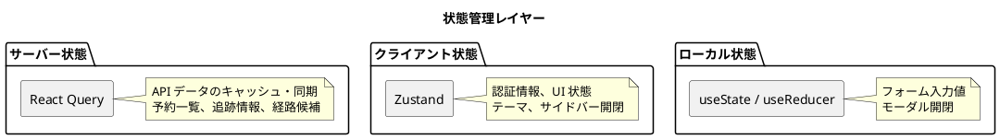

# フロントエンドアーキテクチャ設計

## 概要

バックエンドのマイクロサービス群が提供する REST API を消費する SPA（Single Page Application）を構築する。主な利用者は営業担当者・経路設計者・追跡管理者・荷役作業員・経理担当者であり、社内業務ツール・ダッシュボードとしての性質が強いため、SEO よりもインタラクティビティを優先する。

## アーキテクチャ決定

### レンダリング戦略

| 判断項目 | 判定 | 理由 |
| :--- | :--- | :--- |
| SEO 重要度 | 低 | 社内業務ツール。追跡照会は認証不要だが SEO 不要 |
| インタラクティビティ | 高 | リアルタイム追跡、フォーム操作が中心 |
| 更新頻度 | 高 | 追跡情報はリアルタイム更新 |

**選定結果**: React SPA

### 状態管理

| 判断項目 | 判定 | 理由 |
| :--- | :--- | :--- |
| 状態管理複雑性 | 中程度 | サーバー状態（API データ）が中心 |
| 更新頻度 | 高 | 追跡情報のポーリング・WebSocket |
| 共有範囲 | 中 | 画面間でのデータ共有は限定的 |

**選定結果**: React Query（サーバー状態）+ Zustand（クライアント状態）

### スタイリング

| 判断項目 | 判定 | 理由 |
| :--- | :--- | :--- |
| パフォーマンス | 中 | 頻繁なレンダリングはあるが極端ではない |
| 開発速度 | 重視 | ユーティリティクラスで迅速にスタイル適用 |

**選定結果**: Tailwind CSS

## プロジェクト構造

中規模プロジェクトとして、フィーチャーベースの構造を採用する。

```text
src/
├── components/              # (1) 共通 UI コンポーネント
│   ├── ui/                  # 基本 UI パーツ（Button, Input, Modal, Table）
│   └── layout/              # レイアウトコンポーネント（Header, Sidebar）
├── config/                  # (2) アプリケーション設定
│   ├── constants.ts         # 定数定義（UN/LOCODE, ステータス等）
│   ├── env.ts               # 環境変数管理
│   └── api.ts               # API エンドポイント定義
├── features/                # (3) フィーチャー単位のコンポーネント
│   ├── booking/             # 貨物予約
│   │   ├── components/
│   │   ├── hooks/
│   │   └── types/
│   ├── routing/             # 経路設計
│   │   ├── components/
│   │   ├── hooks/
│   │   └── types/
│   ├── tracking/            # 荷役・追跡
│   │   ├── components/
│   │   ├── hooks/
│   │   └── types/
│   ├── billing/             # 精算
│   │   ├── components/
│   │   ├── hooks/
│   │   └── types/
│   └── auth/                # 認証
│       ├── components/
│       ├── hooks/
│       └── types/
├── layouts/                 # (4) アプリケーションレイアウト
│   ├── AppLayout.tsx
│   ├── AuthLayout.tsx
│   └── DashboardLayout.tsx
├── lib/                     # (5) 外部ライブラリ設定
│   ├── api-client.ts        # fetch ラッパー
│   └── auth.ts              # 認証ライブラリ設定
├── pages/                   # (6) ページコンポーネント
│   ├── BookingPage.tsx
│   ├── RoutingPage.tsx
│   ├── TrackingPage.tsx
│   ├── BillingPage.tsx
│   └── LoginPage.tsx
├── providers/               # (7) Context Provider
│   ├── AuthProvider.tsx
│   └── AppProviders.tsx
├── stores/                  # (8) 状態管理（Zustand）
│   ├── authStore.ts
│   └── uiStore.ts
├── types/                   # (9) TypeScript 型定義
│   ├── api.ts               # API 型定義
│   └── common.ts            # 共通型定義
└── utils/                   # (10) 汎用ユーティリティ
    ├── format.ts            # フォーマット関数
    └── validation.ts        # バリデーション
```

## コンポーネント設計

### Container/Presentational パターン

```tsx
// Container: ロジック担当
// features/booking/components/BookingListContainer.tsx
export function BookingListContainer() {
  const { data: bookings, isLoading } = useBookings();
  const handleCreate = useCallback((data: CreateBookingData) => {
    createBookingMutation.mutate(data);
  }, []);

  return (
    <BookingList
      bookings={bookings ?? []}
      loading={isLoading}
      onCreate={handleCreate}
    />
  );
}

// Presentational: UI 担当
// features/booking/components/BookingList.tsx
interface Props {
  bookings: BookingSummary[];
  loading: boolean;
  onCreate: (data: CreateBookingData) => void;
}

export function BookingList({ bookings, loading, onCreate }: Props) {
  if (loading) return <LoadingSpinner />;
  return (
    <div>
      {bookings.map(booking =>
        <BookingItem key={booking.bookingId} data={booking} />
      )}
      <CreateButton onClick={onCreate} />
    </div>
  );
}
```

### Custom Hooks パターン

```tsx
// features/booking/hooks/useBookings.ts
export function useBookings() {
  return useQuery({
    queryKey: ['bookings'],
    queryFn: () => apiClient.get<BookingSummary[]>('/api/booking/cargos'),
  });
}

// features/tracking/hooks/useTracking.ts
export function useTracking(trackingNumber: string) {
  return useQuery({
    queryKey: ['tracking', trackingNumber],
    queryFn: () => apiClient.get<TrackingInfo>(`/api/tracking/${trackingNumber}`),
    refetchInterval: 30000, // 30秒ごとにポーリング
  });
}
```

## 状態管理戦略



## 画面構成

### 主要画面一覧

| 画面 | パス | 対応 UC | 利用者 |
| :--- | :--- | :--- | :--- |
| ログイン | /login | - | 全ユーザー |
| ダッシュボード | /dashboard | - | 全ユーザー |
| 予約一覧 | /booking | UC03 | 営業担当者 |
| 予約登録 | /booking/new | UC03 | 営業担当者 |
| 予約詳細 | /booking/:id | UC04, UC11 | 営業担当者 |
| 航海スケジュール管理 | /routing/voyages | UC19 | 経路設計者 |
| 経路設計 | /routing/design/:bookingId | UC05-UC10 | 経路設計者 |
| 追跡照会 | /tracking/:trackingNumber | UC15 | 荷主、荷受人 |
| 荷役作業記録 | /tracking/handling | UC13 | 荷役作業員 |
| 精算管理 | /billing | UC17, UC18 | 経理担当者 |

## API 連携

### API クライアント設計

```tsx
// lib/api-client.ts
const BASE_URL = import.meta.env.VITE_API_BASE_URL;

async function request<T>(path: string, options: RequestInit = {}): Promise<T> {
  const token = useAuthStore.getState().token;
  const headers: HeadersInit = {
    'Content-Type': 'application/json',
    ...(token ? { Authorization: `Bearer ${token}` } : {}),
    ...options.headers,
  };

  const response = await fetch(`${BASE_URL}${path}`, { ...options, headers });

  if (response.status === 401) {
    useAuthStore.getState().logout();
    throw new Error('Unauthorized');
  }

  if (!response.ok) {
    const error = await response.json().catch(() => ({}));
    throw new ApiError(response.status, error.message ?? 'Request failed');
  }

  return response.json();
}

export const apiClient = {
  get: <T>(path: string) => request<T>(path),
  post: <T>(path: string, body: unknown) =>
    request<T>(path, { method: 'POST', body: JSON.stringify(body) }),
  put: <T>(path: string, body: unknown) =>
    request<T>(path, { method: 'PUT', body: JSON.stringify(body) }),
  delete: <T>(path: string) =>
    request<T>(path, { method: 'DELETE' }),
};
```

## テスト戦略

| テスト種別 | ツール | 対象 |
| :--- | :--- | :--- |
| ユニットテスト | Vitest | Custom Hooks, ユーティリティ関数 |
| コンポーネントテスト | Testing Library | Presentational コンポーネント |
| 統合テスト | Testing Library + MSW | Container コンポーネント + API モック |
| E2E テスト | Playwright | 主要フロー（予約→経路設計→追跡） |

## 技術スタック

| カテゴリ | 技術 | バージョン |
| :--- | :--- | :--- |
| フレームワーク | React | 19.x |
| ビルドツール | Vite | 6.x |
| 言語 | TypeScript | 5.x |
| サーバー状態管理 | TanStack Query (React Query) | 5.x |
| クライアント状態管理 | Zustand | 5.x |
| スタイリング | Tailwind CSS | 4.x |
| ルーティング | React Router | 7.x |
| HTTP クライアント | fetch (built-in) | - |
| テスト | Vitest, Testing Library, Playwright | - |

## 参照

- [要件定義書](../requirements/requirements_definition.md)
- [ユーザーストーリー](../requirements/user_story.md)
- [バックエンドアーキテクチャ設計](architecture_backend.md)
- [アーキテクチャ設計ガイド](../reference/アーキテクチャ設計ガイド.md)
