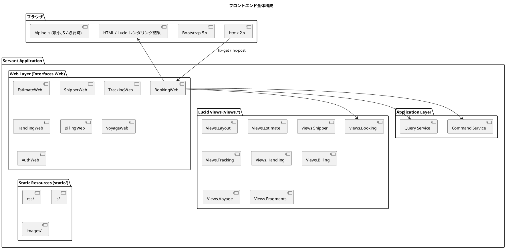
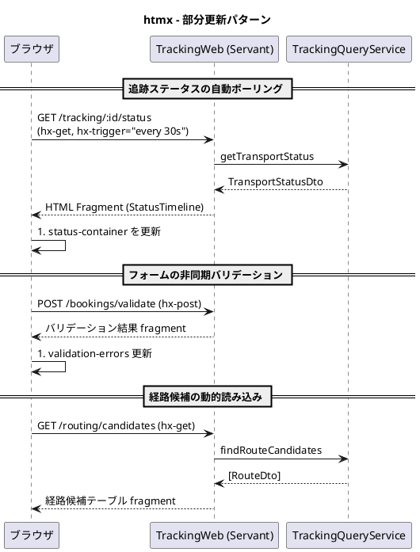
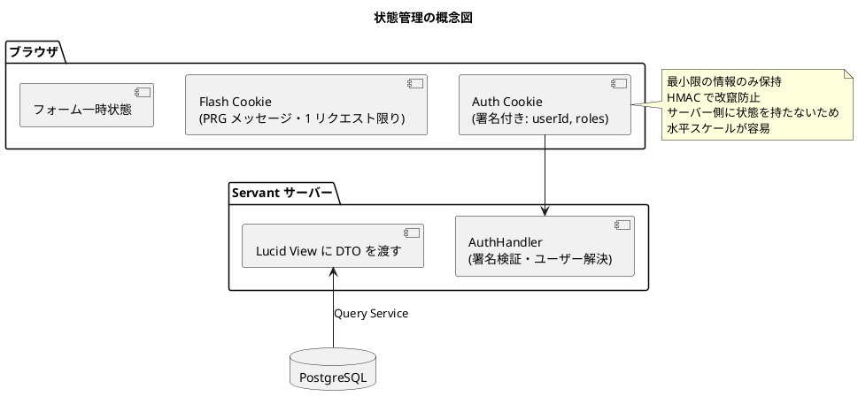

# フロントエンドアーキテクチャ - 国際貨物輸送管理システム (Haskell 版)

## 概要

業務系 Web システムとして、**Lucid (Haskell の HTML DSL) による SSR** を基本とし、
部分的な動的更新に **htmx 2.x** を組み合わせる構成を採用する。
Twirl 相当のテンプレート機能を Lucid の型安全な HTML EDSL で代替し、Haskell の型システムでテンプレートの整合性を保証する。

## アーキテクチャパターン選択

### SSR + htmx の選定理由

| 評価軸 | SPA (React/Vue) | **SSR + htmx (採用)** |
| :--- | :--- | :--- |
| 実装複雑度 | 高 (フロントエンドビルドパイプライン必要) | **低** (Servant に統合、追加ビルド不要) |
| SEO / アクセシビリティ | 追加対応必要 | **容易** (HTML をサーバーで生成) |
| リアルタイム更新 | WebSocket / SSE | **htmx で部分更新** (要件を十分満たす) |
| 開発者体験 (バックエンド重視) | フロント専門知識必要 | **Haskell エンジニアが一貫して開発可能** |
| 初期表示速度 | 遅い (JS バンドル) | **速い** (HTML 直接) |
| テンプレートの型安全性 | TypeScript で担保 | **Lucid は Haskell コードそのものでコンパイル時検査** |

業務系 Web アプリで画面数は限定的、リアルタイム要件は追跡ステータスの部分更新が主であるため、
SPA の複雑さを導入するメリットがなく、Servant との統合が自然な **Lucid + htmx** を採用する。
Lucid テンプレートは Haskell の関数として記述され、引数の型誤りや存在しないフィールド参照はコンパイル時に検出される。

## 全体構成



## 画面構成

### 主要画面一覧

全画面の一覧・対応 US は [UI 設計](ui_design.md) を正とする。主要画面は以下のとおり。

| 画面 | URL | 説明 | アクター |
| :--- | :--- | :--- | :--- |
| ダッシュボード | `/` | サマリー・最新荷役情報 | 全ロール |
| 見積一覧・作成・詳細 | `/estimates`, `/estimates/new`, `/estimates/:id` | 見積作成・ルート候補 | 営業担当者 |
| 荷主一覧・登録 | `/shippers`, `/shippers/new` | 荷主管理 | 営業担当者 |
| 貨物予約一覧 | `/bookings` | 予約一覧・検索 | 荷主、営業担当者 |
| 貨物予約登録 | `/bookings/new` | 新規予約フォーム | 営業担当者 |
| 予約詳細 | `/bookings/:id` | 予約・経路・荷役履歴 | 荷主、営業担当者 |
| 経路割り当て | `/bookings/:id/route` | 航海検索・経路確定 | 経路設計者 |
| 貨物追跡入力 | `/tracking` | 追跡番号入力 | 荷主、荷受人、追跡管理者 |
| 追跡詳細 | `/tracking/:number` | ステータス履歴・例外登録 | 荷主、追跡管理者 |
| 公開貨物追跡 | `/public/tracking/:number` | 認証不要照会 | 荷主・荷受人 (未認証) |
| 荷役作業登録 | `/handling/new` | 荷役イベント登録 | 荷役作業員 |
| 荷役作業一覧 | `/handling` | 荷役履歴 | 荷役作業員、追跡管理者 |
| 航路一覧・スケジュール登録/更新 | `/voyages`, `/voyages/new`, `/voyages/:vn/edit` | 航海スケジュール管理 | 経路設計者 |
| 請求書一覧・詳細 | `/billing/invoices`, `/billing/invoices/:id` | 請求書管理 | 経理担当者 |
| ログイン | `/login` | フォームログイン | 全ロール |

### 画面遷移図

```plantuml
@startuml
title 主要画面遷移図

[*] --> ログイン画面
ログイン画面 --> ダッシュボード : 認証成功
ダッシュボード --> 貨物予約一覧
ダッシュボード --> 貨物追跡
ダッシュボード --> 荷役作業一覧

state "予約フロー" {
  貨物予約一覧 --> 貨物予約登録
  貨物予約一覧 --> 予約詳細
  貨物予約登録 --> 予約詳細 : PRG
  予約詳細 --> 経路割り当て
  経路割り当て --> 予約詳細 : PRG
}

state "追跡フロー" {
  貨物追跡 --> 追跡詳細 : 追跡番号入力
}

state "荷役フロー" {
  荷役作業一覧 --> 荷役作業登録
  荷役作業登録 --> 荷役作業一覧 : PRG
}

@enduml
```

## コンポーネント設計方針

### Lucid ビュー構成

Twirl の `app/views/` 相当を `src/Cargotracker/Views/` 配下に Haskell モジュールとして配置する。

```text
src/Cargotracker/Views/
├── Layout.hs                -- main / nav / footer (関数として提供)
├── Fragments.hs             -- alerts / pagination / statusBadge / cargoSummary
├── Estimate/
│   ├── Index.hs
│   ├── New.hs
│   ├── Show.hs
│   └── RouteCandidates.hs   -- htmx 部分更新用
├── Shipper/
│   ├── Index.hs
│   └── New.hs
├── Booking/
│   ├── Index.hs
│   ├── New.hs
│   ├── Show.hs
│   ├── Route.hs
│   └── CargoRow.hs          -- htmx 部分更新用
├── Tracking/
│   ├── Index.hs
│   ├── Show.hs
│   └── StatusTimeline.hs    -- htmx 部分更新用
├── Handling/
│   ├── Index.hs
│   └── New.hs
├── Billing/
│   └── Invoices/
│       ├── Index.hs
│       └── Show.hs
├── Voyage/
│   ├── Index.hs
│   ├── New.hs
│   └── Edit.hs
└── Auth/
    └── Login.hs
```

### Lucid ビュー設計原則

| 原則 | 内容 |
| :--- | :--- |
| **レイアウト合成** | `mainLayout :: Text -> Html () -> Html ()` のような関数として共通レイアウトを提供。各画面は `mainLayout "タイトル" $ do ...` の形で合成 |
| **フラグメント分離** | 再利用可能 UI 部品は `Views.Fragments` にパラメータ化された関数として配置 |
| **htmx 用フラグメント** | 部分更新対象は専用モジュール (`StatusTimeline.hs` 等) として定義し、ハンドラから単体でレンダリング可能にする |
| **フォーム型** | フォームデータは `data BookCargoForm = ...` で表現。`Web.FormUrlEncoded` の `FromForm` インスタンスでバインド |
| **DTO 渡し** | ビューに渡すデータは Query Service の DTO (`data` レコード)。ドメインモデルを直接渡さない |
| **型安全なパラメータ** | ビューは Haskell の関数なので、引数の型不一致はコンパイル時に検出される |

```haskell
-- Views/Layout.hs
mainLayout :: Text -> Maybe FlashMessage -> Html () -> Html ()
mainLayout title flashMsg content = doctypehtml_ $ do
  head_ $ do
    title_ (toHtml (title <> " - Cargo Tracker"))
    link_ [rel_ "stylesheet", href_ "/static/css/bootstrap.min.css"]
    script_ [src_ "/static/js/htmx.min.js", defer_ ""] T.empty
    meta_ [name_ "csrf-token", content_ "{{CSRF}}"]  -- ハンドラで埋め込み
  body_ $ do
    navView
    main_ [class_ "container"] $ do
      alertsView flashMsg
      content
    footerView

-- Views/Booking/Index.hs
indexView :: [BookingSummary] -> Pagination -> Html ()
indexView summaries page = mainLayout "貨物予約一覧" Nothing $ do
  h1_ "貨物予約一覧"
  table_ [class_ "table"] $
    mapM_ cargoRowView summaries
  paginationView page
```

### Servant ハンドラとの統合

```haskell
type BookingWebAPI =
       "bookings" :> Get '[HTML] (Html ())
  :<|> "bookings" :> "new" :> Get '[HTML] (Html ())
  :<|> "bookings" :> Capture "id" Text :> Get '[HTML] (Html ())

-- HTML コンテンツタイプは servant-lucid が提供
bookingWebServer :: ServerT BookingWebAPI AppM
bookingWebServer = listBookings :<|> newBookingForm :<|> showBooking
  where
    listBookings = do
      summaries <- findBookingSummaries
      pure (Booking.Index.indexView summaries defaultPagination)
```

## htmx による動的更新

### htmx 適用パターン



### htmx 使用ガイドライン

| ユースケース | htmx 属性 | 説明 |
| :--- | :--- | :--- |
| **フォーム送信 (非同期)** | `hx-post`, `hx-target`, `hx-swap` | 特定領域のみ更新 |
| **ステータスポーリング** | `hx-get`, `hx-trigger="every 30s"` | 追跡ステータス定期取得 |
| **インクリメンタル検索** | `hx-get`, `hx-trigger="input changed delay:300ms"` | 入力に応じた結果更新 |
| **確認ダイアログ** | `hx-confirm` | 削除・キャンセル確認 |
| **ローディング表示** | `hx-indicator` | スピナー表示 |
| **ページネーション** | `hx-get`, `hx-target` | 部分更新ページング |

### htmx ハンドラ設計

htmx リクエストは `HX-Request: true` ヘッダで識別する。Servant の `Header "HX-Request" Text` で受け取る。

```haskell
type StatusEndpoint =
  "tracking" :> Capture "id" Text :> "status"
    :> Header "HX-Request" Text
    :> Get '[HTML] (Html ())

statusHandler :: Text -> Maybe Text -> AppM (Html ())
statusHandler trackingNumber hxReq = do
  statusDto <- getStatus trackingNumber
  if hxReq == Just "true"
    then pure (Tracking.StatusTimeline.fragmentView statusDto)
    else pure (Tracking.Show.fullView statusDto)
```

## 状態管理

### サーバーサイド状態管理

SSR ではアプリケーション状態はサーバー側 (DB) で管理する。
Servant 側の認証情報は **JWT または HMAC 署名付き Cookie** で保持し、内容の改竄は署名検証で防ぐ。
セッションには最小限の認証情報 (`userId`, `roles`) のみを格納する。



### PRG パターン

フォーム送信後は必ず PRG (Post-Redirect-Get) で二重送信を防ぐ。

| 操作 | フロー |
| :--- | :--- |
| 予約登録成功 | `POST /bookings` → `303 See Other`, `Location: /bookings/:id` |
| 荷役登録成功 | `POST /handling` → `303 See Other`, `Location: /handling` |
| 経路割り当て | `POST /bookings/:id/route` → `303 See Other`, `Location: /bookings/:id` |

成功・エラーメッセージは Flash Cookie で次リクエストに渡し、`Fragments.alertsView` で表示する。

```haskell
createBooking :: BookCargoForm -> AppM (Headers '[Header "Location" Text, Header "Set-Cookie" Text] NoContent)
createBooking form =
  case toCommand form of
    Left err -> throwError err400  -- バリデーションエラー
    Right cmd -> do
      result <- bookCargo cmd
      case result of
        Right bookingId ->
          pure $ addHeader ("/bookings/" <> idToText bookingId)
               $ addHeader (flashCookie "success" "貨物予約を登録しました")
                 NoContent
        Left domainErr -> throwError (domainErrorToServerError domainErr)
```

## セキュリティ考慮

### CSRF 対策

Servant にデフォルトの CSRF Filter はないため、**Double Submit Cookie パターン** または
`servant-csrf` ライブラリで保護する。基本方針:

1. `GET` リクエスト時にランダムトークンを Cookie + meta タグに発行
2. `POST`/`PUT`/`DELETE` 時に `X-CSRF-Token` ヘッダで送信させ、Cookie 値と一致検証

```html
<!-- Layout.hs で埋め込み -->
<meta name="csrf-token" content="{{TOKEN}}"/>

<!-- htmx の自動 CSRF ヘッダ送信 -->
<script>
  document.addEventListener('htmx:configRequest', (event) => {
    const csrfToken = document.querySelector('meta[name="csrf-token"]').content;
    event.detail.headers['X-CSRF-Token'] = csrfToken;
  });
</script>
```

Servant 側はカスタムミドルウェアで突き合わせを行う。

### 入力検証

3 段階で実施。

| 段階 | 実装 | 内容 |
| :--- | :--- | :--- |
| **クライアントサイド** | HTML5 / Bootstrap | `required`, `pattern` 属性で即時 |
| **サーバー (形式)** | `FromForm` + `validate :: Form -> Either [FieldError] DomainCommand` | 必須・型・範囲を検証 |
| **サーバー (業務ルール)** | ドメイン層スマートコンストラクタ | `Either DomainError a` |

検証エラーは同じフォーム画面に戻し、エラーメッセージをフィールド毎に表示する。

### XSS 対策

Lucid の `toHtml` は HTML エスケープを自動的に行う。`toHtmlRaw` (生 HTML 注入) は原則使用しない。
ユーザー入力を生 HTML として表示する場合は、明示的サニタイズ (例: `xss-sanitize` ライブラリ) を経由する。

## 静的アセット

```text
static/
├── css/
│   ├── bootstrap.min.css
│   └── custom.css
├── js/
│   ├── htmx.min.js
│   ├── alpine.min.js          -- 必要時のみ
│   └── app.js                 -- htmx 設定・CSRF 自動付与
└── images/
```

Servant の `Servant.Server.StaticFiles.serveDirectoryWebApp` で配信する。

## 参照

- [バックエンドアーキテクチャ](architecture_backend.md)
- [UI 設計](ui_design.md)
- Scala 版参考: `tmp/case-study-cargo-tracker/docs/design/architecture_frontend.md`
