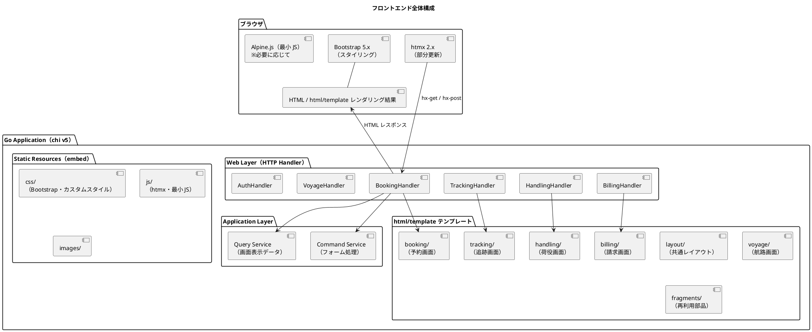
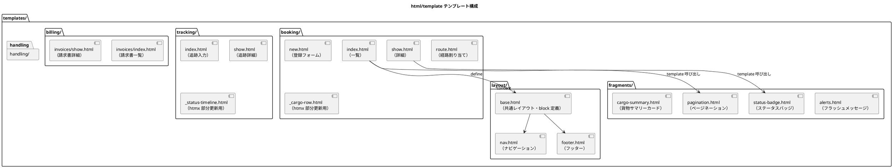
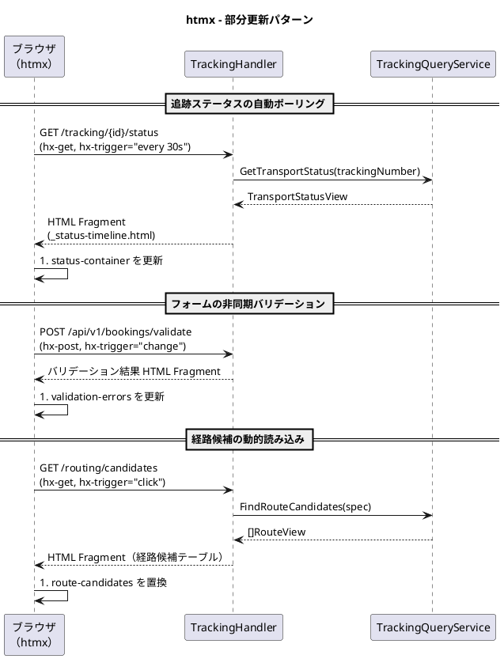
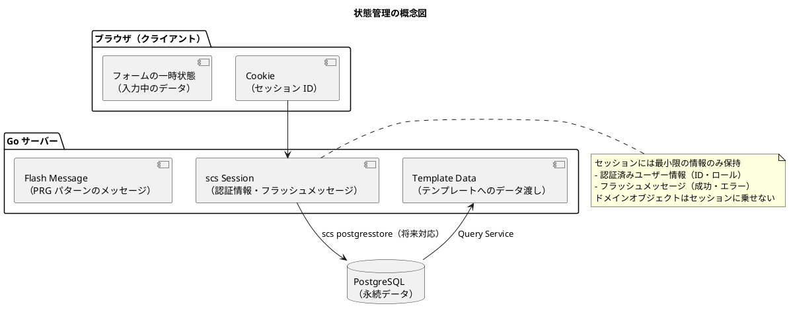

# フロントエンドアーキテクチャ - 国際貨物輸送管理システム

## 概要

本ドキュメントでは、国際貨物輸送管理システムのフロントエンドアーキテクチャを定義する。
業務系 Web システムとして、**Go 標準の html/template による SSR（サーバーサイドレンダリング）** を基本とし、
部分的な動的更新に **htmx 2.x** を組み合わせることで、シンプルかつ保守性の高い UI を実現する。

## アーキテクチャパターン選択

### SSR + htmx の選定理由

| 評価軸 | SPA（React/Vue） | **SSR + htmx（採用）** |
| :--- | :--- | :--- |
| 実装複雑度 | 高（フロントエンドビルドパイプライン、状態管理が必要） | **低**（Go バイナリに統合、追加ビルド不要） |
| SEO / アクセシビリティ | 追加対応が必要 | **容易**（HTML がサーバーで生成される） |
| リアルタイム更新 | 容易（WebSocket / SSE） | **htmx で部分更新**（十分な要件を満たす） |
| 開発者体験（バックエンド重視） | フロント専門知識が必要 | **Go エンジニアが一貫して開発可能** |
| 初期表示速度 | 遅い（JS バンドルの読み込み） | **速い**（HTML を直接レスポンス） |

本システムは業務系 Web アプリケーションであり、画面数は限定的で、リアルタイム更新要件も荷物追跡ステータスの部分更新が主である。
SPA の複雑さを導入するメリットがなく、Go 標準ライブラリと親和性の高い **html/template + htmx** を採用する。

## 全体構成



## 画面構成

画面一覧・画面遷移図・各画面のワイヤーフレームとインタラクション詳細は [UI 設計](ui_design.md) を参照してください。

本ドキュメントでは、UI 設計で定義された各画面を html/template + htmx でどのように実現するか（テンプレート構成、部分更新、状態管理、セキュリティ）のアーキテクチャ方針を定義します。

## コンポーネント設計方針

### html/template テンプレート構成



### html/template テンプレート設計原則

| 原則 | 内容 |
| :--- | :--- |
| **レイアウト合成** | `layout/base.html` に `{{block "content" .}}` を定義し、各画面テンプレートが `{{define "content"}}` で本文を提供する。ページごとに base + ページテンプレートをセットでパースする |
| **フラグメント分離** | 再利用可能な UI 部品は `fragments/` に `{{define "..."}}` で切り出し、`{{template "..." .}}` で呼び出す |
| **htmx 用フラグメント** | 部分更新対象の HTML は `_prefix` 付きテンプレートとして定義し、単独でレンダリング可能にする |
| **フォームオブジェクト** | フォームデータは専用のフォーム構造体（`BookCargoForm`）にデコードし、バリデーションエラーとともにテンプレートへ渡す |
| **ViewModel の使用** | テンプレートに渡すデータは Query Service からの ViewModel（DTO）を使用する。ドメインモデルを直接渡さない |
| **embed による同梱** | テンプレートと静的資産は `embed.FS` でバイナリに同梱し、単一バイナリデプロイを実現する |

レイアウト合成の例を以下に示す。

```html
<!-- layout/base.html -->
<!DOCTYPE html>
<html lang="ja">
<head>
  <title>{{block "title" .}}Cargo Tracker{{end}}</title>
  <link rel="stylesheet" href="/static/css/bootstrap.min.css">
  <script src="/static/js/htmx.min.js" defer></script>
</head>
<body>
  {{template "nav" .}}
  <main class="container">
    {{template "alerts" .}}
    {{block "content" .}}{{end}}
  </main>
  {{template "footer" .}}
</body>
</html>
```

```html
<!-- booking/index.html -->
{{define "title"}}貨物予約一覧 - Cargo Tracker{{end}}
{{define "content"}}
<h1>貨物予約一覧</h1>
<table class="table">
  {{range .Cargos}}
    {{template "cargo-row" .}}
  {{end}}
</table>
{{template "pagination" .Page}}
{{end}}
```

## htmx による動的更新

### htmx 適用パターン



### htmx 使用ガイドライン

| ユースケース | htmx 属性 | 説明 |
| :--- | :--- | :--- |
| **フォーム送信（非同期）** | `hx-post`, `hx-target`, `hx-swap` | フォーム送信後に特定領域のみ更新 |
| **ステータスポーリング** | `hx-get`, `hx-trigger="every 30s"` | 追跡ステータスを定期取得 |
| **インクリメンタル検索** | `hx-get`, `hx-trigger="input changed delay:300ms"` | 検索フォームの入力に応じて結果を更新 |
| **確認ダイアログ** | `hx-confirm` | 削除・キャンセル操作前の確認ポップアップ |
| **ローディング表示** | `hx-indicator` | リクエスト中のスピナー表示 |
| **ページネーション** | `hx-get`, `hx-target` | ページ切り替えを部分更新で実現 |

### htmx ハンドラ設計

htmx からのリクエストは `HX-Request: true` ヘッダーで識別する。
通常のページリクエストと htmx リクエストを同一エンドポイントで処理する場合は、
フラグメントテンプレートのみをレンダリングするか全ページをレンダリングするかを
`r.Header.Get("HX-Request")` で判定する。

```go
func (h *TrackingHandler) GetTrackingStatus(w http.ResponseWriter, r *http.Request) {
    trackingNumber := chi.URLParam(r, "trackingNumber")

    status, err := h.trackingQueryService.GetStatus(r.Context(), trackingNumber)
    if err != nil {
        http.Error(w, "not found", http.StatusNotFound)
        return
    }

    data := map[string]any{"Status": status}

    // htmx リクエストの場合はフラグメントのみ返す
    if r.Header.Get("HX-Request") == "true" {
        h.renderer.RenderFragment(w, "tracking/_status-timeline.html", "statusTimeline", data)
        return
    }
    h.renderer.RenderPage(w, r, "tracking/show.html", data)
}
```

## 状態管理

### サーバーサイド状態管理

SSR アーキテクチャでは、アプリケーション状態はサーバー側で管理する。
ブラウザ側では最小限のセッション情報のみを保持する。
セッション管理には alexedwards/scs を使用する。



### 認証・権限別 UI 制御

Thymeleaf の `sec:authorize` に相当する権限別表示制御は、
セッションから取得したユーザーロールをテンプレートデータに渡し、テンプレート内で分岐することで実現する。

```go
// ミドルウェアでセッションからユーザー情報を取得し、テンプレート共通データに設定する
currentUser := session.GetCurrentUser(r.Context())
data["CurrentUser"] = currentUser
```

```html
<!-- ロールに応じたメニュー表示（sec:authorize 代替） -->
{{if .CurrentUser.HasRole "SALES"}}
  <a class="nav-link" href="/bookings/new">新規予約</a>
{{end}}
{{if .CurrentUser.HasRole "ACCOUNTING"}}
  <a class="nav-link" href="/billing/invoices">請求書</a>
{{end}}
```

### PRG パターン（Post-Redirect-Get）

フォーム送信後は必ず PRG パターンを適用し、ブラウザのリロードによる二重送信を防ぐ。

| 操作 | フロー |
| :--- | :--- |
| 予約登録成功 | `POST /bookings` → `http.Redirect` で `/bookings/{bookingId}` へ |
| 荷役登録成功 | `POST /handling` → `http.Redirect` で `/handling` へ |
| 経路割り当て成功 | `POST /bookings/{id}/route` → `http.Redirect` で `/bookings/{id}` へ |

成功・エラーメッセージは scs セッションのフラッシュメッセージ
（`sessionManager.Put(ctx, "flash", msg)` → リダイレクト先で `sessionManager.PopString(ctx, "flash")`）で渡し、
`fragments/alerts.html` フラグメントで表示する。

## セキュリティ考慮

### CSRF 対策

CSRF 保護には justinas/nosurf ミドルウェアを使用し、chi のルーターに適用する。
テンプレートの `<form>` には nosurf のトークンを hidden field として明示的に埋め込む。

```go
// ルーター構築時に CSRF ミドルウェアを適用
r := chi.NewRouter()
r.Use(func(next http.Handler) http.Handler {
    csrfHandler := nosurf.New(next)
    csrfHandler.SetBaseCookie(http.Cookie{HttpOnly: true, Path: "/", Secure: true})
    return csrfHandler
})
```

```html
<!-- form には CSRF トークンを hidden field として埋め込む -->
<form action="/bookings" method="post">
  <input type="hidden" name="csrf_token" value="{{.CSRFToken}}">
  <!-- フォーム項目 -->
</form>
```

htmx の `hx-post` / `hx-put` / `hx-delete` 使用時は、CSRF トークンをリクエストヘッダーに含める。

```html
<!-- meta タグに CSRF トークンを埋め込む -->
<meta name="csrf-token" content="{{.CSRFToken}}">

<!-- htmx のグローバル設定で CSRF ヘッダーを自動送信 -->
<script>
  document.addEventListener('htmx:configRequest', (event) => {
    const csrfToken = document.querySelector('meta[name="csrf-token"]').content;
    event.detail.headers['X-CSRF-Token'] = csrfToken;
  });
</script>
```

### 入力検証

フォームの入力検証は 2 段階で行う。

| 段階 | 実装 | 内容 |
| :--- | :--- | :--- |
| **クライアントサイド** | HTML5 / Bootstrap バリデーション | `required`, `pattern` 属性による即時フィードバック |
| **サーバーサイド** | go-playground/validator | 構造体タグ（`validate:"required"` 等）で詳細なビジネスルール検証 |

サーバーサイドバリデーションエラーはフィールド名をキーとするエラーマップとしてテンプレートに渡し、
`{{with .Errors.origin}}<div class="invalid-feedback">{{.}}</div>{{end}}` のようにフィールドごとに表示する。

### XSS 対策

html/template はコンテキストに応じた自動エスケープ（contextual auto-escaping）を行う。
エスケープを無効化する `template.HTML` 型への変換は原則として使用しない。
ユーザー入力を HTML として出力する場合は、bluemonday 等でサニタイズする。

## ディレクトリ構成

```
apps/backend/
├── cmd/
│   └── server/
│       └── main.go                     # エントリポイント
├── internal/
│   ├── booking/
│   │   └── infrastructure/
│   │       └── web/
│   │           ├── booking_handler.go      # 画面用ハンドラ
│   │           └── booking_api_handler.go  # htmx / API 用ハンドラ
│   ├── tracking/
│   │   └── infrastructure/
│   │       └── web/
│   │           └── tracking_handler.go
│   └── (各コンテキスト同様)
│
└── web/                                # embed.FS で同梱
    ├── templates/
    │   ├── layout/
    │   │   ├── base.html               # 共通レイアウト（block 定義）
    │   │   └── nav.html                # ナビゲーション
    │   ├── fragments/
    │   │   ├── alerts.html             # フラッシュメッセージ
    │   │   ├── pagination.html         # ページネーション
    │   │   └── status-badge.html       # ステータスバッジ
    │   ├── booking/
    │   │   ├── index.html
    │   │   ├── new.html
    │   │   ├── show.html
    │   │   ├── route.html
    │   │   └── _cargo-row.html         # htmx 部分更新用フラグメント
    │   ├── tracking/
    │   │   ├── index.html
    │   │   ├── show.html
    │   │   └── _status-timeline.html   # htmx 部分更新用フラグメント
    │   ├── handling/
    │   │   ├── index.html
    │   │   └── new.html
    │   ├── billing/
    │   │   └── invoices/
    │   │       ├── index.html
    │   │       └── show.html
    │   └── auth/
    │       └── login.html
    └── static/
        ├── css/
        │   ├── bootstrap.min.css       # Bootstrap 5.3（ローカル配置）
        │   └── custom.css              # カスタムスタイル（Bootstrap 上書き）
        ├── js/
        │   ├── htmx.min.js             # htmx 2.0（ローカル配置）
        │   └── app.js                  # htmx 設定・最小 JS
        └── images/
```
