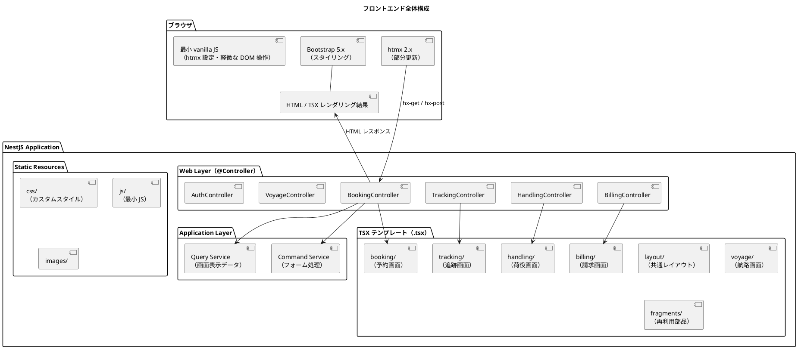
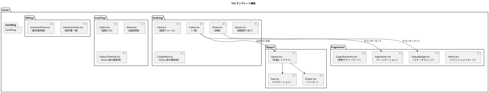
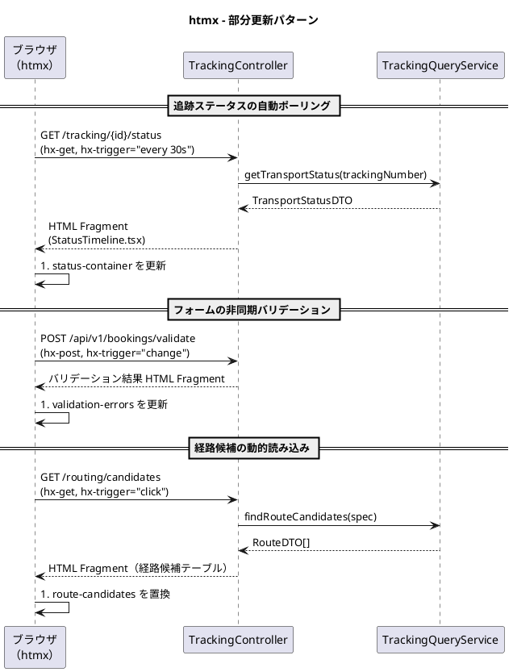
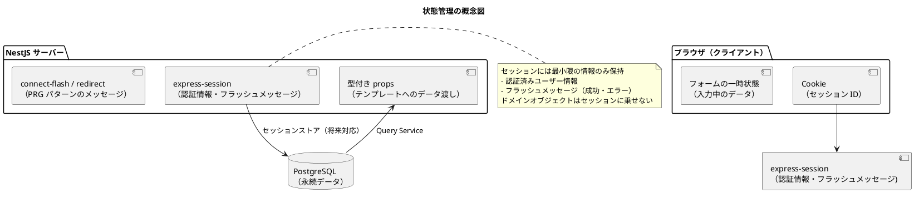

# フロントエンドアーキテクチャ - 国際貨物輸送管理システム

## 概要

本ドキュメントでは、国際貨物輸送管理システムのフロントエンドアーキテクチャを定義する。
業務系 Web システムとして、**TSX（サーバーサイド JSX レンダリング）による SSR（サーバーサイドレンダリング）** を基本とし、
部分的な動的更新に **htmx 2.x** を組み合わせることで、シンプルかつ保守性の高い UI を実現する。

テンプレートは React 19 の `react-dom/server`（`renderToStaticMarkup`）でサーバー上で静的 HTML へレンダリングする。
クライアント側での React 実行・ハイドレーションは行わず、ブラウザ側の動的挙動は従来どおり htmx 2.x が担う（SSR + 最小 JS 方針は不変）。

## アーキテクチャパターン選択

### SSR + htmx の選定理由

| 評価軸 | SPA（React/Vue） | **SSR + htmx（採用）** |
| :--- | :--- | :--- |
| 実装複雑度 | 高（フロントエンドビルドパイプライン、状態管理が必要） | **低**（NestJS に統合、クライアント JS バンドル不要） |
| SEO / アクセシビリティ | 追加対応が必要 | **容易**（HTML がサーバーで生成される） |
| リアルタイム更新 | 容易（WebSocket / SSE） | **htmx で部分更新**（十分な要件を満たす） |
| 開発者体験（バックエンド重視） | フロント専門知識が必要 | **TypeScript エンジニアが一貫して開発可能** |
| 型安全性 | 型は付くが、画面とドメイン型の整合は保証されない | **テンプレートも型検査対象**（props 経由で画面とドメイン型の整合をコンパイル時に保証） |
| 初期表示速度 | 遅い（JS バンドルの読み込み） | **速い**（HTML を直接レスポンス） |

本システムは業務系 Web アプリケーションであり、画面数は限定的で、リアルタイム更新要件も荷物追跡ステータスの部分更新が主である。
SPA の複雑さを導入するメリットがなく、NestJS との統合が容易な **TSX + htmx** を採用する。

> **クライアント JS の方針**: ブラウザ側の動的挙動は htmx と最小限の vanilla JS（htmx のグローバル設定・軽微な DOM 操作）で充足できるため、Alpine.js 等のクライアントフレームワークは導入しない。宣言的な状態管理を要する複雑な UI 要件が発生した時点で、導入の是非を ADR で判断する。

### TSX テンプレートを採用する理由

Nunjucks のような文字列テンプレートエンジンではなく TSX を採用する最大の理由は、**テンプレートも TypeScript の型検査対象になる**点である。
各テンプレートは型付きの props を受け取る関数コンポーネントとして定義するため、画面が要求するデータとドメイン層の DTO 型の整合をコンパイル時に保証できる。
DTO のフィールド名変更や型変更があった場合、テンプレート側の参照箇所が型エラーとして即座に検出されるため、
文字列テンプレートで起こりがちな「変数名のタイプミス」「渡し忘れ」「型の不一致」といった実行時まで顕在化しない不具合を排除できる。

## 全体構成



## 画面構成

画面一覧（17 画面）・画面遷移図・ワイヤーフレーム・インタラクション設計の詳細は [UI 設計](ui_design.md) を参照する。
本ドキュメントでは画面個別の設計は扱わず、全画面に共通するアーキテクチャ上の方針のみを定義する。

- 画面はすべて SSR（TSX テンプレート）でレンダリングし、動的更新は htmx による部分更新に限定する
- URL 設計は OOUX に基づくオブジェクト中心のパス（`/bookings`、`/tracking`、`/handling` 等）とし、一覧 → 詳細 → アクションの階層で統一する
- 登録・更新系の遷移は PRG パターン（Post-Redirect-Get）に従う
- ロール別の画面到達性（navbar・ダッシュボード導線）は [UI 設計](ui_design.md) のナビゲーション構成に従う

## コンポーネント設計方針

### TSX テンプレート構成



### TSX テンプレート設計原則

| 原則 | 内容 |
| :--- | :--- |
| **レイアウト合成** | 共通レイアウトは `Layout.tsx` コンポーネントとして定義し、各画面を `children` として合成する（Nunjucks の `extends` / `block` 継承に相当） |
| **型付き props** | 各テンプレートは型付きの props（`Props` インターフェース）を受け取る関数コンポーネントとして定義する。ロール別 UI 制御も props の `user` / `roles` で型安全に分岐する |
| **フラグメント分離** | 再利用可能な UI 部品は `fragments/` に切り出し、子コンポーネントとして再利用する |
| **htmx 用フラグメント** | 部分更新対象の HTML は独立した子コンポーネント（`StatusTimeline` など）として定義し、フラグメント単体でもレンダリングできるようにする |
| **フォームオブジェクト** | フォームデータは専用の DTO（`BookCargoForm`）として `class-validator` で検証する |
| **DTO の使用** | テンプレートに渡すデータは Query Service からの DTO を使用する。ドメインモデルを直接渡さない。DTO 型を props 型に用いることで画面とドメイン型の整合をコンパイル時に保証する |

## htmx による動的更新

### htmx 適用パターン



### htmx 使用ガイドライン

| ユースケース | htmx 属性 | 説明 |
| :--- | :--- | :--- |
| **フォーム送信（非同期）** | `hx-post`, `hx-target`, `hx-swap` | フォーム送信後に特定領域のみ更新 |
| **ステータスポーリング** | `hx-get`, `hx-trigger="every 30s"` | 追跡ステータスを定期取得 |
| **インクリメンタル検索** | `hx-get`, `hx-trigger="input changed delay:300ms"` | 検索フォームの入力に応じて結果を更新 |
| **確認ダイアログ** | `hx-confirm` | 削除・キャンセル操作前の確認ポップアップ |
| **ローディング表示** | `hx-indicator` | リクエスト中のスピナー表示 |
| **ページネーション** | `hx-get`, `hx-target` | ページ切り替えを部分更新で実現 |

### htmx コントローラー設計

htmx からのリクエストは `HX-Request: true` ヘッダーで識別する。
通常のページリクエストと htmx リクエストを同一エンドポイントで処理する場合は、
フラグメントのみを返すか全ページを返すかを `@Headers('HX-Request')`（または `@Req()` から取得）で判定する。

TSX テンプレートは `react-dom/server` の `renderToStaticMarkup` で HTML 文字列へレンダリングし、
`@Res()` で取得したレスポンスに書き出す。htmx リクエスト時はフラグメントコンポーネント（`StatusTimeline`）のみを、
通常リクエスト時は `Layout` でラップしたフルページ（`TrackingShow`）をレンダリングする。

```tsx
@Get('tracking/:trackingNumber/status')
async getTrackingStatus(
  @Param('trackingNumber') trackingNumber: string,
  @Headers('hx-request') hxRequest: string | undefined,
  @Res() res: Response,
): Promise<void> {
  const status = await this.trackingQueryService.getStatus(trackingNumber);
  // htmx リクエストの場合はフラグメントコンポーネントのみを描画する
  const html = hxRequest === 'true'
    ? renderToStaticMarkup(<StatusTimeline status={status} />)
    : renderToStaticMarkup(<TrackingShow status={status} />);
  res.type('text/html').send(html);
}
```

> `renderToStaticMarkup` はハイドレーション用の付加属性（`data-reactroot` など）を出力しないため、
> クライアント側で React を実行しない SSR 用途に適している。共通ラッパーとして `res.render` 相当のヘルパー
> （`renderPage(res, <Component .../>)`）を用意し、`<!DOCTYPE html>` の付与を一元化する。

### API バージョニング方針

エンドポイントは 2 系統に分け、バージョニングの扱いを区別する。

- **JSON API**（外部連携・将来のモバイルアプリ等が利用する機械可読エンドポイント）は `/api/v1/` プレフィックスでバージョニングし、後方互換性を破壊する変更時に `/api/v2/` を並行提供して段階移行できるようにする。
- **htmx 用 HTML フラグメントエンドポイント**（`GET /tracking/{id}/status` 等、部分更新の HTML 断片を返すエンドポイント）はバージョニングしない。フラグメントを消費するテンプレートと同一のデプロイ単位・ライフサイクルで更新されるため、サーバー・クライアントのバージョン齟齬が構造的に発生せず、URL にバージョンを持たせる必要がないためである。

## 状態管理

### サーバーサイド状態管理

SSR アーキテクチャでは、アプリケーション状態はサーバー側で管理する。
ブラウザ側では最小限のセッション情報のみを保持する。



### PRG パターン（Post-Redirect-Get）

フォーム送信後は必ず PRG パターンを適用し、ブラウザのリロードによる二重送信を防ぐ。

| 操作 | フロー |
| :--- | :--- |
| 予約登録成功 | `POST /bookings` → `res.redirect('/bookings/{bookingId}')` |
| 荷役登録成功 | `POST /handling` → `res.redirect('/handling')` |
| 経路割り当て成功 | `POST /bookings/{id}/route` → `res.redirect('/bookings/{id}')` |

成功・エラーメッセージは `connect-flash`（またはセッションへの一時格納）で渡し、
`Alerts` コンポーネントで表示する。

## セキュリティ考慮

### CSRF 対策

`csurf` 相当の CSRF ミドルウェア（`@nestjs/csrf` / `csrf-csrf` など）を導入し、CSRF 保護を有効にする。
CSRF トークンをテンプレートの props（`csrfToken`）として渡し、
`<form>` 内の hidden field に埋め込む。

```tsx
// TSX の form に CSRF トークンを埋め込む
export function BookingForm({ csrfToken }: { csrfToken: string }) {
  return (
    <form action="/bookings" method="post">
      <input type="hidden" name="_csrf" value={csrfToken} />
      {/* フォーム項目 */}
    </form>
  );
}
```

htmx の `hx-post` / `hx-put` / `hx-delete` 使用時は、CSRF トークンをリクエストヘッダーに含める。

```tsx
// meta タグに CSRF トークンを埋め込む（Layout コンポーネントの <head> 内）
<meta name="_csrf" content={csrfToken} />
<meta name="_csrf_header" content="x-csrf-token" />

// htmx のグローバル設定で CSRF ヘッダーを自動送信（public/js/app.js）
// document.addEventListener('htmx:configRequest', (event) => {
//   const csrfToken = document.querySelector('meta[name="_csrf"]').content;
//   const csrfHeader = document.querySelector('meta[name="_csrf_header"]').content;
//   event.detail.headers[csrfHeader] = csrfToken;
// });
```

### 入力検証

フォームの入力検証は 2 段階で行う。

| 段階 | 実装 | 内容 |
| :--- | :--- | :--- |
| **クライアントサイド** | HTML5 / Bootstrap バリデーション | `required`, `pattern` 属性による即時フィードバック |
| **サーバーサイド** | class-validator（`ValidationPipe`） | DTO のバリデーションデコレーターで詳細なビジネスルール検証 |

サーバーサイドバリデーションエラーは `ValidationPipe` の例外を捕捉し、
エラー情報をテンプレートの props（`errors`）に渡して、
TSX 側でフィールドごとにエラーメッセージを表示する。

### XSS 対策

React（`renderToStaticMarkup`）は JSX 式で埋め込んだ文字列を自動的に HTML エスケープする。
エスケープを回避する `dangerouslySetInnerHTML` は原則として使用しない。
ユーザー入力を HTML として出力する場合は、DOMPurify 等でサニタイズしてから `dangerouslySetInnerHTML` に渡す。

## ディレクトリ構成

```
apps/cargo-tracker/src/
├── contexts/
│   ├── booking/
│   │   └── presentation/
│   │       ├── booking.controller.ts       # TSX 画面用
│   │       └── booking-rest.controller.ts   # htmx / API 用
│   ├── tracking/
│   │   └── presentation/
│   │       └── tracking.controller.ts
│   └── (各コンテキスト同様)
│
├── views/
│   ├── render.tsx                 # renderToStaticMarkup ラッパー（renderPage ヘルパー）
│   ├── layout/
│   │   ├── Layout.tsx             # 共通レイアウト（children 合成）
│   │   └── Nav.tsx                # ナビゲーション
│   ├── fragments/
│   │   ├── Alerts.tsx             # フラッシュメッセージ
│   │   ├── Pagination.tsx         # ページネーション
│   │   └── StatusBadge.tsx        # ステータスバッジ
│   ├── booking/
│   │   ├── Index.tsx
│   │   ├── New.tsx
│   │   ├── Show.tsx
│   │   ├── Route.tsx
│   │   └── CargoRow.tsx           # htmx 部分更新用フラグメント
│   ├── tracking/
│   │   ├── Index.tsx
│   │   ├── Show.tsx
│   │   └── StatusTimeline.tsx     # htmx 部分更新用フラグメント
│   ├── handling/
│   │   ├── Index.tsx
│   │   └── New.tsx
│   ├── billing/
│   │   └── invoices/
│   │       ├── Index.tsx
│   │       └── Show.tsx
│   └── auth/
│       └── Login.tsx
└── public/                        # NestJS ServeStatic で配信
    ├── css/
    │   └── custom.css             # カスタムスタイル（Bootstrap 上書き）
    ├── js/
    │   └── app.js                 # htmx 設定・最小 JS
    ├── vendor/                    # npm 経由の静的アセット（htmx, bootstrap）
    └── images/
```

> TSX テンプレートは `tsconfig.json` の `jsx` を `react-jsx`（`jsxImportSource: "react"`）に設定してコンパイルする。
> サーバー実行時に `renderToStaticMarkup` で HTML 文字列化するため、クライアント向けの JS バンドルは生成しない。
> Bootstrap 5.3 / htmx 2.x は npm でインストールし、`node_modules` から `public/vendor/` へコピー（またはビルドタスクで配置）して
> NestJS の `ServeStaticModule` で配信する。従来の WebJars に相当する仕組みを npm パッケージ + ServeStatic で置き換える。
