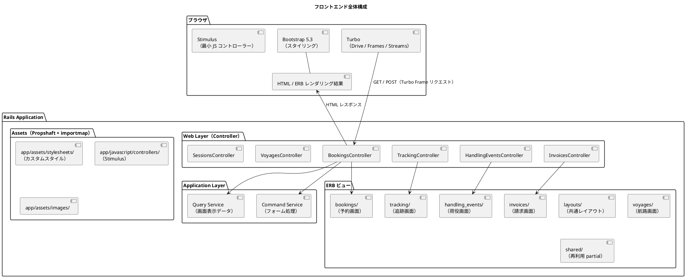
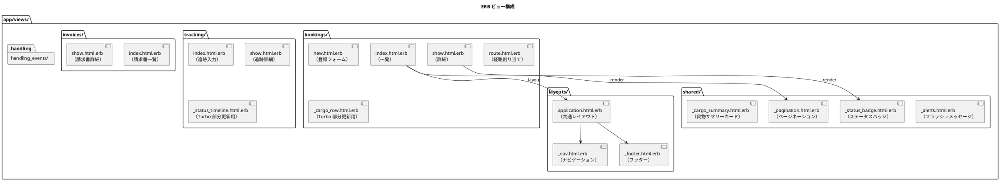
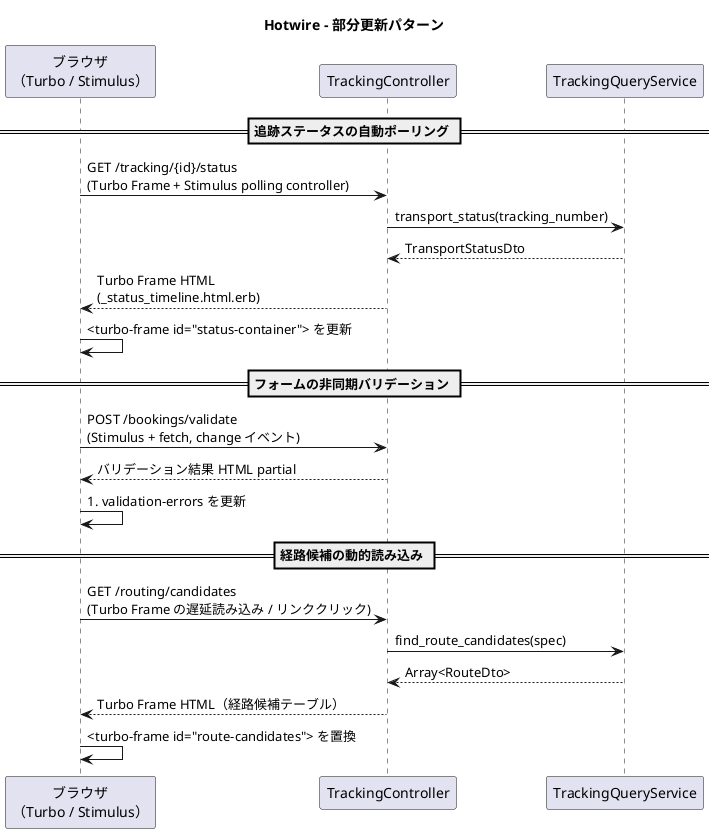
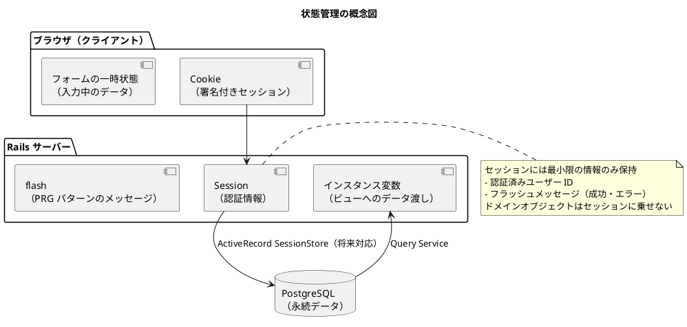

# フロントエンドアーキテクチャ - 国際貨物輸送管理システム

## 概要

本ドキュメントでは、国際貨物輸送管理システムのフロントエンドアーキテクチャを定義します。
業務系 Web システムとして、**ERB による SSR（サーバーサイドレンダリング）** を基本とし、
部分的な動的更新に **Hotwire（Turbo + Stimulus）** を組み合わせることで、シンプルかつ保守性の高い UI を実現します。
アセット管理は Rails 8.x 標準の **Propshaft + importmap-rails** を採用し、Node.js ビルドパイプラインを持ちません。

## アーキテクチャパターン選択

### SSR + Hotwire の選定理由

| 評価軸 | SPA（React/Vue） | **SSR + Hotwire（採用）** |
| :--- | :--- | :--- |
| 実装複雑度 | 高（フロントエンドビルドパイプライン、状態管理が必要） | **低**（Rails に統合、importmap により追加ビルド不要） |
| SEO / アクセシビリティ | 追加対応が必要 | **容易**（HTML がサーバーで生成される） |
| リアルタイム更新 | 容易（WebSocket / SSE） | **Turbo Frames / Turbo Streams で部分更新**（十分な要件を満たす） |
| 開発者体験（バックエンド重視） | フロント専門知識が必要 | **Ruby エンジニアが一貫して開発可能** |
| 初期表示速度 | 遅い（JS バンドルの読み込み） | **速い**（HTML を直接レスポンス） |

本システムは業務系 Web アプリケーションであり、画面数は限定的で、リアルタイム更新要件も荷物追跡ステータスの部分更新が主です。
SPA の複雑さを導入するメリットがなく、Rails との統合が容易な **ERB + Hotwire** を採用します。

## 全体構成



### Bootstrap 5.3 の導入方針

Bootstrap 5.3 は **cssbundling-rails を使わず、importmap + CDN（または vendored アセット）** で導入します。
CSS は `app/assets/stylesheets` に配置した配布版（`bootstrap.min.css`）を Propshaft で配信し、
JS（ドロップダウン・モーダル等）は importmap で `bootstrap` と `@popperjs/core` をピン留めします。
これにより Node.js 依存を持たず、Rails 標準のアセットパイプラインだけで完結します。

## 画面構成

画面一覧・画面遷移図・ワイヤーフレームの詳細は [UI 設計](ui_design.md) を参照してください。
本ドキュメントでは、フロントエンドアーキテクチャの観点から画面を以下の 4 つのフローに分類して扱います。

| フロー | 主な画面 | 特徴 |
| :--- | :--- | :--- |
| 予約フロー | 貨物予約一覧・登録・詳細、経路割り当て | フォーム中心、PRG パターン、Turbo による部分更新 |
| 追跡フロー | 貨物追跡入力、追跡詳細、公開貨物追跡 | 読み取り中心、Turbo Frame によるステータス自動更新 |
| 荷役フロー | 荷役作業一覧・登録 | 現場入力向けフォーム、バリデーションの即時フィードバック |
| 管理・精算フロー | 航路一覧、請求書一覧・詳細、割引ポリシー管理 | 一覧・検索中心、ロール別アクセス制御 |

## コンポーネント設計方針

### ERB ビュー構成



### ERB ビュー設計原則

| 原則 | 内容 |
| :--- | :--- |
| **レイアウト継承** | Rails のレイアウト機構（`layouts/application.html.erb`）で共通レイアウトを適用する |
| **partial 分離** | 再利用可能な UI 部品は `shared/` 配下の partial（`_prefix`）に切り出す。ViewComponent は導入せず partial ベースで簡潔に保つ |
| **Turbo 用 partial** | 部分更新対象の HTML は `turbo_frame_tag` で囲んだ partial として定義する |
| **フォームオブジェクト** | フォームデータは Active Model を include した専用のフォームオブジェクト（`BookCargoForm`）でバインドする |
| **DTO / ViewModel の使用** | ビューに渡すデータは Query Service からの読み取り専用オブジェクトを使用する。ドメインモデルを直接渡さない |

## Hotwire による動的更新

### Turbo 適用パターン



### Hotwire 使用ガイドライン

| ユースケース | 実現手段 | 説明 |
| :--- | :--- | :--- |
| **フォーム送信（非同期）** | Turbo Drive / `turbo_frame_tag` + 422 レスポンス | フォーム送信後に特定領域のみ更新。エラー時は `unprocessable_entity` でフォームを再描画 |
| **ステータスポーリング** | Turbo Frame の refresh（Stimulus polling controller で `frame.reload()`） | 追跡ステータスを 30 秒ごとに定期取得 |
| **インクリメンタル検索** | Stimulus controller（`input` イベント + debounce 300ms + `Turbo.visit` / frame 更新） | 検索フォームの入力に応じて結果を更新 |
| **確認ダイアログ** | `data: { turbo_confirm: "..." }` | 削除・キャンセル操作前の確認ポップアップ |
| **ローディング表示** | `turbo-frame[busy]` CSS / `aria-busy` 属性 | リクエスト中のスピナー表示 |
| **ページネーション** | `turbo_frame_tag` 内のリンク | ページ切り替えを部分更新で実現 |

### Turbo Frame コントローラー設計

Turbo Frame からのリクエストは `Turbo-Frame` ヘッダーで識別できます。
Rails では同一エンドポイントで全ページと partial の両方を返す判定を明示的に書かずとも、
`turbo_frame_tag` で囲まれた領域だけが差し替えられるため、通常は全ページを返すだけで十分です。
ポーリング用エンドポイントのように partial のみを返したい場合は、レイアウトなしでレンダリングします。

```ruby
class TrackingStatusesController < ApplicationController
  # GET /tracking/:tracking_number/status
  def show
    @status = TrackingQueryService.new.status(params[:tracking_number])

    if turbo_frame_request?
      # Turbo Frame リクエストの場合は partial のみ返す
      render partial: "tracking/status_timeline", locals: { status: @status }
    else
      render "tracking/show"
    end
  end
end
```

ポーリングを行う Stimulus controller の例を示します。

```javascript
// app/javascript/controllers/polling_controller.js
import { Controller } from "@hotwired/stimulus"

export default class extends Controller {
  static values = { interval: { type: Number, default: 30000 } }

  connect() {
    this.timer = setInterval(() => this.element.reload(), this.intervalValue)
  }

  disconnect() {
    clearInterval(this.timer)
  }
}
```

```erb
<%# 30 秒ごとにフレームを再読み込み %>
<%= turbo_frame_tag "status-container",
      src: tracking_status_path(@cargo.tracking_number),
      data: { controller: "polling", polling_interval_value: 30000 } do %>
  <%= render "tracking/status_timeline", status: @status %>
<% end %>
```

## 状態管理

### サーバーサイド状態管理

SSR アーキテクチャでは、アプリケーション状態はサーバー側で管理します。
ブラウザ側では最小限のセッション情報のみを保持します。



### PRG パターン（Post-Redirect-Get）

フォーム送信後は必ず PRG パターンを適用し、ブラウザのリロードによる二重送信を防ぎます。

| 操作 | フロー |
| :--- | :--- |
| 予約登録成功 | `POST /bookings` → `redirect_to booking_path(booking_id)` |
| 荷役登録成功 | `POST /handling` → `redirect_to handling_events_path` |
| 経路割り当て成功 | `POST /bookings/{id}/route` → `redirect_to booking_path(id)` |

成功・エラーメッセージは `redirect_to ..., notice: "..."` / `flash[:alert]` で渡し、
`shared/_alerts.html.erb` partial で表示します。
バリデーションエラー時はリダイレクトせず、`status: :unprocessable_entity`（422）でフォームを再描画し、
Turbo がフォーム領域を差し替えます。

## セキュリティ考慮

### CSRF 対策

Rails 標準の CSRF 保護（`protect_from_forgery`）がデフォルトで有効です。
`form_with` で生成したフォームには `authenticity_token` の hidden field が自動的に埋め込まれます。

```erb
<%# form_with は自動的に CSRF トークンを含む %>
<%= form_with model: @book_cargo_form, url: bookings_path do |f| %>
  <%# Rails が authenticity_token hidden field を自動付与 %>
<% end %>
```

Turbo および Rails UJS 相当の非 GET リクエストは、レイアウトの `csrf_meta_tags` から
トークンを取得して自動的に `X-CSRF-Token` ヘッダーに付与します。
Stimulus + fetch で独自リクエストを送る場合は、明示的にヘッダーへ含めます。

```erb
<%# レイアウトの head に CSRF メタタグを出力 %>
<%= csrf_meta_tags %>
```

```javascript
// Stimulus controller から fetch する場合の CSRF ヘッダー付与
const csrfToken = document.querySelector('meta[name="csrf-token"]').content

fetch("/bookings/validate", {
  method: "POST",
  headers: {
    "X-CSRF-Token": csrfToken,
    "Accept": "text/html"
  },
  body: new FormData(this.element)
})
```

### 入力検証

フォームの入力検証は 2 段階で行います。

| 段階 | 実装 | 内容 |
| :--- | :--- | :--- |
| **クライアントサイド** | HTML5 / Bootstrap バリデーション | `required`, `pattern` 属性による即時フィードバック |
| **サーバーサイド** | Active Model バリデーション | フォームオブジェクトの `validates` で詳細なビジネスルール検証 |

サーバーサイドバリデーションエラーはフォームオブジェクトの `errors` に集約し、
`status: :unprocessable_entity`（422）でフォームを再描画して、
`object.errors[:field]` をフィールドごとに表示します。Turbo はこのレスポンスを受けてフォーム部分を更新します。

### 表示の認可制御

ロールによる UI の出し分けは、ビューヘルパーと Pundit の policy を組み合わせて行います。

```erb
<%# policy による表示制御 %>
<% if policy(@cargo).assign_route? %>
  <%= link_to "経路を割り当て", route_booking_path(@cargo), class: "btn btn-primary" %>
<% end %>
```

### XSS 対策

ERB の `<%= %>` は HTML エスケープを自動的に行います。
HTML をそのまま出力する `raw` / `html_safe` は原則として使用しません。
ユーザー入力を HTML として出力する場合は、`sanitize` ヘルパーでサニタイズします。

## ディレクトリ構成

```
apps/backend/
├── app/
│   ├── controllers/
│   │   ├── bookings_controller.rb            # 画面 + Turbo Frame 用
│   │   ├── tracking_controller.rb
│   │   ├── tracking_statuses_controller.rb   # ポーリング用 partial 返却
│   │   ├── handling_events_controller.rb
│   │   ├── invoices_controller.rb
│   │   └── sessions_controller.rb
│   │
│   ├── views/
│   │   ├── layouts/
│   │   │   ├── application.html.erb    # 共通レイアウト
│   │   │   └── _nav.html.erb           # ナビゲーション
│   │   ├── shared/
│   │   │   ├── _alerts.html.erb        # フラッシュメッセージ
│   │   │   ├── _pagination.html.erb    # ページネーション
│   │   │   └── _status_badge.html.erb  # ステータスバッジ
│   │   ├── bookings/
│   │   │   ├── index.html.erb
│   │   │   ├── new.html.erb
│   │   │   ├── show.html.erb
│   │   │   ├── route.html.erb
│   │   │   └── _cargo_row.html.erb     # Turbo 部分更新用 partial
│   │   ├── tracking/
│   │   │   ├── index.html.erb
│   │   │   ├── show.html.erb
│   │   │   └── _status_timeline.html.erb  # Turbo 部分更新用 partial
│   │   ├── handling_events/
│   │   │   ├── index.html.erb
│   │   │   └── new.html.erb
│   │   ├── invoices/
│   │   │   ├── index.html.erb
│   │   │   └── show.html.erb
│   │   └── sessions/
│   │       └── new.html.erb            # ログイン画面
│   │
│   ├── javascript/
│   │   ├── application.js              # Turbo / Stimulus のエントリポイント
│   │   └── controllers/
│   │       ├── index.js
│   │       └── polling_controller.js   # ステータスポーリング
│   │
│   └── assets/
│       ├── stylesheets/
│       │   ├── bootstrap.min.css       # Bootstrap 5.3（vendored）
│       │   └── custom.css              # カスタムスタイル（Bootstrap 上書き）
│       └── images/
│
└── config/
    └── importmap.rb                    # turbo-rails / stimulus / bootstrap をピン留め
```
